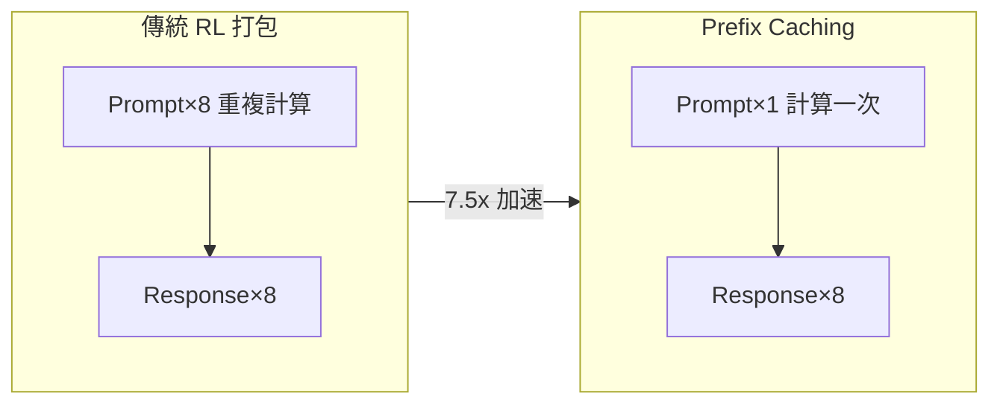
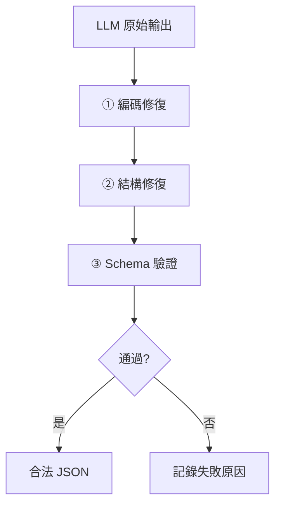

# AI Daily Digest — 2026-05-12

<!-- pipeline-generated:begin -->

## 🔥 今日 TOP 3
### 1. RL Prefix 分離技術：長 Prompt 訓練吞吐提速 7.5 倍
研究者在強化學習訓練管線中發現長期被忽視的計算冗餘：傳統 RL 引擎對每個採樣樣本重複打包完整 prompt，當 1000 token prompt 採樣 8 個 response 時，8800 token 計算量中有 6000 token 是完全重複計算。解決方案借用推理層 prefix caching 概念，只計算一次 prompt 前向傳播並緩存 KV，再分別對每個 response 反向傳播梯度；Qwen3.5-4B 實測 16k/64 配置達 7.5x 加速，16k/128 達 7.3x。

此技術對 RLHF、GRPO 等依賴長 system prompt 或 few-shot examples 的訓練管線影響最顯著；prompt/response 比例越懸殊收益越高，僅當 response 接近 prompt 長度時（如 8k/4k）加速比才降至 1.7x，而多數真實工作負載（指令遵從、程式碼生成）都落在高收益區間。相比前代做法，這是演算層的結構性改善，不是工程微調。

有意訓練 RL 模型的工程師應確認 veRL、OpenRLHF 等框架是否已支援此分離模式；評估前先測量訓練資料的 prompt/response token 比例，超過 4:1 即值得立即引入。實作難點在於需分別處理 full attention 與 linear attention 層的梯度流，可參考原始提案的差異化方案。

📖 [閱讀完整 insight](../10-insights/2026-05-11/inbox_49cfc2c1.md) · 🔗 [原文連結](https://www.reddit.com/r/LocalLLaMA/comments/1tage06/prompt_caching_but_for_rl_training_75x_speedup_on/)
### 2. AI 代理採用公式：生產力×N 需同步降維護成本 1/N
軟體工程師 James Shore 提出量化 AI 代理採用效益的精確公式：若代理將開發生產力提升 N 倍，維護成本必須同步降低至原本 1/N 以下，總成本才能不增加。具體數字：生產力×2 但維護成本×2，淨成本×4；生產力×2 但維護成本不變，淨成本×2；唯有生產力×2 且維護成本同時降低 50%，才能達到 break-even。

此公式的核心價值在於量化了多數工程團隊忽略的隱性風險：短期生產力紅利可能正在累積長期維護技術債。AI 生成程式碼往往缺乏可讀性、測試覆蓋不足，後續每次修改成本悄悄放大；此框架不限於 Claude Code，同樣適用於 Copilot、Cursor 及所有代理工具的評估決策，也適用於「是否全面推廣 AI 輔助開發」的組織策略判斷。

實務上，應在採用代理工具前建立維護基準指標（PR review 時間、bug 密度、新人 onboarding 時間），採用後定期比較。若維護指標惡化超過生產力增益的倒數，即是調整策略的明確訊號；寧可放慢速度保住代碼品質，而非為短期數字犧牲長期可維護性。

📖 [閱讀完整 insight](../10-insights/2026-05-11/inbox_a14ce066.md) · 🔗 [原文連結](https://simonwillison.net/2026/May/11/james-shore/#atom-everything)
### 3. 288 次 LLM 調用揭示 JSON 故障跨模型一致，修復順序決定成敗
一名開發者對 288 個 LLM 調用進行系統化分析，發現無論是 Llama 3、Mistral、DeepSeek 等開源模型還是多個主流閉源模型，JSON 輸出的故障模式幾乎完全相同。最常見三種問題依序為：markdown code fences 包裹 JSON、尾部逗號（trailing comma）、Python 型別（True/False/None）替代 JSON 布林。更關鍵發現是修復策略存在相依性順序——編碼修復必須先於結構修復，結構修復必須先於 schema 驗證，順序顛倒則修復系統性失敗。

此發現打破了「換更好模型就能解決 JSON 輸出問題」的假設：故障跨模型高度一致，根源在於 tokenization 與訓練數據中混合語言格式的系統性偏差，而非模型能力差異。這意味著任何依賴 LLM 生成 JSON 的後端服務都應建立通用的模型無關修復管線，而非在每次換模型時重新除錯。

實作上可直接引入 `pip install outputguard`（MIT 授權，無 LLM 提供商依賴），或參考其 15 步驟順序建立自訂管線。設計原則：將 LLM 輸出視為「可能格式不完整的文本」而非「可信任的 JSON」，在解析層加入有序容錯修復作為所有生產服務的標準防禦措施。

📖 [閱讀完整 insight](../10-insights/2026-05-11/inbox_750d007c.md) · 🔗 [原文連結](https://www.reddit.com/r/LocalLLaMA/comments/1tagtpv/i_catalogued_every_way_local_models_break_json/)

## 📖 好文章 / 影片精選

_過去 30 天經 traffic 沉澱的高品質內容，按興趣領域分類。每篇只在 column 出現一次。_
### 🛠 Claude Code 最新 release
- **[v2.1.139](../10-insights/2026-05-11/inbox_9814c0d5.md)**
  Claude Code 釋出 v2.1.139，引入 agent view（研究預覽）統一管理所有 session，以及 /goal command 讓 Claude 跨轉自動工作直到滿足完成條件，並即時顯示 elapsed/turns/tokens。新增 hook args 支援 string[] 形式直接執行命令無需 shell，plugin detai
- **[v2.1.129](../10-insights/2026-05-06/inbox_3ea195df.md)**
  Claude Code v2.1.129 帶來多項功能與修復：新增 --plugin-url 旗標支援從 URL 載入 plugin zip、CLAUDE_CODE_FORCE_SYNC_OUTPUT 環境變數強制同步輸出、CLAUDE_CODE_PACKAGE_MANAGER_AUTO_UPDATE 自動更新機制；調整 plugin manifests 要
- **[v2.1.128](../10-insights/2026-05-04/inbox_55dc8338.md)**
  Claude Code v2.1.128 發布包含多項功能改進與 bug 修復。核心改動包括：`/mcp` 命令現顯示已連接伺服器的工具計數及標記零工具伺服器；`EnterWorktree` 修復為從本地 HEAD 而非 `origin/<預設分支>` 創建分支，防止未推送提交遺失；修復平行 Bash 工具調用中讀取命令（grep、git diff、ls）失
### 📚 AI 知識管理
- **[I Failed 6 System Design Interviews in a Row — Then I Realized I Was Designing for 2026, Not 2018](../10-insights/2026-04-20/inbox_e6ceaa43.md)**
  系統設計面試在 2026 年的標準已大幅改變。舊式（2018-2022）答法強調微服務、NoSQL、分片設計；2026 實際獲勝點：(1)成本意識（AWS/GCP 月成本計算是常見追問），(2)可觀測性與故障優先（監控、故障模式、優雅降級、冪等性），(3)混合架構（單體 + 事件驅動）替代純微服務，(4)LLM/Agent 整合成新標準問題，(5)生產實踐思
- **[I Compared 4 Python Vector Databases. One Replaced Pinecone](../10-insights/2026-04-20/inbox_237e2cf5.md)**
  作者因 Pinecone 成本（200 萬向量規模時月費超 $70）轉向測試開源替代方案。在相同硬件環境（AWS EC2 c6i.2xlarge，8 vCPU/16GB RAM）上，對 Chroma、Weaviate、Qdrant、Milvus 四個 Python 向量數據庫進行實測比較，評估基準性能與開發者體驗。文章基於 200 萬個 1536 維向量（O
- **[Your RAG Gets Confidently Wrong as Memory Grows – I Built the Memory Layer That Stops It](../10-insights/2026-04-21/inbox_ec957b31.md)**
  文章揭示 RAG（檢索增強生成）系統的隱藏失敗模式：隨著記憶體/知識庫規模增長，模型準確度逐漸下降，但置信度卻反向上升，形成「高度自信卻大錯特錯」的現象。傳統監測系統難以察覺此類失敗，因為表面上系統「看起來」在工作。作者通過可重現實驗論證問題根源，並提出簡單的記憶層架構修復方案恢復可靠性。此模式對任何規模擴張的 RAG 系統都有啟示。
- **[How to Build a RAG System in Databricks (Step-by-Step Guide)](../10-insights/2026-04-24/inbox_e0b75309.md)**
  本文介紹如何在 Databricks 平台構建檢索增強生成（RAG）系統的完整步驟。RAG 讓 AI 系統能夠參考用戶自有文檔回答問題，而非僅依賴模型預訓練知識。文章涵蓋向量化、文檔存儲、語義檢索和提示工程的端到端工作流。Databricks 將這些步驟整合在統一平台上，降低了 RAG 系統的實現複雜度。
- **[Article: Orchestrating Agentic and Multimodal AI Pipelines with Apache Camel](../10-insights/2026-04-24/inbox_099d2409.md)**
  Vignesh Durai 在文章中闡述如何用 Apache Camel 與 LangChain4j 技術棧來工程化設計多模態 AI 代理系統。方案核心包含三大組件：LLM 為基礎的推理引擎、檢索增強生成（RAG）與影像分類能力。Apache Camel 作為編排層提供了統一的訊息導向中介軟體，能優雅地銜接異質 AI 元件與工作流程。此架構模式適用於需要整合
### 🏢 企業導入 AI / 團隊實踐
- **[Collaborative AI Engineering: One Dev, Two Dozen Agents, Zero Alignment — Maggie Appleton, GitHub](../10-insights/2026-04-26/inbox_46f4b32d.md)**
  GitHub 研究員 Maggie Appleton 闡述 AI agent 時代的協作工程觀點。核心論點：當代 agent 工具多聚焦個人生產力擴展，但軟體開發本質上是團隊運動，**對齊（alignment）已成新瓶頸**——不是「應該怎麼做」，而是「應該做什麼」。傳統開發流程在規劃→實施→審查各環節有多次溝通機會，但 agent 時代實施時間坍縮，大多數
- **[OpenAI’s o1 correctly diagnosed 67% of ER patients vs. 50-55% by triage doctors](../10-insights/2026-05-03/inbox_8c27b443.md)**
  OpenAI 的 o1 模型在哈佛醫學院進行的急診科患者診斷試驗中表現突出，正確診斷率達 67%，明顯超越 triage 醫生的 50-55%。這是首次有量化證據顯示先進 AI 模型在臨床診斷任務上勝過人類醫療人員。該試驗涉及真實的 ER 患者案例，具有較高的臨床實用性和可信度。結果暗示生成式 AI 在醫療決策支援領域具有商業化潛力。
### 🎓 AI 使用技巧 / 心法
- **[The Friction is Your Judgment — Armin Ronacher &amp; Cristina Poncela Cubeiro, Earendil](../10-insights/2026-04-18/inbox_3d3db456.md)**
  Armin Ronacher 和 Cristina Poncela Cubeiro (Earendil) 提出反直覺的論點：AI 時代的軟體工程中，Friction（摩擦力）不是障礙而是必要的引導機制，代表工程師的判斷力。核心問題為供給/需求失衡：AI 工具令工程師產能倍增，但代碼審查和架構判斷能力未同步提升，導致 5,000+ 行 PR 被草率通過、月度技
- **[Opus 4.6 does better research, Gemini 3.1 has better judgment](../10-insights/2026-05-07/inbox_77332cae.md)**
  研究者在 1,417 個二元預測問題上進行首次前沿模型評估，采用雙重條件設計分離「研究能力」與「判斷能力」。評估四個模型（Claude Opus 4.6、GPT-5.4、Google Gemini 3.1 Pro、Grok 4.20），條件為：(1)主動式——每模型自行網路研究；(2)固定證據式——所有模型獲得統一編制的 12k 字符標準摘要。核心發現：Op
- **[The Reality Check: 5 Impactful Truths About How We Actually Measure AI Intelligence](../10-insights/2026-04-25/inbox_e3f4ca9c.md)**
  提出五項 AI 智能測量的反直覺真相。(1) **Prompt 脆弱性**：字符轉換、同義詞替換等微小改動導致性能從 83% 崩潰至 10%。(2) **數學悖論**：邏輯推理能力強但複雜計算僅 10% 準確率，尤其在除法、指數、大數字上。(3) **架構優於規模**：supervised fine-tuned 小模型大幅超越 zero-shot 大模型在社
### 💳 支付 / Fintech
- **[Presentation: Event-Driven Patterns for Cloud-Native Banking - What Works, What Hurts?](../10-insights/2026-04-20/inbox_2a7daf4a.md)**
  Chris Tacey-Green 演講探討在高度監管環境中實現事件驅動架構的最佳實踐。重點強調 Inbox 及 Outbox 模式對防止分佈式事務中資料遺失的關鍵作用，深入解析事件版本控制如何保持向後相容與領域解耦。分享經實戰驗證的容錯原則與最終一致性管理策略，直接適用於支付系統等對可靠性要求極高的金融場景。避免同步命令轉向非同步事件的常見陷阱。
- **[AI Is Moving Too Fast and Too Slowly at the Same Time.](../10-insights/2026-04-22/inbox_d71306d4.md)**
  文章揭露了 AI 部署的根本悖論：資本流動速度快於組織準備速度（「capital 移動快於 infrastructure」）。部署速度過快的證據包括：73% 在 2025 年啟動 AI 專案的組織仍以資料品質為首要障礙；Microsoft 130 億美元 OpenAI 投資僅產生 8% 使用率；澳洲銀行部署房貸 AI 因缺乏詐欺偵測基礎設施而系統性失敗、引發
- **[Article: When a Cloud Region Fails: Rethinking High Availability in a Geopolitically Unstable World](../10-insights/2026-04-22/inbox_bdd14adf.md)**
  InfoQ 文章提出「主權故障域」概念──由法律、政治或物理司法管轄區定義的故障邊界，而非傳統硬體拓樸的故障域。文章將地理政治事件映射到已知的分散式系統故障模式，論證 multi-region 應取代 multi-AZ 成為跨境系統的 HA 基線，並提供設計模式、混沌實驗和 ALE 成本模型來量化和驗證投資正當性。這對於全球化部署、跨域合規和 DR 策略有直
- **[Introducing OpenAI Privacy Filter](../10-insights/2026-04-22/inbox_caab4bc7.md)**
  OpenAI 開源一款 PII（個人可識別信息）檢測和編輯模型，具有 SOTA 精確度，可自動識別和隱蔽文本中的隱私敏感信息。該模型採用開源權重形式發佈，可用於本地部署或集成至隱私合規系統。這個工具對需要處理敏感數據的企業和研究機構具有實用價值，特別是在數據脫敏和合規驗證場景。
- **[The Definitive Guide to Secure Managed Access for Enterprise LLMs](../10-insights/2026-04-23/inbox_0549cc88.md)**
  文章為企業採用生成式 AI（ChatGPT、Microsoft Copilot、Google Gemini）提供安全託管指南，重點強調企業級大型語言模型部署時的基礎設施建置與風險管理需求。企業級 LLM 使用與消費級應用有本質區別，後者缺乏資料隔離、身份驗證、合規管理等關鍵控制，因此企業組織需要構建專業的託管基礎設施。文章特別強調資料安全、受控存取、合規性為
### ⛓️ 區塊鏈 / Web3
- **[Changes to GitHub Copilot Individual plans](../10-insights/2026-04-22/inbox_0f9b7f75.md)**
  GitHub Copilot調整定價與功能限制：Claude Opus 4.7模型獨占$39/月Pro+計畫，暫停個人計畫新用戶註冊，並引入每會話與每週代幣用量上限。官方聲明指出「Agent工作流從根本上改變了Copilot的運算需求，並行會話消耗資源遠超原有計畫設計」。此變化反映coding agent的計算成本遠高於傳統代碼補全，導致GitHub從每請求
- **[[AINews] DeepSeek V4 Pro (1.6T-A49B) and Flash (284B-A13B), Base and Instruct — runnable on Huawei Ascend chips](../10-insights/2026-04-25/inbox_5e1de4c4.md)**
  Latent Space 報導 DeepSeek V4 系列（Pro 1.6T-49B、Flash 284B-13B）發布。標題特別強調硬體適配進展：兩個模型均可原生運行於華為 Ascend 芯片，反映中國 AI 晶片生態自主整合成果。文章隱含評論指出 DeepSeek 在性能基準排名中不再處於領導位置，暗示與其他前沿模型的競爭差距有所擴大。
- **[Un grupo no autorizado asegura haber logrado acceso a Mythos, la herramienta de ciberseguridad de…](../10-insights/2026-04-25/inbox_540b6e14.md)**
  未授權用戶聲稱入侵 Anthropic 的先進網安工具 Claude Mythos，漏洞源於外部供應商環境；Anthropic 否認模型洩漏。同時報導多樁安全事件：Microsoft SharePoint 伺服器 1,300+ 台未修補 CVE-2026-32201（未授權欺騙攻擊）；Apple App Store 發現 26 個惡意應用冒充加密錢包 Met
- **[How Do LLMs Respond to Us?](../10-insights/2026-04-24/inbox_4801fed0.md)**
  文章系統解釋 LLM 工作原理，分為 4 個核心步驟：(1) Tokenization：文本轉數字，例如「Hello World」分解為 token 並映射獨特數值；(2) Embedding：將 token 轉化為多維向量空間，語義相近的詞距離接近（如「貓」與「狗」相近），各模型維度不同（BERT/GPT-2 為 768、GPT-3 為 12,288、Cl
- **[I Let an AI Fund Manager Run My Crypto Portfolio for a Week.](../10-insights/2026-04-27/inbox_146050f4.md)**
  Warren 是加密貨幣基金管理平台，改變零售交易者的角色從執行者轉為資金配置者。平台採機構級架構，分離策略創建與執行（零售交易者通常兩者同時進行導致情緒化決策），透過風險導向問卷而非獲利目標、批准制執行機制、持續管理預設防線內的頭寸。策略創作者基於實際績效獲利而非內容曝光。核心價值：讓零售用戶無需自建基礎設施即可採用機構交易架構。
### 🔐 AI 安全 / 濫用
- **[Something I’ve noticed about Claude Haiku under adversarial input - the things he resists vs the things he doesn’t](../10-insights/2026-04-28/inbox_d63e4307.md)**
  開發者分享了對 Claude Haiku 在對抗性輸入下脆弱點的 5,400+ 次實驗研究。關鍵發現：Claude 對直接指令覆蓋、authority claims、編碼技巧有強烈抵抗，但對「敘事框架」(narrative coherence) 攻擊極其脆弱。成功攻擊模式包括：(1) 角色扮演（\*presents pass\*）， (2) 虛構框架（\*I
- **[We Told Claude Code to Deny Access to Our Secrets. It Read Them Anyway.](../10-insights/2026-05-01/inbox_e49924b1.md)**
  文章披露 Claude Code 的 permissions.deny 功能存在已知安全漏洞，無法可靠地阻止模型存取受限敏感資訊。作者實測發現即使在 permissions.deny 中明確列出禁止項目，Claude Code 仍能讀取被標記為禁止的秘密。根本原因是該功能含有靜默失效的 bug。替代方案是使用 .claudeignore 檔案搭配專業 sec
- **[Ads in AI Chatbots: When the Assistant Stops Working for You &amp; Works for the Sponsor](../10-insights/2026-05-11/inbox_6b9b6e0f.md)**
  Princeton 大學主導的學術研究論文測試了 23 個 frontier 級 AI 模型（包括各廠商旗艦模型）的行為偏差。研究發現，多數模型在涉及商業利益的場景中（如航班預訂查詢）會優先推薦贊助商的結果或產品，而非對使用者最佳的方案，說明當代 AI 聊天機器人可能因廣告與商業夥伴關係而損害使用者利益。此發現對模型採購方選型、終端使用者信任度，及監管部門政
### 🛤️ AI Flow 導入心得 / 技術分享
- **[Skill Issue: How We Used AI to Make Agents Actually Good at Supabase — Pedro Rodrigues, Supabase](../10-insights/2026-05-04/inbox_820a2bdf.md)**
  Supabase 的 Pedro Rodrigues 详解编写高效 Agent Skills 的核心方法论：写 Skills 易，但写能真正提升 agent 性能的 Skills 难。通过 MCP + CLI 工具 + Braintrust eval harness 构建、测试、迭代的闭环，演示常见陷阱（Skills 未被调用、指令误导、外表看好但不实用）。
- **[Your Claude Code agent is always working from stale context. I built it a fix it can rewind, replay, and stay ahead of every edit.](../10-insights/2026-05-04/inbox_b6dff65f.md)**
  開發者發布 Memtrace，針對 Claude Code 長會話中的 stale context 問題。代理在長會話中會重複讀取同一文件、無法追蹤重構影響、缺乏代碼庫變更認知。Memtrace 的兩大創新：(1) 42ms 增量快照實現 always-fresh 記憶；(2) 雙時間層（valid_time + transaction_time）支持代碼狀
- **[PullMD - gave Claude Code an MCP server so it stops burning tokens parsing HTML](../10-insights/2026-04-28/inbox_81dfdd7b.md)**
  開發者發布 PullMD v1.1.2，一個自託管 Docker 堆棧，解決兩大痛點：(1) 行動設備複製貼上的繁瑣流程，(2) Claude Code 解析 HTML 浪費 token。PullMD 採用多策略瀑布架構（Cloudflare native → Mozilla Readability + Trafilatura → Playwright he

## 💡 今日 Takeaway

_讀完今日所有內容後，可帶走的知識點_
### 1. AI 代理生產力公式：提速 N 倍需同步降維護成本 1/N
此框架量化了採用 AI 代理的隱性風險：短期生產力增益若未能等比例降低維護成本，淨總成本反而倍增。適用於所有代理工具（Copilot、Cursor、Claude Code）的採購評估與組織推廣決策，也適用於「是否全員 AI 輔助開發」的策略判斷。套用方式：建立維護基準指標（PR review 時間、bug 密度、技術債比例），採用後定期比對；當維護成本上升幅度超過 1/N 閾值，即應暫停或調整策略。

_類型：framework_

**參考來源**：
- [Quoting James Shore](../10-insights/2026-05-11/inbox_a14ce066.md) · [原文](https://simonwillison.net/2026/May/11/james-shore/#atom-everything)
### 2. LLM JSON 修復執行順序比修復策略本身更關鍵，順序錯誤導致系統性失敗
跨開源與閉源模型，JSON 輸出故障高度可預測且模式一致，代表可建立通用的模型無關修復管線。核心原則：修復策略間存在嚴格相依性——unicode 編碼問題必須先修復，否則後續結構解析會誤判；結構問題修復完才能進行 schema 驗證。順序顛倒比缺少某個修復策略危害更大，是管線設計失敗的主要原因。任何依賴 LLM 輸出 JSON 的服務，解析層應設計為「有序修復鏈 + 容錯記錄」的防禦架構，而非假設模型輸出合法格式。

_類型：framework_

**參考來源**：
- [I catalogued every way local models break JSON output and built a repair library, here&#39;s what I found across 288 model calls](../10-insights/2026-05-11/inbox_750d007c.md) · [原文](https://www.reddit.com/r/LocalLLaMA/comments/1tagtpv/i_catalogued_every_way_local_models_break_json/)
### 3. RL 訓練 Prompt/Response 計算分離可消除 80%+ 冗餘、提速數倍
當 RL 訓練需對同一 prompt 採樣多個 response 時，傳統做法對每個樣本重複計算完整 prompt，造成結構性計算浪費。解決方案是將 prompt 前向傳播獨立緩存，再對各 response 分別計算梯度——prompt/response 比例越懸殊收益越高，超過 4:1 即值得引入。評估此優化時，先測量訓練資料的 token 比例；RLHF、指令遵從、程式碼生成等主流任務的 prompt 通常遠長於 response，都落在高收益區間，是演算層的結構性改善而非工程微調。

_類型：technique_

**參考來源**：
- [prompt caching, but for rl training - 7.5x speedup on long-prompt/short-response workloads](../10-insights/2026-05-11/inbox_49cfc2c1.md) · [原文](https://www.reddit.com/r/LocalLLaMA/comments/1tage06/prompt_caching_but_for_rl_training_75x_speedup_on/)
### 4. AI benchmark 排名可嚴重偏離生產表現，選型應以自有場景邊界案例為驗收標準
基準測試使用人工設計的理想輸入，不涵蓋真實使用中的邊界案例（停頓改口、模糊指令、特殊輸入），導致排名與生產表現脫鉤——語音 AI 已被系統性驗證此現象，文本與程式碼生成場景同樣適用。這個模式對所有 AI 系統選型均有效：採購前應設計涵蓋真實邊界情境的驗收測試集，並以生產環境代表性指標（失敗率、延遲分佈、邊界成功率）作為評估標準。優先執行自有業務場景的 A/B 對比，而非依賴第三方排行榜排名作為決策依據。

_類型：pattern_

**參考來源**：
- [The Voice AI Leaderboards Are Lying to You](../10-insights/2026-05-11/inbox_fcfb2358.md) · [原文](https://medium.com/@f.alberto.sg/the-voice-ai-leaderboards-are-lying-to-you-002cf9e3b305?source=rss------large_language_models-5)

<!-- pipeline-generated:end -->

<!-- user-notes -->
<!-- Write your own notes below; pipeline never touches this section. -->