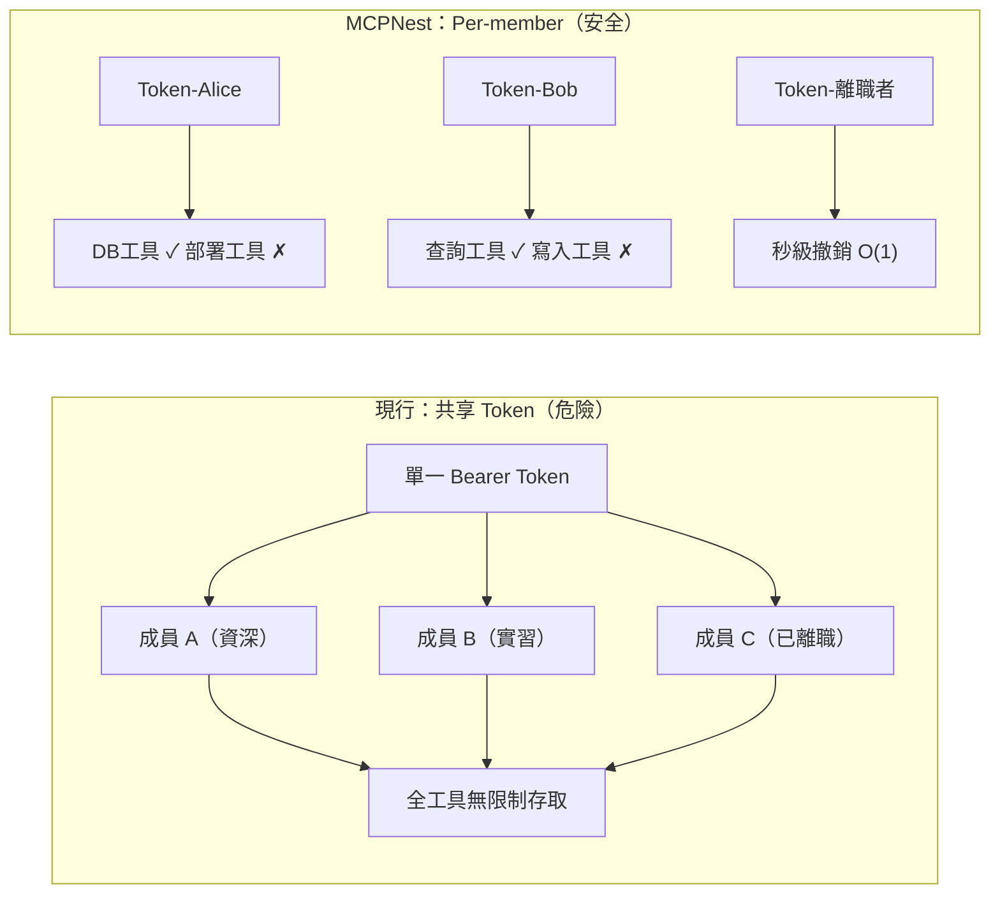

# AI Daily Digest — 2026-05-17

<!-- pipeline-generated:begin -->

## 🔥 今日 TOP 3
### 1. RTX 5070 推論速度超越 3090，記憶體頻寬成解碼天花板
開發者 Caleb Coffie 在 Strix Halo、RTX 3090、RTX 5070 三平台上完成 55 次推論基準測試，涵蓋 5 種後端框架與 0.35B 到 35B 的模型。核心發現是 RTX 5070（12GB GDDR7、Vulkan 後端）在 12GB 以內模型上全面超越 RTX 3090（24GB GDDR6X、CUDA 後端）——Gemma-3-4B 達 156.6 vs 142.0 tok/s，LFM2-8B-A1B 達 336.1 vs 318.7 tok/s。量化位深度對速度的影響同樣超乎預期：Q2 到 Q6 整體速度跨度達 1.6x，Q4 為多數場景的最佳甜蜜點；推論模型看似慢 5 倍，實為隱藏思考鏈而非效能缺陷。

此結果對本地推論社群意義重大：VRAM 容量不等於推論速度，記憶體頻寬才是解碼階段的真正瓶頸。這代表選購 GPU 的評估維度需要重新排序——一張頻寬較高的小 VRAM 卡，在能裝入 VRAM 的模型上完全可能勝過容量兩倍的老卡。同時，q4_0 量化用於草稿 KV 快取可節省 VRAM 且無明顯質量損失，是 VRAM 受限環境的實用技巧。

實務上，選購推論 GPU 應優先查閱記憶體頻寬規格（GB/s）而非單看 VRAM 大小；確認工作負載類型再選量化位深——prefill 密集型（長 context 輸入）不適合 MTP 加速，decode 密集型則首選 Q4。完整基準測試資料公開於 calebcoffie.com/benchmarks，選型前建議查閱對應模型規格的實測數字。

📖 [閱讀完整 insight](../10-insights/2026-05-16/inbox_4a2fd689.md) · 🔗 [原文連結](https://www.reddit.com/r/LocalLLaMA/comments/1tf9iyk/ran_the_same_models_across_strix_halo_rtx_3090/)
### 2. Abliteration 研究揭示：模型安全拒絕是多維 Manifold 而非單一可切除向量
研究者耗費 85 GPU 小時，系統比較 Qwen 3.6-27B 的 5 種 abliteration（移除安全限制）方法並開源工具箱 Abliterlitics。Heretic 方法達最低 KL divergence（0.0037）且權重編輯量最少（2.1%）；Huihui 方法在基準測試 delta 最小（0.5pp）且攻擊成功率最高（98.5%）。另一重要發現：GSM8K 看似的 +40.7pp 數學提升，實為 invalid thinking rate 下降（23% vs 68.2%），實際推理精度幾乎持平（96.0% vs 96.2%），揭示基準解讀需控制 thinking budget 這一隱藏變數。

最重要的結構性發現是：模型的「拒絕方向（refusal direction）」並非可單次手術切除的單一向量，而是多條件 manifold——5 種方法找到的權重方向兩兩 cosine 相似度均 < 0.07，各自指向不同的參數空間。這推翻了「對齊行為存在統一可識別向量」的簡化假設，暗示大型模型的安全對齊分散在多個權重維度，難以被單一干預完全移除。對 AI 安全評估方法論有根本影響。

對 AI 安全研究者而言，評估模型對齊強度需要多向量分析而非單點測試；對模型部署者而言，量化後模型的安全性變化比想象中更難追蹤。評估任何 AI 安全工具時，應要求報告 KL divergence 與權重編輯比例，而非只看 ASR；解讀「量化後性能提升」時，應先排除 thinking budget 效率差異這一混淆因素。

📖 [閱讀完整 insight](../10-insights/2026-05-17/inbox_bb00564a.md) · 🔗 [原文連結](https://www.reddit.com/r/LocalLLaMA/comments/1tfmocw/85_gpuhours_comparing_5_abliteration_methods_on/)
### 3. MCP 生產環境共享 Token 形同無權限控制，Per-member 設計是基本安全要求
作者揭示 MCP（Model Context Protocol）在多人團隊生產部署中的系統性安全缺陷：所有成員共享單一 Bearer Token，造成無差別全工具存取（實習生與資深工程師同權）且撤銷困難（一人離職需重配全隊）。MCPNest Gateway Layer 2 提出 OAuth-style 解方：Per-member 各自 Token、Per-tool Allowlist（如限 Alice 只能存取資料庫工具）、秒級即時撤銷、含 member_id 粒度的 Audit log。

MCP 正處於類似 OAuth 在 2010 年的關鍵治理轉折點。兩種架構的風險差異如下：

單一 Credential 洩漏等於整個工作區暴露；共享模型撤銷成本為 O(N)，Per-member 模型降為 O(1)。組織應立即評估自身 MCP 部署是否使用共享 Token，優先限制部署、資料庫寫入等高風險工具對受限角色的存取。Audit log 至少應記錄 workspace_id / member_id / tool_name / status 四要素，確保事後稽核能力。

📖 [閱讀完整 insight](../10-insights/2026-05-17/inbox_512cb68a.md) · 🔗 [原文連結](https://medium.com/@MCPNest/the-mcp-security-gap-no-one-is-talking-about-f57d98a5fa60?source=rss------claude-5)

## 📖 好文章 / 影片精選

_過去 30 天經 traffic 沉澱的高品質內容，按興趣領域分類。每篇只在 column 出現一次。_
### 🛠 Claude Code 最新 release
- **[v2.1.143](../10-insights/2026-05-15/inbox_68020dd7.md)**
  Claude Code v2.1.143 強化插件依賴管理——禁用時檢查上游依賴並給出 disable-chain hint，啟用時自動傳遞依賴，避免手動配置鏈。新增投影 context 成本顯示（per-turn + per-invocation 估算），marketplace browse pane 透明展示資源消耗。引入 worktree.bgIsol
- **[v2.1.142](../10-insights/2026-05-14/inbox_d99a7f4d.md)**
  Claude Code v2.1.142 版本發布，新增八個 claude agents flags（--add-dir、--settings、--mcp-config、--plugin-dir、--permission-mode、--model、--effort、--dangerously-skip-permissions），使背景會話配置更靈活。Fast
- **[v2.1.141](../10-insights/2026-05-13/inbox_86ad0cf5.md)**
  Claude Code v2.1.141 版本發布，涵蓋數十項功能增強與 bug 修復。重點新增 terminalSequence 字段支持 hook 在無控制終端時發送桌面通知與視窗標題；新增 CLAUDE_CODE_PLUGIN_PREFER_HTTPS 與 ANTHROPIC_WORKSPACE_ID 環境變數改進 GitHub SSH 與工作負載身份
- **[v2.1.140](../10-insights/2026-05-12/inbox_343f7328.md)**
  Claude Code v2.1.140 版本發布，主要修復與小幅改進。改進 Agent tool 的 subagent_type 匹配以接受不分大小寫與分隔符變體（例如「Code Reviewer」解析為 code-reviewer）；更新代理色彩調色盤；修復 /goal 在 disableAllHooks 下的掛起、設定檔符號連結熱重載的誤判、背景服務連
### 📚 AI 知識管理
- **[Article: Orchestrating Agentic and Multimodal AI Pipelines with Apache Camel](../10-insights/2026-04-24/inbox_d9ac879f.md)**
  文章探討如何使用 Apache Camel 和 LangChain4j 技術來工程化代理式及多模態 AI 系統。核心架構包含三大元件:LLM 推理引擎用於決策、檢索增強生成(RAG)用於知識整合、以及影像分類模組用於視覺輸入。此方法提供了一套系統化方案,將分散的 AI 元件(語言模型、向量資料庫、影像處理)透過事件驅動管道進行協調,使得構建複雜的多模態代理應
- **[I Built an AI Pipeline for Kindle Highlights](../10-insights/2026-04-24/inbox_4a56a088.md)**
  作者為過度標記 Kindle 書籍的問題自製自動化摘要管道。痛點：讀書時標記太多片段，事後缺時間整理，常放棄總結。方案：用 Python 本地抽取 Kindle 標記、解析、注入 RAG 或類似模型、輸出摘要。技術細節：Kindle 將標記儲存在 My Clippings.txt（舊款）或 annotations.db SQLite（新款），使用正則表達式從
- **[The RAG Interview Question I Couldn’t Answer](../10-insights/2026-04-26/inbox_7b9866b5.md)**
  面試官提問『為什麼需要 reranker？』揭示了 RAG 系統中的根本設計盲點。文章深入講解 bi-encoder（分別編碼查詢和文檔）無法交互比較，導致只能根據語義相似度排序，而語義相似度不等於相關性（例：『如何預防心臟病？』vs『心臟病每年致死數百萬』）。生產級 RAG 系統採用兩階段模式：第一階段用 bi-encoder 快速篩選 100 候選（保證
- **[Should You Use Prompt Engineering, Fine-Tuning, or RAG? A Practical Decision Guide](../10-insights/2026-04-29/inbox_53f03a6c.md)**
  文章提供決策框架，幫助開發者在三種 AI 優化方法（提示工程、RAG、微調）之間做出選擇。核心觀點是這三種技術解決不同問題，理解差異可避免花費數週時間進行不必要的複雜實現。正確的技術選擇能顯著節省開發時間和工程成本。
- **[#  LLM Gateway: From Simple Model Calls to Enterprise-Grade AI Control Plane](../10-insights/2026-04-29/inbox_fd40eda5.md)**
  LLM Gateway 是應用與多個模型提供者之間的中央控制層，解決企業級 AI 系統的成本超支（2-5 倍）、延遲不一致、可靠性和安全性問題。通過智能路由、負載平衡、Redis 狀態管理、速率限制和緩存層，可將成本控制在 40-60% 以內。架構採用分層設計，支持區域性 gateway pods、負載均衡器和 Redis 緩存基礎設施，特別適合動態協調的 
### 🏢 企業導入 AI / 團隊實踐
- **[The Future of MCP — David Soria Parra, Anthropic](../10-insights/2026-04-19/inbox_93d76028.md)**
  David Soria Parra 介紹 MCP (Model Context Protocol)，這是連接 LLMs 到外部工具和資料的通用標準，被譽為「AI 的 USB」。MCP 已達 1.1 億月度下載量，採用三階段演進：PoC、生產標準化、高級功能（pub/sub、串流、進階發現）。核心架構強調無狀態設計、標準化資源表示和可組合性，使工具開發者「寫一
- **[Anthropic Drops 10 Pre-Built Agents on Wall Street — Top 10 AI &amp; Flutter News May 6, 2026](../10-insights/2026-05-06/inbox_b5228a59.md)**
  Anthropic 在 5 月 5 日紐約私密活動中發布 10 個預構建代理給華爾街（pitch builder、meeting preparer、earnings reviewer 等），運行於 Claude Opus 4.7。同步推出 $1.5B PE 資金支持的中市場合資企業；FIS 推出金融犯罪 AI 代理，Moody's 推出 native MCP
- **[OpenAI available at FedRAMP Moderate](../10-insights/2026-04-27/inbox_36d942a1.md)**
  OpenAI 獲得 FedRAMP Moderate 授權，ChatGPT Enterprise 和 OpenAI API 均已通過聯邦合規認證。FedRAMP（聯邦風險與授權管理計畫）Moderate 級別是美國政府機構採購雲端服務的安全標準，此認證允許美國聯邦部門安全地使用 OpenAI 服務。這標誌著 OpenAI 在政府市場和合規領域的重大進展，正式
### 🎓 AI 使用技巧 / 心法
- **[Everything You Need To Know About Agent Observability — Danny Gollapalli and Ben Hylak, Raindrop](../10-insights/2026-05-07/inbox_db50426a.md)**
  Raindrop (Danny Gollapalli & Ben Hylak) 提出 Agent 可觀測性框架，將失敗模式分為隱式信號 (user frustration, refusals, task failure) 和顯式信號 (error rate, latency, cost)。核心洞察：Agent 的非確定性和無界性使傳統 eval 不足，生產監
- **[The golden rules of agent-first product engineering](../10-insights/2026-04-08/inbox_1e6646db.md)**
  PostHog 提出 agent-first 產品工程的五項黃金法則，建立開發者針對 agent 應用的產品直覺。該文系統化設計 agent 驅動產品時應遵循的原則，幫助工程師從傳統軟體思維轉向 agent 中心的設計模式。強調如何讓 agent 成為核心而非附加功能，改變產品架構的基本假設。
- **[We are finally there: Qwen3.6-27B + agentic search; 95.7% SimpleQA on a single 3090, fully local](../10-insights/2026-05-02/inbox_d647a0d3.md)**
  Local Deep Research（LDR）社區使用 Qwen3.6-27B + agentic search 在單張 RTX 3090（24GB）上達成 95.7% SimpleQA 準確率（287/300），與商業方案 Perplexity Deep Research（93.9%）及 Tavily（93.3%）相當。核心技術棧：Ollama 後端、L
- **[Claude Code Pricing: Subscriptions vs API, Token Visibility, and the Models That Actually Work](../10-insights/2026-04-08/inbox_995f45fb.md)**
  Product Compass 公開 Claude Code 定價模式完整分析。核心數據：Claude 訂閱相比 API 便宜 15-30 倍。指南涵蓋訂閱 vs API 的成本對比詳解。提供 Token 可視化方案與監控工具。釋出開源 Token 儀表板供成本監控使用。針對代理開發提出最佳 API 模型組合建議。提供量化決策依據協助團隊找到成本與功能最優平
### 💳 支付 / Fintech
- **[ChatGPT Finance Launches With Bank Account Integration: OpenAI’s Bold Move Into AI Personal Finance](../10-insights/2026-05-18/inbox_23fd9374.md)**
  OpenAI 推出 ChatGPT Finance，支持直接銀行帳戶集成，正式進入個人財務管理領域。產品允許用戶通過 ChatGPT 介面進行財務查詢、分析和決策支持，標誌著 AI 助手從對話工具向財務應用和敏感數據交互的拓展。
### ⛓️ 區塊鏈 / Web3
- **[第 179 期](../10-insights/2026-04-27/inbox_c22bbb17.md)**
  本期 Web3Matters 主要討論加密相關議題，其中最值得關注的 AI 相關討論來自 Denken：他指出當前「token」(代幣) 焦慮從加密貨幣延伸到 AI 領域——人們討論的重點從「你正在做什麼產品」轉變為「你同時跑了幾個 agent」，使用 AI agent 的頻率與效能成為社交談題核心。這反映出類似當年 mobile app 開發社群從分享應用
- **[Introducing talkie: a 13B vintage language model from 1930](../10-insights/2026-04-28/inbox_4505c181.md)**
  AI 研究者 Alec Radford（GPT、GPT-2、Whisper 開發者）、Nick Levine、David Duvenaud 聯合發布 talkie，一個 13B LLM 在 260B 代幣前 1931 年英文文本訓練。模型分兩個版本：talkie-1930-13b-base（53.1GB，Apache 2.0）與 talkie-1930-13
- **[How AI Chatbots Actually Work (Beyond the Hype)](../10-insights/2026-04-29/inbox_9a04f398.md)**
  AI 聊天機器人本質是「預測引擎」而非思考機器，通過五步流程實現：(1) tokenization 將輸入分解；(2) 數值轉換成嵌入向量；(3) 上下文解析消歧；(4) 逐 token 順序生成；(5) 迭代完成回應。三大因素造成「智能假象」：訓練規模、attention 機制權重、指令對齊。但存在根本限制：會產生自信但錯誤的幻覺、缺乏真實世界經驗、上下文
- **[ZK State Prune: The Boundaries Behind Rollup Cost Models](../10-insights/2026-04-28/inbox_b058b594.md)**
  ZK rollup 的狀態分層系統面臨「熱冷問題」：必須判斷哪些 state slot 保留在快速記憶體、哪些降級到較慢存儲層。原作者實現了基於生存模型的成本預測 pipeline（Go），但發現輸出無法回答下游使用者的基本問題（觀測域邊界、可比性、穩定性），因此引入四大「守護欄」(guardrails)：(1) Capability stamps 宣告提取
- **[Opus 4.7 is just 4.6 with a stick up its butt. Give me my tokens back!](../10-insights/2026-04-29/inbox_3ce9dd57.md)**
  認證護理師投訴 Claude 4.7 成為最具限制性的版本，在單次對話中多次拒絕合法的專業需求。首先為國會代表寫信時遭誤控冒充執業護師，儘管已三次說明身份；其次查詢藥物霧化給藥協議（鼻腔噴霧傳遞，日常職責）遭標記為生物恐怖主義並終止對話；第三要求模擬反疫苗患者以練習臨床溝通技巧遭拒。用戶指出核心問題為激勵結構失衡：Anthropic 無論模型是否幫助都從代幣
### 🔐 AI 安全 / 濫用
- **[Claude Mythos Found a 27-Year-Old Bug. Here’s Why That’s a Problem.](../10-insights/2026-05-09/inbox_97efbee4.md)**
  Anthropic 於 2026 年 4 月宣布 Claude Mythos Preview，為其最強大的模型。該模型發現了一個 27 年前的 OpenBSD 漏洞和一個 16 年前的 FFmpeg bug，並生成了 181 個可工作的 Firefox exploits（相比前代模型僅生成 2 個），展現其在安全漏洞發現和漏洞利用上的大幅進步。Claude 
- **[Cybersecurity Looks Like Proof of Work Now](../10-insights/2026-04-14/inbox_66db491f.md)**
  英國 AI 安全研究所（AISI）獨立評估 Claude Mythos 在網路安全中的能力，驗證 Anthropic 的聲稱。評估顯示模型花費的 token 越多，識別安全漏洞的效果越好，形成線性關係。此結論導出重要經濟推論：系統強化需花費超越潛在攻擊者的防禦 token，進而使開源專案價值提升（因安全投入可被所有使用者共享）。
- **[Accelerating the cyber defense ecosystem that protects us all](../10-insights/2026-04-16/inbox_9542815f.md)**
  OpenAI 宣布啟動「可信網路安全計畫」(Trusted Access for Cyber)，與全球領先的安全公司及企業合作。計畫向參與者提供 GPT-5.4-Cyber 模型及 1000 萬美元的 API 使用額。GPT-5.4-Cyber 是專門為網路防禦優化的模型，能夠增強全球網路防禦生態系統。此舉意味著 AI 能力與網路安全領域的深度整合。對安全企
### 🛤️ AI Flow 導入心得 / 技術分享
- **[Ran the same models across Strix Halo, RTX 3090, and RTX 5070 because I wanted my own numbers](../10-insights/2026-05-16/inbox_4a2fd689.md)**
  開發者對 Strix Halo、RTX 3090、RTX 5070 進行 55 次推論基準測試，涵蓋 5 個後端與 0.35B–35B 模型。發現記憶體頻寬為解碼速度主要限制；RTX 5070（12GB GDDR7, Vulkan）在 12GB 內模型上超越 RTX 3090（24GB GDDR6X, CUDA），例如 Gemma-3-4B 達 156.6 
- **[Built an open-source one-prompt-to-cinematic-reel pipeline on a single GPU — FLUX.2 [klein] for character keyframes, Wan2.2-I2V for animation, vision critic with auto-retry, music + 9-language narration in the same pipeline](../10-insights/2026-05-14/inbox_34f9f34f.md)**
  建立開源「一句話到電影級視頻」的完整 pipeline，在單個 AMD Instinct MI300X (192GB HBM3) 上端到端執行，總耗時 45 分鐘。8 個階段串連：Qwen3.5-35B-A3B Director Agent（規劃 6 個鏡頭、角色設定、配樂、旁白）→ FLUX.2 [klein]（角色肖像、關鍵幀）→ Wan2.2-I2V-
- **[Got local Qwen 3.5/3.6 generating meeting summaries entirely offline on an M4 Max. Demo with Wi-Fi off. This is the future.](../10-insights/2026-05-14/inbox_51094b28.md)**
  Hedy（AI 會議應用）實現完整離線 AI pipeline—語音辨識、摘要、詳細筆記、會議聊天、實時教練全在設備上執行，使用 llama.cpp，Wi-Fi 完全關閉。支援 Qwen 3.6/3.5、Gemma 4 families（2B~35B）及自訂 GGUF 模型，搭配 Metal 加速。記憶體預測系統事前告知「非常適合」「緊湊」「不適合」，無靜默

## 💡 今日 Takeaway

_讀完今日所有內容後，可帶走的知識點_
### 1. 選推論 GPU 先看記憶體頻寬而非 VRAM 大小，Q4 量化是多數場景甜蜜點
解碼速度主要受限於記憶體頻寬而非容量，GDDR7 的 12GB 卡在適合尺寸模型上可超越 GDDR6X 的 24GB 卡。量化位深對速度影響同樣顯著——Q2 到 Q6 跨度達 1.6x，Q4 兼顧速度與品質為首選；q4_0 用於草稿 KV 快取可節省 VRAM 且無明顯質量損失。規劃本地推論硬體時，記憶體頻寬（GB/s）應列為首要比較維度。

_類型：data-point_

**參考來源**：
- [Ran the same models across Strix Halo, RTX 3090, and RTX 5070 because I wanted my own numbers](../10-insights/2026-05-16/inbox_4a2fd689.md) · [原文](https://www.reddit.com/r/LocalLLaMA/comments/1tf9iyk/ran_the_same_models_across_strix_halo_rtx_3090/)
- [MTP for Qwen3.6-35B-A3B on 6GB VRAM laptop: not worth it](../10-insights/2026-05-17/inbox_4ba35110.md) · [原文](https://www.reddit.com/r/LocalLLaMA/comments/1tfq683/mtp_for_qwen3635ba3b_on_6gb_vram_laptop_not_worth/)
### 2. 「分散式備份」若與主系統共享故障域等於沒有備份——HA 與 DR 是兩回事
HA（Multi-AZ）只防單一 AZ 故障；DR（Multi-Region）才能防整個 Region 失效，兩者目標截然不同。Coinbase 停機揭示：主從若住在同一 AZ，AZ 冷卻故障時一起消失，「分散式」標籤不等於真正的故障隔離。設計備份架構時必須明確定義「針對哪種故障模式測試」——未測試的故障路徑等同不存在的保護，AWS SLA 補償（月費約 10%）無法覆蓋金融服務的實際停機損失。

_類型：pattern_

**參考來源**：
- [When \&#34;Distributed Backup\&#34; Isn&#39;t Actually Distributed: Lessons From the Coinbase Outage](../10-insights/2026-05-16/inbox_b60a544b.md) · [原文](https://read.bytesizeddesign.com/p/a-room-got-too-hot-and-coinbase-went)
### 3. MCP 最小權限設計：Per-member token + Per-tool allowlist 是起點而非進階配置
共享 Bearer Token 讓所有成員擁有相同工具存取權，Credential 洩漏或人員異動時整個工作區暴露，撤銷成本為 O(N)。正確架構是每成員各自 Token 配合工具級 Allowlist，撤銷成本降為 O(1)，搭配含 member_id 的 Audit log 支援事後稽核。MCP 部署早期即引入此設計，後期重構成本遠高於初期投入——趁生態早期建立正確習慣。

_類型：framework_

**參考來源**：
- [The MCP Security Gap No One Is Talking About](../10-insights/2026-05-17/inbox_512cb68a.md) · [原文](https://medium.com/@MCPNest/the-mcp-security-gap-no-one-is-talking-about-f57d98a5fa60?source=rss------claude-5)
### 4. LLM 輸出評估需三維分離（歸因性、特異性、相關性），主觀評分無法重現且掩蓋幻覺
依賴模糊主觀評分的評估體系無法重現，導致幻覺在上線前無法系統性攔截。將評估拆分為獨立三維：歸因性（聲明是否有來源支撐）、特異性（內容是否足夠具體而非空泛）、相關性（是否直接回答問題），可將主觀判斷轉為二元可重現決策。此框架讓 LLM pipeline 的品質管控從「憑感覺」進化到可量化追蹤，適合整合進任何生產 LLM 工作流的上線前把關環節。

_類型：framework_

**參考來源**：
- [LLM Evals Are Based on Vibes — I Built the Missing Layer That Decides What Ships](../10-insights/2026-05-17/inbox_be33b242.md) · [原文](https://towardsdatascience.com/llm-evals-are-based-on-vibes-i-built-the-missing-layer-that-decides-what-ships/)
### 5. 先拆任務清單再逐項執行，同時規避 context 崩塌與降低 LLM 輸出變異
直接讓 LLM agent 一次性處理大型任務，會因 context 過長導致品質下降並產生難以預期的輸出變異。將任務先分解為明確清單（plan.md），逐項交給 agent 執行並搭配結構化輸出，可讓 9B 量級本地模型達到 Claude Code 等級的功能覆蓋，同時讓人類審批節點明確化而非分散在整個執行流程中。Map-reduce 分散架構可進一步突破單次 context 上限，將超大任務拆解為並行小任務。

_類型：pattern_

**參考來源**：
- [The power of structured workflows and small local models](../10-insights/2026-05-17/inbox_30115a24.md) · [原文](https://www.reddit.com/r/LocalLLaMA/comments/1tftaaa/the_power_of_structured_workflows_and_small_local/)
- [How I started programming differently over the last year. What about you?](../10-insights/2026-05-16/inbox_e8855c34.md) · [原文](https://www.reddit.com/r/LocalLLaMA/comments/1tf2cxh/how_i_started_programming_differently_over_the/)

<!-- pipeline-generated:end -->

<!-- user-notes -->
<!-- Write your own notes below; pipeline never touches this section. -->