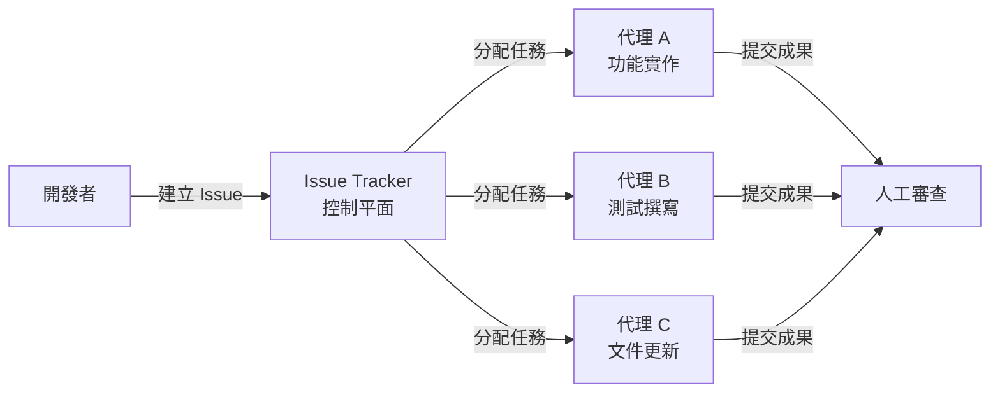
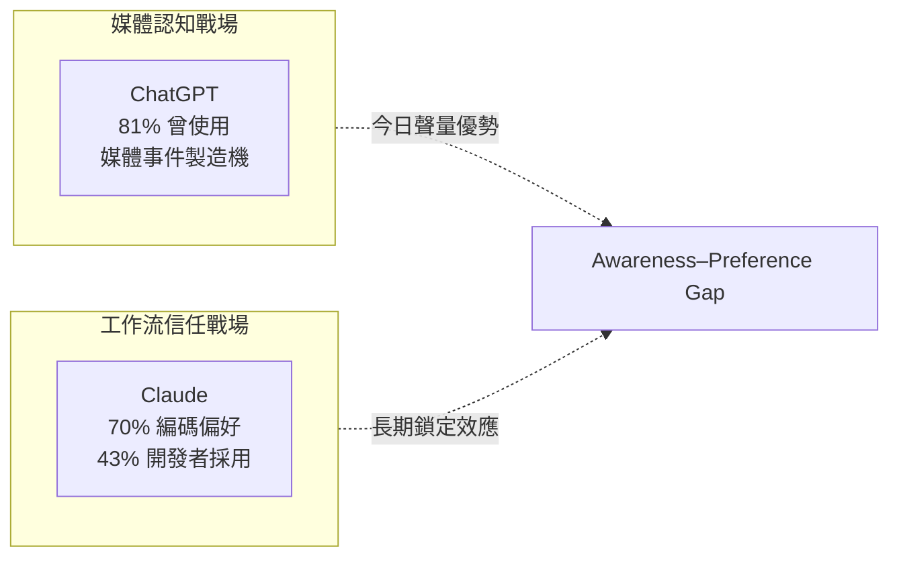

# AI Daily Digest — 2026-05-18

<!-- pipeline-generated:begin -->

## 🔥 今日 TOP 3
### 1. Symphony：用 Issue Tracker 作控制平面的多代理編碼框架
OpenAI 開源 Symphony，以 issue tracker 作為多代理編碼系統的控制平面，協調多個自主專門代理並行執行開發任務，開發者異步審查最終成果，不再即時逐步引導每個步驟。

這是 AI 輔助開發從「互動式對話」到「異步任務驅動」的典範轉移。傳統 AI 編碼助手需要開發者即時介入每個步驟；Symphony 將角色升級為任務管理者，多代理並行工作後集中審查，對大型代碼庫的並行重構與功能開發潛在加速比遠超單代理工作流。

關鍵觀察點：Symphony 如何解決多代理的代碼合並衝突與任務依賴管理，這是生產可用性的核心門檻。實務建議先以獨立無跨模組依賴的 spike 任務試驗多代理並行流，確認協調機制穩定後再擴展至核心功能開發。

📖 [閱讀完整 insight](../10-insights/2026-05-17/inbox_53959507.md) · 🔗 [原文連結](https://www.infoq.com/news/2026/05/openai-symphony-agents/?utm_campaign=infoq_content&utm_source=infoq&utm_medium=feed&utm_term=global)
### 2. OpenAI 整合銀行帳戶，ChatGPT Finance 進入個人財務管理
OpenAI 推出 ChatGPT Finance，支持用戶直接連結銀行帳戶，透過 ChatGPT 介面進行財務查詢、分析和決策支持。這是 OpenAI 從通用對話平台向高敏感度垂直應用的首次正式跨界，標誌著大型語言模型開始接觸財務核心數據。

對 fintech 與傳統銀行業而言，這是競爭格局重組的重大信號。億級 ChatGPT 用戶切換成本極低，短期可快速建立財務數據黏性；現有 PFM 應用（Mint、YNAB 等）面臨直接的用戶流失壓力，傳統銀行也需評估是否開放帳戶數據 API 以維持 AI 生態入口地位。

下一步需緊盯 OpenAI 的金融合規框架（PCI DSS、SOC 2、各地監管）、銀行合作夥伴名單，以及是否開放 Finance API 給第三方整合。監管明確前，企業應謹慎評估將用戶財務數據委託給大型 AI 平台的合規風險。

📖 [閱讀完整 insight](../10-insights/2026-05-18/inbox_23fd9374.md) · 🔗 [原文連結](https://medium.com/@bali4u2001/chatgpt-finance-launches-with-bank-account-integration-openais-bold-move-into-ai-personal-finance-6bb6795691d6?source=rss------claude-5)
### 3. 頭條 vs 信任：Claude 與 ChatGPT 在不同戰場競爭
Stack Overflow 2025 開發者調查顯示，81% 開發者曾使用 GPT 系列，但 Claude 在編碼任務偏好度達 70%、開發者採用率 43% 且增速更快。兩個產品在不同維度主導市場：OpenAI 主導公眾認知與媒體聲量，Claude 悄然主導工作流採用與開發者信任。

此「awareness-preference gap」揭示大眾市場認知與工作流採用的結構性分裂。對 B2B 決策者而言，「誰更有名」和「誰更常在工程師日常使用」之間存在巨大落差，後者才是長期鎖定效應的真實來源。評估 AI 平台時，應明確區分「公關聲量指標」與「工程師實際 daily-driver 偏好」，避免選型決策被媒體敘事誤導。

📖 [閱讀完整 insight](../10-insights/2026-05-18/inbox_6c8026a9.md) · 🔗 [原文連結](https://medium.com/ai-analytics-diaries/chatgpt-is-the-face-of-ai-claude-is-becoming-its-brain-4a267f00574b?source=rss------claude-5)

## 📖 好文章 / 影片精選

_過去 30 天經 traffic 沉澱的高品質內容，按興趣領域分類。每篇只在 column 出現一次。_
### 📚 AI 知識管理
- **[Article: Orchestrating Agentic and Multimodal AI Pipelines with Apache Camel](../10-insights/2026-04-24/inbox_d9ac879f.md)**
  文章探討如何使用 Apache Camel 和 LangChain4j 技術來工程化代理式及多模態 AI 系統。核心架構包含三大元件:LLM 推理引擎用於決策、檢索增強生成(RAG)用於知識整合、以及影像分類模組用於視覺輸入。此方法提供了一套系統化方案,將分散的 AI 元件(語言模型、向量資料庫、影像處理)透過事件驅動管道進行協調,使得構建複雜的多模態代理應
- **[I Built an AI Pipeline for Kindle Highlights](../10-insights/2026-04-24/inbox_4a56a088.md)**
  作者為過度標記 Kindle 書籍的問題自製自動化摘要管道。痛點：讀書時標記太多片段，事後缺時間整理，常放棄總結。方案：用 Python 本地抽取 Kindle 標記、解析、注入 RAG 或類似模型、輸出摘要。技術細節：Kindle 將標記儲存在 My Clippings.txt（舊款）或 annotations.db SQLite（新款），使用正則表達式從
- **[The RAG Interview Question I Couldn’t Answer](../10-insights/2026-04-26/inbox_7b9866b5.md)**
  面試官提問『為什麼需要 reranker？』揭示了 RAG 系統中的根本設計盲點。文章深入講解 bi-encoder（分別編碼查詢和文檔）無法交互比較，導致只能根據語義相似度排序，而語義相似度不等於相關性（例：『如何預防心臟病？』vs『心臟病每年致死數百萬』）。生產級 RAG 系統採用兩階段模式：第一階段用 bi-encoder 快速篩選 100 候選（保證
- **[Should You Use Prompt Engineering, Fine-Tuning, or RAG? A Practical Decision Guide](../10-insights/2026-04-29/inbox_53f03a6c.md)**
  文章提供決策框架，幫助開發者在三種 AI 優化方法（提示工程、RAG、微調）之間做出選擇。核心觀點是這三種技術解決不同問題，理解差異可避免花費數週時間進行不必要的複雜實現。正確的技術選擇能顯著節省開發時間和工程成本。
- **[#  LLM Gateway: From Simple Model Calls to Enterprise-Grade AI Control Plane](../10-insights/2026-04-29/inbox_fd40eda5.md)**
  LLM Gateway 是應用與多個模型提供者之間的中央控制層，解決企業級 AI 系統的成本超支（2-5 倍）、延遲不一致、可靠性和安全性問題。通過智能路由、負載平衡、Redis 狀態管理、速率限制和緩存層，可將成本控制在 40-60% 以內。架構採用分層設計，支持區域性 gateway pods、負載均衡器和 Redis 緩存基礎設施，特別適合動態協調的 
### 🏢 企業導入 AI / 團隊實踐
- **[The RAM shortage could last years](../10-insights/2026-04-19/inbox_aca72d1e.md)**
  全球 RAM 市場面臨長期短缺問題，預計將持續多年。先進 AI 模型的訓練和推理需要大量內存資源，此硬體短缺直接威脅 AI 基礎設施的擴展能力。RAM 供應緊張可能顯著延遲或限制 AI 系統的規模部署。
- **[v2.1.116](../10-insights/2026-04-20/inbox_7349264c.md)**
  Claude Code v2.1.116 於 2026 年 4 月 20 日發布，聚焦效能最佳化與穩定性改善。/resume 指令在大型會話上快速化 67%（40MB+ 會話），MCP 啟動速度提升，VS Code/Cursor/Windsurf 的全屏滾動更順暢，思考進度提示改為行內動態顯示（\"still thinking\"、\"thinking mo
- **[v2.1.113](../10-insights/2026-04-17/inbox_c5fda427.md)**
  Claude Code v2.1.113 於 2026 年 4 月 17 日發布，包含架構優化與安全加固。CLI 改為生成原生二進位檔（平臺特定可選依賴）而非捆綁 JavaScript，新增 sandbox.network.deniedDomains 設定可阻擋特定域名，全屏模式新增 Shift+↑/↓ 選擇並滾動，Ctrl+A/E 調和 readline 
- **[v2.1.110](../10-insights/2026-04-15/inbox_5357f42a.md)**
  Claude Code v2.1.110 於 2026 年 4 月 15 日發布，推出 /tui 指令與無閃爍全屏渲染模式。Ctrl+O 現僅切換逐字稿詳細度，焦點檢視由新 /focus 指令控制。新增推播通知工具支援 Remote Control 行動推播。autoScrollEnabled 設定停用全屏自動滾動。外部編輯器（Ctrl+G）可選顯示 Cla
- **[v2.1.105](../10-insights/2026-04-13/inbox_59969104.md)**
  Claude Code v2.1.105 引入多項工作流和可靠性增強。新增 EnterWorktree 工具的 path 參數以切換至現有 worktree；PreCompact 鉤子現可透過返回 {\"decision\":\"block\"} 或結束代碼 2 阻止壓縮；插件可透過清單 monitors 鍵支援背景監視，於會話開始或技能調用時自動啟動。改進
### 🎓 AI 使用技巧 / 心法
- **[Save up to 85% of your Claude tokens with one setting](../10-insights/2026-04-21/inbox_7f7ae9aa.md)**
  本文揭示了 Claude 使用者容易忽略的成本陷阱：每個連接的 MCP 伺服器在使用者輸入一個字前就已開始消耗 token。工具定義、名稱、描述、參數、schema 等元資料都被計入費用，未使用的伺服器連接也會產生背景消耗。根據文章，這類隱藏成本可達整體 token 用量的高達 85%。核心優化方案是審查 MCP 伺服器配置，禁用不必要的工具連接。這對 Cl
- **[Stop Spending Opus Tokens on Routine Agent Work](../10-insights/2026-04-22/inbox_44bb3089.md)**
  本文提出以 Claude 多模型組合實現成本最優的代理設計方案，稱為「顧問策略」。核心想法是利用 Sonnet 或 Haiku 執行日常任務，僅在面臨複雜決策時調用 Opus。這種設計模式將代理成本最佳化問題轉化為智能路由問題：並非所有工作都需要最高級模型。精妙的任務分配可大幅降低整體 token 消耗。這對構建生產級代理系統特別有指導意義，適用於高頻執行的
- **[Stop Burning Your AI Credits on the Wrong Model — Here’s What I Use Instead](../10-insights/2026-04-21/inbox_5d88f69f.md)**
  開發者分享一套三層模型路由策略，以解決 AI token 成本失控問題（預算從週三耗盡改善至月內充足）。核心原則是將任務分離為「思考階段」（用 GPT-4o mini 規劃）和「執行階段」（用 Sonnet 實現）。規劃文件需明確列出接受條件、應做與不應做事項、約束條件；接著用 Sonnet 或 Opus 驗證計畫（僅用於稽核，不重做）；最後按 accept
- **[The golden rules of agent-first product engineering](../10-insights/2026-04-08/inbox_1e6646db.md)**
  PostHog 提出 agent-first 產品工程的五項黃金法則，建立開發者針對 agent 應用的產品直覺。該文系統化設計 agent 驅動產品時應遵循的原則，幫助工程師從傳統軟體思維轉向 agent 中心的設計模式。強調如何讓 agent 成為核心而非附加功能，改變產品架構的基本假設。
- **[Claude Code Pricing: Subscriptions vs API, Token Visibility, and the Models That Actually Work](../10-insights/2026-04-08/inbox_995f45fb.md)**
  Product Compass 公開 Claude Code 定價模式完整分析。核心數據：Claude 訂閱相比 API 便宜 15-30 倍。指南涵蓋訂閱 vs API 的成本對比詳解。提供 Token 可視化方案與監控工具。釋出開源 Token 儀表板供成本監控使用。針對代理開發提出最佳 API 模型組合建議。提供量化決策依據協助團隊找到成本與功能最優平
### 💳 支付 / Fintech
- **[How to Select Variables Robustly in a Scoring Model](../10-insights/2026-04-24/inbox_bb48d931.md)**
  本文分析評分模型中的特徵選擇困境，核心論點是：增加變數數量並不能改善模型效能，穩定的變數（stable variables）才是決定性因素。文章強調在構建評分模型時應優先考慮變數穩定性而非數量，並介紹了識別穩定變數的具體方法。這對金融風控、信用評分等實務應用中的特徵工程階段具有直接指導價值。
- **[Bridging the Gap: Custom Native Module Development in React Native for Android &amp; iOS](../10-insights/2026-04-24/inbox_f32e3a2d.md)**
  文章提供了一份詳盡的技術指南，說明如何在 React Native 框架中開發自定義原生模組，以便 JavaScript 代碼能夠存取 Android 和 iOS 平台特定的功能與設備特性。開發者可通過編寫原生代碼（Android 使用 Java 或 Kotlin，iOS 使用 Swift 或 Objective-C）來擴展 React Native 的能力
- **[I cancelled Claude: Token issues, declining quality, and poor support](../10-insights/2026-04-24/inbox_858a1cbb.md)**
  一位使用者因多項服務問題取消 Claude 訂閱：(1) 快取過期機制導致對話快取消失後需重新支付 token 重載代碼；(2) 出現不明確的月度使用警告儘管遵守小時與周限制；(3) 單一項目兩小時內 token 配額耗盡，無法同時處理多個項目；(4) 模型建議廉價迂迴方案而非完整實現；(5) 支援系統發送制式回覆且過早關閉問題單。反映了 Claude 在成
- **[95% of Companies Are Breaking an AI Law Most People Don&#39;t Know Exists](../10-insights/2026-04-25/inbox_726c1586.md)**
  調查指出 95% 的公司違反一項鮮為人知的 AI 法規，作者通過紐約市審計經驗揭示「包裹型 AI」（Wrapper AI，即簡單封裝現成 API 的商業模式）無法在監管環境下存活。這表明目前許多輕量級 AI 應用的商業模式在法規趨嚴的未來面臨系統性風險，須從架構設計階段考慮合規性。
- **[Bytes Speak All Languages: Cross-Script Name Retrieval via Contrastive Learning](../10-insights/2026-04-26/inbox_22ada515.md)**
  研究論文提出純 UTF-8 字節級別的跨文種名字檢索方案，無須 tokenizer 或預訓練骨幹。核心洞察：Unicode 字符確定性分解為 1-4 字節，固定 256 符號表，足以通過對比學習在「Владимир」和「Vladimir」間建立相似向量。使用 4 階段 LLM pipeline（Wikidata 分層取樣 → Llama 生成音韻變體 → Q
### ⛓️ 區塊鏈 / Web3
- **[第 179 期](../10-insights/2026-04-27/inbox_c22bbb17.md)**
  本期 Web3Matters 主要討論加密相關議題，其中最值得關注的 AI 相關討論來自 Denken：他指出當前「token」(代幣) 焦慮從加密貨幣延伸到 AI 領域——人們討論的重點從「你正在做什麼產品」轉變為「你同時跑了幾個 agent」，使用 AI agent 的頻率與效能成為社交談題核心。這反映出類似當年 mobile app 開發社群從分享應用
- **[Introducing talkie: a 13B vintage language model from 1930](../10-insights/2026-04-28/inbox_4505c181.md)**
  AI 研究者 Alec Radford（GPT、GPT-2、Whisper 開發者）、Nick Levine、David Duvenaud 聯合發布 talkie，一個 13B LLM 在 260B 代幣前 1931 年英文文本訓練。模型分兩個版本：talkie-1930-13b-base（53.1GB，Apache 2.0）與 talkie-1930-13
- **[How AI Chatbots Actually Work (Beyond the Hype)](../10-insights/2026-04-29/inbox_9a04f398.md)**
  AI 聊天機器人本質是「預測引擎」而非思考機器，通過五步流程實現：(1) tokenization 將輸入分解；(2) 數值轉換成嵌入向量；(3) 上下文解析消歧；(4) 逐 token 順序生成；(5) 迭代完成回應。三大因素造成「智能假象」：訓練規模、attention 機制權重、指令對齊。但存在根本限制：會產生自信但錯誤的幻覺、缺乏真實世界經驗、上下文
- **[ZK State Prune: The Boundaries Behind Rollup Cost Models](../10-insights/2026-04-28/inbox_b058b594.md)**
  ZK rollup 的狀態分層系統面臨「熱冷問題」：必須判斷哪些 state slot 保留在快速記憶體、哪些降級到較慢存儲層。原作者實現了基於生存模型的成本預測 pipeline（Go），但發現輸出無法回答下游使用者的基本問題（觀測域邊界、可比性、穩定性），因此引入四大「守護欄」(guardrails)：(1) Capability stamps 宣告提取
- **[Opus 4.7 is just 4.6 with a stick up its butt. Give me my tokens back!](../10-insights/2026-04-29/inbox_3ce9dd57.md)**
  認證護理師投訴 Claude 4.7 成為最具限制性的版本，在單次對話中多次拒絕合法的專業需求。首先為國會代表寫信時遭誤控冒充執業護師，儘管已三次說明身份；其次查詢藥物霧化給藥協議（鼻腔噴霧傳遞，日常職責）遭標記為生物恐怖主義並終止對話；第三要求模擬反疫苗患者以練習臨床溝通技巧遭拒。用戶指出核心問題為激勵結構失衡：Anthropic 無論模型是否幫助都從代幣
### 🔐 AI 安全 / 濫用
- **[Claude Mythos Found a 27-Year-Old Bug. Here’s Why That’s a Problem.](../10-insights/2026-05-09/inbox_97efbee4.md)**
  Anthropic 於 2026 年 4 月宣布 Claude Mythos Preview，為其最強大的模型。該模型發現了一個 27 年前的 OpenBSD 漏洞和一個 16 年前的 FFmpeg bug，並生成了 181 個可工作的 Firefox exploits（相比前代模型僅生成 2 個），展現其在安全漏洞發現和漏洞利用上的大幅進步。Claude 
- **[Cybersecurity Looks Like Proof of Work Now](../10-insights/2026-04-14/inbox_66db491f.md)**
  英國 AI 安全研究所（AISI）獨立評估 Claude Mythos 在網路安全中的能力，驗證 Anthropic 的聲稱。評估顯示模型花費的 token 越多，識別安全漏洞的效果越好，形成線性關係。此結論導出重要經濟推論：系統強化需花費超越潛在攻擊者的防禦 token，進而使開源專案價值提升（因安全投入可被所有使用者共享）。
- **[Accelerating the cyber defense ecosystem that protects us all](../10-insights/2026-04-16/inbox_9542815f.md)**
  OpenAI 宣布啟動「可信網路安全計畫」(Trusted Access for Cyber)，與全球領先的安全公司及企業合作。計畫向參與者提供 GPT-5.4-Cyber 模型及 1000 萬美元的 API 使用額。GPT-5.4-Cyber 是專門為網路防禦優化的模型，能夠增強全球網路防禦生態系統。此舉意味著 AI 能力與網路安全領域的深度整合。對安全企
### 🛤️ AI Flow 導入心得 / 技術分享
- **[Everything You Need To Know About Agent Observability — Danny Gollapalli and Ben Hylak, Raindrop](../10-insights/2026-05-07/inbox_db50426a.md)**
  Raindrop (Danny Gollapalli & Ben Hylak) 提出 Agent 可觀測性框架，將失敗模式分為隱式信號 (user frustration, refusals, task failure) 和顯式信號 (error rate, latency, cost)。核心洞察：Agent 的非確定性和無界性使傳統 eval 不足，生產監
- **[What You’re Actually Buying When You Buy Enterprise AI](../10-insights/2026-04-22/inbox_d070112d.md)**
  一家客戶花費 400 萬美元得到的教訓揭示企業 AI 採購的隱藏成本：廠商在 RFP 贏得的完美演示與實際部署的複雜性之間存在巨大落差。該客戶的 AI agent 在生產環境「未能如預期運作」，根本原因是企業內部有多個來自歷史併購的子組織，各自擁有獨立的員工系統與資料孤島。文章強調企業 AI 實際採購的不只是技術本身，而是理解與整合複雜組織結構、跨系統資料連

## 💡 今日 Takeaway

_讀完今日所有內容後，可帶走的知識點_
### 1. 工具呼叫屬檢索組裝非推理，小模型可超越通用大模型
Needle 26M 的核心洞察：工具呼叫本質是「從已知格式中選擇並組合輸出」而非複雜推理；當有外部知識時，MLP 層的參數儲存功能冗餘，純注意力網路已足夠，因此 26M 參數任務專用模型在單次函數呼叫上超越 270M+ 通用模型。工具呼叫路由器、API 函數選擇器等場景應優先評估 task-specific 小模型，而非預設使用大型通用 LLM，可大幅降低延遲與推理成本。

_類型：framework_

**參考來源**：
- [Show HN: Needle: We Distilled Gemini Tool Calling into a 26M Model](../10-insights/2026-05-12/inbox_1c0ad7bb.md) · [原文](https://github.com/cactus-compute/needle)
### 2. 先量化再推測性解碼，兩步疊加可達 3-4 倍推理成本降低
量化解決記憶頻寬瓶頸，推測性解碼解決自迴歸順序處理瓶頸——兩者攻克不同層面問題，效果相加而非重疊。正確堆疊順序為「先量化、再推測性解碼」，組合使用可將推理成本降至原本的 1/3 至 1/4。成本敏感的生產環境若尚未同時部署兩項技術，應將此組合列為最高優先級的推理優化措施。

_類型：data-point_

**參考來源**：
- [Shipping LLMs (Part 3/6): Speculative Decoding vs Quantization](../10-insights/2026-05-17/inbox_9854d55d.md) · [原文](https://medium.com/@harshiljani2002/shipping-llms-part-3-6-speculative-decoding-vs-quantization-1c80938f1795?source=rss------large_language_models-5)
### 3. 按需載入技能手冊比靜態超大提示詞更能保持代理品質
將所有知識塞進 system prompt 是 agent 架構的常見錯誤；AGENTS.md（通用規則）+ SKILL.md（任務型專家手冊）的分層設計讓主 context 保持精簡，技能模組按需動態載入。對 PDF 解析、安全審查等低頻高專業化任務尤其有效——預載所有技能反而干擾通用任務表現。構建長期運行的 agent pipeline 時，應以動態載入機制取代靜態超大 system prompt。

_類型：technique_

**參考來源**：
- [Building Deep Agents + SKILL.md with Claude SDK](../10-insights/2026-05-18/inbox_f8451bc9.md) · [原文](https://abvijaykumar.medium.com/building-deep-agents-skill-md-with-claude-sdk-11d8bf47754b?source=rss------claude-5)
### 4. AI Agent 生產成本非線性，需從架構而非模型層面優化
Demo 中單次對話的 token 消耗遠低於生產環境；多步工具調用鏈、agent loop 重試、prompt 模板膨脹會使成本呈指數而非線性增長。優化重心應在工作流架構：減少不必要的 agent 迭代、共享 prompt cache、縮減 tool 定義冗餘。上線前應以生產流量模型（含 retry 率與工具調用深度）預估成本，避免部署後的架構重做。

_類型：pattern_

**參考來源**：
- [Building Cost-Optimized AI Agent Systems for Production](../10-insights/2026-05-17/inbox_0b542b86.md) · [原文](https://medium.com/@nivethag.dev/building-cost-optimized-ai-agent-systems-for-production-9500d9d395b2?source=rss------large_language_models-5)
### 5. SFT 改善輸出格式，不改善推理能力——微調前需分清目標
LoRA SFT 能有效學習格式模式（JSON 結構依從、輸出整潔度），但對事實準確性或邏輯推理幾乎無增益。混淆兩者目標會導致微調後的模型看起來「更像樣」但推理錯誤率未降低。規劃微調項目前應先問：目標是格式整理還是能力提升？前者適合 SFT，後者需要高品質推理數據或 RLHF。

_類型：data-point_

**參考來源**：
- [Fine-Tuning Qwen2.5 with LoRA: More Structured, Not More Correct](../10-insights/2026-05-17/inbox_088e1f75.md) · [原文](https://blog.gopenai.com/fine-tuning-qwen2-5-with-lora-more-structured-not-more-correct-3eea922cefda?source=rss------large_language_models-5)

<!-- pipeline-generated:end -->

<!-- user-notes -->
<!-- Write your own notes below; pipeline never touches this section. -->