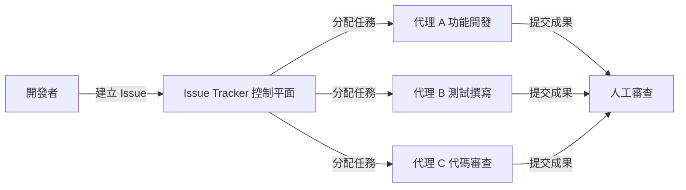
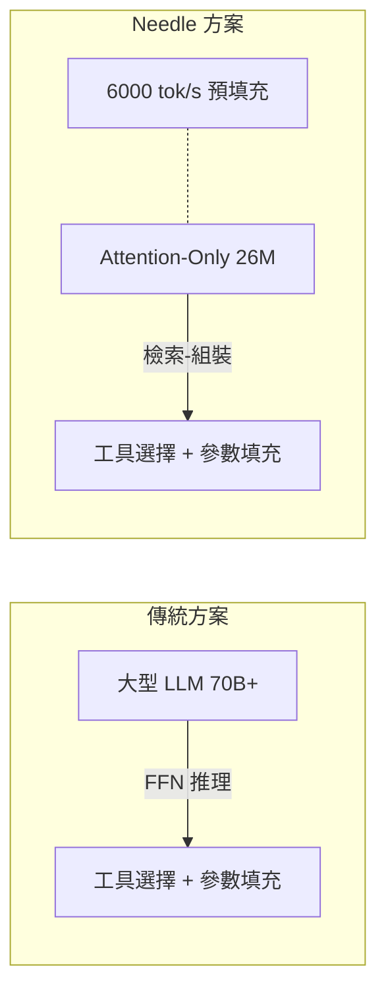

# AI Daily Digest — 2026-05-18

<!-- pipeline-generated:begin -->

## 🔥 今日 TOP 3
### 1. OpenAI 開源 Symphony：Issue Tracker 成多代理控制平面
OpenAI 開源 Symphony——一個以 Issue Tracker 等項目管理工具作為控制平面的代理編排框架。開發者建立 issue，Symphony 自動將任務分配給多個專門代理並行處理，人工最後審查成果，而非在開發過程中即時逐步互動。

這是 AI 輔助開發的範式轉移：從「與單一代理即時對話」轉為「任務驅動的異步多代理協作」。開發者角色從執行者變為任務管理者，工作流從同步對話變為異步批量處理，潛在大幅提升大型代碼庫的處理吞吐量。相較現有工具（Claude Code、Cursor），Symphony 的差異在於原生多代理並行設計與外部控制平面解耦——利用既有 issue tracker 基礎設施，而非自製調度器。

觀察重點：Symphony 能否與現有 CI/CD pipeline 和 PR review 流程無縫整合，是決定採用率的關鍵。開發者可立即試驗：將現有 backlog issues 作為代理任務輸入，評估代理自主完成率與成果品質，確立 human-in-the-loop 的最優介入點。

📖 [閱讀完整 insight](../10-insights/2026-05-17/inbox_53959507.md) · 🔗 [原文連結](https://www.infoq.com/news/2026/05/openai-symphony-agents/?utm_campaign=infoq_content&utm_source=infoq&utm_medium=feed&utm_term=global)
### 2. ChatGPT Finance 直連銀行帳戶，OpenAI 正式進入個人財務管理
OpenAI 推出 ChatGPT Finance，允許用戶直接連結銀行帳戶，在 ChatGPT 介面進行財務查詢、分析與決策支持。這是 OpenAI 從通用對話助手向垂直金融應用的首次重大延伸，標誌著主流 AI 助手正式進入高敏感度個人數據交互場景。

此舉的重要性在於金融數據的高度敏感性與監管複雜度。ChatGPT Finance 面臨 PCI DSS、GDPR 等合規要求，以及與 Plaid、Mint、Copilot Money 等既有 fintech 服務的正面競爭。對用戶而言，這是首次有主流 AI 對話介面直接觸及其財務數據，信任閾值遠高於一般對話場景——而 OpenAI 過去的數據使用政策爭議可能形成阻力。

下一步觀察：銀行帳戶數據是否被用於模型訓練、與現有財務 app 的差異化功能定義、以及各國金融監管機構的反應，將決定此產品的長期可行性與用戶採用曲線。

📖 [閱讀完整 insight](../10-insights/2026-05-18/inbox_23fd9374.md) · 🔗 [原文連結](https://medium.com/@bali4u2001/chatgpt-finance-launches-with-bank-account-integration-openais-bold-move-into-ai-personal-finance-6bb6795691d6?source=rss------claude-5)
### 3. Needle 26M 參數純注意力模型在工具呼叫性能上超越 270M+ 基準
開源 Needle 模型以 26M 參數、純注意力架構（零 MLP 層）在工具呼叫任務上超越 FunctionGemma-270M、Qwen-0.6B、Granite-350M 等更大模型，消費設備達 6000 tok/s 預填充、1200 tok/s 解碼。核心設計理念：工具呼叫本質是「檢索-組裝」而非推理——有外部工具庫作為知識來源時，FFN 層的參數計算能力是冗餘的，注意力機制處理序列關係已足夠。

這顛覆了「越大越好」的直覺，並確立一個可複用框架：模型架構應依任務性質選型。高結構化的「從已知庫中選擇並填充參數」類任務，不需要 FFN 的知識壓縮能力。企業部署 function calling 時可用 26M 模型取代數百 M 通用模型，推理成本大幅下降，邊緣設備部署成真。

觀察重點：此架構是否可推廣至其他高結構化輸出任務（強制 JSON schema 輸出、路由分類），以及與 MCP 工具生態的整合潛力——若成立，將推動 edge-side agent 的普及。

📖 [閱讀完整 insight](../10-insights/2026-05-12/inbox_1c0ad7bb.md) · 🔗 [原文連結](https://github.com/cactus-compute/needle)

## 📖 好文章 / 影片精選

_過去 30 天經 traffic 沉澱的高品質內容，按興趣領域分類。每篇只在 column 出現一次。_
### 🛠 Claude Code 最新 release
- **[v2.1.143](../10-insights/2026-05-15/inbox_68020dd7.md)**
  Claude Code v2.1.143 強化插件依賴管理——禁用時檢查上游依賴並給出 disable-chain hint，啟用時自動傳遞依賴，避免手動配置鏈。新增投影 context 成本顯示（per-turn + per-invocation 估算），marketplace browse pane 透明展示資源消耗。引入 worktree.bgIsol
- **[v2.1.142](../10-insights/2026-05-14/inbox_d99a7f4d.md)**
  Claude Code v2.1.142 版本發布，新增八個 claude agents flags（--add-dir、--settings、--mcp-config、--plugin-dir、--permission-mode、--model、--effort、--dangerously-skip-permissions），使背景會話配置更靈活。Fast
- **[v2.1.141](../10-insights/2026-05-13/inbox_86ad0cf5.md)**
  Claude Code v2.1.141 版本發布，涵蓋數十項功能增強與 bug 修復。重點新增 terminalSequence 字段支持 hook 在無控制終端時發送桌面通知與視窗標題；新增 CLAUDE_CODE_PLUGIN_PREFER_HTTPS 與 ANTHROPIC_WORKSPACE_ID 環境變數改進 GitHub SSH 與工作負載身份
- **[v2.1.140](../10-insights/2026-05-12/inbox_343f7328.md)**
  Claude Code v2.1.140 版本發布，主要修復與小幅改進。改進 Agent tool 的 subagent_type 匹配以接受不分大小寫與分隔符變體（例如「Code Reviewer」解析為 code-reviewer）；更新代理色彩調色盤；修復 /goal 在 disableAllHooks 下的掛起、設定檔符號連結熱重載的誤判、背景服務連
### 📚 AI 知識管理
- **[Article: Orchestrating Agentic and Multimodal AI Pipelines with Apache Camel](../10-insights/2026-04-24/inbox_d9ac879f.md)**
  文章探討如何使用 Apache Camel 和 LangChain4j 技術來工程化代理式及多模態 AI 系統。核心架構包含三大元件:LLM 推理引擎用於決策、檢索增強生成(RAG)用於知識整合、以及影像分類模組用於視覺輸入。此方法提供了一套系統化方案,將分散的 AI 元件(語言模型、向量資料庫、影像處理)透過事件驅動管道進行協調,使得構建複雜的多模態代理應
- **[I Built an AI Pipeline for Kindle Highlights](../10-insights/2026-04-24/inbox_4a56a088.md)**
  作者為過度標記 Kindle 書籍的問題自製自動化摘要管道。痛點：讀書時標記太多片段，事後缺時間整理，常放棄總結。方案：用 Python 本地抽取 Kindle 標記、解析、注入 RAG 或類似模型、輸出摘要。技術細節：Kindle 將標記儲存在 My Clippings.txt（舊款）或 annotations.db SQLite（新款），使用正則表達式從
- **[The RAG Interview Question I Couldn’t Answer](../10-insights/2026-04-26/inbox_7b9866b5.md)**
  面試官提問『為什麼需要 reranker？』揭示了 RAG 系統中的根本設計盲點。文章深入講解 bi-encoder（分別編碼查詢和文檔）無法交互比較，導致只能根據語義相似度排序，而語義相似度不等於相關性（例：『如何預防心臟病？』vs『心臟病每年致死數百萬』）。生產級 RAG 系統採用兩階段模式：第一階段用 bi-encoder 快速篩選 100 候選（保證
- **[Should You Use Prompt Engineering, Fine-Tuning, or RAG? A Practical Decision Guide](../10-insights/2026-04-29/inbox_53f03a6c.md)**
  文章提供決策框架，幫助開發者在三種 AI 優化方法（提示工程、RAG、微調）之間做出選擇。核心觀點是這三種技術解決不同問題，理解差異可避免花費數週時間進行不必要的複雜實現。正確的技術選擇能顯著節省開發時間和工程成本。
- **[#  LLM Gateway: From Simple Model Calls to Enterprise-Grade AI Control Plane](../10-insights/2026-04-29/inbox_fd40eda5.md)**
  LLM Gateway 是應用與多個模型提供者之間的中央控制層，解決企業級 AI 系統的成本超支（2-5 倍）、延遲不一致、可靠性和安全性問題。通過智能路由、負載平衡、Redis 狀態管理、速率限制和緩存層，可將成本控制在 40-60% 以內。架構採用分層設計，支持區域性 gateway pods、負載均衡器和 Redis 緩存基礎設施，特別適合動態協調的 
### 🏢 企業導入 AI / 團隊實踐
- **[What You’re Actually Buying When You Buy Enterprise AI](../10-insights/2026-04-22/inbox_d070112d.md)**
  一家客戶花費 400 萬美元得到的教訓揭示企業 AI 採購的隱藏成本：廠商在 RFP 贏得的完美演示與實際部署的複雜性之間存在巨大落差。該客戶的 AI agent 在生產環境「未能如預期運作」，根本原因是企業內部有多個來自歷史併購的子組織，各自擁有獨立的員工系統與資料孤島。文章強調企業 AI 實際採購的不只是技術本身，而是理解與整合複雜組織結構、跨系統資料連
### 🎓 AI 使用技巧 / 心法
- **[Stop Spending Opus Tokens on Routine Agent Work](../10-insights/2026-04-22/inbox_44bb3089.md)**
  本文提出以 Claude 多模型組合實現成本最優的代理設計方案，稱為「顧問策略」。核心想法是利用 Sonnet 或 Haiku 執行日常任務，僅在面臨複雜決策時調用 Opus。這種設計模式將代理成本最佳化問題轉化為智能路由問題：並非所有工作都需要最高級模型。精妙的任務分配可大幅降低整體 token 消耗。這對構建生產級代理系統特別有指導意義，適用於高頻執行的
- **[Stop Burning Your AI Credits on the Wrong Model — Here’s What I Use Instead](../10-insights/2026-04-21/inbox_5d88f69f.md)**
  開發者分享一套三層模型路由策略，以解決 AI token 成本失控問題（預算從週三耗盡改善至月內充足）。核心原則是將任務分離為「思考階段」（用 GPT-4o mini 規劃）和「執行階段」（用 Sonnet 實現）。規劃文件需明確列出接受條件、應做與不應做事項、約束條件；接著用 Sonnet 或 Opus 驗證計畫（僅用於稽核，不重做）；最後按 accept
- **[Claude Code Pricing: Subscriptions vs API, Token Visibility, and the Models That Actually Work](../10-insights/2026-04-08/inbox_995f45fb.md)**
  Product Compass 公開 Claude Code 定價模式完整分析。核心數據：Claude 訂閱相比 API 便宜 15-30 倍。指南涵蓋訂閱 vs API 的成本對比詳解。提供 Token 可視化方案與監控工具。釋出開源 Token 儀表板供成本監控使用。針對代理開發提出最佳 API 模型組合建議。提供量化決策依據協助團隊找到成本與功能最優平
- **[Ralph Loops: Build Dumb AI Loops That Ship — Chris Parsons, Cherrypick](../10-insights/2026-05-04/inbox_a23403d5.md)**
  Cherrypick 的 Chris Parsons 提出「Ralph Loops」架构理念：单个简单循环（处理一条工单、自评输出、迭代改进）在实战中远优于多 agent 编排、规划图、复杂工具链。工作坊演示三个核心构件：(1)端到端处理的 Ralph Loop；(2)本地测试的合成反馈循环；(3)无需改提示的自改进机制。
- **[New Berkeley paper measured what happens to voice when AI revises prose. Even the &#34;preserve voice&#34; prompt drifted in the same direction.](../10-insights/2026-05-02/inbox_59fae9ff.md)**
  Berkeley 研究者 Tom van Nuenen 測試了 300 篇個人敘述通過 Claude、ChatGPT、Gemini 三類模型，在「改進」「重寫」「保留聲音修改」三種 prompt 條件下的效果。量化結果顯示所有模型在所有條件下都出現相同方向的漂移：縮減縮寫詞、減少第一人稱代詞、增加詞彙多樣性、使用更長的詞彙、更繁複的標點。散文從「嵌入敘述」風
### 💳 支付 / Fintech
- **[How to Select Variables Robustly in a Scoring Model](../10-insights/2026-04-24/inbox_bb48d931.md)**
  本文分析評分模型中的特徵選擇困境，核心論點是：增加變數數量並不能改善模型效能，穩定的變數（stable variables）才是決定性因素。文章強調在構建評分模型時應優先考慮變數穩定性而非數量，並介紹了識別穩定變數的具體方法。這對金融風控、信用評分等實務應用中的特徵工程階段具有直接指導價值。
- **[Bridging the Gap: Custom Native Module Development in React Native for Android &amp; iOS](../10-insights/2026-04-24/inbox_f32e3a2d.md)**
  文章提供了一份詳盡的技術指南，說明如何在 React Native 框架中開發自定義原生模組，以便 JavaScript 代碼能夠存取 Android 和 iOS 平台特定的功能與設備特性。開發者可通過編寫原生代碼（Android 使用 Java 或 Kotlin，iOS 使用 Swift 或 Objective-C）來擴展 React Native 的能力
- **[I cancelled Claude: Token issues, declining quality, and poor support](../10-insights/2026-04-24/inbox_858a1cbb.md)**
  一位使用者因多項服務問題取消 Claude 訂閱：(1) 快取過期機制導致對話快取消失後需重新支付 token 重載代碼；(2) 出現不明確的月度使用警告儘管遵守小時與周限制；(3) 單一項目兩小時內 token 配額耗盡，無法同時處理多個項目；(4) 模型建議廉價迂迴方案而非完整實現；(5) 支援系統發送制式回覆且過早關閉問題單。反映了 Claude 在成
- **[95% of Companies Are Breaking an AI Law Most People Don&#39;t Know Exists](../10-insights/2026-04-25/inbox_726c1586.md)**
  調查指出 95% 的公司違反一項鮮為人知的 AI 法規，作者通過紐約市審計經驗揭示「包裹型 AI」（Wrapper AI，即簡單封裝現成 API 的商業模式）無法在監管環境下存活。這表明目前許多輕量級 AI 應用的商業模式在法規趨嚴的未來面臨系統性風險，須從架構設計階段考慮合規性。
- **[Bytes Speak All Languages: Cross-Script Name Retrieval via Contrastive Learning](../10-insights/2026-04-26/inbox_22ada515.md)**
  研究論文提出純 UTF-8 字節級別的跨文種名字檢索方案，無須 tokenizer 或預訓練骨幹。核心洞察：Unicode 字符確定性分解為 1-4 字節，固定 256 符號表，足以通過對比學習在「Владимир」和「Vladimir」間建立相似向量。使用 4 階段 LLM pipeline（Wikidata 分層取樣 → Llama 生成音韻變體 → Q
### ⛓️ 區塊鏈 / Web3
- **[第 179 期](../10-insights/2026-04-27/inbox_c22bbb17.md)**
  本期 Web3Matters 主要討論加密相關議題，其中最值得關注的 AI 相關討論來自 Denken：他指出當前「token」(代幣) 焦慮從加密貨幣延伸到 AI 領域——人們討論的重點從「你正在做什麼產品」轉變為「你同時跑了幾個 agent」，使用 AI agent 的頻率與效能成為社交談題核心。這反映出類似當年 mobile app 開發社群從分享應用
- **[Introducing talkie: a 13B vintage language model from 1930](../10-insights/2026-04-28/inbox_4505c181.md)**
  AI 研究者 Alec Radford（GPT、GPT-2、Whisper 開發者）、Nick Levine、David Duvenaud 聯合發布 talkie，一個 13B LLM 在 260B 代幣前 1931 年英文文本訓練。模型分兩個版本：talkie-1930-13b-base（53.1GB，Apache 2.0）與 talkie-1930-13
- **[How AI Chatbots Actually Work (Beyond the Hype)](../10-insights/2026-04-29/inbox_9a04f398.md)**
  AI 聊天機器人本質是「預測引擎」而非思考機器，通過五步流程實現：(1) tokenization 將輸入分解；(2) 數值轉換成嵌入向量；(3) 上下文解析消歧；(4) 逐 token 順序生成；(5) 迭代完成回應。三大因素造成「智能假象」：訓練規模、attention 機制權重、指令對齊。但存在根本限制：會產生自信但錯誤的幻覺、缺乏真實世界經驗、上下文
- **[ZK State Prune: The Boundaries Behind Rollup Cost Models](../10-insights/2026-04-28/inbox_b058b594.md)**
  ZK rollup 的狀態分層系統面臨「熱冷問題」：必須判斷哪些 state slot 保留在快速記憶體、哪些降級到較慢存儲層。原作者實現了基於生存模型的成本預測 pipeline（Go），但發現輸出無法回答下游使用者的基本問題（觀測域邊界、可比性、穩定性），因此引入四大「守護欄」(guardrails)：(1) Capability stamps 宣告提取
- **[Opus 4.7 is just 4.6 with a stick up its butt. Give me my tokens back!](../10-insights/2026-04-29/inbox_3ce9dd57.md)**
  認證護理師投訴 Claude 4.7 成為最具限制性的版本，在單次對話中多次拒絕合法的專業需求。首先為國會代表寫信時遭誤控冒充執業護師，儘管已三次說明身份；其次查詢藥物霧化給藥協議（鼻腔噴霧傳遞，日常職責）遭標記為生物恐怖主義並終止對話；第三要求模擬反疫苗患者以練習臨床溝通技巧遭拒。用戶指出核心問題為激勵結構失衡：Anthropic 無論模型是否幫助都從代幣
### 🔐 AI 安全 / 濫用
- **[Cybersecurity Looks Like Proof of Work Now](../10-insights/2026-04-14/inbox_66db491f.md)**
  英國 AI 安全研究所（AISI）獨立評估 Claude Mythos 在網路安全中的能力，驗證 Anthropic 的聲稱。評估顯示模型花費的 token 越多，識別安全漏洞的效果越好，形成線性關係。此結論導出重要經濟推論：系統強化需花費超越潛在攻擊者的防禦 token，進而使開源專案價值提升（因安全投入可被所有使用者共享）。
- **[Reasoning models struggle to control their chains of thought, and that’s good](../10-insights/2026-03-05/inbox_035bfbef.md)**
  OpenAI 發表 CoT-Control 研究，發現推理模型難以控制其思考鏈（Chain-of-Thought）過程。雖然看似是模型的局限，但研究表明這種不可控性實際上強化了思考鏈的可監控性，成為 AI 安全的重要保障。該發現改變了對推理模型可控性的認知，為未來推理模型的安全評估提供新的視角和框架。
- **[Claude Mythos Found a 27-Year-Old Bug. Here’s Why That’s a Problem.](../10-insights/2026-05-09/inbox_97efbee4.md)**
  Anthropic 於 2026 年 4 月宣布 Claude Mythos Preview，為其最強大的模型。該模型發現了一個 27 年前的 OpenBSD 漏洞和一個 16 年前的 FFmpeg bug，並生成了 181 個可工作的 Firefox exploits（相比前代模型僅生成 2 個），展現其在安全漏洞發現和漏洞利用上的大幅進步。Claude 
### 🛤️ AI Flow 導入心得 / 技術分享
- **[An AI state of the union: We’ve passed the inflection point, dark factories are coming, and automation timelines | Simon Willison](../10-insights/2026-04-02/inbox_399ab9bf.md)**
  Simon Willison 發表宏觀分析：軟體工程在 2025 年 11 月達成 inflection point，標誌著 AI 驅動開發進入不可逆轉的新階段。他提出「lethal trifecta」框架來解釋 AI agent 的致命組合優勢，並深入討論 agentic engineering 的頂級設計模式。核心洞察：自動化不只是效率提升，而是業務模式
- **[Everything You Need To Know About Agent Observability — Danny Gollapalli and Ben Hylak, Raindrop](../10-insights/2026-05-07/inbox_db50426a.md)**
  Raindrop (Danny Gollapalli & Ben Hylak) 提出 Agent 可觀測性框架，將失敗模式分為隱式信號 (user frustration, refusals, task failure) 和顯式信號 (error rate, latency, cost)。核心洞察：Agent 的非確定性和無界性使傳統 eval 不足，生產監
- **[Meta Reports 4x Higher Bug Detection with Just-in-Time Testing](../10-insights/2026-04-17/inbox_4ce59944.md)**
  Meta 推出 Just-in-Time (JiT) 動態測試方法，在代碼審查時即時生成測試而非依賴預先構建的靜態套件，結合 LLM、mutation testing 和 Dodgy Diff 等 intent-aware workflows。此方法實現 bug 檢測率提升約 4 倍，反映了 agentic 開發環境中變化感知、AI 驅動軟體測試的範式轉變，
- **[Figma Design to Code, Code to Design: Clearly Explained](../10-insights/2026-04-14/inbox_6abc033f.md)**
  Figma 的設計轉代碼（design-to-code）和代碼轉設計（code-to-design）功能背後的實現原理。文章先分析直接 API 方案為何失效，再展示 MCP（Model Context Protocol）如何作為中立協議層優雅解決異質工具整合問題，最後探討版本同步、衝突解決、實時協作等剩餘的工程挑戰。MCP 統一了設計工具和代碼編輯器的通信接
- **[Anthropic Traces Six Weeks of Claude Code Quality Complaints to Three Overlapping Product Changes](../10-insights/2026-05-14/inbox_d181a403.md)**
  Anthropic 發布 Claude Code 品質下滑事後分析，6 週問題根源為三層重疊產品變更：(1) reasoning effort 降級、(2) 快取 bug 逐漸清除模型自己的思考、(3) 系統提示冗長限制導致 3% 品質下降。API 與模型權重未受影響；所有問題於 4 月 20 日解決。罕見的根本原因透明揭露，示範如何診斷複合故障。

## 💡 今日 Takeaway

_讀完今日所有內容後，可帶走的知識點_
### 1. Issue Tracker 作代理控制平面：異步任務驅動比即時對話更適合管理長程多代理工作流
多代理系統的核心挑戰是協調與狀態追蹤。Symphony 揭示一個原則：現有 issue tracker 已具備任務分配、狀態追蹤、優先級管理的能力，直接作為代理控制平面比自製調度器更低摩擦、更易審計。異步任務驅動模式讓代理可獨立並行執行，人工審查作為質量門控點，比即時對話更適合長程、高複雜度的代碼任務。設計多代理系統時，優先評估現有 project management 工具是否可直接作為 orchestration 層，而非從零構建。

_類型：framework_

**參考來源**：
- [OpenAI Open-Sources Symphony, a SPEC.md for Autonomous Coding Agent Orchestration](../10-insights/2026-05-17/inbox_53959507.md) · [原文](https://www.infoq.com/news/2026/05/openai-symphony-agents/?utm_campaign=infoq_content&utm_source=infoq&utm_medium=feed&utm_term=global)
- [OpenAI Open-Sources Symphony, a SPEC.md for Autonomous Coding Agent Orchestration](../10-insights/2026-05-17/inbox_edf3cd01.md) · [原文](https://www.infoq.com/news/2026/05/openai-symphony-agents/?utm_campaign=infoq_content&utm_source=infoq&utm_medium=feed&utm_term=AI%2C+ML+%26+Data+Engineering)
### 2. 工具呼叫為檢索-組裝任務，不需推理能力——任務性質決定模型架構，非參數量
Needle 的成功確立一個可複用框架：在選擇模型前，先分析任務本質是「推理」還是「檢索-組裝」。若任務有明確結構化輸入（工具庫定義）與輸出（填充參數），FFN 層的知識壓縮能力無額外貢獻，純注意力網路已足夠且更快。實際套用：部署 function calling 或 MCP 工具路由時，可優先評估 20–30M 規模專用模型，而非預設使用通用大型 LLM，可在不損性能前提下大幅降低推理延遲與成本。

_類型：framework_

**參考來源**：
- [Show HN: Needle: We Distilled Gemini Tool Calling into a 26M Model](../10-insights/2026-05-12/inbox_1c0ad7bb.md) · [原文](https://github.com/cactus-compute/needle)
### 3. SKILL.md 按需載入讓代理 context 保持乾淨：分層能力架構降低幻覺與品質波動
代理系統的常見問題是 context bloat：把所有能力預先注入 system prompt 導致注意力稀釋、成本增加與品質不穩定。SKILL.md 模式的原則是「需要時才載入專家手冊」——通用規則（AGENTS.md）常駐，領域技能（SKILL.md）按需動態注入。設計代理系統時，應將特殊任務（安全審查、PDF 解析、代碼審查等）的指引以工具形式封裝，只在相關任務觸發時載入，可維持 context 乾淨並減少跨任務干擾。

_類型：technique_

**參考來源**：
- [Building Deep Agents + SKILL.md with Claude SDK](../10-insights/2026-05-18/inbox_f8451bc9.md) · [原文](https://abvijaykumar.medium.com/building-deep-agents-skill-md-with-claude-sdk-11d8bf47754b?source=rss------claude-5)
### 4. Production AI Agent 成本 = 模型費 × 架構 overhead 係數，Demo 估算無法直接外推
AI Agent 的生產成本由三層疊加：每步驟的模型調用次數、工具調用鏈延伸的 API 請求、以及 system prompt 在每次調用中重複計費的 token overhead。Demo 只展示單次「葉節點成本」，隱藏了整個 agentic workflow 的乘數效應。預算規劃時，應先繪製完整代理調用圖（call graph），估算每條工作流路徑的總 token 消耗，再乘上架構係數作為成本基準——而非以單次模型調用費用線性外推。

_類型：pattern_

**參考來源**：
- [Building Cost-Optimized AI Agent Systems for Production](../10-insights/2026-05-17/inbox_0b542b86.md) · [原文](https://medium.com/@nivethag.dev/building-cost-optimized-ai-agent-systems-for-production-9500d9d395b2?source=rss------large_language_models-5)
### 5. 量化先行、推測性解碼後疊：兩階段堆疊解決不同瓶頸，可達 3–4 倍推理成本降低
LLM 推理有兩個獨立瓶頸：記憶體頻寬（影響權重載入速度）與自迴歸順序處理（影響輸出 token 生成速度）。量化解決前者，推測性解碼解決後者，兩者不重疊可疊加，但順序有嚴格要求：先量化縮小模型體積降低頻寬壓力，再用小草稿模型加速自迴歸生成——反序會導致草稿模型與目標模型對齊困難。生產部署推理優化時，應將這兩個技術作為標準 checklist 的必選項，按此順序實施。

_類型：data-point_

**參考來源**：
- [Shipping LLMs (Part 3/6): Speculative Decoding vs Quantization](../10-insights/2026-05-17/inbox_9854d55d.md) · [原文](https://medium.com/@harshiljani2002/shipping-llms-part-3-6-speculative-decoding-vs-quantization-1c80938f1795?source=rss------large_language_models-5)

<!-- pipeline-generated:end -->

<!-- user-notes -->
<!-- Write your own notes below; pipeline never touches this section. -->