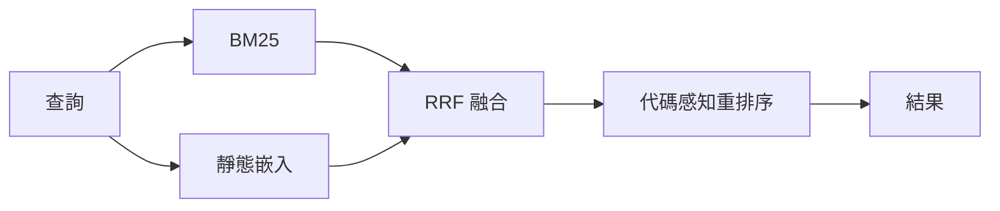
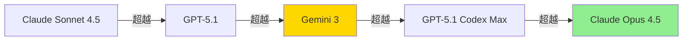

# AI Daily Digest — 2026-05-19

<!-- pipeline-generated:begin -->

## 🔥 今日 TOP 3
### 1. Semble 開源：AI 代碼搜尋節省 98% token、查詢僅 1.5ms
MinishLab 開源 Semble，專為 AI agents 設計的代碼搜尋工具。技術核心為 Model2Vec 靜態嵌入、BM25 與 RRF 融合，加上代碼感知重排序層，索引耗時約 250ms，單次查詢僅 1.5ms，全程 CPU 執行，無需 GPU 或 API 密鑰。

相比傳統 grep + read 方案，Semble 減少 98% tokens 消耗，NDCG@10 達 0.854（約 transformer 品質的 99%）。對日常使用 Claude Code 或 Cursor 的開發者而言，大型代碼庫的頻繁代碼搜尋 API 費用可大幅降低。

工具已以 MCP server 形式支援 Claude Code、Cursor 和 Codex，安裝後開箱即用。建議立即在現有代碼庫測試 token 消耗差異，若代碼搜尋是工作流的高頻步驟，優先考慮替換現有方案。

📖 [閱讀完整 insight](../10-insights/2026-05-17/inbox_04fae80c.md) · 🔗 [原文連結](https://github.com/MinishLab/semble)
### 2. llama.cpp 合入 MTP 投機解碼，RTX 3090 實測加速 2.17 倍
llama.cpp 於 2026 年 5 月 16 日將 MTP（多 token 預測）投機解碼合入 mainline（commit 4f13cb7）。無需額外草稿模型，加上 --spec-draft-n-max 參數即可啟用，與現有量化模型設定完全相容。

實測加速顯著：AMD Strix Halo Q8_0 達 2.44×（7.4 → 18.1 tok/s），RTX 3090 雙卡 Q8_0 達 2.17×（25.7 → 55.9 tok/s）。但稀疏 MoE 架構效益有限（1.24–1.40×），因 MoE 每 token 只激活 ~3B 參數，前向傳遞本已輕量，投機收益邊際遞減。

本地推理用戶可立即升級最新 llama.cpp 版本並實測。RTX 3090 sweet-spot 偏 n=2，Strix Halo 偏 n=3，建議針對自身硬體做基準測試後再固定 --spec-draft-n-max 值。

📖 [閱讀完整 insight](../10-insights/2026-05-18/inbox_16ca174b.md) · 🔗 [原文連結](https://www.reddit.com/r/LocalLLaMA/comments/1tgxau6/llamacpp_mtp_support_landed_qwen36_27b_at_244_on/)
### 3. Simon Willison PyCon 回顧：2025 年 11 月為 AI 業界關鍵轉折點
Simon Willison 在 PyCon US 2026 回顧過去六個月 LLM 競賽，指定 2025 年 11 月為業界轉折點。「最強模型」稱號在五個版本間輪換，最終由 Claude Opus 4.5 奪冠；同期 OpenClaw 個人 AI 助手概念爆紅，甚至帶動矽谷 Mac Mini 銷售一空。

此輪競爭揭示兩大結構性突破：編碼代理透過 RLVR 強化學習跨越「偶爾可用」到「日常工具」的可靠性閾值；開源模型同步大躍進，Qwen 3.6-35B 僅需 20.9GB 可在消費級筆記本運行，Gemma 4 成美國最強開源模型，整體性能逼近閉源頂尖水準。

開源追趕速度是下一步核心觀察點。Qwen 3.6-35B 可評估作為閉源 API 的本地替代方案用於代碼任務。同時關注 RLVR 訓練方法能否被開源社群複製，這將決定下一波能力跳躍的時機。

📖 [閱讀完整 insight](../10-insights/2026-05-19/inbox_3ae0a8bb.md) · 🔗 [原文連結](https://simonwillison.net/2026/May/19/5-minute-llms/#atom-everything)

## 📖 好文章 / 影片精選

_過去 30 天經 traffic 沉澱的高品質內容，按興趣領域分類。每篇只在 column 出現一次。_
### 🛠 Claude Code 最新 release
- **[v2.1.144](../10-insights/2026-05-19/inbox_00aef576.md)**
  Claude Code v2.1.144 發布，針對後台會話、終端渲染、MCP 伺服器、模型選擇等發布 30+ 項修復。主要改進包括：後台會話支持 /resume 命令，完成通知加入經過時間；修復啟動卡 75 秒的無網路問題（API timeout 改為 15s）；修復 macOS Full Disk Access 保護資料夾下後台會話 exit 1 崩潰；
### 📚 AI 知識管理
- **[Designing Memory for AI Agents: Inside Linkedin’s Cognitive Memory Agent](../10-insights/2026-04-20/inbox_649121f7.md)**
  LinkedIn 發表 Cognitive Memory Agent（CMA），一套生成式 AI 基礎設施層，為代理系統提供跨情節、語義與程序層的持久記憶能力。CMA 直接解決 LLM 無狀態特性，支援多代理協調、上下文檢索與完整生命週期管理。此架構創新使企業級應用能實現有狀態、上下文感知的個性化決策與長期推理，代表從無狀態 API 呼叫向有狀態代理系統的根
### 🏢 企業導入 AI / 團隊實踐
- **[Introducing workspace agents in ChatGPT](../10-insights/2026-04-22/inbox_84ca7959.md)**
  OpenAI 正式推出 ChatGPT 工作區代理功能，由 Codex 引擎驅動，可自動化複雜多步工作流，在雲端執行，並支持跨多個工具的安全協作。此功能面向企業團隊，使其能大規模自動化重複任務並簡化跨工具的工作協調。Codex-powered 架構表明 OpenAI 將代理能力作為企業自動化的核心基礎設施。
- **[Microsoft Azure AI Foundry](../10-insights/2026-05-06/inbox_51a4c512.md)**
  Microsoft 推出 Azure AI Foundry——統一的 AI 應用與代理工廠，用於建構、最佳化和治理 AI 應用程式。平台整合 8 大要素：(1) 模型管理（成本與效能控制），(2) 代理系統（自動化工作流），(3) 工具整合與治理，(4) 知識檢索（Foundry IQ、RAG），(5) 數據管理（微調與評估資料集），(6) 模型微調（提升可
- **[The Claude Platform on AWS is now generally available.](../10-insights/2026-05-11/inbox_9f26e82d.md)**
  Anthropic 宣布 Claude Platform on AWS 正式推出，提供完整的 Claude API 功能。AWS 客戶可利用 AWS 認證和帳單集成，並支援政策退休機制。服務由 Anthropic 運營，確保新功能同日上線至原生 Claude API。平台包含 Claude Managed Agents、code execution、web 
### 🎓 AI 使用技巧 / 心法
- **[It’s Not About Writing a Better Sentence. It’s About Defining a Better Optimization Problem.](../10-insights/2026-04-23/inbox_e57f2ee2.md)**
  提出關鍵框架：Prompt 優化的重點不在於寫得更好的句子，而在於定義更優的優化問題。此觀點強調改進 LLM 輸出的真正關鍵，在於重新審視目標函數本身而非單純微調措辭。對系統化改進 prompt 工程實踐提供了新的思考角度。
- **[GPT-5.5 prompting guide](../10-insights/2026-04-25/inbox_d7bd6da6.md)**
  OpenAI 發布 GPT-5.5 官方提示工程指南，揭露三大核心建議：(1) 多步驟任務應在工具調用前發送短的用戶可見更新，避免長時間沉默，Codex 應用已採用此技巧；(2) GPT-5.5 應視為新模型族而非直接替代品，需從最小提示重新優化 reasoning effort、verbosity、tool descriptions 與輸出格式；(3) O
- **[From Chatbot to Power Tool: 4 Levels of AI Agent Mastery for Developers](../10-insights/2026-04-27/inbox_6948983a.md)**
  深入分析 AI agent 開發者的四層成熟度進階路線。Level 1 強調理解 LLM 的能力邊界，遵循「不驗證不上線」原則；Level 2 引入持久化 agent、系統提示和工具管理，其中 MCP（Model Context Protocol）被稱為「AI 工具的 USB-C」標準；Level 3 通過 SOP、Skills 和結構化方法實現確定性和可審
- **[&#34;Software Fundamentals Matter More Than Ever&#34; — Matt Pocock](../10-insights/2026-04-23/inbox_47d33a27.md)**
  Matt Pocock 在主題演講中針對「Specs-to-Code」模式的實務缺陷進行了尖銳批判。該模式主張工程師只需寫好規格,讓 AI 轉換為程式碼,遇到問題就改規格、重新編譯。但 Pocock 的實踐顯示這個迴圈會產生品質逐步惡化的程式碼,最後變成一堆垃圾。演講的核心論點是:軟體工程基礎(代碼審查、漸進式重構、測試驅動開發)在 AI 時代反而更加不可或
- **[Speeding up agentic workflows with WebSockets in the Responses API](../10-insights/2026-04-22/inbox_80ff946e.md)**
  OpenAI 深度分析 Codex agent 循環如何利用 WebSocket 和連接範圍快取（connection-scoped caching）技術，顯著降低 API 開銷並改善模型延遲。此方案針對代理式工作流的性能優化，通過持久連接和智慧快取策略實現實時性能提升。這一優化模式對構建高頻代理應用具有參考價值，可複用於其他長連接場景。
### 💳 支付 / Fintech
- **[Why OpenAI Privacy Filter feels like real AI infrastructure](../10-insights/2026-04-27/inbox_4b3ee774.md)**
  OpenAI發布Privacy Filter，一套1.5B參數的bidirectional token-classification模型（運行時僅50M參數活躍），在PII-Masking-300k基準上達96% F1（精度94.04%、召回98.04%），可單次處理128,000 tokens。識別8種PII類型（姓名、地址、郵箱、電話、URL、日期、帳號
- **[Auto-Save Every Snippet You Copy in Chrome - Then Pipe It to Claude or ChatGPT](../10-insights/2026-04-28/inbox_c8a36962.md)**
  介紹 ClipGate Chrome 擴充套件，自動捕捉使用者複製的代碼片段、API 文件等內容，防止被後續複製覆蓋丟失，並可整批發送給 Claude/ChatGPT。解決跨 30 個標籤頁研究時常見的「複製即失」問題（已驗證使用案例：Stripe webhook 簽名驗證、Tailwind CSS 類名搜尋、GitHub README 配置塊等）。
- **[Presentation: Stripe’s Docdb: How Zero-Downtime Data Movement Powers Trillion-Dollar Payment Processing](../10-insights/2026-04-30/inbox_6b512bc5.md)**
  Stripe 展示 DocDB 數據庫架構如何支撐其支付系統達到 5 百萬 QPS 和 5.5 nines（99.999%）可靠性。關鍵創新是自研的零停機時間數據移動平台，可在完全不中斷服務的前提下執行水平分片、版本升級和多租戶遷移，確保全球商務交易的嚴格一致性保證。
- **[Why building eval platforms is hard — Phil Hetzel, Braintrust](../10-insights/2026-04-28/inbox_287e02cc.md)**
  Braintrust 方案工程負責人 Phil Hetzel 揭示 eval platform 構建難點。Braintrust 定位為 agent quality platform，建立在兩大支柱：(1) Eval：production 前的實驗與信心累積，(2) Observability：production 後持續監控與信心維持。核心洞察：LM 的極高
- **[Opus 4.7 is a genuine regression and I&#39;m tired of pretending it isn&#39;t](../10-insights/2026-05-01/inbox_a8e8d01f.md)**
  資深 Claude 用戶（年均支付 Max 20x、連續 17 週達到使用上限）針對 Opus 4.7 提出系統性回歸批評。核心問題：(1) 過度 meta-narration——每個回應都帶著自我分析敘述，無法直接對話；(2) 位置不穩定——易被社交暗示影響決定，缺乏堅定立場；(3) 計劃過度執行不足——花費數萬 tokens 設計卻不交付成品；(4) T
### ⛓️ 區塊鏈 / Web3
- **[How I Built a 24/7 Solana Memecoin Sniper With Claude Code (No Code)](../10-insights/2026-05-01/inbox_f159cf02.md)**
  案例展示利用 Claude Code 構建全自動 Solana memecoin 交易狙擊機器人的實現。技術堆棧極簡：單一終端、skill install 指令、純英文 prompt 指示。機器人無需人工代碼干預，可 24/7 連續掃描 Solana 區塊鏈、篩選 memecoin 並自動狙擊。案例證明 Claude Code 已能處理複雜自動化任務，包括實
- **[How ChatGPT serves ads](../10-insights/2026-04-28/inbox_4f551698.md)**
  深度分析揭示 ChatGPT 廣告投放架構採用多層加密機制實現跨平台追蹤。後端於 SSE (Server-Sent Events) 串流中嵌入 `single_advertiser_ad_unit` 物件，包含四個 Fernet 加密 token：`ads_spam_integrity_payload`（伺服器端驗證）、`oppref`（前向歸因 token
- **[LLM Serisi: Tokenization](../10-insights/2026-05-02/inbox_7cbb064d.md)**
  Tokenization 是 LLM 工作流程中「第一個也是最關鍵的層」，決定模型如何理解世界。基本流程：編碼（人類語言→數字 ID）、解碼（數字序列→可讀文本），涉及詞彙表映射、位置編碼、序列開始標記。從詞級到子詞級演進，現代方法採遞進拆分——未知詞如 'chased' 分解為 'chase' + 'd'，各自獲取 ID，避免傳統「unknown」標記造成
- **[The Bot Pod Episode 5: Creating Reports and Using Voice Commands](../10-insights/2026-05-01/inbox_68d6d946.md)**
  Hummingbot The Bot Pod 第 5 集介紹三項關鍵更新：Condor Agents 交易黑客松邀請開發者在 48 小時內用真實資本進行實盤競賽，贊助商包括 Ripple、Gate 和 Orca；新增互動式 HTML 報告功能取代靜態圖片，使用者可透過網頁儀表板查看最多 30 份策略數據報告；語音命令整合讓使用者可透過 Telegram 發送
- **[My coworker and I planning a feature with our two Claude Codes in the same chat room. All four of us, talking.](../10-insights/2026-05-04/inbox_b2fd0c1e.md)**
  兩名工程師透過P2P加密聊天室將本地運行的Claude Code實例邀請進來，進行多Agent協作功能規劃。兩個Claude Code各自帶有本地資料夾上下文和本地settings設置，在人類監督下分別規劃前後端細節。該工作流展示了AI agent可在非官方協作工具中進行跨領域規劃，並由人類選擇性干預。
### 🔐 AI 安全 / 濫用
- **[85 GPU-hours comparing 5 abliteration methods on Qwen3.6-27B: benchmarks, safety, weight forensics - Abliterlitics](../10-insights/2026-05-17/inbox_bb00564a.md)**
  作者建立 Abliterlitics 開源工具箱，耗時 85 GPU 小時系統性比較 Qwen 3.6-27B 的 5 種 abliteration（移除安全限制）方法。Heretic 具有最低 KL divergence (0.0037) 和最少權重編輯 (2.1%)，Huihui 基準測試平均 delta 最小 (0.5pp) 且 ASR 最高 (98.
### 🛤️ AI Flow 導入心得 / 技術分享
- **[I Switched to Claude Opus 4.7 for Everything. My Sprint Velocity Dropped 23%.](../10-insights/2026-04-25/inbox_17bcec00.md)**
  軟體工程師使用 Claude Opus 4.7 三週後發現 sprint velocity 反而下降 23%（6 tickets vs 通常 8 個）。儘管 Opus 4.7 SWE-bench 分數達 87.6%（高於 GPT-5.3-Codex 的 85% 與 Gemini 3.1 Pro 的 80.6%），但代碼審查仍耗時 47 分鐘才改完 200 行
- **[Anthropic Traces Six Weeks of Claude Code Quality Complaints to Three Overlapping Product Changes](../10-insights/2026-05-14/inbox_63178b6a.md)**
  Anthropic 公開 Claude Code 品質衰退的事後分析報告，追溯 6 週投訴週期的根本原因並非模型退化，而是三個重疊的產品層變更（product-layer changes）。第一變更：降低推理努力（reasoning effort downgrade），加快回應但犧牲思考深度；第二：快取層 bug 導致模型自有思考（model's own t
- **[How Anthropic’s product team moves faster than anyone else | Cat Wu (Head of Product, Claude Code)](../10-insights/2026-04-23/inbox_9fedc629.md)**
  Anthropic Claude Code 產品負責人 Cat Wu 分享其團隊的快速迭代方法論。訪談涵蓋：AI 如何改變產品經理的角色、在模型完成前就開始產品構建的策略、Claude Code 發布室流程的內部細節，以及為何在 AI 時代速度優先於策略。此次對話揭示了 AI 原生產品開發的新範式。
- **[Frontier models can&#39;t run on satellites. Here&#39;s an end-to-end wildfire detection pipeline using a 450M on-board Vision-Language Model (Sentinel-2 + LFM2.5-VL)](../10-insights/2026-05-04/inbox_e6e3552f.md)**
  開發者分享衛星野火預警系統設計，核心洞見為：設計瓶頸非模型品質而是頻寬。在衛星上執行 450M Vision-Language Model (LFM2.5-VL-450M) 本地推理，只下傳 JSON 風險檔案而非龐大多譜影像矩陣。技術方案：RGB (B4-B3-B2) + SWIR (B12-B8-B4) 多譜 tile 組合，SWIR 擷取植被濕度壓力（

## 💡 今日 Takeaway

_讀完今日所有內容後，可帶走的知識點_
### 1. 推理優先策略能大幅改善 AI 從複雜文件提取結構化數據的準確度
在執行結構化提取前，先讓模型推理並描述文件佈局與結構特徵，再進行提取，效果顯著改善。原理是讓 AI 先建立文件結構的語意理解，定向提取可降低跨欄位混淆與漏取率。實作上，可在 system prompt 加入「先描述文件格式」步驟，再進入提取 prompt，適用發票、表單、複雜報告等場景。

_類型：technique_

**參考來源**：
- [How to Accurately Extract Structured Data from Complex Documents Using AI](../10-insights/2026-05-18/inbox_6b924582.md) · [原文](https://ai.gopubby.com/how-to-accurately-extract-structured-data-from-complex-documents-using-ai-a400f412332a?source=rss------large_language_models-5)
### 2. 投機解碼的最優樹深度由硬體記憶體頻寬決定，不存在通用最佳值
高頻寬記憶體（如 GDDR6）適合淺投機樹（budget=8）；低頻寬記憶體（如 LPDDR5X）需深樹（budget=22）以攤銷啟動開銷。頻寬越高，每次前向傳遞成本越低，不需積累更多 token 分攤固定成本。部署本地推理時應根據硬體記憶體頻寬特性單獨調參，套用通用預設值會顯著影響實際加速效果。

_類型：framework_

**參考來源**：
- [Luce DFlash + PFlash on 7900XTX: Qwen3.6-27B at 2.24x decode and 3.05x prefill vs llama.cpp HIP](../10-insights/2026-05-18/inbox_a39599c9.md) · [原文](https://www.reddit.com/r/LocalLLaMA/comments/1tgepbd/luce_dflash_pflash_on_7900xtx_qwen3627b_at_224x/)
### 3. MTP 投機解碼對稀疏 MoE 模型收益有限，密集架構才是主要受益者
稀疏 MoE 模型每 token 只激活少數專家（約 3B 參數），前向傳遞本已輕量，投機解碼加速有限（1.24–1.40×）。密集全參數模型則可達 2.17–2.44×。選用推理優化技術前應先評估目標模型架構類型，MoE 模型應優先從 KV cache、批次處理等方向尋找加速空間，而非依賴投機解碼。

_類型：data-point_

**參考來源**：
- [llama.cpp MTP support landed - Qwen3.6 27B at 2.44× on a Strix Halo, 2.17× on a RTX 3090 rig](../10-insights/2026-05-18/inbox_16ca174b.md) · [原文](https://www.reddit.com/r/LocalLLaMA/comments/1tgxau6/llamacpp_mtp_support_landed_qwen36_27b_at_244_on/)
### 4. AI 工具的可靠性閾值比能力上限更能決定實際採用率
從「偶爾有用」到「大多數情況可用」的跨越，比提升最大能力上限對採用影響更大。RLVR 強化學習透過可驗證獎勵持續修正模型，顯著提升任務完成一致性而非峰值表現。評估 AI 工具是否值得落地，應以可靠完成率為主要指標，而非 benchmark 最高分。

_類型：pattern_

**參考來源**：
- [The last six months in LLMs in five minutes](../10-insights/2026-05-19/inbox_3ae0a8bb.md) · [原文](https://simonwillison.net/2026/May/19/5-minute-llms/#atom-everything)
### 5. 工程師角色從代碼撰寫者轉型為計算分配者
現代工程師的核心職責已轉向決策「何時分配給 AI、何時親自實作」，而非單純撰寫代碼。HTML 在複雜 spec 編輯場景取代 Markdown，工程師以 Claude Code 搭建微型 spec 工具支援動態設計系統。技能升級重點不再只是寫更好的代碼，而是設計 AI 工作流與判斷任務邊界的能力。

_類型：pattern_

**參考來源**：
- [HTML is the new Markdown: How Anthropic engineers are building with Claude Code | Thariq Shihipar](../10-insights/2026-05-18/inbox_253a2869.md) · [原文](https://www.lennysnewsletter.com/p/html-is-the-new-markdown-how-anthropic)

<!-- pipeline-generated:end -->

<!-- user-notes -->
<!-- Write your own notes below; pipeline never touches this section. -->