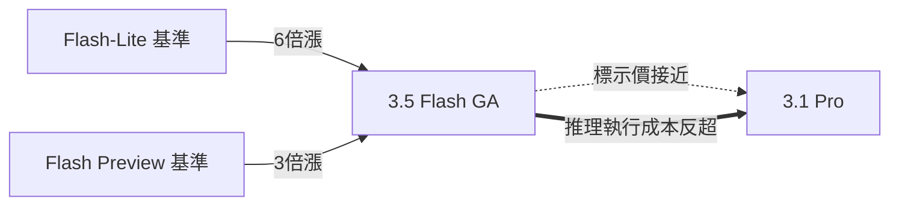

# AI Daily Digest — 2026-05-20

<!-- pipeline-generated:begin -->

## 🔥 今日 TOP 3
### 1. Gemini 3.5 Flash 定價漲 6 倍，執行成本反超旗艦 3.1 Pro
Google 在 I/O 大會正式發布 Gemini 3.5 Flash（GA），定價 $1.50/M input、$9/M output，較 3 Flash Preview 漲 3 倍、較 3.1 Flash-Lite 漲 6 倍，同步部署至 Gemini app、Search AI Mode、Android Studio 等消費級免費產品。

關鍵矛盾：「標示價格」與「執行成本」嚴重背離——啟用推理模式後，Gemini 3.5 Flash 實際執行成本達 $1,551/M，已超越號稱更高階的 3.1 Pro（$892/M）。三大 AI lab 同步推動新世代定價上限：OpenAI GPT-5.5 約前代 2 倍、Anthropic Claude Opus 4.7 計入新 tokenizer 後漲 1.46 倍，Google 卻同時將高成本模型部署至消費免費層，形成業界最罕見的商業矛盾。

開發者預算規劃需納入「推理 token inflation factor」，不能只看標示單價；觀察 Google 如何在免費層承載高成本模型（廣告補貼或服務品質管控）；下月 3.5 Pro 定價將是全行業定價基準的關鍵信號。

📖 [閱讀完整 insight](../10-insights/2026-05-19/inbox_c4204ff6.md) · 🔗 [原文連結](https://simonwillison.net/2026/May/19/gemini-35-flash/#atom-everything)
### 2. Karpathy 加入 Anthropic：預訓練仍有重大突破空間的戰略押注
Andrej Karpathy 宣布加入 Anthropic，被指派從事預訓練相關工作。Karpathy 是深度學習領域最具影響力的研究者之一，曾主導 Tesla Autopilot 神經網路架構，並在 OpenAI 從事核心基礎研究多年。

人事任命在 AI lab 中具有顯著戰略信號價值——職位分配比招聘本身更能透露公司押注方向。Anthropic 此舉意味其相信預訓練仍有重大改進空間，與「基礎模型能力已趨成熟、競爭優勢在應用層」的主流論調形成對立。若這一賭注成立，下一代 Claude 基礎能力可能出現非線性提升，對整個 AI 能力競賽格局影響深遠。

三項觀察指標：未來 12-18 個月 Claude 基礎模型迭代是否出現架構性突破；Karpathy 是否主導可公開的研究方向；此次布局是否迫使 Google 和 OpenAI 重新加碼自身預訓練投資，進而改變基礎模型能力競賽節奏。

📖 [閱讀完整 insight](../10-insights/2026-05-19/inbox_576e47d1.md) · 🔗 [原文連結](https://medium.com/@AdithyaGiridharan/karpathy-joining-anthropic-isnt-about-talent-it-s-a-bet-that-pretraining-isn-t-done-1baf36e040c6?source=rss------claude-5)
### 3. 900 工程師調查：AI 採用收益取決於工程文化而非工具能力
Pragmatic Engineer 對 900+ 軟體工程師進行 2026 年 AI 工具採用調查，發現代碼品質普遍下滑但管理層多數無感，資淺工程師 token 花費最高卻收益最低，AI 工具訂閱制定價鼓勵類似老虎機的「再試一次」過度提示行為。

AI 收益高度依賴既有工程文化——缺乏代碼紀律的團隊採用 AI 反而加速低品質代碼生產速度，而非提升整體品質。另一隱患是知識集中化：維護複雜代碼的工程師人數萎縮，一旦這批人離職技術債無人能接手。與 2024 年相比，2026 工程師負面情緒減少但正面情緒未增加，「模型更強但採用更難」成為共識。

對工程主管的實務建議：導入 AI 工具前先審計 code review 文化成熟度，比選哪個工具更重要；針對資淺工程師設計 token 預算與工作流程邊界；持續追蹤代碼維護負擔是否向少數工程師集中，作為技術債健康指標。

📖 [閱讀完整 insight](../10-insights/2026-05-19/inbox_e9adbf2c.md) · 🔗 [原文連結](https://newsletter.pragmaticengineer.com/p/ai-impact-on-software-engineers-part-2)

## 📖 好文章 / 影片精選

_過去 30 天經 traffic 沉澱的高品質內容，按興趣領域分類。每篇只在 column 出現一次。_
### 🛠 Claude Code 最新 release
- **[v2.1.145](../10-insights/2026-05-19/inbox_1a29fab9.md)**
  Claude Code v2.1.145 發布，包含 10 多項功能改進與穩定性修復。新增 `claude agents --json` 可匯出 live sessions 供 tmux-resurrect 和狀態列整合；改進 OTEL 分佈式追蹤，Agent tool 跨度現在包含 agent_id 和 parent_agent_id，確保後台 subag
### 📚 AI 知識管理
- **[Qwen 3.6-35B-A3B KV cache bench: f16 vs q8_0 vs turbo3 vs turbo4 from 0 to 1M context on M5 Max](../10-insights/2026-04-28/inbox_e1371421.md)**
  Reddit 使用者在 MacBook Pro M5 Max（128GB 統一記憶體）上，使用 TheTom 的 TurboQuant Metal llama.cpp 分支，對 Qwen 3.6-35B-A3B 的 KV cache 量化方案進行了深度測試。比較了 f16、q8_0、turbo3（3-bit）、turbo4（4-bit）四種快取類型在 0 到
- **[I have built something using claude what I was doing on excel from last 13 years](../10-insights/2026-04-28/inbox_4974cf61.md)**
  一位財務建模從業者利用 Claude（搭配 Lovable 和 VSCode）建立了一個無代碼的財務建模網站，整合 RAG 技術抓取行業基準，並訓練模型模擬 VC 的評估邏輯，使投資人可以對模型進行壓力測試。此人過去 13 年在 Excel 進行財務建模工作，6 個月前開始使用 Claude，儘管零代碼經驗，仍能快速實現功能並融資聘請安全專家。這案例展示了領
- **[Everything I Learned Training Frontier Small Models — Maxime Labonne, Liquid AI](../10-insights/2026-04-29/inbox_0b67d1fe.md)**
  Liquid AI 預訓練負責人 Maxime Labonne 深度剖析邊界小模型（350M–24B 參數）的訓練原則。小模型與大模型本質不同：(1) 記憶受限（hardware 邊界），(2) 知識容量低故需 task-specific 優化而非通用 chatbot，(3) 延遲敏感需極速推理。具體案例：Gemma 3 270M embedding 佔 6
- **[PSA: llama-swap released a new grouping feature, matrix, allowing you to fine tune which models can run together](../10-insights/2026-04-30/inbox_7a19aaf7.md)**
  llama-swap 工具發布新的 matrix 分組功能，突破傳統一模型一組的限制。新功能允許模型存在於多個並發組合中，使用 DSL 語言（支持 &、|、() 邏輯）定義靈活的模型共存策略，如「STT + 大模型」「RAG 專用組」等場景。系統基於卸載成本的求解器自動選擇最優組合，可為不同模型設定不同的卸載成本（例：vLLM 後端設 50、70B 模型設 
- **[[Open Source] We built a local code search MCP for Claude Code that uses ~98% fewer tokens than grep+read](../10-insights/2026-04-30/inbox_b21d7e0b.md)**
  開源專案 Semble 推出針對 Claude Code 的本地代碼搜尋 MCP 伺服器，解決傳統 grep+read 流程耗 token 過多的問題。核心指標：(1) Token 效率——相比 grep+read 節省 98%；(2) 性能——索引 250ms、查詢 1.5ms，完全 CPU 執行無需 GPU；(3) 檢索質量 NDCG@10=0.854，
### 🏢 企業導入 AI / 團隊實踐
- **[The Case for Algorithmic Counterweights: Why AI Governance Needs Its Own Checks and Balances](../10-insights/2026-04-28/inbox_532168f4.md)**
  本文提出 AI 治理應納入『制衡機制』（algorithmic counterweights）的新框架，補充現有 alignment、risk categories、red-team evaluation 等討論中被忽視的視角。核心邏輯：如同憲法中的分權制衡避免權力集中，AI 治理應設計獨立的對抗性審查機制和監督流程，而非僅依賴技術對齊。這重新定位了 AI 
- **[Why Good Leaders Pick Bad Metrics](../10-insights/2026-04-24/inbox_a1a7e2cf.md)**
  Michael Hutson 引用 Campbell 定律論證「指標越與高風險決策關聯，越易被扭曲」，以 Jensen Huang 提議年薪 $50 萬工程師應花 $25 萬在 AI Token 上為例。文章揭示一個跨世代模式：LOC → Story Points → Token 消費，每代領導者選中的生產力指標最終在被優化時崩塌。診斷指標（呈現真相）與績效
- **[The Zig project&#39;s rationale for their firm anti-AI contribution policy](../10-insights/2026-04-30/inbox_98604c9d.md)**
  Zig 程式語言專案實施了業界最嚴格的反 LLM 貢獻政策，禁止所有 LLM 輔助提交。而 Anthropic 在 2025 年 12 月收購的 Bun JavaScript 運行時開發了自己的 Zig fork，最近實現了 4 倍編譯性能提升，但因 Zig 的禁令不計畫將改進上游提交。Zig 副總裁提出「貢獻者撲克」哲學：開源項目應投資「貢獻者」而非單次「
### 🎓 AI 使用技巧 / 心法
- **[MTP benchmark results: the nature of the generative task dictates whether you will benefit (coding) or get slower inference (creative) from speculative inference. No other factor comes close.](../10-insights/2026-05-10/inbox_d9689b8d.md)**
  研究者針對 Qwen 3.6 27B 搭配 MTP (Multi-Token Prediction) 進行 300+ 項系統性基準測試，發現投機推斷的效果**完全由任務類型決定，其他變數影響微乎其微**。編程任務加速幅度最大（F16 +171%、Q8_0 +123%），創意寫作可能反而減速（Q4_K_M -9%）。根本原因是任務類型直接決定草稿 token 
- **[Your .claude/ Folder Is a Production Agent](../10-insights/2026-04-14/inbox_07de13da.md)**
  Product Compass 提出了關鍵視角。Claude Code 的 .claude/ 資料夾已經是生產級 AI 代理系統。開發者無需學習新架構即可部署生產代理。該框架統一了配置、管理與部署。重新定義了「生產代理」的概念。從複雜基礎設施要求轉向已有工具整合。對廣泛開發者社群有啟發價值。
- **[SWE-bench Verified no longer measures frontier coding capabilities](../10-insights/2026-04-26/inbox_d4ec9b08.md)**
  OpenAI 宣布停止使用 SWE-bench Verified 評估前沿模型能力，因為深度審計發現該基準存在兩大致命缺陷。其一，在審計的 27.6% 資料集（模型常失敗的問題）中，發現至少 59.4% 問題的測試案例有缺陷，會錯誤拒絕功能正確的提交；其二，訓練資料污染問題，所有受測的前沿模型都在訓練時見過 SWE-bench 的問題與解答，導致模型能複製原
- **[DeepSeek V4 Pro matches GPT-5.2 on FoodTruck Bench, our agentic benchmark — 10 weeks later, ~17× cheaper](../10-insights/2026-05-05/inbox_ac3a3034.md)**
  DeepSeek V4 Pro 在 FoodTruck Bench（30 天代理基準、34 工具、持久化記憶、日常反思）上性能匹敵 GPT-5.2，成為首個進入前沿層級的中文模型，整體排名第 4（Opus 4.6、GPT-5.2、Grok 4.3 之後），成本效率排名第 2（僅次 Gemma 4 31B）。價格優勢顯著：GPT-5.2 定價 $1.75/M 
### 💳 支付 / Fintech
- **[Presentation: Stripe’s Docdb: How Zero-Downtime Data Movement Powers Trillion-Dollar Payment Processing](../10-insights/2026-04-30/inbox_e6062dae.md)**
  Stripe 在 QPS 分享中呈現 DocDB 資料庫層架構與零停機資料遷移平台，支援 500 萬 QPS 與 5.5 個九（99.99995%）的可靠性。系統採用自訂零停機遷移工具進行水平分片、版本升級與多租戶遷移，同時保持全球商務交易所需的強一致性。此架構模式展示了如何在不中斷服務前提下進行基礎設施演進。核心創新在於資料遷移過程的可靠性設計，確保高頻率
- **[Mastering AI Pricing: Flexible &amp; Agile Monetization — Mayank Pant, Stripe](../10-insights/2026-05-01/inbox_1b257924.md)**
  Mayank Pant（Stripe billing architect）分享 AI 定價策略研究結果（Stripe 過去 2 年資料）。AI 公司成長速度是傳統 SaaS 的 3 倍：頂級 100 AI 公司達 2000 萬 ARR 只需 20 個月，SaaS 則需 65 個月。傳統訂閱制（毛利 80–85%）無法應對 AI 邊際成本波動：5–10% 的 
- **[NetHack 5.0.0](../10-insights/2026-05-02/inbox_5dc38f47.md)**
  NetHack 5.0.0 於 2026 年 5 月 2 日發布，這是一次重大現代化版本。核心改進包括：完整達成 C99 標準合規性提升跨平臺相容性；將編譯流程從 yacc/lex 基礎改為 Lua 編譯器（改為在遊戲運行時動態載入而非編譯期靜態編譯），簡化編譯過程；移除交叉編譯障礙，允許使用者在一個系統上為不同平臺編譯；包含超過 3,100 項修複和變更。
- **[Vibe Coding vs. Production reality](../10-insights/2026-05-04/inbox_e3e51fed.md)**
  Reddit 用戶分享觀察：AI 輔助的快速原型設計（\"vibe coding\"）讓概念驗證的 80/20 部分週期從一週縮短到一個下午，但許多人在將不完整產品投入實際使用時遭遇失敗。文章指出生產環境所需的基礎設施——身份驗證、密鑰管理、模型棄用應對、GDPR 合規、審計日誌、速率限制、多租戶支持——在演示中隱而未見，卻在他人部署時全面暴露。核心框架是：
- **[The internal AI tool that’s transforming how Stripe designs products | Owen Williams](../10-insights/2026-05-04/inbox_78e106f0.md)**
  Stripe 產品負責人 Owen Williams 開發了 Protodash，一套內部 AI 工具能將設計系統轉換成可互動原型，耗時僅 2 分鐘。該工具採用「vibe coding」方式加速產品設計流程。此舉反映大廠透過 AI 輔助工具優化產設工作流的實踐方向，對設計團隊效率提升有實質意義。
### ⛓️ 區塊鏈 / Web3
- **[🧠 把我 7 年的幣圈大腦，裝進你的 Claude](../10-insights/2026-05-03/inbox_c4c8f794.md)**
  MaxBrain 正式上線，將 7 年加密研究成果與 55+ 案例分析整合入 Claude 平台，提供實時市場資訊流。使用者可透過訂閱方式直接在 Claude 內存取專業級的幣圈知識庫，無須離開 AI 介面。展示 Claude 作為知識整合與外部專業內容平台的應用方向。
- **[How to Build an Efficient Knowledge Base for AI Models](../10-insights/2026-05-04/inbox_44bb7263.md)**
  Towards Data Science 的知识库构建指南强调：AI 模型性能取决于知识库质量，而非规模。研究数据显示主流 AI 聊天机器人约 50% 查询错误率。提供 6 步系统方法：(1)有针对性收集（价值 > 数量）；(2)清理分块并附元数据；(3)向量化与索引；(4)选择向量数据库存储；(5)(6)验证与迭代。
- **[How OpenAI delivers low-latency voice AI at scale](../10-insights/2026-05-04/inbox_2858977d.md)**
  OpenAI 重新架構 WebRTC 堆棧以支撑全球 900M+ 週活用戶的低延遲語音 AI。核心問題：在規模下實現自然對話流暢度（避免停頓、延遲、中斷插入）。技術方案從傳統 SFU（選擇性轉發單元，用於多方通話）轉向 transceiver 模型（邊界服務終止客戶端連線，內部用簡化協議），以應對三個基礎設施約束：port-per-session 不適配、s
- **[Attacker Bought 30 WordPress Plugins on Flippa and Backdoored All of Them](../10-insights/2026-05-06/inbox_0c18679e.md)**
  攻擊者在 Flippa 上購買 30+ WordPress 外掛，在第一次代碼提交時植入 PHP 反序列化後門，潛伏 8 個月後跨 400,000 個安裝激活，透過以太坊智能合約進行 C2 通訊。此攻擊暴露 WordPress.org 缺乏外掛所有權轉移審查機制的生態漏洞，該漏洞 npm 和 PyPI 已於多年前修復，凸顯開源軟體供應鏈防禦的重要性。
- **[Solidity LM surpasses Opus](../10-insights/2026-05-06/inbox_0b7115ad.md)**
  開發者基於 Qwen 3.6 微調開發的 Solidity 專用語言模型（Qwen3.6-Solidity-27B）在 soleval 基準測試中的 pass@1 指標超越了 Claude Opus 4.7，已發佈至 Hugging Face。該專案投入了大量開發時間和成本，為智能合約程式設計領域的開源模型樹立了新的性能標竿。
### 🔐 AI 安全 / 濫用
- **[Agents of Chaos](../10-insights/2026-05-15/inbox_daaf96a5.md)**
  Cobus Greyling 論文《Agents of Chaos》記錄 20 名研究人員在 2 週內針對 6 個自主 AI agent 進行的實驗結果。Agent 使用 Claude Opus 4.6 和 Kimi K2.5，配備 email、Discord、持久記憶、sudo shell 和 24/7 cron job。實驗產生 11 個失敗案例和 10
- **[Abliterlitics: Benchmarks and Tensor Comparison for Heretic, Abliterlix, Huiui, HauhauCS for GLM 4.7 Flash](../10-insights/2026-04-28/inbox_2fdecc12.md)**
  對 GLM-4.7-Flash（64 專家混合模型）的四種消除對齊技術進行首次全面對比分析，涵蓋 Heretic、HauhauCS、Huihui 和 Abliterix。研究測試了 400 項有害行為，四種技術均達到 100% 攻擊成功率，證明安全移除效果完全，但能力代價各異。核心發現：Heretic（秩 1 編輯策略）表現最優（MMLU 69.00、GSM
- **[Article: Securing Autonomous AI Agents on Kubernetes: Trust Boundaries, Secrets, and Observability for a New Category of Cloud Workload](../10-insights/2026-05-01/inbox_c39d3861.md)**
  Kubernetes 環境中部署的自主 AI agents 打破了傳統基礎設施的安全假設。這些 agents 的動態依賴關係、跨域多重憑證需求和不可預測的資源消耗，給既有的安全框架帶來新的挑戰。文章通過 Nik Kale 的分析，提出了四項在生產環境中驗證可行的安全模式。首先，基於 Kubernetes Job 的隔離機制提供工作負載邊界隔離。其次，透過 V
### 🛤️ AI Flow 導入心得 / 技術分享
- **[Show HN: Semble – Code search for agents that uses 98% fewer tokens than grep](../10-insights/2026-05-17/inbox_04fae80c.md)**
  MinishLab 開源 Semble——為 AI agents 設計的代碼搜尋工具。相比傳統 grep+read，Semble 使用 98% 更少的 tokens，同時達到 99% 的檢索品質，查詢速度快 200 倍（~1.5ms per query）。技術堆棧：Model2Vec 靜態嵌入 + BM25 + RRF（reciprocal rank fus
- **[Talkie: a 13B LLM trained only on pre-1931 text used Claude Sonnet to help test the model and judge its output](../10-insights/2026-04-28/inbox_af2c0cb4.md)**
  研究人員（包括 GPT/CLIP/Whisper 之父 Alec Radford）發布了 Talkie：13 億參數語言模型，訓練數據**完全來自 1931 年前出版的文本**，知識截止於 1930 年 12 月 31 日。該研究旨在打破現代 LLM（GPT、Claude、Gemini、Llama）都源自現代網路的共同祖先，用分布外數據隔離推理能力 vs 記

## 💡 今日 Takeaway

_讀完今日所有內容後，可帶走的知識點_
### 1. API 成本失控根因往往是提示詞低效，而非流量或系統 bug
實際案例顯示：800 token 系統提示在每次 API 呼叫全額計費，低用量時不顯著但規模化後成預算災難；「提供詳盡說明」類曖昧指令讓模型生成 2-3 倍所需長度，每千次呼叫累積可觀成本。建立單一提示樣板（明確輸入長度邊界 + 輸出長度指令）可達 73% 降幅而品質零衰退。預算規劃應同時追蹤 input token per call 與 average output token per call，而非只看月帳單總額。

_類型：data-point_

**參考來源**：
- [How I Slashed My Claude API Costs by 73% With One Prompt Template — The Exact AI Cost Optimization...](../10-insights/2026-05-19/inbox_f3c37894.md) · [原文](https://medium.com/@laviswills/how-i-slashed-my-claude-api-costs-by-73-with-one-prompt-template-the-exact-ai-cost-optimization-9f785a6952f6?source=rss------claude-5)
### 2. Evals 接入 CI 阻斷部署，是防止 AI 系統生產靜默失效的最低紀律
AI 系統在生產可能靜默出錯而不拋異常，危險程度不亞於未測試的軟體直接上線。將 evals 整合進 CI/CD 管道並以失敗阻斷部署，強制每次 prompt 或模型版本變更都通過品質關卡。實務起點：先定義 3-5 個核心行為的 golden test cases，設定通過閾值，即可建立最小可行 eval gate，成本極低但防護效果顯著。

_類型：pattern_

**參考來源**：
- [Evals That Block Deploys: Why I Treat My AI Like Software](../10-insights/2026-05-19/inbox_1356735b.md) · [原文](https://medium.com/@vishnumeta/evals-that-block-deploys-why-i-treat-my-ai-like-software-2787e3d23cf1?source=rss------large_language_models-5)
### 3. AI 工具 ROI 取決於既有工程紀律，而非工具本身的能力強弱
900+ 工程師調查揭示：AI 工具收益高度依賴代碼紀律、架構成熟度、審查文化，缺乏這些前提的團隊採用後反而加速技術債累積。資淺工程師 token 花費最多但收益最少，顯示效益與使用者能力匹配度密切相關。導入決策優先順序：先評估 code review 文化成熟度 → 設計 AI 輔助工作流程邊界 → 再選工具，而非反過來。

_類型：data-point_

**參考來源**：
- [AI’s impact on software engineers in 2026: key trends, Part 2](../10-insights/2026-05-19/inbox_e9adbf2c.md) · [原文](https://newsletter.pragmaticengineer.com/p/ai-impact-on-software-engineers-part-2)
### 4. 企業 RAG 進化路徑：Naive → CRAG 評估修正 → Agentic 主動迴圈
傳統 RAG 三大缺陷——單次檢索無修正、分塊語義扁平化、零反饋迴圈——在企業複雜工作流中系統性失效。CRAG 透過信心度分類修正搜尋精度，但仍屬被動架構。真正適合企業工作流的是 Agentic RAG：Plan-Act-Observe-Reflect 主動迴圈，系統可動態決定是否再次檢索或切換工具。設計 RAG 系統時先問「需要多步驟決策嗎？」——若是，直接從 Agentic 架構起步，避免事後重構。

_類型：pattern_

**參考來源**：
- [Is RAG dead in 2026?](../10-insights/2026-05-19/inbox_c13063e5.md) · [原文](https://medium.com/@mircofdo/is-rag-dead-in-2026-33a18dbfd1d5?source=rss------large_language_models-5)

<!-- pipeline-generated:end -->

<!-- user-notes -->
<!-- Write your own notes below; pipeline never touches this section. -->