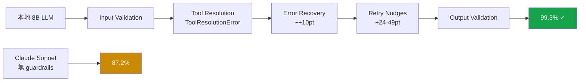
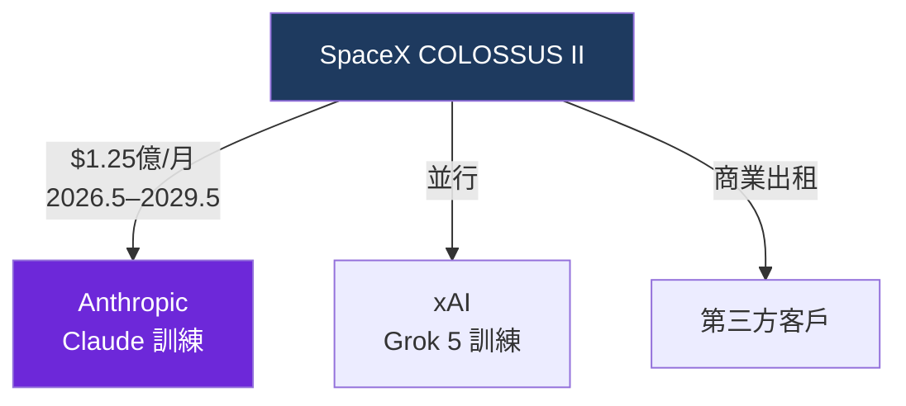

# AI Daily Digest — 2026-05-21

<!-- pipeline-generated:begin -->

## 🔥 今日 TOP 3
### 1. 本地 8B 模型加 Forge Guardrail 成功率達 99.3%，超越 Claude Sonnet
Forge 是開源代理可靠性框架，透過 5 層可切換 guardrail 堆疊，將本地自託管 8B 模型在多步代理工作流的任務成功率從基礎 53% 提升至 99.3%。研究測試 97 種模型配置、18 個場景，各執行 50 次，論文已被 ACM CAIS '26 接受。

最關鍵發現是後端 serving 層的影響遠超模型本身——同一模型在不同 serving 配置下成功率差異可達 7% vs 83%。本地 8B + Forge（99.3%）超越無 guardrails Claude Sonnet（87.2%），直接打破「升級更貴模型等於提升可靠性」的常見假設。

Retry nudge 與 error recovery 是最關鍵兩層，禁用時分別帶來 24-49 點與 ~10 點的成功率下滑。在決定升級模型前，應先審計這兩層是否完善。v0.6.0 已強化 eval 至 26 場景，並暴露了 Opus 4.6 等前沿模型的盲點，值得持續追蹤。

📖 [閱讀完整 insight](../10-insights/2026-05-19/inbox_74136c6f.md) · 🔗 [原文連結](https://github.com/antoinezambelli/forge)
### 2. GPT-next 以不足 $1,000 成本解決 80 年懸案的 Erdős 數學猜想
OpenAI 的 GPT-next 模型成功證明離散幾何學的 Erdős 平面單位距離猜想，一個 80 年來無人類數學家能完整解決的基礎命題，同時推翻了該領域的中心猜想。解題成本低於 $1,000，已獲學術社群（包含 @wtgowers）公開確認，OpenAI 官方同步發文披露。

這不是 AI 在競賽題上的表現優化，而是在「無確定答案」的原創研究中首次取得學術認可的突破。前沿 LLM 的推理邊界正從工程應用延伸至基礎科學，對仰賴人類專家壟斷複雜推理的研究機構是一個清晰的能力信號。相對傳統數學研究動輒數年的時間與人力投入，成本不足 $1,000 的門檻尤其值得關注。

兩個關鍵待觀察重點：(1) 完整解法技術細節與使用模型版本何時公開，結果能否獨立重現；(2) 此類能力能否複製至其他開放猜想（如 Collatz、Riemann 等）。若可驗證且可推廣，學術機構將有充分動機開始系統性部署 LLM 作為數學研究工具，重塑基礎科學的研究經濟學。

📖 [閱讀完整 insight](../10-insights/2026-05-20/inbox_f5d1ab5e.md) · 🔗 [原文連結](https://openai.com/index/model-disproves-discrete-geometry-conjecture)
### 3. SpaceX IPO 揭露 Anthropic 月付 $1.25 億算力合約，提供業界成本基準
SpaceX S-1 IPO 申報書首度公開 Anthropic 租用 COLOSSUS 與 COLOSSUS II 計算資源的商業細節：月費 $1.25 億，合約期 2026 年 5 月至 2029 年 5 月（36 個月），任一方可 90 天通知終止。同一基礎設施同時被 SpaceX 用於訓練 Grok 5 並向第三方商業出租。

月度 $1.25 億（年化 $15 億）是前沿 LLM 訓練成本罕見的公開基準數字，為整個行業的融資規劃與競爭對手成本估算提供了難得的參照。多租戶算力複用模式也揭示大型計算基礎設施如何透過並行服務多個頂級客戶來分攤固定成本。

此成本直接決定 Anthropic 的 runway 壓力，下一步觀察：其年收入是否能支撐此支出比例，以及 AWS Trainium 等自建算力路線能否長期替代第三方租賃，降低對單一算力供應商的依賴風險。

📖 [閱讀完整 insight](../10-insights/2026-05-20/inbox_70c9b323.md) · 🔗 [原文連結](https://simonwillison.net/2026/May/20/spacex-s1/#atom-everything)

## 📖 好文章 / 影片精選

_過去 30 天經 traffic 沉澱的高品質內容，按興趣領域分類。每篇只在 column 出現一次。_
### 🛠 Claude Code 最新 release
- **[v2.1.146](../10-insights/2026-05-21/inbox_ef42e1aa.md)**
  Claude Code 釋出 v2.1.146，將 /simplify 指令重新命名為 /code-review 並新增 effort level 參數（如 /code-review high）；修復 Windows PowerShell 工具失效問題（winget 及 Microsoft Store 安裝版本的 command line invalid 錯
### 📚 AI 知識管理
- **[Designing Memory for AI Agents: Inside Linkedin’s Cognitive Memory Agent](../10-insights/2026-04-20/inbox_c17cc528.md)**
  LinkedIn 推出 Cognitive Memory Agent（CMA），一層生成式 AI 基礎設施，為系統提供持久化、上下文感知能力。CMA 實現三層記憶架構：插曲記憶（episodic）存特定互動、語義記憶（semantic）存知識和關係、程序記憶（procedural）存執行模式。支援多代理協作、檢索和生命週期管理，直接解決 LLM 無狀態性，實
- **[How Amazon Uses LLMs to Recommend Products](../10-insights/2026-04-27/inbox_0109667e.md)**
  Amazon 開發 COSMO（常識知識圖譜）解決電商推薦的「語義間隙」問題。傳統系統只做文本-文本與購買歷史配對，但當用戶搜尋『孕婦用防滑鞋』時，產品列表未必明確提及「防滑」，系統需推理出『孕婦需穩定性→穩定性意味著防滑』。Amazon 用 OPT-175B 和 OPT-30B 大語言模型（16 個 A100 GPU 運行）處理 312 萬個共購對與 18
### 🏢 企業導入 AI / 團隊實踐
- **[Presentation: Agents, Architecture, &amp; Amnesia: Becoming AI-Native Without Losing Our Minds](../10-insights/2026-04-29/inbox_5c4561b5.md)**
  Tracy Bannon 以「魔法師學徒」寓言警示無節制 AI 自主性風險，指出從 bots 到 autonomous agents 轉變帶來「架構失憶症」（持續累積無記錄的決策）。她提出「最小可行治理」（MVG）框架，核心三支柱為身份驗證、委託權限管理、架構決策記錄（ADRs），以在機器速度下控制技術債的增長，避免組織喪失架構決策履歷。
### 🎓 AI 使用技巧 / 心法
- **[Show HN: Forge – Guardrails take an 8B model from 53% to 99% on agentic tasks](../10-insights/2026-05-19/inbox_74136c6f.md)**
  Forge 是開源可靠性框架，透過 5 層可切換 guardrail 堆棧將自託管 8B LLM 在多步代理工作流的成功率從 53% 提升至 99.3%。核心發現：本地 8B + Forge (99.3%) 超越無 guardrails Claude Sonnet (87.2%)，後端基礎設施影響巨大（同一模型在不同 serving 層達 7% vs 83%
- **[DeepSeek V4—almost on the frontier](../10-insights/2026-05-01/inbox_e0f2b793.md)**
  DeepSeek 發布 V4 預覽模型系列，包括 V4-Pro (1.6T 參數，49B active) 和 V4-Flash (284B 參數，13B active)，均支援 100 萬 token 上下文和 MIT 許可證。V4-Pro 成為現今最大的開源權重模型，超過 Kimi K2.6 和 GLM-5.1；其效率突破：僅需 27% 的單 token 
- **[Gemini 3.5 Flash: more expensive, but Google plan to use it for everything](../10-insights/2026-05-19/inbox_c4204ff6.md)**
  Google 在 I/O 大會發布 Gemini 3.5 Flash（GA），部署到 Gemini app、Search AI Mode、Antigravity、Gemini API、Android Studio 和企業平台。規格：1M input token、65.5K output token、Jan 2025 知識截斷、無電腦操控。但定價大幅上漲：$1
- **[Small AI Models Are the Next Big Thing](../10-insights/2026-04-27/inbox_dc7df002.md)**
  本文論述小型 AI 模型將主導未來五年，核心論點是「效率時代」勝於規模競賽。小模型優勢：速度毫秒級（vs 雲端 1-3 秒）、成本近零（本地執行 vs 每查詢計費；百萬查詢日可節省 $33M），隱私本地化，能效優。具體應用：Apple on-device intelligence、Google Android 語音識別、Microsoft Phi、Meta 
- **[Every LLM Just Scored 0% on this AI Benchmark](../10-insights/2026-05-06/inbox_3834db24.md)**
  新基準 ProgramBench 測試 LLM 從零開始獨立構建完整軟體系統的能力（對象：FFmpeg、SQLite、ripgrep 等真實工程），所有現有 LLM 都得 0%。失敗根源：LLM 只擅長「完成模式」和「回憶結構」，缺乏真正的系統級思維；無法在數千個相互依賴函數間保持邏輯一致；context window 和規劃深度有限；依賴訓練數據的部分重疊
### 💳 支付 / Fintech
- **[How AI Is Reshaping Risk Management in Banks](../10-insights/2026-05-04/inbox_557ba865.md)**
  AI 在銀行風險管理中的角色升級，從單純加速工具演進為決策嵌入式元件。2026 年銀行應用 AI 進行詐欺檢測、信貸評估與市場風險監控，將 AI 與規管要求深度整合到常規營運。這標誌金融業 AI 應用從試驗階段邁入主流規範化運作，成為風險管理基礎設施的一部分。
- **[7 Measurable Benefits of AP Automation That CFOs Actually Care About](../10-insights/2026-05-05/inbox_2e050e9f.md)**
  AP（應付帳款）自動化為 CFO 帶來七項可量化效益。核心指標：(1) 每筆發票成本從 £10-15 降至 £2-5（降 60-80%），年度節省 £160-200k；(2) 自動三向配對加速月結週期 1-3 天；(3) 重複支付詐欺減 80-95%（通常佔支出 0.1-0.5%）；(4) 現金預測準度從 10-20% 偏差改善至 3-7%，解鎖 £100-
- **[Y Combinator&#39;s Stake in OpenAI (0.6%?)](../10-insights/2026-05-05/inbox_731a6447.md)**
  Y Combinator 持有 OpenAI 約 0.6% 股份，在當前 $852 億估值下價值超 $50 億。該股權源自 2016 年 OpenAI 由 YC Research（Y Combinator 子機構）等出資創立，時任 YC 主席的 Sam Altman 後來兼任 OpenAI CEO。文章指出此項重大利益衝突在對 Altman 聲譽的第三方調查
- **[Himalayan‑Grade AI Architecture](../10-insights/2026-05-06/inbox_0e8ff7be.md)**
  文章提出「喜馬拉雅級」AI 架構設計框架，強調韌性（resilience）、可審計性（auditability）及監管對齐（regulator-aligned）三大支柱，適應於企業級和受規管產業的 AI 系統部署。該框架旨在平衡 AI 系統的功能性與合規性風險管理。
- **[Anthropic’s new finance AI agents feel like a bigger move than just “better chat”](../10-insights/2026-05-06/inbox_35bcc9f5.md)**
  Anthropic 推出 10 款針對金融服務與保險業的生產級 AI agents，可執行籌資簡報、KYC 文件篩選、月結作業等工作流程，分別透過 Claude Cowork、Claude Code 與 Managed Agents 交付。Reuters 報導指金融服務已是 Anthropic 第二大產業客群（次於科技），客戶包括高盛、Visa、花旗、美國國
### ⛓️ 區塊鏈 / Web3
- **[How Monero’s proof of work works](../10-insights/2026-05-04/inbox_51ed167e.md)**
  Monero 採用 RandomX 共識算法而非傳統固定雜湊函數。RandomX 的核心設計包括：(1) 執行隨機代碼而非固定流程，利用現代 CPU 的多元硬體特性（快取、浮點運算、分支處理、推測執行）；(2) 構建約 2GB 資料集 + 256MB 快取以強化記憶體使用；(3) 執行 8 個鏈式程序，每個包含整數運算、浮點運算和大量記憶體訪問。這項設計刻意
- **[How to Deploy a Fine-Tuned LLM on Bittensor’s Chutes AI](../10-insights/2026-05-08/inbox_dce6daa0.md)**
  文章詳細介紹如何在 Bittensor 的 Chutes AI（subnet 64）上部署微調後的大語言模型。Chutes AI 是一個去中心化的 AI 推理平台，透過礦工提供的計算資源提供模型部署和 API 調用。作者提供逐步教學：使用 chutes SDK 的 NodeSelector 配置硬體需求（如 gpu_count=1），利用 vLLM 高效推理
- **[Things I wish I knew earlier about Claude token usage](../10-insights/2026-05-07/inbox_c63a4866.md)**
  使用者分享 Claude 代幣使用最佳化心法，發現大部分代幣消耗非來自模型答覆而是上下文設置。核心技巧包括：(1) 不相關任務開啟新對話，避免長對話重複傳送完整歷史；(2) 將多個小問題合併成一條訊息，減少重複的上下文加載；(3) 保持 CLAUDE.md 簡潔，改為索引指向相關檔案，每回合模型都會重讀此檔案；(4) 精確指定檔案引用而非傳全部代碼，節省 3
- **[Attention - Opus 4.7 is english only. USing foreign languages (here German) burns tokens](../10-insights/2026-05-10/inbox_ac29a564.md)**
  Pro 訂閱用戶發現 Opus 4.7 在德語提示中的 token 消耗異常高。使用德文詢問股票預測 + 圖表分析 + Excel 輸出時，Opus 4.7 在數秒內耗盡整個會話 token 限額（100%），而 Opus 4.6 耗時約 5 分鐘消耗 33%、Sonnet 消耗 28%。根本原因：德語複合詞（如「Aktienmarktanalyse」vs「
- **[Presentation: Evolution of a Backend for a Streaming Application](../10-insights/2026-05-11/inbox_2eed0e9d.md)**
  Daniele Frasca 分享了德國流媒體巨頭 Joyn 的後端架構演進路徑，展示了從脆弱的單節點設置遷移至基於 AWS 的彈性無服務架構的過程。為確保數據一致性，採用了 Hub and Spoke 模式；為降低故障爆炸半徑，引入了基於單元（cell-based）的隔離策略；為實現成本優化的多區域主動-主動部署，應用了特定的架構設計。此案例展示了大型分散
### 🔐 AI 安全 / 濫用
- **[Pip 26.1 Ships Dependency Cooldowns and Experimental Lockfile Support to Combat Supply Chain Attacks](../10-insights/2026-05-20/inbox_b72521f3.md)**
  Pip 26.1 推出「依賴冷卻期」機制強化供應鏈安全——新發布的套件需等待 7 天才能被 pip 安裝。同時發布實驗性 pylock.toml 鎖檔支持（PEP 751），提供更強的依賴版本控制。根據供應鏈安全研究，7 天冷卻期可阻止分析樣本中 80%（10 個案例中 8 個）的攻擊成功。該措施標誌著 Python 生態在面對快速演進的供應鏈威脅時的主動防
- **[GitHub confirms breach of 3,800 repos via malicious VSCode extension](../10-insights/2026-05-20/inbox_424a5f72.md)**
  GitHub 確認遭受大規模安全漏洞：3,800 個代碼庫因惡意 VSCode 擴充模組遭到未授權存取。此次事件為 GitHub 內部倉庫遭侵的進一步確認與詳細披露。對開發者社群構成軟體供應鏈安全威脅。
### 🛤️ AI Flow 導入心得 / 技術分享
- **[LLM codegen fails and how to stop &#39;em — Danilo Campos, PostHog](../10-insights/2026-04-30/inbox_2f224b85.md)**
  PostHog 的 Danilo Campos 分享 LLM 自動代碼生成代理如何失敗及解決方案。PostHog Wizard 每月被 15,000 人使用，能將通常需要 2 小時的工作壓縮為 8 分鐘，且生成的整合實際可用。他討論了「模型衰退」（model rot）問題—訓練模型成本巨大且耗時，導致模型與現實漂移。此講題深入探討 LLM 自動編碼的多種失敗
- **[Long-context coding on RTX 5080 16GB: Qwen3.6-35B-A3B holds 30 t/s at 128K (89 t/s fresh), no quality drop](../10-insights/2026-04-30/inbox_c0df3db3.md)**
  用戶在消費級 RTX 5080 16GB 上實現 Qwen3.6-35B-A3B MoE 模型長上下文編碼代理，在 128K token 上下文維持 30 token/s 速度。對比測試顯示，MoE 模型雖參數多（35B vs 27B），但通過專家卸載到系統 RAM，相比密集模型提升 10 倍速度（30 vs 3.2 t/s）且代碼質量更高（通過實際 bug

## 💡 今日 Takeaway

_讀完今日所有內容後，可帶走的知識點_
### 1. Guardrail 堆疊完整性對 Agent 成功率的影響超過模型等級本身
Forge 實測顯示，後端 serving 層配置差異（同模型 7% vs 83%）與 guardrail 完整性對成功率的影響遠超模型本身的能力等級。Retry nudge 與 error recovery 是最關鍵兩層，禁用時各帶來 24-49 點與 ~10 點的成功率下滑。評估 agent 系統效能前，應先審計 guardrail 堆疊是否完善，再決定是否投入更高成本的模型。

_類型：framework_

**參考來源**：
- [Show HN: Forge – Guardrails take an 8B model from 53% to 99% on agentic tasks](../10-insights/2026-05-19/inbox_74136c6f.md) · [原文](https://github.com/antoinezambelli/forge)
### 2. 7 天依賴冷卻期可阻斷 80% 已知供應鏈攻擊，比白名單更直接有效
供應鏈攻擊者通常在套件發布後立即利用窗口期；pip 26.1 實證研究顯示 7 天冷卻期阻止了樣本中 80%（10 個案例中 8 個）的攻擊成功。搭配 pylock.toml 鎖檔（PEP 751）可同時防禦惡意版本注入與隱性間接依賴漏洞，是基於時間窗的主動防禦，比依賴維護白名單更低操作成本。

_類型：data-point_

**參考來源**：
- [Pip 26.1 Ships Dependency Cooldowns and Experimental Lockfile Support to Combat Supply Chain Attacks](../10-insights/2026-05-20/inbox_b72521f3.md) · [原文](https://www.infoq.com/news/2026/05/pip-261-dependency-cooldowns/?utm_campaign=infoq_content&utm_source=infoq&utm_medium=feed&utm_term=global)
### 3. Agent 成本爆炸的三個隱藏源頭不在模型定價，而在工作流架構缺陷
Claude agent workflow 的成本失控主要來自三個架構缺陷：重複調用浪費 token、context 膨脹拖慢每次推理、retry 風暴在錯誤情境下成倍累積費用。這三層缺陷不出現在帳單分類中，卻決定生產環境的實際 ROI。針對這三層做架構審計與優化，可在不更換模型的情況下大幅降低 agent 生產成本。

_類型：framework_

**參考來源**：
- [Why Claude Costs Keep Rising in Agent Workflows (and How I Stopped the Hidden Token Leaks)](../10-insights/2026-05-21/inbox_ffcbd828.md) · [原文](https://medium.com/@aikeyfounder/why-claude-costs-keep-rising-in-agent-workflows-and-how-i-stopped-the-hidden-token-leaks-7358fd521fd7?source=rss------claude-5)
### 4. Relay-Transceiver 設計讓即時媒體 Session 狀態可雲原生橫向擴展
傳統 WebRTC 媒體終止模型將 session 狀態與媒體流綁定於同一節點，難以適應 Kubernetes 負載平衡與自動擴展。Relay-transceiver 設計將 session 狀態集中在專用 transceiver 層，媒體流透過 relay 靠近終端用戶傳遞，同時降低公網 UDP 曝露面。此模式可直接套用於需要全球低延遲部署的語音或視訊 AI 推理基礎設施。

_類型：technique_

**參考來源**：
- [OpenAI Outlines WebRTC Architecture for Low-Latency Voice AI at Scale](../10-insights/2026-05-20/inbox_04a8b950.md) · [原文](https://www.infoq.com/news/2026/05/openai-voice-ai-scale/?utm_campaign=infoq_content&utm_source=infoq&utm_medium=feed&utm_term=global)
- [OpenAI Outlines WebRTC Architecture for Low-Latency Voice AI at Scale](../10-insights/2026-05-20/inbox_ed79be5e.md) · [原文](https://www.infoq.com/news/2026/05/openai-voice-ai-scale/?utm_campaign=infoq_content&utm_source=infoq&utm_medium=feed&utm_term=Architecture+%26+Design)
### 5. 多 Agent 系統將「診斷」與「執行」分離給專責 Agent 可降低整體複雜度
單一通用 agent 同時處理診斷與修復時，決策空間過大且錯誤邊界模糊。Grab 數據平台實踐顯示，將「調查」與「改進」分離給專責 agent 並透過協調層互動，使每個 agent 聚焦在較小的決策空間，精準度與可維護性均提升，並將工程團隊從被動救火解放至主動平台工程。此模式適用於任何具有「問題定位」與「問題修復」兩個不同認知負荷的自動化工作流。

_類型：pattern_

**參考來源**：
- [Designing a Multi-Agent System for Engineering Support at Scale: A Case Study From Grab](../10-insights/2026-05-20/inbox_7455f307.md) · [原文](https://www.infoq.com/news/2026/05/grab-multi-agent-support-system/?utm_campaign=infoq_content&utm_source=infoq&utm_medium=feed&utm_term=global)
- [Designing a Multi-Agent System for Engineering Support at Scale: A Case Study From Grab](../10-insights/2026-05-20/inbox_3251a7f0.md) · [原文](https://www.infoq.com/news/2026/05/grab-multi-agent-support-system/?utm_campaign=infoq_content&utm_source=infoq&utm_medium=feed&utm_term=Architecture+%26+Design)

<!-- pipeline-generated:end -->

<!-- user-notes -->
<!-- Write your own notes below; pipeline never touches this section. -->