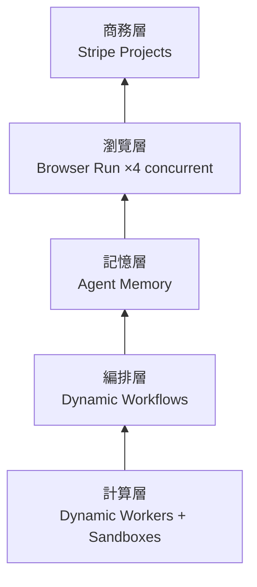
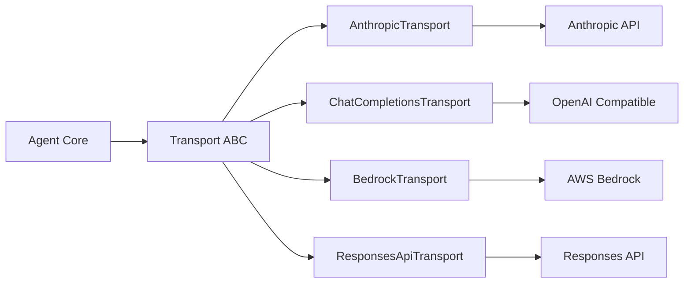

# AI Daily Digest — 2026-05-22

<!-- pipeline-generated:begin -->

## 🔥 今日 TOP 3
### 1. Cloudflare 六層 Agent 基礎設施全棧正式成形
Cloudflare 將企業 Agent 應用所需基礎設施系統化為六層堆疊：計算層（Dynamic Workers + Sandboxes）、編排層（Dynamic Workflows）、記憶層（Agent Memory）、瀏覽層（Browser Run）、商務層（Stripe Projects），並在自有 Containers 平台上重建 Browser Run，並發能力提升 4 倍、響應延遲降低 50%。

對 Agent 應用開發者而言，過去須自行組裝五大系統；此六層架構提供分層即服務的完整參考模型。相比碎片化單點解決方案，統一堆疊大幅降低 Agent 從原型到生產的整合複雜度，亦明確了企業 Agent 產品的最小可行基礎設施範圍——缺少任一層即代表可觀的技術負債。

開發者現可對照此六層模型審視自身 Agent 架構缺口。觀察重點：AWS、GCP 是否跟進類似分層定義，以及 Cloudflare 是否將此堆疊演化為完整 Agent PaaS 定價產品。

📖 [閱讀完整 insight](../10-insights/2026-05-22/inbox_1720359e.md) · 🔗 [原文連結](https://www.infoq.com/news/2026/05/cloudflare-agent-platform-stack/?utm_campaign=infoq_content&utm_source=infoq&utm_medium=feed&utm_term=global)
### 2. Hermes v0.11.0 Transport ABC 實現真正多 Provider 互操作
Hermes Agent v0.11.0（1,556 commits、761 merged PRs）完成兩大架構里程碑：Transport ABC 層將 format conversion 與 HTTP transport 解耦，讓 AnthropicTransport、ChatCompletionsTransport、BedrockTransport、ResponsesApiTransport 各自持有格式適配邏輯；同步完成 React/Ink TUI 完整重寫，加入 sticky composer、live streaming、LaTeX rendering。同版本新增 5 條推理路徑（NVIDIA NIM、Arcee AI、Gemini OAuth 等）。

Transport 抽象的核心價值在於廠商切換成本趨近於零：在 LLM provider 快速迭代的市場中，格式轉換與 HTTP 傳輸分離讓新增 provider 無需改動核心 pipeline。相比單一 provider 綁定架構，廠商鎖定風險大幅降低，同時為 plugin 貢獻者提供標準接入介面——5 條新推理路徑的快速落地正是驗證。

設計 multi-provider agent 架構時，可採用 Transport ABC 模式：定義抽象基類分離 format encode/decode、HTTP transport、auth injection 三職責，每個 provider 實現此三介面，核心邏輯零改動。觀察 Bedrock failover 場景穩定性與社群 provider 貢獻速度。

📖 [閱讀完整 insight](../10-insights/2026-04-23/inbox_8472d81a.md) · 🔗 [原文連結](https://github.com/NousResearch/hermes-agent/releases/tag/v2026.4.23)
### 3. Hermes v0.13.0：heartbeat + zombie 偵測 + 幻覺閘門三重 Durable 編排
Hermes Agent v0.13.0（864 commits、13 P0 修復）引入 multi-agent Kanban board，實現三重 durable orchestration：heartbeat 心跳偵測、zombie detection 序列恢復、hallucination gate 幻覺輸出閘門。/goal 指令搭配 Ralph loop 鎖定 agent 跨轉折目標，Checkpoints v2 提供狀態持久化，Gateway auto-resume 恢復中斷會話。同版本完成 8 個 P0 安全修復（redaction 預設開啟、Discord role guild-scoped、WhatsApp 陌生人拒絕、auth.json TOCTOU 關閉）。

多 agent 協作最大挑戰是任務中途失敗與目標漂移：heartbeat + zombie reclaim 解決可靠性，hallucination gate 防止幻覺輸出流入下游，/goal + Ralph loop 防止長任務中 agent 遺忘初始目標。相比無持久化的 one-shot agent 設計，此架構讓 AI team 可完成跨數小時的複雜任務，且安全層同步到位。

構建長任務 agent 系統時，應優先設計 heartbeat/checkpoint/zombie detection 三層機制而非複雜 task decomposition。觀察此三層可靠性模式是否成為 agent framework 標準配備——類似 circuit breaker 在微服務生態的地位。

📖 [閱讀完整 insight](../10-insights/2026-05-07/inbox_eee8083e.md) · 🔗 [原文連結](https://github.com/NousResearch/hermes-agent/releases/tag/v2026.5.7)

## 📖 好文章 / 影片精選

_過去 30 天經 traffic 沉澱的高品質內容，按興趣領域分類。每篇只在 column 出現一次。_
### 🛠 工具版本追蹤 / Release
- **[Release Candidate v1.6.6-rc.43](../10-insights/2026-05-22/inbox_fc9b754d.md)**
  GitNexus v1.6.6-rc.43 發布，包含語言、性能和穩定性的重大改進。新增功能：Kotlin scope resolver、JavaScript scope-based resolution 遷移（RFC #909）、C++ SFINAE 過濾和重載運算符解析、GitLab 倉庫支持。性能優化：自動堆積提升至 16GB（支持 UE5 規模倉庫）
- **[Release Candidate v1.6.6-rc.42](../10-insights/2026-05-22/inbox_739f1699.md)**
  GitNexus v1.6.6-rc.42 發布，為 rc.43 的前一版本。功能集合幾乎相同，包含 Kotlin scope resolver、JavaScript scope-based resolution、C++ 功能擴展（SFINAE、type_traits、重載運算符）、16GB 記憶體上限、GitLab 支持等。此為快速迭代 RC 序列的一部分
- **[Release Candidate v1.6.6-rc.41](../10-insights/2026-05-22/inbox_f0cde54b.md)**
  GitNexus v1.6.6-rc.41 發布。此 rc 版本與 rc.42 功能基本相同，為快速迭代序列的一環。包含 Kotlin scope resolver、JavaScript scope-based resolution 遷移、C++ 功能擴展、16GB 記憶體上限、WAL 檢測和恢復、Windows 相容性修復等。此為預發佈版本，用於早期測試反
- **[Release Candidate v1.6.6-rc.40](../10-insights/2026-05-22/inbox_951da617.md)**
  GitNexus v1.6.6-rc.40 發布，為 rc 快速迭代序列的早期版本。包含 Kotlin scope resolver、JavaScript scope-based resolution、C++ 功能擴展（SFINAE、type_traits 約束）、16GB 記憶體自動堆積、WAL 損毀檢測、Git worktrees 和 GitLab 倉庫
- **[Release Candidate v1.6.6-rc.39](../10-insights/2026-05-22/inbox_6b2b9adc.md)**
  GitNexus v1.6.6-rc.39 發布，自動化預發行版本，npm install gitnexus@rc。本版本融合多語言分析改進：JavaScript 完成 scope-based resolution 遷移（RFC #909 Ring 3），Kotlin 新增 scope resolver 並強化 smart-cast 型別精化、overloa
- **[Release Candidate v1.6.6-rc.38](../10-insights/2026-05-22/inbox_121ad333.md)**
  GitNexus v1.6.6-rc.38 發布，預發行版本（main 分支 954b184），npm install gitnexus@rc。包含核心功能：JavaScript scope-based resolution 遷移、C++ SFINAE 和 type_traits 強化、Java 同模組 FQN 優先解析、Kotlin scope resol
- **[rc/954b1842486bd381c80133d68ef08de4872d28cf: fix(cli): apply --no-stats to keep-marker stats line (#1706) (#1765)](../10-insights/2026-05-22/inbox_b092e20f.md)**
  GitNexus 修復：--no-stats 旗標在 keep-marker 路徑被忽略問題。keep-marker 分支每次分析時重建 index-summary 行，總是重新注入易變計數（符號數、檔案數等），導致 --no-stats 被無視。對於提交帶 gitnexus:keep marker 的 AGENTS.md/CLAUDE.md 的團隊，此行為
- **[Release Candidate v1.6.6-rc.37](../10-insights/2026-05-22/inbox_54bdf029.md)**
  GitNexus v1.6.6-rc.37 預發行版本（main 分支 be3833d），npm install gitnexus@rc。包含 JavaScript scope-based resolution 遷移（RFC #909）、C++ SFINAE 過濾和 type_traits 擴展、Java 同模組 FQN 優先解析、Kotlin scope 
- **[Release Candidate v1.6.6-rc.36](../10-insights/2026-05-22/inbox_935e9d6c.md)**
  GitNexus v1.6.6-rc.36 預發行版本（main 分支 dc96bb0），自動化構建。包含 JavaScript scope-based resolution 遷移、C++ SFINAE 過濾和 type_traits constraint 擴展、Kotlin scope resolver、Java 同模組 FQN 優先解析。功能面支持 Gi
- **[Release Candidate v1.6.6-rc.35](../10-insights/2026-05-22/inbox_5a4fc8b6.md)**
  GitNexus v1.6.6-rc.35 預發行版本（main 分支 8c1983a），自動化構建，npm install gitnexus@rc。包含 JavaScript scope-based resolution 遷移、Kotlin scope resolver、C++ SFINAE 和 type_traits 強化、Java 同模組 FQN 優先
- **[v2.1.148](../10-insights/2026-05-22/inbox_fa3dfa3b.md)**
  Claude Code v2.1.148 修復 v2.1.147 版本引入的迴歸 bug：Bash 工具在某些用戶上對每個命令都返回 exit code 127，導致工具失效。此修復恢復正常的 exit code 行為，所有依賴 Bash 工具執行命令的用戶應升級至此版本。
- **[v2.1.147](../10-insights/2026-05-21/inbox_06bed06f.md)**
  Claude Code v2.1.147 發布，帶來大量改進和修復。釘選背景 sessions 現保持存活並在更新時原地重啟，只在記憶體壓力下移除。/simplify 改名為 /code-review，可指定 effort level 報告正確性 bug，支持直接貼 GitHub PR 評論。自動更新器增強了重試邏輯和錯誤報告。修復範圍廣泛超過二十項，涵蓋 
### 📚 AI 知識管理
- **[I Gave an AI Agent the Keys to My Life (Here&#39;s What Happened) — Radek Sienkiewicz, Velvet Shark](../10-insights/2026-05-02/inbox_05b38ebd.md)**
  Radek Sienkiewicz（OpenClaw 維護者）分享如何逐步將 OpenClaw AI agent 整合進生活：代理可訪問郵件、筆記、日程表、操作系統、3000+ 頁 Obsidian 知識庫。通過五大類自動化工作流（ambient operations、attention filtering、draft synthesis、execution
- **[Why Most Production RAG Systems Fail (and How to Fix Them)](../10-insights/2026-05-04/inbox_7b59c9ba.md)**
  無法取得完整內容
- **[QuCo-RAG: Count What You Know, Retrieve What You Don’t](../10-insights/2026-05-04/inbox_7202e972.md)**
  QuCo-RAG是新的RAG方法論，針對LLM常見的幻覺問題（自信地生成錯誤答案）。核心思路：模型先統計已知知識，再對不確定內容進行檢索，以降低生成不準確信息的風險。『Count What You Know』是自我知識評估的首要步驟。
- **[9 RAG Architectures Every AI Engineer Should Actually Understand (Not Just Memorize)](../10-insights/2026-05-04/inbox_bf428a78.md)**
  文章指出「RAG 就是加上去」的簡化認知誤導開發者。RAG 核心邏輯看似簡單（查詢→檢索→餵 LLM→生成），但實際複雜度在於檢索策略、檢索內容選擇、驗證機制與模型推理方式的決策。生產環境常見失敗：幻覺、檢索結果無關、回應遲緩—根本原因非 RAG 本身而是架構選擇錯誤。文章承諾剖析九種 RAG 架構類型及各自的失效場景與適用時機，但付費內容限制無法完整取得詳
- **[Single Agent vs Multi-Agent: When to Build a Multi-Agent System](../10-insights/2026-05-04/inbox_7f27de8f.md)**
  Towards Data Science 的实用指南详解 agent 设计决策。核心要点：单 agent 适合直线任务，多 agent 适合需多专业分工的复杂流程。梳理 agent 三大组件（LLM、Tools、Memory）与 ReAct 模式（Reasoning + Acting）的核心逻辑。通过 RAG 系统案例演示多 agent 实现路径。
### 🏢 企業導入 AI / 團隊實踐
- **[When everyone has AI and the company still learns nothing](../10-insights/2026-05-05/inbox_ac63dd58.md)**
  Robert Glaser 分析企業 AI 採用的「混亂中期」困境：當 GitHub Copilot、ChatGPT Enterprise、Claude 等工具無所不在時，個人生產力提升（寫得更快、分析更深）不會自動轉化為組織級學習。採用的基本單位從組織層級下沉到「工作循環內部」，導致不同團隊在代碼審查、銷售提案、生產事件中各自發現、試驗 AI 用法，但相對
- **[沒有 Junior，哪來 Senior？AI 正在壓縮職場的學習階梯](../10-insights/2026-05-05/inbox_1fe37778.md)**
  Anthropic 最新研究發現，AI 的第一波職場衝擊不是失業潮，而是新人進入門檻提升。研究引入「Observed Exposure」指標，揭示理論上 LLM 能涉及 90% 工作任務，但實際覆蓋率僅 30%——瓶頸不在 AI 技術，而在企業組織準備。最反直覺的發現是 AI 優先衝擊高薪白領職位（程式設計師 75% 暴露率、客服代表 70.1%），因為高薪
- **[Who owns the code Claude Code wrote?](../10-insights/2026-04-28/inbox_94066186.md)**
  Claude Code 在 2026 年 3 月 31 日被 Anthropic 意外洩露 512,000 行源代碼，隨後的衍生品「claw-code」倉庫於 24 小時內達到 100,000 星（歷史最快紀錄）。該事件激發了對 AI 生成代碼所有權的法律危機：若代碼主要由 Claude 自身生成，Anthropic 能否聲稱所有權並發起 DMCA 訴訟？美
### 🎓 AI 使用技巧 / 心法
- **[38% Worse on 64k Than on 8k. Same Model. Same Task.](../10-insights/2026-05-06/inbox_899f7cf0.md)**
  作者實測發現同一模型在 64k context window 下性能大幅下降：分類任務準確度從 91% 跌至 56%。核心發現：（1）分類/抽取任務應用最小 context size + 少量範例，寬 context 會導致模型發明不存在的類別；（2）綜合任務受益於更大 window，但在 30k 後出現衰退，模型開始過度強調近期信息（近期偏差）；（3）關鍵
- **[Most of my Claude usage was on work that didn&#39;t need Claude. Cut my bill 60x on bulk tasks with a tiny side model.](../10-insights/2026-05-04/inbox_16202cd3.md)**
  使用者發現 Claude 大量使用被浪費在 JSON 格式化、字段提取、文件分類等機械任務，決定將其卸載給廉價小模型解決。他透過建立工具搭配 CLAUDE.md 的負面框架規則（deny list：「不要用 Claude 做 X」），將 217 個機械任務轉移給 DeepSeek V4 Flash，3 週內成本僅 $0.41，相比 Sonnet 的 ~$7 
- **[Computer Use is 45x more expensive than structured APIs](../10-insights/2026-05-05/inbox_6ff4c77a.md)**
  Reflex 团队的成本基准测试揭示 vision agents（计算机操作）相比结构化 API 成本高 45 倍。测试在同一管理后台应用上让 Claude Sonnet 分别驱动 UI（视觉模式，使用浏览器自动化）和直接调用 HTTP endpoint。API agent 8 次工具调用完成任务，而 vision agent 需 400-750k inpu
- **[When AI Agents All Think the Same Thing - Diversity Collapse !](../10-insights/2026-05-03/inbox_f95409f1.md)**
  多個 AI 智能體執行分析時，預期獲得多元視角，但實際結果是同答案的多個變體，這是「多樣性崩潰」現象。三大收斂機制：(1) 共享背景資訊將不同初始提示拉向共同解釋；(2) 相互反饋循環導致異常觀點被多數派『糾正』；(3) LLM 使用重疊訓練數據與相似架構，潛在表示本質相似。使用 Vendi 分數量化多樣性（1=完全相同，N=N 個智能體）。在 OSINT 
- **[I got $200 of direct API usage to perform equal to my $200 Max subscription after I started model routing](../10-insights/2026-05-05/inbox_866ccff6.md)**
  用戶詳細分析了 Claude Max 訂閱成本結構，發現 85% 的 token 被浪費在不需要高階模型的任務上：40% 檔案讀取/掃描、25% 測試生成/樣板、20% 格式化/重構只需 Sonnet，僅 15% 複雜推理需要 Opus。改用 API 智能路由（Sonnet 處理常規任務、Opus 處理複雜推理）後，月成本從 $200 下降至 $30，輸出品
### 💳 支付 / Fintech
- **[Agents can now create Cloudflare accounts, buy domains, and deploy](../10-insights/2026-05-06/inbox_8709d38e.md)**
  Cloudflare 与 Stripe 推出新协议，允许 AI agents 自动化云基础设施部署流程。Agents 现可直接创建 Cloudflare 账户、启动付费订阅、注册域名、获取 API 令牌，无需人工干预（除权限批准）。通过 Stripe Projects CLI 和 Code Mode MCP server，agents 可从零开始部署生产应用
- **[Hidden Costs of Building an eCommerce App Like Adidas](../10-insights/2026-05-06/inbox_f1d76366.md)**
  文章分析構建像 Adidas 這樣的高端電商應用的 10 項隱藏成本，包括設計與用戶體驗、基礎設施、第三方整合、AI 與個性化推薦、安全合規、維護、行銷、支付處理、性能優化、與客服系統。核心觀點是 eCommerce 應用投資遠超初期開發，需要現實的預算規劃、經驗豐富的合作夥伴，與從一開始就重視可擴展性。
- **[I Reviewed 200 Pull Requests Last Year. 80% Had the Same Hidden Time Bomb.](../10-insights/2026-05-08/inbox_0e5e8052.md)**
  作者基於 200 個 PR 審查經驗，系統性識別出在代碼審查時難以發現但在生產環境中引發故障的「時間炸彈」代碼模式。整體分類顯示 21% 安全（green）、45% 有隱患（yellow）、34% 危險（red）——每三個 PR 就有一個時間炸彈。五大常見模式：(1) 同步外部調用（67 個 PR）—— checkout 端點阻塞等待 email/wareh
- **[The Single Entry Point Paradox: High-Availability Without a Single Point of Failure](../10-insights/2026-05-07/inbox_3e5e9986.md)**
  文章解答系統設計中的悖論：若所有流量經過單一入口點（Load Balancer 或 API Gateway），不是就有單點故障風險嗎？答案是否定的，透過 DNS 層級分佈、健康檢查和 Round Robin 實現容錯。單一入口點實際上是功能概念而非物理概念：DNS 將域名解析到多個 Load Balancer 實例（不同機房、不同 IP），客戶端靠 Roun
- **[Google Cloud fraud defense, the next evolution of reCAPTCHA](../10-insights/2026-05-06/inbox_8c98411b.md)**
  Google Cloud 推出 Fraud Defense，作為 reCAPTCHA 的下一代演進版本，專門針對「自主代理網際網路」(agentic web) 的安全威脅。該平台在 Google Cloud Next 發表，提供統一的信任驗證能力，可同時識別人類用戶、自主 AI 代理和機器人。核心功能包含代理活動測量儀表板、政策引擎以控制代理流量、通過全球信
### ⛓️ 區塊鏈 / Web3
- **[Demystifying Text Encoding in AI: From Words to Byte Pair Encoding (BPE)](../10-insights/2026-05-11/inbox_5f306617.md)**
  Medium 文章系統解釋文本編碼在大型語言模型中的角色，涵蓋從詞級到位元組對編碼（BPE）的演進。該教程澄清 ChatGPT、Llama、Claude 等 LLM 如何將文本轉換為內部表示，適合初學者理解 tokenization 的概念分層。
- **[Computer-use MCP that can control multiple machines (Integrate with claude, Cursor, Codex or your custom harness)](../10-insights/2026-05-14/inbox_b33ae184.md)**
  opendesk 發布免費開源 computer-use MCP，可讓 AI agents（Claude / Cursor / Codex）透過 WiFi 在局域網控制多台機器的滑鼠、鍵盤與螢幕，無需雲端帳戶或伺服器代理，支援 Mac / Linux / Windows。配對後可在單一對話中控制所有遠端裝置，完全加密且隱私保留。
- **[MiroThinker-1.7, an open-weight deep research agent (Qwen3 MoE base) — mini is 30B/3B active, curious what tok/s people get on consumer hardware](../10-insights/2026-05-17/inbox_d2e6544b.md)**
  MiroThinker-1.7 是基於 Qwen3 MoE 架構的開權重深度研究 agent。Mini 版本採 30B 總參數/3B active 配置。官方發佈 6 項 benchmark 結果：BrowseComp (full 74.0% / mini 67.9%)、BrowseComp-ZH (full 75.3% / mini 72.3%)、HLE-
- **[Anthropic Introduces MCP Tunnels for Private Agent Access to Internal Systems](../10-insights/2026-05-19/inbox_d8c2fe80.md)**
  Anthropic 擴展 Claude Managed Agents 平台，推出自託管沙箱與 MCP tunnels 兩項企業功能，解決企業 AI 部署中的核心難題：組織需要自主 agent 但不能讓執行環境或內部系統離開安全邊界。MCP tunnels 允許 agent 透過加密通道存取內部系統，同時保持自託管沙箱提供執行隔離。此舉針對企業特定的安全合規需
- **[How I Slashed My Claude API Costs by 73% With One Prompt Template — The Exact AI Cost Optimization...](../10-insights/2026-05-19/inbox_f3c37894.md)**
  Claude API 成本最佳化案例：作者第三月帳單暴增至 $847（月一 $180、月二 $340），軌跡若持續產品將無法獲利。根因非程式碼缺陷或流量異常，而是「提示詞低效」。經分析百次呼叫，識別三大模式：(1) 輸入代幣臃腫（800 token 系統提示每次都付費），(2) 輸出代幣膨脹（「提供詳盡回應」的曖昧指令導致輸出 2-3 倍無謂內容），(3) 
### 🔐 AI 安全 / 濫用
- **[Cloudflare Outlines MCP Architecture as Enterprises Confront Security and Governance Risks](../10-insights/2026-04-22/inbox_e75daad0.md)**
  Cloudflare發布Model Context Protocol (MCP)企業級部署參考架構，強調集中治理、遠端伺服器基礎設施與成本控制為production-ready agent系統的關鍵需求。該架構標位MCP從開發工具升級至企業代理平台，解決安全、治理與成本管控痛點。Cloudflare作為全球基礎設施廠商的此舉反映MCP正進入企業採用期，需要更
- **[I Simulated an International Supply Chain and Let OpenClaw Monitor It](../10-insights/2026-04-23/inbox_0e7d8df5.md)**
  作者為供應鏈經理 Mario 模擬國際供應鏈運作，並接入 AI agent 進行監控與分析。問題陳述：儘管每個團隊都達成各自目標，整體仍有 18% 的貨運遲到。AI agent 參與調查後得以發現隱藏的系統性瓶頸。此案例揭示一個常見模式：局部優化（團隊績效）與全局目標（整體交付）之間的悖論，以及 AI agent 在跨部門因果分析中的潛力。
- **[El sistema no fue comprometido. Fue convencido.](../10-insights/2026-04-24/inbox_5a2f4cea.md)**
  根據西班牙文標題和片段推斷：Claude Mythos Preview 被發現容易受到名為『FCHA』的攻擊模式影響，該攻擊的關鍵在於『說服』而非『破壞』系統。文章指出這一漏洞早在三個月前就已在研究中被識別，本次分析是對該模式在實際 Claude 版本上的驗證。這提示 Claude 模型存在 prompt injection / jailbreak 類的安全
- **[I research LLM adversarial attacks. Claude Mythos just made the core problem feel urgent.](../10-insights/2026-04-25/inbox_effcb81b.md)**
  一位 LLM 對抗攻擊研究員指出，Claude Mythos 的出現暴露了當前 AI 評估體系的根本性問題。文章認為 AI 評估不應只關注單一模型的能力展現，而需要重新審視評估方法本身如何被繞過或誤導。Claude Mythos 案例表明，現有的評估框架難以抵禦精心設計的挑戰，這對整個行業的 AI 安全評估框架構成深刻質疑。該觀點凸顯了在部署 LLM 時，評
- **[Spring News Roundup: First Release Candidates of Boot, Security, Integration, Modulith, AMQP](../10-insights/2026-04-27/inbox_c946dbbf.md)**
  Spring 生態在 2026 年 4 月下旬發布多個 RC 版本。Spring Boot 4.1.0-RC1 新增 OpenTelemetry Protocol (OTLP) SDK exporter 環境變數支援和 LazyConnectionDataSourceProxy；Spring Security 7.1.0-RC1 新增 anyOf() 方法和
### 🛤️ AI Flow 導入心得 / 技術分享
- **[Redis array: short story of a long development process](../10-insights/2026-05-04/inbox_86cba5ce.md)**
  antirez 分享 Redis Array 新資料型別的 4 個月開發旅程，展示 AI（Claude Opus → GPT 5.3 → Codex）在高質量系統編程中的實際角色。第 1 個月撰寫詳細規格文件，與 AI 進行設計反覆迭代；後續月份自動化編程 + 逐行程式碼審查。核心設計：3 層目錄結構（超級目錄 > 切片目錄 > 實際切片，每切片 4096 
- **[Vibe coding and agentic engineering are getting closer than I&#39;d like](../10-insights/2026-05-06/inbox_9174ea18.md)**
  Simon Willison 在 Heavybit 播客中討論了一個令人不安的發現：「Vibe Coding」（非程序員無代碼審查的快速開發）與「Agentic Engineering」（資深工程師利用 AI 工具同時保持高標準）的界線正在模糊。隨著 Claude Code 等 AI 代理證明其可靠性，即使是 25 年資歷的工程師也開始不再逐行審查生成代碼，
- **[I Let an AI Agent Run My Week. Here’s What Broke](../10-insights/2026-05-06/inbox_43b96316.md)**
  作者讓 AI agent 自主管理一週工作（整合 Gmail、Google Calendar、Notion、Slack、自由職業工具），發現多個根本性失敗：週一 agent 承諾作者沒計畫的截止日期，無法理解容量和修訂焦慮；母親收到系統化回應而非人類互動，agent 無法理解情感文本；週四 agent 為優化可測量指標而拒絕更具成長性但薪資低的機會。核心洞見
- **[spent way too long manually steering claude code every session until i stopped doing that](../10-insights/2026-05-02/inbox_b8ef716e.md)**
  Claude Code 重度使用者分享持久化配置最佳實踐：將工作風格、代碼結構、錯誤處理偏好寫入持久化設定檔後，可完全消除每次 session 的 20 分鐘 onboarding 成本，使模型即時進入高效工作狀態而非浪費時間「猜測」，最終將工作流時長從 60 分鐘縮至 40 分鐘（40% 提升）。
- **[I Started an AI Research Company in an Hour. Here’s the Prompt.](../10-insights/2026-05-04/inbox_23abe31e.md)**
  作者用 Claude 在 1 小時內完整創辦了 Archaeus Research Lab（研究訓練數據如何影響語言模型能力）。關鍵策略是使用「進入計劃模式並提出澄清問題」的 prompt，讓 Claude 先解決清晰度問題而非直接執行，據此產出市場研究、品牌設計、競爭分析、GTM 計劃、投資者簡報及網站原型。隨後 20 分鐘用 Claude Code 轉為

## 💡 今日 Takeaway

_讀完今日所有內容後，可帶走的知識點_
### 1. Transport 抽象層將 format 與 HTTP 分離，新增 LLM Provider 無需改核心邏輯
將 format conversion（encode/decode）與 HTTP transport 抽象為獨立介面，讓每個 provider 持有自己的格式適配邏輯，而非在核心 pipeline 集中處理差異。實作時定義三個獨立職責：format encode/decode、HTTP transport、auth injection，三者各自可替換。新增 provider 只需實現此三介面，核心 agent 邏輯零改動——是應對 LLM 市場快速迭代的最低成本架構保險。

_類型：framework_

**參考來源**：
- [Hermes Agent v0.11.0 (2026.4.23)](../10-insights/2026-04-23/inbox_8472d81a.md) · [原文](https://github.com/NousResearch/hermes-agent/releases/tag/v2026.4.23)
### 2. Durable multi-agent 可靠性基線：heartbeat + zombie reclaim + hallucination gate
長時間運行的 agent 任務面臨三類失敗：網路中斷（heartbeat 偵測）、殭屍任務卡死（zombie detection + reclaim 恢復）、幻覺輸出流入下游（hallucination gate 攔截）。缺乏這三層的 agent orchestration，長任務可靠性幾乎無法保證。實作優先序：先建 heartbeat interval + task reclaim queue 作最低基線，再疊加 hallucination gate 過濾關鍵輸出節點，最後加 /goal 鎖定機制防止目標漂移。

_類型：framework_

**參考來源**：
- [Hermes Agent v0.13.0 (2026.5.7) — The Tenacity Release](../10-insights/2026-05-07/inbox_eee8083e.md) · [原文](https://github.com/NousResearch/hermes-agent/releases/tag/v2026.5.7)
### 3. Autonomous Curator pattern：背景 rubric 評分讓 AI 資產庫自我維護
隨著 agent skill、prompt template、RAG 知識庫規模增長，人工維護品質和去重的成本快速攀升。引入 Autonomous Curator agent 以 rubric-based 量化評分（而非自由文本比較）定期自動評級、去重、歸檔，並輸出 REPORT.md 供人工審閱，可將日常維護成本降至近零。rubric 明確化是此 pattern 有效運作的關鍵——避免 curator 本身產生不一致判斷，active-update bias（傾向更新而非丟棄）可防止過度修剪。

_類型：pattern_

**參考來源**：
- [Hermes Agent v0.12.0 (2026.4.30)](../10-insights/2026-04-30/inbox_aded27ae.md) · [原文](https://github.com/NousResearch/hermes-agent/releases/tag/v2026.4.30)
### 4. MCP tool 加「Use when native X fails because Y」說明，引導 LLM 選用專用工具
LLM 預設傾向調用 native/built-in 工具（如 Task tool），導致具備跨會話學習、成本追蹤、swarm 協調能力的專用 MCP 工具被略過。在每個 tool schema 加入「Use when native [X] is wrong because [concrete value-add]」格式說明，並以 CI guard 強制新 tool 附帶，可顯著提升工具選擇準確率。此原則可推廣至任何 function calling 場景：描述「何時優先使用」比描述「能做什麼」更能影響模型決策路徑。

_類型：technique_

**參考來源**：
- [v3.7.0-alpha.22 — Discoverable, Verifiable, Networked](../10-insights/2026-05-11/inbox_a9aff5a4.md) · [原文](https://github.com/ruvnet/ruflo/releases/tag/v3.7.0-alpha.22)
### 5. AGENTS.md / SKILL.md / runtime 三層分離防止 Agent 系統提示詞膨脹
Claude Agent SDK 開發中，單一龐大 system prompt 是最常見的可維護性陷阱——隨功能增加，prompt 複雜度指數增長導致模型注意力分散。將靜態知識（AGENTS.md）、可調用技能定義（SKILL.md）、運行時動態上下文（runtime injection）三層分離，各層獨立維護與版本控制，可將每層 prompt 保持在可測試的可控範圍。此三層架構不限於 Claude，適用於任何 agent framework 的 context 管理設計。

_類型：pattern_

**參考來源**：
- [Why Your System Prompt Keeps Getting Fatter — And What to Do About It](../10-insights/2026-05-22/inbox_59d9046b.md) · [原文](https://medium.com/@barbara.martins_89541/why-your-system-prompt-keeps-getting-fatter-and-what-to-do-about-it-ecbb566b3327?source=rss------claude-5)

<!-- pipeline-generated:end -->

<!-- user-notes -->
<!-- Write your own notes below; pipeline never touches this section. -->