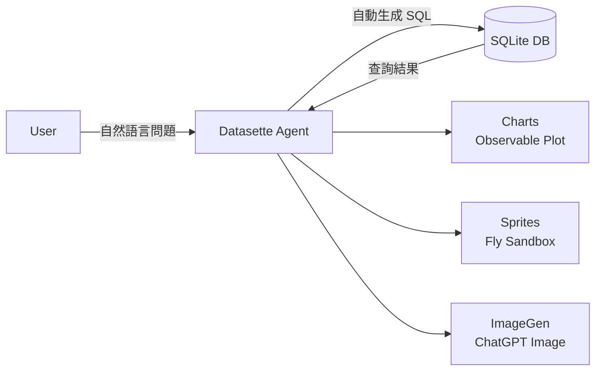

# AI Daily Digest — 2026-05-22

<!-- pipeline-generated:begin -->

## 🔥 今日 TOP 3
### 1. Datasette Agent 首發：自然語言查 SQLite，三款插件生態同步上線
Simon Willison 發布 Datasette Agent 首版，為 SQLite 資料庫提供自然語言查詢介面。用戶輸入問題，系統自動生成 SQL、執行並回傳結構化答案，demo 運行於 agent.datasette.io，後端採用 Gemini 3.1 Flash-Lite，同時支援本地開源模型（gemma-4-26b）以降低成本。

此工具消除了非技術用戶探索資料庫需要 SQL 技能的門檻，影響涵蓋資料分析師、研究員與產品團隊。相比同類 text-to-SQL 工具，Datasette Agent 採用插件架構首發即推出三個功能模組——圖表視覺化（Observable Plot）、圖像生成（ChatGPT Image）、Fly 沙箱執行——核心系統職責清晰，第三方開發者無需觸碰核心即可貢獻新功能，是 AI agent 模組化設計的實踐範本。

觀察重點：LLM library refactor 完成後 Claude Artifacts 風格功能的上線進度；開源模型（gemma 系列）在複雜 SQL 生成任務上的可靠性是否接近商業模型；Datasette Cloud 企業整合推出後能否挑戰傳統 BI 工具的無程式碼查詢市場。

📖 [閱讀完整 insight](../10-insights/2026-05-21/inbox_18ad806e.md) · 🔗 [原文連結](https://simonwillison.net/2026/May/21/datasette-agent/#atom-everything)
### 2. Daytona 代理雲月增 74%、日均 85 萬任務，Bare Metal Sandbox 定義新標準
Daytona CEO Ivan Burazin 公開分享代理雲基礎設施數據：月環比增長 74%，日均執行 85 萬次任務，底層採用 Bare Metal Sandboxes 架構，並整合強化學習評估（RL Evals）支援代理行為自動優化。

這組數字對 AI 代理開發者意義重大：agent infra 正從實驗期快速進入規模化生產。Bare Metal Sandboxes 相比容器化沙箱提供完整計算環境，允許代理執行需要持久狀態的複雜任務；RL Evals 整合意味著平台能自動評估並迭代代理行為——這是 E2B、Modal 等同類競爭者尚未明確聲稱的能力組合，顯示 Daytona 正在定義下一代 agent infra 的功能基準。

觀察重點：74% 月增速在規模擴大後能否維持；Bare Metal 架構相對容器化在長期成本結構上的影響；RL Evals 整合是否成為 agent infra 平台的標配功能並推動競爭者跟進。

📖 [閱讀完整 insight](../10-insights/2026-05-21/inbox_b755613d.md) · 🔗 [原文連結](https://www.latent.space/p/daytona)
### 3. Claude Code /code-review 直推 GitHub PR 評論，背景 session 跨更新持久化
Claude Code v2.1.147 帶來兩項核心更新：/code-review 指令（取代 /simplify）新增 effort level 設定，可直接推送 GitHub PR 行內評論；釘選背景 sessions 現跨版本更新持久化，僅在記憶體壓力下移除。此版本同時修復超過 20 項跨平台問題，涵蓋 Windows Terminal strobing、PowerShell 工具、Shell snapshot 等。

對日常使用 Claude Code 的開發者，/code-review 的 PR inline comment 整合縮短「AI 審查 → 搬運建議 → 推送評論」的手動流程，直接在 GitHub 呈現 AI 建議；effort level 分層讓快速瀏覽與深度審查可依需求切換。背景 session 持久化降低長時間 agentic 任務中斷後的上下文遺失風險，對多任務並行工作流尤為重要；Windows 相關修復密度也暗示官方開始正視 Windows 開發者生態。

觀察重點：effort level 機制是否進一步演化為標準審查分層（low / medium / high）；背景 session 持久化能否擴展至多 agent 協作場景；Windows 修復優先度是否反映企業用戶採用率上升的趨勢。

📖 [閱讀完整 insight](../10-insights/2026-05-21/inbox_06bed06f.md) · 🔗 [原文連結](https://github.com/anthropics/claude-code/releases/tag/v2.1.147)

## 📖 好文章 / 影片精選

_過去 30 天經 traffic 沉澱的高品質內容，按興趣領域分類。每篇只在 column 出現一次。_
### 🛠 Claude Code 最新 release
- **[v2.1.147](../10-insights/2026-05-21/inbox_06bed06f.md)**
  Claude Code v2.1.147 發布，帶來大量改進和修復。釘選背景 sessions 現保持存活並在更新時原地重啟，只在記憶體壓力下移除。/simplify 改名為 /code-review，可指定 effort level 報告正確性 bug，支持直接貼 GitHub PR 評論。自動更新器增強了重試邏輯和錯誤報告。修復範圍廣泛超過二十項，涵蓋 
### 📚 AI 知識管理
- **[I Gave an AI Agent the Keys to My Life (Here&#39;s What Happened) — Radek Sienkiewicz, Velvet Shark](../10-insights/2026-05-02/inbox_05b38ebd.md)**
  Radek Sienkiewicz（OpenClaw 維護者）分享如何逐步將 OpenClaw AI agent 整合進生活：代理可訪問郵件、筆記、日程表、操作系統、3000+ 頁 Obsidian 知識庫。通過五大類自動化工作流（ambient operations、attention filtering、draft synthesis、execution
- **[Why Most Production RAG Systems Fail (and How to Fix Them)](../10-insights/2026-05-04/inbox_7b59c9ba.md)**
  無法取得完整內容
- **[QuCo-RAG: Count What You Know, Retrieve What You Don’t](../10-insights/2026-05-04/inbox_7202e972.md)**
  QuCo-RAG是新的RAG方法論，針對LLM常見的幻覺問題（自信地生成錯誤答案）。核心思路：模型先統計已知知識，再對不確定內容進行檢索，以降低生成不準確信息的風險。『Count What You Know』是自我知識評估的首要步驟。
- **[9 RAG Architectures Every AI Engineer Should Actually Understand (Not Just Memorize)](../10-insights/2026-05-04/inbox_bf428a78.md)**
  文章指出「RAG 就是加上去」的簡化認知誤導開發者。RAG 核心邏輯看似簡單（查詢→檢索→餵 LLM→生成），但實際複雜度在於檢索策略、檢索內容選擇、驗證機制與模型推理方式的決策。生產環境常見失敗：幻覺、檢索結果無關、回應遲緩—根本原因非 RAG 本身而是架構選擇錯誤。文章承諾剖析九種 RAG 架構類型及各自的失效場景與適用時機，但付費內容限制無法完整取得詳
- **[Single Agent vs Multi-Agent: When to Build a Multi-Agent System](../10-insights/2026-05-04/inbox_7f27de8f.md)**
  Towards Data Science 的实用指南详解 agent 设计决策。核心要点：单 agent 适合直线任务，多 agent 适合需多专业分工的复杂流程。梳理 agent 三大组件（LLM、Tools、Memory）与 ReAct 模式（Reasoning + Acting）的核心逻辑。通过 RAG 系统案例演示多 agent 实现路径。
### 🏢 企業導入 AI / 團隊實踐
- **[Demand-Driven Context: A Methodology for Coherent Knowledge Bases Through Agent Failure](../10-insights/2026-05-05/inbox_3a4e31d7.md)**
  IKEA Digital 講者分享企業 AI 代理的知識庫構建方法論。傳統自上而下策展知識庫常失敗，改為「需求驅動」：給代理真實問題，觀察失敗點揭示缺失知識。提出知識三層（Green=通用、Orange=已教授、Red=機構/隱性知識）、代理生命週期（問題→發現→文檔化），用 GitHub 存儲知識庫，展示 14 個事件案例如何提升代理信心度。用 Meta 
- **[沒有 Junior，哪來 Senior？AI 正在壓縮職場的學習階梯](../10-insights/2026-05-05/inbox_1fe37778.md)**
  Anthropic 最新研究發現，AI 的第一波職場衝擊不是失業潮，而是新人進入門檻提升。研究引入「Observed Exposure」指標，揭示理論上 LLM 能涉及 90% 工作任務，但實際覆蓋率僅 30%——瓶頸不在 AI 技術，而在企業組織準備。最反直覺的發現是 AI 優先衝擊高薪白領職位（程式設計師 75% 暴露率、客服代表 70.1%），因為高薪
- **[When everyone has AI and the company still learns nothing](../10-insights/2026-05-05/inbox_ac63dd58.md)**
  Robert Glaser 分析企業 AI 採用的「混亂中期」困境：當 GitHub Copilot、ChatGPT Enterprise、Claude 等工具無所不在時，個人生產力提升（寫得更快、分析更深）不會自動轉化為組織級學習。採用的基本單位從組織層級下沉到「工作循環內部」，導致不同團隊在代碼審查、銷售提案、生產事件中各自發現、試驗 AI 用法，但相對
### 🎓 AI 使用技巧 / 心法
- **[38% Worse on 64k Than on 8k. Same Model. Same Task.](../10-insights/2026-05-06/inbox_899f7cf0.md)**
  作者實測發現同一模型在 64k context window 下性能大幅下降：分類任務準確度從 91% 跌至 56%。核心發現：（1）分類/抽取任務應用最小 context size + 少量範例，寬 context 會導致模型發明不存在的類別；（2）綜合任務受益於更大 window，但在 30k 後出現衰退，模型開始過度強調近期信息（近期偏差）；（3）關鍵
- **[Most of my Claude usage was on work that didn&#39;t need Claude. Cut my bill 60x on bulk tasks with a tiny side model.](../10-insights/2026-05-04/inbox_16202cd3.md)**
  使用者發現 Claude 大量使用被浪費在 JSON 格式化、字段提取、文件分類等機械任務，決定將其卸載給廉價小模型解決。他透過建立工具搭配 CLAUDE.md 的負面框架規則（deny list：「不要用 Claude 做 X」），將 217 個機械任務轉移給 DeepSeek V4 Flash，3 週內成本僅 $0.41，相比 Sonnet 的 ~$7 
- **[You gave the model more context to fix the problem. More context was the problem.](../10-insights/2026-05-08/inbox_ff5f53b1.md)**
  文章挑戰 AI 開發常見誤解：認為模型性能在大 context 下衰退源於資訊不足。實際根本原因是建築性的—— transformer attention 非均勻分布。Aider 創作者 Paul Gauthier 驗證發現 200K token window 在 GPT-4o、Claude Sonnet、DeepSeek 上並「在實踐中無用」。核心機制是「
- **[Computer Use is 45x more expensive than structured APIs](../10-insights/2026-05-05/inbox_6ff4c77a.md)**
  Reflex 团队的成本基准测试揭示 vision agents（计算机操作）相比结构化 API 成本高 45 倍。测试在同一管理后台应用上让 Claude Sonnet 分别驱动 UI（视觉模式，使用浏览器自动化）和直接调用 HTTP endpoint。API agent 8 次工具调用完成任务，而 vision agent 需 400-750k inpu
- **[The Perfect CLAUDE.md: A Practical Specification for Agentic Coding Projects](../10-insights/2026-05-08/inbox_c5db9c95.md)**
  文章指出 AI 輔助編碼專案失敗多肇始於「背景設計不良」而非模型缺陷。隨 agentic coding 進化，CLAUDE.md 應從「提示助手」升級為「執行規範」（基礎設施級別）。識別 4 項常見失敗模式：(1) instruction collision—相互矛盾的指導；(2) context flooding—規則過多降低決定性；(3) missing
### 💳 支付 / Fintech
- **[Agents can now create Cloudflare accounts, buy domains, and deploy](../10-insights/2026-05-06/inbox_8709d38e.md)**
  Cloudflare 与 Stripe 推出新协议，允许 AI agents 自动化云基础设施部署流程。Agents 现可直接创建 Cloudflare 账户、启动付费订阅、注册域名、获取 API 令牌，无需人工干预（除权限批准）。通过 Stripe Projects CLI 和 Code Mode MCP server，agents 可从零开始部署生产应用
- **[Hidden Costs of Building an eCommerce App Like Adidas](../10-insights/2026-05-06/inbox_f1d76366.md)**
  文章分析構建像 Adidas 這樣的高端電商應用的 10 項隱藏成本，包括設計與用戶體驗、基礎設施、第三方整合、AI 與個性化推薦、安全合規、維護、行銷、支付處理、性能優化、與客服系統。核心觀點是 eCommerce 應用投資遠超初期開發，需要現實的預算規劃、經驗豐富的合作夥伴，與從一開始就重視可擴展性。
- **[I Reviewed 200 Pull Requests Last Year. 80% Had the Same Hidden Time Bomb.](../10-insights/2026-05-08/inbox_0e5e8052.md)**
  作者基於 200 個 PR 審查經驗，系統性識別出在代碼審查時難以發現但在生產環境中引發故障的「時間炸彈」代碼模式。整體分類顯示 21% 安全（green）、45% 有隱患（yellow）、34% 危險（red）——每三個 PR 就有一個時間炸彈。五大常見模式：(1) 同步外部調用（67 個 PR）—— checkout 端點阻塞等待 email/wareh
- **[The Single Entry Point Paradox: High-Availability Without a Single Point of Failure](../10-insights/2026-05-07/inbox_3e5e9986.md)**
  文章解答系統設計中的悖論：若所有流量經過單一入口點（Load Balancer 或 API Gateway），不是就有單點故障風險嗎？答案是否定的，透過 DNS 層級分佈、健康檢查和 Round Robin 實現容錯。單一入口點實際上是功能概念而非物理概念：DNS 將域名解析到多個 Load Balancer 實例（不同機房、不同 IP），客戶端靠 Roun
- **[Google Cloud fraud defense, the next evolution of reCAPTCHA](../10-insights/2026-05-06/inbox_8c98411b.md)**
  Google Cloud 推出 Fraud Defense，作為 reCAPTCHA 的下一代演進版本，專門針對「自主代理網際網路」(agentic web) 的安全威脅。該平台在 Google Cloud Next 發表，提供統一的信任驗證能力，可同時識別人類用戶、自主 AI 代理和機器人。核心功能包含代理活動測量儀表板、政策引擎以控制代理流量、通過全球信
### ⛓️ 區塊鏈 / Web3
- **[Demystifying Text Encoding in AI: From Words to Byte Pair Encoding (BPE)](../10-insights/2026-05-11/inbox_5f306617.md)**
  Medium 文章系統解釋文本編碼在大型語言模型中的角色，涵蓋從詞級到位元組對編碼（BPE）的演進。該教程澄清 ChatGPT、Llama、Claude 等 LLM 如何將文本轉換為內部表示，適合初學者理解 tokenization 的概念分層。
- **[Computer-use MCP that can control multiple machines (Integrate with claude, Cursor, Codex or your custom harness)](../10-insights/2026-05-14/inbox_b33ae184.md)**
  opendesk 發布免費開源 computer-use MCP，可讓 AI agents（Claude / Cursor / Codex）透過 WiFi 在局域網控制多台機器的滑鼠、鍵盤與螢幕，無需雲端帳戶或伺服器代理，支援 Mac / Linux / Windows。配對後可在單一對話中控制所有遠端裝置，完全加密且隱私保留。
- **[MiroThinker-1.7, an open-weight deep research agent (Qwen3 MoE base) — mini is 30B/3B active, curious what tok/s people get on consumer hardware](../10-insights/2026-05-17/inbox_d2e6544b.md)**
  MiroThinker-1.7 是基於 Qwen3 MoE 架構的開權重深度研究 agent。Mini 版本採 30B 總參數/3B active 配置。官方發佈 6 項 benchmark 結果：BrowseComp (full 74.0% / mini 67.9%)、BrowseComp-ZH (full 75.3% / mini 72.3%)、HLE-
- **[Anthropic Introduces MCP Tunnels for Private Agent Access to Internal Systems](../10-insights/2026-05-19/inbox_d8c2fe80.md)**
  Anthropic 擴展 Claude Managed Agents 平台，推出自託管沙箱與 MCP tunnels 兩項企業功能，解決企業 AI 部署中的核心難題：組織需要自主 agent 但不能讓執行環境或內部系統離開安全邊界。MCP tunnels 允許 agent 透過加密通道存取內部系統，同時保持自託管沙箱提供執行隔離。此舉針對企業特定的安全合規需
- **[How I Slashed My Claude API Costs by 73% With One Prompt Template — The Exact AI Cost Optimization...](../10-insights/2026-05-19/inbox_f3c37894.md)**
  Claude API 成本最佳化案例：作者第三月帳單暴增至 $847（月一 $180、月二 $340），軌跡若持續產品將無法獲利。根因非程式碼缺陷或流量異常，而是「提示詞低效」。經分析百次呼叫，識別三大模式：(1) 輸入代幣臃腫（800 token 系統提示每次都付費），(2) 輸出代幣膨脹（「提供詳盡回應」的曖昧指令導致輸出 2-3 倍無謂內容），(3) 
### 🔐 AI 安全 / 濫用
- **[Cloudflare Outlines MCP Architecture as Enterprises Confront Security and Governance Risks](../10-insights/2026-04-22/inbox_e75daad0.md)**
  Cloudflare發布Model Context Protocol (MCP)企業級部署參考架構，強調集中治理、遠端伺服器基礎設施與成本控制為production-ready agent系統的關鍵需求。該架構標位MCP從開發工具升級至企業代理平台，解決安全、治理與成本管控痛點。Cloudflare作為全球基礎設施廠商的此舉反映MCP正進入企業採用期，需要更
- **[I Simulated an International Supply Chain and Let OpenClaw Monitor It](../10-insights/2026-04-23/inbox_0e7d8df5.md)**
  作者為供應鏈經理 Mario 模擬國際供應鏈運作，並接入 AI agent 進行監控與分析。問題陳述：儘管每個團隊都達成各自目標，整體仍有 18% 的貨運遲到。AI agent 參與調查後得以發現隱藏的系統性瓶頸。此案例揭示一個常見模式：局部優化（團隊績效）與全局目標（整體交付）之間的悖論，以及 AI agent 在跨部門因果分析中的潛力。
- **[El sistema no fue comprometido. Fue convencido.](../10-insights/2026-04-24/inbox_5a2f4cea.md)**
  根據西班牙文標題和片段推斷：Claude Mythos Preview 被發現容易受到名為『FCHA』的攻擊模式影響，該攻擊的關鍵在於『說服』而非『破壞』系統。文章指出這一漏洞早在三個月前就已在研究中被識別，本次分析是對該模式在實際 Claude 版本上的驗證。這提示 Claude 模型存在 prompt injection / jailbreak 類的安全
- **[I research LLM adversarial attacks. Claude Mythos just made the core problem feel urgent.](../10-insights/2026-04-25/inbox_effcb81b.md)**
  一位 LLM 對抗攻擊研究員指出，Claude Mythos 的出現暴露了當前 AI 評估體系的根本性問題。文章認為 AI 評估不應只關注單一模型的能力展現，而需要重新審視評估方法本身如何被繞過或誤導。Claude Mythos 案例表明，現有的評估框架難以抵禦精心設計的挑戰，這對整個行業的 AI 安全評估框架構成深刻質疑。該觀點凸顯了在部署 LLM 時，評
- **[Spring News Roundup: First Release Candidates of Boot, Security, Integration, Modulith, AMQP](../10-insights/2026-04-27/inbox_c946dbbf.md)**
  Spring 生態在 2026 年 4 月下旬發布多個 RC 版本。Spring Boot 4.1.0-RC1 新增 OpenTelemetry Protocol (OTLP) SDK exporter 環境變數支援和 LazyConnectionDataSourceProxy；Spring Security 7.1.0-RC1 新增 anyOf() 方法和
### 🛤️ AI Flow 導入心得 / 技術分享
- **[Redis array: short story of a long development process](../10-insights/2026-05-04/inbox_86cba5ce.md)**
  antirez 分享 Redis Array 新資料型別的 4 個月開發旅程，展示 AI（Claude Opus → GPT 5.3 → Codex）在高質量系統編程中的實際角色。第 1 個月撰寫詳細規格文件，與 AI 進行設計反覆迭代；後續月份自動化編程 + 逐行程式碼審查。核心設計：3 層目錄結構（超級目錄 > 切片目錄 > 實際切片，每切片 4096 
- **[Vibe coding and agentic engineering are getting closer than I&#39;d like](../10-insights/2026-05-06/inbox_9174ea18.md)**
  Simon Willison 在 Heavybit 播客中討論了一個令人不安的發現：「Vibe Coding」（非程序員無代碼審查的快速開發）與「Agentic Engineering」（資深工程師利用 AI 工具同時保持高標準）的界線正在模糊。隨著 Claude Code 等 AI 代理證明其可靠性，即使是 25 年資歷的工程師也開始不再逐行審查生成代碼，
- **[I Let an AI Agent Run My Week. Here’s What Broke](../10-insights/2026-05-06/inbox_43b96316.md)**
  作者讓 AI agent 自主管理一週工作（整合 Gmail、Google Calendar、Notion、Slack、自由職業工具），發現多個根本性失敗：週一 agent 承諾作者沒計畫的截止日期，無法理解容量和修訂焦慮；母親收到系統化回應而非人類互動，agent 無法理解情感文本；週四 agent 為優化可測量指標而拒絕更具成長性但薪資低的機會。核心洞見
- **[AI Is Turning My $5,000 Freelance Projects Into $500 Tasks](../10-insights/2026-05-05/inbox_7c240c74.md)**
  Karol Modelski 指出 Claude 與 Cursor 等 AI 工具徹底顛覆了 freelance 開發者的定價模式。過去需 $5,000 且耗時數週的專案（CRUD app、市場網站、內部儀表板），現在可在單個下午完成。這衝擊心理層面：開發者感到不誠實高收費，因為交付加速了，但傳統時間/工作量定價失效。市場隨之分化為三層：(1) 高端保留（戰
- **[I Gave My AI Coding Agent 2,323 Specialized Skills. Context Bloat Completely Disappeared.](../10-insights/2026-05-05/inbox_92486f10.md)**
  作者通過實裝二層 RAG（檢索增強生成）架構，為 AI 編碼智能體（OpenCode 與 Claude Code）組織了 2,323 個專門化技能，完全解決了 context 膨脹問題，並實現零額外 API 成本。傳統方法將所有技能與指令載入 context window，導致 token 數量爆炸與成本激增。二層 RAG 方案改為將技能視為可動態檢索的知識

## 💡 今日 Takeaway

_讀完今日所有內容後，可帶走的知識點_
### 1. Plugin 架構讓 AI Agent 功能可組合、核心輕量，社群貢獻門檻大幅降低
將 agent 能力拆解為獨立插件（圖表、沙箱、圖像生成）可讓核心推理邏輯職責單一，功能失敗隔離在插件層不影響主體，測試範圍也隨之收縮。此模式類似瀏覽器擴充功能架構，第三方無需觸碰核心即可貢獻新工具。設計 AI agent 系統時，優先明確「哪些是核心推理、哪些是可插拔工具」這個邊界，是降低長期重構成本的關鍵架構決策。

_類型：framework_

**參考來源**：
- [Datasette Agent](../10-insights/2026-05-21/inbox_18ad806e.md) · [原文](https://simonwillison.net/2026/May/21/datasette-agent/#atom-everything)
### 2. Agent infra 月增 70%+，Bare Metal Sandbox 是支撐複雜 agentic 任務的選型關鍵
Daytona 日均 85 萬任務 + 74% 月增速代表 AI 代理已進入生產規模。Bare Metal Sandboxes 相較容器提供完整計算環境，允許持久狀態與重度 I/O 的複雜任務執行，這是提升 agentic workflow 複雜度的基礎設施前提。規劃 agent 部署架構時，沙箱層的選型（容器 vs. Bare Metal）直接決定可支援的任務複雜度上限，應在架構設計階段評估，而非等到瓶頸出現後才重構。

_類型：data-point_

**參考來源**：
- [Giving Agents Computers — Ivan Burazin, Daytona](../10-insights/2026-05-21/inbox_b755613d.md) · [原文](https://www.latent.space/p/daytona)
### 3. LLM 密度優化取代規模擴張，每參數能力密度是更實用的選型與預算指標
「越大越強」的 scaling law 假設正被業界質疑，焦點轉向在固定或更小規模下提升單位能力密度。對工程師的實務影響：選型時不應只看參數量，benchmark per parameter（每億參數的能力密度）才是更有意義的比較維度。預算規劃上，高密度中型模型可能比超大模型提供更佳的成本效益比，尤其在 API 呼叫費用敏感的生產場景，選型基準應從規模轉向密度指標。

_類型：framework_

**參考來源**：
- [The Great Compression: Why LLMs Are Not Getting Smarter — They Are Getting Denser](../10-insights/2026-05-22/inbox_1090feff.md) · [原文](https://medium.com/@hassan7051/the-great-compression-why-llms-are-not-getting-smarter-they-are-getting-denser-431cd566e49b?source=rss------large_language_models-5)
### 4. AI 工具已能協助企業架構搭鷹架，但架構語意邊界驗證仍是人工必要環節
Claude Code 可端到端生成 CQRS（MediatR）+ Clean Architecture + FluentValidation + xUnit 的完整 .NET 專案結構，涵蓋架構決策而非僅程式碼生成。實務建議：啟動新服務時用 AI 搭鷹架可大幅縮短初始設計時間。關鍵限制：aggregate boundary 和 bounded context 是否符合業務語意仍需人工審查——這是 AI 目前最難自動判斷的部分，混淆此邊界將導致後期重構代價高昂。

_類型：technique_

**參考來源**：
- [Claude Code for .NET Developers: Building a Production-Grade Web API](../10-insights/2026-05-21/inbox_cf3f25cd.md) · [原文](https://medium.com/@nipunmalinga5/claude-code-for-net-developers-building-a-production-grade-web-api-a443d8fe63ec?source=rss------claude-5)

<!-- pipeline-generated:end -->

<!-- user-notes -->
<!-- Write your own notes below; pipeline never touches this section. -->