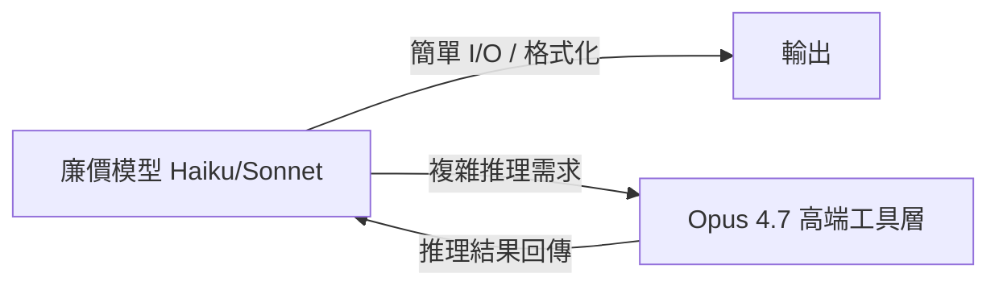
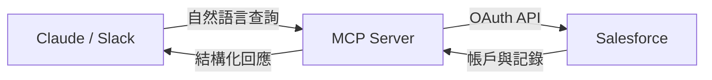

# AI Daily Digest — 2026-05-23

<!-- pipeline-generated:begin -->

## 🔥 今日 TOP 3
### 1. Claude Opus 4.7 架構反轉：廉價模型路由 Opus，帳單省 38%
Anthropic 於 2026 年 4 月 9 日推出 Claude Opus 4.7 架構反轉機制，Haiku、Sonnet 等低成本模型可透過單個 beta header 調用 Opus 4.7 作為推理工具，無需架構重構。觸發成本極低，僅修改一個 API header 參數即可啟用。

這打破「旗艦模型必須作主要調用層」的傳統假設。實測生產遷移後月帳單從 $4,248 降至 $2,652，降幅 38%，且不犧牲複雜任務（編碼 agent、文件分析）的能力上限。相較蒸餾或微調方案，此方式保留 Opus 原生能力、只改調用層次，對已上線服務風險最低。

下一步應審視現有 agent 中哪些 token 真正需要 Opus 推理，哪些可路由至輕量模型。建議以 task complexity distribution 重新規劃 API 預算，將 Opus 4.7 保留給高複雜度節點，日常 I/O 降至 Haiku 層，持續壓縮成本而不改動能力邊界。

📖 [閱讀完整 insight](../10-insights/2026-05-22/inbox_98c5a1b0.md) · 🔗 [原文連結](https://medium.com/@anup.karanjkar08/claude-opus-4-7-f2d7c5ee3f6a?source=rss------claude-5)
### 2. Arize + Claude Code 三步建立 LLM Eval，週級工時壓至分鐘
Arize CPO Aparna Dhinakaran 展示在 Claude Code 中透過 npx skills add Arize-ai/arize-skills 建立 LLM agent 評估的三步流程：安裝 Arize Skills、用自然語言請求 eval 建議、細化問題讓 Claude 識別失敗類型。Claude 自動分析 traces 並提議評估指標，如 groundedness（源數據驗證）、priority alignment（排序準確性）、actionability（同日可用性）。

傳統 LLM eval 設置需週級工時，門檻高導致評估常被跳過或推遲到上線後才做。此流程將 v0 eval 建立壓縮至分鐘級，且可在開發循環內完成。對 AI 產品 PM，工作模式轉為夜間 Agent 自動生成失敗報告、每日 5 分鐘審查，而非人工翻查 traces。

建議先對現有 agent 試跑一輪 Arize skill，觀察 Claude 提議哪些評估類型是否切中實際失敗點。關鍵：保留人類審批權——AI 生成優先級報告，人類確認指標是否反映業務語境，避免評估偏離實際目標。

📖 [閱讀完整 insight](../10-insights/2026-05-22/inbox_c63c8481.md) · 🔗 [原文連結](https://www.news.aakashg.com/p/aparna-dhinakaran-podcast)
### 3. Salesforce Headless 360：MCP + OAuth 讓 Claude 直接對話查 CRM
Salesforce Headless 360 是將 Salesforce 後端與 UI 解耦的架構模式，透過 External Client App + OAuth + MCP server 三層配置，允許 Claude、Slack 等外部工具直接存取 Salesforce 數據。配置完成後，用戶可透過 Claude 對話查詢帳戶記錄，無需登入傳統界面。

對企業 IT 和業務人員，這消除了每次查詢 Salesforce 都需登入、導航多層選單的操作摩擦。相較傳統 REST API 整合，MCP 協議讓 Claude 可直接理解數據語義並回應自然語言問題，大幅降低 CRM 日常使用門檻，適合非技術用戶直接操作。

若組織使用 Salesforce，可評估建立 External Client App + MCP 連接器的試驗環境。此架構同樣適用於其他有 REST API 的企業系統（HubSpot、ServiceNow），MCP 作為通用企業數據橋接層的潛力值得持續追蹤。

📖 [閱讀完整 insight](../10-insights/2026-05-22/inbox_7fc1ad55.md) · 🔗 [原文連結](https://medium.com/@pankajdave80/salesforce-headless-360-connecting-claude-with-salesforce-9223ded02079?source=rss------claude-5)

## 📖 好文章 / 影片精選

_過去 30 天經 traffic 沉澱的高品質內容，按興趣領域分類。每篇只在 column 出現一次。_
### 🛠 工具版本追蹤 / Release
- **claude-code** · **[v2.1.149](../10-insights/2026-05-22/inbox_7f79b5f3.md)**
  Claude Code v2.1.149 發布，新增 `/usage` 命令按類別分解限制用量（skills、subagents、plugins、per-MCP server），`/diff` 支援鍵盤導航（上下箭頭、j/k、PgUp/PgDn）。修復多項安全和功能缺陷：PowerShell 內建 cd 函數繞過權限檢查、git worktree 沙箱誤允許
- **gitnexus** · **[Release Candidate v1.6.6-rc.41](../10-insights/2026-05-22/inbox_f0cde54b.md)**
  GitNexus v1.6.6-rc.41 發布。此 rc 版本與 rc.42 功能基本相同，為快速迭代序列的一環。包含 Kotlin scope resolver、JavaScript scope-based resolution 遷移、C++ 功能擴展、16GB 記憶體上限、WAL 檢測和恢復、Windows 相容性修復等。此為預發佈版本，用於早期測試反
- **gitnexus** · **[Release Candidate v1.6.6-rc.40](../10-insights/2026-05-22/inbox_951da617.md)**
  GitNexus v1.6.6-rc.40 發布，為 rc 快速迭代序列的早期版本。包含 Kotlin scope resolver、JavaScript scope-based resolution、C++ 功能擴展（SFINAE、type_traits 約束）、16GB 記憶體自動堆積、WAL 損毀檢測、Git worktrees 和 GitLab 倉庫
- **gitnexus** · **[Release Candidate v1.6.6-rc.39](../10-insights/2026-05-22/inbox_6b2b9adc.md)**
  GitNexus v1.6.6-rc.39 發布，自動化預發行版本，npm install gitnexus@rc。本版本融合多語言分析改進：JavaScript 完成 scope-based resolution 遷移（RFC #909 Ring 3），Kotlin 新增 scope resolver 並強化 smart-cast 型別精化、overloa
- **gitnexus** · **[Release Candidate v1.6.6-rc.38](../10-insights/2026-05-22/inbox_121ad333.md)**
  GitNexus v1.6.6-rc.38 發布，預發行版本（main 分支 954b184），npm install gitnexus@rc。包含核心功能：JavaScript scope-based resolution 遷移、C++ SFINAE 和 type_traits 強化、Java 同模組 FQN 優先解析、Kotlin scope resol
- **gitnexus** · **[Release Candidate v1.6.6-rc.37](../10-insights/2026-05-22/inbox_54bdf029.md)**
  GitNexus v1.6.6-rc.37 預發行版本（main 分支 be3833d），npm install gitnexus@rc。包含 JavaScript scope-based resolution 遷移（RFC #909）、C++ SFINAE 過濾和 type_traits 擴展、Java 同模組 FQN 優先解析、Kotlin scope 
- **gitnexus** · **[Release Candidate v1.6.6-rc.36](../10-insights/2026-05-22/inbox_935e9d6c.md)**
  GitNexus v1.6.6-rc.36 預發行版本（main 分支 dc96bb0），自動化構建。包含 JavaScript scope-based resolution 遷移、C++ SFINAE 過濾和 type_traits constraint 擴展、Kotlin scope resolver、Java 同模組 FQN 優先解析。功能面支持 Gi
- **gitnexus** · **[Release Candidate v1.6.6-rc.35](../10-insights/2026-05-22/inbox_5a4fc8b6.md)**
  GitNexus v1.6.6-rc.35 預發行版本（main 分支 8c1983a），自動化構建，npm install gitnexus@rc。包含 JavaScript scope-based resolution 遷移、Kotlin scope resolver、C++ SFINAE 和 type_traits 強化、Java 同模組 FQN 優先
- **ruflo** · **[v3.7.0-alpha.76 — ADR-127 + ADR-128 (.github stack + init bundle reduce) + 5 fixes](../10-insights/2026-05-21/inbox_57fab72e.md)**
  Ruflo v3.7.0-alpha.76（alpha.72→alpha.76，May 20-21）完成 ADR-127/128 執行，重點瘦身和安全強化。ADR-128 init bundle reduce：agents 98→17（domain-specific 需明確 --all-agents）、commands 176→16（9 orphan 刪除、
- **ruflo** · **[v3.7.0-alpha.71 — ADR-125 Memory Consolidation (full delivery)](../10-insights/2026-05-19/inbox_ff00cc14.md)**
  Ruflo v3.7.0-alpha.71（ADR-125 完整交付，May 19）@claude-flow/memory 3.0.0-alpha.18 重寫 memory subsystem。核心成就：①單一入點 MemoryService（HnswLite/RvfBackend 移出公開 surface）②真實 hybrid 預設（sql.js + Ag
- **ruflo** · **[v3.7.0-alpha.70 — Security hardening + Browser substrate + Graph Intelligence](../10-insights/2026-05-19/inbox_cfa85c58.md)**
  RuFlo v3.7.0-alpha.70 於 2026-05-19 發布，統整重大安全與功能更新。Plugin registry Ed25519 簽名驗證修正為真實實現（CWE-347 #1922）：原先只檢查 registryPublicKey 開頭是否為「ed25519」的 stub，現改為 pin DEFAULT_PLUGIN_STORE_CONFI
- **ruflo** · **[v3.7.0-alpha.44 — neural unblocked + standalone recipes shipped + npm download badges](../10-insights/2026-05-16/inbox_4fddba30.md)**
  RuFlo v3.7.0-alpha.44 修復 @claude-flow/neural 導入崩潰與發布管理問題。@ruvector/sona@0.1.6 為空發布（僅含 README + package.json，缺 index.js 與 native bindings），導致 @claude-flow/neural@3.0.0-alpha.8 impor
### 📚 AI 知識管理
- **[RAG 101: Stop Guessing, Start Knowing](../10-insights/2026-05-05/inbox_373e0708.md)**
  RAG（Retrieval-Augmented Generation）結合兩步驟：檢索相關資料 → 基於資料生成答案。解決 LLM 三大缺陷：無法訪問私有組織資料、知識過時、幻覺傾向。實現分三層：Naive RAG（簡單檢索，速快但不精）→ Advanced RAG（改進分塊與排名）→ Agentic RAG（AI 自主決定搜索內容與時機，複雜度最高）。適用
- **[How to Build a Multimodal RAG System (With Python Code Examples)](../10-insights/2026-05-05/inbox_88ad9afb.md)**
  教程文章介紹如何構建多模態 RAG 系統，支持文本、圖像、音頻和文檔等多種輸入類型。文章包含 Python 代碼示例，幫助開發者實現檢索增強生成（RAG）系統，能處理複雜的多模態查詢。
- **[LLMSearchIndex- an Open Source Local Web Search Library with over 200 million indexed Web Pages for RAG applications](../10-insights/2026-05-04/inbox_fe4c20ed.md)**
  開發者 zakerytclarke 發布 LLMSearchIndex，一個用於本地 LLM/RAG 系統的開源 Python 庫，完全避免依賴 Brave API 或 SearXNG 元搜尋。該索引包含 200M+ 網頁內容（源自 FineWeb 與 Wikipedia），卻僅需 2GB 存儲空間，在大多數硬件上實現快速檢索。使用者透過簡單 Python 
- **[RAG Hallucinates — I Built a Self-Healing Layer That Fixes It in Real Time](../10-insights/2026-05-05/inbox_909a07ac.md)**
  作者開發了一個輕量級自修復層（self-healing layer），針對 RAG 系統的核心問題——不是檢索失敗而是推理失敗——能在實時中檢測並糾正 hallucinations。該方案在使用者看到錯誤回應前攔截並修復，適用於生產級 RAG 應用。關鍵貢獻是將 hallucination 修復從後期品質檢查前置到推理過程中。
- **[Stop losing your best AI conversations: archive to Obsidian with a skill](../10-insights/2026-05-06/inbox_5ab4cdca.md)**
  文章介紹 obsidian-archive MCP skill，可將 Claude 對話自動存檔到 Obsidian 筆記庫，提供重複利用的知識語料庫。該 skill 運作分兩階段：初期手動透過 Obsidian MCP server 要求 Claude 按指定格式（摘要、關鍵決策、有效代碼等）存檔；穩定後升級為可重用 Skill，使用者只需說「存檔此對話」
### 🏢 企業導入 AI / 團隊實踐
- **[Presentation: Leadership in AI-Assisted Engineering](../10-insights/2026-05-08/inbox_a54aaf91.md)**
  Justin Reock的演講以硬數據揭示GenAI採用現狀：95%試驗失敗，突破「AI自動提速」的迷思。引入SPACE與Core 4兩大框架，結合DORA和DX研究數據，幫助領導者建立量測真實ROI的體系而非依賴案例軼聞。涵蓋在全SDLC應用代理解決方案、平衡速度與品質、降低開發者對AI工具恐懼的組織策略，強調從試驗計數轉向有效性量測的領導力轉變。
- **[Presentation: AI-First Software Delivery: Balancing Innovation with Proven Practices](../10-insights/2026-05-06/inbox_d38d9eec.md)**
  InfoQ 演講者 Wes Reisz 分享 AI-first 軟體交付的戰略框架。他強調 agentic workflows 非一刀切方案，提出「程式碼壽命 × 自動化驗證」二維決策模型來選擇監督型或非監督型 agent。並引入 RIPER-5 框架（Research → Innovate → Plan → Execute → Review）作為工程紀律的
### 🎓 AI 使用技巧 / 心法
- **[What Fiction Writers Know About Prompting That Engineers Don’t](../10-insights/2026-05-08/inbox_c89a8401.md)**
  小說家的 prompting 方法論與工程師思維分岔：前者視 prompting 為「舞台設置」和敘事結構，後者視為配置問題。核心區別在於具體範例優於抽象描述——模型從實例學習遠快於從形容詞學習。文章提出 11 個原則框架：（1）呈現而非陳述，用範例代替風格描述；（2）檢查槍支法則，每個細節都應發揮作用；（3）具體而非抽象，「120 字摘要供忙碌主管」優於「
- **[Claude Opus 4.7](../10-insights/2026-05-22/inbox_98c5a1b0.md)**
  Claude Opus 4.7 於 2026 年 4 月 9 日實現關鍵的架構反轉：從獨立模型轉變為可被成本更低的模型調用的工具。這一變更通過單個 beta header 實現，而非根本性重構。實際成本影響顯著——作者迁移一個工作負載後，4 月賬單從 $4,248 下降至 $2,652，約節省 38%。Opus 4.7 仍保持對複雜任務（編碼 agent、文
- **[Using Claude Code: The Unreasonable Effectiveness of HTML](../10-insights/2026-05-08/inbox_a8d604f4.md)**
  Anthropic Claude Code團隊成員Thariq Shihipar倡議改用HTML而非Markdown作為Claude輸出格式。在GPT-4時代因8K token限制，Markdown效率優勢曾主導選擇，但HTML能承載SVG圖表、互動部件、頁內導航等豐富表達形式，尤其適合PR審查（帶行內邊註與嚴重性色碼）和安全漏洞分析（互動式解析obfusc
- **[AI Scope Creep: Why Your Pull Requests Are Quietly Getting Bigger](../10-insights/2026-05-06/inbox_9a4f48f4.md)**
  文章指出 Claude 等 AI 助手缺乏自我限制機制，當要求修復 40 行 bug 時，會同時進行無關改進（重新命名函數、重整 import、加型別提示），導致 PR 膨脹至 400 行。問題不止於審查雜亂，更導致機構知識腐蝕——分散的無關變更使 git blame 失效，開發者 6 個月後無法追蹤代碼歷史。作者建議分層解決方案：prompt 明確約束、專
- **[Playground in Prod: Optimising Agents in Production Environments — Samuel Colvin, Pydantic](../10-insights/2026-05-07/inbox_645902a7.md)**
  Samuel Colvin (Pydantic 創始人) 演示如何在生產環境中優化 Agent。核心內容包括使用 Jeepper (遺傳演算法優化庫) 和 Logfire managed variables 進行 prompt 優化。在英國議員政治關係識別任務上，初始 prompt 准確度 87%，經專家 prompt 改進至 92%，經 Jeepper 自
### 💳 支付 / Fintech
- **[Running Codex safely at OpenAI](../10-insights/2026-05-08/inbox_f1e1332d.md)**
  OpenAI 發布關於 Codex 安全運作的最佳實踐，介紹採用的多層防護策略：沙箱隔離限制執行環境、審批流程控制權限、網路政策限制網路存取、agent 原生遙測監控行為。這些措施針對支持安全且合規的程式碼代理採用，適用於需要嚴格控制 LLM 代理風險的企業環境。
- **[How React Native Works with Microfrontend Architecture in Mobile Apps](../10-insights/2026-05-08/inbox_d4de2223.md)**
  本文詳述 React Native 在微前端架構中的應用模式，適用於多團隊開發大型移動應用的場景。微前端將單體應用按業務功能分割為獨立模組（登入、個資、結帳、通知等），各模組配備專屬團隊、獨立代碼庫與發布節奏，透過共享 app shell 統一管理導航、認証、設計規範與共享庫。React Native 的 JavaScript 邏輯層與原生 UI 分離特性允
- **[You can do CUDA inference on an Apple Silicon Mac with PCI Passthrough](../10-insights/2026-05-08/inbox_1c98efc1.md)**
  用户改编QEMU实现在Apple Silicon Mac上通过GPU PCI Passthrough运行Linux VM以执行CUDA推理。项目重点探讨虚拟化GPU穿透的技术挑战，并提供游戏和AI推理的性能基准数据。这为本地模型推理提供了在Apple硬件上的另一条技术路径。
- **[AI Tools Are Transforming the Modern Chief Financial Officer (CFO)](../10-insights/2026-05-11/inbox_b2d5b829.md)**
  AI 工具正在改變現代財務長（CFO）的角色職能。在報告週期壓縮、監管審查日益嚴格的時代，CFO 面臨前所未有的挑戰。AI 工具能自動化財務報告生成、提高合規檢查效率、優化財務分析流程，使 CFO 能專注於戰略決策。
- **[Airbnb Implements Context-Aware Identity Model to Support Privacy-First Social Features](../10-insights/2026-05-13/inbox_2d0e5056.md)**
  Airbnb 重新設計身份系統支持隱私優先的社交功能。核心是上下文特定個人資料，將全局用戶身份與外部可見資料分離，阻止跨上下文關聯。遷移採用自動審計、手動驗證和 AI 輔助重構三層策略，確保全服務合規。該框架可推廣至多上下文隱私隔離需求。
### ⛓️ 區塊鏈 / Web3
- **[Anthropic Introduces MCP Tunnels for Private Agent Access to Internal Systems](../10-insights/2026-05-19/inbox_86cc96aa.md)**
  Anthropic 擴展 Claude Managed Agents 平台，推出自託管沙箱與 MCP tunnels 兩項企業功能，解決企業 AI 部署中的核心難題：組織需要自主 agent 但不能讓執行環境或內部系統離開安全邊界。MCP tunnels 允許 agent 透過加密通道存取內部系統，同時保持自託管沙箱提供執行隔離。此舉針對企業特定的安全合規需
- **[Google I/O, Gemini Spark, Antigravity](../10-insights/2026-05-20/inbox_c85d1128.md)**
  Google I/O 2026 發表多項 AI 新功能，核心亮點為 Gemini Spark：個人 AI agent，可原生連接 Gmail、Calendar、Drive、Docs、Sheets、Slides、YouTube、Google Maps。Spark 運行在 Gemini 3.5 Flash 與 Antigravity 混合架構上，每次任務在獨立的
- **[Presentation: The AI Gateway: Scaling Centralized Inference Across Decentralized Teams](../10-insights/2026-05-20/inbox_2b5d861a.md)**
  Meryem Arik 在演講中診斷現代工程團隊面臨的「推理混亂」現象——各團隊各自選擇模型導致難以控制。AI 模型網關透過中央控制層解決此痛點，在「賦予去中心化團隊模型選擇自由」與「維持集中式監督（安全性、RBAC、成本控制）」之間找到平衡。演講介紹 LiteLLM 和 Doubleword 等開源方案作為實踐路徑。該框架幫助組織在 AI 基礎設施快速擴張
### 🔐 AI 安全 / 濫用
- **[The Other 4 Lines: Your CLAUDE.MD Needs: A Security Engineer’s Take](../10-insights/2026-05-08/inbox_cacac011.md)**
  資安工程師提出 Karpathy 知名的 4 行 CLAUDE.md 存在致命缺口：完全忽略安全威脅。文章建議並列 4 條安全規則：(1) 將網頁擷取、MCP 輸出視為數據而非指令，防止 prompt injection；(2) 禁止訪問密鑰文件；(3) 破壞性操作（rm -rf、git push --force）前必須暫停並用英文說明；(4) 檢查第三方 
- **[The AI Agent Security Surface: What Gets Exposed When You Add Tools and Memory](../10-insights/2026-05-08/inbox_461bc5b7.md)**
  AI Agent 的安全威脅遠超過提示注入這類標準攻擊。文章提出結構化框架用於識別與防禦 agentic workflows 的後端攻擊向量，涵蓋工具整合和記憶存儲等多層風險。
### 🛤️ AI Flow 導入心得 / 技術分享
- **[Anyone actually built a real feedback loop for Claude agents in production? Because &#34;run evals and pray&#34; isn&#39;t cutting it](../10-insights/2026-05-04/inbox_06326840.md)**
  用戶運行多月的生產多Agent系統遭遇「vibe shift」問題：prompt變更、模型升級或工具新增後，行為在評估通過但上線三天後出現微妙漂移（如缺少特定欄位、過度冗長），非災難性故障難以自動檢測。用戶指出當前反饋迴路（變更 → 等待投訴 → 調查 → 修復）為前CI/CD時代思維，提出理想迴路應包含：(1)持續監控生產行為，(2)檢測預期模式漂移，(3
- **[Vibe Engineering Effect Apps — Michael Arnaldi, Effectful](../10-insights/2026-05-07/inbox_05decefa.md)**
  Michael Arnaldi (Effectful) 展示如何與 AI 模型協作開發 Effect 應用。核心洞察是「克隆該死的 repo」—— 將依賴庫直接複製到項目中，而非依賴模型的訓練知識，因為模型被優化以關注自有代碼而非 node_modules。演示從零構建包含 HTTP API、SQLite 持久化、測試的完整應用，建立 agents.md (
- **[Learning on the Shop floor](../10-insights/2026-05-11/inbox_04770ce2.md)**
  Simon Willison 分享 Shopify 內部代碼代理工具 River 的設計哲學。River 強制所有對話在公開 Slack 頻道進行（拒絕私聊），使得整個開發過程對公司內部完全透明和可搜尋。這一設計創造了「Lehrwerkstatt」（教學工作坊）環境，員工可以通過觀看他人的工作來學習，而無需正式課程—稱之為「滲透性學習」（osmosis le
- **[Unified Agentic Memory Across Harnesses Using Hooks](../10-insights/2026-05-08/inbox_e72fedff.md)**
  通過 hooks 機制實現 Agent 記憶跨 Claude Code、Codex、Cursor 統一管理，底層使用 Neo4j 存儲圖結構，避免廠商鎖定。這是多工具環境下構建持久化 Agent 狀態的關鍵架構模式。
- **[The 7 AI Workflows I Use Every Single Day (Knowledge Work, 2026)](../10-insights/2026-05-03/inbox_9e2b8efd.md)**
  作者在過去 18 個月內測試 40+ 種 AI 工作流，僅 7 種持續超過 3 個月；這 7 種每日共節省約 2 小時。工作流涵蓋：晨間上下文載入（5 分鐘）、會議前研究（8 分鐘）、通話後處理、郵件支援、文件分析、決策壓力測試、日終規劃。作者付費使用 Claude Pro（$40/月）和 ChatGPT Plus。關鍵發現：Claude Project 功

## 💡 今日 Takeaway

_讀完今日所有內容後，可帶走的知識點_
### 1. 旗艦模型降格工具層，廉價模型路由，可省 30-40% API 成本
在 multi-model agent 架構中，旗艦模型不必處理所有 token；讓輕量模型負責日常 I/O 和格式化，複雜推理節點才調用高能力模型。這種「能力 tiering」設計可在不犧牲輸出品質上限的前提下，大幅降低整體 API 費用。規劃 AI 功能預算時，應以 task complexity distribution 為基準，而非假設所有調用都走旗艦模型。

_類型：framework_

**參考來源**：
- [Claude Opus 4.7](../10-insights/2026-05-22/inbox_98c5a1b0.md) · [原文](https://medium.com/@anup.karanjkar08/claude-opus-4-7-f2d7c5ee3f6a?source=rss------claude-5)
### 2. LLM Eval 指標可由 AI 從 traces 自動提議，人類僅需審批而非設計
傳統 eval 設計需先定義指標、再撰寫 harness，門檻高導致評估常被跳過。反向操作——收集 production traces，讓 LLM 分析失敗模式並提議評估指標——可快速得到可用的 v0 eval。保留人類審批權確保業務語境準確，同時將機械性 trace 翻查工作交給 Agent，人類專注於決策而非分析。

_類型：framework_

**參考來源**：
- [How to Run Evals in Claude Code with Aparna Dhinakaran, Founder and CPO of Arize](../10-insights/2026-05-22/inbox_c63c8481.md) · [原文](https://www.news.aakashg.com/p/aparna-dhinakaran-podcast)
### 3. MCP 將企業系統轉為 AI 可對話工具層，降低每次整合邊際成本
Headless 架構的核心是後端系統負責數據邏輯、MCP server 作中間層、AI 工具作體驗層的三層解耦。這讓同一份企業數據可同時被 Claude、Slack bot、自定義 UI 使用，無需為每個前端重寫整合邏輯。對有多個企業系統的組織，MCP 橋接層可成為統一的 AI 接入點，降低每次新增 AI 接口的邊際成本。

_類型：framework_

**參考來源**：
- [Salesforce Headless 360: Connecting Claude with Salesforce](../10-insights/2026-05-22/inbox_7fc1ad55.md) · [原文](https://medium.com/@pankajdave80/salesforce-headless-360-connecting-claude-with-salesforce-9223ded02079?source=rss------claude-5)
### 4. AI 放大輸入品質，品牌理解與用戶觀察是難以複製的競爭優勢
AI 工具在創作工作流中的輸出品質，取決於操作者對目標受眾和品牌核心的理解深度，而非工具選擇本身。AI 無法觀察人類行為模式、感知品牌情感內核，或判斷視覺在特定文化情境中的恰當性。競爭優勢不在工具，而在輸入品質——深入的用戶研究和品牌策略理解是 AI 放大的真正槓桿點。

_類型：pattern_

**參考來源**：
- [I Built a 600K TikTok Account for a National TV Channel in 2019. Here’s What AI Still Can’t Do.](../10-insights/2026-05-22/inbox_4575b2f6.md) · [原文](https://medium.com/@timbites.pr/i-built-a-600k-tiktok-account-for-a-national-tv-channel-in-2019-heres-what-ai-still-can-t-do-70569c5c5bbe?source=rss------claude-5)

<!-- pipeline-generated:end -->

<!-- user-notes -->
<!-- Write your own notes below; pipeline never touches this section. -->