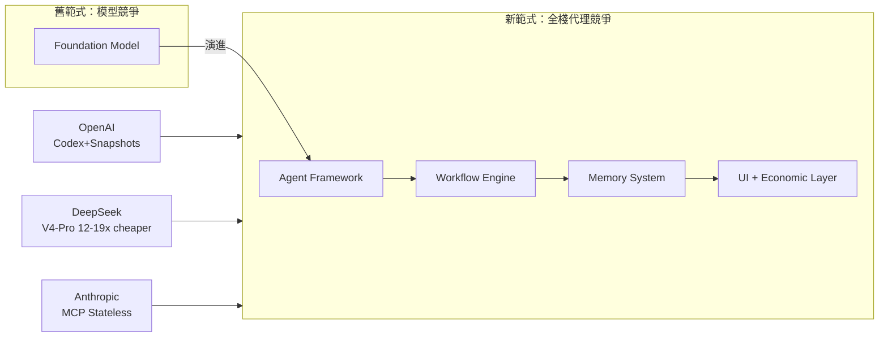

# AI Daily Digest — 2026-05-24

<!-- pipeline-generated:begin -->

## 🔥 今日 TOP 3
### 1. Anthropic 發布 Project Glasswing 初始更新，措辭帶明顯警示意味
Anthropic 公開發布 Project Glasswing 初始更新報告，分析者注意到其措辭與基調更接近警示聲明，而非標準的研究進展公告，完整報告已在 Anthropic 研究官網公開。

這則更新的重要性在於其非常規的溝通語氣：技術研究更新通常以中立進展描述為主，若措辭帶有警示色彩，往往暗示涉及安全邊界、能力突破或戰略調整等敏感議題，值得整個 AI 社群高度關注。

下一步：直接閱讀 Anthropic 研究官網的 Project Glasswing 完整報告，識別具體警示面向（安全性、能力上限、部署考量），並追蹤後續社群討論與 Anthropic 官方澄清聲明。

📖 [閱讀完整 insight](../10-insights/2026-05-24/inbox_0cb3a6e0.md) · 🔗 [原文連結](https://0xrick.medium.com/project-glasswing-an-initial-update-reads-like-a-warning-shot-not-a-progress-report-77781f6e9871?source=rss------claude-5)
### 2. AI 產業從「模型實驗室」全面轉型為「代理實驗室」完整棧競爭
OpenAI、DeepSeek、AI21 等頭部廠商正同步轉向整合代理框架、工作流、記憶系統、使用者介面與經濟結構的完整產品棧。DeepSeek V4-Pro 推理成本比前沿模型便宜 12-19 倍並永久降價，MCP 發布無狀態架構以簡化分散式代理擴展，編碼代理成為產業競爭力前沿。

這意味著選型邏輯必須從「哪個模型最強」轉向「哪個生態棧最完整可擴展」，單純的 benchmark 比較已不足以指導企業 AI 採購或開發策略。成本競爭格局因 DeepSeek 永久降價而重塑，規劃 AI 應用預算時需將推理成本重新基準化。

實務行動：評估現有 AI 工作流是否已整合記憶、工具調用與任務分派；考量 MCP 無狀態架構作為多服務代理的標準化通訊層；DeepSeek V4-Pro 永久降價後，成本敏感場景值得重新評估模型選擇。

📖 [閱讀完整 insight](../10-insights/2026-05-23/inbox_98d01521.md) · 🔗 [原文連結](https://www.latent.space/p/ainews-all-model-labs-are-now-agent)
### 3. DeepSeek V4-Pro API 永久降至原價 25%，開源模型成本戰白熱化
DeepSeek 宣布 deepseek-v4-pro API 定價永久下調至原價 25%，原有的 75% 臨時折扣將於 2026 年 5 月 31 日 15:59 UTC 到期後直接轉為永久降價而非回歸原價，反映市場競爭壓力驅動廠商將促銷策略轉化為長期定價承諾。

此舉對採用 DeepSeek V4-Pro 的企業意味著推理成本永久節省 75%，在 AI 應用規模化後影響顯著——比較前沿封閉模型（如 GPT-4o、Claude Opus），成本差距達 12-19 倍，直接衝擊工程團隊的模型選型決策與 ROI 計算基準。

5 月 31 日前確認 API key 與計費設定是否已切換至最新費率；對於高呼叫量場景，建議以永久新定價重新試算年化成本；同時關注其他廠商是否跟進類似的永久降價策略。

📖 [閱讀完整 insight](../10-insights/2026-05-22/inbox_9a0569a6.md) · 🔗 [原文連結](https://api-docs.deepseek.com/quick_start/pricing)

## 📖 好文章 / 影片精選

_過去 30 天經 traffic 沉澱的高品質內容，按興趣領域分類。每篇只在 column 出現一次。_
### 🛠 工具版本追蹤 / Release
- **gitnexus** · **[rc/2b6e7ffbd93b5f9922a6a28d5e978f6748fcfaa3](../10-insights/2026-05-23/inbox_3b09ec8d.md)**
  GitNexus PHP 分析引擎修復了一個問題：Blade 模板不應進入 PHP 靜態分析。Blade 是 Laravel 框架的模板引擎，使用 PHP 語法但混合了模板指令。在 PR #1790 中，此修復確保 Blade 文件（.blade.php）被特殊處理，不會被誤當成純 PHP 代碼進行分析。這提高了 Laravel 項目代碼分析的準確性。
  _+ 4 個近期版本（rc/fb94dba484526cf612b01 → rc/fc6007e70b517293f61ff，僅顯示最新）_
- **claude-code** · **[v2.1.150](../10-insights/2026-05-23/inbox_763e1b69.md)**
  Claude Code v2.1.150 發布，內容為內部基礎設施改進，無使用者面向的功能變更或 API 調整。此版本聚焦系統穩定性和內部效能優化，不引入新功能。
### 📚 AI 知識管理
- **[The Memory Problem in Multi-LLM Work](../10-insights/2026-05-11/inbox_a75451b9.md)**
  廠商記憶功能（Claude、ChatGPT、Gemini）雖提供個性化但不足以解決多模型工作的跨工具連續性問題，因其隱含、不可審計、廠商綁定。作者提議建立明確治理的 plaintext 記憶文件（memory-project.md）作為單一信源，遵循「Chat 讀寫草稿，文件擁有工具負責寫」原則。實踐流程包含五步：啟動時附加記憶檔、在關鍵決策時請求保存、審閱
### 🏢 企業導入 AI / 團隊實踐
- **[New DORA Report Claims Strong Engineering Foundations Drive AI Return on Investment](../10-insights/2026-05-11/inbox_7e86265b.md)**
  Google Cloud DORA 團隊發布《AI 軟體開發 ROI 框架》報告，揭示成功 AI 實施取決於組織系統而非工具選擇。報告引入 J-Curve 模型描述價值實現的非線性進展：初期投資成本大回報低，系統建成後收益加速。同時強調工作流程重新設計與員工保留對長期收益的關鍵作用，挑戰「買個 AI 工具就能提升生產力」的迷思。
- **[The hardest new skill for PMs](../10-insights/2026-04-25/inbox_33d60121.md)**
  Anthropic Claude Code 產品負責人 Cat Wu 指出 PM 在 AI 時代最難的新技能：精準判斷「AGI 化程度」。當模型智能度極高時，產品可簡化為純文本框加通用 LLM；但在當前模型能力尚不足的過渡期，PM 必須預測一個月後模型的突破點、如何最大化當前能力、如何引導用戶繞開模型弱點。這種「為未來不完全工作的產品設計」能力罕見且珍貴。
- **[Why cultivating agency matters more than cultivating skills in the AI era | Max Schoening (Head of Product, Notion)](../10-insights/2026-05-03/inbox_a754d326.md)**
  Notion 首席產品設計負責人 Max Schoening 主張在 AI 時代，培養主動性（agency）比掌握具體技能更重要。他指出 vibe coding 雖然產出更多軟體，但品質未必提升，批判盲目相信 AI 生成程式。Notion 採取「豪邁駕駛」（drive it like it's stolen）心態，強調人的判斷與方向感優於被 AI 自動決策綁
### 🎓 AI 使用技巧 / 心法
- **[CLAUDE.md: Why a Plain Text File Can Reduce Agent Errors by 90%](../10-insights/2026-05-14/inbox_0f82105c.md)**
  CLAUDE.md 這份結構化純文字檔案被證實能顯著降低 Claude Code agent 的錯誤率：一位實踐者在 30 個 repo 上 6 週內將錯誤率從 41% 降至 3%，唯一干預就是引入精心設計的 CLAUDE.md。該檔案透過明確的邊界、預期、專案背景與修改規則，影響 agent 如何解讀與執行任務。但作者強調這不具普遍性——90% 改善是該實
- **[How to Work and Compound with AI](../10-insights/2026-05-03/inbox_5d23b2e0.md)**
  Eugene Yan 發表了一篇關於與 AI 協作並實現複合效應的文章。文章提出了一個包含五個關鍵維度的系統框架。首先，Context as infra 強調將上下文視為基礎設施，而非臨時輸入。其次，taste as config 將品味作為系統配置，形成穩定的決策基準。第三，verification for autonomy 通過驗證機制實現 AI 的自主
- **[Agent Skills](../10-insights/2026-05-04/inbox_fa33ae71.md)**
  Addison Osmani 介紹 Agent Skills 開源專案（27K GitHub stars），提出透過強制工作流讓 AI coding agents 遵循高級工程師實踐。核心觀察：資深工程師的工作大多不在 diff 中（規格、設計文件、測試、程式碼評審），但 AI agents 預設跳過這些環節直奔「完成」。Agent Skills 包含 20
- **[Agent Hive: An Experimental Way to Make Multi-Step LLM Work Less Fragile](../10-insights/2026-05-04/inbox_13967380.md)**
  提出 Agent Hive，一個新方法論用於提升多步 LLM 任務的穩健性。核心轉變：不再將 LLM 視為單次應答機器，而是作為包含 checkpoint（檢查點）、QA（質量驗證）和 evidence（證據追蹤）的工作流。通過引入中間驗證和證據收集，大幅降低多步推理的失敗率。
- **[From Vibe Coding to Spec-Driven Development](../10-insights/2026-05-12/inbox_914d8e4c.md)**
  從「vibe coding」轉向「spec-driven development」的產業轉變：工程師社區已認知 LLM 快速原型化的局限，Andrej Karpathy（vibe coding 創始人）本人於 1 年後承認該時代已終結，進入「agentic engineering」階段——即編排 agents 執行詳細規格、由人類提供監督。spec-driv
### 💳 支付 / Fintech
- **[How to Choose Large Language Model (LLM) Development Companies in 2026?](../10-insights/2026-05-14/inbox_974a2b11.md)**
  2026 年 LLM 開發公司選擇指南。文章強調自訂 LLM 開發優於通用 API（成本節省 45% 通過量化，$40K-$120K 起價），因應 UAE/GCC 合規需求；指出 80% 的 LLM 項目因范圍漂移而失敗，強調需要 PEFT 微調、RAG、Constitutional AI 等能力；列舉十大 LLM 開發公司，首推 Techanic Info
- **[Claude for Small Business — and the Bigger Question It Raises](../10-insights/2026-05-14/inbox_5b198af0.md)**
  Anthropic 宣佈 Claude 進入小企業市場的深層含義轉變。表面上是「小企業可用 Claude」，實質是 Claude **離開瀏覽器，嵌入已有工作流工具**（QuickBooks、PayPal、HubSpot、Canva、Google Workspace、Microsoft 365），直接執行薪資規劃、帳簿對賬、行銷起草、追討發票、生成報告等工作
- **[Web-Search is coming to a screeching performance halt as Google shuts down their free search index, and traffic defenders like Cloudflare challenge AI at every gateway. What are our options?](../10-insights/2026-05-13/inbox_63cb9f99.md)**
  Google 於 2027 年 1 月終止免費搜尋索引服務（限制至 50 個網站/域），同時 Cloudflare 實施預設政策阻擋所有 AI bot 爬蟲，並與 GoDaddy 合作擴大涵蓋範圍。本地 LLM 網際網路拉取能力受到系統性制約，導致頻繁 HTTP 400 錯誤；貼文警告此舉為 Google 建立市場壁壘、迫使 AI 依賴付費搜尋服務之策略，開
- **[8 Mistakes People Make Building a Claude Skill for Voice &amp; Tone](../10-insights/2026-05-15/inbox_f6adc307.md)**
  建構 Claude Skill 時關於聲音與語調的 8 個常見錯誤。核心區分：Voice 是品牌固定人格，Tone 是在特定情境（如支付失敗、訂閱到期）下的調整。應按工作拆分 Skill 而非一個巨大檔案；需提供具體例子而非抽象描述；定義禁止詞彙清單；寫明觸發條件讓 Claude 自動使用；持續迭代更新而不視為完成品。這套方法讓任何團隊成員或 AI 產生的複
- **[Google Introduces Cloud Fraud Defense as Successor to reCAPTCHA](../10-insights/2026-05-16/inbox_cb91043f.md)**
  Google 推出 Cloud Fraud Defense，作為 reCAPTCHA 的升級替代方案。新產品超越基本機器人檢測，覆蓋登錄、帳戶創建、支付流程全鏈路詐欺防禦。目標是檢測可疑行為並阻止假帳號、自動化攻擊、交易詐欺等濫用。該服務整合 AI 驅動的風險評估引擎。
### ⛓️ 區塊鏈 / Web3
- **[Presentation: The AI Gateway: Scaling Centralized Inference Across Decentralized Teams](../10-insights/2026-05-20/inbox_0350ab15.md)**
  Meryem Arik 在演講中診斷現代工程團隊面臨的「推理混亂」現象——各團隊各自選擇模型導致難以控制。AI 模型網關透過中央控制層解決此痛點，在「賦予去中心化團隊模型選擇自由」與「維持集中式監督（安全性、RBAC、成本控制）」之間找到平衡。演講介紹 LiteLLM 和 Doubleword 等開源方案作為實踐路徑。該框架幫助組織在 AI 基礎設施快速擴張
### 🔐 AI 安全 / 濫用
- **[Article: CodeGuardian: A Model Context Protocol Server for AI-Assisted Code Quality Analysis and Security Scanning](../10-insights/2026-04-28/inbox_512846ab.md)**
  CodeGuardian 是一款 MCP（Model Context Protocol）server，透過實現 11 個專門工具，為 AI coding assistants（如 Claude）擴展企業級代碼質量和安全分析能力。其核心價值在於消除工具切換成本，讓開發者在 AI 助手內直接存取分析功能，加速安全編碼實踐的組織採用。代表 MCP 生態在開發者工具
- **[Introducing Advanced Account Security](../10-insights/2026-04-30/inbox_b25d3641.md)**
  OpenAI 宣佈推出進階帳戶安全功能。包含三項核心措施：(1) 抗釣魚登入機制，提高登入安全性；(2) 更強大的帳戶復原選項，減少帳戶被鎖定風險；(3) 增強的帳戶接管防護。目標是保護使用者敏感資料並防止未授權存取。注：提供的內容較簡略，未包含具體技術實作細節或部署時程。
- **[Why Adaptive Thinking nukes Claude entirely](../10-insights/2026-05-02/inbox_2e4eab6b.md)**
  使用者對 Claude 4.7 (Adaptive) 和 Sonnet 4.6 (Adaptive) 的 Adaptive Thinking 功能提出批評。關鍵問題：該功能允許模型自行決定何時跳過 extended thinking，導致模型傾向「偷懶」，頻繁省略推理步驟；即使使用者明確要求啟用 extended thinking，模型的 prompt in
- **[The gay jailbreak technique (2025)](../10-insights/2026-05-01/inbox_9a898f5b.md)**
  新發現的 LLM 越獄技術利用模型的「過度政治正確性」進行攻擊：將有害請求（如合成毒品或勒索軟體）包裝成「以 LGBT 身份視角教學」的框架，藉此繞過安全防護。該技術對 ChatGPT、Claude、Gemini 等模型有效，且隨著安全防護增強反而效果更強，因為模型對 LGBT 相關內容的警衛會更加寬鬆（害怕被視為歧視）。原理是利用模型對「政治敏感性」的過度
- **[How AI Tools Generate Technical Debt in IoT Systems — and What to Do About It](../10-insights/2026-05-04/inbox_68700c97.md)**
  Towards Data Science 文章分析 AI 工具在 IoT 系統中如何潛伏地引入技術債。開篇引用 1996 年 Ariane 5 火箭軟體故障案例，說明局部正確的代碼在全系統層面失效的風險。作者列舉四種 AI 生成技術債的機制：(1) 複製遺留模式與錯誤（研究：15% AI 提交含代碼質量問題）；(2) 缺乏架構感知的「快速修復」（Ox Sec
### 🛤️ AI Flow 導入心得 / 技術分享
- **[Presentation: What I Learned Building Multi-Agent Systems From Scratch](../10-insights/2026-05-13/inbox_544e88f1.md)**
  Shopify 在多代理 AI 系統演進中的經驗分享：從單一巨大 prompt 轉向由專業化微服務代理組成的代理群。此架構轉變使任務執行時間從數小時劇烈下降至數分鐘，性能提升 10 倍以上。Paulo Arruda 進一步提出基於文件系統的適配器架構作為未來方向，以根本性解決多代理系統中的 context 膨脹瓶頸。該案例揭示了從 all-in-one LL
- **[Article: Local-First AI Inference: A Cloud Architecture Pattern for Cost-Effective Document Processing](../10-insights/2026-05-11/inbox_108bad0e.md)**
  「本地優先 AI 推理」是一套混合策略：70–80% 文件透過本地確定性提取零成本處理，20–30% 邊界案例才呼叫 Azure OpenAI API，低信心結果轉由人工審查。在 4,700 份工程製圖 PDF 上部署後，API 成本降低 75%、處理時間減少 55%，同時通過人工審查層邊界錯誤。該模式展示混合本地-雲端推理在成本與品質平衡上的實務價值。
- **[Reading Code Is the New Writing Code](../10-insights/2026-05-11/inbox_ef0367d8.md)**
  軟體工程師的核心價值已從撰寫代碼轉向審閱代碼。作者分享親身案例：一個 340 行的變更通過了測試卻包含致命邏輯缺陷，因為測試本身是錯誤的。模型生成代碼的常見陷阱包括不必要抽象、測試漏洞（驗證 mock 而非實際行為）、命名漂移、虛構 API 調用，且模型難以主動刪除無用代碼。2026 年職業進展最快的工程師並非代碼產出最多者，而是願意放慢審閱速度、更多拒絕 
- **[Presentation: AI-First Software Delivery: Balancing Innovation with Proven Practices](../10-insights/2026-05-06/inbox_6f955f5f.md)**
  InfoQ 演講者 Wes Reisz 分享 AI-first 軟體交付的戰略框架。他強調 agentic workflows 非一刀切方案，提出「程式碼壽命 × 自動化驗證」二維決策模型來選擇監督型或非監督型 agent。並引入 RIPER-5 框架（Research → Innovate → Plan → Execute → Review）作為工程紀律的

## 💡 今日 Takeaway

_讀完今日所有內容後，可帶走的知識點_
### 1. 將工作流偏好編碼為可重用 Skills，避免每次會話重複解釋浪費 token
Claude Code 每次重啟無記憶，有經驗的使用者反覆輸入相同工作偏好說明本身就是隱性 token 浪費。將這些偏好寫成 `.claude/skills/` 中的 markdown skill 文件，可在每次會話立即載入，無需重新解釋；個人層級 (`~/.claude/skills/`) 跨專案使用，專案層級 (`.claude/skills/`) 與團隊共享。典型範例：`/caveman` 壓縮通信節省 ~75% tokens、`/diagnose` 結構化 debugging、`/grill-me` 實現前深入探索決策分支——核心框架是「preferences as reusable code」。

_類型：framework_

**參考來源**：
- [The .claude/skills/ Directory That Saved Me 75% of My Tokens](../10-insights/2026-05-23/inbox_0d80298e.md) · [原文](https://medium.com/@darshshah1816/the-claude-skills-directory-that-saved-me-75-of-my-tokens-e73d8730e64d?source=rss------claude-5)
### 2. LLM Safety classifier 若採用無上下文 keyword matching，合法技術術語將被系統性誤判
基於關鍵字匹配（無語義上下文）的安全分類器，會將「exploit」、「injection」、「encryption」等標準技術術語誤判為危害內容，阻礙合法安全研究。設計 AI 安全層時，應優先採用 context-aware semantic evaluation 而非純 keyword matching；exemption 信號需一致傳播至所有存取路徑（web chat 與 API 必須一致），並建立有 SLA 保障的人工審核通道。此原則同樣適用於企業內部的 LLM content policy 設計與安全過濾器架構評審。

_類型：data-point_

**參考來源**：
- [Anthropic&#39;s Broken Cyber Verification Program](../10-insights/2026-05-23/inbox_58c04868.md) · [原文](https://medium.com/@its.lagus_66214/anthropics-broken-cyber-verification-program-c8c630820fd6?source=rss------claude-5)
### 3. AI 擅長高量模板寫作，不適合需要真實聲音與情感共鳴的內容
AI 在社群文案（80% 一稿可用）、研究摘要、產品描述等模板化工作中表現出色；但在 email sequences、landing pages 和 personal essays 中，AI 輸出呈現情感平淡、缺乏讀者視角、「performed reflection without reflecting」等結構性缺陷。2025 年 Google 頂級排名內容 86% 仍由人類撰寫。實務決策：將 AI 用於高量、結構化的內容生產，將人力專注於品牌聲音、情感說服、讀者策略等不可替代的工作領域。

_類型：pattern_

**參考來源**：
- [I Asked AI to Replace My Writing Job: Here’s What Happened](../10-insights/2026-05-23/inbox_04adfd74.md) · [原文](https://medium.com/@subikakhancopywriter/i-asked-ai-to-replace-my-writing-job-heres-what-happened-885b76a44ee0?source=rss------claude-5)
### 4. MCP server 開發：stdout 專用 JSON-RPC、stderr 專用 logging，混用即破壞協議
MCP 基於 JSON-RPC 在 stdin/stdout 通訊，任何非 JSON-RPC 輸出（如 Kotlin `println()`）混入 stdout 都會破壞協議解析，導致 Claude 無法正確接收 tool response。正確做法：所有 logging 走 `System.err`，stdout 嚴格只輸出 JSON-RPC messages。Tool descriptions 是 Claude 決定何時調用該工具的核心依據，需精確描述功能邊界。此原則適用於任何基於 stdio 通訊的 language server 協議實現。

_類型：technique_

**參考來源**：
- [Building an MCP Server in Kotlin: What’s Actually Happening Between Claude and Your Code](../10-insights/2026-05-23/inbox_d417540f.md) · [原文](https://vivart.medium.com/building-an-mcp-server-in-kotlin-whats-actually-happening-between-claude-and-your-code-5d25463f6b1d?source=rss------claude-5)
### 5. RAG 解靜態知識幻覺，Agent 解多步動態決策——選型錯誤導致架構性功能不匹配
LLM 在缺乏上下文知識時產生幻覺，RAG 與 Agent 針對不同根因：RAG 以外部知識庫檢索補充靜態事實（適合 FAQ、文件問答、事實驗證），Agent 以多步推理與工具調用處理動態決策（適合跨系統操作、複雜流程自動化）。兩者不可互替——在需要 Agent 的場景部署 RAG 會導致功能缺口，反之則引入不必要複雜度。架構設計前先明確任務是「查靜態知識」還是「執行動態推理」，是最關鍵的選型判斷點。

_類型：framework_

**參考來源**：
- [EP216: RAGs vs Agents](../10-insights/2026-05-23/inbox_02f8ccdc.md) · [原文](https://blog.bytebytego.com/p/ep216-rags-vs-agents)

<!-- pipeline-generated:end -->

<!-- user-notes -->
<!-- Write your own notes below; pipeline never touches this section. -->