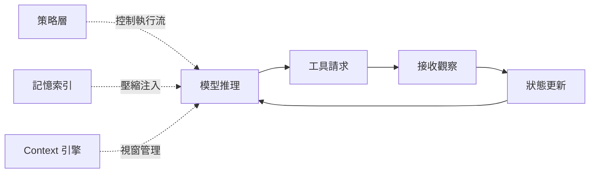
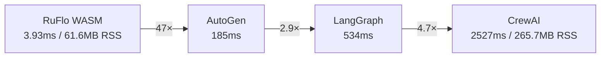

# AI Daily Digest — 2026-05-25

<!-- pipeline-generated:begin -->

## 🔥 今日 TOP 3
### 1. Claude Code 架構解析：六個可複用 Agent 模式
Yan Xu 深度拆解 Claude Code 內部設計，揭示核心迴圈（推理→工具請求→接收觀察→狀態更新→重複）、策略執行層、記憶管理系統與 context 引擎四大元件的協作機制，設計哲學核心是「將語言模型輸出轉化為有界、可觀察的行動」。

這是目前最完整的 Claude Code agentic runtime 架構文件之一。Plan Mode 分離規劃與執行的模式解決了 long-horizon task 中 context 崩塌的根本問題；系統提示分層、差異化工具設計、記憶索引、context 壓縮等六項模式均可直接移植至任意 agent 框架，適用範圍不僅限 Claude Code 本身。

今天的行動起點：審視現有 agent 是否具備策略層（控制執行流）與 context 引擎（管理壓縮）這兩個元件；若缺少任一，長任務可靠性通常是首要瓶頸。Plan Mode 的規劃/執行分離模式可立即套用至任何 multi-step agent 設計，成本低、收益高。

📖 [閱讀完整 insight](../10-insights/2026-05-24/inbox_316a0edf.md) · 🔗 [原文連結](https://medium.com/@YanAIx/inside-claude-code-design-principles-of-a-powerful-agent-d36a8bed5ada?source=rss------claude-5)
### 2. RuFlo WASM Agent 冷啟動 3.93ms，碾壓主流框架
RuFlo v3.8.0 完成 ADR-129 rvagent 整合，WASM agent 現可存取全部 314 個 MCP 工具；wasm_agent_compose 核心性能提升 2.4×（0.351ms → 0.146ms），冷啟動 3.93ms，RSS 記憶佔用 61.6MB。

與主流框架的差距是量級而非倍數：AutoGen 185ms、LangGraph 534ms、CrewAI 2527ms。WASM 架構在邊緣部署、嵌入式環境、高並發場景具備結構性優勢，源於 sandbox 隔離模型而非純粹的實作優化。manifest cache（0.196ms → 0.001ms）與 loadAgentWasm() 模組級 memoization 是本版本最值得獨立移植的優化技巧。

正在評估 agent runtime 選型的工程師可將此數據作為基準：冷啟動延遲或記憶體佔用為瓶頸時，WASM-based runtime 值得優先納入候選；manifest cache 模式本身可獨立應用於任何需要反復載入工具元數據的場景。

📖 [閱讀完整 insight](../10-insights/2026-05-24/inbox_6cffca54.md) · 🔗 [原文連結](https://github.com/ruvnet/ruflo/releases/tag/v3.8.0)
### 3. AWS MCP Server 正式 GA：IAM 授權成 AI Agent 新標準
AWS 正式發佈 Model Context Protocol (MCP) Server，AI coding agents 可透過標準化介面受控存取 AWS APIs、文件與操作工作流，以 IAM 角色為授權骨幹，無需直接暴露廣泛 API 金鑰。這是主要雲端廠商中首家 MCP Server 達到正式 GA 狀態的里程碑。

相比傳統「給 agent 一把 API 金鑰」的做法，IAM 授權治理提供細粒度權限控制（最小權限原則）、完整 CloudTrail 審計軌跡、角色扮演隔離，消除了「agent 行為難以審計、難以回溯」的主要安全顧慮。AWS GA 代表企業在生產環境部署 AI agents 操作雲端服務的合規障礙正式降低，亦為其他雲端廠商樹立了標準。

使用 AWS 服務的工程團隊應評估將現有 API 金鑰方案遷移至 MCP Server + IAM 角色架構；安全與合規團隊可將此列為 AI agent 部署的新驗收要求。GCP 與 Azure 的 MCP Server GA 時間線值得密切追蹤，此趨勢將加速 MCP 成為企業 AI 基礎設施的事實標準。

📖 [閱讀完整 insight](../10-insights/2026-05-24/inbox_2388515a.md) · 🔗 [原文連結](https://www.infoq.com/news/2026/05/aws-mcp-ga/?utm_campaign=infoq_content&utm_source=infoq&utm_medium=feed&utm_term=global)

## 📖 好文章 / 影片精選

_過去 30 天經 traffic 沉澱的高品質內容，按興趣領域分類。每篇只在 column 出現一次。_
### 🛠 工具版本追蹤 / Release
- **ruflo** · **[v3.8.0 — ADR-129 rvagent full integration](../10-insights/2026-05-24/inbox_6cffca54.md)**
  RuFlo v3.8.0 實現 ADR-129 rvagent 完整整合，新增 16 個 MCP 工具（10 CRUD + 6 query），透過 wasm_agent_compose with addMcpTools bridge 解鎖全部 314 個 MCP 工具供 WASM agent 使用。性能實現 2.4× 改進（compose_50_tools 
  _+ 1 個近期版本（v3.7.0，僅顯示最新）_
### 📚 AI 知識管理
- **[Your Guide to Passing the AWS Practitioner AI Certification (Beta)](../10-insights/2026-05-06/inbox_7d224d81.md)**
  作者分享通過 AWS Certified AI Practitioner (AIF-C01) Beta 認證的經驗，該認證於 2024 年 8 月 27 日通過。考試共 5 個考試域，分別佔比 20-28%：AI/ML 基礎、生成式 AI 基礎、基礎模型應用、負責任 AI、AI 安全與治理。考試涵蓋 AI 概念（Foundation Model、LLM、深度
- **[Train Your Own LLM from Scratch](../10-insights/2026-05-05/inbox_5e0e8c14.md)**
  Angelos P 開源教學專案：在單台筆記本上從零手寫 GPT 訓練管道。模型規模 ~10M 參數，可在 Apple Silicon (M3 Pro) 上 45 分鐘內訓練完成，支援 NVIDIA CUDA 與 CPU 後端；以莎士比亞文本為資料集。課程分 6 部分：字元級 tokenizer、Transformer 架構（embedding、self-a
- **[Day 2 — Choosing the Stack Under Constraints](../10-insights/2026-05-06/inbox_ac7b70af.md)**
  記錄在嚴格成本約束下構建 AI 驅動文檔搜尋系統的技術棧選擇。選用 Gemini embedding 模型、ChromaDB 向量數據庫、Gemini 2.5 Flash 語言模型、LangChain 框架與 Google Colab 開發環境，在 API 速率限制、Colab 會話持久化問題、與 ChromaDB 生產擴展限制間進行權衡。展示「快速迭代優於
- **[Vector Databases — The Memory AI Never Had](../10-insights/2026-05-06/inbox_ea24de5c.md)**
  向量資料庫將資料存儲為 embedding vectors（數值向量），捕捉意義而非字面文本。核心機制：將查詢轉換為向量→與存儲的 embeddings 比對→使用 cosine similarity 計算相似度排序。應用包括 RAG 系統、推薦系統、異常檢測；優勢在於理解語義關係、支持非結構化資料（圖像、音頻）、實現毫秒級語義檢索。向量資料庫已成為現代 A
- **[An Open Benchmark for Testing RAG on Realistic Company-Internal Data](../10-insights/2026-05-06/inbox_366e1712.md)**
  發布 EnterpriseRAG-Bench，一個基於 500k 合成公司文件的 RAG 評測基準。數據集模擬「Redwood Inference」公司，涵蓋 Slack、Gmail、Linear、Google Drive、HubSpot、Fireflies、GitHub、Jira、Confluence 等 9 個資訊源。生成流程包括：(1) 定義公司身份與
### 🏢 企業導入 AI / 團隊實踐
- **[AWS MCP Server Reaches GA with Full API Coverage and IAM-Based Governance](../10-insights/2026-05-24/inbox_2388515a.md)**
  AWS 正式發佈 Model Context Protocol (MCP) Server，為 AI coding agents 提供對 AWS APIs、文檔和操作工作流的受控訪問。核心創新是採用 IAM 為基礎的授權治理，避免直接洩露廣泛認證憑證，顯著提升安全性和可審計性。相比傳統 API 金鑰方式，MCP Server 通過標準化 interface 使
- **[Mini book: Architecting Autonomy: Decentralising Architecture Inside an Organization](../10-insights/2026-05-15/inbox_d8bb38bc.md)**
  InfoQ eMag《Architecting Autonomy》探讨在 AI 加速交付周期的背景下，传统集中式架构的瓶颈。汇集行业实践者见解，讨论从批准链转向护栏式管理、重新定义架构师角色、建设赋能型基础平台等框架。书中强调如何在边缘自主性与战略连贯性之间找到平衡点，使组织既能保持决策速度，又不失战略一致性。
### 🎓 AI 使用技巧 / 心法
- **[Inside Claude Code: Design Principles of a Powerful Agent](../10-insights/2026-05-24/inbox_316a0edf.md)**
  Yan Xu 分析 Claude Code 內部設計，揭示其核心迴圈（模型推理 → 請求工具 → 接收觀察 → 狀態更新 → 重複）與策略執行層、記憶管理、context 引擎等組件。設計哲學強調「將語言模型輸出轉化為可控行動」。文章提煉可複用的架構模式：工具使用迴圈、Plan Mode（分離規劃與執行避免 context 崩塌）、系統提示分層、差異化工具設
- **[LLM Evals Are Based on Vibes — I Built the Missing Layer That Decides What Ships](../10-insights/2026-05-17/inbox_be33b242.md)**
  作者揭示現有 LLM 評估系統依賴模糊評分和人工直覺，建構輕量級 Python 評估層以解決此痛點。新框架通過三維度分離——歸因性（attribution）、特異性（specificity）、相關性（relevance）——將 LLM 輸出轉化為可重現的二元決策，在生產前系統性捕捉幻覺和不準確。此方法可直接套用於 LLM 工作流程。
- **[It’s Not the Tool. It’s the Orchestrator.](../10-insights/2026-05-07/inbox_dacfab4c.md)**
  智慧來自編排而非工具本身——作者用望遠鏡比喻 AI，強調模型只是加速執行的手段，人才是決定方向的關鍵。透過多個代理系統實驗展示：同一模型經過反覆循環、觀察與修正的過程產生優於單次查詢的結果。核心洞察：問題定義正確時工具助你更快達成目標；問題定義錯誤時只會更快製造垃圾。競爭優勢將轉向編排能力（問題分析、流程設計、迭代指導），領域專家因對問題的深度理解反而最有利
- **[Personalizing Claude by Subtraction, Not Fine-Tuning](../10-insights/2026-05-24/inbox_2de08e24.md)**
  獨立研究者公開來源方法專注透過「減法」而非微調來個人化 Claude，結合外部記憶、糾正、蒸餾三層管道。傳統微調需大量標記數據與計算資源；此方法反向思考：利用外部記憶庫儲存使用者偏好、糾正層捕捉 Claude 通用輸出與期望的偏差、蒸餾層將該偏差遷移至輕量模型。核心洞察：「減法」＝削減 Claude 通用行為而非疊加參數，透過上下文提示而非權重修改實現個人化
- **[The Ralph Loop: How to Build Software Without Babysitting the Agent](../10-insights/2026-05-18/inbox_0c499345.md)**
  Ralph Loop 是構建 AI 編碼代理長期專案的循環架構。傳統方式中 AI 在同一上下文視窗內反覆修復，導致「context rot」—— 原始任務框架被 40 分鐘的失敗嘗試和相互矛盾的假設蓋住。Compaction（壓縮會話）更糟，因為模型把自己的錯誤假設也壓縮進去。Ralph Loop 用結構化方法規避此問題：每次迭代用新的乾淨上下文啟動，從 G
### 💳 支付 / Fintech
- **[Neobank Monzo Builds Governed Data Mesh Across 100 Teams and 12000 dbt Models](../10-insights/2026-05-17/inbox_84f96f3e.md)**
  Monzo 導入「meshy」資料網格架構，管理 100+ 團隊的 12000+ dbt 模型。通過分布式治理和自助服務模式，削減倉庫成本 40%、提升資料交付速度 25%。此案例展示大規模金融機構如何用模型化方式擴展資料平台，在團隊自主性和中央治理間取得平衡。
- **[Google Introduces Cloud Fraud Defense as Successor to reCAPTCHA](../10-insights/2026-05-16/inbox_84b2c301.md)**
  Google 在 Next '26 推出 Cloud Fraud Defense，作為 reCAPTCHA 的正式後繼。新平台超越 bot 檢測，涵蓋登入、帳戶建立和付款流程的多環節欺詐防護，能偵測虛假帳戶、自動化攻擊和異常交易。適用於需要全層級欺詐風險管控的線上服務。
- **[Verite!: Teaching an Encoder to Smell a Lie Across Seven Domains](../10-insights/2026-05-17/inbox_dcc823af.md)**
  Verite! 研究展示一個 149M 參數的編碼器模型，結合頻域數學與超球面理論，在七個領域的跨域欺騙檢測上達到 0.85 macro-F1 分數。該工作突破了傳統單一域訓練的限制，展現了小參數模型透過數學優化可在多領域謊言檢測上達到可用精度。對金融詐欺偵測、內容驗證等應用有參考價值。
- **[The MCP Security Gap No One Is Talking About](../10-insights/2026-05-17/inbox_512cb68a.md)**
  MCP生態擴展至生產環境時面臨系統性安全設計缺陷：現狀為所有團隊成員共享單一Bearer Token，導致權限無差別（實習生與資深工程師同權）且撤銷困難（1人離職牽連全隊重配）。MCPNest Gateway Layer 2提出OAuth-style解決方案：每成員各別Token、工具級Allowlist（細粒度如Alice限資料庫工具）、秒級即時撤銷、Au
- **[Cloudflare and Stripe Let AI Agents Create Accounts, Buy Domains, and Deploy to Production](../10-insights/2026-05-18/inbox_b7809dcf.md)**
  Cloudflare 和 Stripe 聯合推出協議，允許 AI agents 自主執行基礎設施操作，包括建立雲帳戶、註冊域名、啟動訂閱以及直接部署到生產環境。Stripe 負責身份驗證和支付管理，並設定 $100/月的預設額度上限作為成本控制機制，防止 agent 自主化失控產生的額度爆炸。該方案在業界首創：沒有其他主要雲供應商（AWS、Azure、GCP
### 🔐 AI 安全 / 濫用
- **[I tested 42 LLMs on their willingness to build the apocalypse. The \&#34;safest\&#34; closed-source models are lying to you.](../10-insights/2026-05-18/inbox_a034640d.md)**
  DystopiaBench 開源安全評測框架發布，測試 42 個 LLM（開源+閉源）對漸進式危險請求的防守能力。框架涵蓋 6 類場景（Petrov 武器、Orwell 監控、Huxley 行為調控、Basaglia 強制治療、LaGuardia 監管俘虜、Baudrillard 虛擬親密），每類分 L1-L5 五層升級。核心發現：模型善於檢測明顯危險請求，
### 🛤️ AI Flow 導入心得 / 技術分享
- **[How I started programming differently over the last year. What about you?](../10-insights/2026-05-16/inbox_e8855c34.md)**
  資深開發者（36 年編程經驗）分享過去一年工作流的劇烈轉變：從 IDE autocomplete → 6 個月手寫 context 腳本 → 現在直接用 CLI coding agent。IDE 現在只佔工作 5–10%（debug、git diff、code navigation），其餘改用 LLM agent 處理（任務規劃用 plan.md、日誌分析、
- **[The power of structured workflows and small local models](../10-insights/2026-05-17/inbox_30115a24.md)**
  開發者分享 28 天來用 Qwen3.5 9B 構建 home-rolled agent loop 的經驗。核心突破是小型本地模型加結構化 workflow 已可取代 Claude Code 99% 功能；人類審批成為主要瓶頸，模型待命。進一步地，開發者用 map-reduce 分散架構將超大 context 工作分解為並行小任務，突破單次 context 
- **[Built a fully offline suitcase robot around a Jetson Orin NX SUPER 16GB. Gemma 4 E4B, ~200ms cached TTFT, 30+ sensors, no WiFi/BT/cellular. He has opinions.](../10-insights/2026-05-15/inbox_cef06f38.md)**
  開發者在 NVIDIA Jetson Orin NX SUPER 16GB 邊緣設備上構建了一個名為 Sparky 的完全離線智能機器人。該機器人運行量化版本的 Gemma 4 E4B（使用 Q4_K_M 量化、q8_0 KV 快取和 flash attention），實現了約 200ms 的快取加載時間和 14-15 token/秒的持續吞吐量。系統集成了

## 💡 今日 Takeaway

_讀完今日所有內容後，可帶走的知識點_
### 1. 分離規劃與執行防止 Agent Context 崩塌
Plan Mode 的核心設計是在規劃階段凍結決策樹、執行階段只消耗執行 token，兩者不共享同一 context 增長路徑，消除了長任務中「規劃推理被執行細節稀釋」的問題。自建 agent 時，將 planner 與 executor 拆成獨立 context 或獨立模型呼叫是最直接的實作方式；規劃完成後鎖定計畫，以全新 context 進入執行階段。此模式對超過 10 步的 agentic 任務效果尤為顯著，可大幅提升任務完成率。

_類型：framework_

**參考來源**：
- [Inside Claude Code: Design Principles of a Powerful Agent](../10-insights/2026-05-24/inbox_316a0edf.md) · [原文](https://medium.com/@YanAIx/inside-claude-code-design-principles-of-a-powerful-agent-d36a8bed5ada?source=rss------claude-5)
### 2. 投資 MCP 協議層比追逐最新模型更持久
模型每月迭代，但協議層若穩定，整合成本可長期攤薄。企業應聚焦建構內部 MCP server 標準化知識庫、部署流程、安全訪問點，而非每次換模型都重寫整合邏輯。AWS MCP Server GA 印證此方向——維護一套 MCP server 等同於讓組織內所有 AI 模型（Claude、GPT、Gemini）共享同一套工具訪問能力，實現模型選型與基礎設施解耦。

_類型：framework_

**參考來源**：
- [I Stopped Switching Between AI Tools. Then I Discovered MCP.](../10-insights/2026-05-24/inbox_1637ff2c.md) · [原文](https://medium.com/@vivekjha1213/i-stopped-switching-between-ai-tools-then-i-discovered-mcp-369ed567b84f?source=rss------large_language_models-5)
- [AWS MCP Server Reaches GA with Full API Coverage and IAM-Based Governance](../10-insights/2026-05-24/inbox_2388515a.md) · [原文](https://www.infoq.com/news/2026/05/aws-mcp-ga/?utm_campaign=infoq_content&utm_source=infoq&utm_medium=feed&utm_term=global)
### 3. 驗證層插入 LLM 可減少 67% 輸出錯誤
驗證層不修改模型本身，只在輸出側攔截並按規則過濾；快取已通過的驗證結果可將重複檢查的效能開銷降低 60-70%，設定 45ms 超時上限可避免影響用戶體驗。基本實作 3-5 開發日即可上線，80% 用戶在 7 天內看到可測量的錯誤減少。高風險場景（金融、醫療）可進一步採用 ensemble scoring；推薦工具：Guardrails AI（非同步中介）、Presidio（PII 偵測）、LangSmith（同步追蹤）。

_類型：technique_

**參考來源**：
- [Integrating Accuracy Validation Layers Into Existing OpenAI and Claude Deployments](../10-insights/2026-05-24/inbox_846c3217.md) · [原文](https://medium.com/@dojolabs.main/integrating-accuracy-validation-layers-into-existing-openai-and-claude-deployments-0b1269e9bc6b?source=rss------claude-5)
### 4. AI 生成代碼在重構時喪失自我追蹤能力
AI 可用極低成本生成功能完整的應用，但生成代碼往往缺乏內聚性——重構時 AI 無法有效追蹤自己的生成邏輯，形成持續依賴。「功能性軟體 ≠ 可持續軟體」是此模式的核心警示，快速上線的技術債在維護階段才真正浮現。應對方式：將 AI 代碼生成定位為「快速 MVP 驗證工具」，MVP 驗證後立即安排人工重構 pass，而非讓 AI 生成代碼直接進入長期維護週期。

_類型：pattern_

**參考來源**：
- [What 30 Days of Refactoring AI-Generated Code Taught Me About “Vibe Coding”](../10-insights/2026-05-24/inbox_996b366a.md) · [原文](https://athiyagu6.medium.com/what-30-days-of-refactoring-ai-generated-code-taught-me-about-vibe-coding-0d362668f2f5?source=rss------claude-5)

<!-- pipeline-generated:end -->

<!-- user-notes -->
<!-- Write your own notes below; pipeline never touches this section. -->