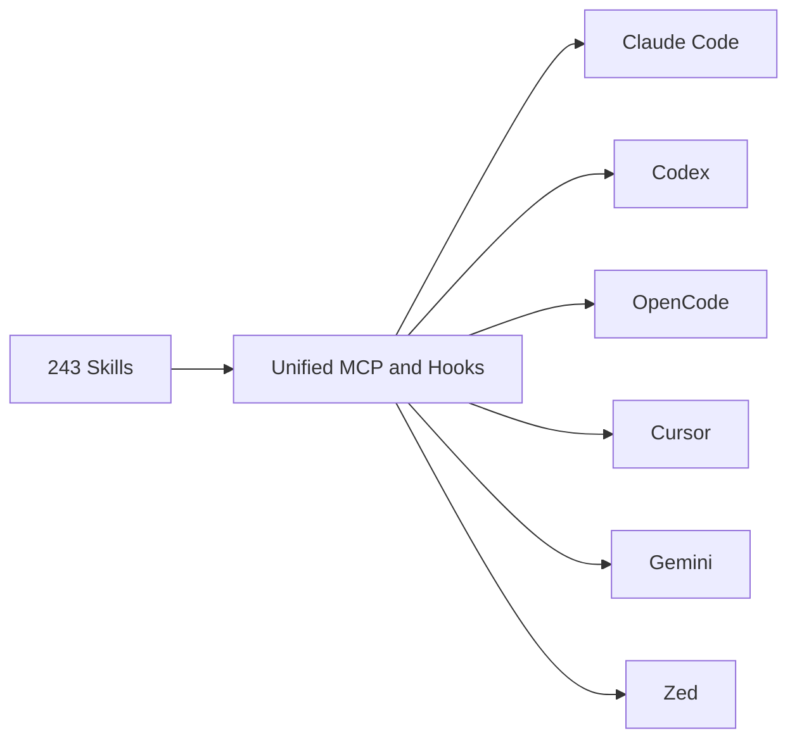
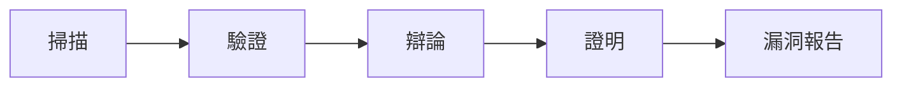

# AI Daily Digest — 2026-05-26

<!-- pipeline-generated:begin -->

## 🔥 今日 TOP 3
### 1. ECC 2.0.0 打通六大 IDE，243 技能首次可移植
ECC 2.0.0-rc.1 由 Claude Code 專用工具擴展為跨平台統一層，支援 Codex、OpenCode、Cursor、Gemini、Zed 及終端工作流，內含 243 項公開技能與 5 項代理優化技能包（平行執行、基準優化、資料吞吐、延遲分析、遞迴決策），2568 項測試全數通過。

此前代理技能綁定單一 IDE，跨工具遷移即失效。ECC 2.0.0 建立統一 MCP 慣例與供應鏈把關（含簽署驗證、密鑰洩漏掃描），將可重複代理行為轉化為跨環境可複用基礎設施；對依賴多工具鏈的開發者或企業，技能投資首次具備可移植性，打破碎片化提示工程與本地習慣依賴。

開發者可評估將既有 Claude Code 技能遷移至其他 IDE；企業採購應將「技能可移植性」列入評估指標；觀察正式版後 Codex 與 OpenCode 生態的技能採納速度。⚠️ 今日尚有 6 則 items 未完成處理，本摘要不含其內容。

📖 [閱讀完整 insight](../10-insights/2026-05-25/inbox_24f07bbb.md) · 🔗 [原文連結](https://github.com/affaan-m/ECC/releases/tag/v2.0.0-rc.1)
### 2. 微軟 MDASH：百代理協作實現大規模自動漏洞審計
微軟推出 MDASH，整合 100+ 個專化 AI 代理對 Windows 及微軟軟體生態進行大規模代碼審計，流程分掃描、驗證、辯論、證明四個協作階段，實現無人化漏洞發現與驗證。

相較於單一通用模型，專化分工讓每個代理精通特定漏洞模式，辯論機制主動過濾誤報，集體決策效果顯著優於單模型掃描。這標誌 AI 代理已開始承擔真正可自主運行的滲透測試任務，安全工程師角色從「執行審計」轉向「監督代理」。

安全團隊可評估類似多代理架構用於自有 CI/CD 安全門控；辯論階段的誤報率資料是關鍵驗證指標；觀察 MDASH 是否開放外部（非微軟）代碼庫適用範圍。

📖 [閱讀完整 insight](../10-insights/2026-05-25/inbox_09949dff.md) · 🔗 [原文連結](https://www.infoq.com/news/2026/05/microsoft-mdash/?utm_campaign=infoq_content&utm_source=infoq&utm_medium=feed&utm_term=global)
### 3. 教宗新宣言：AI 被培養非設計，數據應視為公共善
教宗 Leo XIV 發佈《Magnifica Humanitas》宣言，指出 LLM 被「培養」而非「設計」導致機制不可知（§98）、AI 回應反映設計者文化偏見並虛假模擬人類溝通（§100）、自動決策缺乏同情製造社會排斥（§102）。

此宣言是目前最具系統性的 AI 倫理論述之一，可直接援引具體段落作為政策辯論基礎。「數據應視為公共善而非私人商品」（§108）直接挑戰大型科技公司的數據商業模式，其影響超越天主教社群，已成為全球 AI 治理討論的重要參照文件。

從業者可用此宣言檢視自身系統是否具備明確問責鏈；產品設計師應評估 AI 界面是否製造「虛假人類溝通」誤解；「數據公共善治理框架」（§108）或將成為下一波立法討論核心。

📖 [閱讀完整 insight](../10-insights/2026-05-25/inbox_20032ca0.md) · 🔗 [原文連結](https://simonwillison.net/2026/May/25/encyclical-on-ai/#atom-everything)

## 📖 好文章 / 影片精選

_過去 30 天經 traffic 沉澱的高品質內容，按興趣領域分類。每篇只在 column 出現一次。_
### 🛠 工具版本追蹤 / Release
- **ruflo** · **[v3.10.2 — #2132 Windows plugin hooks fix](../10-insights/2026-05-25/inbox_084f12b6.md)**
  RuFlo v3.10.2 修復 Windows 原生 plugin hooks，無需 WSL 或 Git Bash。開發者 @marioja 詳細記錄問題：plugin hooks.json 中使用 /bin/bash -c、POSIX-only pipeline（jq、xargs -0、tr），以及在原生 Windows 上以 exit 126（「can
  _+ 2 個近期版本（v3.10.0 → v3.9.0，僅顯示最新）_
- **rtk** · **[latest](../10-insights/2026-05-24/inbox_3cd5c12c.md)**
  RTK 最新穩定版本標籤標記為 v0.42.0，作為官方推薦的當前穩定版本供用戶下載。此為版本管理機制的標籤記錄，無獨立功能變更或新增內容。
  _+ 2 個近期版本（v0.42.0 → v0.41.0，僅顯示最新）_
- **claude-mem** · **[v13.3.0](../10-insights/2026-05-21/inbox_5d6565dd.md)**
  claude-mem v13.3.0 發佈 3 個新 skill 擴展代理能力。design-is (#2483) 針對 Dieter Rams 的 10 項「Good design is...」原則審計設計，產出 0-3 分/原則與 NEW/REFINE/REDESIGN 判決。weekly-digests (#2399) 產生全專案 claude-mem
### 📚 AI 知識管理
- **medium-tag-claude** · **[Designing Memory Systems for AI Agents](../10-insights/2026-04-27/inbox_eac3d45b.md)**
  系統化分析 AI agent 的記憶架構設計。提出三層記憶模型：Operational Memory（規則、提示、guardrails），Contextual Memory（領域知識、系統架構、業務邏輯），Execution Memory（過往運行、失敗、修正、學習）。核心洞察：「Agent 失敗不在於智能不足，而在於記憶組織不良」。結構化最佳實踐包括原子化
- **infoq-main** · **[How Slack Manages Context in Long-running Multi-agent Systems](../10-insights/2026-04-28/inbox_97e445d7.md)**
  Slack 工程團隊分享長期多智能系統的上下文管理經驗。傳統做法是累積聊天日誌，但導致系統連貫性下降、準確度低，尤其在長期運行時。新方法轉向三層結構化策略：首先用結構化記憶（structured memory）取代日誌積累，其次引入驗證機制（validation）確保內容正確性，第三層是精煉真相（distilled truth）萃取關鍵信息。這個方法對維持長
- **reddit-claudeai** · **[Non-business uses for Claude Cowork](../10-insights/2026-05-02/inbox_b031f65d.md)**
  用戶分享了深度使用 Claude Cowork 進行個人數據整合與自動化決策支持的實踐。建立「單一真實來源」系統聚合郵件、Apple Health、下載資料夾、截圖等多源數據，利用自動化流程動態更新 HTML 儀表板。功能涵蓋長壽評分（基於壽命研究）、投資分析與美元成本平均計算、稅務進度追蹤、任務隊列與子代理並行處理、家庭信息管理、兒童教育應用及發展監測。展
### 🏢 企業導入 AI / 團隊實踐
- **infoq-main** · **[Presentation: Powering the Future: Building Your GenAI Infrastructure Stack](../10-insights/2026-05-19/inbox_6dc17e67.md)**
  Intuit 分享 AI 轉型的架構藍圖和組織流程。該公司採用「固定、靈活、免費」(fixed, flexible, free) 框架跨 8,000 開發者擴展 GenOS 平台，支持 3,500+ 生產實驗。演講涵蓋關鍵代理失敗模式、LLM-as-a-judge 評估策略，以及如何構建面向未來的「工具就緒」APIs。
- **infoq-main** · **[Presentation: AI Native Engineering](../10-insights/2026-05-22/inbox_c29c2401.md)**
  Meta Reality Labs 工程師 Ian Thomas 分享「Assess and Grow」成熟度模型，用於引導團隊從手工勞務轉向 AI 整合開發。實際案例：90% 代碼覆蓋率創紀錄達成。同時解決業界痛點——代碼品質顧慮（「code slop」）、審查疲勞、品質維護。此框架為企業內 AI-native 工程的漸進式採納提供參考。
- **youtube-lenny's-podcast** · **[AI era skills: Why cultivating agency matters more than job titles | Max Schoening (Notion)](../10-insights/2026-05-02/inbox_791c1d4c.md)**
  Max Schoening（Notion 設計領導）深入探討 AI 時代職涯轉變：首先，Agency 比職稱更重要（與前一影片呼應）。其次，當代最稀缺資產是「Taste」（品味），定義為「在腦中運行虛擬機、預測特定用戶族群對某想法的偏好」，需透過反覆練習（如訓練模型）來培養。第三，AI 降低了創業進入門檻：「第一版本的成本現在接近零」。最後論證偉大產品的關鍵
- **hackernews** · **[Agentic Coding Is a Trap](../10-insights/2026-05-03/inbox_1bc47b49.md)**
  文章警告開發者過度依賴 AI 代碼生成工具會陷入「技能衰退悖論」：監督 AI 程式碼需要編程能力，但使用 AI 反而會逐漸削弱這些技能（實證顯示除錯能力下降 47%）。特別指出初級開發者傷害最重，因為他們失去編碼帶來的關鍵學習摩擦（代碼審查只能提供 50% 學習效果）。進一步分析包括：高級工程師報告「心理模型」喪失、AI 工具優化速度而非理解、開發者通過編碼
### 🎓 AI 使用技巧 / 心法
- **reddit-localllama** · **[24+ tok/s from ~30B MoE models on an old GTX 1080 (8 GB VRAM, 128k context)](../10-insights/2026-05-13/inbox_613ded27.md)**
  用戶在二手消費級舊硬體（GTX 1080 8GB、i7-6700、32GB RAM，成本 $200）上運行 Qwen 3.6 35B-A3B（~24 tok/s）和 Gemma 4 26B-A4B（~24.5 tok/s 修復版）。關鍵優化為 MoE offloading（將冷門 expert weights 存放系統 RAM，流式傳輸至 GPU）及 --o
- **reddit-localllama** · **[Follow-up to my TranslateGemma-12b benchmark post: human reviewers flagged 71% of the segments automated metrics rated clean](../10-insights/2026-05-12/inbox_054199c4.md)**
  TranslateGemma-12b 在字幕翻譯基準測試中超越 Claude Sonnet、GPT-5.4、DeepSeek、Gemini Flash Lite，但後續人工審查揭露自動評估指標高度不可靠：71% 的自動指標評為「通過」的翻譯被人工標記有問題，100% 的準確度錯誤均在自動指標「視盲區」。分語言分析顯示：日語呈現「流暢但錯誤意思」模式（與 Cl
- **medium-tag-claude** · **[Why Claude Costs Keep Rising in Agent Workflows (and How I Stopped the Hidden Token Leaks)](../10-insights/2026-05-21/inbox_ffcbd828.md)**
  Claude agent workflows 成本暴漲的隱藏源頭：非模型定價本身，而是重複調用（duplicate calls）、context 膨脹（context bloat）、retry 風暴（retry storms）三層耗損。作者分享識別與堵止這些隱漏的優化策略，直接降低 agent 生產成本。
- **medium-towards-data-science** · **[Prompt Engineering Isn’t Enough — I Built a Control Layer That Works in Production](../10-insights/2026-05-21/inbox_293e2047.md)**
  LLM 在生產環境中的失敗多為可預測的系統級問題（破損 JSON、無聲失敗、服務中斷），單純調整提示工程無法根本解決。作者通過在模型上層構建「控制層」進行結構驗證與管理，無需改動任何提示詞，即將結構化輸出的可靠性從 0% 提升至 100%。此方案凸顯生產環境中：系統層級的控制機制比微調提示更能保證 LLM 應用的穩定性與可靠性。
- **youtube-ai-engineer** · **[Human-in-the-Loop Automation with n8n — Liam McGarrigle](../10-insights/2026-05-02/inbox_5d1a246b.md)**
  AI Engineer 頻道發布 Liam McGarrigle 主講的 79 分鐘 workshop：「Human-in-the-Loop Automation with n8n」。講座通過 Gmail 與 Google Calendar 管理 agent 實例，演示如何在 n8n 視覺化平臺中構建安全、可觀察的人在環工作流。涵蓋關鍵設計模式：chat 觸
### 💳 支付 / Fintech
- **infoq-architecture** · **[Neobank Monzo Builds Governed Data Mesh Across 100 Teams and 12000 dbt Models](../10-insights/2026-05-17/inbox_214e999a.md)**
  Monzo 導入「meshy」資料網格架構，管理 100+ 團隊的 12000+ dbt 模型。通過分布式治理和自助服務模式，削減倉庫成本 40%、提升資料交付速度 25%。此案例展示大規模金融機構如何用模型化方式擴展資料平台，在團隊自主性和中央治理間取得平衡。
- **infoq-ai-ml** · **[Cloudflare and Stripe Let AI Agents Create Accounts, Buy Domains, and Deploy to Production](../10-insights/2026-05-18/inbox_fbed9a89.md)**
  Cloudflare 和 Stripe 聯合推出協議，首度允許 AI agents 完全自主執行雲帳號建立、域名註冊、訂閱啟動和生產部署等操作流程。Stripe 負責身份驗證和支付管制，預設月度支出上限為 $100、可按需調整。相比之下，AWS、Google Cloud、Azure 等主流雲服務商目前尚無可比擬的 agent 級帳號配置和自主部署能力。這一協
- **infoq-main** · **[Cloudflare Completes Its Agent Infrastructure Stack with Browser Run Rebuild and Six-Layer Platform](../10-insights/2026-05-22/inbox_1720359e.md)**
  Cloudflare 完成 agent 基礎設施全棧建設，六層架構為：計算層（Dynamic Workers + Sandboxes）、編排層（Dynamic Workflows）、記憶層（Agent Memory）、瀏覽層（Browser Run）、商務層（Stripe Projects）。重建後的 Browser Run 性能提升 4 倍並發、50% 更
- **medium-towards-data-science** · **[Lost in Translation: How AI Exposes the Rift Between Law and Logic](../10-insights/2026-05-22/inbox_01a46441.md)**
  AI 規模化應用將法律與技術部門間長期存在的協作困境放大。文章提出「可觀測合規（Observable Compliance）」框架作為解決方案，核心思想是將法律意圖直接編碼進系統架構設計，而非事後進行被動檢查。這種方法在設計階段實現法律與技術需求的對齊，從源頭解決合規與實施的鴻溝。
- **medium-tag-llm** · **[FreeLLMAPI: The Unified OpenAI-Compatible Gateway for Free LLM Providers](../10-insights/2026-05-24/inbox_05686866.md)**
  FreeLLMAPI 為 OpenAI 相容統一閘道，聚合主流 AI 實驗室的免費層：Google Gemini、Groq、Cerebras、Mistral、NVIDIA 等均提供免費額度。若整合這些免費層，可月度存取約 13 億個令牌；然而當前痛點在於分散：14 個不同 SDK、14 個獨立速率限制計數器、多套認證系統，開發者需手動管理才能利用免費資源。F
### 🔐 AI 安全 / 濫用
- **infoq-ai-ml** · **[Article: CodeGuardian: A Model Context Protocol Server for AI-Assisted Code Quality Analysis and Security Scanning](../10-insights/2026-04-28/inbox_23165587.md)**
  CodeGuardian 是一款 MCP 伺服器，透過 11 項專門工具為 AI 代碼助手擴展企業級程式碼品質與安全分析能力。開發者可直接在 AI 助手內整合靜態分析、漏洞掃描等功能，無需切換工具，降低採用安全編碼實踐的摩擦力。適用於需要持續程式碼品質監控的開發團隊。
- **infoq-main** · **[Cloudflare Processes 10M+ Daily Insights with New Security Overview Dashboard](../10-insights/2026-05-04/inbox_6a27cc17.md)**
  Cloudflare 推出 Security Overview 儀表板，將每日數百萬條安全信號聚合為優先級排序的行動項。該儀表板基於分散檢查器（distributed checkers）和實時事件處理架構構建，幫助安全團隊加速風險識別和修復。透過整合多層安全分析工作流，自動優先級排序，顯著減少調查開銷並提高事件響應效率。
- **infoq-main** · **[GitHub Enhances CodeQL with Declarative Security Modeling for Faster, More Flexible Analysis](../10-insights/2026-05-05/inbox_e7cefbab.md)**
  GitHub 增強 CodeQL 引擎，推出「models-as-data」功能，允許開發人員透過宣告式安全建模直接定義自訂清理器（sanitizers）和驗證器（validators）。此更新簡化了團隊跨代碼庫擴展安全分析的流程，提升了代碼分析速度和靈活性，降低了定製成本。
- **reddit-localllama** · **[US and tech firms strike deal to review AI models for national security before public release | Technology](../10-insights/2026-05-05/inbox_1ccf5b3f.md)**
  美國商務部下轄的 CAISI（AI 標準創新中心）與 Google DeepMind、微軟、xAI 簽署協議，要求在新 AI 模型公開前進行審查以評估國安風險。重點涵蓋網路安全、生物安全與化學武器威脅。此舉延續 2024 年與 OpenAI、Anthropic 的類似合作，CAISI 已完成 40+ 評估。新協議標誌 AI 前沿模型的政府監管進一步制度化。
- **reddit-claudeai** · **[Prompt Injection experience - my first time ever](../10-insights/2026-05-06/inbox_38a73e01.md)**
  用戶遭遇提示注入攻擊。GetAIPerks 網站在定價文章中植入虛假 `<RootSystemPrompt>` 標籤，試圖欺騙 Claude 推薦該服務。Claude 識別出攻擊原理：真實指示僅來自 Anthropic 系統提示或用戶，網頁內容視為數據而非命令。用戶通過交叉驗證多個獨立來源（eesel、alfred_、Vendr、Notion 官方）確保答案
### 🛤️ AI Flow 導入心得 / 技術分享
- **simon-willison** · **[iNaturalist Sightings](../10-insights/2026-05-01/inbox_e692cad3.md)**
  Simon Willison 在露營時完全用手機和 Claude Code for web 開發了 iNaturalist Sightings 工具。架構包括三層：Python CLI（inaturalist-clumper）將觀察按時間（2 小時）和地理位置（5km）聚類；Git scraping 自動化定期執行工具並將結果提交到 GitHub clump
- **reddit-claudeai** · **[I gave Claude Code a $0.02/call coworker and stopped hitting Pro limits — here&#39;s the full setup](../10-insights/2026-05-02/inbox_5a665e6c.md)**
  開發者透過多模型委託策略解決 Claude Code 的每週使用限制問題。策略是用成本 $0.02/call 的 Kimi K2.5 專門處理檔案讀取和樣板生成工作，讓 Claude Code 專注於複雜邏輯推理和決策。CLAUDE.md 內嵌動態路由規則，根據任務複雜度自動分配至相應模型。3 週實測成效顯著：零次觸發每週限制、Kimi 累計花費僅 $0.3
- **medium-tag-claude** · **[The 40-Minute Shortcut That’s Changing How Companies Hire](../10-insights/2026-04-29/inbox_340d889e.md)**
  人力資源案例研究：某 200 人 B2B SaaS 公司 HR 主管使用 Claude 批量篩選 487 份簡歷，從原本的 60 小時（2 週）縮減至 40 分鐘，效率提升 68%。關鍵成功因素：(1) Claude Opus 的 100,000 token 上下文窗口能一次評估 80–100 份完整簡歷；(2) 標準化資料格式與明確的篩選框架；(3) 使用
- **reddit-claudeai** · **[Used Claude AI to write a legal notice and got a full refund of Rs. 40,219 (~$480) for a defective refurbished MacBook. Company settled in 48 hours.](../10-insights/2026-05-02/inbox_8b481267.md)**
  用戶購入的翻新 MacBook Air M1 在保修期內屏幕故障，廠商提出按折舊率扣除 15% 的退款方案。用戶透過 Claude 生成訴前通知，完整過程包括法律知識查證、條款引用、責任官員定位和文案撰寫。Claude 的核心洞察是戰略性術語選擇：改用「訴前通知」(Pre-Litigation Notice) 而非「法律通知書」(Legal Notice)，
- **medium-tag-claude** · **[Inside Systems 02: AI Changed Where Work Starts](../10-insights/2026-05-21/inbox_56161ff1.md)**
  AI 改變了專業工作的起點。過去工作流程是「決定 → 打開工具」，現在變成「打開 AI 提示框 → 處理不確定性 → 決定方向 → 才開始正式工作」。作者觀察到同一工具卻有兩種用法：1) 卡住時才用 AI（流程未變）2) 開始前主動用 AI 測試想法（結果向前移動）。兩群體產出相同形式文件，但後者已經內化了前置探索，起點向前跳躍。關鍵洞察：AI 改變的不只是

## 💡 今日 Takeaway

_讀完今日所有內容後，可帶走的知識點_
### 1. 提示策略分五級：任務越複雜才用 ToT/GoT
五種提示策略構成明確的複雜度/成本梯階：Zero-Shot 適合通用低複雜任務，Few-Shot 適合領域特定輸出，CoT 解決多步邏輯，ToT 探索多解路徑（如 BPMN 工作流編排），GoT 處理組合優化與跨司法合規。盲目套用最強方法在簡單任務上造成無謂 token 成本而無額外收益。判斷「是否需要中間推理步驟」或「是否存在多條並行解路徑」是選擇策略的核心決策維度。

_類型：framework_

**參考來源**：
- [The 5 Prompting Techniques Separating Senior AI Engineers from Everyone Else](../10-insights/2026-05-25/inbox_521d99b2.md) · [原文](https://indianakv.medium.com/the-5-prompting-techniques-separating-senior-ai-engineers-from-everyone-else-c114695ad317?source=rss------large_language_models-5)
### 2. 推測解碼：並行生成加單次驗證，推論加速 3× 無損
傳統自迴歸解碼每步只生成一個 token，構成推論延遲的串行瓶頸。推測解碼讓草稿模型並行生成多個候選 token，主模型在單次前向傳播中批量驗證，數學保證輸出分佈與原始模型等同（無品質損失）。此機制對高並發場景（聊天機器人、代理群、批次摘要）直接降低 API 延遲與每 token 計算成本，是推論基礎設施規劃的核心技術考量。

_類型：technique_

**參考來源**：
- [Gemma 4 Multi-Token Prediction Delivers Up to ~3x Faster Token Generation](../10-insights/2026-05-25/inbox_217428ec.md) · [原文](https://www.infoq.com/news/2026/05/gemma4-multi-token-prediction/?utm_campaign=infoq_content&utm_source=infoq&utm_medium=feed&utm_term=global)
### 3. 專化代理分工加辯論機制，在複雜領域優於單一通用模型
MDASH 以 100+ 專化代理（各精通特定漏洞模式）搭配辯論階段過濾誤報，在代碼安全審計上超越單一通用模型方案。核心原理是複雜領域中專精深度比廣度更重要，辯論機制讓多視角相互驗證以降低單點錯誤率。此模式可泛化至任何需要多步驗證且各步驟邏輯差異大的場景（合規核查、多角度設計評審），代價是更高的編排複雜度與基礎設施成本。

_類型：pattern_

**參考來源**：
- [Microsoft Introduces MDASH for Large-Scale AI Vulnerability Research](../10-insights/2026-05-25/inbox_09949dff.md) · [原文](https://www.infoq.com/news/2026/05/microsoft-mdash/?utm_campaign=infoq_content&utm_source=infoq&utm_medium=feed&utm_term=global)
- [v0.41.0](../10-insights/2026-05-23/inbox_d8a9e2bb.md) · [原文](https://github.com/rtk-ai/rtk/releases/tag/v0.41.0)
### 4. AI 最大效率差異在工程流程自動化，不再是代碼生成
當代碼生成成為基本能力後，真正的效率差異在於能否將需求分析、測試、部署等全流程委託代理管理，而非停留在逐行補全。工程師角色正從「寫代碼者」轉型為「工程流程監督者」，技能重心轉向提示工程、系統設計、品質把關。企業 AI 導入策略應從「輔助開發工具採購」升級為「自主工程工作流可行性評估」框架。

_類型：pattern_

**參考來源**：
- [AI coding is shifting from autocomplete &gt; autonomous engineering workflows.](../10-insights/2026-05-25/inbox_9c09f686.md) · [原文](https://medium.com/@moksh.9/ai-coding-is-shifting-from-autocomplete-autonomous-engineering-workflows-ad7c050bd3d0?source=rss------large_language_models-5)
## ⏳ 待處理 (6 筆)

<!-- pipeline-generated:end -->

<!-- user-notes -->
<!-- Write your own notes below; pipeline never touches this section. -->