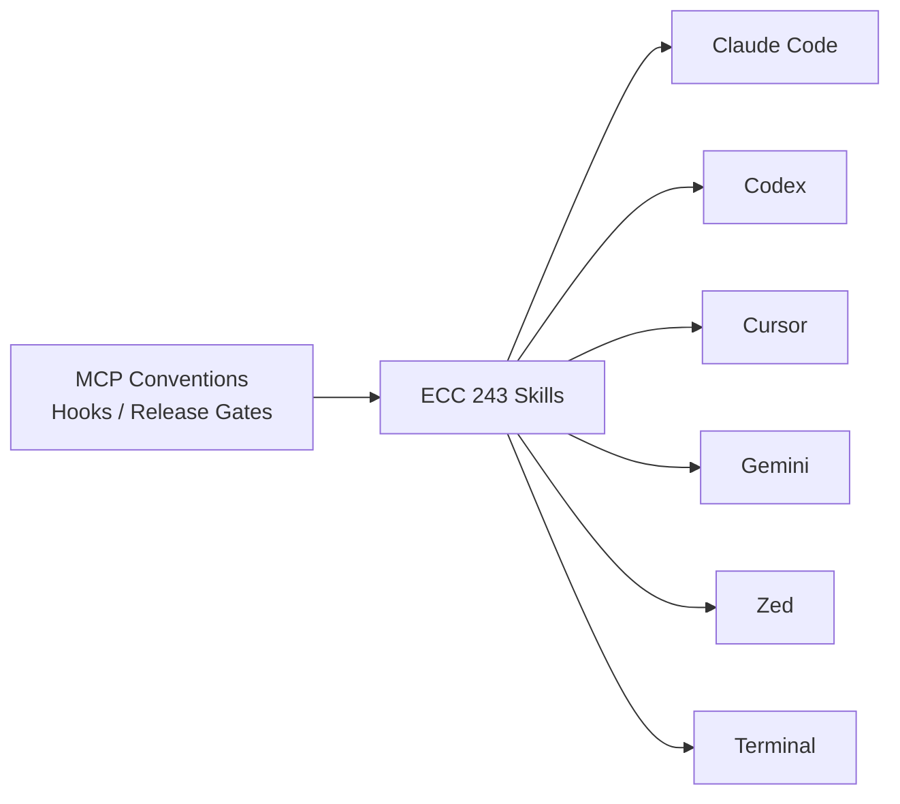
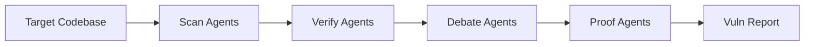

# AI Daily Digest — 2026-05-26

<!-- pipeline-generated:begin -->

## 🔥 今日 TOP 3
### 1. ECC 2.0.0：代理技能升為跨六大 IDE 可攜統一層
ECC 2.0.0-rc.1 首次將技能包平台從 Claude Code 專用工具擴展為統一基礎設施層，支援 Codex、OpenCode、Cursor、Gemini、Zed 及終端工作流共六大環境，含 243 項公開技能與 5 項新代理優化技能包（平行執行優化、基準迴圈、資料吞吐加速、延遲關鍵系統分析、遞迴決策帳冊），通過 2568 項測試與供應鏈密鑰檢查全數驗證。

此前各 IDE 各自維護碎片化提示工程與本地習慣，開發者在工具切換時無法延續技能投資。ECC 統一 MCP 慣例、Hooks 與含簽署驗證的釋出把關後，單次技能設計可在全平台復用，終止重複維護成本與平台鎖定——這是代理工作流從工具綁定走向可攜基礎設施的關鍵里程碑。

實務上，開發者應評估現有 Claude Code 技能是否符合 ECC 跨平台規範，優先遷移高頻工作流程技能。重點關注 parallel-execution-optimizer 與 latency-critical-systems 兩項技能包能否直接套用於現有多代理任務場景。

📖 [閱讀完整 insight](../10-insights/2026-05-25/inbox_24f07bbb.md) · 🔗 [原文連結](https://github.com/affaan-m/ECC/releases/tag/v2.0.0-rc.1)
### 2. 微軟 MDASH：百餘專化代理協作實現無人漏洞審計
微軟發布 MDASH（多模型代理安全平台），整合 100+ 個高度專化 AI 代理，對 Windows 及微軟軟體生態代碼庫執行全自動安全審計，系統以掃描→驗證→辯論→證明四個協作階段推進漏洞發現流程，每個代理專注特定安全檢測類型。

傳統單一通用模型受限於上下文窗口與領域深度，難以同時兼顧廣度掃描與深度驗證，容易遺漏需跨多元件上下文的複雜漏洞鏈。辯論機制強制交叉驗證的設計，代表企業級安全審計從工具輔助進化為代理主導的自動化流程，對任何維護大型代碼庫的組織均有直接參考價值。

後續觀察重點：MDASH 相對傳統 SAST 工具的漏洞發現率差距，以及假陽性率控制成效。企業可參照「掃描→驗證→辯論」三段架構，設計自有關鍵代碼庫的多代理安全審查流程。

📖 [閱讀完整 insight](../10-insights/2026-05-23/inbox_d8a9e2bb.md) · 🔗 [原文連結](https://github.com/rtk-ai/rtk/releases/tag/v0.41.0)
### 3. AWS Agent Toolkit 開源：32 分鐘完成完整雲端基礎設施供應
AWS 發布開源 Agent Toolkit，透過 MCP 伺服器暴露 15,000+ AWS API 調用，分三外掛架構（aws-core 通用開發、aws-agents Bedrock 工作流、aws-data-analytics 資料分析），相容 Claude Code、Cursor、Codex、Kiro、VS Code、Windsurf 六大 IDE。實測展示代理在 32 分鐘內自主完成 VPC、安全群組、RDS 資料庫、IAM 角色、Glue ETL 與 Athena 目錄的完整棧供應，並附 CloudWatch/CloudTrail 原生審計閉環。

相對於撰寫 CloudFormation 或 Terraform，代理可在即時查閱 AWS 文件的同時自主決策（主動檢查既有資源、規避服務特定陷阱），將基礎設施意圖表達從 DSL 轉向自然語言代理指令。IAM 上下文條件金鑰與沙盒指令碼執行作為安全護欄，確保代理操作在最小權限範圍內執行。對比 ECC 的跨 IDE 技能層，此工具組補完了「雲端基礎設施側」的代理自動化缺口。

後續觀察重點在 IAM 最小權限設計成熟度與多帳號環境可靠性。實務建議先於非生產環境驗證快速原型供應場景，再逐步推廣至生產基礎設施自動化。

📖 [閱讀完整 insight](../10-insights/2026-05-25/inbox_c2a21aab.md) · 🔗 [原文連結](https://towardsdatascience.com/introducing-the-agent-toolkit-for-amazon-web-services/)

## 📖 好文章 / 影片精選

_過去 30 天經 traffic 沉澱的高品質內容，按興趣領域分類。每篇只在 column 出現一次。_
### 🛠 工具版本追蹤 / Release
- **claude-code** · **[v2.1.152](../10-insights/2026-05-27/inbox_abef9525.md)**
  Claude Code v2.1.152 發布，引入 /code-review --fix 命令可將審查建議直接應用到工作樹，支持識別代碼重用、簡化與效率機會。Skills 系統新增 disallowed-tools 前置詞移除特定工具；SessionStart hooks 可啟動 skill 目錄重新掃描（reloadSkills: true）及設定會話標
- **ruflo** · **[v3.10.2 — #2132 Windows plugin hooks fix](../10-insights/2026-05-25/inbox_084f12b6.md)**
  RuFlo v3.10.2 修復 Windows 原生 plugin hooks，無需 WSL 或 Git Bash。開發者 @marioja 詳細記錄問題：plugin hooks.json 中使用 /bin/bash -c、POSIX-only pipeline（jq、xargs -0、tr），以及在原生 Windows 上以 exit 126（「can
  _+ 2 個近期版本（v3.10.0 → v3.9.0，僅顯示最新）_
- **rtk** · **[latest](../10-insights/2026-05-24/inbox_3cd5c12c.md)**
  RTK 最新穩定版本標籤標記為 v0.42.0，作為官方推薦的當前穩定版本供用戶下載。此為版本管理機制的標籤記錄，無獨立功能變更或新增內容。
  _+ 2 個近期版本（v0.42.0 → v0.41.0，僅顯示最新）_
- **claude-mem** · **[v13.3.0](../10-insights/2026-05-21/inbox_5d6565dd.md)**
  claude-mem v13.3.0 發佈 3 個新 skill 擴展代理能力。design-is (#2483) 針對 Dieter Rams 的 10 項「Good design is...」原則審計設計，產出 0-3 分/原則與 NEW/REFINE/REDESIGN 判決。weekly-digests (#2399) 產生全專案 claude-mem
### 📚 AI 知識管理
- **reddit-claudeai** · **[Made an interactive Claude + Obsidian setup guide (for beginners)](../10-insights/2026-05-07/inbox_a85c286c.md)**
  非技術背景使用者分享自製的 Claude Code + Obsidian 互動設置指南(免費、初心者友善)。核心效益：(1) 日常與週次工作流程(via skills & commands)；(2) AI 可直接取得背景資訊、減少前置作業；(3) 大規模處理研究、通話紀錄、數據；(4) AI 自動浮現使用者未察覺的工作連結。關鍵洞察：一週持續使用即能改變 A
- **medium-tag-ai** · **[When Structure Isn’t Enough: The Real Cost of Pretty Documents](../10-insights/2026-05-09/inbox_107be26c.md)**
  文章探討 AI pipeline 設計中的隱藏困境：過度強調文檔的視覺呈現與結構化形式，反而削弱了機器可讀性與自動化處理能力。作者論證單純依賴 metadata 或額外的結構層無法解決這個矛盾，關鍵在於從一開始就平衡『人類可讀』與『機器可讀』兩個目標。這對任何依賴非結構化文本作為輸入的 AI 系統（如 RAG、文檔分類、內容萃取）都有直接的實踐意義。
- **medium-tag-llm** · **[5 Core AI Concepts That Will Change How You Think](../10-insights/2026-05-08/inbox_2f8c5721.md)**
  介紹 5 個基礎 AI 概念：（1）Token 是 AI 處理的基本單位，控制定價和記憶容量；（2）Context Window 是 AI 一次能見到的資訊上限，超過後遺忘；（3）Temperature 參數調控輸出隨機性，低溫度精準穩定，高溫度更創意但不可預測；（4）Hallucination 是 AI 自信編造答案的特性，需使用者驗證；（5）RAG（檢索
- **reddit-localllama** · **[(Rant ;)) Make your benchmarks realistic](../10-insights/2026-05-08/inbox_b913268c.md)**
  作者批評本地 LLM 優化基準多只測試峰值 token 吞吐量，忽視實際工作場景。提議改進：(1) 用較長上下文（262K+）與長會話進行端到端基準測試，模擬 agentic/coding/RAG 工作流；(2) 多模態模型須測試實際影像處理；(3) 明確硬件配置與芯片型號差異；(4) 納入並行處理測試（agentic 工作關鍵）。
- **medium-towards-data-science** · **[The Must-Know Topics for an LLM Engineer](../10-insights/2026-05-09/inbox_e35a083d.md)**
  一份教育指南，系統梳理現代 LLM 工程師需要掌握的核心知識領域。從 tokenisation（分詞）、embedding、attention 機制，到 fine-tuning、evaluation 等，涵蓋了模型從訓練到生產部署的完整技術棧。文章幫助從業者建立知識框架，理解語言模型在實踐中如何運作及其各環節的重要性。
### 🏢 企業導入 AI / 團隊實踐
- **simon-willison** · **[I think Anthropic and OpenAI have found product-market fit](../10-insights/2026-05-27/inbox_66077cd6.md)**
  Simon Willison 發表深度分析認為 Anthropic 和 OpenAI 已在編碼代理領域達成產品市場適配（product-market fit），理由是企業客戶現已支付 API 級別的定價而非昔日的優惠企業方案。Anthropic 於 2025 年 11 月、OpenAI 於 2026 年 4 月改變定價模式，從無限使用改為 $20/座位/月 
- **youtube-lenny's-podcast** · **[AI era skills: Why cultivating agency matters more than job titles | Max Schoening (Notion)](../10-insights/2026-05-02/inbox_791c1d4c.md)**
  Max Schoening（Notion 設計領導）深入探討 AI 時代職涯轉變：首先，Agency 比職稱更重要（與前一影片呼應）。其次，當代最稀缺資產是「Taste」（品味），定義為「在腦中運行虛擬機、預測特定用戶族群對某想法的偏好」，需透過反覆練習（如訓練模型）來培養。第三，AI 降低了創業進入門檻：「第一版本的成本現在接近零」。最後論證偉大產品的關鍵
- **infoq-ai-ml** · **[Presentation: Powering the Future: Building Your GenAI Infrastructure Stack](../10-insights/2026-05-19/inbox_beac0a0a.md)**
  Intuit 分享 GenAI 轉型架構藍圖，提出「fixed, flexible, free」框架用於跨 8000 開發者規模化 GenOS，支援 3500+ 生產實驗。重點討論 agent 失敗模式、「LLM-as-a-judge」評估策略、「tool-ready」API 設計原則。框架和策略為企業大規模部署 GenAI 基礎設施、管理 agent 實驗
- **medium-tag-claude** · **[The 40-Minute Shortcut That’s Changing How Companies Hire](../10-insights/2026-04-29/inbox_340d889e.md)**
  人力資源案例研究：某 200 人 B2B SaaS 公司 HR 主管使用 Claude 批量篩選 487 份簡歷，從原本的 60 小時（2 週）縮減至 40 分鐘，效率提升 68%。關鍵成功因素：(1) Claude Opus 的 100,000 token 上下文窗口能一次評估 80–100 份完整簡歷；(2) 標準化資料格式與明確的篩選框架；(3) 使用
- **infoq-main** · **[Presentation: AI Native Engineering](../10-insights/2026-05-22/inbox_c29c2401.md)**
  Meta Reality Labs 工程師 Ian Thomas 分享「Assess and Grow」成熟度模型，用於引導團隊從手工勞務轉向 AI 整合開發。實際案例：90% 代碼覆蓋率創紀錄達成。同時解決業界痛點——代碼品質顧慮（「code slop」）、審查疲勞、品質維護。此框架為企業內 AI-native 工程的漸進式採納提供參考。
### 🎓 AI 使用技巧 / 心法
- **medium-tag-llm** · **[Multi-Agent Orchestration in Claude Code: The Architecture and Economics of Subagents](../10-insights/2026-05-26/inbox_a645d43a.md)**
  Claude Code 多代理編排的核心洞察：單代理模式因上下文窗口有限而遇到天花板，無法高效處理大型代碼庫（如讀取數百個源文件會耗盡上下文空間）。多代理模式不是為了更聰明，而是為了不同的資源分配——通過分散工作到專門代理，避免單一模型浪費上下文處理不適合的任務。此架構實現並行工作流、維護任務間資訊隔離、高效處理超大代碼庫。經濟學意義在於用分佈式策略替代垂直
- **infoq-main** · **[Presentation: Designing AI Platforms for Reliability: Tools for Certainty, Agents for Discovery](../10-insights/2026-05-27/inbox_54a184c5.md)**
  Aaron Erickson 在演講中提出 AI 平台可靠性的新設計框架。核心理念為「Tools for Certainty, Agents for Discovery」：用確定性工具保證業務約束與可預測性，用 agent 探索處理開放式推理。框架涵蓋 agent 階層優化、時序基礎模型應用、多層評估金字塔等實踐方法，旨在從「氛圍感受」演進到嚴格的多 age
- **medium-tag-ai** · **[AI Models Get the Attention — But Tools Decide What They Can Actually Do](../10-insights/2026-04-27/inbox_7931fc18.md)**
  AI 系統的實際價值在於工具整合能力而非模型本身；缺乏工具的 AI 系統只能被動生成文本，無法執行結構化任務。工具使用面臨實際難題：多選項時選擇困難、API 返回不一致數據、小錯誤在多步驟流程中複合放大（「小錯誤導致誤解導致決策失誤」）。區分聊天機器人與實際執行系統的關鍵在於可靠的工具整合與結構化使用，單純智能不足以完成現實任務。
- **reddit-localllama** · **[Qwen 3.6 wins the benchmarks, but Gemma 4 wins reality. 7 things I learned testing 27B/31B Vision models locally (vLLM / FP8) side by side. Benchmaxing seems real.](../10-insights/2026-05-02/inbox_82cf47ce.md)**
  資深玩家針對 Qwen3.6-27B 與 Gemma4-31B 視覺語言模型進行長期並行本地測試（vLLM FP8），揭示官方基準測試與實務使用存在重大落差。儘管基準榜單 Qwen 領先，實務中 Gemma 4 在多數視覺任務、穩定性、指令遵循方面勝出。Qwen 傾向高 token 消耗與長推理循環（8000+ tokens on obscure tasks
- **substack-product-growth** · **[How to Run Evals in Claude Code with Aparna Dhinakaran, Founder and CPO of Arize](../10-insights/2026-05-22/inbox_c63c8481.md)**
  Aparna Dhinakaran（Arize CPO/創始人）演示如何在 Claude Code 中快速建立 LLM agent 評估。核心 3 步流程：(1) 安裝 Arize Skills (`npx skills add Arize-ai/arize-skills`)；(2) 用自然語言請求 eval 建議，Claude 分析 traces 並提議如
### 💳 支付 / Fintech
- **infoq-ai-ml** · **[Cloudflare and Stripe Let AI Agents Create Accounts, Buy Domains, and Deploy to Production](../10-insights/2026-05-18/inbox_fbed9a89.md)**
  Cloudflare 和 Stripe 聯合推出協議，首度允許 AI agents 完全自主執行雲帳號建立、域名註冊、訂閱啟動和生產部署等操作流程。Stripe 負責身份驗證和支付管制，預設月度支出上限為 $100、可按需調整。相比之下，AWS、Google Cloud、Azure 等主流雲服務商目前尚無可比擬的 agent 級帳號配置和自主部署能力。這一協
### 🔐 AI 安全 / 濫用
- **medium-tag-llm** · **[How AI Is Manipulated. Here’s How Hackers Break, Poison, and Deceive LLMs](../10-insights/2026-05-26/inbox_733a2a48.md)**
  LLM 攻擊分三層：運行時（越獄）、訓練時（資料投毒）、基礎設施。越獄包括角色扮演（微軟 Skeleton Key 攻擊）、漸進式升級（70% 成功率於多輪對話）、大樣本越獄、H-CoT 攻擊（98% 降至 2%）。投毒包括隱密代理（Anthropic 實驗年份觸發後門）、250 個惡意文檔足以毒害十億參數模型、2% 訓練資料投毒充分。防禦採分層策略：Con
### 🛤️ AI Flow 導入心得 / 技術分享
- **medium-tag-claude** · **[Why Claude Costs Keep Rising in Agent Workflows (and How I Stopped the Hidden Token Leaks)](../10-insights/2026-05-21/inbox_ffcbd828.md)**
  Claude agent workflows 成本暴漲的隱藏源頭：非模型定價本身，而是重複調用（duplicate calls）、context 膨脹（context bloat）、retry 風暴（retry storms）三層耗損。作者分享識別與堵止這些隱漏的優化策略，直接降低 agent 生產成本。
- **medium-towards-data-science** · **[Prompt Engineering Isn’t Enough — I Built a Control Layer That Works in Production](../10-insights/2026-05-21/inbox_293e2047.md)**
  LLM 在生產環境中的失敗多為可預測的系統級問題（破損 JSON、無聲失敗、服務中斷），單純調整提示工程無法根本解決。作者通過在模型上層構建「控制層」進行結構驗證與管理，無需改動任何提示詞，即將結構化輸出的可靠性從 0% 提升至 100%。此方案凸顯生產環境中：系統層級的控制機制比微調提示更能保證 LLM 應用的穩定性與可靠性。
- **latent-space** · **[Railway: The Agent-Native Cloud — Jake Cooper](../10-insights/2026-05-20/inbox_4993d028.md)**
  Railway 雲端平台公開運營數據：300 萬使用者、每週 100K 新增註冊、自有機房、coding agent 週支出達 $200K+（月 $800K+）。平台正式推出「Agent-Native Cloud」架構，將 AI coding agent 從開發工具升級為平台一級服務對象和基礎設施。傳統 PR-based 開發流程逐漸被 agent 驅動的自
- **medium-tag-claude** · **[Inside Systems 02: AI Changed Where Work Starts](../10-insights/2026-05-21/inbox_56161ff1.md)**
  AI 改變了專業工作的起點。過去工作流程是「決定 → 打開工具」，現在變成「打開 AI 提示框 → 處理不確定性 → 決定方向 → 才開始正式工作」。作者觀察到同一工具卻有兩種用法：1) 卡住時才用 AI（流程未變）2) 開始前主動用 AI 測試想法（結果向前移動）。兩群體產出相同形式文件，但後者已經內化了前置探索，起點向前跳躍。關鍵洞察：AI 改變的不只是
- **infoq-main** · **[How Slack Manages Context in Long-running Multi-agent Systems](../10-insights/2026-04-28/inbox_97e445d7.md)**
  Slack 工程團隊分享長期多智能系統的上下文管理經驗。傳統做法是累積聊天日誌，但導致系統連貫性下降、準確度低，尤其在長期運行時。新方法轉向三層結構化策略：首先用結構化記憶（structured memory）取代日誌積累，其次引入驗證機制（validation）確保內容正確性，第三層是精煉真相（distilled truth）萃取關鍵信息。這個方法對維持長

## 💡 今日 Takeaway

_讀完今日所有內容後，可帶走的知識點_
### 1. 依任務複雜度選 CoT / ToT / GoT，避免 token 浪費或品質不足
零樣本適合快速低成本任務；CoT 透過強制中間推理步驟在多步邏輯與算術中大幅提升準確度；ToT 並行評估多解路徑適合工作流編排與 CI 修復等有多個有效解的場景；GoT 將推理表示為互聯節點，支援跨節點聚合，適合多司法管轄合規與微服務架構合成等組合優化問題。實務決策框架：先問「任務是否有多個有效解路徑？」——有則 ToT；再問「子解是否需互相引用聚合？」——有則 GoT；否則 CoT 已足夠，且 token 成本遠低於 ToT/GoT。

_類型：framework_

**參考來源**：
- [The 5 Prompting Techniques Separating Senior AI Engineers from Everyone Else](../10-insights/2026-05-25/inbox_521d99b2.md) · [原文](https://indianakv.medium.com/the-5-prompting-techniques-separating-senior-ai-engineers-from-everyone-else-c114695ad317?source=rss------large_language_models-5)
### 2. 推測解碼 + 多 token 預測可無損品質達成 3× 推理加速
推測解碼允許模型並行生成多候選 token 並在單次前向傳播中批量驗證，打破傳統自迴歸解碼的序列延遲瓶頸，充分利用現代硬體並行能力。Gemma 4 實測在無品質損失條件下達成約 3 倍加速，對 API 吞吐、延遲與每 token 成本均帶來直接正面影響。選型推理引擎或規劃推論預算時，應將 speculative decoding 支援列為優先考量，同等精度下可在不調整模型的情況下顯著降低服務成本。

_類型：technique_

**參考來源**：
- [Gemma 4 Multi-Token Prediction Delivers Up to ~3x Faster Token Generation](../10-insights/2026-05-25/inbox_217428ec.md) · [原文](https://www.infoq.com/news/2026/05/gemma4-multi-token-prediction/?utm_campaign=infoq_content&utm_source=infoq&utm_medium=feed&utm_term=global)
### 3. 複雜偵測任務中，百餘專化代理協作優於單一通用模型
單一通用模型受限於上下文窗口與領域深度，難以同時兼顧廣度掃描與深度驗證，容易遺漏需跨多元件上下文的複雜問題。MDASH 以掃描→驗證→辯論→證明四階段分工，每代理專注特定檢測類型，辯論機制強制交叉驗證，能發現複雜漏洞鏈。設計處理長尾複雜任務的 agent 系統時，應優先考慮「分工專化 + 協作驗證」架構，而非追求單代理萬能設計。

_類型：pattern_

**參考來源**：
- [Microsoft Introduces MDASH for Large-Scale AI Vulnerability Research](../10-insights/2026-05-25/inbox_09949dff.md) · [原文](https://www.infoq.com/news/2026/05/microsoft-mdash/?utm_campaign=infoq_content&utm_source=infoq&utm_medium=feed&utm_term=global)
- [v0.41.0](../10-insights/2026-05-23/inbox_d8a9e2bb.md) · [原文](https://github.com/rtk-ai/rtk/releases/tag/v0.41.0)
### 4. AI 編碼最大生產力槓桿已從代碼生成轉向工程流程監督
早期 AI 編碼工具以單行/函數補全為差異點，agent 時代的真正槓桿在端到端工程流程自動化（需求→測試→部署）。「能生成代碼」已是基線而非優勢，差異點轉向代理能否自主管理工程決策、跨工具整合與品質把關。工程師應相應轉型，以提示工程、系統設計與品質監督為核心技能，並評估現有工作流中哪些決策節點可交由代理自主執行。

_類型：pattern_

**參考來源**：
- [AI coding is shifting from autocomplete &gt; autonomous engineering workflows.](../10-insights/2026-05-25/inbox_9c09f686.md) · [原文](https://medium.com/@moksh.9/ai-coding-is-shifting-from-autocomplete-autonomous-engineering-workflows-ad7c050bd3d0?source=rss------large_language_models-5)
### 5. 可重複代理行為應設計為跨平台可攜技能，而非本地習慣依賴
碎片化的本地提示習慣在工具切換時無法延續，造成重複維護成本並鎖定特定 IDE。ECC 驗證：將代理行為統一為標準化 MCP 慣例 + Hooks + 釋出把關後，243 項技能可在六大環境直接共享，技能投資得以跨工具遷移複用。設計新代理工作流時應先問「這個行為能否抽象為跨工具可攜的 skill？」——若能，優先標準化而非一次性實現。

_類型：framework_

**參考來源**：
- [v2.0.0-rc.1](../10-insights/2026-05-25/inbox_24f07bbb.md) · [原文](https://github.com/affaan-m/ECC/releases/tag/v2.0.0-rc.1)
## ⏳ 待處理 (6 筆)

<!-- pipeline-generated:end -->

<!-- user-notes -->
<!-- Write your own notes below; pipeline never touches this section. -->