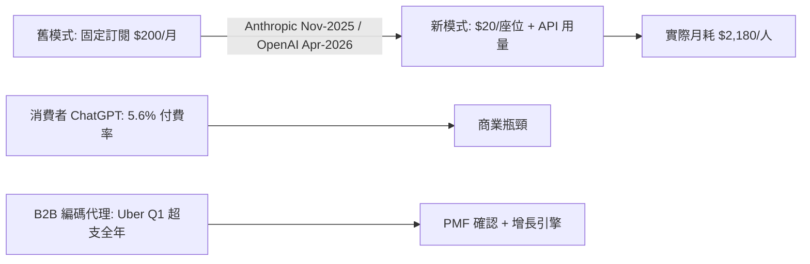
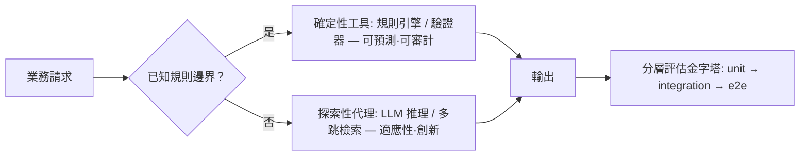

# AI Daily Digest — 2026-05-27

<!-- pipeline-generated:begin -->

## 🔥 今日 TOP 3
### 1. 企業編碼代理 PMF 確認：月耗 $2,180 成新基準
Anthropic 自 2025 年 11 月、OpenAI 自 2026 年 4 月，將旗艦編碼代理從固定訂閱制改為每座位 $20/月加 API 用量計費。新一代模型同步漲價——GPT-5.5 比 5.4 貴 2 倍，Opus 4.7 含新 tokenizer 後比 4.6 貴約 1.4 倍。分析師 Simon Willison 個人月耗達 $2,180（Claude Code $1,199 + Codex $980），而訂閱只需 $200，差距極為懸殊。

這是明確的 PMF 訊號：企業客戶願意按 API 用量付費，代表編碼代理的日常工作價值已被市場定錨。相較 ChatGPT 消費者模式 9 億週活中僅 5.6% 付費的困境，Uber 等企業第一季即用完全年預算，說明 B2B 編碼代理才是真正的收入引擎。OpenAI 703 個職位中 229 個（32.6%）、Anthropic 390 個中 105 個（26.9%）為企業銷售，進一步驗證雙方以 B2B 代理為核心增長引擎。

工程主管的 2026 年預算規劃必須納入 token inflation factor——新 tokenizer 可讓相同工作負載在表訂價格不變下隱性上漲 40%，重演 Uber 式超支的風險真實存在。觀察重點為兩家公司的企業合同均值與 ARR 指引，以及更多行業案例是否揭露月人均 AI 支出突破 $200 基準線。

📖 [閱讀完整 insight](../10-insights/2026-05-27/inbox_66077cd6.md) · 🔗 [原文連結](https://simonwillison.net/2026/May/27/product-market-fit/#atom-everything)
### 2. 多代理非更聰明：上下文資源分散優於垂直擴展
Claude Code 多代理編排的核心洞察：單代理因上下文窗口有限，讀取數百個源文件後便耗盡可用空間，後續推理品質急劇下降。多代理架構透過將工作分散至專門代理，讓每個代理只在其任務邊界內消耗上下文，同時實現並行工作流與跨任務資訊隔離。

多代理的核心優勢不在集合智能更高，而在資源分配更優——是分佈式策略取代垂直擴展的典型案例。單代理勉強讀完大量文件後，剩餘上下文不足以進行複雜推理；多代理讓每個子任務在乾淨上下文中執行，維持一致推理品質。這將工程決策從「升級更大模型」轉向「設計更好的任務分解」，對需要處理大型代碼庫的工程團隊尤為關鍵。

實作多代理系統的關鍵決策是任務分解粒度——每個子任務的上下文需求應遠低於窗口上限，且需定義清晰的輸入輸出格式供代理間傳遞。建議追蹤 Claude Code Agents SDK 的最新文件，觀察任務隔離邊界與狀態同步機制的具體實作，作為大型代碼庫自動化重構的設計依據。

📖 [閱讀完整 insight](../10-insights/2026-05-26/inbox_a645d43a.md) · 🔗 [原文連結](https://medium.com/neuralnotions/multi-agent-orchestration-in-claude-code-the-architecture-and-economics-of-subagents-06d52e69f8b2?source=rss------large_language_models-5)
### 3. 確定性工具＋探索性代理：生產 AI 可靠性設計框架
Aaron Erickson 在演講中提出「Tools for Certainty, Agents for Discovery」框架：確定性工具（規則引擎、驗證器）保障業務邊界與可預測性，LLM 驅動的代理專責開放式推理與探索性任務。框架還涵蓋代理層次結構優化、時序基礎模型應用、分層評估金字塔（unit → integration → end-to-end），旨在讓生產 AI 系統從「直感決策」演進為嚴格的工程設計。

此框架正面解決「可靠性 vs 靈活性」的核心張力：純代理系統邊界行為難以預測，純規則系統無法應對開放問題。二元設計讓工具處理已知場景、代理探索未知邊界，在合規約束下保留 LLM 推理彈性。相較同類框架，此方法更強調「系統設計嚴謹性」而非模型能力本身，對金融、醫療等受監管行業尤為適用。

導入框架的第一步是業務決策盤點：識別哪些決策有明確規則（適合工具）、哪些需上下文推理（適合代理）。建議同步規劃分層評估體系確保各層行為符合預期，並關注 Erickson 演講錄影及 Thoughtworks 後續技術出版物，取得代理層次優化的具體實作案例。

📖 [閱讀完整 insight](../10-insights/2026-05-27/inbox_54a184c5.md) · 🔗 [原文連結](https://www.infoq.com/presentations/ai-platforms-reliability/?utm_campaign=infoq_content&utm_source=infoq&utm_medium=feed&utm_term=global)

## 📖 好文章 / 影片精選

_過去 30 天經 traffic 沉澱的高品質內容，按興趣領域分類。每篇只在 column 出現一次。_
### 🛠 工具版本追蹤 / Release
- **claude-code** · **[v2.1.152](../10-insights/2026-05-27/inbox_abef9525.md)**
  Claude Code v2.1.152 發布，引入 /code-review --fix 命令可將審查建議直接應用到工作樹，支持識別代碼重用、簡化與效率機會。Skills 系統新增 disallowed-tools 前置詞移除特定工具；SessionStart hooks 可啟動 skill 目錄重新掃描（reloadSkills: true）及設定會話標
### 📚 AI 知識管理
- **medium-towards-data-science** · **[RAG Is Blind to Time — I Built a Temporal Layer to Fix It in Production](../10-insights/2026-05-09/inbox_25b01322.md)**
  一個生產環境的 RAG 系統缺陷及其解決方案。作者發現標準 RAG 系統無時間概念，總是檢索「最相似」的文檔，而非「最新」的文檔。在知識庫頻繁更新的場景（如 AI 家教系統），導致系統提供過時答案。解決方案是在 retriever 與語言模型間插入「temporal layer」（時間層），過濾已過期的事實、提升時間敏感信號、優先選擇仍有效的知識。三週測試驗
- **medium-tag-llm** · **[How to Get Relevant Chunks for Recall@k and Precision@k in RAG](../10-insights/2026-05-10/inbox_3b366ec5.md)**
  評估與改進 RAG 檢索品質的關鍵在於定義「相關性」與採用混合標註策略。核心指標為 Recall@k（頂k結果中有多少相關chunk）與 Precision@k（頂k中實際相關的比例）。文章提出二層方法：(1) Manual labeling 建立ground truth，限於50-100查詢規模；(2) Hybrid方案用人工標籤seed dataset訓
- **medium-tag-llm** · **[The Hidden Database Architecture Behind Every AI and LLM System](../10-insights/2026-05-10/inbox_1530fa6c.md)**
  現代 AI 應用採用 polyglot persistence（多數據庫搭配）而非單一系統。包括：SQL 資料庫（PostgreSQL/MySQL）存business邏輯與payment；NoSQL（MongoDB/Firestore）處理chat history等半結構化數據避免impedance mismatch；Vector DB（Pinecone/W
- **medium-towards-data-science** · **[Hybrid Search and Re-Ranking in Production RAG](../10-insights/2026-05-12/inbox_78148acf.md)**
  生產環境 RAG 系統中，密集向量檢索（semantic search）單獨使用會失效，需與 BM25 混合搜尋和 cross-encoder 重排。真實案例：內部知識助手回答消息隊列重試策略時，返回了語義相近（「exponential backoff」vs「dead-letter queue threshold」）但無關的三段落，所需文檔排在第 11 位被
- **medium-towards-data-science** · **[Proxy-Pointer Framework for Structure-Aware Enterprise Document Intelligence](../10-insights/2026-05-12/inbox_68a76502.md)**
  Proxy-Pointer 框架針對企業文檔比較（合約、研究論文、政策等）中的結構感知檢索難題。文檔語義往往散落於多個層級、條款分組和頁跨越區域，傳統向量檢索無法捕捉，如信用協議的擔保限制定義於一個部分、例外條款數頁後、執行權另在不同條款中。Proxy-Pointer 通過層次麵包屑嵌入和輕量級 LLM 重排器，在保留文檔層級結構的前提下精確提取語義對應的散
### 🏢 企業導入 AI / 團隊實踐
- **infoq-ai-ml** · **[Presentation: AI Native Engineering](../10-insights/2026-05-22/inbox_2910966a.md)**
  Meta Reality Labs 工程師分享「Assess and Grow」成熟度模型，引導團隊從手動勞動向 AI 集成創新轉變。框架幫助團隊實現 90% 代碼覆蓋率創紀錄速度，同時應對 AI 工程實務挑戰：代碼品質疑慮、Code Review 疲勞、質量維護。模型提供系統化的 AI 工程轉型路徑。
- **infoq-ai-ml** · **[Presentation: Leadership in AI-Assisted Engineering](../10-insights/2026-05-08/inbox_ced2d52e.md)**
  Justin Reock 的演講分析了 AI 對工程的真實影響，基於 DORA 和 DX 研究的硬數據而非軼事。核心觀點包括「GenAI Divide」現象——95% 的 AI 試點失敗，以及領導者如何使用 SPACE 和 Core 4 框架來衡量真實 ROI、平衡速度與品質、減少開發者恐懼，並在整個軟體開發生命週期（SDLC）中應用 agentic 解決方
- **infoq-ai-ml** · **[Presentation: Using AI as a Thinking Partner for Large-Scale Engineering Systems](../10-insights/2026-05-15/inbox_44342da2.md)**
  InfoQ 演讲中，Julie Qiu 讨论 AI 如何充当工程领导者的「思维伙伴」。她提出五个角色框架来管理超过 400 个代码仓库的认知负荷：考古学家（理解遗留系统上下文）、实验者（快速尝试方案）、评论家（压力测试设计）、作者（生成内容）、审阅者（质量把控）。AI 提供扩展的「RAM」能力，让领导者更快地综合遗留上下文、压力测试架构设计，加速高层次架构决
- **infoq-main** · **[Presentation: Designing AI Platforms for Reliability: Tools for Certainty, Agents for Discovery](../10-insights/2026-05-27/inbox_54a184c5.md)**
  Aaron Erickson 在演講中提出 AI 平台可靠性的新設計框架。核心理念為「Tools for Certainty, Agents for Discovery」：用確定性工具保證業務約束與可預測性，用 agent 探索處理開放式推理。框架涵蓋 agent 階層優化、時序基礎模型應用、多層評估金字塔等實踐方法，旨在從「氛圍感受」演進到嚴格的多 age
### 🎓 AI 使用技巧 / 心法
- **medium-tag-claude** · **[Why Claude Keeps Ignoring Your Instructions (and the 4-Line Fix)](../10-insights/2026-05-06/inbox_fc1df311.md)**
  Daniel Valev 發現大型 CLAUDE.md 文件降低 Claude 的指令依從性，因為模型有「可靠追蹤指令的上限」。他建議將文件限制在 200 行以內，只保留 4 個核心部分：(1) 構建與測試命令，(2) 單一關鍵約束（原因性敘述），(3) Git 工作流規範，(4) 完成定義。刪掉代碼風格規則（交給 linter）、架構文檔（用 @path 
- **reddit-claudeai** · **[I ran the same vague prompt through ChatGPT, Claude, and Gemini 50 times. The \&#34;AI is bad\&#34; complaints are almost all the same mistake.](../10-insights/2026-05-11/inbox_a24c7ea1.md)**
  使用者對 ChatGPT、Claude 和 Gemini 進行對照測試，分別以相同提示各運行 50 次。結果發現 AI 模型間的差異遠小於 prompt 品質本身的影響。當提示模糊時（如「寫求職信」），三個模型皆返回通用答案；但提示若包含背景、目標、語氣和需避免事項，所有模型表現均顯著改善。主要洞察為：使用者對 AI 的大多數不滿源於提示不夠具體，而非 AI
- **medium-tag-llm** · **[Stop Breaking Production: How Catch Agent Failures Before Users Do](../10-insights/2026-05-12/inbox_8bfbac44.md)**
  提出使用 LLM 評判器（LLM judges）來自動檢測 AI agent 的故障，在代碼部署前攔截生產環境 bug。文章介紹三種評判方式：單一評判器（快速但有偏差）、多評判器共識（GPT-4、Claude、Gemini 平均評分以消除各模型的風格偏好）、自評判（反面教材，會產生最大偏差）。進一步分類評估場景：單輪 Q&A、多輪對話（上下文切換）、RAG 
- **reddit-localllama** · **[Evaluated a RAG chatbot and the most expensive model was the worst performer. Notes on what actually moved the needle.](../10-insights/2026-05-15/inbox_4022f86f.md)**
  生產環境客服 RAG 聊天機器人評估揭示五個關鍵洞察，顛覆常見假設。首先，檢索問題偽裝成 LLM 問題：ChromaDB similarity 閾值 0.7 過嚴導致零檢索，無提示工程能修復；監控實際上下文是根本。其次，LLM judge (Claude Haiku 4.5 via OpenRouter) 遠優於啟發式評估，成本數美分/run，得分基於相關性
- **reddit-localllama** · **[Are local models becoming “good enough” faster than expected?](../10-insights/2026-05-07/inbox_f6cff8f1.md)**
  業界觀察：本地模型在許多常見工作流中已足夠可用，使用者正從「哪個單一模型最優」轉向「什麼架構最適合此工作負載」的思考方式。代碼解釋、結構化編輯、摘要、檢索任務、樣板生成、輕量級 Agent 等工作，本地/小型模型已接近競爭力。新興實踐包括：本地模型處理快速重複任務、僅在需要複雜推理時呼叫雲端模型、動態路由模型選擇、以延遲+成本而非單純基準分數優化。此轉變反映
### 💳 支付 / Fintech
- **infoq-ai-ml** · **[Cloudflare Completes Its Agent Infrastructure Stack with Browser Run Rebuild and Six-Layer Platform](../10-insights/2026-05-22/inbox_b4e38897.md)**
  Cloudflare 在自有 Containers 平台上重建 Browser Run，並發能力提升 4 倍，響應延遲降低 50%。完成六層 Agent 基礎設施堆棧：運算層 (Dynamic Workers + Sandboxes)、編排層 (Dynamic Workflows)、記憶層 (Agent Memory)、瀏覽層 (Browser Run)、商
- **medium-tag-llm** · **[The 5 Prompting Techniques Separating Senior AI Engineers from Everyone Else](../10-insights/2026-05-25/inbox_521d99b2.md)**
  文章闡述五種提示技巧在生產環境的應用。零樣本（Zero-Shot）依賴預訓練知識無例子、成本最低但精度基線；少樣本（Few-Shot）提供 2–8 個示例透過文脈學習適合領域特定輸出；思維鏈（CoT）強制中間推理步驟，在多步邏輯和算術中表現大幅提升；思維樹（ToT）並行探索多推理分支、評估和剪枝，適合多解路徑但需成本管理；思維圖（GoT）將推理表示為互聯節點
- **medium-tag-claude** · **[I Beat a Tech Giant’s Legal Team with AI and Saved €3,000 in the Process](../10-insights/2026-05-26/inbox_6fcb4e4c.md)**
  【無法獲取完整內容】作者使用 AI（隱含 Claude）協助處理跨境法律糾紛，最終以低成本方式贏訴。節省 €3,000 的法律服務費用，對比傳統聘請律師的成本優勢明顯。展示 Claude 在法律諮詢與文件分析的實際應用。
- **infoq-main** · **[Presentation: Realtime and Batch Processing of GPU Workloads](../10-insights/2026-05-26/inbox_1296dae6.md)**
  Joseph Stein 分享企業 AI-as-a-Service 平台設計案例，涵蓋多項具體技術決策與架構模式。GPU 資源利用透過 multi-namespace scheduling 共享未充分利用的 GPU 池；優先級隊列採用 Valkey 結合 Lua 實現原子性優先級管理與背壓控制；安全防護透過中央 proxy gateway 應對 OWASP 
- **infoq-main** · **[Google Expands SynthID Adoption for AI Watermarking, Previews Content Detection API](../10-insights/2026-05-26/inbox_4fe8aeac.md)**
  Google 推出 SynthID 內容偵測 API，在 Google Cloud 的 Gemini Enterprise Agent Platform 上預覽。SynthID 透過在 AI 生成內容中嵌入不可察覺的信號，協助識別人工智慧輸出。該技術已獲得 Nvidia 和 OpenAI 等重要業界參與者採用。Google Cloud 客戶現可使用此 API
### 📒 帳務架構 / Ledger
- **openai-blog** · **[Building self-improving tax agents with Codex](../10-insights/2026-05-27/inbox_8005f422.md)**
  OpenAI 與 Thrive、Crete 三方合作，使用 OpenAI Codex 構建自改進稅務代理系統。該系統旨在自動化稅務申報流程、提升申報準確度、加速稅務工作流程處理。此案例展示 Codex 在垂直領域（稅務會計）的應用潛力。原始發布（openai-blog）未提供實作技術細節、自改進機制、或量化效果指標，具體效能提升與系統架構均未公開。
### 🔐 AI 安全 / 濫用
- **infoq-ai-ml** · **[Cloudflare Processes 10M+ Daily Insights with New Security Overview Dashboard](../10-insights/2026-05-04/inbox_18747af5.md)**
  Cloudflare 推出 Security Overview 儀表板，將每日數百萬條安全信號聚合為優先級排序的行動項。該儀表板基於分散檢查器（distributed checkers）和實時事件處理架構構建，幫助安全團隊加速風險識別和修復。透過整合多層安全分析工作流，自動優先級排序，顯著減少調查開銷並提高事件響應效率。
- **medium-tag-claude** · **[Claude Security Enters Public Beta: Automated Vulnerability Scanning and Patching for Enterprise…](../10-insights/2026-05-06/inbox_802c5fb1.md)**
  Anthropic 旗下漏洞掃描工具 Claude Security 進入企業公開測試版（claude.ai/security），提供跨文件分析、數據流追蹤、組件交互檢查，每個發現都標註信心度、嚴重度、重現步驟與建議修補。新增的企業功能包括目錄級掃描、dismissal tracking 用於稽核追蹤、CSV/Markdown 導出、Slack/Jira w
- **infoq-ai-ml** · **[How GitHub Is Securing Agentic Workflows in Modern CI CD Systems](../10-insights/2026-05-08/inbox_3c2c254b.md)**
  GitHub 公開了 CI/CD 管線中 agentic workflows 的防守深度安全架構設計。該架構通過 sandboxed environments（隔離環境）、restricted permissions（限制權限）和 full execution traceability（完整執行追蹤）三重機制，防止 prompt injection、priv
- **openai-blog** · **[Our response to the TanStack npm supply chain attack](../10-insights/2026-05-13/inbox_a99a2014.md)**
  OpenAI 披露對 TanStack 「Mini Shai-Hulud」npm 供應鏈攻擊的回應與防禦措施。攻擊者入侵知名 JavaScript 函式庫，OpenAI 詳述了系統加固與簽章憑證保護方案；重點提醒 macOS 用戶必須在 2026-06-12 前更新 OpenAI 應用以修補潛在風險。文章闡明攻擊手段、受影響範圍與防禦強化方向，強調軟體供應鏈
- **infoq-main** · **[Kubernetes v1.36: Security Defaults Tighten as AI Workload Support Matures](../10-insights/2026-05-14/inbox_021f90b5.md)**
  Kubernetes v1.36 於 2026 年 5 月發布，包含 70 項功能增強，主要聚焦安全性、AI 工作負載支援和 API 可擴展性。使用者命名空間（User Namespaces）、變動準入策略（Mutating Admission Policies）和細粒度 Kubelet API 授權等核心功能正式進入 General Availabilit
### 🛤️ AI Flow 導入心得 / 技術分享
- **reddit-claudeai** · **[My pre-coding routine with Claude Code, 5 MCP servers before I write a single line](../10-insights/2026-05-11/inbox_236f354d.md)**
  开发者公开分享在 Claude Code 中编码前的完整预编码流程，历时 60-90 秒，包含 5 个 MCP 服务器：内存 MCP 维系跨会话的上下文与决策历史、代码图 MCP 构建 repo 调用图并替代盲目 grep、Tavily 搜索当前最佳实践、Context7 加载库的实时文档、hooks 强制读后再编辑。作者核心洞察是重新定义了 Claude 
- **infoq-ai-ml** · **[Presentation: What I Learned Building Multi-Agent Systems From Scratch](../10-insights/2026-05-13/inbox_b679155c.md)**
  Shopify 分享多 agents 系統建構經驗。從簡單聊天工具演進至專門化 agents 群，架構轉變為精簡、窄焦點的 agent 微服務，任務時間從小時級降至分鐘級。提出未來假說：檔案系統適配器可解決 context bloat，為大規模 agent 編排提供參考。
- **reddit-localllama** · **[DeepSeek V4 being 17x cheaper got me to actually measure what I send to cloud vs what I could run locally. the results are stupid.](../10-insights/2026-05-05/inbox_dcda80f1.md)**
  開發者通過測量 10 天的實際編碼工作流發現，65% 的日常任務用本地 Qwen 3.6 27B（3090 GPU）達成 97% 或 88% 的相符率，只有 15% 的工作（架構決策、複雜重構）確實需要雲端模型。具體而言，檔案閱讀和解釋代碼時本地達成 97% 匹配率（35% 工作量），測試編寫達成 88%（30% 工作量），但多檔案除錯時本地只有 61%。採
- **reddit-claudeai** · **[I tested Kimi K2.6 vs Claude Opus 4.7 on a weird game coding task](../10-insights/2026-05-05/inbox_71b53c9b.md)**
  詳細對標測試：Kimi K2.6（廉價中文模型）vs Claude Opus 4.7 在遊戲編碼任務中的性能與成本。測試 1（本地模組）：Opus 花費 $3.59、12 分鐘 API 耗時完成，Kimi 花費 $0.39、9 分 27 秒完成，但代碼冗餘 2 倍且 Minetest 配置有誤；測試 2（Google Sheets 集成）：Opus 成功耗資

## 💡 今日 Takeaway

_讀完今日所有內容後，可帶走的知識點_
### 1. Agent 10 步任務因複合衰減成功率僅剩 59%
多步驟 agent 的整體成功率等於各步可靠度的連乘積——每步 95% 可靠度下，5 步後整體跌至 77%，10 步後僅剩 59%。單輪測試高分無法預測多輪實戰表現，任何一次工具呼叫失敗即可導致整條軌跡崩潰或卡住。評估 agent 系統應採用軌跡級指標（任務完成率、工具失敗率、達成時間），優先提升個別步驟可靠度，而非只優化最終輸出品質；公開基準（GAIA、SWE-bench）可被遊戲化，應以客製化評估為主。

_類型：framework_

**參考來源**：
- [A Practical Guide to Evaluating Multi-Turn Agent Trajectories](../10-insights/2026-05-27/inbox_d828877d.md) · [原文](https://medium.com/google-cloud/a-practical-guide-to-evaluating-multi-turn-agent-trajectories-bc21042dbac8?source=rss------large_language_models-5)
### 2. Agent 中間層工件讓長地平線任務可累積進化
傳統 AI 系統只有訓練時的模型層與預置的系統層，缺乏在任務執行期動態生成、修改、保存工件的能力。三層架構新增的「中間層」（回歸測試、臨時工具、可重用技能）讓 agent 在後續步驟中可利用先前生成的工件，從根本上突破上下文窗口的記憶限制，實現真正的長地平線能力累積。設計長地平線 agent 時，應規劃工件生命週期管理與存儲策略，而非只優化單一對話輪次的回應品質。

_類型：framework_

**參考來源**：
- [The Emerging Middle Layer of Agentic AI](../10-insights/2026-05-26/inbox_2818bbe0.md) · [原文](https://cobusgreyling.medium.com/the-emerging-middle-layer-of-agentic-ai-0d634832336b?source=rss------large_language_models-5)
### 3. 4 層 RAG pipeline 讓準確率從 60% 升至 95%+
多數 RAG 系統失誤源於三個設計缺陷：無定量評估基準、盲目堆砌技術（不知哪個有效）、過度信賴 embedding 而忽視關鍵字搜尋與重排序。完整的 4 層 pipeline（文本分塊策略 → contextual retrieval → hybrid search → reranking）可系統性診斷各層貢獻，典型系統準確率可從 60% 升至 95% 以上。檢索精度瓶頸常在分塊策略與重排序層而非 embedding 品質本身，應對每層單獨 A/B 測試確認改善來源，而非猜測或整體評估。

_類型：framework_

**參考來源**：
- [Stop Trusting the Embedding: How Real RAG Pipelines Actually Work](../10-insights/2026-05-27/inbox_e6b4f7d8.md) · [原文](https://medium.com/@el_mohamad/stop-trusting-the-embedding-how-real-rag-pipelines-actually-work-6d1dd7a9143f?source=rss------large_language_models-5)
### 4. Agent 無審核寫入能力是數據洩露的主要載體
Microsoft Copilot Cowork 漏洞揭示 agent 系統的典型安全盲點：代理被賦予無需用戶確認即可執行寫入操作的能力，攻擊者透過 prompt injection 觸發外部圖片請求或 OneDrive 預認證鏈接洩露，將代理轉化為數據外洩向量。agentic 系統設計應預設讀取模式，僅對具名任務授予寫入能力，並對所有外部連接（URL、附件）強制執行沙盒隔離或用戶意圖確認，避免代理成為內部數據的洩露通道。

_類型：pattern_

**參考來源**：
- [Microsoft Copilot Cowork Exfiltrates Files](../10-insights/2026-05-26/inbox_0f65b03c.md) · [原文](https://simonwillison.net/2026/May/26/copilot-cowork-exfiltrates-files/#atom-everything)
### 5. LLM 90% 置信實際準確率僅 65%——Softmax 校準必需
Softmax 函數的指數放大特性讓微小邏輯差異在輸出層呈現為壓倒性置信，「97% 確定」實為「略勝一籌」。實測中多數系統報告 90% 置信但準確率僅 65%，且模型未被訓練拒答「不知道」，遇分佈外輸入仍產出高置信錯誤。生產部署應加入校準層（temperature scaling、Platt scaling），不可將 softmax 置信分數直接用作決策閾值，並應建立置信度—準確率校準曲線作為模型選型的量化依據。

_類型：pattern_

**參考來源**：
- [The AI Model Confidence Trap](../10-insights/2026-05-26/inbox_26090e41.md) · [原文](https://towardsdatascience.com/the-ai-model-confidence-trap/)

<!-- pipeline-generated:end -->

<!-- user-notes -->
<!-- Write your own notes below; pipeline never touches this section. -->