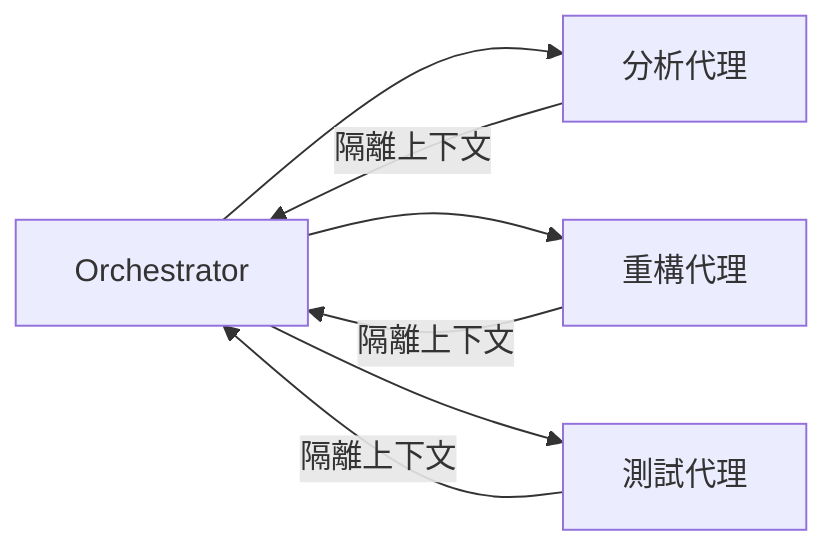
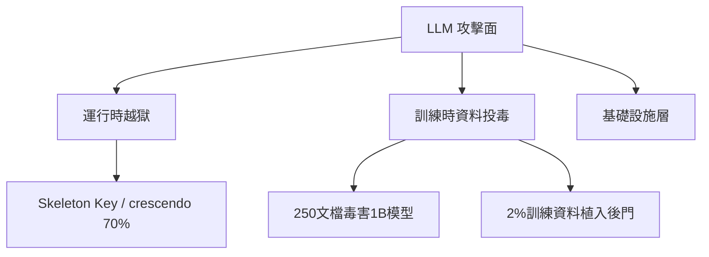

# AI Daily Digest — 2026-05-27

<!-- pipeline-generated:begin -->

## 🔥 今日 TOP 3
### 1. 多代理編排：分佈式策略打破單代理上下文窗口天花板
單代理處理大型代碼庫時面臨上下文天花板——讀取兩百個源文件便可耗盡整個窗口。多代理模式的核心洞察不在模型更聰明，而在資源分配策略的根本改變：分散工作至專門代理，實現並行工作流與任務間資訊隔離。

多代理對大規模 AI 開發工作流影響深遠。相比依賴更大上下文窗口的垂直擴展，分佈式策略在成本與效率上更具優勢——每個代理只消耗必要上下文，避免單一模型在不適合任務上浪費資源。

設計 Claude Code 工作流時，優先評估哪些子任務可並行化、隔離化，而非單純增加上下文長度。大型重構任務可立即拆分為分析、修改、測試三個子代理，直接驗證效率差異。

📖 [閱讀完整 insight](../10-insights/2026-05-26/inbox_a645d43a.md) · 🔗 [原文連結](https://medium.com/neuralnotions/multi-agent-orchestration-in-claude-code-the-architecture-and-economics-of-subagents-06d52e69f8b2?source=rss------large_language_models-5)
### 2. LLM 三層攻擊面：越獄 70% 成功率與 250 文檔毒害十億參數模型
LLM 攻擊面分三層：運行時越獄（Skeleton Key 角色扮演、crescendo 漸進攻擊達 70% 成功率、H-CoT 攻擊）、訓練時資料投毒（250 文檔毒害十億參數模型、2% 訓練資料植入後門）、及基礎設施層。各層需對應不同防禦機制。

此分層揭示 LLM 安全遠比傳統邊界防禦複雜。250 文檔毒害大型模型顯示訓練資料供應鏈是傳統軟體安全的盲區；Anthropic 三層防禦（Constitutional AI + 1400+ 紅隊 + 分類器 0.05% 誤拒率）提供了業界可參考的防禦基準。

部署 LLM 的團隊應建立三層防禦矩陣。短期：評估運行時 crescendo 攻擊暴露面；中期：審計訓練資料供應鏈；長期：建立持續紅隊測試並設定誤拒率基準。

📖 [閱讀完整 insight](../10-insights/2026-05-26/inbox_733a2a48.md) · 🔗 [原文連結](https://medium.com/@shivendukumarbadal328/how-ai-is-manipulated-heres-how-hackers-break-poison-and-deceive-llms-803ce1bc2f44?source=rss------large_language_models-5)
### 3. 代理 AI 三層架構：中間層動態生成工件賦能長地平線任務
代理 AI 系統出現第三層架構：固定的模型層（訓練時確立）與預置的系統層（工具、權限）之外，代理在任務執行中動態生成「中間層」——回歸測試、臨時工具、領域特定語言、可重用技能，這些工件僅存活於任務執行期間。

此架構改變了對 agent 能力邊界的評估方式。傳統兩層設計下 agent 能力受模型固定；中間層讓代理在長任務中積累工具，後續步驟可利用先前生成工件，實現任務內真正的能力進化，使長地平線任務效能大幅提升。

設計 agentic 系統時，應為中間層建立工件的持久化與複用機制——例如將任務中生成的測試與工具保存至可索引的 skill 庫，讓後續任務繼承。此正是 claude-mem 等 skill 管理框架的設計依據，可直接應用於自建 agent 平台。

📖 [閱讀完整 insight](../10-insights/2026-05-26/inbox_2818bbe0.md) · 🔗 [原文連結](https://cobusgreyling.medium.com/the-emerging-middle-layer-of-agentic-ai-0d634832336b?source=rss------large_language_models-5)

## 📖 好文章 / 影片精選

_過去 30 天經 traffic 沉澱的高品質內容，按興趣領域分類。每篇只在 column 出現一次。_
### 📚 AI 知識管理
- **medium-tag-llm** · **[The Hidden Database Architecture Behind Every AI and LLM System](../10-insights/2026-05-10/inbox_1530fa6c.md)**
  現代 AI 應用採用 polyglot persistence（多數據庫搭配）而非單一系統。包括：SQL 資料庫（PostgreSQL/MySQL）存business邏輯與payment；NoSQL（MongoDB/Firestore）處理chat history等半結構化數據避免impedance mismatch；Vector DB（Pinecone/W
- **reddit-localllama** · **[Evaluated a RAG chatbot and the most expensive model was the worst performer. Notes on what actually moved the needle.](../10-insights/2026-05-15/inbox_4022f86f.md)**
  生產環境客服 RAG 聊天機器人評估揭示五個關鍵洞察，顛覆常見假設。首先，檢索問題偽裝成 LLM 問題：ChromaDB similarity 閾值 0.7 過嚴導致零檢索，無提示工程能修復；監控實際上下文是根本。其次，LLM judge (Claude Haiku 4.5 via OpenRouter) 遠優於啟發式評估，成本數美分/run，得分基於相關性
### 🏢 企業導入 AI / 團隊實踐
- **infoq-ai-ml** · **[Presentation: AI Native Engineering](../10-insights/2026-05-22/inbox_2910966a.md)**
  Meta Reality Labs 工程師分享「Assess and Grow」成熟度模型，引導團隊從手動勞動向 AI 集成創新轉變。框架幫助團隊實現 90% 代碼覆蓋率創紀錄速度，同時應對 AI 工程實務挑戰：代碼品質疑慮、Code Review 疲勞、質量維護。模型提供系統化的 AI 工程轉型路徑。
- **infoq-ai-ml** · **[Presentation: Leadership in AI-Assisted Engineering](../10-insights/2026-05-08/inbox_ced2d52e.md)**
  Justin Reock 的演講分析了 AI 對工程的真實影響，基於 DORA 和 DX 研究的硬數據而非軼事。核心觀點包括「GenAI Divide」現象——95% 的 AI 試點失敗，以及領導者如何使用 SPACE 和 Core 4 框架來衡量真實 ROI、平衡速度與品質、減少開發者恐懼，並在整個軟體開發生命週期（SDLC）中應用 agentic 解決方
- **infoq-ai-ml** · **[Presentation: Using AI as a Thinking Partner for Large-Scale Engineering Systems](../10-insights/2026-05-15/inbox_44342da2.md)**
  InfoQ 演讲中，Julie Qiu 讨论 AI 如何充当工程领导者的「思维伙伴」。她提出五个角色框架来管理超过 400 个代码仓库的认知负荷：考古学家（理解遗留系统上下文）、实验者（快速尝试方案）、评论家（压力测试设计）、作者（生成内容）、审阅者（质量把控）。AI 提供扩展的「RAM」能力，让领导者更快地综合遗留上下文、压力测试架构设计，加速高层次架构决
### 🎓 AI 使用技巧 / 心法
- **reddit-claudeai** · **[I ran the same vague prompt through ChatGPT, Claude, and Gemini 50 times. The \&#34;AI is bad\&#34; complaints are almost all the same mistake.](../10-insights/2026-05-11/inbox_a24c7ea1.md)**
  使用者對 ChatGPT、Claude 和 Gemini 進行對照測試，分別以相同提示各運行 50 次。結果發現 AI 模型間的差異遠小於 prompt 品質本身的影響。當提示模糊時（如「寫求職信」），三個模型皆返回通用答案；但提示若包含背景、目標、語氣和需避免事項，所有模型表現均顯著改善。主要洞察為：使用者對 AI 的大多數不滿源於提示不夠具體，而非 AI
- **reddit-localllama** · **[DeepSeek V4 being 17x cheaper got me to actually measure what I send to cloud vs what I could run locally. the results are stupid.](../10-insights/2026-05-05/inbox_dcda80f1.md)**
  開發者通過測量 10 天的實際編碼工作流發現，65% 的日常任務用本地 Qwen 3.6 27B（3090 GPU）達成 97% 或 88% 的相符率，只有 15% 的工作（架構決策、複雜重構）確實需要雲端模型。具體而言，檔案閱讀和解釋代碼時本地達成 97% 匹配率（35% 工作量），測試編寫達成 88%（30% 工作量），但多檔案除錯時本地只有 61%。採
- **medium-tag-claude** · **[Why Claude Keeps Ignoring Your Instructions (and the 4-Line Fix)](../10-insights/2026-05-06/inbox_fc1df311.md)**
  Daniel Valev 發現大型 CLAUDE.md 文件降低 Claude 的指令依從性，因為模型有「可靠追蹤指令的上限」。他建議將文件限制在 200 行以內，只保留 4 個核心部分：(1) 構建與測試命令，(2) 單一關鍵約束（原因性敘述），(3) Git 工作流規範，(4) 完成定義。刪掉代碼風格規則（交給 linter）、架構文檔（用 @path 
- **medium-tag-llm** · **[Stop Breaking Production: How Catch Agent Failures Before Users Do](../10-insights/2026-05-12/inbox_8bfbac44.md)**
  提出使用 LLM 評判器（LLM judges）來自動檢測 AI agent 的故障，在代碼部署前攔截生產環境 bug。文章介紹三種評判方式：單一評判器（快速但有偏差）、多評判器共識（GPT-4、Claude、Gemini 平均評分以消除各模型的風格偏好）、自評判（反面教材，會產生最大偏差）。進一步分類評估場景：單輪 Q&A、多輪對話（上下文切換）、RAG 
- **reddit-localllama** · **[Deepseek V4&#39;s 1M context window: the breaking point](../10-insights/2026-05-17/inbox_a6d4361b.md)**
  實測 Deepseek V4 在三個真實代碼庫（45k、180k、520k tokens）上的精度衰減曲線。結論：150–250k token 是最佳工作範圍（<2s TTFT、完整 context 保留），300k+ 開始質量下降，400k+ 精確度明顯衰退（誤差 ±行號，如 247 變「around 230」），520k 淪為架構摘要。同時測得 94% 
### 💳 支付 / Fintech
- **infoq-ai-ml** · **[Cloudflare Completes Its Agent Infrastructure Stack with Browser Run Rebuild and Six-Layer Platform](../10-insights/2026-05-22/inbox_b4e38897.md)**
  Cloudflare 在自有 Containers 平台上重建 Browser Run，並發能力提升 4 倍，響應延遲降低 50%。完成六層 Agent 基礎設施堆棧：運算層 (Dynamic Workers + Sandboxes)、編排層 (Dynamic Workflows)、記憶層 (Agent Memory)、瀏覽層 (Browser Run)、商
- **medium-tag-llm** · **[The 5 Prompting Techniques Separating Senior AI Engineers from Everyone Else](../10-insights/2026-05-25/inbox_521d99b2.md)**
  文章闡述五種提示技巧在生產環境的應用。零樣本（Zero-Shot）依賴預訓練知識無例子、成本最低但精度基線；少樣本（Few-Shot）提供 2–8 個示例透過文脈學習適合領域特定輸出；思維鏈（CoT）強制中間推理步驟，在多步邏輯和算術中表現大幅提升；思維樹（ToT）並行探索多推理分支、評估和剪枝，適合多解路徑但需成本管理；思維圖（GoT）將推理表示為互聯節點
- **medium-tag-claude** · **[I Beat a Tech Giant’s Legal Team with AI and Saved €3,000 in the Process](../10-insights/2026-05-26/inbox_6fcb4e4c.md)**
  【無法獲取完整內容】作者使用 AI（隱含 Claude）協助處理跨境法律糾紛，最終以低成本方式贏訴。節省 €3,000 的法律服務費用，對比傳統聘請律師的成本優勢明顯。展示 Claude 在法律諮詢與文件分析的實際應用。
- **infoq-main** · **[Presentation: Realtime and Batch Processing of GPU Workloads](../10-insights/2026-05-26/inbox_1296dae6.md)**
  Joseph Stein 分享企業 AI-as-a-Service 平台設計案例，涵蓋多項具體技術決策與架構模式。GPU 資源利用透過 multi-namespace scheduling 共享未充分利用的 GPU 池；優先級隊列採用 Valkey 結合 Lua 實現原子性優先級管理與背壓控制；安全防護透過中央 proxy gateway 應對 OWASP 
- **infoq-main** · **[Google Expands SynthID Adoption for AI Watermarking, Previews Content Detection API](../10-insights/2026-05-26/inbox_4fe8aeac.md)**
  Google 推出 SynthID 內容偵測 API，在 Google Cloud 的 Gemini Enterprise Agent Platform 上預覽。SynthID 透過在 AI 生成內容中嵌入不可察覺的信號，協助識別人工智慧輸出。該技術已獲得 Nvidia 和 OpenAI 等重要業界參與者採用。Google Cloud 客戶現可使用此 API
### 🔐 AI 安全 / 濫用
- **medium-tag-llm** · **[How AI Is Manipulated. Here’s How Hackers Break, Poison, and Deceive LLMs](../10-insights/2026-05-26/inbox_733a2a48.md)**
  LLM 攻擊分三層：運行時（越獄）、訓練時（資料投毒）、基礎設施。越獄包括角色扮演（微軟 Skeleton Key 攻擊）、漸進式升級（70% 成功率於多輪對話）、大樣本越獄、H-CoT 攻擊（98% 降至 2%）。投毒包括隱密代理（Anthropic 實驗年份觸發後門）、250 個惡意文檔足以毒害十億參數模型、2% 訓練資料投毒充分。防禦採分層策略：Con
### 🛤️ AI Flow 導入心得 / 技術分享
- **reddit-claudeai** · **[My pre-coding routine with Claude Code, 5 MCP servers before I write a single line](../10-insights/2026-05-11/inbox_236f354d.md)**
  开发者公开分享在 Claude Code 中编码前的完整预编码流程，历时 60-90 秒，包含 5 个 MCP 服务器：内存 MCP 维系跨会话的上下文与决策历史、代码图 MCP 构建 repo 调用图并替代盲目 grep、Tavily 搜索当前最佳实践、Context7 加载库的实时文档、hooks 强制读后再编辑。作者核心洞察是重新定义了 Claude 
- **infoq-ai-ml** · **[Presentation: What I Learned Building Multi-Agent Systems From Scratch](../10-insights/2026-05-13/inbox_b679155c.md)**
  Shopify 分享多 agents 系統建構經驗。從簡單聊天工具演進至專門化 agents 群，架構轉變為精簡、窄焦點的 agent 微服務，任務時間從小時級降至分鐘級。提出未來假說：檔案系統適配器可解決 context bloat，為大規模 agent 編排提供參考。

## 💡 今日 Takeaway

_讀完今日所有內容後，可帶走的知識點_
### 1. 多代理分散策略優於垂直擴展上下文——效率與成本雙贏
單代理在大型代碼庫遇到上下文天花板，本質是資源分配問題而非模型智能問題。將任務分散至專門代理，每個代理只處理自身範疇，可實現並行化且保持任務間資訊隔離。設計 AI 工作流時，應優先問「這個任務可以拆成幾個獨立子任務」而非「我需要更大的上下文窗口」。

_類型：framework_

**參考來源**：
- [Multi-Agent Orchestration in Claude Code: The Architecture and Economics of Subagents](../10-insights/2026-05-26/inbox_a645d43a.md) · [原文](https://medium.com/neuralnotions/multi-agent-orchestration-in-claude-code-the-architecture-and-economics-of-subagents-06d52e69f8b2?source=rss------large_language_models-5)
- [The Emerging Middle Layer of Agentic AI](../10-insights/2026-05-26/inbox_2818bbe0.md) · [原文](https://cobusgreyling.medium.com/the-emerging-middle-layer-of-agentic-ai-0d634832336b?source=rss------large_language_models-5)
### 2. 接線更好的輸入比要求更大的答案更有效
代理系統退化為「需求多多的實習生」的根本原因是手動重複餵養上下文（工單、錯誤、設計稿、資料庫架構）。MCP 讓代理直接查詢 GitHub 工單、Sentry 錯誤、Figma 設計，消除重複貼上的摩擦。實作上應優先為最常重複的上下文來源建立 MCP 連接，漸進式僅對具名任務授予寫入權限以控制風險。

_類型：framework_

**參考來源**：
- [How Developers Turn Claude, Codex and Cursor AI Into Productivity Machines With MCP](../10-insights/2026-05-26/inbox_8e6229f2.md) · [原文](https://medium.com/@mealermed/how-developers-turn-claude-codex-and-cursor-ai-into-productivity-machines-with-mcp-e9275ec69fae?source=rss------claude-5)
### 3. LLM 97% 置信度只代表邊際勝出，部署前必須加入 calibration 測試
Softmax 函數透過指數運算放大選項間微小差異，使模型輸出看似高度確定——但實測顯示模型報告 90% 置信時實際準確率往往只有 65%。LLM 未被訓練表達不確定性，面對分佈外輸入仍選最高分選項。將 LLM 用於決策系統時，必須加入 calibration curve 測試並設計明確的不確定性觸發降級機制，不可直接信任置信分數。

_類型：pattern_

**參考來源**：
- [The AI Model Confidence Trap](../10-insights/2026-05-26/inbox_26090e41.md) · [原文](https://towardsdatascience.com/the-ai-model-confidence-trap/)
### 4. 代理默認只讀、具名任務才授寫入，是 agentic 安全的最小特權基線
Microsoft Copilot 數據洩露案例顯示，代理若擁有未受管制的電郵發送與文件下載觸發權限，Prompt Injection 便可將其轉化為數據外洩向量。預設讀取模式、僅對具名明確任務授予寫入，可大幅縮減攻擊面。設計代理系統時應像審計微服務 API 一樣審計每個代理的寫入能力邊界，確保最小特權原則落地。

_類型：pattern_

**參考來源**：
- [Microsoft Copilot Cowork Exfiltrates Files](../10-insights/2026-05-26/inbox_0f65b03c.md) · [原文](https://simonwillison.net/2026/May/26/copilot-cowork-exfiltrates-files/#atom-everything)
- [How Developers Turn Claude, Codex and Cursor AI Into Productivity Machines With MCP](../10-insights/2026-05-26/inbox_8e6229f2.md) · [原文](https://medium.com/@mealermed/how-developers-turn-claude-codex-and-cursor-ai-into-productivity-machines-with-mcp-e9275ec69fae?source=rss------claude-5)
### 5. LLM 編碼代理三大失敗模式：無驗證假設、過度複雜化、盲目修改既存邏輯
Karpathy 框架識別出 LLM 編碼代理最常見失敗路徑：自作假設後逕行執行不驗證、引入不必要抽象層、以及移除其不理解的代碼與注釋。這三個模式可透過提示策略系統性緩解：明確要求驗證步驟、設定「保持最小改動」的複雜性目標、禁止刪除未理解代碼。針對這三點設計提示指令，可顯著提升代碼代理產出的可靠性。

_類型：framework_

**參考來源**：
- [I Tried Andrej Karpathy CLAUDE.MD File (That Got 157K GitHub Stars)](../10-insights/2026-05-26/inbox_ad025f40.md) · [原文](https://medium.com/@joe.njenga/i-tried-andrej-karpathy-claude-md-file-that-got-157k-github-stars-6f079f400ad9?source=rss------claude-5)

<!-- pipeline-generated:end -->

<!-- user-notes -->
<!-- Write your own notes below; pipeline never touches this section. -->