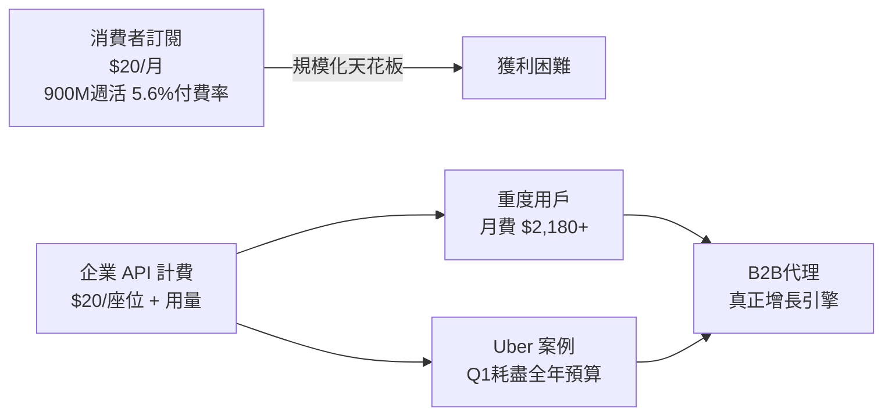
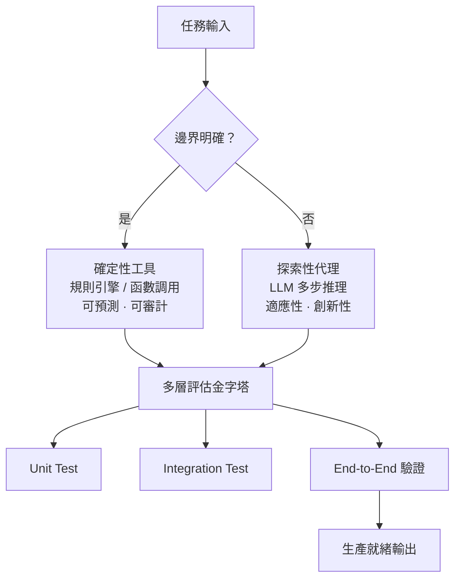

# AI Daily Digest — 2026-05-28

<!-- pipeline-generated:begin -->

## 🔥 今日 TOP 3
### 1. 編碼代理達成 PMF：企業改採 API 計費成新常態
Simon Willison 發表深度分析：Anthropic（2025 年 11 月）與 OpenAI（2026 年 4 月）相繼廢除無限使用方案，改為 $20/座位/月 + API 用量計費；新模型 GPT-5.5 比前代貴 2 倍、Opus 4.7 含 tokenizer 通膨後比 4.6 貴約 1.4 倍。高頻用戶月耗 API 費用實際高達 $2,180（Claude Code $1,200 + Codex $980），Uber 等企業第一季即耗盡全年預算，而 25% 的代碼 commits 已源自 Claude Code。

此次定價轉型標誌著 AI 工具從「消費者軟體訂閱」轉型為「生產力基礎設施」：高薪工程師每月 $200–2,000 API 費用佔薪資比例合理，企業可將此視為基礎設施支出而非軟體訂閱。兩公司企業銷售職位佔比（Anthropic 26.9%、OpenAI 32.6%）是 B2B 戰略的領先指標，ChatGPT 消費者模式 5.6% 付費轉換率則証明消費者路線難以規模化。

預算規劃建議以「每開發人員月 API 費用 $200–500」為基準而非座位費；財務追蹤 token 消耗量而非用戶數。後續觀察重點：token 定價是否繼續通膨（tokenizer 變更是隱性漲價機制）、企業銷售人數擴張速度是否加速。

📖 [閱讀完整 insight](../10-insights/2026-05-27/inbox_66077cd6.md) · 🔗 [原文連結](https://simonwillison.net/2026/May/27/product-market-fit/#atom-everything)
### 2. AI 可靠性設計框架：工具保確定性，代理做探索
Aaron Erickson 在 Arc of AI Conference 2026 提出「Tools for Certainty, Agents for Discovery」框架：對邊界明確、有 SLA 要求的業務邏輯使用確定性工具（規則引擎、函數調用），對開放式推理與未知場景使用代理。框架同時涵蓋代理階層優化（減少推理成本與延遲）、時序基礎模型預測性決策、多層評估金字塔（unit → integration → E2E）三個實踐維度，旨在將「氛圍感受」式決策轉為嚴格系統設計。

此框架解決「何時用 LLM、何時用程式邏輯」的根本架構困境。相較早期「萬物皆 agent」設計，雙軌架構將不可預測性隔離在探索層，核心業務邏輯保持可測試、可審計；代理層同時讓系統能處理長尾邊緣案例，彌補純規則系統的盲區。這是從 demo 成功跨越至生產可靠的核心架構決策點。

設計新 AI 功能時首先問：「這個場景的輸出有明確正確答案嗎？」有則用工具，無則用代理。審查現有 agent 呼叫，識別哪些可替換為確定性函數以降低成本與延遲；用評估金字塔（unit → integration → E2E）取代依賴公開基準的驗證方式。

📖 [閱讀完整 insight](../10-insights/2026-05-27/inbox_54a184c5.md) · 🔗 [原文連結](https://www.infoq.com/presentations/ai-platforms-reliability/?utm_campaign=infoq_content&utm_source=infoq&utm_medium=feed&utm_term=global)
### 3. GitNexus 重大升級：9 階段型別解析覆蓋 10+ 語言
GitNexus v1.6.6-rc.74 完成三大技術躍進：資料庫從 KuzuDB 遷移至 LadybugDB v0.15（消除 segfault workarounds 與 onnxruntime 崩潰）、型別解析系統擴展至 Phase 4–9（涵蓋 nullable 展開、for-loop 型別推論、pattern matching、ACCESSES 邊追蹤、return-type-aware 變數綁定），以及 Swift/iOS、Kotlin（Spring HTTP patterns）、Ruby、PHP/Laravel 四大語言完整支援，總語言覆蓋超過 10 種。同步新增 HTTP embedding 後端支援自託管端點及 Docker 容器化部署，git commit 後自動重新索引並保留 embeddings 狀態。

對使用 GitNexus 的工程團隊意義重大：Phase 4–9 型別解析精度提升代表 AI 代碼助手能正確理解跨函數型別流，減少誤導性建議；HTTP embedding 後端讓企業自託管向量化端點、避免代碼資料外傳；自動重新索引大幅降低維護成本。相較前版，最大突破是消除了生產環境常見的 KuzuDB 與 onnxruntime 崩潰問題，以及 ENOTEMPTY 全局升級錯誤。

使用者應優先升級以獲得穩定性修復。觀察重點：Phase 4–9 型別解析在大型多語言 mono-repo 的實際精度提升；HTTP embedding backend 是否支援 Ollama 等私有端點——若團隊有資料隱私需求，自託管 embedding 方案值得立即評估。

📖 [閱讀完整 insight](../10-insights/2026-05-27/inbox_3e446899.md) · 🔗 [原文連結](https://github.com/abhigyanpatwari/GitNexus/releases/tag/v1.6.6-rc.74)

## 📖 好文章 / 影片精選

_過去 30 天經 traffic 沉澱的高品質內容，按興趣領域分類。每篇只在 column 出現一次。_
### 📚 AI 知識管理
- **infoq-main** · **[Presentation: Accelerating LLM-Driven Developer Productivity at Zoox](../10-insights/2026-05-14/inbox_04ef464a.md)**
  Zoox 面臨文件離散、知識孤島困局，開發統一 AI 驅動平台 Cortex 以加速開發生產力。Cortex 整合 RAG（檢索增強生成）、多模態 LLM 與貢獻者友善的 agent API，支撐跨職能協作。採用策略重點非傳統自上而下，而是通過 AI champions 與內部 hackathons 驅動文化轉變。技術層面，平台從決定論工作流遷移至自主 ag
- **medium-towards-data-science** · **[Proxy-Pointer RAG: Solving Entity and Relationship Sprawl in Large Knowledge Graphs](../10-insights/2026-05-19/inbox_889f076e.md)**
  提出 Proxy-Pointer RAG 方法解決大規模知識圖譜中實體與關係擴散問題。透過可擴展語義定位層進行實體和關係協調，使 RAG 系統在複雜知識圖譜上更高效。該方法特別適用於關係密集、多層級的知識體系檢索。
- **medium-tag-llm** · **[Is RAG dead in 2026?](../10-insights/2026-05-19/inbox_c13063e5.md)**
  RAG 在 2026 企業規模下的演進。傳統「天真」RAG（檢索-讀取-生成線性流程）遇到瓶頸：單次檢索機制（若第一次搜尋失準，模型盲目信任）、語義扁平化（複雜文件被分塊後喪失層級）、零反饋迴圈。進階模式 CRAG 引入檢索評估器給予信心度（正確/不正確/歧義）。但企業本質是執行複雜工作流，非僅需答案。業界正推向「智能體 RAG」(Agentic RAG)，
- **medium-tag-claude** · **[RAG, Explained Simply: How AI Learns to Look Things Up](../10-insights/2026-05-19/inbox_6fcbccdd.md)**
  檢索增強生成（RAG）是一項基礎性技術，本文針對初學者提供易懂的介紹。RAG 結合資訊檢索與生成模型，使 AI 系統能根據外部知識庫進行動態查詢與回應。文章強調 RAG 是「幕後推動大多數 AI 工具運作的技術」，暗示其在產業中的隱形但關鍵地位。對於開發者和產品經理而言，瞭解 RAG 原理已成為理解現代 AI 系統架構的必要知識。RAG 的廣泛應用反映出掌握
- **medium-tag-claude** · **[I Asked Ollama, Cohere, and Claude the Same Question About My Data. Only One Didn’t Lie.](../10-insights/2026-05-21/inbox_a2b9071b.md)**
  作者比較三個 RAG 系統（Ollama、Cohere、Claude）在信用局資料集上的準確性表現，發現 Claude 無幻覺輸出而競品均出現事實錯誤。此案例量化了模型選擇的隱藏成本：「免費」方案看似低成本，實則以準確性和可靠性為代價，特別不適用於金融等高精度需求場景。
### 🏢 企業導入 AI / 團隊實踐
- **openai-blog** · **[An open-source spec for orchestration: Symphony](../10-insights/2026-04-27/inbox_8626ffad.md)**
  OpenAI 發布 Symphony——開源編排規格，用於 Codex 系統的自動化編排。Symphony 可將軟體工程的問題追蹤器（issue tracker）轉變為常態開啟的代理系統，自動處理工作分配與執行，提高工程輸出並減少上下文切換。該工具針對軟體開發團隊設計，透過自動化 issue 管理與代理協調流程，改善開發團隊的生產力與工作流程效率。
- **openai-blog** · **[Choco automates food distribution with AI agents](../10-insights/2026-04-27/inbox_ea8eba8a.md)**
  食品科技公司 Choco 利用 OpenAI API 實現食品配送自動化。通過部署 AI 代理系統，Choco 簡化了食品分配流程、提升了團隊生產力、並促進了業務成長。該客戶案例展示了 OpenAI API 在真實供應鏈管理領域的實際應用價值，為相同領域的企業提供了參考範例。
- **infoq-main** · **[Uber Migrates 75,000+ Test Classes from Junit 4 to Junit 5 Using Automated Code Transformation](../10-insights/2026-04-27/inbox_a318eac5.md)**
  Uber 工程團隊使用 OpenRewrite 和內部編排工具，成功將 75,000+ 個測試類別從 JUnit 4 自動化遷移至 JUnit 5。透過啟用 Bazel 上的 JUnit Platform 雙執行模式，並透過持續整合驗證所有變更，在超大規模單一倉庫環境中完成測試基礎設施的現代化。
- **infoq-main** · **[Presentation: Building a Future-Proof Observability Platform to Empower Engineers](../10-insights/2026-04-27/inbox_79d741b9.md)**
  Skyscanner 工程師分享建置大規模可觀測性平台的架構與文化轉變：透過遷移至 OpenTelemetry 實現計量器與供應商解耦，採「平台即產品、工程師為客戶」的理念推動平台採用。該平台支撐 800+ 微服務，有效降低事件率並消除跨組織的技術債務。
- **medium-towards-data-science** · **[How Spreadsheets Quietly Cost Supply Chains Millions](../10-insights/2026-04-27/inbox_2783db1f.md)**
  文章以模擬分析揭示試算表系統在供應鏈規劃中的隱性成本。核心案例：單一預測值異動在五個規劃團隊間級聯傳播，導致多數零售商在銷售部門與店鋪營運間的規劃落差中損失營收。原文未提供具體損失金額或改善方案細節，僅指出問題症狀。該觀察突出碎片化、非整合資訊系統的實際業務衝擊。注：本項目為供應鏈運營話題，非 AI 相關。
### 🎓 AI 使用技巧 / 心法
- **medium-tag-llm** · **[Multi-Agent Orchestration in Claude Code: The Architecture and Economics of Subagents](../10-insights/2026-05-26/inbox_a645d43a.md)**
  Claude Code 多代理編排的核心洞察：單代理模式因上下文窗口有限而遇到天花板，無法高效處理大型代碼庫（如讀取數百個源文件會耗盡上下文空間）。多代理模式不是為了更聰明，而是為了不同的資源分配——通過分散工作到專門代理，避免單一模型浪費上下文處理不適合的任務。此架構實現並行工作流、維護任務間資訊隔離、高效處理超大代碼庫。經濟學意義在於用分佈式策略替代垂直
- **infoq-main** · **[Presentation: Designing AI Platforms for Reliability: Tools for Certainty, Agents for Discovery](../10-insights/2026-05-27/inbox_54a184c5.md)**
  Aaron Erickson 在演講中提出 AI 平台可靠性的新設計框架。核心理念為「Tools for Certainty, Agents for Discovery」：用確定性工具保證業務約束與可預測性，用 agent 探索處理開放式推理。框架涵蓋 agent 階層優化、時序基礎模型應用、多層評估金字塔等實踐方法，旨在從「氛圍感受」演進到嚴格的多 age
- **medium-tag-llm** · **[A Practical Guide to Evaluating Multi-Turn Agent Trajectories](../10-insights/2026-05-27/inbox_d828877d.md)**
  提出評估多轉多步智慧體系統的軌跡級框架，超越單筆回應評分。論點：agent 執行 k 步時，成功機率是各步可靠度的乘積；每步 95% 可靠度下，5 步時整體成功率跌至 77%、10 步降至 59%（複合衰減）。單轉演示高分不等於多轉實戰成功；需評估完整軌跡（每筆 prompt、思考、tool call、狀態變化）。文章推薦追蹤成功率、工具呼叫失敗率、目標達成
- **medium-tag-llm** · **[Stop Trusting the Embedding: How Real RAG Pipelines Actually Work](../10-insights/2026-05-27/inbox_e6b4f7d8.md)**
  詳細剖析真實 RAG（檢索增強生成）系統的 3 個常見初期失誤：(1) 無量化評估導致品質不明（60% 或 95% 皆可能）；(2) 盲目堆砌技術（HyDE、重排序、查詢改寫）不知哪個有效；(3) 把 embedding 當魔法、忽視關鍵字搜尋和重排序。該文倡導從第一天起建立完整 4 層 pipeline（檢索層 + hybrid search + cont
- **medium-towards-data-science** · **[Optimizing AI Agent Planning with Operations Research and Data Science](../10-insights/2026-05-20/inbox_3e44a39f.md)**
  AI 智能體快速產生成本，需要科學的規劃策略。文章展示如何用運籌學（Operations Research）和資料科學優化智能體的成本和資源配置。方法將常見問題轉化為標準優化模型：技能覆蓋轉為 set covering problem、人力分配為 assignment problem、預算規劃為 knapsack problem。實現工具是 Python 搭
### 💳 支付 / Fintech
- **infoq-architecture** · **[Cloudflare Completes Its Agent Infrastructure Stack with Browser Run Rebuild and Six-Layer Platform](../10-insights/2026-05-22/inbox_5a232861.md)**
  Cloudflare 在自有 Containers 平台上重建 Browser Run，並發能力提升 4 倍，響應延遲降低 50%。完成六層 Agent 基礎設施堆棧：運算層 (Dynamic Workers + Sandboxes)、編排層 (Dynamic Workflows)、記憶層 (Agent Memory)、瀏覽層 (Browser Run)、商
- **infoq-ai-ml** · **[Google Expands SynthID Adoption for AI Watermarking, Previews Content Detection API](../10-insights/2026-05-26/inbox_30565d40.md)**
  Google 的 SynthID 內容偵測 API 在 Google Cloud 的 Gemini Enterprise Agent Platform 上預覽。SynthID 透過在 AI 生成內容中嵌入不可察覺的浮水印信號，協助識別人工智慧輸出。該技術已獲得 Nvidia 和 OpenAI 等業界重要參與者採用。Google Cloud 客戶現可使用此 A
- **simon-willison** · **[I think Anthropic and OpenAI have found product-market fit](../10-insights/2026-05-27/inbox_66077cd6.md)**
  Simon Willison 發表深度分析認為 Anthropic 和 OpenAI 已在編碼代理領域達成產品市場適配（product-market fit），理由是企業客戶現已支付 API 級別的定價而非昔日的優惠企業方案。Anthropic 於 2025 年 11 月、OpenAI 於 2026 年 4 月改變定價模式，從無限使用改為 $20/座位/月 
### 📒 帳務架構 / Ledger
- **openai-blog** · **[Building self-improving tax agents with Codex](../10-insights/2026-05-27/inbox_8005f422.md)**
  OpenAI 與 Thrive、Crete 三方合作，使用 OpenAI Codex 構建自改進稅務代理系統。該系統旨在自動化稅務申報流程、提升申報準確度、加速稅務工作流程處理。此案例展示 Codex 在垂直領域（稅務會計）的應用潛力。原始發布（openai-blog）未提供實作技術細節、自改進機制、或量化效果指標，具體效能提升與系統架構均未公開。
### 🔐 AI 安全 / 濫用
- **infoq-architecture** · **[Cloudflare Processes 10M+ Daily Insights with New Security Overview Dashboard](../10-insights/2026-05-04/inbox_f7c75f0a.md)**
  Cloudflare 推出安全概览仪表板，每日处理 1000 万+ 安全信号，并将其汇聚为优先级化的行动项。系统采用分布式检查器和实时事件处理架构，集成分析工作流以减少调查开销、加快响应。该方案帮助安全团队更快识别和修复关键风险。
- **infoq-architecture** · **[How GitHub Is Securing Agentic Workflows in Modern CI CD Systems](../10-insights/2026-05-08/inbox_936e6ecd.md)**
  GitHub 公開了 CI/CD 管線中 agentic workflows 的防守深度安全架構設計。該架構通過 sandboxed environments（隔離環境）、restricted permissions（限制權限）和 full execution traceability（完整執行追蹤）三重機制，防止 prompt injection、priv
- **reddit-localllama** · **[I trained Qwen3.5 to jailbreak itself with RL, then used the failures to improve its defenses](../10-insights/2026-05-14/inbox_087186d1.md)**
  研究者用 RL 自動化紅隊測試 Qwen 3.5 防禦機制，解決攻擊策略多樣化問題。初期 GRPO 攻擊者陷入單一模式（虛構寫作越獄），通過按戰術聚類並按聚類大小分割獎勵強制多樣化探索。發現 7 個戰術族系，虛構/創意寫作佔 34%。防禦側同時學習拒絕有害請求與保留良性邊界判斷：防禦成功率 64%→92%，良性準確度 92%→88%。展示 RL 紅隊中確保攻
- **medium-tag-claude** · **[Building Deep Agents + SKILL.md with Claude SDK](../10-insights/2026-05-18/inbox_f8451bc9.md)**
  繼續深度智能體系列教程，演示使用 Claude SDK（前稱 Claude Code SDK）搭配 SKILL.md 模式構建完整智能體應用。關鍵創新：SKILL.md 是「特定領域專家手冊」，智能體於需要時才動態加載，保持 context window 潔淨，避免即興演出導致品質波動。提出分層架構：AGENTS.md（專案通用規則）+ SKILL.md（特
- **medium-tag-llm** · **[Beyond Self Refinement: Mitigating “Plausible Unsupported Success” via Cross Model Adversarial...](../10-insights/2026-05-21/inbox_c2ca610d.md)**
  探討 LLM agents 在複雜自動化 ML pipeline 執行時的可靠性問題，提出跨模型對抗驗證策略以應對「Plausible Unsupported Success」（表面成功卻無根據的問題）。超越自我改進的單一模型驗證，引入多模型對抗層。
### 🛤️ AI Flow 導入心得 / 技術分享
- **reddit-claudeai** · **[Claude Code hooks are the feature most people skip. Spoiler: they&#39;re really useful](../10-insights/2026-05-06/inbox_41c72661.md)**
  Claude Code 的 hooks 功能允許在工作流程特定節點（file edit、session start）執行 shell 命令，作者分享兩個核心用法：(1) file edit 後自動運行測試套件，讓 Claude 看到測試失敗並自動調整；(2) prettier 自動格式化。此外可用 exit 1 防止 Claude 修改受保護目錄。這個被多數
- **medium-tag-claude** · **[The .claude/skills/ Directory That Saved Me 75% of My Tokens](../10-insights/2026-05-23/inbox_0d80298e.md)**
  Claude Skills（存在於 `.claude/skills/` 的 markdown 文件）通過編碼用戶偏好和工作流實現 token 優化。示例 skills：`/caveman`（壓縮通信模式，節省 ~75% tokens）、`/grill-me`（詳細提問模式，實現前解決決策分支）、`/diagnose`（結構化 debugging）。Skill
- **reddit-claudeai** · **[Claude just hallucinated again and changed the whole workflow of my app. Do not run them autonomously 24/7.](../10-insights/2026-05-10/inbox_a37af0d3.md)**
  使用者警示 Claude 存在生產環境風險：模型出現幻覺，自動修改應用工作流程，差點在使用者未知的情況下造成資料庫大規模注入錯誤。儘管訂閱 Claude Max 方案，模型仍未達生產級可靠性，不應無人監督運行。使用者批評市場上對 OpenClaw 等自主 AI 代理的炒作通常來自非生產場景（業餘愛好、概念驗證、點擊誘餌），而實際生產部署面臨幻覺、無意識修改等
- **reddit-localllama** · **[Tried every Hermes Agent alternative so you don&#39;t have to (2026 roundup)](../10-insights/2026-05-18/inbox_8fba619b.md)**
  2026年Agent框架全面比較11個Hermes替代方案，分OSS和Managed兩類。OSS方案：OpenClaw（347k星但9 CVE四天內、20%惡意包率）、TrustClaw（OAuth沙箱安全）、PicoClaw（<10MB輕量二進制）、ZeroClaw（Rust 3.4MB極簡）、nanobot（4000行Python易fork+MCP）、m

## 💡 今日 Takeaway

_讀完今日所有內容後，可帶走的知識點_
### 1. RAG 精度瓶頸不在 embedding：四層 pipeline 決定 95% vs 60%
真實 RAG 系統從 60% 躍升至 95%+ 精度，關鍵不在換更好的 embedding 模型，而在建立四層完整 pipeline：文本分塊策略 → contextual retrieval → hybrid search（向量＋關鍵字）→ reranking。常見錯誤是堆砌技術卻缺乏逐層 A/B 測試，導致不知哪層有效；或過度信賴純 embedding、忽視關鍵字搜尋與重排序層的存在。實踐上，從第一天建立量化評估基準，對每層獨立測試，而非憑感覺猜測或全部堆砌；檢索精度瓶頸通常在前置分塊與重排序，而非 embedding 本身。

_類型：framework_

**參考來源**：
- [Stop Trusting the Embedding: How Real RAG Pipelines Actually Work](../10-insights/2026-05-27/inbox_e6b4f7d8.md) · [原文](https://medium.com/@el_mohamad/stop-trusting-the-embedding-how-real-rag-pipelines-actually-work-6d1dd7a9143f?source=rss------large_language_models-5)
### 2. Agent 複合衰減定律：每步 95% 可靠度在 10 步後整體僅 59%
多步驟 agent 成功率等於各步可靠度的乘積：每步 95% 可靠度下，5 步後整體成功率降至 77%、10 步降至 59%。單轉 demo 表現出色的模型，在多輪實戰中仍可能頻繁失敗，且任何一個中間步驟失敗可能導致 agent 卡住或完全崩潰。因此評估 agent 系統應追蹤完整軌跡（每筆 prompt、工具呼叫、狀態轉換）、工具失敗率與目標達成時間，而非終點回應分數；公開基準（GAIA、SWE-bench）易被遊戲化，應建立符合自身場景的客製化評估集，並將「10 步後整體成功率」納入 SLA 設計考量。

_類型：framework_

**參考來源**：
- [A Practical Guide to Evaluating Multi-Turn Agent Trajectories](../10-insights/2026-05-27/inbox_d828877d.md) · [原文](https://medium.com/google-cloud/a-practical-guide-to-evaluating-multi-turn-agent-trajectories-bc21042dbac8?source=rss------large_language_models-5)
### 3. Prompt Caching 在大規模場景可節省每月 $20,000 API 費用且不降品質
對涉及大型 system prompt、few-shot examples 或文件上下文的批量 API 應用，Prompt Caching 透過緩存固定 token 段落可節省每月 $20,000+，且輸出品質不降低。實施重點：將不變的提示部分（system prompt、工具定義、長文件）置於可緩存區域，搭配 Anthropic SDK 的 cache_control 參數標記緩存邊界。當前 token 定價持續通膨（GPT-5.5 比前代貴 2 倍、Opus 4.7 比 4.6 貴約 1.4 倍，含 tokenizer 效應），Prompt Caching 的邊際節省效益將隨之持續提升，預算規劃時應納入此項優化作為必要基線。

_類型：technique_

**參考來源**：
- [Prompt Caching Demo — Save $20K Monthly in API Costs, if you work with large prompts](../10-insights/2026-05-27/inbox_70b31d92.md) · [原文](https://medium.com/@tushar.sharma78000/prompt-caching-save-20k-monthly-in-api-costs-if-you-work-with-large-prompts-4fe87c9edc71?source=rss------large_language_models-5)
- [I think Anthropic and OpenAI have found product-market fit](../10-insights/2026-05-27/inbox_66077cd6.md) · [原文](https://simonwillison.net/2026/May/27/product-market-fit/#atom-everything)
### 4. 生產 AI agent 失敗根源是架構設計，非模型能力不足
即使換用最強 LLM，架構設計不良的 agent 系統仍會在生產環境失敗。常見架構缺陷：上下文管理不當（長對話後 context collapse）、錯誤傳播缺乏熔斷機制、工具調用缺乏冪等性設計、評估體系只依賴單轉表現。正確順序是先確定系統邊界與失敗模式再選擇模型；採用「確定性工具處理已知場景 + 代理處理探索場景」雙軌設計，配合分層評估金字塔（unit → integration → E2E）驗證，是從 demo 成功跨越至生產可靠的核心架構決策，也是為何許多團隊在生產部署後才發現架構缺陷、代價昂貴的根本原因。

_類型：pattern_

**參考來源**：
- [Most AI Agents Fail in Production Because They’re Built Backwards](../10-insights/2026-05-27/inbox_ecdf69c7.md) · [原文](https://towardsdatascience.com/most-ai-agents-fail-in-production-because-theyre-built-backwards/)
- [Presentation: Designing AI Platforms for Reliability: Tools for Certainty, Agents for Discovery](../10-insights/2026-05-27/inbox_a560d45d.md) · [原文](https://www.infoq.com/presentations/ai-platforms-reliability/?utm_campaign=infoq_content&utm_source=infoq&utm_medium=feed&utm_term=AI%2C+ML+%26+Data+Engineering)

<!-- pipeline-generated:end -->

<!-- user-notes -->
<!-- Write your own notes below; pipeline never touches this section. -->