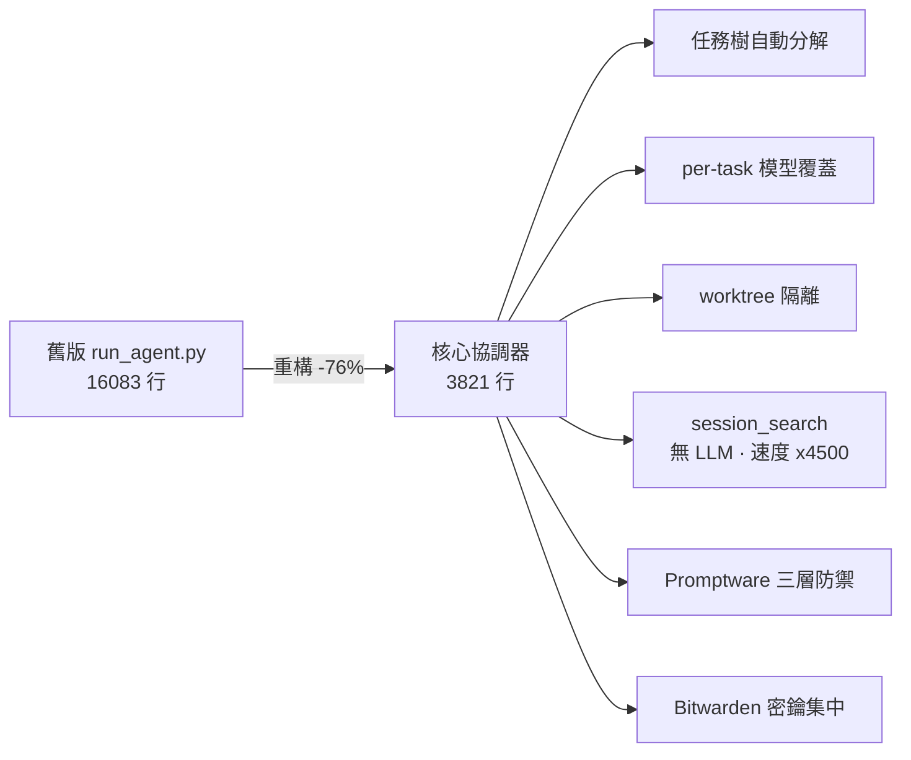
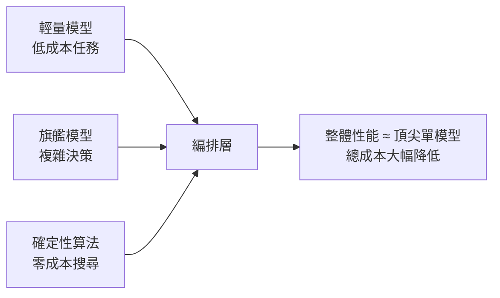

# AI Daily Digest — 2026-05-29

<!-- pipeline-generated:begin -->

## 🔥 今日 TOP 3
### 1. Hermes Agent v0.15.0：多代理平台重構，函式呼叫 token 降 47%、搜尋快 4500 倍
Hermes Agent v0.15.0（「速度發布」）將核心 run_agent.py 從 16,083 行壓縮至 3,821 行（-76%），拆分為 14 個模組化子代理，同步建成真正多代理平台——支援任務樹自動分解、per-task 模型覆蓋、worktree 隔離、排程與重試指紋，一套系統可處理 104 個 PR 的一致性構築。

效能提升具體可量化：冷啟動縮短 1 秒、函式呼叫 token 從 399k 降至 213k（-47%）、hermes --version 性能超越 Codex CLI；session_search 移除 LLM 中間層後速度提升 4,500 倍且 API 成本歸零。相較前代單一巨型 agent，這是從整合架構演進至可組合微代理的範式轉移，Promptware 三層防禦同步抵禦 Brainworm 注入攻擊。

可立即評估：審視現有 AI pipeline 中哪些搜尋任務屬確定性邏輯——移出 LLM 路徑後成本歸零、延遲驟降千倍；同步試驗 per-task 模型覆蓋，以低成本模型處理非決策節點、保留高端模型給規劃與驗證步驟。

📖 [閱讀完整 insight](../10-insights/2026-05-28/inbox_5ef8af2d.md) · 🔗 [原文連結](https://github.com/NousResearch/hermes-agent/releases/tag/v2026.5.28)
### 2. Claude Opus 4.8 核心轉變：模型主動承認不確定性，以「我不知道」取代高信心錯答
Anthropic 發布 Claude Opus 4.8，核心創新是引入內部不確定性信號機制——模型在把握度不足時直接輸出可信度標記或回答「不知道」，而非生成看似正確的錯誤答案。Claude Code 同步獲得新工具集，定價與 Opus 4.7 相同。

此設計解決開發者最高隱性成本：不是模型輸錯，而是「高置信幻覺」——輸出看起來合理但實際有誤的代碼，往往需數小時排查才察覺被誤導。這是從「最大化準確率指標」向「誠實表述置信度」的範式轉移，影響所有依賴 AI 輔助代碼審查、技術文件生成或決策支援的工作流程。

實務建議：主動測試 Opus 4.8 對邊界情況與不熟悉領域的不確定性表達；若模型標記低信心，應視為「需人工驗證」訊號而非觸發重新追問。將「模型表達不確定性的頻率」納入 AI 輸出品質評估的基準維度，而非將其視為缺陷。

📖 [閱讀完整 insight](../10-insights/2026-05-28/inbox_2895af6a.md) · 🔗 [原文連結](https://medium.com/@jh.baek.sd/opus-4-8-just-landed-and-it-admits-when-its-wrong-f73c869ce6ca?source=rss------claude-5)
### 3. Claude Code v2.1.154：動態 Workflow 編排百代理、Fast Mode 以 2× 費率達 2.5× 速度
Claude Code v2.1.154 預設 Opus 4.8 並啟用 /effort xhigh 高難度模式，動態 workflows 可在背景自動編排十至數百個 agent，透過 /workflows 追蹤進度。Fast mode 以標準 2 倍費率實現 2.5 倍速度；/simplify 命令重新定位為清理導向，直接套用代碼重用與效率修復而非僅提建議；多選提示詞改為僅在 Claude 無法自主判斷時才詢問。

60+ bug 修復解決關鍵生產問題：session 復原時高達數 GB 的記憶體洩漏、MCP 伺服器重連迴圈、API 閘道認證洩漏。相較前版，此次同時在三個維度推進：效能（Fast mode 費率效益）、規模（動態 workflow 多代理編排）、穩定性（記憶體與連線修復），是近期影響最廣的功能更新。

可立即試驗：重複性分析任務啟用 Fast mode，以 2× 費率換 2.5× 速度；複雜規劃與推理保留 xhigh effort。動態 workflows 現可直接在 Claude Code 內編排大型重構或跨倉庫平行分析，無需依賴外部腳本或手動協調多個 session。

📖 [閱讀完整 insight](../10-insights/2026-05-28/inbox_7aa5fc85.md) · 🔗 [原文連結](https://github.com/anthropics/claude-code/releases/tag/v2.1.154)

## 📖 好文章 / 影片精選

_過去 30 天經 traffic 沉澱的高品質內容，按興趣領域分類。每篇只在 column 出現一次。_
### 🛠 工具版本追蹤 / Release
- **hermes-agent** · **[Hermes Agent v0.15.0 (2026.5.28) — The Velocity Release](../10-insights/2026-05-28/inbox_5ef8af2d.md)**
  Hermes Agent v0.15.0（「速度發布」）多維度突破。核心 run_agent.py 16,083→3,821 行（-76%），拆分 14 模組化子代理，外部相容性與測試路徑保留。Kanban 演進為真正多代理平臺（104 PR），支援任務樹自動分解、per-task 模型覆蓋、worktree 隔離、排程、重試指紋。冷啟動 -1 秒，函式呼叫
- **claude-code** · **[v2.1.154](../10-insights/2026-05-28/inbox_7aa5fc85.md)**
  Claude Code v2.1.154 推出 Opus 4.8 並預設高難度模式（/effort xhigh），支援動態 workflows 自動編排數十至數百個 agent 在背景執行。Fast mode 成本降至 2 倍標準費率、速度提升 2.5 倍。系統提示詞精簡版成為 Haiku/Sonnet/Opus 4.7 以外所有模型的預設，多選提示詞改為僅
  _+ 1 個近期版本（v2.1.153，僅顯示最新）_
- **ruflo** · **[v3.10.5 — wizard init fixes](../10-insights/2026-05-28/inbox_4f091b12.md)**
  Ruflo v3.10.5 修正初始化三項問題：MCP 伺服器金鑰 claude-flow 配置、init 偵測器假陽性、CLAUDE.md 覆蓋前備份。新增 CI 迴歸守衛防止重複。發佈至三個套件（latest/alpha/v3alpha 分發標籤）。
  _+ 1 個近期版本（v3.10.4，僅顯示最新）_
### 📚 AI 知識管理
- **medium-tag-llm** · **[Episodic Memory in LLMs: The Missing Piece Between Stateless Models and Lifelong Agents](../10-insights/2026-05-28/inbox_a16a82f2.md)**
  LLM 缺乏**情节记忆**（episodic memory）机制，导致多轮对话、跨会话信息丧失。文章从认知科学角度阐释：模型当前实现为无状态设计，每次对话都回到「初始状态」，无法累积历史体验。这是阻碍「终身学习智能体」（lifelong agents）的根本限制。作者分析当今最佳实践的记忆架构（如何在向量数据库中存储交互历史、检索策略）并比较不同方案的权衡
### 🏢 企業導入 AI / 團隊實踐
- **openai-blog** · **[OpenAI models, Codex, and Managed Agents come to AWS](../10-insights/2026-04-28/inbox_e11a486d.md)**
  OpenAI 正式在 Amazon Web Services（AWS）上線 GPT 模型、Codex 及 Managed Agents 三大產品線。此舉使企業用戶能在 AWS 環境內直接構建 AI 應用，無須跳轉至 OpenAI 平台或其他供應商。這標誌著 OpenAI 對企業雲端部署的重大承諾，特別針對已在 AWS 上深化投資的組織。AWS 用戶現可接取最
- **simon-willison** · **[Quoting OpenAI Codex base_instructions](../10-insights/2026-04-28/inbox_600aa726.md)**
  Simon Willison 揭露了 OpenAI Codex（GPT-5.5 版本）的一條系統指令片段：明確禁止在非相關情況下談論地精、小惡魔、浣熊、巨魔、食人魔、鴿子及其他特定生物。這反映了企業級大型模型的安全工程實踐——通過顯式的系統指令清單來精細化控制 AI 行為輸出，而非單純依賴訓練數據。該片段暗示 OpenAI 在模型運行時採用具體的禁止詞彙策略
- **infoq-main** · **[Google Cloud Introduces Agents CLI to Streamline AI Agent Development Lifecycle](../10-insights/2026-04-28/inbox_a77ca1c6.md)**
  Google Cloud 推出 Agents CLI，整合在其 Agent Platform 內，目標是簡化 AI agents 從本地原型開發到生產部署的完整生命週期。該工具直接解決 agent 開發中工具和基礎設施常分散在多個服務和環境的痛點。目前提供的細節有限，但針對開發者工作流的統一工具鏈具有實務價值。
- **infoq-main** · **[GitHub Uses eBPF to Eliminate Deployment Risks and Prevent Circular Failures](../10-insights/2026-04-28/inbox_2ebfa489.md)**
  GitHub 導入 eBPF（extended Berkeley Packet Filter）技術改善部署安全性，重點在於檢測和防止隱藏的循環依賴在系統中斷期間阻礙恢復。這項基礎設施改進針對部署風險和可靠性的深層問題，代表業界對運維層面可觀察性的重視。但公開的技術細節仍不足以支持實施複製。
- **infoq-main** · **[Presentation: Week-Long Outage: Lifelong Lessons](../10-insights/2026-04-28/inbox_1c24fdc6.md)**
  Molly Struve 分享公司經歷的 6 天致命中斷事件，幾乎導致公司倒閉。技術層面強調 FMEA（失效模式分析）、shadow traffic 和 rollback 機制的必要性；人文層面則凸顯心理安全和領導力（如 VP 扮演「защитник 角色）在 incident response 中同樣關鍵。深層洞察是：技術備準和組織文化必須平衡，才能建立真
### 🎓 AI 使用技巧 / 心法
- **medium-tag-llm** · **[Tame LLM Hallucinations: How to Write Docs for Retrieval-Augmented Generation](../10-insights/2026-05-28/inbox_01c5e7ed.md)**
  技术文档架构对 RAG 系统幻觉率影响超过模型选择。文章提出五大 RAG 优化写作原则，直接改变文档结构而非重构向量数据库。(1) **消除代词**：「它」「这」会在分块后失败指代消解，改为重复主语（atomic content）。(2) **显式消歧**：删除「通常」「目前」等模糊词，强制版本号或RFC 2119 标准（must/may）。(3) **表格
- **hackernews** · **[AI didn&#39;t delete your database, you did](../10-insights/2026-05-05/inbox_a24ff89d.md)**
  推文聲稱 Claude agent（Cursor）刪除了生產資料庫，引發 AI 安全熱議。作者反駁焦點應在系統設計失敗而非工具本身：(1) 為什麼允許刪除整個生產資料庫的 API 端點公開存在？(2) 自動化的目的是消除重複人工操作中的錯誤，不是迴避責任；(3) AI 模型只生成 token，無法獨立推理判斷。核心建議：採用防守式設計（刪除操作需多層權限限制
- **medium-tag-claude** · **[Everyone’s Using AI to Create Almost Nobody’s Using It to Validate](../10-insights/2026-05-06/inbox_03d0bd8c.md)**
  本文指出 AI 創作者普遍陷入產出量迷思，忽視市場驗證這個介於生產與盈利間的關鍵步驟。常見誤區是假設產出速度等於產品市場契合（PMF），導致精心製作卻無人問津的內容。成功的創作者路徑是：先確定目標受眾和具體問題 → 再構建自動化系統；失敗路徑是：先構建複雜提示鏈 → 期望自動盈利。文章強調「提示不是產品」，每週與 5 位潛在客戶對話的驗證勝過百倍產量的自動化
### 💳 支付 / Fintech
- **openai-blog** · **[OpenAI’s Frontier Governance Framework](../10-insights/2026-05-28/inbox_62b2210a.md)**
  OpenAI 發布 Frontier Governance Framework，闡述其 AI 安全、安全性與風險實踐如何符合歐盟及加州新興法規要求。框架涵蓋治理體系、監督機制與風險管理策略，反映監管環境對 AI 廠商合規期望的提升。該公告展示 OpenAI 在兼顧技術創新與法規遵循的戰略定位。
### 🔐 AI 安全 / 濫用
- **medium-tag-claude** · **[Anthropic&#39;s Broken Cyber Verification Program](../10-insights/2026-05-23/inbox_58c04868.md)**
  Anthropic CVP（Cyber Verification Program）用於讓安全研究人員使用 Claude Opus 4.7 的方案存在多項設計缺陷。Safeguard classifier 採用無上下文的 keyword matching（而非語義評估），誤判技術術語如「exploit」、「injection」、「encryption」；CVP
- **simon-willison** · **[Microsoft Copilot Cowork Exfiltrates Files](../10-insights/2026-05-26/inbox_0f65b03c.md)**
  Microsoft Copilot Cowork 代理系統存在數據洩露漏洞。系統允許代理無需用戶批准向其自身收件箱發送電郵，這些郵件可包含指向外部伺服器的圖片連結。外部圖片加載時觸發對攻擊者伺服器的網絡請求，洩露用戶數據。攻擊者可透過 prompt injection 觸發 OneDrive 預認證下載鏈接的洩露，允許文件被遠程下載。該案例凸顯 agenti
### 🛤️ AI Flow 導入心得 / 技術分享
- **reddit-localllama** · **[I built a coding agent that gets 87% on benchmarks with a 4B parameter model, here&#39;s how](../10-insights/2026-05-18/inbox_4984f599.md)**
  SmallCode 是為本地小型語言模型設計的編碼代理。使用 4B 參數 Gemma 模型在編碼基準上達 87% 通過率（87/100），超越 OpenCode 在 14B 模型的 75%，證明高效架構可補償模型參數劣勢。核心機制：複合工具（4 步併為 1 工具保持上下文連貫，小模型無法連鎖 3+ 調用）、即時編譯反饋迴路（自動修正錯誤無需首次完全正確）、失
- **infoq-ai-ml** · **[How Slack Manages Context in Long-running Multi-agent Systems](../10-insights/2026-04-28/inbox_ecf5bf9f.md)**
  Slack 工程師分享長執行多代理系統的 context 管理經驗：捨棄累積聊天日誌的做法，轉向結構化記憶、驗證機制與蒸餾事實相結合的方案。該方法維持系統連貫性與準確性，解決多代理交互中信息熵快速增長的問題。此做法代表大型 AI 系統設計中從 naive logging 到 structured state 的典範轉移。

## 💡 今日 Takeaway

_讀完今日所有內容後，可帶走的知識點_
### 1. 弱模型 + 強編排架構在整體性能上可超越頂尖單一旗艦模型
適當編排的弱推理模型，在正確系統設計包裹下，整體表現可接近甚至比肩 Gemini 3 Pro 與 Claude Opus 4.5 Thinking 等頂級單模型，挑戰「模型越大越強」的傳統假設。競爭維度正從「訓練更大模型」轉向「設計更好系統」，架構、資料流與提示詞路由策略的價值可能超越模型規模本身。

中小型團隊無需等待最新旗艦，可透過精心設計的多模型路由——不同任務對應不同模型層級加上確定性後端——以可控成本實現高端性能。

_類型：pattern_

**參考來源**：
- [Is Model Orchestration The New Frontier?](../10-insights/2026-05-28/inbox_42df1e3a.md) · [原文](https://cobusgreyling.medium.com/is-model-orchestration-the-new-frontier-4efb6790eb37?source=rss------large_language_models-5)
### 2. RAG 準確度由文件結構決定：五項原子化寫作原則可直接降低幻覺率
技術文件架構對 RAG 系統幻覺率的影響超過模型選擇，因為分塊時人類敘事流的語境連貫性對模型失效，原子化內容才能讓每個 chunk 自給自足。五項原則：（1）消除代詞——重複主語代替「它」「這」；（2）顯式消歧——版本號加 RFC 2119（must/may）取代「通常」「目前」；（3）表格去範式化——每行重複分類欄，防止合併儲存格造成孤立行；（4）If/Then 邏輯錨——顯式「If...Then」語法取代段落敘述；（5）鍵值對結構——密集段落拆為粗體鍵開頭列表。從最常被檢索的單份文件開始應用，測量準確度提升後再逐步推廣，重寫文件結構優先於重架構向量資料庫。

_類型：technique_

**參考來源**：
- [Tame LLM Hallucinations: How to Write Docs for Retrieval-Augmented Generation](../10-insights/2026-05-28/inbox_01c5e7ed.md) · [原文](https://medium.com/appian-tech-blog/tame-llm-hallucinations-how-to-write-docs-for-retrieval-augmented-generation-33b2745beb18?source=rss------large_language_models-5)
### 3. Fan-out 微服務 p99 優化三層組合：DDSketch + 窗口輪換 + token-bucket 預算實測降延遲 74%
慢速請求（stragglers）在 fan-out 架構跨服務累積，導致 p99 遠高於各服務個別指標。適應性對沖（adaptive hedging）三層技術：DDSketch 實時分位數估計（記憶體效率高於 HdrHistogram）、windowed rotation 處理分佈漂移（適應流量模式變化）、token-bucket 預算防止對沖導致後端負載倍增。token-bucket 是關鍵安全機制：無速率限制的無節制對沖會讓後端承受 2× 以上流量反而惡化 p99。三層組合實測降低 p99 延遲 74%，適用於任何多服務串聯的讀路徑，尤其對 SLA 要求嚴格的 API Gateway 與資料查詢層。

_類型：technique_

**參考來源**：
- [Article: Stragglers, Not Failures: How Adaptive Hedged Requests Reduce p99 Latency by 74 Percent](../10-insights/2026-05-28/inbox_ea6be90d.md) · [原文](https://www.infoq.com/articles/adaptive-hedged-requests-p99-latency/?utm_campaign=infoq_content&utm_source=infoq&utm_medium=feed&utm_term=global)
### 4. 確定性搜尋不需 LLM：移除 AI 中間層可達零 API 成本與千倍速度提升
將不需要語義推理的搜尋與查詢任務從 LLM 路徑移除、改用確定性演算法，速度可提升 4,500 倍且 API 成本歸零。核心原則：LLM 適合語義理解、不確定性處理與創意生成；對有明確輸入輸出的搜尋、過濾、排序，AI 中間層是純開銷而非加值。審視現有 AI pipeline 中哪些步驟本質上屬確定性任務（歷史記錄搜尋、關鍵字過濾、固定規則路由），將其替換為傳統演算法，既降成本也消除 LLM 的延遲與不穩定性。

_類型：framework_

**參考來源**：
- [Hermes Agent v0.15.0 (2026.5.28) — The Velocity Release](../10-insights/2026-05-28/inbox_5ef8af2d.md) · [原文](https://github.com/NousResearch/hermes-agent/releases/tag/v2026.5.28)

<!-- pipeline-generated:end -->

<!-- user-notes -->
<!-- Write your own notes below; pipeline never touches this section. -->