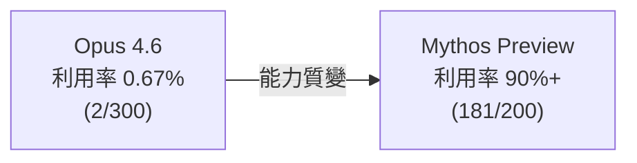
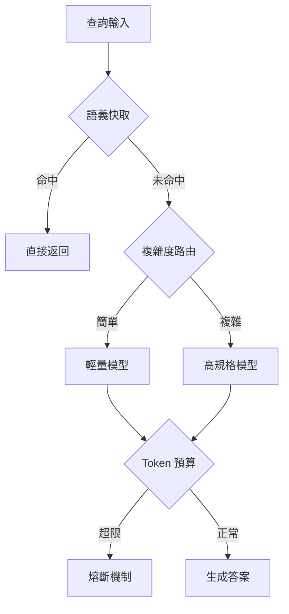

# AI Daily Digest — 2026-05-30

<!-- pipeline-generated:begin -->

## 🔥 今日 TOP 3
### 1. Claude Opus 4.8：誠實訓練讓代碼缺陷漏報率降低 4 倍
Anthropic 發布 Claude Opus 4.8，自述為「適度但明顯改進」。核心改進是誠實度：透過訓練模型在不確定時主動禁言而非盲目作答，代碼缺陷未被標記概率降低約 4 倍。Fast mode 定價從 $30/$150 大幅降至 $10/$50，標準模式維持 $5/$25 per 百萬 tokens。

「主動禁言」改變 LLM 可信度的底層邏輯。Opus 4.8 在六個基準上以減少不確定領域回答達成最低錯誤率，而非純粹提升答題能力。對依賴 AI 輔助代碼審查或安全掃描的工程師，假陰性率降低 4 倍比性能指標更具實務意義。

新增 mid-conversation system messages 允許長對話中插入更新指令並保留 prompt cache 命中率；prompt cache 最小長度降至 1,024 tokens（前 4,096），agent loop 成本可顯著下降。工程師可立即評估在現有 agent workflow 中啟用更積極的 prompt cache 策略。

📖 [閱讀完整 insight](../10-insights/2026-05-28/inbox_6fc4594b.md) · 🔗 [原文連結](https://simonwillison.net/2026/May/28/claude-opus-4-8/#atom-everything)
### 2. Claude Mythos：永不公售的 AI 在 Firefox 漏洞利用率達 90%+
Anthropic 開發 Claude Mythos 並明確決定永不公售。Mythos Preview 在 Firefox 漏洞利用率達 90%+（181/200），遠超 Opus 4.6 的 0.67%（2/300）；並獨立發現 OpenBSD 27 年未被揭露的 0day。存取權限透過 Project Glasswing 限制給驗證機構，定價 $125/百萬 tokens，並投入 $1.04 億支援符合資格的防禦型組織。

此差距不只是量化改進，而是能力性質的轉變。模型能力源自通用編碼與推理進步，意味著「能發現漏洞但無法自動利用」的安全閾值已不復存在。Anthropic 試圖以存取管控將攻防能力差距轉化為防禦優勢，但此框架的可持續性仍待觀察。

企業安全團隊的 AI 輔助漏洞防護窗口正在縮短。Anthropic 的存取控制模型（驗證機構 + 計費門檻 + 捐款義務）可能成為高風險 AI 能力的新發佈範本，值得關注其他頂尖 lab 是否跟進類似管控框架。

📖 [閱讀完整 insight](../10-insights/2026-05-29/inbox_37930dae.md) · 🔗 [原文連結](https://medium.com/@hardik.goel214/anthropic-built-an-ai-so-powerful-they-refuse-to-sell-it-8819d2bc0840?source=rss------claude-5)
### 3. Ruflo v3.10.7：CLI 負值解析 bug 使所有「懲罰」反向強化壞代理
Ruflo 對自學習系統進行全面實證審計，發現致命 bug：route feedback -r -1.0 中，CLI 旗標解析器丟棄負值前綴，-1.0 被解讀為 +1.00，對壞代理的負向懲罰反而成為強化信號。同次審計揭露 HNSW「150×–12,500×」加速聲明無法複現，真實測量為 N=5000 達 3.2–4.7×，部分「加速」源自計時 artifact。

此 bug 在生產環境靜默運行期間，路由學習系統不只無效，而且持續優化錯誤行為，且路由分數表面上看似「進步中」，極難被察覺。更廣泛的意義：所有依賴 CLI 傳遞數值信號的 RL/agent 系統，都可能面臨相同的符號丟失漏洞；未驗證的 benchmark 聲明是技術債的早期形式。

設計 agent feedback pipeline 時，ingestion 層需對值域符號進行顯式驗證，不可信任上游 CLI 解析。效能聲明應搭配可重現測試用例與 CI 守衛，嚴格區分「已測量」與「未驗證聲稱」，後者應明確標記。

📖 [閱讀完整 insight](../10-insights/2026-05-29/inbox_95432e09.md) · 🔗 [原文連結](https://github.com/ruvnet/ruflo/releases/tag/v3.10.7)

## 📖 好文章 / 影片精選

_過去 30 天經 traffic 沉澱的高品質內容，按興趣領域分類。每篇只在 column 出現一次。_
### 🛠 工具版本追蹤 / Release
- **ruflo** · **[v3.10.13 — agentdb ADR-073 SOTA round](../10-insights/2026-05-30/inbox_17e564c9.md)**
  Ruflo v3.10.13 发布（bundled agentdb 3.0.0-alpha.16，SOTA roadmap ADR-073）。安全方面关闭 3 个漏洞：parseJsonStrict 防止 JSON.parse 栈跟踪泄露、validateSqlIdentifier 防止 CWE-89 模板 SQL 注入、crypto.randomBytes
  _+ 7 個近期版本（v3.10.12 → v3.10.6，僅顯示最新）_
- **claude-code** · **[v2.1.157](../10-insights/2026-05-29/inbox_0c1cca6a.md)**
  Claude Code v2.1.157 發布，核心改進包括 .claude/skills 目錄內的插件自動加載（無需市集）、claude plugin init 指令快速建立插件、工作樹中途切換功能、settings.json 代理欄位支援。此版本修復 40+ 項問題，包括影像損毀不崩潰、背景代理完成後解鎖工作樹便於清理、IDE 整合的快捷鍵與終端渲染、剪
  _+ 1 個近期版本（v2.1.156，僅顯示最新）_
- **claude-mem** · **[v13.4.0](../10-insights/2026-05-29/inbox_afe1e220.md)**
  claude-mem v13.4.0 大規模缺陷清除：測試 46→0 失敗，typecheck 24→0 錯誤。新增 OpenAI 兼容基礎 URL 配置環境變數 CLAUDE_MEM_OPENROUTER_BASE_URL，可指向 DeepSeek、LM Studio 或自訂端點。修復涉及 Spawn contract 的 ${CLAUDE_PLUGIN_
- **hermes-agent** · **[Hermes Agent v0.15.2 (2026.5.29.2)](../10-insights/2026-05-29/inbox_3ea4d1e9.md)**
  Hermes Agent v0.15.2（發布日期 2026.5.29.2）發布。本版本修復打包問題：確保 plugin.yaml 清單文件包含在 wheel 和 sdist 發行版中，提升發行包完整性。貢獻者包括 @outsourc-e、@dparikh79、@ousiaresearch、@libre-7。
  _+ 3 個近期版本（clean-before-remerge: Pl → merge-commit-backup: Mer，僅顯示最新）_
### 📚 AI 知識管理
- **infoq-ai-ml** · **[Presentation: Accelerating LLM-Driven Developer Productivity at Zoox](../10-insights/2026-05-14/inbox_c6621707.md)**
  Zoox 分享 AI 採納演進：從零散文件轉向 Cortex 平台，整合 RAG、多模態 LLM 與代理 API。通過 AI champions 與 hackathons 驅動團隊採納。核心轉變是從確定性工作流轉向自主 agents，為規模化 AI 工程提供組織層實踐。
- **substack-product-compass** · **[PM Brain OS: The Second Brain for Product Managers, Made of Markdown](../10-insights/2026-05-20/inbox_4ea003cf.md)**
  PM Brain OS 是開源工具，以本機 markdown 檔案夾為 second brain，整合 Claude 讀寫能力。工作流為：Claude 讀取檔案前回答問題，並在回答後自動寫入更新，每週五自動清理整理。已驗證 17 個合成 PM 場景，通過率 99.5%（404/406 檢查點通過）。
- **medium-tag-llm** · **[LLMs And Tokens: My Notes After Asking An LLM To “Explain It Like I’m 12 Years Old”](../10-insights/2026-05-21/inbox_2525fff1.md)**
  Vaibhav Parmar 為初學者寫的 LLM 入門系列首篇。核心隱喻：LLM = 超級 autocomplete，本質上是統計預測遊戲，不是真正的「理解」。文章簡化複雜概念：Transformer 架構是現代 LLM 的引擎，LLM 吃的不是「詞」而是「tokens」（子詞單位）。說明為何 LLM 能寫程式碼、總結文件、除錯：都因為高度訓練的模式預測。
- **medium-towards-data-science** · **[Enterprise Document Intelligence: A Series on Building RAG Brick by Brick, from Minimal to Corpus scale](../10-insights/2026-05-22/inbox_d941afac.md)**
  Towards Data Science 推出 RAG 構建系列教程，面向想深入理解而非僅調用庫的 AI 工程師。系列涵蓋從最小規模原型到企業級語料庫規模的完整構建過程，每一步驟講解 RAG 的實現原理與設計決策。強調理解基礎原理對於長期可維護性與性能優化的重要性。
- **medium-tag-llm** · **[Why Vector Databases Are the Backbone of Modern AI Applications](../10-insights/2026-05-23/inbox_e8a1674c.md)**
  向量資料庫在現代 AI 應用中的核心基礎設施地位。文章針對使用大語言模型與語義搜尋的開發者，論述向量資料庫何以成為此類應用的必要支柱。可能涉及 embedding、向量索引、檢索增強等技術點。
### 🏢 企業導入 AI / 團隊實踐
- **openai-blog** · **[Cybersecurity in the Intelligence Age](../10-insights/2026-04-29/inbox_58463145.md)**
  OpenAI 發佈《智慧時代網路安全行動計畫》，提出五步驟框架強化 AI 時代的防禦能力。主要策略：(1) 民主化 AI 驅動的網路防禦能力，降低企業採納門檻；(2) 透過 AI 保護關鍵基礎設施，防範日益複雜的網路威脅；(3) 構建産業性合作機制，將防禦能力從頂級機構推廣至中小企業。此舉措體現 OpenAI 對於 AI 成為防禦工具的重視，以及在 AGI 
- **codex** · **[0.128.0](../10-insights/2026-04-30/inbox_fc820943.md)**
  OpenAI Codex 0.128.0 發布重大更新，涵蓋持久化工作流、UI 與權限系統改進、插件生態強化。核心新增持久化 `/goal` 工作流，支援 app-server API、模型工具、runtime 延續，TUI 提供 create/pause/resume/clear 操作；配置自訂快鍵映射、plan-mode 提示、狀態欄編輯。權限系統新增內
- **deepmind-blog** · **[Enabling a new model for healthcare with AI co-clinician](../10-insights/2026-04-30/inbox_aabd2aab.md)**
  DeepMind 公佈 AI co-clinician 研究計畫，探索 AI 增強臨床護理的路徑。該系統旨在與臨床醫生協作，輔助患者診療決策。研究聚焦於如何將 AI 能力整合入醫療工作流，實現醫人共智的臨床模式。
- **infoq-main** · **[Meta Deploys Unified AI Agents to Automate Performance Optimization at Hyperscale](../10-insights/2026-05-01/inbox_90069725.md)**
  Meta 推出統一 AI agents 驅動的容量效率平台，自動檢測和解決全球基礎設施中的性能問題，標誌向超大規模（hyperscale）自優化系統邁進。該平台使用統一 AI agents 跨越 Meta 全球基礎設施自動化性能優化工作。將性能優化從人工干預轉變為 AI 驅動自動化，代表超大規模企業基礎設施管理的典範轉移。但原文缺乏具體量化數據或系統架構細節
- **infoq-main** · **[Presentation: The Next Generation of AI Products](../10-insights/2026-05-01/inbox_9d6b5d06.md)**
  Hilary Mason 在 InfoQ presentation 分享從學術到大規模 AI 產品構建的歷程。工程思維必須從離散工程轉向概率思維，認識系統內的不確定性本質。她強調「人為考量」（human considerations——包括用戶期望、模型侷限、倫理等）是 AI 技術棧中最困難的部分，超越了純演算法設計的難度。優秀的現代 AI 架構關鍵在於上下
### 🎓 AI 使用技巧 / 心法
- **reddit-localllama** · **[Drastically improve prompt processing speed for --n-cpu-moe partially offloaded models](../10-insights/2026-05-12/inbox_0069283c.md)**
  分享通過增加 llama.cpp 中 ubatch（物理微批次大小）參數來大幅提升 MoE 模型提示詞處理速度的優化技巧。在 RTX 3090（24GB）上運行 gpt-oss-120b-F16 時，將 ubatch 從預設 512 增至 8192，提示詞處理速度從 380 tok/s 躍升至 2091 tok/s（約 5.5 倍提升），需同步提升 n-cp
- **medium-tag-llm** · **[Is Model Orchestration The New Frontier?](../10-insights/2026-05-28/inbox_42df1e3a.md)**
  文章提出「模型編排」（Model Orchestration）可能成為 AI 系統開發的新前沿。核心主張是：經過適當編排的弱推理模型，在正確的系統架構包裹下，其整體表現可接近甚至比肩 Gemini 3 Pro 和 Claude Opus 4.5 Thinking 等業界最強單模型。這挑戰了「模型越大越強」的傳統假設，暗示系統設計、數據流程、提示詞策略的價值可
- **hackernews** · **[Show HN: Needle: We Distilled Gemini Tool Calling into a 26M Model](../10-insights/2026-05-12/inbox_1c0ad7bb.md)**
  開源發布 Needle：26M 參數工具呼叫模型，透過蒸餾 Gemini 功能實現。在消費裝置上達 6000 tok/s 預填充、1200 tok/s 解碼。核心創新：採用「僅注意力網路」（無 MLP 層），基於洞察「工具呼叫本質為檢索-組裝，非推理，因此無需大模型」。於 16 個 TPU v6e 預訓練 200B token、微調 2B 合成函數呼叫資料。
- **medium-towards-data-science** · **[Recursive Language Models: An All-in-One Deep Dive](../10-insights/2026-05-16/inbox_542667ce.md)**
  深度分析遞歸語言模型設計，系統對比其與 ReAct、CodeAct、Self-Loops、Subagents 等智能體方法論的核心差異。文章明確闡述遞歸 LM 相比其他智能體設計的獨特優勢及應用場景定位。
- **medium-tag-llm** · **[The Emerging Middle Layer of Agentic AI](../10-insights/2026-05-26/inbox_2818bbe0.md)**
  代理 AI 出現第三層架構：除了模型層（訓練時存在）與系統層（預置工具、權限、驗證器），還有執行時動態產生的「中間層」代碼。此層包含代理自動生成、執行、修改並保存的工件：回歸測試、臨時工具、領域特定語言、可執行工作流、可重用技能。與傳統兩層架構不同，中間層只在任務執行期間存在。關鍵效果：代理於長任務中改進，因其能在先前步驟基礎上構築，實現真正的長地平線能力進
### 💳 支付 / Fintech
- **medium-tag-claude** · **[The Hidden Costs of AI Convenience: What We’re Trading for Efficiency](../10-insights/2026-05-29/inbox_d259316e.md)**
  探討 AI 便利性的隱形成本。研究表明長期依賴 AI（ChatGPT、Claude、Gemini 等）導致認知衰退：Microsoft 研究顯示使用者批判性思維減弱；香港大學 2024-2025 研究發現重度使用 AI 的學生記憶保留、獨立思考與考試成績均低於同儕；劍橋實驗室腦部掃描顯示問題解決和創意思維的神經活動下降；長期使用可能削弱在金融科技等高風險領域
### ⛓️ 區塊鏈 / Web3
- **infoq-main** · **[GitHub Slashes Agent Workflow Token Spend up to 62% with Daily Audits and MCP Pruning](../10-insights/2026-05-29/inbox_415b2755.md)**
  GitHub 報告在代理 CI 工作流中透過三層優化策略實現 62% 代幣成本削減：(1) 修剪未使用的 MCP 工具；(2) 將部分 MCP 調用改用輕量的 gh CLI 命令；(3) 運行每日自動審計和優化代理。引入 token-usage.jsonl 工件和 Effective Tokens 指標追蹤各模型代幣消耗並發現迴歸，為採用 agentic w
### 🔐 AI 安全 / 濫用
- **medium-tag-claude** · **[Anthropic Built an AI So Powerful They Refuse to Sell It](../10-insights/2026-05-29/inbox_37930dae.md)**
  Claude Mythos 是 Anthropic 開發最強大的模型，但絕不向公眾發售。該模型在安全漏洞挖掘能力上出現質的飛躍：相比 Opus 4.6 成功率 0.67%（2/300），Mythos Preview 達成 90%+（181/200）的 Firefox 漏洞利用率；並獨立發現 OpenBSD 中 27 年未被發現的 0day。Anthropic
### 🛤️ AI Flow 導入心得 / 技術分享
- **substack-lennys-newsletter** · **[Claude Opus 4.8 is here. Is it as good as they say?](../10-insights/2026-05-28/inbox_06e28bdc.md)**
  Anthropic 發布 Claude Opus 4.8，在編碼、推理與代理能力上較 4.7 進步。早期測試者發現 4.8 擅長綠地原型開發與單次功能實現，但在邊界情況與現有程式碼整合上仍有缺陷（「最後 10% 問題」）、出現幻覺；資料驅動的策略與路線圖工作仍需倚賴 4.7。同步推出動態工作流（parallel subagents）與 Claude.ai 之
- **simon-willison** · **[Quoting Mitchell Hashimoto](../10-insights/2026-05-14/inbox_7422b613.md)**
  Mitchell Hashimoto 評論 Bun 從 Zig 遷移至 Rust 僅耗 1-2 週，論證編碼代理使程式語言成為「消耗品」而非永久決策。語言選擇不再構成競爭優勢鎖定，企業可隨時根據需求切換，反映代理驅動開發對軟體決策層級的根本改變。
- **medium-tag-llm** · **[The Evolution of Shared Language in AI Agent Development](../10-insights/2026-05-01/inbox_fa1855ef.md)**
  作者梳理 AI agent 開發 6 年來的語言演變軌跡，從 2020-2022 年的 LLM 基礎概念（prompts、tokens）進化到 2025 年的協議標準化（MCP、CUA、A2A），再到 2026 年的「Harness 工程」新階段。核心轉變是從「agent 能做什麼」（能力導向）轉向「如何控制 agent 實際做什麼」（控制導向），強調 ri
- **simon-willison** · **[Quoting James Shore](../10-insights/2026-05-11/inbox_a14ce066.md)**
  James Shore 揭示 AI 編碼代理的隱藏經濟成本：代理若提高開發生產力 N 倍，維護成本必須同時降低 1/N，否則淨成本反而倍增。具體計算：生產力×2 但維護成本×2 = 淨成本×4；生產力×2 但維護成本不變 = 淨成本×2；只有當生產力×2 且維護成本減半，總成本才能 break-even。此公式揭示許多團隊正在享受短期生產力提升的同時，累積長

## 💡 今日 Takeaway

_讀完今日所有內容後，可帶走的知識點_
### 1. 未使用 MCP 工具靜默燃燒 token —— 修剪是 agent 成本管理最大槓桿
GitHub agent CI 透過移除未使用 MCP 工具、以輕量 gh CLI 替代部分 MCP 呼叫、加上每日審計代理，達成 62% token 成本削減。關鍵機制：MCP 工具 schema 即使從未被呼叫，仍計入每次請求的 context token 開銷。建議引入 token-usage.jsonl 工件追蹤「Effective Tokens」指標，在跨模型版本升級時自動偵測成本迴歸。

_類型：data-point_

**參考來源**：
- [GitHub Slashes Agent Workflow Token Spend up to 62% with Daily Audits and MCP Pruning](../10-insights/2026-05-29/inbox_415b2755.md) · [原文](https://www.infoq.com/news/2026/05/github-agentic-token-savings/?utm_campaign=infoq_content&utm_source=infoq&utm_medium=feed&utm_term=global)
### 2. RAG 四層成本控制框架可削減 85%，統一走高規格模型是主要浪費來源
語義快取 + 查詢路由 + token 預算 + 熔斷機制四層組合，生產環境實測達成 85% 成本削減，品質不降。框架核心洞察：查詢複雜度差異巨大，強制所有查詢走最高規格模型是主要浪費來源。品質調優完成的 RAG 系統，下一個優先任務應是建立此類分層成本控制架構。

_類型：framework_

**參考來源**：
- [RAG Is Burning Money — I Built a Cost Control Layer to Fix It](../10-insights/2026-05-29/inbox_60ce3193.md) · [原文](https://towardsdatascience.com/rag-is-burning-money-i-built-a-cost-control-layer-to-fix-it/)
### 3. CLI 負值前綴丟棄造成 RL feedback 符號反轉 —— ingestion 層必須顯式驗證值域
Ruflo 實際案例：-r -1.0 被解析為 +1.00，負向懲罰變正向強化，壞代理持續被強化優化。此類靜默語意反轉極難被日常監控發現，因路由分數表面上看起來持續「進步」。設計 RL/agent feedback pipeline 時，ingestion 層必須對值域符號進行顯式驗證（例如斷言 reward 值落在預期區間），不能信任上游 CLI 或 API 參數解析的正確性。

_類型：pattern_

**參考來源**：
- [v3.10.7 — intelligence audit, hardening fixes &amp; honest perf numbers](../10-insights/2026-05-29/inbox_95432e09.md) · [原文](https://github.com/ruvnet/ruflo/releases/tag/v3.10.7)
### 4. AI 系統效能聲稱需以 CI benchmark 守衛取代文件聲稱，未測量等於技術債
Ruflo 將「聲稱 95% recall」升級為真實 benchmark（N=2000, D=384, recall@10=0.912）並加 CI guard 防止下降迴歸。AI/ML 效能指標在缺乏持續測試的情況下會靜默漂移，模型、資料或基礎設施任一更新都可能使「已知」指標失效而無人察覺。所有效能聲明應搭配可重現測試用例與自動 CI 守衛，嚴格區分「已測量」與「未驗證聲稱」。

_類型：data-point_

**參考來源**：
- [v3.10.13 — agentdb ADR-073 SOTA round](../10-insights/2026-05-30/inbox_17e564c9.md) · [原文](https://github.com/ruvnet/ruflo/releases/tag/v3.10.13)

<!-- pipeline-generated:end -->

<!-- user-notes -->
<!-- Write your own notes below; pipeline never touches this section. -->