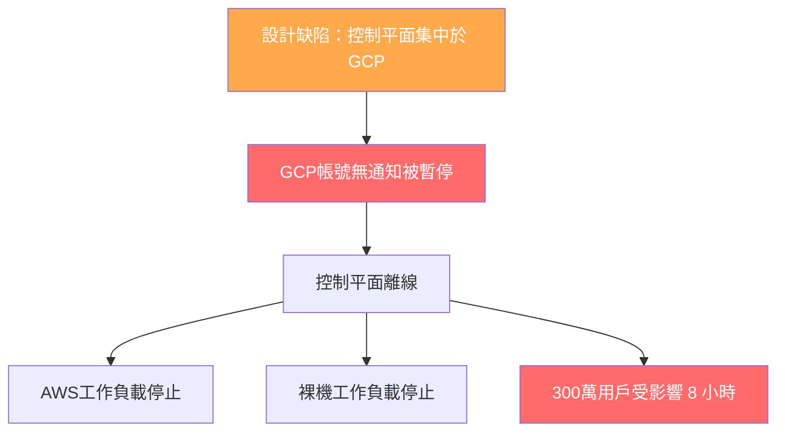

# AI Daily Digest — 2026-05-31

<!-- pipeline-generated:begin -->

## 🔥 今日 TOP 3
### 1. 手標記語料庫揭露代理指標的雙向偏差
Ruflo v3.10.21 引入人工手標記語料庫與 nDCG 指標，取代先前依賴的正則表達式代理。真實標記結果：混合路徑 top-1 命中率 90%、nDCG@3 0.900；混合+rerank top-3 達 100%、nDCG@3 0.913。

正則表達式代理存在雙向系統性偏差：低報（斜體 commit 變體漏匹配，真實相關被排除）且高報（無關 release-bump commit 被誤標相關），導致超參調優方向完全錯誤。評估同時揭示 rerank 與 hybrid 的根本 trade-off：rerank 優化全覆蓋（precision@3 0.40→0.67），hybrid 優化最佳首位（top-1 0%→90%）。無普遍優越者，任務目標決定選擇。

```mermaid
flowchart LR
    Q[Query] --> HY[Hybrid路徑]
    Q --> RR[Rerank路徑]
    HY -->|top-1: 90%| E1[最佳首位優先]
    RR -->|precision@3: 0.67| E2[相關集覆蓋優先]
    PX[代理指標] -.->|雙向偏差| W[錯誤優化方向]
    GL[手標記黃金集] -->|nDCG@3| R[真實性能]
```

實務應用：建立 20–50 個人工標記查詢為最小評估基準，以 nDCG@K 為主要指標。選擇 rerank 或 hybrid 路徑前，先確認任務目標是 top-1 精準還是高召回覆蓋，兩者超參最優值不同，不可共用。

📖 [閱讀完整 insight](../10-insights/2026-05-30/inbox_be5126e3.md) · 🔗 [原文連結](https://github.com/ruvnet/ruflo/releases/tag/v3.10.21)
### 2. Anthropic 估值逼近 1 兆美元超越 OpenAI
Anthropic 完成 Series H 融資 65 億美元，估值接近 1 兆美元，超越 OpenAI 成全球最高估值 AI 新創，相比 2024 年 2 月估值翻近 3 倍，主要驅動力是 Claude 在企業關鍵業務應用的滲透率提升。

此估值反映企業 AI 市場正從單廠商主導轉向多廠商生態。企業選型優先序已從「最強能力」轉向「安全性、可控性、倫理部署」，Anthropic 的 Constitutional AI 定位恰好契合此轉變。「可信賴度」已成為 AI 商業競爭的核心指標，且比能力差距更難被快速複製，構成更持久的護城河。

對技術決策者而言，Anthropic 的長期生存能力已大幅確認，API 接入與長期合約風險顯著降低。近期觀察重點：Anthropic 如何將資本轉化為算力與研究優勢；OpenAI 的定價與產品策略反應；以及企業多 AI 供應商採購趨勢是否因此加速。

📖 [閱讀完整 insight](../10-insights/2026-05-30/inbox_92b85894.md) · 🔗 [原文連結](https://tejalogs.medium.com/anthropics-1t-valuation-signals-enterprise-ai-dominance-shifts-market-6072bbcb82bd?source=rss------claude-5)
### 3. GCP 停帳致 Railway 控制平面崩潰停服 8 小時
Google Cloud 自動化系統無預警暫停 Railway 生產帳戶，平台完全不可用 8 小時，影響約 300 萬用戶。Railway 工作負載雖跨 AWS、GCP 和裸機，但控制平面集中在 GCP，導致全平台級聯崩潰，連 AWS 上的服務也無法運作。



此事件揭示「工作負載多雲 ≠ 控制面多雲」的架構盲點。雲端供應商自動帳戶暫停對企業是不對稱風險：供應商可無理由執行，客戶毫無緩衝時間。Railway 事後將 GCP 降級為備用並改採分布式控制平面。實務應用：繪製服務依賴圖，識別哪些元件是「隱性控制平面」，確認它們是否依賴單一供應商帳戶的存活，此為真正多雲高可用的最小要求。

📖 [閱讀完整 insight](../10-insights/2026-05-30/inbox_9441cf0c.md) · 🔗 [原文連結](https://www.infoq.com/news/2026/05/railway-gcp-account-outage/?utm_campaign=infoq_content&utm_source=infoq&utm_medium=feed&utm_term=global)

## 📖 好文章 / 影片精選

_過去 30 天經 traffic 沉澱的高品質內容，按興趣領域分類。每篇只在 column 出現一次。_
### 🛠 工具版本追蹤 / Release
- **ruflo** · **[v3.10.28 — Lucene BM25 + RRF + CE rerank — passes acceptance test on BOTH datasets (rank 3/13 on 2-dataset mean)](../10-insights/2026-05-30/inbox_76e8cfcd.md)**
  Ruflo v3.10.28 通過實現 Lucene 質量的 BM25（Porter 1980 stemmer + Lucene stopwords + length norm）修復 v3.10.27 RRF 失敗問題，達成 BEIR 2-dataset 排名 3/13（nDCG@10 平均 0.521）。核心診斷驗證：v3.10.27 RRF 惡化源於非對
  _+ 14 個近期版本（v3.10.27 → v3.10.14，僅顯示最新）_
- **claude-code** · **[v2.1.158](../10-insights/2026-05-30/inbox_91989d47.md)**
  Claude Code v2.1.158 發布，Auto mode 功能現已在 AWS Bedrock、Google Vertex AI 和 Anthropic Foundry 三個雲端平臺上支援。該功能適用於 Claude Opus 4.7 和 4.8 兩個模型版本，開發者設定環境變數 CLAUDE_CODE_ENABLE_AUTO_MODE=1 即可啟用
### 📚 AI 知識管理
- **substack-bytebytego** · **[EP216: RAGs vs Agents](../10-insights/2026-05-23/inbox_02f8ccdc.md)**
  ByteByteGo EP216 比較 RAG（檢索增強生成）與 Agents（智能代理）兩種主流 LLM 應用模式。LLM 在無上下文知識時會產生幻覺，RAG 與 Agents 分別針對不同場景解決此問題——RAG 適合靜態知識檢索，Agents 適合需要多步推理與動態決策的任務。正確區分兩者對選擇技術方案至關重要。
- **medium-towards-data-science** · **[From TF-IDF to Transformers: Implementing Four Generations of Semantic Search](../10-insights/2026-05-25/inbox_25aa6748.md)**
  文章逐步實現語義搜尋四代演變路徑。第一代基於 TF-IDF 和啟發式特徵（關鍵詞重疊、長度正規化、時間近度加權），第二代應用監督機器學習（邏輯迴歸），第三代採用預訓練 Sentence Transformers 產生 384 維密集向量，第四代微調 DistilBERT 進行任務特定分類。各代在語義等價性識別能力遞升；第三代突破詞彙依賴成功識別跨詞彙語義相似
- **medium-tag-llm** · **[You Don’t Need Pinecone. Here’s How to Build a Wikipedia-Scale RAG System on Commodity Hardware.](../10-insights/2026-05-25/inbox_72c5273b.md)**
  提出成本優化的自架 RAG 系統方案，挑戰 Pinecone 等託管向量資料庫的必要性。標題承諾在商用硬體上構建維基百科規模（數百萬文檔）的 RAG 系統，避免昂貴的專用向量 DB、GPU 集群和雲端帳單。該方案指向開源、自控的檢索增強生成架構，對成本敏感的企業、研究單位和新創團隊有顯著實務價值。暗示向量資料庫與 GPU 加速非 RAG 規模化的必要條件，而
- **medium-tag-llm** · **[RAG vs. Fine-Tuning: I Benchmarked Both on a Free T4 GPU. Here’s What Actually Won.](../10-insights/2026-05-26/inbox_7ba5dcaa.md)**
  作者在免費 Google Colab T4 GPU 上實驗 RAG（檢索增強生成）vs 微調（Fine-Tuning）在 GSM8K 數學問題上的效能。通過直接基準測試確定兩者在有限資源下的實務優劣，為開發者在資源受限情況下的技術選型提供量化依據。
- **medium-tag-llm** · **[Most people overcomplicate LangChain.](../10-insights/2026-05-26/inbox_a3a2adbd.md)**
  LangChain 框架雖常被視為複雜，但本質只有 6 個樂高積木：Models（思考）、Prompts（指令）、Memory（上下文）、Chains（連接）、Tools（行動）、Retrievers（檢索）。作者指出認識這些基礎元件後，看似複雜的應用（如 PDF 聊天、AI 代理、RAG 系統）實為簡單組合。核心轉變在於停止構建孤立聊天機器人，開始構建模組
### 🏢 企業導入 AI / 團隊實踐
- **infoq-main** · **[Vitest 4.1: Test Tags, Native Node.js Execution and AI Agent Reporter](../10-insights/2026-05-01/inbox_73fe14d9.md)**
  Vitest 4.1 是由 VoidZero 開發的 JavaScript 測試框架升級版本，引入了多項關鍵新功能。首先，測試標籤（test tags）功能允許開發者對測試進行過濾和配置，提升測試組織效率。其次，新增了實驗性模式以繞過 Vite 的模組運行器，支持原生 Node.js 執行，減少額外抽象層。再次，框架提供新的生命週期鉤子（lifecycle 
- **infoq-main** · **[Broadcom Donates Velero to CNCF, Shifting Kubernetes Backup to Community Governance](../10-insights/2026-05-01/inbox_f5cf78c1.md)**
  Broadcom 宣佈將其 Kubernetes 生態中的核心備份和恢復工具 Velero 捐獻給雲原生計算基金會（CNCF），成為 CNCF Sandbox 級別的項目。Velero 的主要特點是在 Kubernetes API 層級進行操作，而非傳統的 hypervisor 或存儲層快照方式。它利用 Kubernetes 的自定義資源定義（Custom 
- **infoq-main** · **[Driving and Measuring the Impact of Platform Engineering](../10-insights/2026-04-30/inbox_e60f641b.md)**
  在 Sergiu Petean 關於「通過平台工程推動保險業未來」的演講中，他闡述了平台工程的成功需要採用社會技術視角。平台工程不應由開發者單方推動，而必須由包括業務、運維、安全、開發等全體利益相關者共同塑造。成功的平台工程不是進行一次性的基礎設施升級，而需要建立經久耐用的書面原則，這些原則應能夠屏蔽短期變動、保持策略一致性。同時，平台應以擁抱變化作為主要設
- **infoq-main** · **[Cloudflare Announces Agent Memory, a Managed Persistent Memory Service for AI Agents](../10-insights/2026-04-30/inbox_159c4bc4.md)**
  Cloudflare 宣布推出 Agent Memory 托管服務（私密測試），可從 AI agent 對話中提取結構化記憶，並通過五通道並行檢索搭配倒數排名融合(RRF)精準檢索。支持共享記憶檔案讓 agent 團隊訪問共同知識，直接對標 Mem0、Zep、LangMem、Letta 等現有競爭方案。
- **infoq-main** · **[Netflix Scales &#34;Human Infrastructure&#34; to Manage Global Live Operations](../10-insights/2026-04-30/inbox_1c657d67.md)**
  Netflix 推出「人類基礎設施」層來管理全球直播運營。該層結合低延遲 telemetry 熱路徑與 Live Operations Centre。採用自動化擴展配合人類專家介入的模式，維持高並發全球活動的可靠性。這套策略反映 AWS 和 Disney+ 的運維思路。強調用結構化人機協作替代純自動化決策，在高風險直播場景中提升系統韌性。
### 🎓 AI 使用技巧 / 心法
- **medium-tag-claude** · **[MoneyPrinterTurbo, Read Honestly: The Pipeline Pattern That’s Worth More Than the Product](../10-insights/2026-05-28/inbox_a92d6269.md)**
  66k-star GitHub repo MoneyPrinterTurbo 表面 SEO 誘餌，實質展示組合式 agent 編排的教學範例。核心管道模式 (input → script → assets → voice → subtitles → render) 跨越視頻、通訊、播客、課件生成等場景。強調的不是產品本身，而是這種線性管道 pattern 的
- **infoq-main** · **[Benchmarking AI Agents on Kubernetes](../10-insights/2026-05-15/inbox_54aa82bd.md)**
  Brandon Foley 於 CNCF blog 發布 AI 編碼代理基準測試：代理能成功找到和修復隔離的 bugs，但難以理解系統級影響。此結果直接挑戰業界假設「提升代碼檢索品質 = 改進自動修復效能」，揭示系統理解能力（不只代碼檢索）才是自動化 bug 修復的主要瓶頸。
### 💳 支付 / Fintech
- **medium-towards-data-science** · **[Embeddings Aren’t Magic: The Predictable Failure Modes of RAG Retrieval](../10-insights/2026-05-30/inbox_507ff501.md)**
  RAG 檢索中的嵌入向量搜索存在系統性失敗模式：同一套向量搜索可以正確處理同義詞和轉述，卻會在否定、精確識別符（如產品代碼）與公司縮寫上無聲失敗。本文為企業文件智能系列第一卷第二期，系統闡述這些失敗模式的根本原因，並針對各類失敗場景提供替代技術方案。實務上，使用者需認知向量搜索的邊界，在關鍵業務場景（如合規檢索、精確匹配）上選用混合策略。
- **medium-tag-llm** · **[Beyond the Black Box: Building Enterprise-Grade On-Premises AI for Highly Regulated Industries](../10-insights/2026-05-30/inbox_c5840300.md)**
  探討如何為高度監管行業（如金融、醫療）自建企業級 AI 系統。文章剖析雲服務商幕後工程實踐，教導企業如何用自有硬體、自主數據、同時維持安全合規的方式複製相同能力。強調本地部署對資料主權與透明性的優勢，但具體技術細節因 Medium 付費牆而不完整。
### ⛓️ 區塊鏈 / Web3
- **infoq-ai-ml** · **[GitHub Slashes Agent Workflow Token Spend up to 62% with Daily Audits and MCP Pruning](../10-insights/2026-05-29/inbox_5ee7a04e.md)**
  GitHub 報告在代理 CI 工作流中透過三層優化策略實現 62% 代幣成本削減：(1) 修剪未使用的 MCP 工具；(2) 將部分 MCP 調用改用輕量的 gh CLI 命令；(3) 運行每日自動審計和優化代理。引入 token-usage.jsonl 工件和 Effective Tokens 指標追蹤各模型代幣消耗並發現迴歸，為採用 agentic w
- **medium-tag-llm** · **[A 5G Network AI Leaked Subscriber Data Because I Added One Document to Its Knowledge Base](../10-insights/2026-05-30/inbox_4bd4e852.md)**
  （內容不足，無法摘要）
### 🔐 AI 安全 / 濫用
- **infoq-ai-ml** · **[Article: Securing Autonomous AI Agents on Kubernetes: Trust Boundaries, Secrets, and Observability for a New Category of Cloud Workload](../10-insights/2026-05-01/inbox_dd6f2187.md)**
  在 Kubernetes 上部署自主 AI agents 需要破除傳統 K8s 安全假設。AI agents 特性包括動態依賴、多域認證、不可預測的資源消耗，傳統工作負載隔離機制不適用。實戰安全模式包括：Job 隔離、Vault scoped 短期認證、四階段信任模型（shadow mode → autonomous operation）。針對非確定性推理迴
### 🛤️ AI Flow 導入心得 / 技術分享
- **substack-product-growth** · **[How to Build a Full AI Dev Team in Claude Code | Guide from Google PM Gabor Meyer](../10-insights/2026-04-30/inbox_f6e0bfb2.md)**
  Google PM Gabor Meyer 公開的實務案例展示，使用 Claude Code 建立 21 個代理的自動化開發團隊，流程從 Confluence 規格到 App Store 發布僅耗時 135 分鐘。此案例驗證了 Claude 多代理協調在產品開發中的實際效能，涉及代理間工作流編排、自動化測試與持續部署。對於軟體交付速度的提升具有明確數據支撐（
- **youtube-ai-engineer** · **[Lessons from Scaling GitHub&#39;s Remote MCP Server — Sam Morrow, GitHub](../10-insights/2026-04-27/inbox_f92da4fa.md)**
  GitHub MCP 服務團隊負責人 Sam Morrow 分享擴展遠端 MCP 伺服器的經驗教訓。GitHub 於去年 4 月發布 MCP（剛滿 1 週年），當時短時間內新增 100+ 個工具致力填補功能空缺，但數週後發現 agents 對 GitHub 的使用效能反而下降、context window 快速崩塌。LangChain 2 月發表研究論文佐證
- **reddit-claudeai** · **[Built an MCP Claude Connector for SEC filings after I nuked through my Claude usage limit](../10-insights/2026-04-30/inbox_51349a1e.md)**
  開發者建構 AlphaCreek — 一個 MCP 連接器解決 SEC 文件查詢的成本爆炸問題。傳統方法將整份 80,000+ tokens 的 10-K 文件輸入上下文；新方法先生成檔案目錄導航，讓 Agent 精確定位後只讀取相關部分，實現 85% token 節省。支援 6,000+ 美國上市公司的 10-K、10-Q，8-K 與收益文字稿計劃中。免費

## 💡 今日 Takeaway

_讀完今日所有內容後，可帶走的知識點_
### 1. 代理指標有系統偏差；手標記語料庫揭露真實性能
正則表達式、關鍵字比對等代理指標看似客觀，實際同時存在低報（格式變體漏匹配）與高報（無關文本誤判相關）的系統性偏差，導致基於它們調優的超參數方向完全錯誤，效能數字也無法信任。任何需要可靠評估的系統，應以人工標記查詢集為最小基準，並以 nDCG@K 等標準指標衡量，代理指標僅適合快速迭代的方向參考，不能作為系統設計決策依據。

_類型：framework_

**參考來源**：
- [v3.10.21 — labelled corpus + nDCG: honest 90% label top-1, 0.913 nDCG@3](../10-insights/2026-05-30/inbox_be5126e3.md) · [原文](https://github.com/ruvnet/ruflo/releases/tag/v3.10.21)
### 2. RRF 需輸入系統強度相當，非對稱時融合惡化排序
互惠排名融合（RRF）的必要前提是兩個子系統在質量上具可比性。若一方弱 14%（自製 BM25 0.279 vs Lucene 基準 0.325），RRF 將弱系統噪音平均進排名，nDCG@10 反而惡化。診斷信號：Recall@100 上升但 nDCG 下降，表示候選池擴大了但排序被弱系統拖累。修復路徑：先讓每個子系統單獨達到同等強度，再實施融合，而非直接融合寄望互補。

_類型：framework_

**參考來源**：
- [v3.10.27 — RRF ablation harness + HONEST NEGATIVE RESULT (default RRF degrades nDCG@10)](../10-insights/2026-05-30/inbox_474af7b7.md) · [原文](https://github.com/ruvnet/ruflo/releases/tag/v3.10.27)
- [v3.10.28 — Lucene BM25 + RRF + CE rerank — passes acceptance test on BOTH datasets (rank 3/13 on 2-dataset mean)](../10-insights/2026-05-30/inbox_76e8cfcd.md) · [原文](https://github.com/ruvnet/ruflo/releases/tag/v3.10.28)
### 3. 控制平面單供應商是多雲架構的隱性單點故障
工作負載跨多雲部署並不等於高可用，若控制平面（調度、監控、計費、帳戶管理邏輯）集中在單一供應商，該供應商的帳戶問題即可導致全平台崩潰，即使工作負載本身在其他雲仍正常。雲端供應商的自動帳戶暫停機制是企業不可控的外部風險，無緩衝時間。設計原則：控制平面必須與工作負載採用相同的分散化策略，否則多雲只是成本分散而非可用性保障。

_類型：pattern_

**參考來源**：
- [Google Cloud Suspends Railway&#39;s Production Account, Causing Eight-Hour Platform-Wide Outage](../10-insights/2026-05-30/inbox_9441cf0c.md) · [原文](https://www.infoq.com/news/2026/05/railway-gcp-account-outage/?utm_campaign=infoq_content&utm_source=infoq&utm_medium=feed&utm_term=global)
### 4. 向量搜索對否定句、精確識別符、縮寫無聲失敗
相同的向量搜索模型可正確處理同義詞與轉述，卻對「NOT X」否定查詢、產品代碼、公司縮寫無聲失敗且不報錯，形成隱性覆蓋率漏洞。在合規檢索、精確匹配等關鍵業務場景中，無聲失敗比顯性錯誤更危險，因為系統看起來正常運作。企業 RAG 應混合向量搜索與關鍵字搜索，並針對否定句和精確識別符單獨建立回歸測試集做持續驗證。

_類型：pattern_

**參考來源**：
- [Embeddings Aren’t Magic: The Predictable Failure Modes of RAG Retrieval](../10-insights/2026-05-30/inbox_507ff501.md) · [原文](https://towardsdatascience.com/embeddings-arent-magic-the-predictable-failure-modes-of-rag-retrieval-enterprise-document-intelligence-vol-1-2/)

<!-- pipeline-generated:end -->

<!-- user-notes -->
<!-- Write your own notes below; pipeline never touches this section. -->