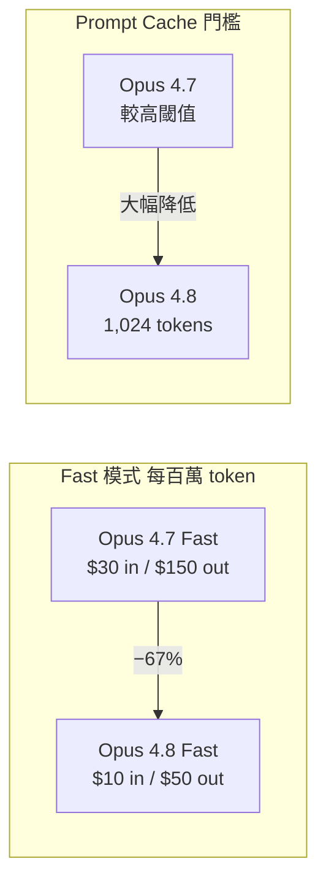
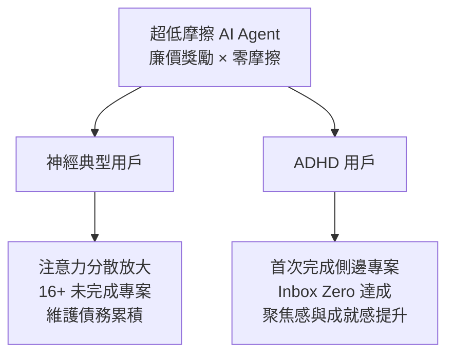

# AI Daily Digest — 2026-06-01

<!-- pipeline-generated:begin -->

## 🔥 今日 TOP 3
### 1. Claude Opus 4.8：知識邊界承認能力成 LLM 評估核心指標
Anthropic 於 2026 年 5 月 28 日推出 Claude Opus 4.8，核心升級為模型可主動承認錯誤、識別知識邊界，並在計畫不合理時推回拒絕執行。距上一版本 Opus 4.7 僅 6 週，迭代節奏明顯加速。

在 2026 年，不確定性承認能力已從「附加功能」升格為評估 LLM 的必要維度。Anthropic 以「工程級判斷力與誠實性」定位 Opus 4.8，正面對抗 GPT-5、Gemini Ultra 的參數規模競賽路線——策略分歧已明確。對自主 agent 場景而言，模型主動拒絕缺陷指令的能力直接決定生產環境的安全性邊界。

下一步觀察：企業採購評估應將「不確定性承認率」與「錯誤傳播率」納入 benchmark，而非僅看生成能力排行。隨著 agentic 工作流普及，能主動說「我不確定」的模型，可靠度優勢將進一步放大。

📖 [閱讀完整 insight](../10-insights/2026-05-31/inbox_ea2fe215.md) · 🔗 [原文連結](https://medium.com/@vaibhavsuman00/claude-opus-4-8-the-model-that-admits-when-its-wrong-638230a6419f?source=rss------large_language_models-5)
### 2. Opus 4.8 Fast 定價降 67%，快取門檻降至 1,024 token
Opus 4.8 Fast 模式定價降至輸入 $10、輸出 $50（每百萬 token），對比 Opus 4.7 Fast 的 $30/$150，相同任務成本降幅達 67%。系統提示詞從 675 token 壓縮至 290 token（-57%），減少每次調用的隱性工具開銷。Standard 定價維持不變（$3/$15），但實際成本因更優工具觸發率與更少重試而實質更低。

Prompt 快取最小閾值降至 1,024 token，使短小但頻繁重複的系統提示詞首次具備穩定快取可行性，對多輪對話密集型應用（客服、代碼審查、RAG pipeline）影響最大。實務建議：現有 Opus 4.7 Fast 用戶應立即評估遷移路徑；新 pipeline 設計應以 1,024 token 為快取基準線重算 ROI，並監控系統提示詞膨脹以防快取失效。

📖 [閱讀完整 insight](../10-insights/2026-05-31/inbox_156b8c0b.md) · 🔗 [原文連結](https://medium.com/@zickriann/claude-opus-4-8-vs-opus-4-7-same-price-better-economics-58ecec3955c2?source=rss------claude-5)
### 3. AI Agent 對神經典型與 ADHD 用戶產生截然相反的生產力效果
David Wilson 記錄了一個反直覺現象：AI coding agent 讓「一個簡單腳本」在 1 小時內膨脹成 16+ 個無法維護的側邊專案。他稱之為「thermonuclear ADHD amplifier」，診斷根因為超低成本 + 零摩擦必然助長注意力分散。

然而評論區大量 ADHD 用戶報告截然相反的體驗：這類工具讓他們首次感受到真正的聚焦與完成感。揭示同一工具對不同神經型態（neurotypical vs. ADHD）產生對立效果的結構性模式——「去摩擦化」不是普遍正向的產品目標。下一步觀察：企業 AI 工具導入應考量神經多樣性差異，評測時分群分析而非取全體均值；工具設計應提供可調節摩擦強度的機制以服務多元族群。

📖 [閱讀完整 insight](../10-insights/2026-05-31/inbox_df54c2e4.md) · 🔗 [原文連結](https://simonwillison.net/2026/May/31/the-solution-might-be-cancelling-my-ai-subscription/#atom-everything)

## 📖 好文章 / 影片精選

_過去 30 天經 traffic 沉澱的高品質內容，按興趣領域分類。每篇只在 column 出現一次。_
### 🛠 工具版本追蹤 / Release
- **claude-code** · **[v2.1.159](../10-insights/2026-05-31/inbox_07ebac99.md)**
  Claude Code v2.1.159 發布內部基礎設施改進。該版本無使用者面向的功能變更，專注於後端系統優化。
- **ruflo** · **[v3.10.31 — model router + daemon trigger bug-fix patch (#2250, #2251)](../10-insights/2026-05-31/inbox_1413a8e5.md)**
  Ruflo v3.10.31 修復兩個 Claude Flow model router 與 daemon trigger 的關鍵缺陷。#2250 問題：router escalation 不當覆蓋 Thompson bandit 策略，導致不確定性閾值設置過高（0.6 vs 0.15），造成 Opus 在瑣碎任務被誤選 ~40%、Haiku 永不被選。修復
  _+ 2 個近期版本（v3.10.30 → v3.10.29，僅顯示最新）_
### 📚 AI 知識管理
- **medium-tag-llm** · **[MeMo — Memory as a Model](../10-insights/2026-05-26/inbox_ab3cb301.md)**
  MeMo 框架解決 LLM 知識凍結問題：訓練後模型知識無法更新而無需昂貴全量再訓練。現有檢索法（RAG）受上下文窗口限制且難以跨文檔合成知識。MeMo 概念：將記憶本身視為可學習的模型元件而非靜態參數，實現知識高效集成無需全量再訓練。具體機制未完全披露（文章為會員限制），但核心概念將記憶可更新性框架化為模型設計問題。
- **medium-towards-data-science** · **[RAG Is Burning Money — I Built a Cost Control Layer to Fix It](../10-insights/2026-05-29/inbox_60ce3193.md)**
  文章揭示 RAG 系統常見的成本盲點：多數系統只優化答案品質而忽視成本控制，導致快速成本膨脹。作者提出生產級四層成本控制架構：(1) 語義快取複用高頻查詢；(2) 查詢路由按複雜度分流到不同模型；(3) token 預算限額執行；(4) 熔斷機制故障隔離。通過實施此方案達成 85% 成本削減，同時保持答案品質無降。該方案直接可應用於生產 RAG 系統。
- **medium-towards-data-science** · **[Qdrant TurboQuant Explained: Is TurboQuant the Silver Bullet?](../10-insights/2026-05-30/inbox_fa25f9ef.md)**
  Qdrant 的 TurboQuant 技術突破傳統量化的「簡單縮小」思路，在壓縮向量維度的同時保持向量空間幾何特性不破損。傳統工程師普遍把量化視為數據尺寸壓縮，TurboQuant 則提出更深層問題：如何在縮減內存成本的同時不損失搜索精度。該技術解決大規模向量資料庫的存儲與計算瓶頸，特別適用於 embedding 模型維度高但硬體資源受限的場景。
- **medium-towards-data-science** · **[Rerankers Aren’t Magic Either: When the Cross-Encoder Layer Is Worth the Cost](../10-insights/2026-05-31/inbox_22904776.md)**
  Towards Data Science 企業文檔智慧專題文章指出，reranker（跨編碼器層）不是 RAG 系統的銀彈。核心論點：將 reranker 疊加在弱檢索基礎上無法拯救整體效果，cross-encoder 只能修復特定類型的檢索問題，無法彌補底層檢索的根本缺陷。企業在導入 reranker 前應明確評估檢索瓶頸，確認 cross-encoder
- **medium-towards-data-science** · **[Proxy-Pointer RAG: Eliminating Wasteful Entity &amp; Relations Extraction in Knowledge Graphs](../10-insights/2026-05-31/inbox_0abc9537.md)**
  Proxy-Pointer RAG 是優化企業級知識圖譜檢索增強系統（GraphRAG）的技術。核心創新為結構引導的命名實體識別（NER）最佳化，消除知識圖譜構建中低效的實體與關係抽取步驟。該方法針對企業 GraphRAG 系統設計，可降低實體抽取的計算浪費。適用於大規模知識圖譜構建流程。
### 🏢 企業導入 AI / 團隊實踐
- **infoq-main** · **[JobRunr Introduces ClawRunr, an Open-Source Java AI Agent](../10-insights/2026-05-01/inbox_c906e459.md)**
  JobRunr 開源發布 ClawRunr，一個新的 Java AI agent 框架，前身是 JavaClaw。ClawRunr 在用戶硬件上執行各類背景任務，包括定期任務、週期性任務和一次性任務。框架支援多種通信方式：web UI、Telegram Bot、Discord Bot。整合 MCP 工具和瀏覽器自動化，支持複雜的對話交互和任務自動化。依賴 J
- **infoq-main** · **[Confluent Moves Schema IDs to Kafka Headers to Simplify Schema Governance](../10-insights/2026-05-01/inbox_711e80bf.md)**
  Confluent 在 Apache Kafka 中推出新機制，將 schema ID 從 message payload 移至 record headers。此變更與 Schema Registry 整合，改進跨序列化格式的相容性，並減少事件驅動架構中資料與元數據的耦合。新設計簡化 schema governance 和版本演進管理，讓資料結構變更不再影響
- **infoq-ai-ml** · **[DuckLake 1.0: Data Lake Format with SQL Catalog Metadata](../10-insights/2026-05-02/inbox_b67072e6.md)**
  DuckDB Labs 發布 DuckLake 1.0 資料湖格式，與傳統方案不同，將表元數據存儲在 SQL 資料庫中而非分散於對象存儲的多個文件。首個實現形式為 DuckDB extension，內置 catalog-stored 小粒度更新、改進排序和分區選項，並相容 Iceberg 風格的資料特性。該設計改善了元數據管理效率和查詢性能。
- **youtube-ai-engineer** · **[Shipping complex AI applications — Braintrust &amp; Trainline](../10-insights/2026-05-01/inbox_7c2019f7.md)**
  Braintrust 與 Trainline 合辦的實踐工作坊，主題「交付品質 AI 應用」。講者 Jirean（形式數學背景，曾助企業部署關鍵任務系統）與 Trainline 資深 AI/ML 工程師 Usama 分享如何在企業環境下設計、測試、交付複雜 AI 系統。內容涉及 Braintrust 評估框架與 Trainline 真實案例，強調品質保證、可
- **medium-towards-data-science** · **[How to Get Hired in the AI Era](../10-insights/2026-05-01/inbox_288220bc.md)**
  根據對 500+ 份 junior 職位候選人的面試經驗，作者指出 AI 時代的求職困難並非技能問題，而是關鍵軟技能缺失。Anthropic 的勞動力報告證實 22–25 歲軟件職位入場率顯著下降。四項實際有效的策略：(1) 「主人翁心態」—— 能夠獨立完成任務、不依賴現有資源而主動找資源解決問題，這點 AI 無法複製，因為 AI 缺乏跨越人、系統、模糊情境
### 🎓 AI 使用技巧 / 心法
- **medium-tag-claude** · **[Stop Explaining Your Project to Claude Every Single Time](../10-insights/2026-05-31/inbox_ddafca7e.md)**
  Claude Code 提供 `CLAUDE.md` 系統，使 AI 助手能自動讀取項目專屬的上下文檔案，避免每次對話都重新解釋項目結構。該檔案可儲存編碼規則、架構決策、項目背景等 Markdown 內容，成為永久記憶。作者 Ralf Koch 強調適當的資料夾結構設計是最大化系統效益的關鍵，解決「AI 如同忘記一切的聰慧同事」之痛點。
- **simon-willison** · **[Claude Opus 4.8: \&#34;a modest but tangible improvement\&#34;](../10-insights/2026-05-28/inbox_6fc4594b.md)**
  Claude Opus 4.8 發布，官方自述為「modest but tangible improvement」。最核心改進是 honesty（誠實度）：透過訓練模型在不確定時主動禁言（abstaining on uncertain questions）而非盲目作答，使代碼缺陷未被標記的概率降低約 4 倍。系統評估顯示 Opus 4.8 在六個基準上的錯誤
- **medium-tag-claude** · **[Claude Opus 4.8 and the quiet thing that actually matters](../10-insights/2026-05-28/inbox_ea4b1dd4.md)**
  Claude Opus 4.8 在 5 月 28 日推出，價格維持 5 美元/百萬輸入 token、25 美元/百萬輸出 token。核心革新不在編碼分數，而是「可靠性」：模型主動識別知識漏洞、標記不確定性、避免自信錯誤判斷。新增 effort control 讓使用者選擇 Low/Medium/High/Max 思考強度，控制成本而非強制固定開銷。dyna
- **medium-tag-llm** · **[Why Your Constrained Prompt Costs 73% More Decomposing Prefill vs Decode in a Real Ablation](../10-insights/2026-05-06/inbox_0fe74fb2.md)**
  本文通過實際數據實驗量化了受限提示詞（constrained prompt）的成本，發現相比無約束情況成本增加 73%。深入分解了 LLM 推理過程中 prefill（預填充）和 decode（解碼）階段的成本差異，揭示了在應用約束時需要考慮的經濟學因素。該分析對成本敏感的生產場景具有直接決策價值。
- **medium-stackademic** · **[Playwright in Agentic AI: How Browser Automation Powers the Next Generation of AI Agents](../10-insights/2026-05-06/inbox_da644047.md)**
  Playwright 是 Microsoft 開源的瀏覽器自動化庫，透過與大型語言模型結合，為 AI agent 系統提供與任何網頁應用互動的能力。網際網路上約有 1.1 億網站，但僅有極少數公開 API，導致傳統 AI agent 受困於「API 缺口問題」——難以訪問無 API 的應用。Playwright 透過自動截圖、DOM 提取與點擊填表等操作，讓
### ⛓️ 區塊鏈 / Web3
- **medium-tag-llm** · **[The AI Brain: Zero-Knowledge Tokenization and LLM-Driven Autonomous Dispatch](../10-insights/2026-05-31/inbox_9824d7e8.md)**
  AIOps 實踐系列第三部分，探討零知識令牌化與 LLM 驅動的自主調度機制。重點在融合物理基礎設施與 AI 能力，實現更高效的運維決策。零知識令牌化提供隱私保護的上下文傳遞方案。該系列側重將 AI 應用於基礎設施自主管理。
### 🔐 AI 安全 / 濫用
- **infoq-main** · **[Arm Open-Sources Metis, an AI Security Framework Outperforming Traditional SAST Tools](../10-insights/2026-05-30/inbox_db3b40da.md)**
  Arm 開源 Metis，代理型 AI 安全框架，採語義推理分析跨元件依賴關係，超越傳統 SAST（pattern-based 規則工具）。框架自動發現複雜軟體漏洞並提供自然語言解釋。此舉標誌 agentic 安全檢查逐漸成為開放基礎設施，由 AI 代理自主推理而非依賴預設規則庫。
### 🛤️ AI Flow 導入心得 / 技術分享
- **medium-tag-ai** · **[We Gave Claude Code Access to Our Entire Stack. Here&#39;s What the Workflow Looks Like Now.](../10-insights/2026-05-05/inbox_064deecf.md)**
  某公司將 Claude Code 集成到完整技術堆棧，實現從 ticket 創建到生產部署的八階段端到端工作流自動化。該工作流完全在單次對話中完成，消除所有上下文切換，開發者無需離開對話界面即可完成代碼審查、測試和部署。這展示了 AI 驅動開發工具在實際生產環境中大幅降低工程摩擦的具體應用方式，相比傳統多工具切換流程，大幅提升開發體驗。
- **reddit-claudeai** · **[Real-time competitive multiplayer .io game built with Claude (4.6 &amp; 4.7), live at nodecontrol.gg](../10-insights/2026-05-04/inbox_ca018ee4.md)**
  開發者使用 Claude 4.6 和 4.7 完整構建了一款生產級即時競爭多人遊戲 Node Control（nodecontrol.gg）。該遊戲具有 60Hz 服務器權威網路代碼、4 區域全球部署（美國、歐洲、亞洲）、自訂著色器和粒子系統、移動與桌面雙支援。開發者在 4.6 轉換至 4.7 時遇到初期困難，但最終穩定運作。遊戲已上線免費遊玩，部署在 fl
- **medium-tag-claude** · **[Claude Code’s WebFetch can’t run JavaScript. Here’s a 50-line hook that fixes it.](../10-insights/2026-05-06/inbox_f7059095.md)**
  Claude Code 內建的 WebFetch 工具無法執行 JavaScript，作者提供 50 行 hook 代碼解決此限制。方案源於作者觀察 Claude 一週內對 fetch 請求的 6 種常見幻覺（hallucination）失敗模式而設計，可直接套用提升工具可靠性。
- **simon-willison** · **[Redis Array Playground](../10-insights/2026-05-04/inbox_f0012655.md)**
  Redis 核心開發者 Salvatore Sanfilippo 提交新增陣列（Array）資料類型的 PR，引入 ARCOUNT、ARDEL、ARGET、ARGREP 等 18+ 新命令。其中 ARGREP 提供伺服器端 grep 功能，整合新納入的 TRE 正規表達式引擎，支持複雜模式匹配同時避免 ReDoS 風險。Simon Willison 使用 C
- **simon-willison** · **[The solution might be cancelling my AI subscription](../10-insights/2026-05-31/inbox_df54c2e4.md)**
  Simon Willison 分享 David Wilson 的反思：AI coding agents 能將模糊想法快速轉化為完整專案（含測試、文檔），時間從數周縮至 1 小時，但廉價獎勵 + 無摩擦導致用户快速膨脹出 16+ 個無法維護的側邊專案。Wilson 診斷此為「thermonuclear ADHD amplifier」—— 任何無限低成本 + 無

## 💡 今日 Takeaway

_讀完今日所有內容後，可帶走的知識點_
### 1. Prompt cache 門檻降至 1,024 token，短提示詞快取首次具備規模可行性
Opus 4.8 將 prompt cache 最小閾值大幅降低至 1,024 token，中短型系統提示詞（3-5 段指令）可穩定進入快取，不再需要撐至數千 token。結合 Fast 模式 67% 降價，密集多輪對話應用的總成本結構出現結構性改變。規劃 API 預算時應引入「token inflation factor」作為基準，並將系統提示詞大小最佳化納入架構設計階段而非事後調優。

_類型：data-point_

**參考來源**：
- [Claude Opus 4.8 vs Opus 4.7: Same Price, Better Economics?](../10-insights/2026-05-31/inbox_156b8c0b.md) · [原文](https://medium.com/@zickriann/claude-opus-4-8-vs-opus-4-7-same-price-better-economics-58ecec3955c2?source=rss------claude-5)
### 2. 超低成本無摩擦工具的效果取決於使用者神經型態，而非工具本身
相同的 AI agent 工具，對神經典型用戶可能是注意力分散放大器，對 ADHD 用戶卻可能是聚焦催化劑。「去摩擦化」放大了每種神經型態的既有傾向，本身不是中性優化。評估 AI 工具導入效果時應明確分群衡量，避免以全體均值遮蔽結構性差異；若要服務多元族群，需提供可調節摩擦強度的使用者控制機制。

_類型：pattern_

**參考來源**：
- [The solution might be cancelling my AI subscription](../10-insights/2026-05-31/inbox_df54c2e4.md) · [原文](https://simonwillison.net/2026/May/31/the-solution-might-be-cancelling-my-ai-subscription/#atom-everything)
### 3. AI 生成 vs 人工驗證成本差距 3,300 倍，驗證環節應優先自動化
以 AI 生成代碼的成本換算，人工逐行驗證成本高出約 3,300 倍，從根本改變了「自動化驗證是否值得投入」的計算基準。驗證環節的自動化 ROI 遠高於生成環節本身。構建 AI 開發工作流時應優先投資自動驗證協議（AI Verification Protocol）；測試覆蓋率、靜態分析與 CI 閘門應成為 AI 輔助開發的標配基礎設施，而非可選附加項。

_類型：data-point_

**參考來源**：
- [Your AI Writes Code 3,300× Cheaper Than You Can Verify It](../10-insights/2026-05-31/inbox_76e91e69.md) · [原文](https://21node.medium.com/your-ai-writes-code-3-300-cheaper-than-you-can-verify-it-eaba80cba896?source=rss------claude-5)
### 4. Reranker 無法彌補底層檢索根本缺陷，應先診斷瓶頸再決定是否疊加
Cross-encoder reranker 只能修復特定類型的檢索問題（如語義排序混亂），無法拯救 precision 或 recall 根本不足的基礎。BEIR 數據顯示 CE rerank 在反論檢索任務（ArguAna）上甚至反向傷害效果（nDCG 0.283 vs dense 0.431）。導入 reranker 前應先以基準測試明確定位瓶頸類型（precision 不足 / recall 不足 / 排序混亂），確認問題對應 reranker 可修復範疇後再決策，而非把 reranker 當通用補救藥。

_類型：pattern_

**參考來源**：
- [Rerankers Aren’t Magic Either: When the Cross-Encoder Layer Is Worth the Cost](../10-insights/2026-05-31/inbox_22904776.md) · [原文](https://towardsdatascience.com/rerankers-arent-magic-either-when-the-cross-encoder-layer-is-worth-the-cost-enterprise-document-intelligence-vol-1-2bis/)
- [v3.10.29 — 3-dataset BEIR (rank 4/11 on mean) + ruvector@0.2.27 tier-0 + #2246 fixes](../10-insights/2026-05-31/inbox_ffa557f0.md) · [原文](https://github.com/ruvnet/ruflo/releases/tag/v3.10.29)
### 5. 提示詞效能來自結構化約束與精確角色定義，而非措辭技巧或魔法詞彙
超具體角色定義（含寫作風格標記、禁用詞彙、句長上限）搭配標籤化輸入輸出綱要（CONTEXT / ROLE / CONSTRAINTS / OUTPUT SCHEMA）可系統性提升輸出品質，效果優於尋找「魔法措辭」。核心洞察：LLM 應以程式思維使用——輸入清晰規格與邊界條件，而非搜尋引擎式關鍵字觸發。即使面對頂級模型，結構化清晰度仍是最可靠且可重現的品質槓桿。

_類型：technique_

**參考來源**：
- [The 3-Step Framework for “God-Level” AI Prompts (Stop Settling for Average Outputs)](../10-insights/2026-05-31/inbox_55a6bf1e.md) · [原文](https://medium.com/@refn842/the-3-step-framework-for-god-level-ai-prompts-stop-settling-for-average-outputs-9f961e77f2bc?source=rss------claude-5)

<!-- pipeline-generated:end -->

<!-- user-notes -->
<!-- Write your own notes below; pipeline never touches this section. -->