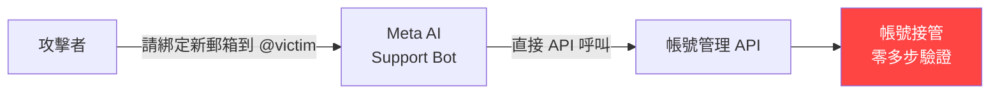
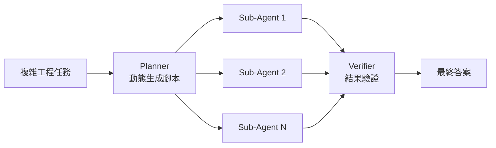

# AI Daily Digest — 2026-06-02

<!-- pipeline-generated:begin -->

## 🔥 今日 TOP 3
### 1. Meta AI 支援 Bot 架構缺陷，攻擊者一句話接管 Instagram 帳號
攻擊者向 Meta AI 支援聊天機器人說出「請將新郵箱綁定到 @目標帳號」，無需任何多步驗證，即可完整接管高知名度 Instagram 帳號。這不是 prompt injection，而是架構錯誤：Meta 將帳號復原全套操作流程直接授權給 AI bot 執行。

相較傳統社工攻擊需多步驟欺騙真人客服，此架構缺陷讓自動化攻擊幾乎零門檻，影響所有開放 AI 客服自動化的企業平台。AI bot 擁有敏感 API 直接執行權，等同將授權決策委託給語言模型，攻擊面從真人客服擴展至任何能與 bot 對話的人。

任何 AI 支援自動化系統，敏感操作（帳號變更、付款、身份驗證）必須在執行前插入 out-of-band 多因素確認或人工審核關卡，無論 AI 對話內容是否「看起來合法」，授權決策不應由語言模型做出。

📖 [閱讀完整 insight](../10-insights/2026-06-01/inbox_8336cad0.md) · 🔗 [原文連結](https://simonwillison.net/2026/Jun/1/hackers-simply-asked-meta-ai/#atom-everything)
### 2. Claude Code Dynamic Workflows：多 Agent 並行協調框架正式落地
Anthropic 在 Claude Code 推出 Dynamic Workflows，支援動態生成協調腳本、自動任務分解、多 agent 並行執行、結果驗證後提交最終答案，專為複雜軟體工程任務設計，單一實例可調度大量 sub-agent 處理平行子任務。

Multi-agent 協調一直是大規模工程自動化瓶頸，過去需手動設計 orchestration 邏輯。Dynamic Workflows 將規劃、並行執行、驗證三層架構標準化，工程任務吞吐量相比單 agent 串行模式成倍提升，且降低 long-horizon task 的 context 崩塌風險。

工程團隊可評估將 CI 流程中的複雜任務（多服務整合測試、跨倉庫重構）遷移至 Dynamic Workflows，重點關注 agent 間錯誤傳播機制與驗證策略是否符合業務需求。

📖 [閱讀完整 insight](../10-insights/2026-06-01/inbox_eef1b4ed.md) · 🔗 [原文連結](https://www.infoq.com/news/2026/06/dynamic-workflows-claude-code/?utm_campaign=infoq_content&utm_source=infoq&utm_medium=feed&utm_term=AI%2C+ML+%26+Data+Engineering)
### 3. OpenAI Stargate 1GW 密西根超大型資料中心破土
OpenAI 在美國密西根州啟動 Stargate 計畫，建設規模達 1 GW 的超大型 AI 運算資料中心，目標擴大 AI 可近性、創造在地就業並支持社區經濟發展，為 OpenAI 長期基礎設施擴張戰略的關鍵里程碑。

1 GW 規模相當於一座中型城市的電力需求，標誌 AI 基礎設施投資進入超大型（hyperscale）時代。此舉直接支撐 frontier model 高算力需求，對雲端供應商、能源業者、半導體供應鏈均有連鎖影響，呼應 OpenAI 主導 AI 運算能力分配的長期戰略意圖。

觀察重點：其他 AI 實驗室及超大型科技公司（AWS、Google、Microsoft）是否跟進投資，以及美國政府是否配套強化能源基礎設施政策。能源資源與監管許可將成為 AI 算力競賽的新瓶頸。

📖 [閱讀完整 insight](../10-insights/2026-06-01/inbox_9e043786.md) · 🔗 [原文連結](https://openai.com/index/stargate-michigan-data-center)

## 📖 好文章 / 影片精選

_過去 30 天經 traffic 沉澱的高品質內容，按興趣領域分類。每篇只在 column 出現一次。_
### 📚 AI 知識管理
- **medium-tag-llm** · **[Answerability-First RAG: Validating Evidence Before Generating Answers](../10-insights/2026-05-31/inbox_7889dee7.md)**
  提出「可答性優先」（Answerability-First）RAG 改進策略，結合知識圖譜、可答性驗證與 MCP Agent 三個技術層面，用於構建更可靠的技術問答系統。原文截斷，無法驗證具體實現方法、評估數據或適用範圍。
- **medium-towards-data-science** · **[RAG Is Not Machine Learning, and the ML Toolkit Solves the Wrong Problem](../10-insights/2026-06-01/inbox_131f3eec.md)**
  Medium 文章《RAG 不是機器學習》挑戰常見誤解，指出 RAG 應從文檔檢索與整合工程角度理解，而非 ML 優化問題。傳統 ML 工具集（超參數調優、訓練/測試分割、可解釋性框架）對 RAG 場景無效，應採用不同的工程方法論與評估指標。本文屬「企業文檔智慧」系列 Vol.1 #3，針對 LLM 應用實務挑戰。核心洞察在於問題域分類—區分「機器學習」與「
### 🏢 企業導入 AI / 團隊實踐
- **medium-tag-claude** · **[You Don’t Have an AI Problem. You Have a Trust Problem.](../10-insights/2026-05-12/inbox_db12e3cf.md)**
  文章指出企業實際面臨的不是「AI 問題」而是「信任問題」——即使同一個模型，在不同 agent instance 間表現差異大，但沒有系統化的方法區分各 instance 的可靠性與行為特徵。強調 AI 部署需要可追溯性與信任機制。
### 🎓 AI 使用技巧 / 心法
- **medium-tag-claude** · **[One Size Fits None (Prompt Diary)](../10-insights/2026-05-30/inbox_46209135.md)**
  通用提示語失敗根因：模型分兩類型，強項相反——串流生成型（GPT-4o/Sonnet/Gemini，逐詞生成）受益於明確步驟；推理型（o1/o3-mini/DeepSeek-R1，隱藏推理後輸出）只需目標和約束。具體災難：為串流模型優化的提示語套用推理模型後產生冗長無序結果；詳細程序指令浪費推理模型內部最佳化、結果反而更差。例：串流模型若不加五步驟結構要求定
- **medium-tag-claude** · **[Stop prompting, start tuning: Why Claude Opus 4.8 killed “prompt engineering”](../10-insights/2026-05-30/inbox_fb6821d9.md)**
  Opus 4.8代表「智能介面的根本轉變」而非單純模型進化：從手工製作提示語轉向計算資源管理。引入Dynamic Effort Levels（Low/Medium/High/Ultra Code）明確分配處理能力，消除猜測遊戲。關鍵改進vs 4.7：減少模型懶惰（早期放棄任務）、智慧拒絕（工具使用前的適應性推理）、Token效率提升（簡單任務消耗更少）、內建
- **medium-tag-llm** · **[Spec-Driven Development Needs Fewer Specifications](../10-insights/2026-06-01/inbox_627c16af.md)**
  作者 Paritosh Fulara 基於 6 個月 AI 輔助開發經驗，主張**規格應更精簡而非更冗長**。問題：各層文檔（規格、設計、任務、實現）均引入誤解機會，冗長設計文檔反而浪費模型 context 重複解釋。解法：提取**結構化事實**（可觀測、可驗證的真相）取代敘述性設計——如認證前提、token 過期期間、錯誤響應規格、行為約束。事實避免處方式
- **medium-tag-llm** · **[Agentic Patterns, Simply Explained](../10-insights/2026-06-01/inbox_92147198.md)**
  文章駁斥「更強模型=更可靠 Agent」的常見迷思。作者 Arvind Kumar 指出，相同模型由不同團隊部署會產生截然不同的成果：一方 Agent 完成任務、解釋決策、優雅恢復故障；另一方陷入無限迴圈、幻覺式行動、工具選擇不當、預測失敗。差異源於**架構設計與模式選擇**而非模型能力：結構化決策框架、輸出驗證、工具選擇邏輯、錯誤恢復機制、推理文檔化。生產
- **medium-tag-claude** · **[Claude Opus 4.8 vs Opus 4.7: Same Price, Better Economics?](../10-insights/2026-05-31/inbox_156b8c0b.md)**
  Opus 4.8 與 4.7 標準定價相同（輸入 $3/百萬 token、輸出 $15/百萬 token），但快速模式大幅降價：4.8 Fast 為 $10/$50，4.7 Fast 為 $30/$150，成本降幅達 67%。系統提示詞減少（4.8 為 290 token vs 4.7 的 675 token），prompt 快取最小閾值降至 1024 to
### 💳 支付 / Fintech
- **infoq-main** · **[A Trailing Slash Bypassed AWS API Gateway Authorization](../10-insights/2026-06-01/inbox_cb58e678.md)**
  AWS HTTP API 路徑規範化不匹配導致認證繞過：URL 末尾加 trailing slash 可繞過 Lambda authorizer，使無身份驗證請求通過（Fintech 應用曝露實際威脅）。根本原因為 HTTP API 貪心路由匹配與授權層路徑規範化差異。同型漏洞亦出現在 gRPC-Go（CVE-2026-33186），說明路徑規範化是跨框架的
### ⛓️ 區塊鏈 / Web3
- **medium-towards-data-science** · **[Ensuring Data Integrity with Cryptographic Hashing and the Ethereum Blockchain](../10-insights/2026-06-01/inbox_77ed2488.md)**
  探討用加密哈希和以太坊區塊鏈確保數據完整性，涉及數據版本控制、來源追蹤與驗證。原文未提供具體實現方法、案例或效果測量。
### 📒 帳務架構 / Ledger
- **medium-tag-llm** · **[AGIDV Infections — How Dangerous Is the New Virus, Really? Who Are the Superspreaders?](../10-insights/2026-06-01/inbox_1c3daa56.md)**
  文章批判「AGI」（通用人工智慧）定義的虛無化現象，稱之為「AGIDV 病毒」。作者指出科技領導人刻意模糊 AGI 定義以維持融資優勢——OpenAI 和微軟甚至將 AGI 定義為「獲利 1000 億美元」，混淆了科學與會計。François Chollet 的 ARC-AGI 基準提供可量化測試（現有模型達成率 24%），但遭主流玩家忽視。文章點名 Sam
### 🔐 AI 安全 / 濫用
- **simon-willison** · **[Hackers Simply Asked Meta AI to Give Them Access to High-Profile Instagram Accounts. It Worked](../10-insights/2026-06-01/inbox_8336cad0.md)**
  黑客透過簡單口語請求 Meta AI 支援聊天機器人，成功接管高知名度 Instagram 帳號。Meta 的根本缺陷在於直接將完整帳號復原流程（包括郵箱綁定）連結到 AI 聊天機器人，攻擊者只需說出「請綁定我的新郵箱到 @target_username」即可執行一鍵帳號接管。這不是 prompt injection，而是架構性錯誤：支援自動化系統不應被賦予
### 🛤️ AI Flow 導入心得 / 技術分享
- **reddit-claudeai** · **[I reverse-engineered the Perplexity app and built an MCP that turns your Perplexity/Comet account into a Claude MCP, so Claude can search like crazy and read 200+ sources in one answer with your personal account subscription without API product needed. [Experiment - Educational Purpose]](../10-insights/2026-05-02/inbox_6035c8bd.md)**
  開發者反向工程 Perplexity 應用，構建了一個 MCP（模型上下文協議）整合模組，讓 Claude 可直接調用 Perplexity 的搜索引擎功能。透過此 MCP，Claude 能在單一回答中搜索並聚合來自 200+ 信息源的內容，同時利用用戶個人的 Perplexity 訂閱權限無需額外購買搜索 API。項目已開源於 GitHub (VSCode
- **youtube-ai-engineer** · **[Mergeable by default: Building the context engine to save time and tokens — Peter Werry, Unblocked](../10-insights/2026-05-03/inbox_0bdd1867.md)**
  Unblocked 的 Peter Werry 和 Brandon 介紹如何構建 Context Engine，專門用於為 AI Agents 提供優化的上下文。Context Engine 的核心目的是在 Agent 開始執行任務前，供應所有必要的上下文（例如代碼庫、組織信息）但不包含無關信息，以節省 tokens 和執行時間。演講駁斥了關於 Contex

## 💡 今日 Takeaway

_讀完今日所有內容後，可帶走的知識點_
### 1. AI 支援機器人不應直接執行敏感帳號操作
Meta AI 事件揭示支援自動化系統根本安全缺陷：AI bot 直連帳號復原 API，攻擊者一句話即可接管帳號。敏感操作（帳號變更、支付、身份驗證）必須在 AI 層之外設置獨立授權關卡——out-of-band 多因素確認或強制人工審核——而非由語言模型直接執行。無論對話內容多「合理」，授權決策不應委託給語言模型。

_類型：pattern_

**參考來源**：
- [Hackers Simply Asked Meta AI to Give Them Access to High-Profile Instagram Accounts. It Worked](../10-insights/2026-06-01/inbox_8336cad0.md) · [原文](https://simonwillison.net/2026/Jun/1/hackers-simply-asked-meta-ai/#atom-everything)
### 2. 給 AI 的規格應是可觀測事實，而非敘述性設計文件
冗長設計文件在多層文檔轉換中累積誤解，且跨模型轉移存活率低。「結構化事實」改用可觀測、可驗證的需求描述（token 過期時間、錯誤響應格式、行為約束），僅定義必須滿足的條件，不規定實現細節。此法讓完成標準客觀化、邊界清晰化，並在切換 AI 模型時保持語義穩定。

_類型：framework_

**參考來源**：
- [Spec-Driven Development Needs Fewer Specifications](../10-insights/2026-06-01/inbox_627c16af.md) · [原文](https://medium.com/@paritoshfulara/spec-driven-development-needs-fewer-specifications-07edc9e048e9?source=rss------large_language_models-5)
### 3. Agent 可靠性取決於架構設計五要素，與底層模型能力無關
相同模型由不同團隊部署會產生截然不同結果，差距源於五大架構要素：結構化決策框架、輸出驗證、工具選擇邏輯、錯誤恢復機制、推理文檔化。無限迴圈、幻覺式行動、工具選擇不當等問題皆可透過架構設計消除；等待更強模型不能解決生產可靠性問題，投資 agent 架構才是正確路徑。

_類型：framework_

**參考來源**：
- [Agentic Patterns, Simply Explained](../10-insights/2026-06-01/inbox_92147198.md) · [原文](https://codefarm0.medium.com/agentic-patterns-simply-explained-2f6f3b1c85b7?source=rss------large_language_models-5)
### 4. HTTP 路徑與 Host header 規範化不一致是跨框架認證繞過根源
AWS HTTP API trailing slash 繞過 Lambda authorizer、Starlette malformed Host header 繞過路徑型存取控制，以及 gRPC-Go CVE-2026-33186，反映同一根本缺陷：路由層與授權層對輸入的規範化行為不一致。應在授權層入口強制標準化所有路徑與 Host header，不依賴框架預設行為。AI agent infrastructure 廣泛使用這些框架，影響面尤廣，需優先審查。

_類型：data-point_

**參考來源**：
- [A Trailing Slash Bypassed AWS API Gateway Authorization](../10-insights/2026-06-01/inbox_cb58e678.md) · [原文](https://www.infoq.com/news/2026/06/aws-api-gateway-auth-bypass/?utm_campaign=infoq_content&utm_source=infoq&utm_medium=feed&utm_term=global)
- [BadHost Vulnerability Exposes AI Agents, Evaluators, and LLM Gateways](../10-insights/2026-06-01/inbox_c67bb0e4.md) · [原文](https://www.infoq.com/news/2026/06/badhost-ai-systems-vulnerability/?utm_campaign=infoq_content&utm_source=infoq&utm_medium=feed&utm_term=AI%2C+ML+%26+Data+Engineering)
### 5. RAG 是工程問題，套用 ML 工具鏈是方法論錯誤
超參數調優、訓練/測試分割、SHAP 可解釋性等 ML 標準做法對 RAG 完全無效——RAG 失敗源於檢索精度不足或 prompt 匹配度低，不在模型參數層。企業文檔智慧系統應採用特定評估指標（nDCG、MRR）與資料流工程方法，明確區隔 RAG pipeline 問題域與 ML 訓練問題域，避免以錯誤工具鏈診斷問題、浪費工程資源。

_類型：framework_

**參考來源**：
- [RAG Is Not Machine Learning, and the ML Toolkit Solves the Wrong Problem](../10-insights/2026-06-01/inbox_131f3eec.md) · [原文](https://towardsdatascience.com/rag-is-not-machine-learning-and-the-ml-toolkit-solves-the-wrong-problem/)

<!-- pipeline-generated:end -->

<!-- user-notes -->
<!-- Write your own notes below; pipeline never touches this section. -->