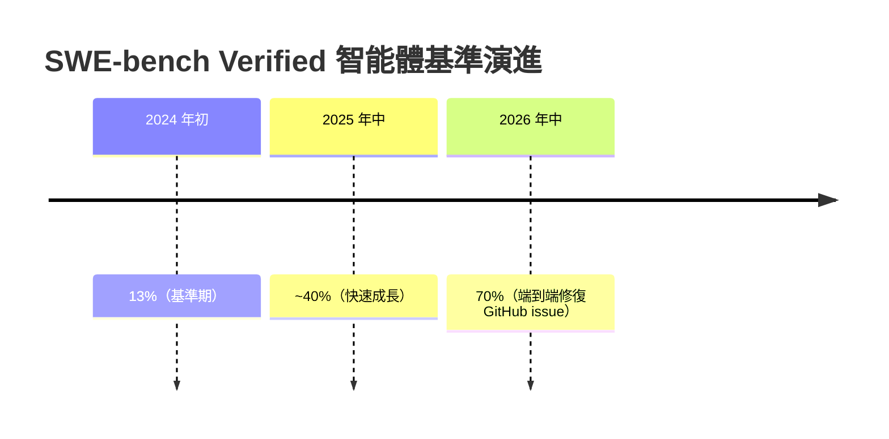
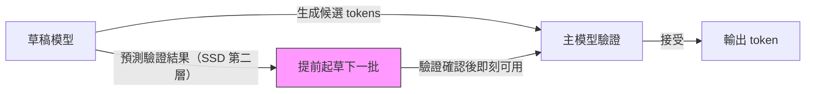

# AI Daily Digest — 2026-06-03

<!-- pipeline-generated:begin -->

## 🔥 今日 TOP 3
### 1. 2026 前沿 AI 全景：超長上下文普及、智能體基準五倍躍升
一份 2026 年中期 frontier AI 盤點指出，超長上下文（1M+ tokens）已可直接應用於整份程式碼庫或財務報表，RAG 管線在 5M tokens 以內的多數場景已無必要。智能體能力出現跳躍式成長，SWE-bench Verified 由 2024 年初的 13% 攀升至 2026 年中的 70%，模型已能端到端修復真實 GitHub issue，而非僅作輔助建議。

此進展對架構決策影響深遠：超長上下文消除大量 RAG 管線建設成本，而開源模型（Qwen 3、Llama 4.1、Gemma 3 27B、Mistral）與 frontier 差距持續縮小，促成混合路由的成本優化空間。對採購與架構決策者而言，超長上下文已成可運作的基礎設施，而非實驗性功能。

幻覺問題依然是結構性風險，訓練成本突破 $5 億大關，評估基礎設施仍是瓶頸。下一步應關注：企業如何設計智能體 QA 機制駕馭 30% 失敗案例、開源模型在安全關鍵任務的可靠性上限，以及跨模型評估基準的標準化進展是否能提供更可信的決策依據。

📖 [閱讀完整 insight](../10-insights/2026-06-02/inbox_e07d9df9.md) · 🔗 [原文連結](https://medium.com/@arihantdeva/frontier-ai-in-2026-what-actually-changed-and-what-did-not-637f70e03742?source=rss------claude-5)
### 2. 微軟推 MAI-Thinking-1 與 MAI-Code-1-Flash，聲稱盲測勝 Claude Sonnet 4.6
微軟推出兩款自研語言模型：35B 參數的 MAI-Thinking-1（推理模型，限提供特選早期夥伴）和 5B 參數的 MAI-Code-1-Flash（針對 GitHub Copilot 和 VS Code 優化，已向個人用戶推出）。微軟聲稱 MAI-Thinking-1 在盲測人類並排評估中優於 Claude Sonnet 4.6，且兩款模型均使用「企業級、乾淨且獲商業授權」資料訓練，宣稱無第三方模型蒸餾。

此舉重要性在兩個維度：其一，若訓練資料授權聲明屬實，這可能是首批在訓練來源透明度上具備企業合規優勢的通用代碼模型，直接影響受版權法規約束的企業選型。其二，MAI-Code-1-Flash 的 5B 小型架構顯示微軟押注低延遲與邊緣部署場景，與 GitHub Copilot 生態深度整合，壓縮競爭對手在 IDE 內嵌市場的空間。

三個關鍵觀察點：(1) MAI-Thinking-1 何時從「早期夥伴限定」解禁，達到可廣泛獨立驗證的程度；(2)「獲得適當授權的資料」的具體構成是否公開（Simon Willison 已正式提出此質疑）；(3) MAI-Code-1-Flash 在 VS Code Copilot 中的實際代碼品質是否具備可量化的差異化優勢。

📖 [閱讀完整 insight](../10-insights/2026-06-02/inbox_285df0b7.md) · 🔗 [原文連結](https://simonwillison.net/2026/Jun/2/microsofts-new-models/#atom-everything)
### 3. 推測推測解碼（SSD）：推理速度不只是優化，而是 AI 能力基礎設施
推測推測解碼（Speculative Speculative Decoding, SSD）在標準投機解碼基礎上加入第二層：草稿模型不只生成候選 tokens，還預測主模型的驗證結果，提前起草下一批序列，消除批次間等待延遲。相較於標準投機解碼的「主模型驗證草稿」單層加速，SSD 實現草稿模型預判驗證、雙層並行的結構。

此框架的核心論點超越技術實現：推理速度與模型能力直接耦合——更快推理代表更多測試時計算預算（test-time compute），讓分支搜尋、自驗證、工具呼叫、RL rollout 都能更深廣。「速度本身是智能基礎設施」重新定義了推理優化的戰略價值，不再只是部署工程問題。

實務應用方向：評估推理堆疊優化方案時，應以「能釋放多少額外計算預算」為衡量指標，而非單純看延遲降幅。長上下文推理和多步智能體任務中 SSD 效益最為顯著，工程師可優先在此類場景驗證實施可行性。

📖 [閱讀完整 insight](../10-insights/2026-06-02/inbox_f3df0841.md) · 🔗 [原文連結](https://chierhu.medium.com/speculative-speculative-decoding-why-inference-speed-is-becoming-a-capability-9e1b63dfa47f?source=rss------large_language_models-5)

## 📖 好文章 / 影片精選

_過去 30 天經 traffic 沉澱的高品質內容，按興趣領域分類。每篇只在 column 出現一次。_
### 🛠 工具版本追蹤 / Release
- **claude-code** · **[v2.1.161](../10-insights/2026-06-02/inbox_5a1108bb.md)**
  Claude Code v2.1.161 發布 25+ 項修復，強化工具呼叫穩定性與可觀測性。OTEL 度量支持自訂維度切分（team、repo）；平行工具呼叫時單一失敗不再中斷其他呼叫，各自獨立返回結果。修復 Windows WSL、worktree 隔離、背景代理、終端渲染等多個平台問題，改進全屏模式剪貼板兼容性（wl-copy/xclip/xsel）。
  _+ 1 個近期版本（v2.1.160，僅顯示最新）_
- **ruflo** · **[v3.10.34 — Security ADR P1 (ADR-144 / ADR-145 / ADR-146)](../10-insights/2026-06-02/inbox_1ad5aa76.md)**
  Ruflo v3.10.34 發布，實現三項安全相關 ADR 的 P1 階段。ADR-144 引入 AgentAuthorizationPropagator（行動層），實施權限範圍檢查，工具集合單調遞減、委派深度遞減、過期檢查，18 個單元測試。ADR-145 實現 PluginIntegrityVerifier（安裝層），透過 Canonical JSON
  _+ 1 個近期版本（v3.10.33，僅顯示最新）_
### 📚 AI 知識管理
- **infoq-main** · **[Article: Why Vector Search Alone Isn&#39;t Enough: Hybrid Retrieval for RAG](../10-insights/2026-06-02/inbox_e0d7aab2.md)**
  Aaditya Chauhan 論證純向量搜尋在 RAG 管線中的局限性。提出混合檢索方案結合倒排索引 (BM25) 與向量搜尋結果，使用 Reciprocal Rank Fusion (RRF) 融合排名。該內部 omni-search 應用改進了搜尋品質。混合策略已成為生產 RAG 系統的實踐標準，彌補向量搜尋在精確詞彙匹配與語義相似性上的各自短板。
- **medium-towards-data-science** · **[From Regex to Vision Models: Which RAG Technique Fits Which Problem](../10-insights/2026-06-02/inbox_f2588417.md)**
  文章建立 RAG 技術診斷框架，從正則表達式到視覺模型涵蓋完整光譜。重點關注企業文件智能和 PDF 處理場景，提供根據問題特性選擇合適 RAG 技術的決策映射。本文為系列開篇，後續將深入各技術細節。
- **medium-tag-llm** · **[Why We Didn’t Build a Knowledge Graph](../10-insights/2026-06-02/inbox_c9bad316.md)**
  企業文件 AI 系統 CogBase 選擇跳過傳統知識圖譜，改採向量儲存 + 結構化儲存 + LLM agent loop 的二層架構。此方案以 1/N 成本覆蓋知識圖譜約 80% 的功能，但權衡上在多跳推理 (6+ 跳) 和全域圖演算法上落後。團隊認為知識圖譜僅在三類場景值得建：安全關鍵性完整性 (藥物交互、詐欺偵測)、超長鏈推理 (6+ 跳規模)、全域圖
- **medium-tag-claude** · **[Frontier AI in 2026, what actually changed and what did not](../10-insights/2026-06-02/inbox_e07d9df9.md)**
  2026 frontier AI 模型景觀盤點：長文本處理已成主流，超長上下文（1M+ tokens）現已可實際應用於整份程式碼或財務報表，RAG 在大多數場景下不再必要。智能體能力大幅進步，SWE-bench Verified 由 2024 初的 13% 跳升至 2026 中的 70%，模型能終端轉終端解決真實 GitHub issue。四款開源模型（Qw
### 🏢 企業導入 AI / 團隊實踐
- **infoq-main** · **[Cloudflare Builds High-Performance Infrastructure for Running LLMs](../10-insights/2026-05-03/inbox_3ac897bf.md)**
  Cloudflare 宣布推出專為大型語言模型設計的新一代運行基礎設施，可在其全球邊界網路上大規模部署和運行 LLM。Cloudflare 認識到 LLM 推論面臨的核心挑戰：昂貴的硬體成本和龐大的文本輸入輸出流量。為了應對，Cloudflare 採用了創新的系統架構：將 LLM 的輸入處理和輸出生成分離到不同的優化系統上。輸入處理系統針對快速處理大量輸入而
- **youtube-ai-engineer** · **[TLMs: Tiny LLMs and Agents on Edge Devices with LiteRT-LM — Cormac Brick, Google](../10-insights/2026-05-03/inbox_c8a05145.md)**
  Google AI Edge 負責人 Cormac Brick 在演講中討論如何在邊界設備上運行 Tiny LLMs 和 Agents。演講者強調 Google 與 Gemma 團隊的合作，利用 LiteRT-LM 技術將模型部署到邊界。最近推出的 Gemma 4 支持 Android/iOS 應用，展示了移動 AI 的最新進展。Cormac 在 Googl
- **medium-towards-data-science** · **[Inference Scaling (Test-Time Compute): Why Reasoning Models Raise Your Compute Bill](../10-insights/2026-05-03/inbox_e349795e.md)**
  本文探討推理模型（reasoning models）在生產環境中導致成本增加的根本原因。推理模型與標準語言模型的核心差異在於進行更深層的思考過程，導致 token 消耗量、推論延遲和基礎設施成本都顯著增加。文章揭示了一個重要的 tradeoff：更好的推理能力需要更高的 test-time 計算代價。這對採用推理模型的團隊具有實務意義，需要在成本和性能之間進
- **medium-tag-ai** · **[20 AI Myths Holding Your Business Back in 2026 (And What’s Actually True)](../10-insights/2026-05-04/inbox_018b32a1.md)**
  作者提出了一個簡明的框架來分類企業對 AI 的常見誤解。該框架將誤解分為兩個極端陣營：一方過度樂觀，將 AI 視為「魔法」並期待一蹴而就；另一方過度懷疑，將 AI 新聞一概視為「炒作」而拒絕嘗試。這種二元對立的思維方式會導致組織做出不理性的決策。文章題目承諾涵蓋 20 項具體的商業迷思及其真相，幫助決策者校正認知。然而，提供的摘要段落未披露這 20 項迷思的
- **medium-tag-llm** · **[The Airbag for the AGI Era: Designing a Universal Governance Hub](../10-insights/2026-05-04/inbox_f0919416.md)**
  提出 AGI 時代的通用治理框架。超越簡單對齊（alignment）概念，構建涵蓋多學科協作、安全性、可靠性與資訊安全的綜合治理中樞，作為 AGI 系統的「安全氣囊」機制。
### 🎓 AI 使用技巧 / 心法
- **reddit-localllama** · **[I catalogued every way local models break JSON output and built a repair library, here&#39;s what I found across 288 model calls](../10-insights/2026-05-11/inbox_750d007c.md)**
  開發者對 288 個 LLM 調用進行了系統化分析，發現所有模型（Llama 3、Mistral、Command R、DeepSeek、Qwen 及多個閉源模型）的 JSON 輸出故障模式幾乎相同。最常見的故障依序為：markdown fences 包裝 JSON、尾部逗號、Python True/False/None 代替 JSON 布林、token 耗盡
### 💳 支付 / Fintech
- **medium-tag-claude** · **[We’re getting dumber by the day with AI, and we have to comply](../10-insights/2026-06-02/inbox_8e19cdea.md)**
  IT 專業人士分享職場壓力下過度依賴 AI 的隱憂。作者指出，為了快速交付而使用 Claude 生成程式碼，導致開發人員與利益相關者都不理解所交付的程式碼；當系統故障時無法獨立除錯，因為缺乏基礎知識。績效評估偏重 AI 工具使用能力而非實際工程技能，進一步減弱深度思考與專業成長。結果是交付量提高但品質下降，員工面臨「必須使用 AI 合規」的隱形壓力。
### ⛓️ 區塊鏈 / Web3
- **medium-tag-claude** · **[What a $500 million Claude bill means: the AI accountants have taken over](../10-insights/2026-06-02/inbox_59f3a0c5.md)**
  某無名公司單月收到 Anthropic Claude 代幣帳單 5 億美元，反映企業 AI 治理缺失與成本失控。該公司無上限開放 Claude 授權予全體使用者，導致支出螺旋式上升。現象背後隱藏「代幣最大化」心理——消耗代幣被視為員工價值證明，進一步推升不必要用量。此事件促發行業轉向成本分析與投資回報評估，從無節制試驗期進入受規範、指標驅動的部署階段。隱喻「
### 🔐 AI 安全 / 濫用
- **infoq-main** · **[How GitHub Is Securing Agentic Workflows in Modern CI CD Systems](../10-insights/2026-05-08/inbox_85ae805d.md)**
  GitHub公佈CI/CD管線中代理工作流的防禦深度安全架構。設計通過三層防護對應代理的核心風險：沙盒環境實現隔離（應對提示注入）、限制權限實現受限執行（應對權限提升攻擊）、完整執行追蹤實現可審計性。架構強調在保留自主代理優勢的同時，通過細粒度權限控制與環境隔離消弭意外動作風險，為代理在CI/CD環境的安全應用提供了系統性設計參考。
### 🛤️ AI Flow 導入心得 / 技術分享
- **reddit-claudeai** · **[Alien Pinball Postmortem - How I made a full physics pinball game with Claude](../10-insights/2026-05-07/inbox_e2efd167.md)**
  開發者用 Claude Code Max (Opus)、ChatGPT 圖像生成、Suno 5.5 音樂、LittleJS 引擎製作全功能彈珠台遊戲《Alien Pinball》(browser + mobile)，包括多球、技術射擊、升級連擊、精靈模式等。工作流程：約 50% 語音轉文字輸入、50% 手動編輯，強調共同開發而非代碼生成。核心洞察：AI 在遊
- **substack-lennys-newsletter** · **[Spec-driven development: The AI engineering workflow at Notion | Ryan Nystrom](../10-insights/2026-05-11/inbox_96034bd8.md)**
  Notion 工程師 Ryan Nystrom 介紹規格優先開發（spec-first development）工作流，展示如何透過 AI agents 自動化軟體開發。此工作流的核心理念是由人類編寫詳細規格，AI agents 根據規格自動編碼實現。自動化機制涵蓋三個方面：自動化每日站會減少團隊同步成本；單一評論觸發完整 PR 工作流，agents 自動編
- **reddit-claudeai** · **[I upgraded my Agent OS to a local 35B model and its code failure rate dropped to 0%](../10-insights/2026-05-11/inbox_09388ba8.md)**
  用户分享本地 35B 参数模型（Qwen 3.6 35B A3B MoE）驱动的多 agent 自适应系统，agents 遇到未知问题时自主编写工具、沙盒测试、热加载，无需人工干预即可构建无限工具库。9B 模型在高压力下容易崩溃与幻觉，而 35B 模型展现出关键的行为转变：不是仓促输出代码，而是主动重新评估失败输出并进行深层内部验证。通过 5 层验证网关，3
- **reddit-claudeai** · **[Built an MCP that gives Claude Code the ability to watch screen recordings of UI bugs](../10-insights/2026-05-10/inbox_b13e919b.md)**
  開發者 Ashad 構建了 motif MCP，讓 Claude Code 能觀看 UI bug 的螢幕錄影。motif 使用 Gemini 2.5 Flash 按幀序列處理視頻（而非單幀截圖），能捕捉 200ms 過衝或懸停狀態重置等時間敏感的視覺問題，自動輸出視覺現象、根本原因和修復 diff。設置只需 Gemini API key 和 mcp.json

## 💡 今日 Takeaway

_讀完今日所有內容後，可帶走的知識點_
### 1. 推理速度即 AI 能力基礎設施：速度提升等於計算預算增加
LLM 推理速度不只影響用戶體驗，更直接決定測試時計算（test-time compute）可用深度——更快推理代表更多分支搜尋、自驗證迴圈和工具呼叫輪次。設計 AI 推理系統時，速度優化與能力提升是同一個目標而非分離工程問題。評估推理堆疊優化方案時，應以「能釋放多少額外計算預算」為主要指標，而非單純看延遲降幅或吞吐量提升。

_類型：framework_

**參考來源**：
- [Speculative Speculative Decoding: Why Inference Speed Is Becoming a Capability](../10-insights/2026-06-02/inbox_f3df0841.md) · [原文](https://chierhu.medium.com/speculative-speculative-decoding-why-inference-speed-is-becoming-a-capability-9e1b63dfa47f?source=rss------large_language_models-5)
### 2. 知識圖譜三類場景才值得建：6+ 跳推理或安全關鍵才引入
向量搜尋 + 結構化儲存 + LLM agent loop 可以 1/N 工程成本覆蓋知識圖譜約 80% 使用場景，2–4 跳以內 LLM 檢索效能已接近圖結構。只有三類場景才值得引入知識圖譜：安全關鍵性完整性需求（藥物交互、詐欺偵測）、6+ 跳超長推理鏈、或需全域圖演算法（中心性分析、社群檢測）的場景。規劃企業文件 AI 架構時，先確認多跳推理深度需求再決定是否引入圖資料庫，可避免早期過度工程化與維護負擔。

_類型：framework_

**參考來源**：
- [Why We Didn’t Build a Knowledge Graph](../10-insights/2026-06-02/inbox_c9bad316.md) · [原文](https://medium.com/@luo.junius/why-we-didnt-build-a-knowledge-graph-be19ca51225b?source=rss------large_language_models-5)
### 3. 無限制 AI 授權產生「token 最大化心態」，月帳單可達 5 億美元
案例顯示，當企業無上限開放 Claude 授權，消耗 token 數量會成為員工努力的代理指標，引發螺旋式支出，單月帳單達 $5 億美元。企業 AI 部署必須同步建立三項治理機制：per-team 預算上限、ROI 量化追蹤、及用量可見性儀錶板。從「盡情實驗」轉向「指標驅動部署」不只是成本控制，更是讓 AI 投資可持續的前提——無治理機制的 AI 採用可快速演變為財務災難。

_類型：data-point_

**參考來源**：
- [What a $500 million Claude bill means: the AI accountants have taken over](../10-insights/2026-06-02/inbox_59f3a0c5.md) · [原文](https://medium.com/enrique-dans/what-a-500-million-claude-bill-means-the-ai-accountants-have-taken-over-9caa40106846?source=rss------claude-5)
### 4. AI 代碼生成量翻倍但無品質管控，技術債與除錯能力同步惡化
過去 6 個月 AI agent 驅動的代碼生成量翻倍，但多數團隊未同步強化審查與可維護性標準，導致開發者無法理解或獨立修改 AI 產出的代碼，除錯能力弱化；績效激勵若以 AI 工具使用頻率取代工程技能為考核指標，會進一步扭曲學習動機。有效反制模式：量（生成速度）與質（可理解性）分開追蹤，設立「開發者能獨立解釋和修改」作為代碼驗收門檻，而非以產出量為唯一指標。

_類型：pattern_

**參考來源**：
- [Ideas: slow down to speed up when working with AI agents](../10-insights/2026-06-02/inbox_14f023db.md) · [原文](https://newsletter.pragmaticengineer.com/p/ideas-slow-down-to-speed-up-when)
- [We’re getting dumber by the day with AI, and we have to comply](../10-insights/2026-06-02/inbox_8e19cdea.md) · [原文](https://medium.com/@pop.kristina1/were-getting-dumber-by-the-day-with-ai-and-we-have-to-comply-f91fe021bd79?source=rss------claude-5)

<!-- pipeline-generated:end -->

<!-- user-notes -->
<!-- Write your own notes below; pipeline never touches this section. -->