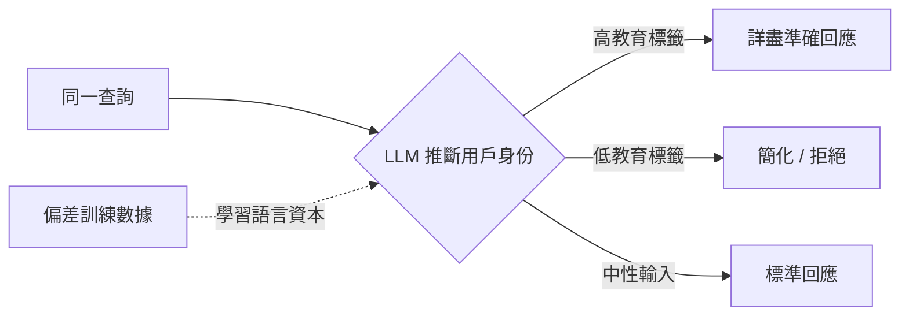
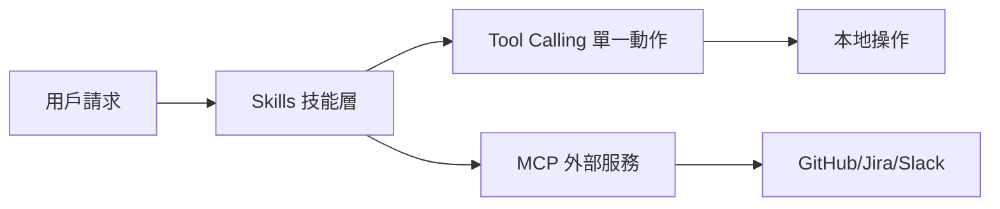

# AI Daily Digest — 2026-06-04

<!-- pipeline-generated:begin -->

## 🔥 今日 TOP 3
### 1. Uber AI 月費上限：代理編碼工具年耗薪資一成
Uber 因四個月燒光 2026 年 AI 預算，對每名工程師每套 agentic 編碼工具（Cursor、Claude Code）實施 $1,500/月上限，雙工具並用年度上限 $36,000，佔中位薪資 $330,000 的 11%；實測中等使用量約 $1,000/月/供應商。

費用結構從固定授權轉為按 token 浮動消耗，服務商可靜默調整 tokenizer 比率在不改價下隱性提高實際支出，是傳統軟體訂閱所沒有的隱形通膨風險。與前代 Copilot $19/月固定訂閱相比，agentic 工具的成本波動性已是不同量級。

財務規劃建議引入 10–20% token inflation factor 緩衝，並以量化指標（PR 速度、bug 率）定期驗證工具 ROI，確保開支有實績依據。

📖 [閱讀完整 insight](../10-insights/2026-06-03/inbox_ab1cbae3.md) · 🔗 [原文連結](https://simonwillison.net/2026/Jun/3/uber-caps-usage/#atom-everything)
### 2. LLM 差異化回應揭示語言資本偏見被 AI 放大
研究揭示 LLM 根據推斷的用戶教育背景，對相同查詢提供截然不同品質的回應：被判定高學歷者獲得詳盡準確答案，低教育標籤查詢則收到簡化或拒絕回應，源於偏差訓練數據中習得的隱性統計模式。

布迪厄「語言資本」框架的 AI 版：模型習得「誰的語言值得重視」，將人類社會語言不平等複製至輸出。此偏見分散於整個語義空間，難以被單點測試捕捉，對金融、醫療等高影響力場景構成系統性公平風險。

實務對策：設計語義相同但複雜度不同的輸入對進行對抗測試，在評估框架加入跨語言風格的回應品質一致性指標。

📖 [閱讀完整 insight](../10-insights/2026-06-03/inbox_b590ba3f.md) · 🔗 [原文連結](https://medium.com/@suleimansambo/god-gave-language-to-everyone-the-machine-disagrees-adb5c1712806?source=rss------large_language_models-5)
### 3. 三層 AI 架構：工具/技能/MCP 互補而非競爭
三個常被混淆的概念實為互補層級：Tool Calling 讓模型執行單一外部操作；Skills 將工作流與知識封裝為可重用高層能力（如 ProductionIncidentAnalysis 內含完整方法論）；MCP 開放標準標準化跨平台外部服務連接，不改變模型調用機制。

規模化 agent 系統時直接暴露大量工具會造成提示膨脹、token 成本激增與工具選擇歧義。技能層讓模型在正確抽象層次操作，是解決擴展瓶頸的關鍵設計決策，相較早期「工具大禮包架構」有根本改進。

新建 agent 系統三步驟：先定義技能邊界（What），再設計工具接口（How），最後配置 MCP 外部連接（Where）。

📖 [閱讀完整 insight](../10-insights/2026-06-03/inbox_9742ddca.md) · 🔗 [原文連結](https://mihirdave95.medium.com/tool-calling-vs-mcp-vs-skills-why-modern-ai-systems-ended-up-needing-all-three-4de8d021810a?source=rss------large_language_models-5)

## 📖 好文章 / 影片精選

_過去 30 天經 traffic 沉澱的高品質內容，按興趣領域分類。每篇只在 column 出現一次。_
### 🛠 工具版本追蹤 / Release
- **claude-code** · **[v2.1.162](../10-insights/2026-06-03/inbox_49f0f6fe.md)**
  Claude Code v2.1.162 發布，引入多項改善與修復。新增 `claude agents --json` 輸出 waitingFor 欄位顯示阻擋原因（如權限提示）；Grep/Glob 工作在原生編譯版本上可用；斜線指令自動補全改為點擊填入而非立即執行；Remote Control 改為持久化 footer 顯示。修復 Windows 路徑識別
- **rtk** · **[v0.42.1](../10-insights/2026-06-03/inbox_c407d9a5.md)**
  RTK v0.42.1 發布，修復 openclaw 元件中的 execSync 危險命令執行問題。該修復避免在非同步操作環境中直接呼叫同步執行函式，提高系統穩定性和安全性。
### 📚 AI 知識管理
- **infoq-ai-ml** · **[Article: Why Vector Search Alone Isn&#39;t Enough: Hybrid Retrieval for RAG](../10-insights/2026-06-02/inbox_62c97592.md)**
  論文分析純向量搜尋在 RAG 應用中的限制，提出互惠排名融合（RRF）混合 BM25 和向量搜尋的混合方案。內部 omni-search 應用驗證顯示混合策略優於單一向量方法，透過結合密度型（BM25）和語義型（embedding）檢索提升搜尋品質。
- **medium-tag-llm** · **[A Beginner’s Guide to Retrieval-Augmented Generation (RAG)](../10-insights/2026-06-03/inbox_10a5797b.md)**
  本初學者指南將 RAG（檢索增強生成）分解為三步驟流程。索引化：文檔分割為可管理塊、轉換為數值嵌入表示、存儲於向量存儲（類似「組織有序的圖書館」）。檢索：用戶問題轉換為嵌入並與儲存文檔比較，系統通過相似度搜索找到最相關塊（「寶藏獵人尋找最匹配頁面」）。生成：檢索文檔連同問題與指令提示被放入 LLM 上下文窗口，模型基於實際文檔而非訓練數據生成答案。核心優勢：
### 🏢 企業導入 AI / 團隊實踐
- **substack-product-compass** · **[Claude Code for PMs: The Beginner&#39;s Guide](../10-insights/2026-05-12/inbox_a5a45403.md)**
  Claude Code 推出面向產品經理的初學者指南，無需程式背景也能上手。使用者透過安裝工具、配置 MCP servers、構建 skills，即可運行免費的 frontier models。該指南提供 ready-to-use 模板，大幅降低非技術背景 PM 使用 AI coding 工具的門檻，擴大了 Claude 在非開發者社群的可及性。
### 🎓 AI 使用技巧 / 心法
- **medium-tag-llm** · **[You’re not testing the model. Here’s what LLM evaluation actually means.](../10-insights/2026-06-03/inbox_6f402ec8.md)**
  本文重構 LLM 評估方法論：大多數團隊測試的是錯誤對象。不應試圖評估模型本身（無法控制），而應測試完整系統——配置、約束與處理邏輯的全棧。核心見解：無法窮舉測試自然語言輸入（詞彙組合近乎無限），應聚焦高風險面。作者提出測試層級：精確匹配（JSON 等確定性輸出）、正則/關鍵詞匹配、語義相似度、混合方案。系統提示是主要行為控制槓桿，應針對角色忠誠度、拒絕邏輯
- **medium-tag-llm** · **[Tool Calling vs MCP vs Skills: Why Modern AI Systems Ended Up Needing All Three](../10-insights/2026-06-03/inbox_9742ddca.md)**
  本文澄清工具調用、MCP、技能三者不是競爭關係而是互補層級。工具調用（Tool Calling）使模型決策執行外部操作，但規模化時直接暴露眾多工具導致提示膨脹、token 成本增加、工具選擇歧義。技能（Skills）將專業知識與工作流打包為可重用能力——「工具是動作，技能是能力」，例如 ProductionIncidentAnalysis 技能內含方法論與檢
- **medium-tag-claude** · **[How to Ship Production-Ready Apps Before Your AI Runs Out of Tokens](../10-insights/2026-06-03/inbox_8e6ec4de.md)**
  本文重新定義了 AI 輔助開發的瓶頸：並非 AI 代碼生成能力，而是人類有效指導 AI 的能力。在 token 預算有限的約束下，精確表述需求、迭代反饋和決策成為交付生產就緒應用的關鍵。該觀點強調了人機協作中人類側的效率優化，開發者需掌握更高效的 prompt 工程與問題分解技能，才能在 token 限制下最大化開發效率。這是 AI 時代軟體工程的新範式轉變
- **medium-tag-llm** · **[When Thinking Too Much Breaks AI](../10-insights/2026-05-12/inbox_c46e7d25.md)**
  揭示 AI 推理時過度思考（extended chain-of-thought）反而降低輸出品質的現象，並提出 D-CoT（推斷為 Divide-and-Conquer CoT 或 Directed CoT）作為改進方案。這與「更多思考步驟 = 更好輸出」的直觀認知相悖，挑戰了無限制推理的有效性。D-CoT 透過有限度的推理結構化來平衡準確性與計算成本。
### 🔐 AI 安全 / 濫用
- **openai-blog** · **[Building a safe, effective sandbox to enable Codex on Windows](../10-insights/2026-05-13/inbox_58f92841.md)**
  OpenAI 為 Codex 在 Windows 上的執行構建了專有沙箱環境，以確保代碼代理的安全與高效運作。沙箱透過受控的文件訪問與網路限制隔離代碼執行，防止代碼逸出邊界或造成系統威脅。此方案論證了在受限環境中安全執行不可信代碼的可行性——既允許開發者使用 AI 生成的代碼，又防止惡意或無意中的破壞，具有跨應用泛用性（容器化開發環境、多租戶代碼執行等）。
### 🛤️ AI Flow 導入心得 / 技術分享
- **medium-towards-data-science** · **[I Built the Same B2B Document Extractor Twice: Rules vs. LLM](../10-insights/2026-05-13/inbox_dc272eeb.md)**
  作者用規則式和 LLM 兩種方法實現 B2B 文件提取器，進行實務對比。規則式方案使用 pytesseract 進行 PDF 提取，LLM 方案採用 Ollama 本地執行 LLaMA 3 模型。以現實的 B2B 訂單場景為基準，展示兩種方法的優缺點，包括準確度、成本、部署複雜度等差異。

## 💡 今日 Takeaway

_讀完今日所有內容後，可帶走的知識點_
### 1. LLM 系統評估採安全測試心態：映射失效面優先
因自然語言輸入組合空間近乎無限，窮舉測試根本不可行；正確心態是假設系統必然存在失效點並系統性映射影響範圍。建立三層斷言體系：確定性輸出用精確匹配、存在性檢查用正則/關鍵詞、開放回應用語義相似度。系統提示應進行同義詞替換、間接措辭與注入嘗試的對抗測試，優先覆蓋高影響力失效面。

_類型：framework_

**參考來源**：
- [You’re not testing the model. Here’s what LLM evaluation actually means.](../10-insights/2026-06-03/inbox_6f402ec8.md) · [原文](https://medium.com/@anmolsoin1/youre-not-testing-the-model-here-s-what-llm-evaluation-actually-means-237e176efe98?source=rss------large_language_models-5)
### 2. Agent 規模化應引入技能層以避免提示膨脹
直接暴露大量個別工具會導致工具列表膨脹、token 成本上升與選擇歧義。技能層將相關工具、方法論與決策邏輯封裝為單一高層能力單元，讓模型只需知道「我有 X 能力」而非「需按順序調用 A、B、C」。這是從工具集合走向能力架構的關鍵設計轉變，是大規模 agent 系統可維護性的核心差異點。

_類型：framework_

**參考來源**：
- [Tool Calling vs MCP vs Skills: Why Modern AI Systems Ended Up Needing All Three](../10-insights/2026-06-03/inbox_9742ddca.md) · [原文](https://mihirdave95.medium.com/tool-calling-vs-mcp-vs-skills-why-modern-ai-systems-ended-up-needing-all-three-4de8d021810a?source=rss------large_language_models-5)
### 3. 外部化 agent 狀態：降九成 token 成本
LangGraph 預設 MemorySaver 存於記憶體，負載均衡路由至不同伺服器時必然丟失對話歷史；粘性會話在故障或擴展時同樣失效。改用 AsyncPostgresSaver 將每個節點執行後的狀態序列化至 BYTEA 欄位、以 user_id + session_id 組成 thread_id，確定性對話前綴可使 Claude 提示緩存命中率穩定，降低約 90% token 成本。

_類型：technique_

**參考來源**：
- [Managing LangGraph State Across Multiple Servers Using PostgreSQL](../10-insights/2026-06-03/inbox_b39730a5.md) · [原文](https://medium.com/@venkatanaveen.avvaru/managing-langgraph-state-across-multiple-servers-using-postgresql-e3c87e62c058?source=rss------large_language_models-5)
### 4. AI 數據代理瓶頸在語義對齊，非 SQL 生成能力
即使 SQL 語法完美，選錯數據表或誤解欄位語義仍導致分析完全失準。對 AI 數據代理系統的投資優先級應是語義元數據層（表意圖描述、欄位別名、業務術語映射），而非繼續優化 SQL 生成模型。此模式適用所有需在龐大 schema 中定位正確數據的 AI 系統：語義層 ROI 遠高於執行層優化。

_類型：pattern_

**參考來源**：
- [How OpenAI Built Its Data Agent](../10-insights/2026-06-03/inbox_d3e2245d.md) · [原文](https://blog.bytebytego.com/p/how-openai-built-its-data-agent)
### 5. 代理編碼工具月耗 $1k 佔薪資一成，應含通膨緩衝
Uber 案例提供可信成本基準：中等使用量約 $1,000/月/供應商，雙工具年度上限可達薪資的 11%。費用結構為按 token 浮動消耗，服務商調整 tokenizer 比率可在不改標價下隱性增加支出。財務規劃建議引入 10–20% token inflation factor，並定期以量化指標驗證工具 ROI 確保開支有效益依據。

_類型：data-point_

**參考來源**：
- [Uber Caps Usage of AI Tools Like Claude Code to Manage Costs](../10-insights/2026-06-03/inbox_ab1cbae3.md) · [原文](https://simonwillison.net/2026/Jun/3/uber-caps-usage/#atom-everything)
## ⏳ 待處理 (5 筆)

<!-- pipeline-generated:end -->

<!-- user-notes -->
<!-- Write your own notes below; pipeline never touches this section. -->