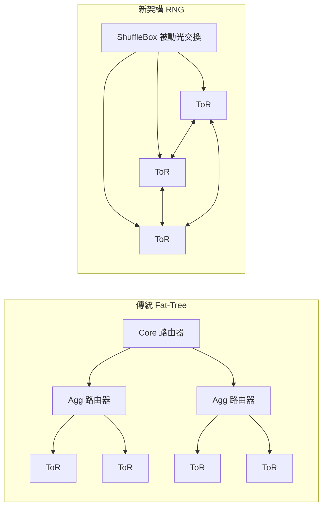
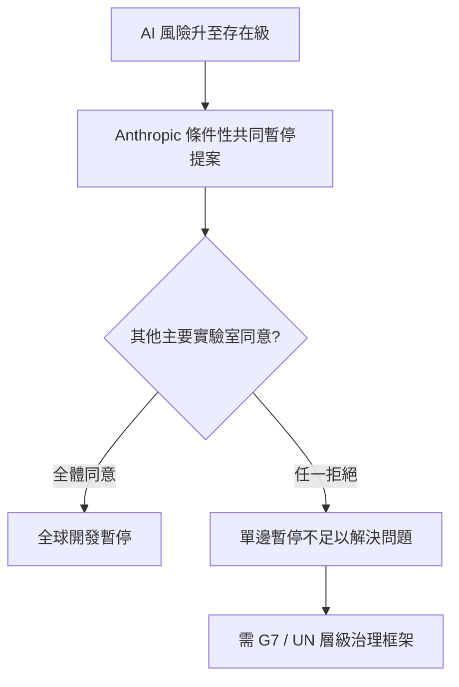

# AI Daily Digest — 2026-06-05

<!-- pipeline-generated:begin -->

## 🔥 今日 TOP 3
### 1. AWS 以隨機圖論重構資料中心網路，路由器減少 69%
AWS 正式發布「Resilient Network Graphs」(RNG) 架構，以基於準隨機圖論的被動光學 ShuffleBox 直接連接 Top-of-Rack (ToR) 交換機形成網格，取代沿用數十年的分層 fat-tree 設計，並已成為所有新建資料中心的預設架構方案。

相較於傳統 fat-tree，RNG 同時實現路由器數量減少 69%、整體吞吐量提升 33%、網路功耗降低 40%，代表同一資本投入可獲得更低硬體成本、更高頻寬與更低電費的三重收益。這種以跨學科理論（圖論）突破傳統工程慣例的架構轉型，對大規模雲端服務商的競爭成本結構影響深遠，也預示資料中心設計思維的範式轉移。

觀察重點在於 Google Cloud 與 Azure 是否跟進採納圖論驅動的網路拓撲，以及 RNG 在分散式 AI 訓練集群中的實際延遲表現。基礎設施工程師現在可開始研究準隨機圖（quasi-random graph）理論，評估其在自有數據中心或私有雲網路規劃中的適用性。

📖 [閱讀完整 insight](../10-insights/2026-06-04/inbox_0447b4b2.md) · 🔗 [原文連結](https://www.infoq.com/news/2026/06/aws-random-graph-data-center/?utm_campaign=infoq_content&utm_source=infoq&utm_medium=feed&utm_term=Architecture+%26+Design)
### 2. Anthropic 提出 AI 全球協調暫停的條件性框架
Anthropic 發表重要安全聲明，宣稱 AI 系統已進入「自我構建」(self-building) 新階段，同時提出條件性承諾：若全球其他主要 AI 開發機構同意暫停開發，Anthropic 願意跟進；若任何一方拒絕，單邊暫停則被視為不足且具競爭不公平性。

此聲明的核心意義在於將 AI 安全責任的層級從企業自律，正式升格為需要「全球協調」的外部性問題，直接挑戰現行各公司自主治理的模式。這為政府監管機構提供了明確的政策論據；若此框架被接受並推進，AI 服務的可用性、定價穩定性與技術研發節奏都可能受到系統性約束，影響所有在 AI 研發與採購端佈局的機構。

觀察重點：OpenAI、Google DeepMind、Meta 是否對此提案公開表態，以及 G7 或聯合國 AI 治理峰會是否就條件式暫停機制啟動正式討論。CTO 和 CISO 應將此類政策風險納入 AI 供應商的長期穩定性評估框架。

📖 [閱讀完整 insight](../10-insights/2026-06-04/inbox_0cd643d1.md) · 🔗 [原文連結](https://medium.com/@AarSee/anthropic-warns-ai-building-itself-says-ready-to-pause-development-if-others-do-the-same-c26ed7ef2fea?source=rss------claude-5)
### 3. MiniMax M3 開源，百萬 token 上下文首次向社群開放
中國 AI 公司 MiniMax 於 2026 年 6 月 1 日正式開源釋出 M3 模型權重，支援 100 萬 token 超長上下文窗口，具備原生多模態能力（文本、圖像、音頻整合），並在編碼任務達到同期 SOTA 水準。

此前，百萬 token 級別的長上下文能力與完整多模態整合主要集中於 OpenAI、Anthropic、Google 等閉源商業模型。M3 的開源意味著這些能力邊界首次向社群開放，研究人員、新創公司與企業可自行微調部署，顯著降低建構大規模長文件分析與跨模態代理應用的成本門檻，同時對現有商業 API 的採用決策形成替代壓力。

觀察重點包括 M3 在 MMLU、HumanEval、RULER 等標準基準的完整評測結果，以及社群在超長文件摘要、多模態代理場景的實際測試回報。工程師現在可評估 M3 是否能取代依賴閉源 API 的長文件處理管道，並試算自部署的 TCO（總擁有成本）是否優於當前 API 費用。

📖 [閱讀完整 insight](../10-insights/2026-06-04/inbox_bb0fe0b0.md) · 🔗 [原文連結](https://medium.com/@ffguci8/minimax-m3-the-open-weight-sota-model-that-rewrites-the-rules-4fe318056d22?source=rss------large_language_models-5)

## 📖 好文章 / 影片精選

_過去 30 天經 traffic 沉澱的高品質內容，按興趣領域分類。每篇只在 column 出現一次。_
### 🏢 企業導入 AI / 團隊實踐
- **simon-willison** · **[datasette-referrer-policy 0.1](../10-insights/2026-05-05/inbox_71e30ba2.md)**
  Datasette 全球發電廠演示的 OpenStreetMap 地圖因兩個 bugs 無法正常顯示。首先，datasette-turnstile CAPTCHA 誤攔截地圖插件的 .json fetch 請求，導致地圖無法加載；其次，OpenStreetMap 會拒絕帶有 Referrer-Policy: no-referrer HTTP 標頭的 tile
- **infoq-main** · **[Google New TPU Generation is Specifically Designed for Agents and SOTA Model Training](../10-insights/2026-05-06/inbox_4fc7e0b0.md)**
  Google 發佈第 8 代 TPU（張量處理單元），配備兩個專門設計的晶片，針對 AI agent 工作流和最新模型訓練進行優化。該代 TPU 強調支援多步驟推理、多模型分佈執行和連續行動迴路，相比前代在性能、記憶體和能源效率上均有提升。此發布反映 Google 對 agent 運算需求的重視，預期將加速企業 AI agent 部署。
- **infoq-main** · **[Article: Beyond the Benchmark: A Metrics-Driven Approach to Sustained iOS Performance on Real Devices](../10-insights/2026-05-06/inbox_1bcae3b5.md)**
  iOS 性能工程文章提出核心觀點：性能應理解為應用代碼、設備硬體、作業系統資源管理、網路條件和用戶行為模式相互作用產生的涌現行為，而非單一元件的固有屬性。文章提供透過 Xcode Instruments 直接捕獲實設備性能問題的方法論，幫助開發者從系統整體視角診斷和優化性能。
- **infoq-main** · **[Presentation: How Netflix Shapes our Fleet for Efficiency and Reliability](../10-insights/2026-05-05/inbox_ac2965f9.md)**
  Netflix 分享在全球規模下平衡服務效率與可靠性的核心思維模型。演講介紹「風險調整淨值」心法，超越傳統 CPU 利用率指標，重點置於容量緩衝區。Netflix 採用硬體整形、主動流量引導和反應式負載棄置（含分級負載棄置策略「hammers」），來保護關鍵功能（如播放）。該框架對大規模系統架構設計具參考價值。
- **infoq-architecture** · **[Article: Three Pillars of Platform Engineering: a Virtuous Cycle](../10-insights/2026-05-05/inbox_af0b554e.md)**
  InfoQ 文章探討 Platform Engineering 三大支柱：自動化可靠性、開發人員人體工程學和運營人員人體工程學。作者論述這三者形成良性循環而非對立權衡：人體工程學差的平台反而會透過人為錯誤降低可靠性。核心概念包括用 control plane 持續協調期望狀態實現自動化（placement、self-healing、rebalancing）、
### 🎓 AI 使用技巧 / 心法
- **medium-tag-claude** · **[Claude Opus 4.8 Just Dropped. But DeepSeek Already Made the Price Look Awkward.](../10-insights/2026-05-28/inbox_ae5a8e04.md)**
  Claude Opus 4.8 發布後面臨根本性定價挑戰。DeepSeek V4-Pro（2026-04-24 發布）：1.6T 參數、49B active tokens/step、1M context、MIT 授權、可自託管，性能只略遜 Opus 幾分點但價格低 30 倍。此對比破壞了專有 frontier 模型的價格論證：同一效能層級下，開源自託管選項幾
- **infoq-ai-ml** · **[OpenAI Open-Sources Symphony, a SPEC.md for Autonomous Coding Agent Orchestration](../10-insights/2026-05-17/inbox_edf3cd01.md)**
  OpenAI 開源 Symphony，一個代理編排框架，以 issue tracker 等項目管理工具作為控制平面，協調多個自主編碼代理完成任務。替代傳統互動式開發工作流——開發者不再逐行與單個代理互動，而由 Symphony 自主分配任務給專門代理，最後由人工審查結果。這改變了 AI 輔助開發的協作模式，從即時對話轉為異步任務驅動。
- **medium-tag-claude** · **[Do the service by hand before you automate it](../10-insights/2026-06-04/inbox_f04c0a99.md)**
  Brandon 主張自動化前必須手動執行服務，獲得市場反饋而非純粹工程估算。「手動交付不是退步，而是有收據的市場研究。」文章列舉五個自動化前的檢驗標準：(1) 重複性——做過多次？(2) 影響——提升收入/效率/減錯/決策？(3) 市場——有付費客戶嗎？(4) 可手動性——v1 能不靠軟體運作？(5) 可證明性——結果清晰可見？三個服務案例：網站稽核（手動評
### 📒 帳務架構 / Ledger
- **infoq-architecture** · **[30+ Updates per Second per Account: Uber Scales Ledger Processing with Batching](../10-insights/2026-06-04/inbox_32fceb61.md)**
  Uber 開發高效能金融帳本處理系統，採用 250ms 批處理、Redis 協調和樂觀原子性更新機制，在分散式會計基礎設施中支援每個帳戶 30+ 次更新/秒，同時保證資料一致性和審計可追溯性。系統將原有的多小時處理管道壓縮至分鐘級。這是應對分散環境中「寫熱點」(hot account write contention) 的典範方案，結合批處理窗口與樂觀鎖策略
### 🔐 AI 安全 / 濫用
- **medium-tag-claude** · **[Anthropic warns ‘AI building itself’ says ready to pause development if others do the same](../10-insights/2026-06-04/inbox_0cd643d1.md)**
  Anthropic發表重要安全警告，指出AI系統已進入「自我構建」(self-building)新階段。公司提出條件性承諾：如果全球其他AI開發機構同意暫停開發，Anthropic願意停止自身開發。此舉將AI安全責任從單一公司升級至全球協調層面，建立「單邊暫停不足」的治理框架。
- **reddit-localllama** · **[\&#34;Elias Thorne\&#34; is what eight different LLMs name a lighthouse keeper. He&#39;s also selling cancer treatment advice on Amazon](../10-insights/2026-05-17/inbox_b2195c83.md)**
  研究者發現 8 個不同的 LLM 獨立生成相同虛擬人物名字「Elias Thorne」（燈塔看守人設定），該身份隨後被用於在 Amazon 上販售虛假癌症治療建議，展示 agentic content generation 時代合成內容泛濫的具體風險。文章旨在貢獻「如何在內容生成成本趨近零的時代維護網際網路品質」的重要對話。
- **reddit-claudeai** · **[Natural Language Autoencoders: Turning Claude’s thoughts into text](../10-insights/2026-05-07/inbox_dda2f1bb.md)**
  討論者分享對「自然語言自編碼器」(NL Autoencoders) 研究的反應，該研究將 Claude 的內部思想轉換為文本。提出三個擴展應用方向：(1) 是否能配合 Anthropic 早期工具識別 Claude 何時「隱藏」思想；(2) 檢測不對齊時的特定語法模式；(3) 在「我們讀取它的思想，但它有時完全隱藏」與「建立謊言檢測器」之間的軍備競賽中，該走
### 🛤️ AI Flow 導入心得 / 技術分享
- **youtube-ai-engineer** · **[Accelerating AI on Edge — Chintan Parikh and Weiyi Wang, Google DeepMind](../10-insights/2026-05-05/inbox_085bed0c.md)**
  Google DeepMind 講者展示邊緣 AI 的實踐：Gemma 4 邊緣模型系列、LiteRT（Google AI Edge Stack）在 Android、iOS、desktop、web、IoT 的統一部署。涵蓋延遲 vs 隱私 vs 成本的權衡、本地工具呼叫、結構化輸出、CPU/GPU/NPU 硬體加速和基準測試。影片提供邊緣 AI 當前棧和發展
- **medium-towards-data-science** · **[How to Make Claude Code Validate its own Work](../10-insights/2026-05-05/inbox_21ce6a95.md)**
  Towards Data Science 文章論述讓 Claude Code 自我驗證的實踐方法。核心收益：一次性實現率更高（iteration 次數少）、模型可持續運行更久（直到自己驗證成功）、能完成更複雜工作。作者對比 Fibonacci 例子說明無驗證機會如同盲目寫代碼；而自我驗證讓 Claude Code 迭代優化。涵蓋長 LLM 處理時間等具體案例
- **reddit-localllama** · **[ProgramBench: Can we really rebuild huge binaries from scratch? (doesn&#39;t look like it)](../10-insights/2026-05-05/inbox_9d9d5b89.md)**
  Meta 等機構開源 ProgramBench，一個 200 個任務的基準測試，用於評估 AI agent 從零開始重建大型二進制文件的能力。Agent 僅獲得目標可執行檔和 readme，無互聯網存取、無反編譯。為防止作弊和提升任務多樣性，團隊耗費 $50k 生成 600 萬行行為測試並篩選最佳版本。目前公開的結果為閉源模型，開源模型表現更差（因過度擬合 
- **reddit-localllama** · **[Use Qwen3.6 right way -&gt; send it to pi coding agent and forget](../10-insights/2026-05-05/inbox_93834ade.md)**
  社群使用者基於 2 個月實踐推薦以 pi.dev（agentic coding 框架）作為 Qwen 3.6 35B 的主要執行環境，搭配 exa web search 與 agent-browser 外掛，宣稱可覆蓋 80% 個人使用場景（編程、機器維運、web 研究）；並採多模型策略，複雜規劃外包 Kimi 2.6。核心發現：執行框架的選擇影響力優於模型
- **reddit-claudeai** · **[I built an iOS Currency Converter using Claude (Opus &amp; Sonnet) to help with my move to the UK](../10-insights/2026-05-05/inbox_b9c7f5c5.md)**
  7 年 iOS 開發經驗的工程師用 Claude 構建 Converty——實時貨幣轉換 + 相機掃描物理價標籤的應用。工作分配：Claude Opus 處理架構與核心邏輯（80%），Sonnet 快速反覆與除蟲（20%）。開發週期 2 週概念驗證、1 個月 UI/UX 拋光。掃描精度仍優化中。應用免費上架（App Store ID 6759520648）。

## 💡 今日 Takeaway

_讀完今日所有內容後，可帶走的知識點_
### 1. 代碼交付速度超越理解速度時，需刻意建立組織反饋迴路
當 AI 加速交付使代碼產出速度超過工程師閱讀與理解的速度，系統脆弱性與機構知識流失會靜默累積，形成難以量化的「信任債務」。AI 樂觀者與懷疑者雙方都有真實的存在性憂慮，但因缺乏自然溝通管道，兩個陣營各說各話，無法共享同一現實認知。解法在於組織設計層面刻意建立反饋迴路——例如定期可讀性回顧（readability review）、由技術懷疑者主持的故障後分析（post-mortem）——讓速度與可靠性的張力獲得可見的平衡點。

_類型：framework_

**參考來源**：
- [AI enthusiasts are in a race against time, AI skeptics are in a race against entropy](../10-insights/2026-06-04/inbox_1e5014cf.md) · [原文](https://simonwillison.net/2026/Jun/4/ai-enthusiasts-ai-skeptics/#atom-everything)
### 2. ADR 應加入變更案例維度，量化決策的時間序列可逆性
傳統 Architecture Decision Record 只記錄當下最優選擇，卻忽略「此決策未來改變時要付出多少代價」。架構變更案例（Architectural Change Cases）框架要求決策者明確列出隱含假設及其失效條件，並估算可逆性成本，將決策思維從單點快照升級為時間序列視角。在 AI 工具鏈快速迭代的環境中，這一維度能有效降低因廠商鎖定造成的技術債，讓後續重構代價在決策前就可見、可量化。

_類型：framework_

**參考來源**：
- [Article: Architectural Change Cases: A Practical Tool for Evolutionary Architectures](../10-insights/2026-06-04/inbox_7d25b561.md) · [原文](https://www.infoq.com/articles/architectural-change-cases/?utm_campaign=infoq_content&utm_source=infoq&utm_medium=feed&utm_term=Architecture+%26+Design)
### 3. AI 代理設計應優先確保可靠性，而非追求智能上限
構建能穩定執行、優雅降級並從錯誤中恢復的代理，比讓代理解決更難的問題更具挑戰性，也更有實務部署價值。設計代理時，「故障恢復路徑」與「邊界情況處理」應先於「能力提升」列入規格與驗收標準。評測套件（eval suite）的重點應涵蓋失敗模式而非只測試成功案例——一個 95% 準確但失敗時行為不可預測的代理，往往比 85% 準確但可預測的代理更難投入生產環境。

_類型：framework_

**參考來源**：
- [How to Design an AI Agent](../10-insights/2026-06-04/inbox_17077691.md) · [原文](https://codefarm0.medium.com/how-to-design-an-ai-agent-2e20eb234802?source=rss------large_language_models-5)
### 4. 批處理窗口 + 樂觀鎖可突破分散式系統的熱帳戶寫入瓶頸
在高頻財務或計數場景中，對單一熱點資源每秒 30+ 次更新會觸發分散式鎖競爭，成為吞吐量天花板。以固定批處理窗口（如 250ms）彙整同期更新，配合協調層（Redis）與樂觀原子性提交，可在保證一致性的前提下避免鎖開銷，並將多小時管道縮短至分鐘級。此模式可普遍應用於高頻計費、積分扣減、庫存扣減等熱點寫入場景，是分散式系統設計中值得收錄的標準模式。

_類型：pattern_

**參考來源**：
- [30+ Updates per Second per Account: Uber Scales Ledger Processing with Batching](../10-insights/2026-06-04/inbox_32fceb61.md) · [原文](https://www.infoq.com/news/2026/06/uber-payment-batching-system/?utm_campaign=infoq_content&utm_source=infoq&utm_medium=feed&utm_term=Architecture+%26+Design)
### 5. 自動化前先手動驗證市場需求，以真實收據取代工程假設
在投入自動化工程前，先以純人工方式完成同等服務交付，可用更低成本驗證市場實際需求。五個評估關卡——重複性、影響力、市場存在、手動可行性、可證明性——缺一則自動化時機未到。第一個付費客戶不在意用機器還是人工交付，只在意結果；手動交付的過程同時也是積累領域知識的最佳途徑，確保後續自動化工程建立在真實的付費需求基礎上，而非工程師的主觀臆測。

_類型：framework_

**參考來源**：
- [Do the service by hand before you automate it](../10-insights/2026-06-04/inbox_f04c0a99.md) · [原文](https://brandonwio.medium.com/do-the-service-by-hand-before-you-automate-it-9306365d8ea1?source=rss------claude-5)

<!-- pipeline-generated:end -->

<!-- user-notes -->
<!-- Write your own notes below; pipeline never touches this section. -->