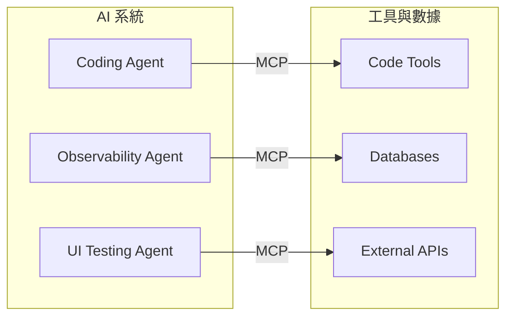
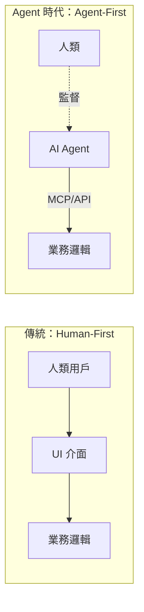

# AI Daily Digest — 2026-06-06

<!-- pipeline-generated:begin -->

## 🔥 今日 TOP 3
### 1. MCP 成為 AI 生態的 USB-C 標準協議
Anthropic 推動的 Model Context Protocol（MCP）正從開放標準快速演進為 AI 生態的通用連接層，LinkedIn、Dropbox 等頭部企業已在生產環境部署，統一編碼代理、觀測代理與 UI 測試代理等多類工作負載，成為企業級多代理系統的基礎設施層。

MCP 解決的核心問題是 AI 整合碎片化：過去每家公司需自行實作工具橋接層，造成大量重複工程投入。類比 USB-C 統一計算設備的實體連接，MCP 讓符合協議的工具與數據源即插即用，大幅降低整合成本；隨生態擴張，未支援 MCP 的工具將面臨邊緣化壓力，類似早年不支援 REST 的 API 被市場淘汰的命運。

企業應立即評估現有工具鏈的 MCP 相容性，新工具選型時將 MCP 支援列為必要條件；平台工程師的下一步是建立公司內部 MCP Server 目錄，形成統一編排層，讓 AI 能力可複用而非重複造輪。

📖 [閱讀完整 insight](../10-insights/2026-06-05/inbox_3afbd60b.md) · 🔗 [原文連結](https://codefarm0.medium.com/how-mcp-works-18a64f47d5ac?source=rss------large_language_models-5)
### 2. AI 系統「致命三角」與出站限制防禦框架
OpenAI 向 ChatGPT 個人（Free/Go/Plus/Pro）及商業帳戶推出 Lockdown Mode，這是可主動開啟的功能，透過限制所有出站網路請求切斷提示詞注入攻擊的資料外洩管道，正式成為可部署的 AI 安全防禦選項。

Simon Willison 提出的「Lethal Trifecta（致命三角）」框架精準描述 LLM 系統核心漏洞：①能存取私密資料、②會暴露不受信任內容、③存在外洩通道——三者同時成立即可無聲竊取機密。Lockdown Mode 採用確定性規則而非 AI 判斷，規避難度遠高於軟性過濾；其存在同時暗示 ChatGPT 預設設定對資料外洩缺乏強健防護。

設計 LLM 應用時應優先評估「切斷流出管道」的可行性，此路徑成本最低且最難規避；企業採購 AI 工具時應以「是否具備可控出站限制機制」作為安全審查標準之一；個人用戶在 ChatGPT 處理敏感文件時應主動啟用 Lockdown Mode。

📖 [閱讀完整 insight](../10-insights/2026-06-05/inbox_3c5c08e8.md) · 🔗 [原文連結](https://simonwillison.net/2026/Jun/5/openai-help-lockdown-mode/#atom-everything)
### 3. AI Agent 時代無頭軟體架構革命
軟體架構正面臨根本轉型：AI agent 取代人類成為應用的主要使用者，傳統 GUI 設計正被 API 優先、數據流驅動的「無頭（headless）架構」取代。Dropbox 的 Nova 平台、LinkedIn 的多代理編排層均印證此趨勢在頭部企業已進入生產落地階段。

此轉變的意義在於競爭優勢的來源正在位移：過去靠介面易用性贏得用戶，未來靠「機器可讀性」——標準化協議（MCP）、結構化數據契約、agent 工作流相容性成為新的差異化來源。預測 2030 年最強大的軟體可能完全沒有人類介面，而是純 agent-to-agent 通訊網絡。

開發者現在應評估：現有產品哪些核心功能缺乏機器可讀 API？MCP Server 是否已暴露所有關鍵動作？2026-2027 年是布局「agent-ready 基礎設施」的戰略視窗，早期行動者在 AI agent 生態成熟後將取得顯著先機。

📖 [閱讀完整 insight](../10-insights/2026-06-05/inbox_231e86e0.md) · 🔗 [原文連結](https://blog.devgenius.io/the-architecture-of-autonomy-why-software-is-becoming-headless-again-28bdb127b2a6?source=rss------large_language_models-5)

## 📖 好文章 / 影片精選

_過去 30 天經 traffic 沉澱的高品質內容，按興趣領域分類。每篇只在 column 出現一次。_
### 🛠 工具版本追蹤 / Release
- **claude-code** · **[v2.1.167](../10-insights/2026-06-06/inbox_8693a388.md)**
  Claude Code v2.1.167 發布，包含 bug 修復和可靠性改進，但未公開具體變更細節。
  _+ 2 個近期版本（v2.1.166 → v2.1.165，僅顯示最新）_
- **hermes-agent** · **[Hermes Agent v0.16.0 (2026.6.5) — The Surface Release](../10-insights/2026-06-06/inbox_5fc1f97e.md)**
  Hermes Agent v0.16.0 (The Surface Release) 推出全新原生桌面應用，支援 macOS/Linux/Windows 一鍵安裝、拖放檔案、狀態列模型選擇、自動更新。新增遠端 Hermes gateway 連接，桌面 GUI 可透過 OAuth/帳密連接遠端伺服器，支援多設定檔並行工作階段。Web 管理面板升級為完整後台，支
- **rtk** · **[v0.42.3](../10-insights/2026-06-05/inbox_6e3157e8.md)**
  RTK v0.42.3 發布。新增 Copilot CLI 原生整合。修復內容：許可協議從 MIT 改為 Apache 2.0、輸出管道化時防止當機、grep 單檔案輸出解析修正、ls 八進位權限資訊保留、bash 行延續折疊修正、gh/glab 子命令 ID 檢查改進、多位元組字元 panic 修復。新增葡萄牙文文檔翻譯。
  _+ 1 個近期版本（v0.42.2，僅顯示最新）_
### 📚 AI 知識管理
- **medium-tag-llm** · **[LLM-as-a-Judge: The Reliability Pattern Behind Production GenAI Systems](../10-insights/2026-06-06/inbox_c70a446a.md)**
  Medium 文章介紹 LLM-as-a-Judge 架構模式在生產級 GenAI 系統的應用，可用於 RAG 等系統的品質評估與可靠性驗證。原文內容未提供完整細節。
### 🏢 企業導入 AI / 團隊實踐
- **simon-willison** · **[AI enthusiasts are in a race against time, AI skeptics are in a race against entropy](../10-insights/2026-06-04/inbox_1e5014cf.md)**
  Charity Majors 通過 Simon Willison 指出，AI 領域存在一個根本的組織動態問題。AI enthusiasts 看到非連續性能力飛躍，擔心不參與者會被競爭對手淘汰，這是真實的存在威脅。AI skeptics 則看到代碼速度超越工程師理解速度的危害：系統複雜度爆炸、可靠性下降、機構知識流失，這也是真實威脅。根本問題是兩個群體缺乏自然
- **medium-tag-llm** · **[We Built the Perfect Data Strategy — for Three Years Ago](../10-insights/2026-06-05/inbox_28367dc2.md)**
  數據治理的目標正在根本轉變：從「幫助人類理解數據」進化到「幫助 AI 理解業務邏輯與上下文」。傳統數據策略（BI、數據倉庫）針對人類分析優化，但 AI agent 時代要求結構化業務知識，使 AI 系統準確理解企業語境。作者指出許多組織仍沿用三年前的架構，未考慮 AI 作為主要數據消費者的需求差異。新框架必須同時服務人類與 AI，強調語義清晰度與上下文完整性
- **infoq-main** · **[AWS WorkSpaces Now Lets AI Agents Operate Legacy Desktop Applications Without APIs](../10-insights/2026-05-13/inbox_b82e7a2b.md)**
  AWS WorkSpaces 進入公開預覽，支援 AI agents 操作遺留桌面應用。Agents 通過 IAM 認證，使用計算機視覺與輸入模擬繞過缺失 API。Reflex 基準測試顯示視覺 agents 比 API 驅動方案消耗 token 量多 45 倍，成為跨應用自動化的成本關鍵決策點。
### 🎓 AI 使用技巧 / 心法
- **medium-tag-claude** · **[See the prompt before you ship it](../10-insights/2026-06-06/inbox_47750dab.md)**
  標題強調「出貨前看見提示詞」，指出多數團隊發現提示詞過長是看帳單才知道、逼近上下文限制也是後知後覺。文章介紹工具「context-lens」，提供兩種模式分析：(1) 實時啟發式計數（~3.7 字符/token）；(2) 精確模式直呼 Anthropic API 的 `/v1/messages/count_tokens` 端點。案例對比：精簡版提示詞 612
- **medium-tag-claude** · **[The AI Dilemma — We Can Build Almost Anything Now. So What Should We Build?](../10-insights/2026-05-14/inbox_e937ca40.md)**
  完成 Anthropic Claude AI 認證課程前 3 門後，作者 Sharry 提出 AI 時代的核心轉變：執行能力不再稀缺（AI 已全面解決），**決策能力——決定做什麼**——成為新瓶頸。AI 為四類應用開闢空間：(1) 任務自動化，(2) 個人問題解決，(3) 思考夥伴，(4) 規模化輸出。在能力商品化的時代，競爭優勢由技術執行力轉移到**清晰
### 💳 支付 / Fintech
- **medium-tag-llm** · **[Thousand Token Wood: emergent market drama from 3-billion-parameter agents](../10-insights/2026-06-05/inbox_a87a480e.md)**
  Lester Leong 在 Build Small Hackathon（2026年6月）打造了一個實時多代理經濟模擬系統，使用 Qwen2.5-3B-Instruct 模型驅動五個森林生物角色，展示小模型在推理任務中的應用。關鍵發現是「小模型本質上是可靠的格式生成器，但推理能力不穩定」——不是透過升級到大模型，而是透過結構化提示（structured pr
- **medium-tag-llm** · **[The Inference Problem is the Real AI Problem](../10-insights/2026-06-05/inbox_cac52a92.md)**
  Manuj Arora 主張 AI 業界誤將焦點放在模型訓練和基準測試，而忽略真正的挑戰：推理（inference）——以可靠且經濟的方式將模型部署至實際用戶。基礎設施（infrastructure）才是競爭戰場，不是原始模型能力。訓練對大多數組織不可及（成本數億美元、需數千 GPU），真正的難題在於服務現有模型。推理問題包括三部分：(1) 成本——GPU 
- **hackernews** · **[Gov.uk has replaced Stripe with Dutch provider Adyen](../10-insights/2026-06-05/inbox_7fbbd425.md)**
  英國政府宣布 Gov.uk 支付系統已從美國的 Stripe 遷移至荷蘭的 Adyen。此一決定由英國政府數位服務部門（GDS）公佈。Adyen 作為全球支付解決方案提供商，接替 Stripe 處理英國政府的支付事務。此舉涉及政府關鍵基礎設施的供應商變更。決定的背景和詳細實施計劃可在 GDS 部落格和 Adyen 官方新聞稿中進一步了解。
### ⛓️ 區塊鏈 / Web3
- **medium-tag-claude** · **[Developers Shock: How the New Usage Based Billing GitHub Copilot Broke the Bank](../10-insights/2026-06-06/inbox_f1bb70b9.md)**
  GitHub Copilot 於 2024 年從固定訂閱制轉為按使用量計費（按完成次數計費）。「代幣燃燒綜合症」現象浮現：開發團隊生成完成量超出預期，導致帳單陡升，在社群引發「成本可預測性、價值感知、AI 輔助開發經濟學」的激烈辯論。此事件被視為 AI 工具定價轉折點，衍生大量段子與戰爭故事。文章指出使用量計費模式暴露了開發工作流中的隱性成本預期，但具體定價
### 📒 帳務架構 / Ledger
- **infoq-main** · **[30+ Updates per Second per Account: Uber Scales Ledger Processing with Batching](../10-insights/2026-06-04/inbox_70b65de7.md)**
  Uber 推出高吞吐分散式財務分類帳系統，採用 250ms 批次視窗、Redis 協調和樂觀原子更新，達成每帳戶 30+ 更新/秒，同時保留強一致性和完整可審計軌跡。系統將原本耗時數小時的多道會計處理管道縮減至分鐘級，大幅降低分散式帳務基礎設施延遲。
### 🔐 AI 安全 / 濫用
- **simon-willison** · **[OpenAI Help: Lockdown Mode](../10-insights/2026-06-05/inbox_3c5c08e8.md)**
  OpenAI 推出 Lockdown Mode，現已上線供個人帳戶（Free/Go/Plus/Pro）及自服務 ChatGPT Business 帳戶使用。該功能限制出站網路請求，防止 prompt injection 攻擊的資料外洩階段。Simon Willison 分析指出，LLM 系統的「Lethal Trifecta」威脅包括：①訪問私密資料、②暴露
### 🛤️ AI Flow 導入心得 / 技術分享
- **infoq-architecture** · **[How OpenAI Built a Secure Windows Sandbox for Codex Agents](../10-insights/2026-06-05/inbox_44c50a06.md)**
  OpenAI 詳細介紹了 Codex 在 Windows 環境中的沙箱架構設計，展示了如何用 OS 級別的安全原語來安全執行自主編程代理。該設計使用了四層關鍵機制：SIDs（安全標識符）、ACLs（訪問控制列表）、restricted tokens（受限令牌）和 sandbox accounts（沙箱賬戶），每層都負責不同的隔離維度。設計的精妙之處在於平衡了
- **medium-tag-llm** · **[How The Washington Post Scaled LLMs for Taxonomy Classification](../10-insights/2026-06-05/inbox_4cba26b5.md)**
  華盛頓郵報工程團隊開發了一套 LLM 驅動的分類系統替代商業解決方案，處理約 20,400 個分類法條目（5 個 schema：主題 ~2,100 個、人物/公司/組織/地理 ~18,300 個）。核心問題是規則型系統缺乏透明度和迭代速度，而「樸素的 LLM 提示不適用」於 20,000+ 候選項（文脈溢出、成本爆炸、幻覺產生）。解決方案採用雙管道：(1) 
- **infoq-main** · **[Article: Building a Secure MCP Server on AWS for a Million-Company B2B Platform](../10-insights/2026-05-18/inbox_d97baf32.md)**
  InfoQ 刊登 Shadi Elyafi 的文章，介紹如何在 AWS 上構建安全的 MCP（Model Context Protocol）server，以暴露超過 100 萬份企業資料到 LLM 應用。該方案的核心挑戰是在不破壞生產環境安全的前提下，讓 LLM 能安全查詢企業資料（如「搜尋德國 50–200 人規模 SaaS 公司」）。文章闡述了核心工程設

## 💡 今日 Takeaway

_讀完今日所有內容後，可帶走的知識點_
### 1. 提示詞成本 PR 前計量，語義等價可差 6 倍
兩個語義等價的智能體提示詞相差 612 vs 3,847 tokens，在日均 10,000 次呼叫下可造成每月約 $3,000 的成本差距。解決方案是在部署前使用 Anthropic `/v1/messages/count_tokens` API 精確計量，並將 token 計數納入 CI/CD PR 審查流程。建議三步驟：基準化現有提示詞 → 每個 PR 附 token 計數 → 季度追蹤成本—功能比，讓成本決策從事後帳單分析前移至設計階段。

_類型：framework_

**參考來源**：
- [See the prompt before you ship it](../10-insights/2026-06-06/inbox_47750dab.md) · [原文](https://medium.com/@ferhatatagun/see-the-prompt-before-you-ship-it-91ee42f72483?source=rss------claude-5)
### 2. 切斷外洩管道是 AI 安全最短防禦路徑
LLM 系統的「致命三角」——私密資料存取 + 不受信任內容暴露 + 外洩通道——三者同時成立才形成真實威脅，防禦最短路徑是切斷外洩通道而非修補前兩者。確定性規則（如封鎖出站請求）比讓 AI 自行判斷是否洩漏更可靠，因後者可被精心設計的提示詞規避。設計 LLM 應用時應優先問：「這個系統有沒有讓資料流出的管道？」，確認後再考慮更複雜的防禦層。

_類型：framework_

**參考來源**：
- [OpenAI Help: Lockdown Mode](../10-insights/2026-06-05/inbox_3c5c08e8.md) · [原文](https://simonwillison.net/2026/Jun/5/openai-help-lockdown-mode/#atom-everything)
### 3. LLM 候選集超 75 項後精準度驟降，需前置過濾
當 LLM 需從大量候選中選擇時（推薦、分類、標籤分配），候選集超過 75 項會顯著降低判別精準度，應先用統計或規則方法（模糊 n-gram、嵌入相似度）縮減至 50–75 項再交由 LLM 做最終判斷。直接讓 LLM 處理 20,000+ 選項導致上下文溢出、幻覺增加、成本爆炸。華盛頓郵報用此雙管道架構在手工標註集上將主題分類 F1 從 0.653 提升至 0.919，業務側廣告定位與編輯推薦均驗收通過。

_類型：technique_

**參考來源**：
- [How The Washington Post Scaled LLMs for Taxonomy Classification](../10-insights/2026-06-05/inbox_4cba26b5.md) · [原文](https://washpost.engineering/how-the-washington-post-scaled-llms-for-taxonomy-classification-bc390ed8e2fb?source=rss------large_language_models-5)
### 4. Agent 沙箱安全應組合多層 OS 原語縱深防禦
為 AI agent 設計沙箱時，應組合多個 OS 安全原語（SID 資源隔離 + ACL 存取控制 + 受限 token + 沙箱帳號）而非依賴單一隔離機制，每層負責不同攻擊面形成縱深防禦。過度隔離會使 agent 無法完成真實開發任務，設計目標是「恰好足夠的隔離」——平衡安全強度與工作流相容性。此模式可推廣至任何需要在本地環境安全執行自主 agent 的場景。

_類型：technique_

**參考來源**：
- [How OpenAI Built a Secure Windows Sandbox for Codex Agents](../10-insights/2026-06-05/inbox_44c50a06.md) · [原文](https://www.infoq.com/news/2026/06/codex-windows-sandbox-design/?utm_campaign=infoq_content&utm_source=infoq&utm_medium=feed&utm_term=Architecture+%26+Design)
### 5. AI 真正競爭戰場是推理基礎設施非模型榜
對多數組織而言，訓練大模型不可及（成本數億美元），真正的 AI 競爭在推理層：成本（GPU 效率）、延遲（序列生成瓶頸）、可靠性（冷啟動、記憶限制）三角決定生產可行性。開源創新如 vLLM PagedAttention、推測解碼改善了效率，但企業級生產環境缺口（合規認證、成本追蹤、可觀測性）仍大。制定 AI 策略時應先問「推理層夠健壯嗎？」，而非「用哪個最新模型？」

_類型：pattern_

**參考來源**：
- [The Inference Problem is the Real AI Problem](../10-insights/2026-06-05/inbox_cac52a92.md) · [原文](https://medium.com/@aroramanuj1/the-inference-problem-is-the-real-ai-problem-5d8fdd4cb662?source=rss------large_language_models-5)

<!-- pipeline-generated:end -->

<!-- user-notes -->
<!-- Write your own notes below; pipeline never touches this section. -->