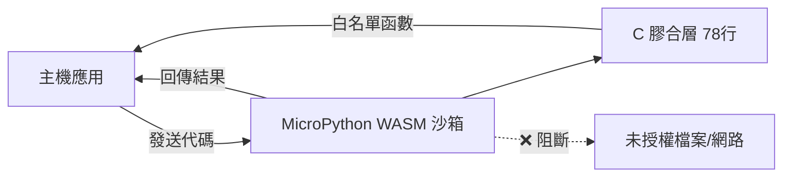
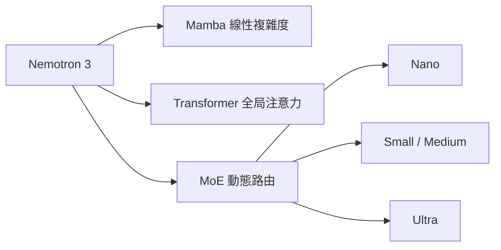

# AI Daily Digest — 2026-06-07

<!-- pipeline-generated:begin -->

## 🔥 今日 TOP 3
### 1. WASM 沙箱讓插件安全執行並保留跨調用狀態
Simon Willison 在 datasette-agent-micropython 項目中發布了一套以 MicroPython、WebAssembly 與 wasmtime 構建的沙箱化代碼執行方案，核心以 78 行 C 膠合層和 362KB WASM 二進制實現。透過線程隊列機制，沙箱支持跨多次調用的變數與函數持久化，並以成對主機函數 __session_next__() 與 __session_result__() 驅動沙箱內的持續 eval 循環。

這一方案直接解決了 AI agent 插件系統的核心安全矛盾——允許執行任意 LLM 生成代碼的同時，防止惡意代碼訪問未授權文件、網路或破壞主程序狀態。相較於 subprocess 隔離或 RestrictedPython，WebAssembly 提供硬體級沙箱邊界；受控的主機函數白名單則允許沙箱代碼精確調用指定業務函數，安全性與靈活性兼顧。

開發需代碼執行能力的 AI agent 時可直接參考此架構：wasmtime 啟動 MicroPython WASM，設計主機函數對，C 膠合層受控暴露業務函數。此模式特別適合自定義 LLM 工具函數與多租戶代碼評估場景，可作為插件安全執行的標準參考實現。

📖 [閱讀完整 insight](../10-insights/2026-06-06/inbox_e9298577.md) · 🔗 [原文連結](https://simonwillison.net/2026/Jun/6/micropython-in-a-sandbox/#atom-everything)
### 2. AI Skill 觸發語句設計決定工具執行率
作者在撰寫 30 個 Claude Code skills 後發現大多數從未被觸發，深入排查後確認問題根源不在 skill 的功能邏輯本身，而在決定是否調用 skill 的那一行觸發語句定義。Trigger 語言的語義精確度，才是 skill 能否被模型識別並激活的決定性變數。

這一發現對所有建置 Claude Code 自動化流程的開發者至關重要。Claude Code skill 的調用完全依賴模型對觸發語言的語義匹配，觸發條件模糊的 skill 等同於不存在。相較於 webhook 等確定性觸發機制，LLM-driven skill 系統的調用鏈多了語義理解這一層，這也是絕大多數 skill 失效的根本原因，而非邏輯缺陷。

實務建議：開發新 skill 應先設計觸發語句再實作功能本體；現有失效的 skill 應從觸發語句排查而非重寫功能邏輯；並用真實對話場景（用戶實際會說什麼）驗證觸發是否如預期激活。這一優先順序調整可讓現有 skill 投資立即產生回報。

📖 [閱讀完整 insight](../10-insights/2026-06-06/inbox_3eb9667c.md) · 🔗 [原文連結](https://pub.towardsai.net/i-wrote-30-claude-code-skills-before-i-understood-why-most-of-them-never-fired-78ee8fe1381c?source=rss------claude-5)
### 3. Nemotron 3 混合 MoE 架構開源模型發布
NVIDIA 發布 Nemotron 3 開源模型家族，採用 Mamba 狀態空間模型與 Transformer 自注意力的混合架構並整合 MoE（Mixture of Experts）機制，涵蓋 Nano 至 Ultra 多個參數規模，官方聲稱達到開源模型推理效率最優。

對 AI 開發者的核心意義在於：純 Transformer 在長上下文時記憶體成本呈二次方增長，純 Mamba 在部分任務能力不足，混合架構旨在打破「效率 vs. 能力」的傳統取捨。MoE 路由機制允許在不增加推理計算量的前提下擴大整體參數容量，理論上相較同規模純 Transformer 可顯著降低推理延遲，對需要部署長上下文推理的場景尤其有意義。

觀察重點：實際 benchmark（長上下文推理、代碼生成）是否兌現效率聲稱；開源社群能否基於此架構衍生行業微調版本。對需要本地部署推理的開發者，Nano 規模版本是最先值得試用的切入點。

📖 [閱讀完整 insight](../10-insights/2026-06-06/inbox_fc2531cd.md) · 🔗 [原文連結](https://medium.com/@ffguci8/nvidia-nemotron-3-the-sota-open-weight-ai-model-family-of-2026-4612ae7aefb4?source=rss------large_language_models-5)

## 📖 好文章 / 影片精選

_過去 30 天經 traffic 沉澱的高品質內容，按興趣領域分類。每篇只在 column 出現一次。_
### 🛠 工具版本追蹤 / Release
- **claude-code** · **[v2.1.168](../10-insights/2026-06-06/inbox_53321633.md)**
  Claude Code v2.1.168 版本發布，包含錯誤修復與可靠性改進。發布說明未提供具體的改動細節。
### 🏢 企業導入 AI / 團隊實踐
- **medium-tag-claude** · **[Salesforce Headless 360: Connecting Claude with Salesforce](../10-insights/2026-05-22/inbox_7fc1ad55.md)**
  Salesforce Headless 360 是將 Salesforce 後端與使用者界面分離的架構，讓用戶通過 Claude、Slack 等外部應用與 Salesforce 數據交互。實現需三層：(1) Salesforce 端建立 External Client App、啟用 OAuth、配置 MCP server；(2) Claude 端建立自定義連
- **medium-towards-data-science** · **[Introducing the Agent Toolkit for Amazon Web Services](../10-insights/2026-05-25/inbox_c2a21aab.md)**
  AWS 發布開源 Agent Toolkit，涵蓋 15,000+ AWS API 調用，分為三大外掛：aws-core（通用開發）、aws-agents（Bedrock 代理工作流）、aws-data-analytics（S3 Tables、Glue、Athena、向量儲存）。工具透過 MCP 伺服器實現，提供策劃任務特定指令、即時文檔存取、沙盒指令碼執行
- **infoq-architecture** · **[AWS WorkSpaces Now Lets AI Agents Operate Legacy Desktop Applications Without APIs](../10-insights/2026-05-13/inbox_9ee7e77d.md)**
  AWS WorkSpaces 推出公開預覽支持 AI agents 操作遺留應用。Agents 通過 IAM 認證在託管虛擬桌面上運行，使用電腦視覺與輸入模擬無需 API 即可交互。Reflex 基準測試顯示視覺 agents 的 token 消耗為 API agents 的 45 倍，這對成本規劃有重大影響。適用於無法改造的遺留系統，但需考量推理成本增加。
### 🎓 AI 使用技巧 / 心法
- **medium-tag-llm** · **[We’ve Been Here Before: Design Judgment in the Age of Agentic AI](../10-insights/2026-06-05/inbox_7d708d98.md)**
  Agentic AI 系統開發中出現反覆模式：團隊遇到新概念時傾向採用複雜框架，但六個月後發現過度設計。文章從歷史視角警示設計判斷在 agent 時代的重要性，主張簡潔優於複雜。核心洞察是新技術初期容易導致「追逐酷炫工具」傾向，而真正的設計應源於業務需求而非技術時尚。文章建議團隊保持設計克制，優先選擇最簡單足夠的方案。
- **infoq-ai-ml** · **[OpenAI Introduces Websocket-Based Execution Mode to Reduce Latency in Agentic Workflows](../10-insights/2026-05-07/inbox_4a5e784c.md)**
  OpenAI 為 Responses API 推出 WebSocket 執行模式，透過持久連接取代傳統 HTTP 請求-回應循環，在編碼代理和實時 AI 系統中減少延遲最多 40%。新的執行模式改進了串流、工具執行和多步驟協調的性能。WebSocket 連接特別適合需要頻繁交互的代理工作流程，例如編碼助手和實時決策系統。這項優化針對生產規模的 AI 系統進行
- **medium-tag-llm** · **[The Ghost in the Context Window: Introducing memoscope](../10-insights/2026-05-27/inbox_160fe7f5.md)**
  介紹 memoscope 工具，一個用於即時檢視語言模型內部狀態的記憶檢查器。當模型在長序列生成中發生 context collapse（約 4K-12K token 後理性崩潰、產出無意義內容）時，現有評估工具無法即時捕捉內部異常。memoscope 追蹤隱態漂移（hidden state drift）、梯度訊號衰減（gradient signal dec
### 🔐 AI 安全 / 濫用
- **infoq-main** · **[How OpenAI Built a Secure Windows Sandbox for Codex Agents](../10-insights/2026-06-05/inbox_8e87aedd.md)**
  OpenAI 發布 Codex Agents 的 Windows 沙箱設計細節，揭示其隔離機制：使用安全識別符（SID）、存取控制清單（ACL）、受限 token 與專用沙箱帳號的組合，實現自主編碼 agents 在本地開發環境的安全執行。該設計巧妙平衡了 OS 層面的隔離強度與真實開發者工作流相容性，展示了如何藉由組合現有 OS 安全原語而非單一隔離機制，
- **infoq-main** · **[Microsoft Introduces MDASH for Large-Scale AI Vulnerability Research](../10-insights/2026-05-25/inbox_09949dff.md)**
  微軟發佈 MDASH（多模型代理安全平台），用於自動化 Windows 及其他微軟軟體環境的大規模代碼審計與漏洞發現。MDASH 整合 100+ 個高度特化的 AI agents，每個代理專注於特定安全檢測或驗證任務，形成協作的漏洞發現流程。系統通過掃描、驗證、辯論、證明四個階段的多輪協作，提升漏洞發現的自動化程度與準確度。該系統代表了多代理架構在安全檢測領
- **simon-willison** · **[The pressure](../10-insights/2026-05-26/inbox_287f64a0.md)**
  curl 項目面臨前所未有的工作壓力，源於 AI 輔助的高品質安全報告大幅激增。2026 年年初的安全報告率達 2024 年的 4-5 倍、2025 年的 2 倍，平均每天超過 1 份報告。報告通常詳細篇幅長，品質遠高於往年，反映 AI 輔助安全研究的成熟度。項目負責人 Daniel Stenberg 首次因工作時數失衡受妻子表達關切。儘管報告激增，curl
### 🛤️ AI Flow 導入心得 / 技術分享
- **medium-tag-claude** · **[I wrote 30 Claude Code skills before I understood why most of them never fired](../10-insights/2026-06-06/inbox_3eb9667c.md)**
  作者撰寫了 30 個 Claude Code skills 後發現大多從未被觸發，經檢查發現問題不在 skill 邏輯本身，而在決定觸發的「那一行」（trigger 定義語言）。這揭示一個關鍵設計原則：Claude Code skills 的執行率完全取決於 trigger 語言的精確度與匹配性，遠勝於底層功能的正確性。開發者應優先投入精力設計 trigge
- **simon-willison** · **[Running Python code in a sandbox with MicroPython and WASM](../10-insights/2026-06-06/inbox_e9298577.md)**
  Simon Willison 發表了關於在 MicroPython 與 WebAssembly 沙箱中安全執行 Python 代碼的技術深度文章。核心創新包括：(1) 使用 wasmtime 庫在服務器端運行 MicroPython 編譯的 WASM，(2) 通過線程隊列實現持久化解釋器狀態，支持跨多次執行保留變數與函數，(3) 用 78 行 C 代碼實現主
- **infoq-ai-ml** · **[Sarang Kulkarni on Lessons from Building Deep Research Agents in Production](../10-insights/2026-05-27/inbox_0ce46876.md)**
  Sarang Kulkarni 在 Arc of AI Conference 2026 分享 Thoughtworks 在生产环境中部署深度研究代理系统的实战经验。Deep Research Agentic Systems 通过多步骤推理、多跳信息检索（multi-hop retrieval）和结构化报告生成，能自主完成复杂研究任务。演讲涵盖代理系统架构设计
- **substack-lennys-newsletter** · **[How the engineer behind Claude Cowork actually uses Claude | Felix Rieseberg (Anthropic)](../10-insights/2026-05-25/inbox_b9dcc55b.md)**
  Anthropic 工程師 Felix Rieseberg 展示自身使用 Claude 的三個創意應用案例：(1) 從房間平面圖生成 3D 房屋虛擬導覽，實現視覺化設計轉換；(2) 自動追蹤承諾與截止日期，應用於項目管理；(3) 打造成本僅 $20 的 AI 硬體「夥伴」設備，結合 Claude 處理自然語言互動。展示了 Claude 在多模態任務與實體應用
- **medium-tag-claude** · **[Building an MCP Server in Kotlin: What’s Actually Happening Between Claude and Your Code](../10-insights/2026-05-23/inbox_d417540f.md)**
  Vivart Pandey 教授如何用 Kotlin 構建 MCP（Model Context Protocol）server，MCP 是開放標準讓 Claude 連接外部工具和資料。MCP 工作原理類似 LSP，兩進程通過 JSON-RPC messages 在 stdin/stdout 通訊；Claude Code 啟動時 spawn server 作為

## 💡 今日 Takeaway

_讀完今日所有內容後，可帶走的知識點_
### 1. LLM 工具觸發語言精確度決定實際執行率
在 LLM-driven 工具系統中，工具是否被調用取決於模型對觸發條件的語義理解，而非工具功能本身的正確性。功能完整但觸發語言模糊的工具等同於不存在；精確的觸發定義能將執行率從近零提升至預期水準。設計 Claude Code skills 或類似 AI 自動化工具時，應優先投入觸發語句的設計與真實場景驗證，再實作功能本體，這是槓桿率最高的改進點。

_類型：framework_

**參考來源**：
- [I wrote 30 Claude Code skills before I understood why most of them never fired](../10-insights/2026-06-06/inbox_3eb9667c.md) · [原文](https://pub.towardsai.net/i-wrote-30-claude-code-skills-before-i-understood-why-most-of-them-never-fired-78ee8fe1381c?source=rss------claude-5)
### 2. WASM 沙箱為不可信代碼執行提供最優安全隔離
在需要執行外部或 LLM 生成代碼的系統中，WebAssembly 提供硬體級沙箱邊界，透過受控的主機函數白名單機制，可在完全隔離的同時精確授予沙箱代碼調用指定業務函數的能力。MicroPython + wasmtime 的實現僅需 78 行 C 膠合層即可落地，成本極低，適合作為 AI agent 插件系統、自定義工具函數執行與多租戶代碼評估場景的標準安全模式。

_類型：framework_

**參考來源**：
- [Running Python code in a sandbox with MicroPython and WASM](../10-insights/2026-06-06/inbox_e9298577.md) · [原文](https://simonwillison.net/2026/Jun/6/micropython-in-a-sandbox/#atom-everything)
### 3. PDF 轉 MD 可讓文件 token 成本減半
Claude 對 PDF 採用文字層加圖像層雙重計費，導致實際 token 消耗約為純文字的兩倍。將 PDF 預先轉換為 Markdown 格式再送入 API，可將計費降至單層計算，約節省 50% 成本，無需更換模型或調整業務邏輯。對於構建 RAG pipeline、合規審查或文件分析系統的開發者，這是成本優化中優先順序最高的低掛果實，應在系統設計早期納入文件預處理步驟。

_類型：technique_

**參考來源**：
- [Cutting Claude’s Token Bill by Converting PDFs to Markdown](../10-insights/2026-06-06/inbox_10eeda28.md) · [原文](https://medium.com/write-a-catalyst/cutting-claudes-token-bill-by-converting-pdfs-to-markdown-0772dc9d8edb?source=rss------claude-5)
### 4. 高併發 OLAP 查詢規劃的鎖爭用應降低鎖粒度解決
ClickHouse 等 OLAP 資料庫在高並發場景下的性能下降，根源可能在查詢規劃的鎖爭用，而非查詢執行本身。將獨占鎖降級為共享鎖、移除每查詢的冗餘數據結構副本，可在不修改查詢邏輯的情況下直接改善吞吐量。設計計費或批次處理等高頻 pipeline 時，應先用 profiler 確認瓶頸位置，鎖粒度與數據結構冗餘往往是最快的外科式優化點。

_類型：technique_

**參考來源**：
- [Cloudflare Identifies Query Planning Bottleneck in ClickHouse](../10-insights/2026-06-06/inbox_4d6467ed.md) · [原文](https://www.infoq.com/news/2026/06/cloudflare-clickhouse-bottleneck/?utm_campaign=infoq_content&utm_source=infoq&utm_medium=feed&utm_term=Architecture+%26+Design)
### 5. AI 工具的真實生產力增益來自免費附加工具組合
使用者數據顯示，年投入 $6,000 的 AI 工具使用者中，真正改變編碼生產力的是精選的免費附加工具，而非高階訂閱層級本身。AI 工具的邊際價值主要由生態整合與附加功能決定，而非訂閱金額高低。評估 AI 工具 ROI 時應優先測試免費擴展與工具組合的整體效用，再決定是否升級付費層，避免因品牌效應造成採購資源錯配。

_類型：pattern_

**參考來源**：
- [I Spend $500 a Month on AI Tools. These 5 Are Why](../10-insights/2026-06-06/inbox_86122d4b.md) · [原文](https://medium.com/@jh.baek.sd/i-spend-500-a-month-on-ai-tools-these-5-are-why-ba611c699fd2?source=rss------claude-5)

<!-- pipeline-generated:end -->

<!-- user-notes -->
<!-- Write your own notes below; pipeline never touches this section. -->