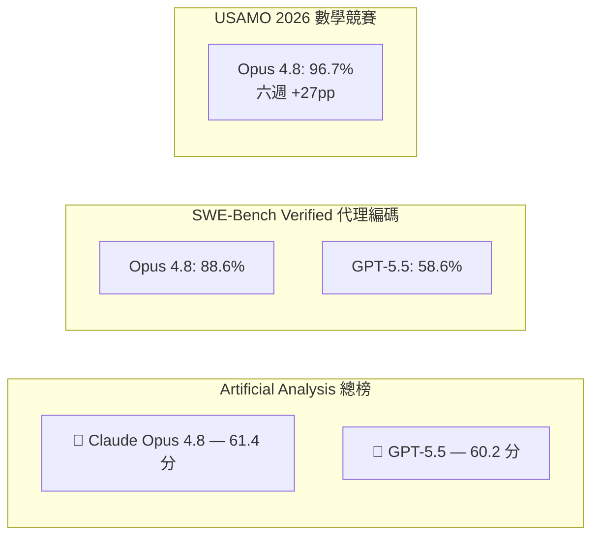
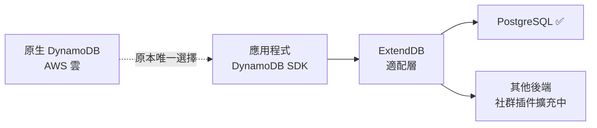

# AI Daily Digest — 2026-06-08

<!-- pipeline-generated:begin -->

## 🔥 今日 TOP 3
### 1. Claude Opus 4.8 創 41 天最快迭代，數學競賽六週升 27 分
Anthropic 於 2026 年 5 月 28 日發布 Claude Opus 4.8，距前版 4.7 僅 41 天，創下該公司最快版本週期紀錄。新模型保持相同定價（每百萬 tokens 5/25 美元）與 100 萬 token 上下文窗口，但底層架構完全重新設計。

對 AI 開發者與評測社群而言，Opus 4.8 的進步幅度遠超線性預期：SWE-Bench Verified 代理編碼達 88.6%，大幅超越 GPT-5.5 的 58.6%；USAMO 2026 數學競賽成績在六週內從 69.3% 躍升至 96.7%，提升 27 個百分點。Artificial Analysis 綜合排行榜確認 Opus 4.8 以 61.4 分超越 GPT-5.5（60.2 分）登上第一。

41 天迭代週期加上定價不變，意味著 AI 能力的「通貨膨脹」正在加速——相同成本每月換取更強能力。工程師應在下個 sprint 重新評估使用 Opus 的任務邊界，特別是長程代理編碼與數學推理場景，評估是否能以相同預算替換現有工作流，並留意後續 Opus 5.x 的迭代節奏是否維持此速度。

📖 [閱讀完整 insight](../10-insights/2026-06-07/inbox_126b8fcb.md) · 🔗 [原文連結](https://medium.com/@nareshkukkala/claude-opus-4-8-the-ai-model-that-just-changed-the-rules-for-builders-and-engineers-8ef6181f3d65?source=rss------large_language_models-5)
### 2. AWS 開源 ExtendDB：零改動讓 DynamoDB 應用跑在 PostgreSQL 上
AWS 正式開源 ExtendDB，一個與 DynamoDB API 完全相容的插件式適配器，首個後端支援 PostgreSQL。現有的 DynamoDB SDK 與工具無需修改任何代碼即可直接對接非 AWS 數據庫，從原生 DynamoDB 遷移至 ExtendDB 的代碼改動成本為零。

對採用 DynamoDB 的工程師而言，ExtendDB 直接打破了 AWS 存儲層的鎖定。以往離開 AWS 生態或進行混合雲部署必須重寫存儲層；現在相同的應用代碼可在私有雲或自管理的 PostgreSQL 上運行，為受成本、合規或數據主權限制的企業提供了退出路徑。

短期可觀察的方向包括：社群是否為 MySQL、SQLite 等增加更多後端插件，以及 ExtendDB 在讀寫性能上與原生 DynamoDB 的差距評測。正在評估多雲或混合雲策略的團隊，可立即將 ExtendDB 納入 POC 範疇，特別是受數據在地化法規約束的場景。

📖 [閱讀完整 insight](../10-insights/2026-06-07/inbox_a0b98264.md) · 🔗 [原文連結](https://www.infoq.com/news/2026/06/extenddb-dynamodb-adapter/?utm_campaign=infoq_content&utm_source=infoq&utm_medium=feed&utm_term=global)
### 3. 企業 AI 整合的四層隱藏成本：讓 LLM 當資料架構師為何行不通
文章以中型企業 Maria 的案例說明，將百萬筆 SAP/CRM/ERP 記錄直接載入 AI 系統時，會遭遇四層累積成本：LLM 反覆解讀混亂欄位的「模式解釋」費用、向量化後喪失層級關係的「碎片化儲存」問題、每次資料更新都需重新嵌入與測試提示的「持續返工」負擔，以及整合全組織資料造成財務／人資／客戶 PII 混入的「治理崩潰」風險。

這四層問題的核心矛盾在於：讓 AI 當「資料架構師」會產生指數級的重複 token 消耗。1% 的資料增幅即可能引發數週返工，成本結構類似「每週重新聘請顧問」，遠超多數企業的 AI 預算估算。這也是許多企業 AI 試點在概念驗證後卻無法規模化的根因——初期 POC 資料量小、更新少，隱藏成本尚未顯現。

正確的架構順序是：先定義藍圖（playbooks）→ 用非 LLM 機制自動化資料對應 → 隔離資料範圍 → 僅保留 LLM 做最終推理。團隊在 AI 整合項目啟動前應明確評估這四層成本，並以「LLM 是推理器而非資料庫」為設計原則重新審視架構方案。

📖 [閱讀完整 insight](../10-insights/2026-06-07/inbox_a7b53d68.md) · 🔗 [原文連結](https://medium.com/@anythinggraph/she-had-a-million-records-the-ai-bill-was-just-getting-started-7a33c4fb9fcf?source=rss------claude-5)

## 📖 好文章 / 影片精選

_過去 30 天經 traffic 沉澱的高品質內容，按興趣領域分類。每篇只在 column 出現一次。_
### 📚 AI 知識管理
- **simon-willison** · **[Datasette Agent](../10-insights/2026-05-21/inbox_18ad806e.md)**
  Simon Willison 宣佈 Datasette Agent 首個版本發布，為 Datasette 提供 AI 對話式查詢介面。demo 在 agent.datasette.io 運行，採用 Gemini 3.1 Flash-Lite 後端。用戶可用自然語言提問（如「when did Simon most recently see a pelican?
### 🏢 企業導入 AI / 團隊實踐
- **medium-tag-claude** · **[She Had a Million Records. The AI Bill Was Just Getting Started.](../10-insights/2026-06-07/inbox_a7b53d68.md)**
  文章以 Maria 為例，說明中型企業在 AI 整合中面臨的隱藏成本。Maria 在企業系統（SAP、CRM、ERP）中存有百萬筆記錄，嘗試將其載入 AI 系統以構建自助顧問。第一項成本是「模式解釋」：LLM 需反覆重讀跨系統的混亂資料（欄位名稱不一致），每次理解都要計費。第二項成本是「碎片化知識儲存」：將列轉換為可搜尋的文字塊會喪失關鍵的層級與存取控制關係
- **infoq-ai-ml** · **[AWS WorkSpaces Now Lets AI Agents Operate Legacy Desktop Applications Without APIs](../10-insights/2026-05-13/inbox_00fedb21.md)**
  AWS WorkSpaces 推出公開預覽支持 AI agents 操作遺留應用。Agents 通過 IAM 認證在託管虛擬桌面上運行，使用電腦視覺與輸入模擬無需 API 即可交互。Reflex 基準測試顯示視覺 agents 的 token 消耗為 API agents 的 45 倍，這對成本規劃有重大影響。適用於無法改造的遺留系統，但需考量推理成本增加。
- **substack-pragmatic-engineer** · **[The Pulse: a trend of trying to cut back on AI spend within eng departments?](../10-insights/2026-05-28/inbox_e19b2211.md)**
  Pragmatic Engineer 報導工程部門內出現削減 AI 支出的跨企業趨勢，包括自上而下（管理決策）和自下而上（開發者自律）的成本理性化努力。同時披露 Cursor 的 AI 編碼使用統計數據，以及 GCP 在未發出警告下暫停月消費 $200 萬客戶的重大事件。反映產業對 AI token 成本效率的急劇關注升溫。
- **simon-willison** · **[Uber Caps Usage of AI Tools Like Claude Code to Manage Costs](../10-insights/2026-06-03/inbox_ab1cbae3.md)**
  Uber 因在四個月內燒光 2026 年 AI 預算，現實施 $1,500/月單一工具限額政策，限制員工使用 Cursor 和 Claude Code 等代理編碼軟體的成本。若工程師同時使用兩個工具，年度上限約 $36,000，占中位數薪資 $330,000 的 11%。此政策反映出 token 密集型 AI 編碼工具的真實成本結構，相當於每名工程師年度薪資
- **infoq-ai-ml** · **[Netflix Introduces ‘Model Lifecycle Graph’ to Scale Enterprise Machine Learning](../10-insights/2026-05-11/inbox_a7db87e5.md)**
  Netflix 推出 Model Lifecycle Graph 架構，通過圖形化方式管理 ML 系統中數據集、模型、特徵和工作流之間的相互連接與依賴。該系統增強了 ML 組件的可發現性、治理能力，支持工程師與數據科學家的自服務開發模式，並促進跨團隊的組件重用。在大規模部署中，此架構有助於解決 MLOps 的可觀測性、版本控制和知識管理的挑戰，為企業級 ML
### 🎓 AI 使用技巧 / 心法
- **reddit-claudeai** · **[8 Advanced Claude Code Tips I&#39;ve Discovered After Heavy Daily Use (Cost saving, Context, Custom Commands)](../10-insights/2026-05-11/inbox_df8ffac9.md)**
  一位重度使用者分享了8項Claude Code進階技巧。核心包括：(1)利用自然語言讓Claude自動化git workflow，如自動摘要更改並建立PR、自動生成缺失文件和測試；(2)透過拖拽或絕對路徑在CLI中使用multimodal功能(圖片分析)；(3)用開源套件ccusage追蹤API usage和成本；(4)關鍵技巧：在40–50% contex
- **medium-tag-llm** · **[The Agent Memory Problem: How CLAUDE.md Solves the Stateless Context Crisis in AI Coding Agents](../10-insights/2026-05-10/inbox_fde4a8c2.md)**
  Claude Code agents 每次新session啟動時會完全遺忘project context，導致稱為「stateless context crisis」的核心問題。這限制了AI coding tools從toy projects 擴展到真實規模專案的能力。解決方案是採用 CLAUDE.md 檔案方式，將project-specific deci
- **medium-towards-data-science** · **[Building an Evaluation Harness for Production AI Agents: A 12-Metric Framework From 100+ Deployments](../10-insights/2026-05-13/inbox_4019cddd.md)**
  Towards Data Science 發布 12 指標評估框架，基於 100+ 企業部署經驗。框架涵蓋檢索品質、生成品質、智能體行為、生產健康四大維度，為生產環境中的 AI 智能體評估提供系統化方法。該框架將零散的測試指標整合為統一的評估模型，幫助團隊量化端到端智能體效能，成為生產就緒的關鍵質控機制。
- **medium-tag-llm** · **[What If We’re Building AI Systems The Wrong Way?](../10-insights/2026-06-07/inbox_4e55dc13.md)**
  開發者在構建聊天助手時發現了一個核心問題：傳統軟體工程採用確定性思維，試圖預測 LLM 行為並列舉所有邊界情況，但 LLM 本質上是非確定性的。作者透過實驗發現，簡潔的身份導向提示（如「你是反饋分析師」）勝過複雜的規則清單。受生物學啟發，他提出應該構建具有明確用途的專門元件，讓整體行為從各元件互動中自然浮現，而非依賴中央控制。該方法建議不用單一全能助手，而改
- **medium-tag-llm** · **[The 1M-Token Context Window: What It Changes and What It Doesn’t](../10-insights/2026-05-15/inbox_e09a175f.md)**
  百萬 token 上下文時代的成本與性能權衡分析。Gemini 3 Flash 為 $0.50/百萬 token，Claude Sonnet 4.6 標準定價 $3.00/百萬 token，成本相差 6 倍。文章分析大上下文窗口帶來的收益（處理長文檔、完整代碼庫）與限制（成本、延遲、注意力稀釋），幫助團隊評估是否值得為百萬 token 能力付費，以及何時短上
### 💳 支付 / Fintech
- **infoq-main** · **[ExtendDB: Open Source Amazon DynamoDB Compatible Adapter with Pluggable Storage Backends](../10-insights/2026-06-07/inbox_a0b98264.md)**
  AWS 正式宣佈開源 ExtendDB，一個與 DynamoDB API 完全相容的適配器。ExtendDB 的核心創新在於支援插件式存儲後端，首個支援 PostgreSQL，讓團隊能用 DynamoDB API 搭配非 AWS 的數據庫。現有的 DynamoDB SDK 和工具可以無需修改就直接運作，這意味著應用從原生 DynamoDB 遷移到 Exten
- **medium-tag-claude** · **[AI Isn’t Coming For Your Job.Your job was already taken.](../10-insights/2026-06-07/inbox_4d23945f.md)**
  內容無法取得（HTTP 504 Gateway Timeout），無法準確摘要。
### 🔐 AI 安全 / 濫用
- **infoq-ai-ml** · **[Microsoft Introduces MDASH for Large-Scale AI Vulnerability Research](../10-insights/2026-05-25/inbox_d9e6b216.md)**
  微軟推出 MDASH，一套 AI 驅動的多 agent 漏洞發現系統，用於大規模程式碼審計。系統整合 100+ 個專門 AI agent，協作掃描、驗證、辯論並證明 Windows 及其他微軟軟體中的漏洞。這種多 agent 架構透過分工與協作，比單一模型方案能發現更複雜的安全缺陷。該平台展示了 agent 編制在企業級安全運維中的實際價值。
- **infoq-ai-ml** · **[BadHost Vulnerability Exposes AI Agents, Evaluators, and LLM Gateways](../10-insights/2026-06-01/inbox_c67bb0e4.md)**
  BadHost 為 Starlette（Python 框架，週下載量 325M）的高嚴重性認證繞過漏洞。攻擊者可使用格式不正確的 HTTP Host header 繞過基於路徑的存取控制，進而入侵 AI agent 基礎設施及其他系統。漏洞根源在於 Host header 驗證缺陷，使路徑型授權失效。
### 🛤️ AI Flow 導入心得 / 技術分享
- **latent-space** · **[The Age of Async Agents — Cognition&#39;s Walden Yan &amp; OpenInspect&#39;s Cole Murray](../10-insights/2026-05-28/inbox_bc4cca58.md)**
  Latent Space 播客邀請 Cognition 的 Walden Yan 與 OpenInspect 的 Cole Murray 討論異步代理時代。重點涵蓋：Devin 代碼代理 80% 提交率、規格→PR 自動化流程、完整虛擬機環境、代理記憶持久化、產品經理透過代理出貨程式碼。話題反映代理工具從原型演進至實務生產規模、端對端自動化、與組織採用變化。
- **substack-product-compass** · **[I Don&#39;t Review the Code. I Review the Artifacts.](../10-insights/2026-05-31/inbox_06acb14d.md)**
  在 Agentic Engineering 時代，產品經理的工作重心正在轉變：從審查程式碼轉向審查 AI 代理生成的成果物（artifacts）。文章指出 PM 無需具備編碼能力，而應聚焦於驗證 AI 生成工作的品質和正確性。提供了可用於 agentic engineering 的 prompt 工具包。此轉變反映了 AI 代理革新企業生產力時，組織角色與技
- **infoq-ai-ml** · **[Presentation: Platform Teams Enabling AI - MCP/Multi-Agentic Tools Across Linkedin](../10-insights/2026-06-05/inbox_294dc984.md)**
  LinkedIn 的工程平台團隊（Karthik Ramgopal、Prince Valluri）在此分享了如何透過 MCP 和多代理工具構建大規模 AI 執行模型。他們強調了關鍵的架構模式：透過平台級的抽象層實現 orchestration、structured context 和安全的工具框架（尤其是 MCP），可以超越傳統碎片化的 AI 實現方式。Li
- **medium-tag-claude** · **[What I learned shipping four open-source Claude dev-tools in two weekends](../10-insights/2026-06-06/inbox_fcd23aaa.md)**
  開發者 Ferhat Atagün 於兩週末內推出四個開源 Claude 開發工具：Claudoscope（即時可視化 token 經濟學：輸入、快取寫、快取讀、輸出成本）、Agent-replay（互動式時間軸回放 Claude 智能體執行跡）、Prompt-lab（雙窗格對比提示詞/模型、輸出、成本、延遲）、Tool-lab（JSON 格式定義工具、模擬
- **reddit-localllama** · **[Moving from Composer 2/Kimi 2.6 to Qwen3.6:35b-a3b](../10-insights/2026-05-17/inbox_88dc9fcf.md)**
  開發者分享用 Qwen 3.6:35b-a3b 模型進行日常生產開發的體驗。該開發者負責 50–70 萬行企業軟件維護，每週 60 小時，經由 OpenRouter 使用該模型成本約 $0.08/1M tokens（含緩存折扣）。Qwen 3.6 在代碼理解、指令遵循能力上超越 Composer 2、Kimi 2.6、DeepSeek 4 Pro/Flash

## 💡 今日 Takeaway

_讀完今日所有內容後，可帶走的知識點_
### 1. 身份導向提示搭配專門化元件，比規則清單更能駕馭 LLM 的非確定性
試圖用規則清單覆蓋 LLM 的所有邊界情況，等同於用確定性思維對抗非確定性系統，必然陷入無窮的邊界枚舉。簡潔的身份導向提示（如「你是反饋分析師」）搭配各自有明確職責的小型元件，讓整體行為從元件互動中自然浮現，遠比中央控制規則更可維護。設計 LLM 系統時，先問「這個元件的身份是什麼」，再問「它需要哪些規則」，而非反過來。

_類型：framework_

**參考來源**：
- [What If We’re Building AI Systems The Wrong Way?](../10-insights/2026-06-07/inbox_4e55dc13.md) · [原文](https://medium.com/@WillNewmarch/what-if-were-building-ai-systems-the-wrong-way-ccb123cd8a8b?source=rss------large_language_models-5)
### 2. 企業 AI 整合應遵循「先藍圖後推理」架構，LLM 只負責最後一哩
讓 LLM 直接對接企業原始資料會產生模式解釋、碎片化儲存、持續返工、治理崩潰四層隱藏成本，每層都以重複 token 消耗的形式累積。正確做法是先以非 LLM 機制完成資料對應與隔離，再讓語言模型僅負責最終推理，這樣既控制成本也降低合規風險。在 AI 整合項目啟動前，應以「這個步驟真的需要 LLM 嗎？」為篩選問題，把昂貴的語言理解力留給無可替代的推理環節。

_類型：framework_

**參考來源**：
- [She Had a Million Records. The AI Bill Was Just Getting Started.](../10-insights/2026-06-07/inbox_a7b53d68.md) · [原文](https://medium.com/@anythinggraph/she-had-a-million-records-the-ai-bill-was-just-getting-started-7a33c4fb9fcf?source=rss------claude-5)
### 3. 基礎 RAG 失敗分布在四個環節，修復需全鏈路協調而非單點改進
RAG 系統的瓶頸分布在檢索相關性、上下文 token 限制、排序品質、LLM 推理四個環節，任一薄弱點都會讓整體效果退化。進階 RAG 的標準修復組合是混合檢索（BM25 + 向量）搭配重排序，同時配合動態上下文管理應對 token 限制。設計 RAG 管道時，應從第一天起為每個環節設置獨立評估指標，才能定位真正的瓶頸，而非把所有問題都歸因於「模型不夠好」。

_類型：pattern_

**參考來源**：
- [Advanced RAG : Why Naive RAG Fails &amp; How Advanced RAG Fixes It](../10-insights/2026-06-07/inbox_cb761a42.md) · [原文](https://medium.com/@vaibhavipowar2023/advanced-rag-whynaive-rag-fails-how-advanced-rag-fixes-it-b510daaa80d3?source=rss------large_language_models-5)
### 4. Claude Code 將 MAX_OUTPUT_TOKENS 調至 16384 可消除規劃器的重複讀檔迴圈
預設的 `CLAUDE_CODE_MAX_OUTPUT_TOKENS=8192` 會導致規劃器在處理大型檔案時多次截斷草稿簿，進而重複讀取同一檔案（實測中一個 4000 行檔案在 40 分鐘內被讀了 7 次），大幅拉高 token 成本。將上限調至 16384 後，規劃器可一次性完成草稿，消除不必要的讀檔迴圈。在啟動大型重構任務或操作超過 2000 行的檔案前，這個環境變數是值得優先確認的配置項目。

_類型：data-point_

**參考來源**：
- [Claude Code as Daily Driver: Scars from the .md Contract](../10-insights/2026-06-07/inbox_5871760d.md) · [原文](https://mrzacsmith.medium.com/claude-code-as-daily-driver-scars-from-the-md-contract-f66d99cd507d?source=rss------claude-5)

<!-- pipeline-generated:end -->

<!-- user-notes -->
<!-- Write your own notes below; pipeline never touches this section. -->