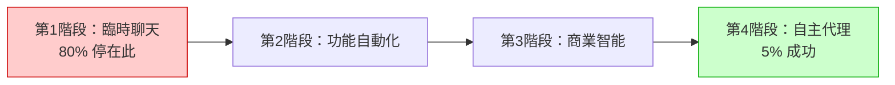
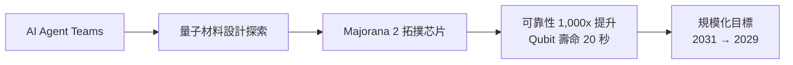

# AI Daily Digest — 2026-06-09

<!-- pipeline-generated:begin -->

## 🔥 今日 TOP 3
### 1. 企業 AI 投資 80% 失敗：組織問題非技術問題
PwC、McKinsey、NBER 三大機構的實證數據驚人一致：56–80% 企業無法從 AI 投資中取得可量化商業收益。核心診斷指向「測量失敗」與「組織結構缺陷」——75% 失敗案例從未設定明確的成果指標、責任主體或超越試點的時程表，而非模型本身的問題。

最具衝擊的數字是「隱性收益黑洞」：超過 90% 的生產力提升（如員工把 12 小時工作壓縮至 30 分鐘）發生在個人任務層級，卻從未進入財務報表。結構根因在於 AI 通常由 HR/IT 管理，但這些部門並不擁有銷售轉換率、內容成本等核心業務指標，造成領導層「只看到成本、看不到收益」的感知落差。企業 AI 成熟度四階段分布如下——

成功的 5% 共同採用「指標先行法」：先與業務部門共同定義可量化指標（銷售轉換率／發布週期／內容成本），再部署 AI，最後驗證前後差異。下一步建議：找到組織中最容易測量的業務指標，讓「擁有該指標」的部門主導 AI 試驗，而非交給 IT 統籌推動。

📖 [閱讀完整 insight](../10-insights/2026-06-08/inbox_2d4f4c4f.md) · 🔗 [原文連結](https://medium.com/@artificialstudioAI/why-80-of-companies-see-no-roi-from-ai-9f1bd2c50f83?source=rss------claude-5)
### 2. Microsoft AI Agent Teams 加速量子芯片，時程提前 2 年
Microsoft 在 Build 2026 宣布 Microsoft Discovery 正式於 Azure 平台 GA，核心架構是部署自主 AI agent teams 協助科學 R&D 全流程。在 Majorana 2 拓撲量子芯片的開發中，Discovery 取得了可驗證的里程碑：qubit 可靠性提升 1,000 倍，壽命從毫秒級躍升至 20 秒。

這是 AI agent teams 在高風險科學發現領域的首個公開里程碑案例。相比企業 AI 多用於流程自動化，Discovery 展示了多代理協作在高複雜度問題空間（量子材料設計）中的真實加速能力。基於此成果，Microsoft 將可擴展量子計算機目標從 2031 年提前至 2029 年，縮短 50% 時程。

觀察重點：未來 12 個月，製藥、材料科學、能源領域是否跟進採用類似 agent team 框架加速科學發現。實務建議：若組織有複雜的專業知識領域（如新藥分子篩選、材料配方優化），值得評估「AI agent team + 領域專家監督」的混合研究模式能否取代部分傳統工作流。

📖 [閱讀完整 insight](../10-insights/2026-06-08/inbox_6ccee2d3.md) · 🔗 [原文連結](https://www.infoq.com/news/2026/06/microsoft-discovery-majorana-2/?utm_campaign=infoq_content&utm_source=infoq&utm_medium=feed&utm_term=global)
### 3. Google Gemma 4 12B：筆電可跑的多模態 Agentic 模型
Google 發布 Gemma 4 12B，採用 encoder-free 多模態架構，設計目標明確：在筆記本等日常設備上本地運行完整的 agentic workflows。透過 Google AI Edge 整合，支援自主數據處理、視覺洞察生成、網頁構建與工具執行，無需呼叫遠端 API。

12B 本地模型能執行 agentic 任務，代表「不上傳數據即可運行 AI 代理」正式成為可行架構選項，這對 GDPR/HIPAA 合規需求的企業、離線環境開發者、以及對延遲敏感的邊緣設備應用（IoT、AR）有直接架構影響。相比雲端 API 按呼叫計費，本地推理成本結構轉為一次性硬體成本，在高頻率任務場景下可能大幅降低總擁有成本。

建議評估方向：若你的 agent 應用涉及敏感數據、需要離線運行或對延遲 p95 有嚴格要求，Gemma 4 12B 現在值得做 benchmark 對比。具體起點：在 Google AI Edge 跑一個本地 agentic workflow，量化與雲端 API 在延遲和月均成本的差異，再決定架構選型方向。

📖 [閱讀完整 insight](../10-insights/2026-06-08/inbox_c94446fc.md) · 🔗 [原文連結](https://www.infoq.com/news/2026/06/google-gemma4-12b-local-coding/?utm_campaign=infoq_content&utm_source=infoq&utm_medium=feed&utm_term=global)

## 📖 好文章 / 影片精選

_過去 30 天經 traffic 沉澱的高品質內容，按興趣領域分類。每篇只在 column 出現一次。_
### 🛠 工具版本追蹤 / Release
- **ruflo** · **[v3.10.39 — ADR-147 entity arm + signal provenance](../10-insights/2026-06-08/inbox_63e724cc.md)**
  ruflo v3.10.39 實現了 ADR-147，為 hybridSearch 添加了第三個 RRF（倒數排名融合）arm——entity arm，與現有 dense（HNSW/RaBitQ）和 sparse（FTS5/BM25）並行運行。新增 entity-tagger.ts 模組，使用正則表達式保守提取電子郵件、URL、POSIX/Windows 文
  _+ 1 個近期版本（v3.10.38，僅顯示最新）_
- **gitnexus** · **[v1.6.6](../10-insights/2026-06-08/inbox_4bb47af3.md)**
  GitNexus 發布 v1.6.6 大版本，~190 個 PR（50 新功能、96 修復、6 效能優化）。核心成就：(1) Scope-resolution engine 統一遷移完成（RFC #909），Rust/JS/Ruby/Swift/Vue SFC/Dart/COBOL/Kotlin/Java 全語言遷移至 registry-primary，Ja
- **claude-mem** · **[v13.4.1](../10-insights/2026-06-08/inbox_85248c58.md)**
  claude-mem v13.4.1 發布，新增 CMEM Online email opt-in 功能和修復。新增功能在 npx claude-mem install 啟動時呈現可選的交互式 email 選擇加入介面，按 Enter 跳過不會阻止安裝進行。收集用戶電子郵件和可選的工作背景備註，POST 至 https://cmem.ai/api/waitl
### 📚 AI 知識管理
- **medium-tag-claude** · **[7 Ways to Make Claude/GPT Actually Remember You](../10-insights/2026-06-08/inbox_38b9b882.md)**
  系統化梳理 Claude 與 GPT 的七層記憶層級架構，從全域設置到專案層記憶再到技能和外部知識庫，幫助使用者避免重複說明。第 1 層是全域指令（Settings），第 2-5 層包含 Claude 自動化記憶、專案指令、上傳知識文件、專案記憶；第 6 層是技能（Skills），第 7 層是外部 Wiki（如同步 Obsidian）。關鍵原則：「自己寫清楚
### 🏢 企業導入 AI / 團隊實踐
- **medium-tag-claude** · **[Why 80% of companies see no ROI from AI](../10-insights/2026-06-08/inbox_2d4f4c4f.md)**
  企業 AI 投資回報率困境的實證分析：56-80% 企業無法實現可量化的成效，原因並非 AI 本身無用，而在於測量失敗和組織結構缺陷。核心統計：PwC 56% 無財務收益、McKinsey 60% 無可量化影響、NBER 約 80% 無生產力提升。75% 失敗案例缺乏明確的成果指標、責任主體或超越試點的時程表。成功的 5% 則採用「指標先行法」（測量 → A
- **infoq-architecture** · **[Microsoft Discovery Reaches GA on Azure, Powering the Agentic AI Behind Majorana 2 Quantum Chip](../10-insights/2026-06-08/inbox_7de473d0.md)**
  Microsoft 宣布 Microsoft Discovery 正式上市（Azure 平台），用於在科學研發中部署自主 AI 代理團隊。該平台協助開發 Majorana 2 拓撲量子芯片，實現可靠性提升 1000 倍、量子位生命週期達 20 秒的突破性成果。Microsoft 將可擴展量子計算機的目標時間提前至 2029 年（較原時程減半）。此案例展示了自
- **infoq-ai-ml** · **[Article: Building a Secure MCP Server on AWS for a Million-Company B2B Platform](../10-insights/2026-05-18/inbox_94c28293.md)**
  InfoQ 文章詳細介紹如何在 AWS 上構建安全的 MCP Server，用於 B2B 智能平台暴露涵蓋 100 萬家公司的企業檔案。方案允許終端用戶透過 LLM 客戶端以自然語言查詢（例：「找德國 50-200 人員的 SaaS 公司」），系統自動轉化為結構化 API 調用。核心工程挑戰在於如何在保障生產環境數據安全的前提下，建立 LLM 與關鍵業務系統
### 🎓 AI 使用技巧 / 心法
- **medium-tag-claude** · **[Claude Code — Skills vs Agents: Knowing Which One to Use (Part 5)](../10-insights/2026-06-08/inbox_d65ff530.md)**
  Claude Code 生態中 Skills 與 Agents 的功能差異和適用場景對比。Skills 初始只載入名稱和描述到上下文（按需展開完整指令），在同一 session 內執行，適合重複性流程（安全審查清單、提交訊息格式化）；Agents 每次執行都新建隔離上下文窗口，自攜完整系統提示，適合多步驟複雜任務和平行執行。兩者可互補：Agent 可觸發 S
- **medium-tag-llm** · **[How to Design Agent Memory](../10-insights/2026-06-07/inbox_af04b883.md)**
  Agent 記憶系統設計超越「只用向量資料庫」的簡化認知。文章提出三層架構：(1) Working Memory（工作記憶）——最近對話、當前計劃、工具輸出直接存在上下文窗口；(2) Compressed Memory（壓縮記憶）——將舊交互摘要為結構化狀態（目標、完成步驟、約束、失敗嘗試）以管理上下文增長；(3) Long-Term Memory（長期記憶
- **medium-tag-llm** · **[What Is a Harness in Claude Code and Why Should You Care](../10-insights/2026-06-07/inbox_8fc25b5c.md)**
  Claude Code 的核心價值在於其「harness」（框架系統）——一層工程包裝，使 LLM 能真正執行任務。文章指出 Anthropic 識別出兩個關鍵失敗模式：(1) 上下文焦慮——長任務中模型內存填滿導致提早終止，解決方案是完全重置上下文並提供結構化摘要；(2) 自我評估偏差——模型傾向自認表現良好，需引入獨立評估器提供客觀反饋。生產級應用採三代
- **medium-tag-claude** · **[Stop Prompting Claude: Build Self-Prompting Systems That 10x Your Productivity](../10-insights/2026-06-08/inbox_8ca08eda.md)**
  Boris Cherny 提出典範轉移觀點：不應該手動提示 Claude，而應該構建系統讓系統自動提示 Claude。這代表從被動的單次人工提示轉向主動的系統化自動化架構，可望實現 10 倍生產力提升。核心洞察強調提示工程的終局不是更精準的人工提示詞，而是系統自主化。
- **medium-tag-claude** · **[Your AI Writes Code 3,300× Cheaper Than You Can Verify It](../10-insights/2026-05-31/inbox_76e91e69.md)**
  AI撰寫code比人類驗證便宜3,300倍。文章介紹「AI驗證協議」(AI Verification Protocol)，可在自己repo使用Claude Code執行。核心洞察：自動驗證vs人工驗證成本差異巨大，改變AI開發工作流的經濟效益計算。
### 💳 支付 / Fintech
- **infoq-ai-ml** · **[ExtendDB: Open Source Amazon DynamoDB Compatible Adapter with Pluggable Storage Backends](../10-insights/2026-06-07/inbox_22d6a233.md)**
  AWS 正式宣佈開源 ExtendDB，一個與 DynamoDB API 完全相容的適配器。ExtendDB 的核心創新在於支援插件式存儲後端，首個支援 PostgreSQL，讓團隊能用 DynamoDB API 搭配非 AWS 的數據庫。現有的 DynamoDB SDK 和工具可以無需修改就直接運作，這意味著應用從原生 DynamoDB 遷移到 Exten
### ⛓️ 區塊鏈 / Web3
- **infoq-architecture** · **[Presentation: Mitigating Geopolitical Risks with Local-First Software and atproto](../10-insights/2026-06-08/inbox_fecebc14.md)**
  Martin Kleppmann 闡述現代基礎設施亟需技術主權，討論多雲架構、事實上的 API 標準化、AT Protocol 與本地優先開發範式如何幫助組織應對全球技術依賴風險。演講提出系統化框架：透過去中心化協議、多元供應商選擇、本地數據優先，工程領導者可回收用戶代理權並構建具韌性的系統。該方法論適用於應對地政技術鎖定與供應鏈風險。
- **substack-web3matters** · **[第 185 期](../10-insights/2026-06-08/inbox_321b5cc3.md)**
  这是关于 Web3 和 DAO 生态的新闻摘要集合，内容包含亚洲 DAO 现状、开发者生态寒冬、Fluidkey 产品等话题，不属于 AI 或 LLM 相关范畴。
### 🔐 AI 安全 / 濫用
- **medium-tag-llm** · **[Designing an Agent That Can’t Destroy Your Production Database: Safety Boundaries for Tool-Calling...](../10-insights/2026-05-19/inbox_85664650.md)**
  Medium 文章提出「不會毀掉生產資料庫的 agent」設計方案，採用四層安全架構防護具有工具調用能力的生產 AI agent。該架構專門針對 agent 安全邊界問題，防止擁有高權限（如 DB 存取）的自主 agent 執行危險操作。四層分層設計涵蓋不同防護層次。
### 🛤️ AI Flow 導入心得 / 技術分享
- **infoq-main** · **[Podcast: From MCP and Vibe Coding to Harness Engineering: How Did AI Native Engineering Evolve in One Year](../10-insights/2026-06-08/inbox_4b697fc4.md)**
  Birgitta Böckeler（Thoughtworks 傑出工程師）在 podcast 中分享 AI native 軟體工程的快速進化軌跡。從早期的「vibe coding」談起，經歷工具景觀變化，到當下更自主的 agents 出現。該演進路徑展示了從直覺開發到 MCP（Model Context Protocol）等標準化協議，再到 harness 
- **substack-lennys-newsletter** · **[HTML is the new Markdown: How Anthropic engineers are building with Claude Code | Thariq Shihipar](../10-insights/2026-05-18/inbox_253a2869.md)**
  Anthropic Claude Code 工程師在播客中分享使用心得。核心論點：HTML 已取代 Markdown 成為規格文檔的新標記語言；工程師用 Claude Code 開發微型應用進行 spec 編輯，並支持 living design systems（動態設計系統）；強調工程師角色轉變：不再是「代碼編寫者」，而是「計算分配者」——決策何時使用 A
- **medium-tag-claude** · **[Working Inside Uncertainty: A Case Study in Emergent Resilience](../10-insights/2026-05-26/inbox_b7b392c8.md)**
  案例研究探討在不確定性中工作的新興適應力。事件背景：2026 年 5 月 26 日，Claude Sonnet 4.5 從 claude.ai UI 中被移除。文章分析該變化如何影響工作流程，並討論從中浮現的適應力模式。

## 💡 今日 Takeaway

_讀完今日所有內容後，可帶走的知識點_
### 1. 先定義可量化商業指標，再部署 AI，是 ROI 成功的必要前提
失敗的 AI 項目通常從「工具」出發（先買授權、先試用），成功的項目從「指標」出發（先問：我要改善哪個可測量的業務結果？）。三大機構的跨組織數據顯示，這個順序差異解釋了 80% 失敗與 5% 成功之間的分歧，且與模型能力強弱無關。實際套用：下次評估 AI 工具時，先填寫「我預期 X 指標在 Y 週內改變 Z 幅度」；若無法填完，暫緩部署，先釐清成功定義。

_類型：data-point_

**參考來源**：
- [Why 80% of companies see no ROI from AI](../10-insights/2026-06-08/inbox_2d4f4c4f.md) · [原文](https://medium.com/@artificialstudioAI/why-80-of-companies-see-no-roi-from-ai-9f1bd2c50f83?source=rss------claude-5)
### 2. 讓系統自動提示 AI，而非人工反覆調整，才是 10 倍生產力的路徑
手動 Prompt 的天花板是個人技術水平，系統自動提示的上限是組織架構設計能力。當一個流程被固化為「觸發條件 → AI 任務定義 → 驗證輸出」的自動管道，就不再依賴個人 Prompt 技巧，且可無限複製與擴展。最小化實踐：把你每週重複三次以上的手工 Prompt 操作，改成 webhook 觸發或排程執行，輸出存入固定格式——這是從「提示 AI」升維到「構建提示 AI 的系統」的最簡起點。

_類型：framework_

**參考來源**：
- [Stop Prompting Claude: Build Self-Prompting Systems That 10x Your Productivity](../10-insights/2026-06-08/inbox_8ca08eda.md) · [原文](https://medium.com/data-science-collective/stop-prompting-claude-build-self-prompting-systems-that-10x-your-productivity-5b56e05db86c?source=rss------claude-5)
### 3. AI 工具鏈自主程度越高，所需工程紀律越嚴，不能跳級
從 vibe coding 到 MCP 協議再到 harness engineering，每個成熟度階段都解決了前一階段遺留的複雜度問題。直接跳到高自主 agent 而跳過可觀測性和回滾機制建設，會引入難以調試的故障模式——因為根本沒有辦法知道 agent 在哪一步出錯。自我評估：你目前的 agent 系統是否有明確的異常通知、執行日誌和緊急回滾方案？這是判斷能否安全進入下一成熟度階段的核心依據。

_類型：pattern_

**參考來源**：
- [Podcast: From MCP and Vibe Coding to Harness Engineering: How Did AI Native Engineering Evolve in One Year](../10-insights/2026-06-08/inbox_4b697fc4.md) · [原文](https://www.infoq.com/podcasts/mcp-vibe-coding-harness-engineering/?utm_campaign=infoq_content&utm_source=infoq&utm_medium=feed&utm_term=global)
### 4. 對抗技術鎖定：API 標準化、多雲、本地優先的三角組合缺一不可
單一供應商依賴在技術層是便利，在風險層是脆弱點（地緣政治制裁、服務中斷、價格壟斷）。透過在協議層採用開放標準、在基礎設施層選擇多雲選項、在數據層採用本地優先存儲，可以在不犧牲功能的前提下顯著降低鎖定風險。工程決策的實務測試：每次評估新 SaaS 工具時，先問「如果這家公司明天漲價 5 倍或停止服務，我們的遷移成本與時間是多少？」讓這個問題成為技術選型的標準環節。

_類型：framework_

**參考來源**：
- [Presentation: Mitigating Geopolitical Risks with Local-First Software and atproto](../10-insights/2026-06-08/inbox_fecebc14.md) · [原文](https://www.infoq.com/presentations/cloud-computing-technological-sovereignty-multi-cloud/?utm_campaign=infoq_content&utm_source=infoq&utm_medium=feed&utm_term=Architecture+%26+Design)

<!-- pipeline-generated:end -->

<!-- user-notes -->
<!-- Write your own notes below; pipeline never touches this section. -->