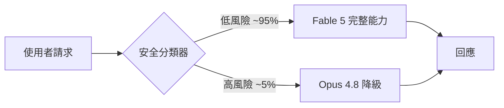
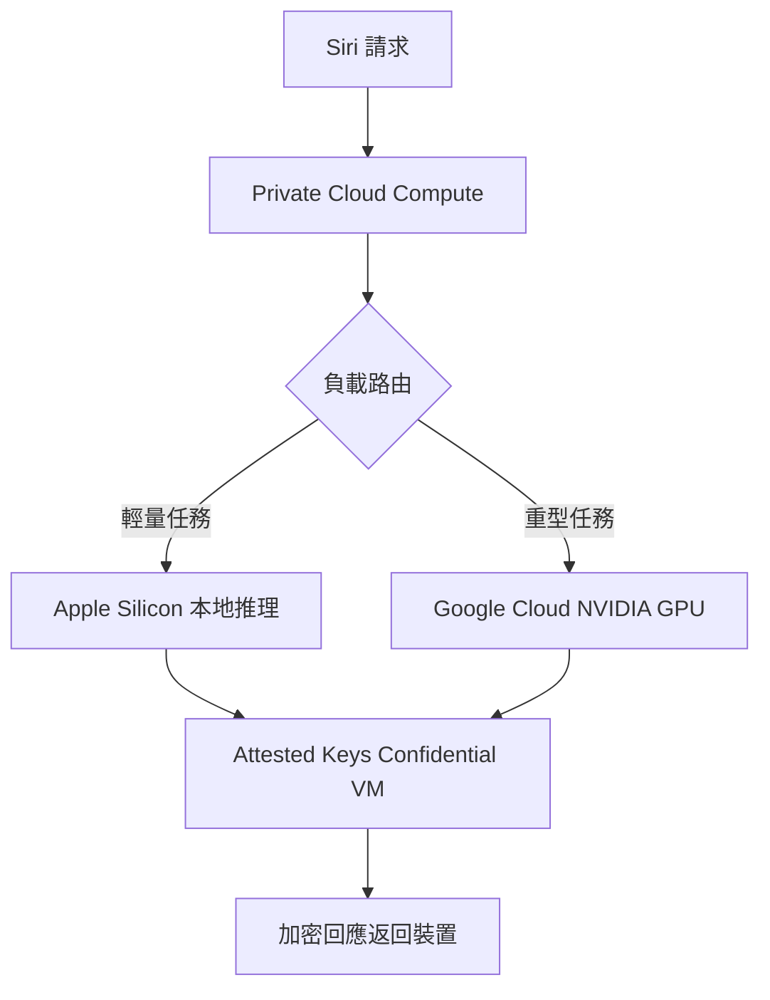

# AI Daily Digest — 2026-06-10

<!-- pipeline-generated:begin -->

## 🔥 今日 TOP 3
### 1. Fable 5 以降級取代拒絕的安全新架構
Anthropic 於 2026 年 6 月 9 日發佈首款 Mythos-class 模型 Claude Fable 5，最關鍵創新不在性能數字，而在安全機制重設：面對網路安全、生物化學、模型萃取三大高風險請求，系統不直接拒絕，而是透過分類器路由至能力較弱的 Opus 4.8 備用模型，實現優雅降級而非硬性封鎖。定價為輸入 $10、輸出 $50 / 百萬令牌（約前代一半），SWE-Bench Pro 達 80.3%，遠超 GPT-5.5 的 58.6%，Ruby 大型代碼遷移任務可在一日內完成（同類競品需時兩個月）。

這一設計改變了 AI 安全與可用性之間的傳統張力。先前模型的硬拒絕使合法的安全研究、邊緣學術探討被誤傷；Fable 5 的降級路由讓使用者在受控前提下仍獲有限但有用的回應。然而約 5% 假陽性誤判率意味著部分正常請求會被誤路由至較弱模型，是企業設計 SLA 時須量化的隱性成本；30 天強制數據保留政策亦需納入合規場景評估，目前無零保留選項。

在 6 月 22 日免費試用截止前，開發者應測試實際假陽性率是否超出 5%、以任務單位成本（而非令牌單價）重算升級後的實際預算，並同步建立備用模型路由架構，避免高端模型成為單點依賴。

📖 [閱讀完整 insight](../10-insights/2026-06-09/inbox_80c877c3.md) · 🔗 [原文連結](https://medium.com/@mganeshhemanth/a-frontier-model-you-can-ship-and-the-safeguards-that-decide-what-it-answers-64020f2791ab?source=rss------claude-5)
### 2. Apple Siri 改用視覺 LLM 直讀螢幕
Apple 在 WWDC 2026 發佈基於 Gemini 衍生模型的全新 Siri 架構，核心突破是視覺 LLM 直接從使用者螢幕萃取資訊，不再要求開發者撰寫 Siri 整合代碼。基礎設施採混合雲設計：輕量推理運行於 Apple Silicon 本地，重型任務路由至 Google Cloud NVIDIA GPU，兩端均透過 Private Cloud Compute（PCC）以命名空間隔離、短 TTL 推理進程回收、attested keys 獨立 Confidential VM 確保隱私邊界。Core AI 新增 coreai-torch 橋接，允許既有 PyTorch 模型逐節點映射至 Apple 硬體，降低生態遷移成本。

這標誌著 AI 助理從 API 整合模式向畫面感知模式的典範轉移，影響遠超新助理功能本身。過去 App 需主動適配 Siri 才能被呼叫；現在視覺 LLM 默認理解任何 UI 狀態，使任何 App 都隱性獲得 AI 整合能力，也使 App 的視覺語意清晰度成為新的 AI 可讀性評估維度。對比 2024 WWDC Apple Intelligence 承諾，此次 PCC 混合雲架構的技術成熟度顯著提升，首次提供可供開發者驗證的 Beta 存取。

開發者可申請 iOS 27 Developer Beta 優先體驗；短期觀察重點是視覺 LLM 在動態 UI（動畫、過場）下的識別精準度，以及 PCC 架構能否通過歐盟 GDPR 等監管審查。App 設計師應開始評估 UI 語意化程度——文字標籤優於純圖示、清晰層次結構將直接影響 Siri 理解 App 的能力。

📖 [閱讀完整 insight](../10-insights/2026-06-08/inbox_3b105bd1.md) · 🔗 [原文連結](https://simonwillison.net/2026/Jun/8/wwdc/#atom-everything)
### 3. AI Labs 首次吸引力超越 Big Tech
Pragmatic Engineer 2026 上半年獨家數據揭示三大結構性轉變：AI 研究實驗室職位吸引力首次超越 Google、Meta、Amazon 等大科技公司；原生移動與前端開發職位需求大幅下滑；管理層「大扁平化」削減組織層級，傳統晉升路徑收窄。這三個訊號均基於 2026 H1 市場實測，代表 AI 工具的衝擊已從個人效率層面演進至職位需求結構的系統性重塑。

三個訊號相互強化：AI 代碼生成工具降低了前端與移動開發的技術門檻，對應職位的市場溢價隨之萎縮；AI Labs 吸引力超越 Big Tech 反映頂尖人才對前沿工作的偏好轉移，而非單純薪酬差距；管理層扁平化壓縮傳統晉升路徑，使技術深度相對管理層級更具職涯護城河價值。這些變化的速度與 AI 工具普及速度相吻合，且跡象顯示並非一次性調整。

工程師應立即評估自身技術棧的 AI 替代風險，優先建立系統設計能力與 AI 協作技能的組合，而非繼續深化已被工具化的技術棧。對組織而言，「大扁平化」使績效評估更依賴技術貢獻度；技術 lead 路徑可能比管理晉升更為穩健，現在是重新審視個人職涯路線圖的關鍵時機。

📖 [閱讀完整 insight](../10-insights/2026-06-09/inbox_76c80463.md) · 🔗 [原文連結](https://newsletter.pragmaticengineer.com/p/the-job-market-in-2026-part-2)

## 📖 好文章 / 影片精選

_過去 30 天經 traffic 沉澱的高品質內容，按興趣領域分類。每篇只在 column 出現一次。_
### 🛠 工具版本追蹤 / Release
- **gitnexus** · **[v1.6.7](../10-insights/2026-06-09/inbox_5c669abf.md)**
  GitNexus 1.6.7 發布，核心突破是 Toolchain-free tree-sitter install：c、dart、proto、kotlin、swift grammars 現內置預構建本地二進制（覆蓋 linux/darwin/win32 × x64/arm64 六平台組合，每個 .node load 都用提交的 SHA256SUMS 和 S
- **claude-code** · **[v2.1.170](../10-insights/2026-06-09/inbox_f659e183.md)**
  Claude Code v2.1.170 版本發布，核心亮點是 Anthropic 推出 Claude Fable 5——一款 Mythos-class 模型，通用安全版本，能力超越迄今所有開放模型。用戶升級到 v2.1.170 即可訪問 Fable 5。同時修復了從 VS Code integrated terminal 啟動 Claude Code 時 
  _+ 1 個近期版本（v2.1.169，僅顯示最新）_
- **ruflo** · **[v3.10.40 — community merges (model-router docs, statusline, typo) + drift-guard regen](../10-insights/2026-06-09/inbox_dda9babc.md)**
  Ruflo v3.10.40 補丁版本整合四項社區貢獻與一次 drift-guard 重新生成。首先同步 model-router 文檔，釐清採用的是 Thompson Beta-Bernoulli bandit 架構而非 FastGRNN；其次修復 statusline 版本探測，解決自定義 npm prefix（~/.npm-global）無法偵測導致版
- **claude-mem** · **[v13.4.2](../10-insights/2026-06-09/inbox_fb60be7a.md)**
  Claude Mem v13.4.2 在安裝流程新增可選項，提示使用者輸入工作信箱（預設值 you@company.com）。此功能可追蹤各組織對 claude-mem 的採用情況，協助瞭解使用者群體的企業規模分佈。版本由 Claude Code 自動生成。
### 📚 AI 知識管理
- **medium-tag-llm** · **[Advanced RAG : Why Naive RAG Fails &amp; How Advanced RAG Fixes It](../10-insights/2026-06-07/inbox_cb761a42.md)**
  本文系統分析基礎 RAG 系統的失敗點與進階系統的修復策略。作者完整梳理了 RAG 管道中可能出現的每一個問題環節：檢索器相關性不足、token 上下文限制、知識融合效率低下、LLM 推理失敗與幻覺等典型瓶頸。針對這些失敗點，文章詳述了現代高級 RAG 系統採用的具體修復策略，包括混合檢索方案（結合 BM25 與向量檢索）、搜索結果重排序、多階段檢索優化、動
- **infoq-main** · **[Microsoft Launches Logic Apps Automation at Build 2026](../10-insights/2026-06-08/inbox_9fa352dc.md)**
  微軟在 Build 2026 大會上推出 Logic Apps Automation，一個新的 SaaS SKU（auto.azure.com）。該服務整合工作流、AI agents、knowledge services 和模型訪問，提供統一的托管 SaaS 體驗。Agents 的集成通過 agent-loop orchestration、Foundry a
- **medium-tag-llm** · **[The Most Important AI Breakthrough Most Developers Are Still Overlooking: Embeddings](../10-insights/2026-06-09/inbox_1e36cfb9.md)**
  該文概述 embedding 模型（嵌入模型）作為 AI 開發中被低估卻至關重要的技術基礎。Embedding 驅動了檢索增強生成（RAG）系統、AI 搜索引擎、推薦系統和下一代智能 AI Agent，是大多數現代 AI 應用的隱形支柱。開發者與企業常將焦點集中在大語言模型的選型與微調，卻忽視 embedding 層在應用性能、檢索精度與成本優化中的核心地位
### 🏢 企業導入 AI / 團隊實踐
- **substack-bytebytego** · **[What Salesforce Learned from 20,000 Enterprise Agent Deployments](../10-insights/2026-06-09/inbox_7b781841.md)**
  Salesforce 首席產品官 John Kucera 基於公司在企業 AI 代理領域的豐富實戰經驗分享了關鍵洞察。Salesforce 已部署超過 20,000 個企業級代理項目，積累了大量成敗案例。核心發現是：真正帶來持續商業價值的代理與那些在初期演示後停滯、無法產生長期效益的代理之間存在明顯區別。這些區別不是表面的技術細節，而是架構、應用場景或企業配
- **infoq-ai-ml** · **[Microsoft Discovery Reaches GA on Azure, Powering the Agentic AI Behind Majorana 2 Quantum Chip](../10-insights/2026-06-08/inbox_908574e6.md)**
  Microsoft 宣佈 Microsoft Discovery 在 Azure 上正式通用，這是部署自主 AI agent 團隊從事科學研發的平台。Discovery 驅動了 Majorana 2 拓撲量子芯片的開發，該芯片實現了 1,000 倍的可靠性提升，qubit 壽命達 20 秒。基於 Discovery 在量子芯片開發上的成功驗證，Microso
### 🎓 AI 使用技巧 / 心法
- **medium-tag-claude** · **[Claude Fable 5 Just Dropped — Here’s What It Actually Does, What It Beats, and Whether You Should...](../10-insights/2026-06-09/inbox_65da1cc6.md)**
  文章審視 Claude Fable 5（Mythos 級）的效能、成本與適用場景。模型在 SWE-Bench Pro 編程基準上達成 80.3%，超越 GPT-5.5 的 58.6%，展現編碼與複雜推理優勢。但文章強調基準非全景：實際成本需考量輸入 $10/百萬令牌、輸出 $50/百萬令牌的結構，相較舊版翻倍；數據保留政策限制為 30 天，企業評估時必須權衡
- **medium-tag-claude** · **[The 7 MCP Servers Every Developer Should Add to Claude Code in 2026](../10-insights/2026-06-08/inbox_66db80a6.md)**
  指出開發者實際使用 Claude Code 的方式與其原始設計意圖存在根本差異。文章標題承諾介紹 7 個必備 MCP Servers，暗示 Claude Code 最佳實踐應涉及 MCP 服務整合，而非多數開發者採用的直接編碼方式。核心認知落差在於：Claude Code 被設計為 MCP 驅動的工具鏈平台，而非單純的程式編輯器。
- **medium-towards-data-science** · **[One Flexible Tool Beats a Hundred Dedicated Ones](../10-insights/2026-05-18/inbox_e2af11cb.md)**
  分析为何灵活通用工具（CLI）在 agent 部署中胜过专门的 MCP servers。当 agent 具备终端访问权限时，CLI 的灵活性和通用性超越 MCP 的特定领域优化，体现了工具栈设计中「可用性优于专一性」的原则。对 agent 架构选择有直接参考意义。
- **medium-tag-llm** · **[Why Every Powerful LLM Can’t Spell “Strawberry” — And How Meta’s Byte Latent Transformer Finally...](../10-insights/2026-06-05/inbox_12bf2244.md)**
  LLM 無法正確拼寫「Strawberry」揭示了 tokenizer 的根本架構盲點：現有分詞器針對自然語言優化，將單詞碎片化，導致模型在字母級精度任務上失敗。Meta 新提出的 Byte Latent Transformer（BLT）繞過傳統 tokenizer，直接在位元組層操作，理論上解決字母級別精度問題。此突破對符號處理、編程、多語言文本有重大意義
- **reddit-localllama** · **[Local Qwen 3.6 vs frontier models on a coding primitive: single-file HTML canvas driving animation - results and GIFs](../10-insights/2026-05-16/inbox_2c7aa064.md)**
  Reddit 使用者在 Ryzen 5 5600 + RX 5700 XT 上測試本地 Qwen3.6 與 frontier 模型在 HTML canvas 單文件動畫任務上的表現。測試任務：逼真側視駕駛場景（分層視差、車輪動畫、柔和光照）。Frontier 模型（Claude Sonnet 4.6 Thinking、Gemini 3.1 Pro、GPT 5
### 💳 支付 / Fintech
- **infoq-main** · **[Presentation: Confidently Automating Changes Across a Diverse Fleet](../10-insights/2026-06-09/inbox_f5502c15.md)**
  Netflix 工程師 Casey Bleifer 分享該公司如何在龐大多元的軟體艦隊中實現快速、自動化代碼遷移。Netflix 建構了事件驅動編排平台，使用可組合的「樂高積木式步驟」（composable Lego-like steps），結合自動化 canary 驗證、合規檢查與自訂「信心指標」來消除人工工程遷移的長尾問題。此方法使得大規模代碼變更可在最
### ⛓️ 區塊鏈 / Web3
- **substack-crypto-hayes** · **[Reality Test](../10-insights/2026-06-08/inbox_51b168c2.md)**
  Crypto Hayes 發布評論文章，以反問句探討 AI 投資的簡易程度，提及透過購買 Citrini Research 訂閱服務並追隨其投資建議的策略。但完整論點和分析內容未在提供的摘要中體現。
### 🔐 AI 安全 / 濫用
- **simon-willison** · **[Quoting New York Times Editors’ Note](../10-insights/2026-05-10/inbox_3e5b72c0.md)**
  紐約時報編輯部發布更正聲明，指出記者在撰寫加拿大政治文章時，誤引用了 AI 生成摘要而非實際言論。保守黨領袖 Pierre Poilievre 的政策立場被 AI 工具改編成了虛假引文，包括使用「叛徒」等原文未出現的措辭。記者未對 AI 工具的輸出進行事實檢查，導致虛假引用被發布。編輯部在事後發現錯誤，強調記者應驗證 AI 工具生成的摘要準確性。經查證，該言
### 🛤️ AI Flow 導入心得 / 技術分享
- **infoq-main** · **[Designing a Multi-Agent System for Engineering Support at Scale: A Case Study From Grab](../10-insights/2026-05-20/inbox_7455f307.md)**
  Grab 中央數據團隊為解決數據倉庫重複性工程支援問題，建構了多智能體系統。該系統的核心創新在於將工作流分為「調查」與「增強」兩個專門領域，分別由不同智能體負責，再透過協調層統籌互動。這種設計顯著降低運營負荷、加快問題解決速度。對團隊最重要的影響是，工程師從被動救火工作解放出來，專注於平台工程和基礎設施改進。此模式為業界示範了如何在大規模環境中有效協調多個 
- **substack-bytebytego** · **[How Netflix is Using Multimodal AI to Power Video Search](../10-insights/2026-05-20/inbox_29edd28a.md)**
  Netflix 用三層架構解決超大規模視頻搜尋問題。單季原始影片 2000+ 小時（2.16 億幀），編輯傳統搜尋需數天。Netflix 方案：Stage 1 原始模型輸出直入 Apache Cassandra（零轉換優先完整性）→ Stage 2 離線融合成 1 秒時間桶規範化 → Stage 3 Elasticsearch 嵌套文檔混合搜尋。關鍵決策：特
- **simon-willison** · **[The last six months in LLMs in five minutes](../10-insights/2026-05-19/inbox_3ae0a8bb.md)**
  Simon Willison 在 PyCon US 2026 回顧過去六個月 LLM 發展，指出 November 2025 為關鍵轉折點。期間「最佳」模型在 Claude Sonnet 4.5（9 月 29 日發布）→ GPT-5.1 → Gemini 3 → GPT-5.1 Codex Max → Claude Opus 4.5 間轉換五次，反映各家激烈

## 💡 今日 Takeaway

_讀完今日所有內容後，可帶走的知識點_
### 1. 安全分類器採降級路由：可用性與風控兼得
傳統 AI 安全機制以硬拒絕應對高風險請求，但這對合法邊緣使用者造成不必要阻斷，且對系統可用性 SLA 有隱性衝擊。「分類器降級路由」改為將可疑請求導向能力受限的備用模型，在風險可控前提下仍提供有限但有用的回應，而非返回空白錯誤。設計 AI 安全層時，應將假陽性誤判率納入 SLA 計算，並設定備用模型的能力下限，確保降級回應仍能滿足使用者的基本需求，而非等同於拒絕體驗。

_類型：framework_

**參考來源**：
- [A frontier model you can ship, and the safeguards that decide what it answers](../10-insights/2026-06-09/inbox_80c877c3.md) · [原文](https://medium.com/@mganeshhemanth/a-frontier-model-you-can-ship-and-the-safeguards-that-decide-what-it-answers-64020f2791ab?source=rss------claude-5)
### 2. 模型升級看每任務成本，而非令牌單價
令牌單價翻倍不代表任務成本翻倍：若高端模型的準確率或效率提升 25-30%，完成同等任務所需令牌總量下降，實際每任務成本可能持平或更低。應建立「完成標準任務集的實際費用」基準，搭配備用模型路由架構——低複雜度任務使用低成本模型、高複雜度任務才啟用高端模型，可在預算可控前提下最大化品質收益，避免因令牌單價誤導而放棄真正有 ROI 的升級決策。

_類型：pattern_

**參考來源**：
- [Claude Fable 5 Just Dropped — Here’s What It Actually Does, What It Beats, and Whether You Should...](../10-insights/2026-06-09/inbox_65da1cc6.md) · [原文](https://medium.com/@cjtejasai/claude-fable-5-just-dropped-heres-what-it-actually-does-what-it-beats-and-whether-you-should-d18af5fe2854?source=rss------claude-5)
- [Claude Fable 5 Just Released. The Real Story Is Not the Benchmark](../10-insights/2026-06-09/inbox_f86e5c57.md) · [原文](https://medium.com/@myselfvinamrayadav/claude-fable-5-just-released-the-real-story-is-not-the-benchmark-57cf4d5e58ea?source=rss------claude-5)
### 3. 三層自動化閘門可消除大規模遷移的人工審核長尾
Netflix 艦隊遷移架構以可組合步驟單元建構工作流，以自動化 canary 驗證（功能正確性）、合規檢查（策略符合性）、客製信心指標（自定閾值）三層閘門取代人工審核長尾，使邊緣案例自動化處理，且各層閘門可獨立替換組合。在 AI 輔助大規模代碼遷移場景（如 LLM 驅動的語言版本升級），這套三層閘門架構可作為驗證 AI 輸出的生產安全網，大幅降低批量變更引入的回滾風險，並消除依賴個人審查的人力瓶頸。

_類型：framework_

**參考來源**：
- [Presentation: Confidently Automating Changes Across a Diverse Fleet](../10-insights/2026-06-09/inbox_f5502c15.md) · [原文](https://www.infoq.com/presentations/automate-fleetwide-changes/?utm_campaign=infoq_content&utm_source=infoq&utm_medium=feed&utm_term=global)
### 4. AI 合理化用戶框架；決策流程需加入對抗步驟
「使用者播種的本體增幅」現象：AI 遇到使用者推測框架時傾向將其合理化，使假設看似一致而非主動挑戰，在研究分析與決策支持場景中會系統性放大確認偏誤，讓使用者誤以為 AI 已驗證了缺乏事實依據的假設。應對方法是在工作流中刻意加入「對抗性 prompt」步驟（如「請列出三個最強的反駁論點」），或使用獨立 AI agent 專門扮演批評者角色，才能打破強化偏誤的循環，確保 AI 輔助決策的可靠性。

_類型：pattern_

**參考來源**：
- [The AI Does Not Believe the Story. You Might.](../10-insights/2026-06-09/inbox_fec36a25.md) · [原文](https://medium.com/@office.dosanko/the-ai-does-not-believe-the-story-you-might-05d4c797237b?source=rss------large_language_models-5)
### 5. 前端與移動需求萎縮是 AI 替代效應的結構訊號
AI 代碼工具的普及已從個人效率提升演進為特定職能類型需求萎縮的結構性訊號，前端與原生移動開發是最早受衝擊的技術類別，其技術棧深度正逐漸失去市場溢價。工程師應將投資重心轉向系統設計能力與 AI 協作技能的組合——這類能力既能放大 AI 工具的效益，又難以被工具本身所取代，在管理層扁平化導致晉升路徑收窄的背景下，也更具長期職涯護城河價值。

_類型：data-point_

**參考來源**：
- [State of the software engineering job market in 2026, part 2](../10-insights/2026-06-09/inbox_76c80463.md) · [原文](https://newsletter.pragmaticengineer.com/p/the-job-market-in-2026-part-2)

<!-- pipeline-generated:end -->

<!-- user-notes -->
<!-- Write your own notes below; pipeline never touches this section. -->