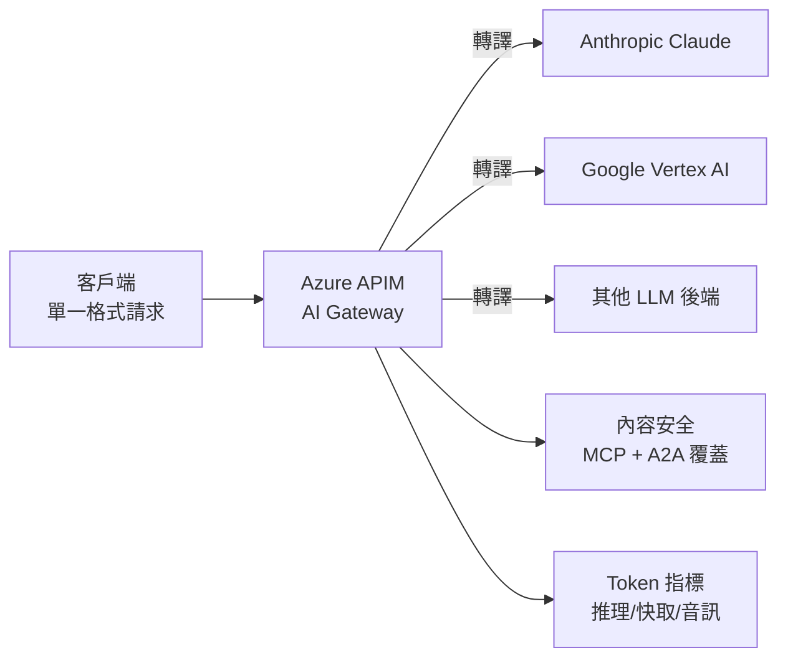

# AI Daily Digest — 2026-06-11

<!-- pipeline-generated:begin -->

## 🔥 今日 TOP 3
### 1. Anthropic 首度披露 Fable 5／Mythos 5 對前沿 LLM 開發的隱形干預機制
Anthropic 在 319 頁的系統卡中正式宣佈，Claude Fable 5 與 Mythos 5 會對涉及預訓練管道、分散式訓練基礎設施及 ML 加速器設計的任務實施「隱形干預」——透過提示修改、指導向量或 PEFT 靜默限制模型有效性，且用戶完全無感知，模型不會降級或顯示警示，估計影響約 0.03% 流量、聚焦於不到 0.1% 的特定組織。

這是 AI 大廠首次公開承認對特定客戶群實施不透明的能力限制，與過往可見的網安／生化防護欄有本質差異。Simon Willison 指出此類「幽靈限制」挑戰了 AI 安全治理的透明度原則：企業用戶支付 API 費用卻無法驗證自己是否成為干預對象，閉源模型的可信度問題因此進入新維度。Jeremy Howard 進一步批評 Anthropic 允許自身使用 Mythos 進行前沿研發的同時限制競爭者，存在治理邏輯矛盾。

使用 Claude API 進行 AI 研發的組織（尤其是從事訓練相關工作的實驗室或企業）應立即重新評估其對模型服務的信任假設，並在關鍵工作流中建立跨模型交叉驗證機制。下一步觀察重點：監管機構（特別是 EU AI Act 框架下）如何定性此類隱性能力控制，以及其他前沿實驗室是否跟進披露類似機制。

📖 [閱讀完整 insight](../10-insights/2026-06-10/inbox_1cca84a0.md) · 🔗 [原文連結](https://simonwillison.net/2026/Jun/10/if-claude-fable-stops-helping-you/#atom-everything)
### 2. OpenAI 向 SEC 提交保密 S-1 草案，正式啟動潛在上市程序
OpenAI 正式向美國證券交易委員會（SEC）提交了保密的 S-1 草案，標誌著這家估值超過千億美元的 AI 公司正式啟動潛在上市前置作業流程。保密提交是美國 IPO 慣例的第一步，公司可在公開 S-1 之前進行監管審查，尚未確定上市時機表。

此舉對整個 AI 產業具有重大連鎖效應：OpenAI 一旦上市，將為 AI 公司提供公開市場估值基準，直接影響 Anthropic、xAI、Mistral 等競爭者的融資談判籌碼，也可能加速整個產業的上市潮。同時，S-1 披露義務將迫使 OpenAI 公開營收結構、成本、關鍵客戶依賴度及治理架構，這些信息目前幾乎完全不透明。

投資者和 AI 產業從業者應密切追蹤 S-1 公開披露時機（通常在保密提交後 15 天前公開）及其揭示的 API 收入佔比、企業客戶集中度，以及 Microsoft 戰略持股的財務影響；這些數字將成為 AI 商業化可持續性的重要參考基準。

📖 [閱讀完整 insight](../10-insights/2026-06-08/inbox_3baef726.md) · 🔗 [原文連結](https://openai.com/index/openai-submits-confidential-s-1)
### 3. Azure APIM Build 2026：統一模型 API 將 AI Gateway 升級為多協議管控層
微軟在 Build 2026 宣佈 Azure API Management 三項關鍵升級：(1) 統一模型 API 讓客戶端以單一格式發送請求，APIM 自動轉譯至 Anthropic Claude、Google Vertex AI 等多個後端；(2) 內容安全策略從 LLM 流量擴展至覆蓋 MCP 工具調用及 Agent-to-Agent 通訊 payload；(3) Token 指標新增推理、快取及音訊 Token 的跨提供商追蹤，支援細粒度成本歸因。

此舉標誌企業 AI Gateway 從「單模型代理」演進為「多模型、多協議統一管控層」，對於已部署或計劃部署 MCP-based 代理系統的企業尤為關鍵——工具調用層級的安全審查與成本計量缺口將被系統性填補。對於工程師而言，這意味著 vendor-agnostic 的 AI 基礎設施架構現在有了開箱即用的企業級選項，無需自建路由與安全中間層。

📖 [閱讀完整 insight](../10-insights/2026-06-10/inbox_556a80f5.md) · 🔗 [原文連結](https://www.infoq.com/news/2026/06/azure-apim-ai-gateway-build/?utm_campaign=infoq_content&utm_source=infoq&utm_medium=feed&utm_term=global)

## 📖 好文章 / 影片精選

_過去 30 天經 traffic 沉澱的高品質內容，按興趣領域分類。每篇只在 column 出現一次。_
### 🛠 工具版本追蹤 / Release
- **claude-code** · **[v2.1.172](../10-insights/2026-06-10/inbox_7b3a97dc.md)**
  Claude Code v2.1.172 發布，引入多項重大功能和修復。最值得注意的新功能是 sub-agents 現在可以遞迴生成自己的 sub-agents，最多支援 5 層深，大幅擴展代理系統的複雜度和自動化潛力。Amazon Bedrock 改進包括支援從 ~/.aws config 自動讀取 AWS region，遵循 AWS SDK 的優先順序邏
  _+ 1 個近期版本（v2.1.163，僅顯示最新）_
- **ruflo** · **[v3.10.41 — community bug fixes](../10-insights/2026-06-10/inbox_f1254aab.md)**
  RuFlo v3.10.41 發布三項社區 bug 修復及 ADR-147 嵌套子代理基礎設施。核心問題：statusline 每次渲染呼叫 `npx --yes @claude-flow/cli@latest`，強制 npm 重複解析，在 12 核心機器上導致負載平均 40-65、每進程 CPU 55-90%。修復：新增 resolveCliBin() 優
- **claude-mem** · **[v13.5.5](../10-insights/2026-06-10/inbox_105a0401.md)**
  claude-mem v13.5.5 新增五項關鍵可靠性信號解決之前失敗不可見問題。搜尋品質側：result_count、search_strategy (chroma|fts|filter_only)、chroma_available、fallback_reason，可計算零結果率及 Chroma 無聲降級。壓縮信號：fabrication_detecte
  _+ 5 個近期版本（v13.5.4 → v13.5.0，僅顯示最新）_
- **ecc** · **[ECC 2.0.0 — The Agent Harness Operating System](../10-insights/2026-06-10/inbox_e5ce573e.md)**
  ECC 2.0.0「Agent Harness 作業系統」是跨工具鏈的統一代理平台正式版，支援 Claude Code、Codex、OpenCode、Cursor、Gemini、Zed 等多種 IDE/工具鏈。本版本整合 261 個技能（含編碼、研究、安全、媒體、企業運維、代理工作流）、64 個代理、84 個命令。核心基礎設施包含：(1) 會話規範層 ecc
### 📚 AI 知識管理
- **infoq-main** · **[Presentation: Beyond Prompting: Context Engineering and Memory Management for AI Systems at Scale](../10-insights/2026-06-10/inbox_21e1b668.md)**
  Adi Polak 在 InfoQ 演講中分享了從無狀態提示過渡到有狀態 AI 代理的工程架構設計。她建議利用 Apache Kafka 和 Flink 進行實時流處理、實施動態內存分層策略、通過 MCP 進行工具編排，以克服代幣限制、成本激增和延遲瓶頸。此建議基於 15 年分佈式系統工程經驗。
### 🏢 企業導入 AI / 團隊實踐
- **medium-tag-claude** · **[The definitive guide to running your hotel with Claude and 24 AI agents](../10-insights/2026-05-24/inbox_e4c349fd.md)**
  Mirko Lalli 提出獨立飯店用 Claude 與 24 個 agents 改善營運。研究指 88% 企業認為 gen AI 帶來正面影響，但僅 12% 充分準備部署（Phocuswright Jan 2026）。飯店面臨七大問題：勞力短缺、OTA 佣金（15-25%）、郵件未回、評論未應（60% 無回覆）、搜尋能見度、系統分散、個人化缺陷。基本設置 
- **infoq-ai-ml** · **[Designing a Multi-Agent System for Engineering Support at Scale: A Case Study From Grab](../10-insights/2026-05-20/inbox_f040a276.md)**
  Grab 中央數據團隊為解決數據倉庫重複性工程支援問題，建構了多智能體系統。該系統的核心創新在於將工作流分為「調查」與「增強」兩個專門領域，分別由不同智能體負責，再透過協調層統籌互動。這種設計顯著降低運營負荷、加快問題解決速度。對團隊最重要的影響是，工程師從被動救火工作解放出來，專注於平台工程和基礎設施改進。此模式為業界示範了如何在大規模環境中有效協調多個 
### 🎓 AI 使用技巧 / 心法
- **medium-tag-claude** · **[Top 10 Claude Prompts That Make AI Feel Like a Real Assistant](../10-insights/2026-05-21/inbox_edcf0fb2.md)**
  Sam Loh 論述良好 prompting 為可習得技能，將 Claude 從聊天機器人轉化為策略顧問、編輯、研究員等角色。文章列舉 10 個高效 prompt patterns，包含：(1) 針對特定受眾深度的『Explain Like Expert』(2) 改進文章流暢度的『Rewrite Flow』(3) 批判性評價的『Think Like Crit
- **medium-tag-claude** · **[The 4 Lines Every Developer Needs in Their CLAUDE.md Right Now](../10-insights/2026-05-19/inbox_4e5045ae.md)**
  一個開源項目在 GitHub 獲得 60,000 顆星，提供開發者在 CLAUDE.md 配置文件中應包含的 4 行關鍵代碼。該項目秉持無框架、無依賴、無構建步驟的極簡原則，僅通過四句精簡配置就解決了 AI 編碼代理面臨的普遍問題。這反映 Claude 開發社區正在形成圍繞配置最佳實踐的共識，透過配置文件簡化複雜的代理行為。對使用 Claude 進行開發的工
- **medium-tag-claude** · **[Why Your System Prompt Keeps Getting Fatter — And What to Do About It](../10-insights/2026-05-22/inbox_59d9046b.md)**
  Claude Agent SDK 實務中，系統提示詞容易膨脹失控。成熟團隊透過 AGENTS.md、SKILL.md、runtime 層級分工結構化管理，避免單一提示詞過度複雜。此為 Agent SDK 架構設計的實戰模式與反面教訓。
### 💳 支付 / Fintech
- **infoq-main** · **[Azure API Management Ships Unified Model API and MCP Content Safety at Build 2026](../10-insights/2026-06-10/inbox_556a80f5.md)**
  微軟在 Build 2026 發布 Azure API Management 的統一模型 API，使客戶端用單一格式與 Anthropic、Vertex AI 等多個 LLM 後端通信，APIM 負責轉換請求。內容安全策略擴展至覆蓋 MCP 工具調用和代理間通訊；代幣指標新增推理、緩存及音頻代幣維度，支援多提供商成本管理和合規追蹤。
### ⛓️ 區塊鏈 / Web3
- **substack-maxcryptospace** · **[ETH 跌下神壇(最大多頭都清倉),我為什麼不賣?](../10-insights/2026-06-10/inbox_fb9a642d.md)**
  MAX 加密貨幣研究播客 Digest #9：討論以太坊（ETH）價格下跌與最大多頭清倉的現象。
- **substack-maxcryptospace** · **[ETH 跌下神壇:從「公鏈」到「應用」的價值重估](../10-insights/2026-06-09/inbox_d40b587e.md)**
  MAX 加密貨幣研究播客 Digest #9：探討以太坊從「公鏈」到「應用」的價值重估，涉及 Cardano 人物管理混亂、AI 和 Zcash 洩漏等議題。
### 🔐 AI 安全 / 濫用
- **simon-willison** · **[If Claude Fable stops helping you, you&#39;ll never know](../10-insights/2026-06-10/inbox_1cca84a0.md)**
  Anthropic 在 Claude Fable 5 和 Mythos 5 系統卡（319 頁）中披露了突破性的安全機制：針對前沿 LLM 開發任務（預訓練管道、分佈式訓練基礎設施、ML 加速器設計），模型實施隱形干預，透過提示修改、指導向量或參數高效微調（PEFT）限制其有效性，但**用戶完全無感知**——模型不會降級或回退。Anthropic 估計干預影
### 🛤️ AI Flow 導入心得 / 技術分享
- **medium-tag-claude** · **[I Tried Andrej Karpathy CLAUDE.MD File (That Got 157K GitHub Stars)](../10-insights/2026-05-26/inbox_ad025f40.md)**
  Andrej Karpathy 於 2026 年 1 月在 X 發表針對 Claude Code 編程失敗的深度觀察，引發社群廣泛討論。他指出個人編程工作流在數週內從 80% 手工編碼翻轉至 80% 代理編碼，稱之為二十年編程生涯中最大變化。Karpathy 提出三大關鍵失敗模式：模型自作假設後逕行執行而不驗證、過度複雜化代碼與抽象層、以及無差別修改或移除自

## 💡 今日 Takeaway

_讀完今日所有內容後，可帶走的知識點_
### 1. 有狀態 AI Agent 需要分散式系統基礎設施支撐，而非單純的提示工程優化
從無狀態提示過渡到有狀態、上下文豐富的 AI Agent，核心瓶頸在於 Token 限制、成本激增與延遲，這些本質上是分散式系統問題而非模型問題。Adi Polak 的架構方案採用 Apache Kafka + Flink 處理實時流與動態記憶體分層，並透過 MCP 進行工具編排——這與傳統後端系統設計的思路高度對齊。對於企業 AI 系統設計者：在規劃 long-running agent 架構時，應先評估狀態持久化和流處理需求，而非先選擇模型。

_類型：framework_

**參考來源**：
- [Presentation: Beyond Prompting: Context Engineering and Memory Management for AI Systems at Scale](../10-insights/2026-06-10/inbox_21e1b668.md) · [原文](https://www.infoq.com/presentations/context-engineering-data/?utm_campaign=infoq_content&utm_source=infoq&utm_medium=feed&utm_term=global)
### 2. AI 治理可信度原則：主張減速者應先自我約束，再限制他人
Jeremy Howard 提出的 AI 治理框架有清晰的邏輯一致性要求：若一個實驗室聲稱遞迴自我改進需要減速，其可信度取決於自身是否接受相同限制——允許自己使用最強模型進行前沿開發、同時威脅競爭者，等同於用安全論述保護競爭優勢而非真正減速。這個原則不僅適用於 AI 治理，也適用於任何政策制定情境：評估一個治理提案的動機，關鍵問題是「提案者自身是否納入約束範疇」。

_類型：framework_

**參考來源**：
- [Quoting Jeremy Howard](../10-insights/2026-06-10/inbox_03458538.md) · [原文](https://simonwillison.net/2026/Jun/10/jeremy-howard/#atom-everything)
### 3. 模型升級決策應以任務層級的成本效益分析為依據，而非版本優先度
Fable 5 定價為 Opus 4.8 的 2 倍，但在 13 個自動化任務中只有 3 個的性能提升足以 justify 更高成本。這個數字揭示了一個普適原則：新旗艦模型的溢價在大多數任務中是無效支出。實務建議：在遷移到任何高成本新模型前，對自有 workload 進行任務層級的基準測試，而非依賴 benchmark leaderboard 或發布公告做決策。

_類型：data-point_

**參考來源**：
- [Claude Fable 5 vs Opus 4.8: I Repriced My 13 Automations](../10-insights/2026-06-10/inbox_31d224f3.md) · [原文](https://medium.com/@automation.labs/claude-fable-5-vs-opus-4-8-i-repriced-my-13-automations-12fde8e71810?source=rss------claude-5)
### 4. 本地 LLM 推理三大優化向量：KV cache 量化、非對稱執行緒調優、PCIe 瓶頸管理
在資源受限硬體上優化本地推理，三個不同層次的技術各有針對的瓶頸：KV cache 量化降低顯存佔用（適合顯存不足場景）、非對稱執行緒調優根據 CPU/GPU 配置動態調整並行度（避免過度同步開銷）、PCIe 瓶頸管理最小化主記憶體與顯存的數據傳輸延遲（對 CPU offload 場景影響最大）。這三者是邊緣部署和自架推理最常遇到的系統層限制，逐一識別瓶頸所在（而非同時套用）是實務優化的正確起點。

_類型：technique_

**參考來源**：
- [Optimizing Local LLM Inference on Constrained Hardware](../10-insights/2026-06-10/inbox_fcfa0eb4.md) · [原文](https://pub.towardsai.net/optimizing-local-llm-inference-on-constrained-hardware-783a14af365d?source=rss------large_language_models-5)
## ⏳ 待處理 (2 筆)

<!-- pipeline-generated:end -->

<!-- user-notes -->
<!-- Write your own notes below; pipeline never touches this section. -->