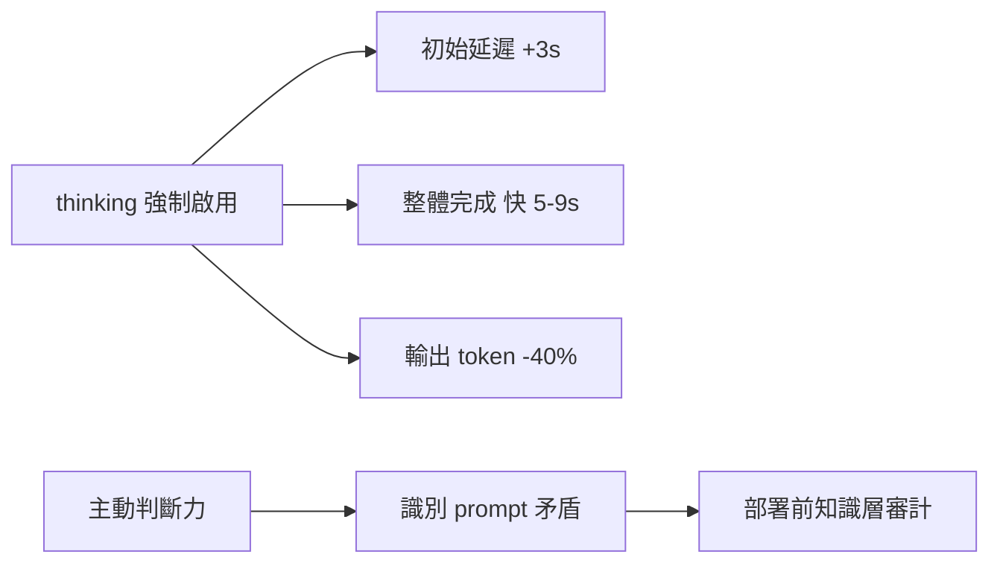
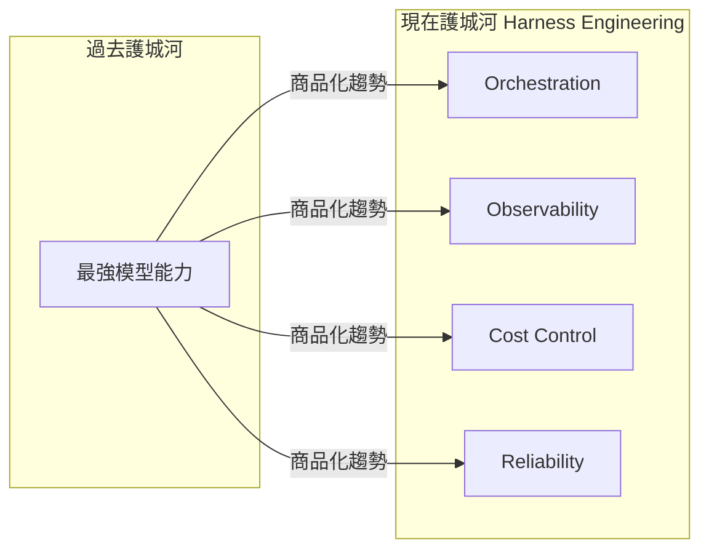

# AI Daily Digest — 2026-06-12

<!-- pipeline-generated:begin -->

## 🔥 今日 TOP 3
### 1. Claude Fable 5 實測六項：強制思考層、token 減 40%，部署前需知識審計
Anthropic 發布 Claude Fable 5，六項開發者實測揭示三大核心變更：thinking 層強制啟用（溫度參數同步移除）、輸出 token 減少約 40%，初始延遲雖增加 3 秒，但整體任務完成速度快 5-9 秒。6 月 22 日為訂閱專用期截止點，此前是最低成本入場窗口。

相較前代，最關鍵的質變是模型具備「主動判斷力」——能自行識別 system prompt 中的邏輯矛盾，而非盲目執行所有指令。多年累積的複雜 prompt 工程規則集因此可能引發意外行為。定價約升 3 倍，複雜推理任務性能增益顯著，簡單問答場景則約慢 1.4 倍。

部署前應執行「知識層審計」：讓 Fable 5 分析現有 system prompt 並回報矛盾與過時規則。每次重大模型版本切換都應納入此流程，而非等行為異常後才補救。

📖 [閱讀完整 insight](../10-insights/2026-06-11/inbox_c5b63658.md) · 🔗 [原文連結](https://www.productcompass.pm/p/claude-fable-5-guide)
### 2. AI 價值鏈大轉移：執行環境取代模型能力成為真正的護城河
戰略框架「Harness Engineering」提出：大語言模型正進入商品化階段，各家模型能力差距持續收斂，AI 應用的核心競爭力正從「哪個模型最強」轉向「誰能最高效地執行、監控與控制 AI 工作負載」。

此轉移對應雲端計算歷史的已驗證模式：IaaS 計算能力商品化後，真正的護城河落在 DevOps 平台與可靠性工程。同樣地，AI 執行環境四個維度——orchestration、observability、成本控制、可靠性管理——正成為差異化關鍵，受影響最深的是依賴單一模型優勢建立競爭壁壘的 AI 產品團隊。

實務建議：技術評估框架應從「性能基準」擴展至「可觀測性、成本追蹤、agent 穩定性」等執行層指標。現在構建 Harness 層能力，比持續追逐下一個模型版本更能帶來持久競爭優勢。

📖 [閱讀完整 insight](../10-insights/2026-06-11/inbox_9a99cdf7.md) · 🔗 [原文連結](https://medium.com/@sageholloway/harness-engineering-the-next-100b-layer-in-ai-88871e8ec817?source=rss------claude-5)
### 3. Fable 5 定價 $10/$50 實算：六工作負載兩項不可行，6/23 為決策截止點
針對 Claude Fable 5 新定價（$10/$50 per MTok）的深度成本分析顯示：六個真實工作負載中，有兩個在 6 月 23 日訂閱切換後將超出可承受成本範圍，案例跨度從每日簡報 $4/天至工作流每次運行 $950。

相較以往單純的「效能升級」，本次影響高度非對稱：低頻短 context 場景衝擊有限，但高頻長 context 的企業工作流面臨架構層面的重新設計。這標誌著 LLM API 費用已進入需與傳統基礎設施成本同等嚴格管理的階段，前代定價體系下的商業模型假設可能全面失效。

6 月 23 日是 credits 懸崖節點，受影響團隊應立即：(1) 盤點所有工作流的 token 消耗量；(2) 評估哪些場景可降級至 Opus 4.8 或開源模型；(3) 針對不可行場景重新設計 context 壓縮策略以降低 token 用量。

📖 [閱讀完整 insight](../10-insights/2026-06-11/inbox_14e6c9cb.md) · 🔗 [原文連結](https://medium.com/@automation.labs/i-priced-6-claude-fable-5-workloads-two-dont-survive-june-23-6e91a1425885?source=rss------claude-5)

## 📖 好文章 / 影片精選

_過去 30 天經 traffic 沉澱的高品質內容，按興趣領域分類。每篇只在 column 出現一次。_
### 🛠 工具版本追蹤 / Release
- **ruflo** · **[v3.10.42 — community bug batch: Windows path validation, trajectory feedback, init hooks](../10-insights/2026-06-11/inbox_5f5f59d6.md)**
  Ruflo v3.10.42 補丁版本修復社區回報的三個臭蟲，針對 Claude Code hook 系統。第一，#2352 修正 Windows 路徑驗證——validatePath 函式將反斜線判為 shell 特殊字元，導致絕對路徑（如 E:\Repos\...）被拒；修復後改為檢查 result.success 欄位並妥善顯示錯誤。第二，#2351 
- **claude-code** · **[v2.1.173](../10-insights/2026-06-11/inbox_ca542563.md)**
  Claude Code v2.1.173 發佈，主要包含兩項 bug 修復。首先，修復 Fable 5 模型名稱帶有 [1M] 後綴的規範化問題，該後綴會自動被剝離，避免模型識別錯誤。其次，修復 Windows 環境下啟用 sandbox 時出現的虛假「sandbox 依賴缺失」警告。這些修正改善了工具在跨平台環境下的穩定性和用戶體驗。
- **claude-mem** · **[v13.5.6](../10-insights/2026-06-11/inbox_273cb7c5.md)**
  Claude Mem v13.5.6 大幅重構 worker 生命週期管理，解決重啟競態、EADDRINUSE 失敗與「健康 worker 誤判為不運行」問題。核心創新是自我更替 worker——舊 worker 在港口釋放時立即生成後繼者，新舊決不共存，避免外部程序競搶生成；同時透過 spawn.lock（60 秒逾期策略）序列化 hook、MCP ser
### 📚 AI 知識管理
- **medium-tag-llm** · **[Stop Building LLM Wrappers: Why 2026 Belongs to RAG Architects](../10-insights/2026-06-11/inbox_b6d5313c.md)**
  文章宣佈 LLM wrapper 創業時代的終結，並預測 2026 年 AI 產業將轉向 RAG 架構師驅動的競爭。2024–2025 年期間，簡單包裝 LLM API 就足以構建可銷售的產品，創業者無需深入理解底層技術。但隨著市場飽和與競爭加劇，該套利機會已枯竭。2026 年及以後的成功者將聚焦於深度的檢索增強生成(RAG)架構設計、向量資料庫最佳化、上下
- **medium-tag-claude** · **[I Tested Claude’s New Persistent Memory Feature for 30 Days Straight — Here Is What Nobody Is...](../10-insights/2026-05-30/inbox_db074451.md)**
  使用者連測30天Claude持久記憶功能，發現該功能分為Chat自動摘要和手動管理兩種模式。關鍵發現：自動記憶會壓縮技術細節，但跨對話的模式識別能力超預期（能自動發現訊息不一致），構成最高價值應用。該功能不提升模型智能，而是透過累積上下文在長期專案中複合式提升工作效率。作者提供初始化、持續性、月審和策略性洞察四個核心提示範本，並標註自動摘要的損失和跨平台遷移
### 🏢 企業導入 AI / 團隊實踐
- **medium-tag-claude** · **[A frontier model you can ship, and the safeguards that decide what it answers](../10-insights/2026-06-09/inbox_80c877c3.md)**
  Anthropic 發佈 Claude Fable 5（Mythos 級模型），其創新之處不在原始性能而在安全架構設計。Fable 5 採用「降級而非拒絕」的分類器策略，將高風險請求（涉及網路安全、生物化學、模型萃取）轉向較弱的 Opus 4.8 模型，而非直接拒絕。定價為每百萬輸入令牌 10 美元、輸出 50 美元，約為舊版本一半，並支持長期任務如 Rub
- **infoq-main** · **[Presentation: Building Evals for AI Adoption: From Principles to Practice](../10-insights/2026-05-29/inbox_d38c6d6c.md)**
  Mallika Rao 在 InfoQ 演講中指出生產 AI 系統中「evaluation debt」的隱患，分享她在 Twitter、Walmart、Netflix 的經驗。提出五層評估堆棧框架（涵蓋基礎設施到 UX 層面），解釋傳統指標為何對現代 AI 架構失效，並介紹診斷成熟度模型協助工程領導者識別和消除「靜默語義故障」——即評估未覆蓋邊界案例中潛伏的
- **medium-tag-llm** · **[I Stopped Switching Between AI Tools. Then I Discovered MCP.](../10-insights/2026-05-24/inbox_1637ff2c.md)**
  Vivek Jha 描述 Model Context Protocol (MCP) 如同「AI 的 USB-C」，統一標準化接口讓所有 AI 模型(Claude、Copilot、DeepSeek、Qwen)無需客製整合即可訪問本地工具(Docker、PostgreSQL、GitHub、Kubernetes)。核心啟示：開發者應聚焦於建構強健的 AI 基礎架構
### 🎓 AI 使用技巧 / 心法
- **substack-product-compass** · **[The Ultimate Guide to Claude Fable 5](../10-insights/2026-06-11/inbox_c5b63658.md)**
  Claude Fable 5 發布後進行的 6 項實驗結果分析。核心改變包括：思考層（thinking）強制啟用、溫度參數移除、6 月 22 日前訂閱專用。實測性能：初始延遲約 3 秒，但同時輸出 token 減少 40% 並完成速度快 5-9 秒，簡單一次性問題約慢 1.4 倍。最重要的進展是模型具備「判斷力、品味與多維性」，能獨立發現指令文件的矛盾。建議
- **medium-tag-claude** · **[I Priced 6 Claude Fable 5 Workloads. Two Don’t Survive June 23.](../10-insights/2026-06-11/inbox_14e6c9cb.md)**
  深度成本分析表明，Claude Fable 5 在新定價 $10/$50 token 費率下，六個典型工作負載中有兩個在 6 月 23 日截止日期後變得不可行。具體案例跨度從低成本日常應用（$4/天簡報）到高成本工作流（$950/次運行），直觀展示定價變化對不同規模應用的差異化衝擊。這個分析對依賴 Claude API 的團隊具有直接決策價值，尤其在面臨 c
- **medium-tag-claude** · **[Part 7 | Concurrent Tool Execution: How Claude Code Runs Many Tools at Once Without Breaking...](../10-insights/2026-05-30/inbox_d60032b7.md)**
  本文是 Claude Code 并发工具执行系列的第 7 篇深度技术分析。重点讲解 Claude Code 如何安全地同时执行多个工具而不产生冲突或竞争条件。核心机制包括：推测执行（speculative execution），允许预测性地启动多个工具；以及每输入安全检查（per-input safety checks），确保工具间隔离与一致性。文章提出关键
- **medium-tag-llm** · **[Managing LangGraph State Across Multiple Servers Using PostgreSQL](../10-insights/2026-06-03/inbox_b39730a5.md)**
  本文揭示多伺服器部署的 LangGraph 狀態管理隱藏問題：預設 MemorySaver 將狀態存儲於 RAM，跨伺服器請求路由時導致狀態丟失（「第 2 輪 → 負載均衡器 → 伺服器 B，但 B 知道什麼都沒有」）。粘性會話（sticky sessions）看似簡單但在伺服器故障、伸縮事件、不均勻負載時失效。解決方案：LangGraph checkpoi
- **medium-towards-data-science** · **[Prefill Once, Fan Out: KV Snapshot Sharing for Multi-Agent LLM Pipelines](../10-insights/2026-06-09/inbox_93a794b7.md)**
  本文介绍了多智能体 LLM 推理中的性能优化技术：KV 缓存快照共享 (KV Snapshot Sharing)。作者展示了如何用 C++ 构建一个运行时系统，通过 copy-on-fork 机制让多个智能体任务共享同一份文档的 prefill 结果，彻底避免重复计算相同上下文的 KV 缓存。这项优化在多智能体管道中显著减少了 GPU 和显存的冗余开销。该技
### 💳 支付 / Fintech
- **infoq-ai-ml** · **[Azure API Management Ships Unified Model API and MCP Content Safety at Build 2026](../10-insights/2026-06-10/inbox_993a4e67.md)**
  Azure API Management (APIM) 在 Build 2026 發佈統一模型 API 與 MCP 內容安全功能。核心創新：(1) 統一模型 API 允許客户端使用單一格式，APIM 自動轉譯請求至 Anthropic、Vertex AI 與其他後端，簡化多模型集成；(2) 內容安全政策擴展覆蓋 MCP 工具呼叫與 Agent-to-Agen
- **infoq-ai-ml** · **[OpenAI&#39;s GPT-5.5 and Codex Reach General Availability on Amazon Bedrock](../10-insights/2026-06-11/inbox_73ba526c.md)**
  OpenAI 的 GPT-5.5、GPT-5.4 和 Codex 三款模型現已在亞馬遜 Bedrock 正式通用可用。此可用性公告發佈於 OpenAI 與微軟修訂獨佔協議一個月後。定價策略與 OpenAI 官方直接費率保持一致，用戶的 AWS 使用量亦納入現有的 AWS 承諾合約。Codex 的計費模式已轉換為按 token 計費，不再收取席位費用。值得注意
### ⛓️ 區塊鏈 / Web3
- **medium-tag-llm** · **[The Hidden Cost of JSON in the AI Era](../10-insights/2026-06-11/inbox_002b32ce.md)**
  文章分析 JSON 在 AI 時代的隱藏成本。根據副標題，LLM 傾向使用 TOON 等替代格式而非 JSON，token 成本的差異正迫使業界重新思考資料格式的選擇。這個洞見揭示了在大規模 LLM 應用中，序列化格式直接影響推理成本。不同的資料格式在 tokenization 效率上存在顯著差異，例如 JSON 的冗餘括號與鍵值對結構可能導致 token 
### 🛤️ AI Flow 導入心得 / 技術分享
- **infoq-architecture** · **[Designing a Multi-Agent System for Engineering Support at Scale: A Case Study From Grab](../10-insights/2026-05-20/inbox_3251a7f0.md)**
  Grab 的 Central Data Team 開發了多智能體 AI 系統，自動化資料倉儲平台的重複性工程支援任務。該系統採用協調層（orchestration layer）設計，分離調查（investigation）和改進（enhancement）兩大工作流，由專責智能體分別執行。通過這種分離，系統減少了運維團隊的手動負擔，大幅加快問題解決速度。更重要的

## 💡 今日 Takeaway

_讀完今日所有內容後，可帶走的知識點_
### 1. 模型大版本升級前應先審計 system prompt，識別過時或矛盾規則
當新世代 LLM 具備主動判斷能力後，積年累月的 system prompt 規則集可能因邏輯矛盾引發意外行為。「知識層審計」是指：直接要求模型分析現有指令集並回報其中的衝突與過時假設，在部署前消除隱患。此步驟應納入每次重大模型版本切換的部署 checklist，而非等行為偏離後才補救。

_類型：framework_

**參考來源**：
- [The Ultimate Guide to Claude Fable 5](../10-insights/2026-06-11/inbox_c5b63658.md) · [原文](https://www.productcompass.pm/p/claude-fable-5-guide)
### 2. LLM 商品化後 AI 護城河下沉至執行層，而非模型能力本身
隨著基礎模型性能差距收斂，能高效執行與監控 AI 工作負載的平台能力才是長期競爭壁壘。雲端計算商品化後，真正的差異化落在 DevOps 與可靠性工程而非計算能力，AI 層正在重演同樣模式。評估 AI 工具時應從「哪個模型最強」轉向「哪個執行環境最可控、可量測、可優化」。

_類型：framework_

**參考來源**：
- [Harness Engineering: The Next $100B Layer in AI](../10-insights/2026-06-11/inbox_9a99cdf7.md) · [原文](https://medium.com/@sageholloway/harness-engineering-the-next-100b-layer-in-ai-88871e8ec817?source=rss------claude-5)
- [Stop Building LLM Wrappers: Why 2026 Belongs to RAG Architects](../10-insights/2026-06-11/inbox_b6d5313c.md) · [原文](https://medium.com/@verasaravana/stop-building-llm-wrappers-why-2026-belongs-to-rag-architects-d106a5c60d7e?source=rss------large_language_models-5)
### 3. 平均 GPU 利用率具系統性誤導性，AI 基礎設施診斷應改用分位數與時序數據
對 GPU 資源取平均值會掩蓋真實的飽和與排隊延遲：高峰時段已完全飽和的集群，可能因低谷時段的低值拉低平均而看起來「健康」。正確診斷方式是使用 P95/P99 分位數指標搭配完整時序數據。此原則同樣適用於 LLM 推理系統的 token 吞吐量、API 延遲等所有性能測量維度。

_類型：framework_

**參考來源**：
- [When GPU Utilization Lies: The Hidden Systems Problem Slowing Modern AI](../10-insights/2026-06-11/inbox_810ba6a8.md) · [原文](https://towardsdatascience.com/when-gpu-utilization-lies-the-hidden-systems-problem-slowing-modern-ai/)
### 4. JSON 在 LLM 應用中存在 token 膨脹成本，預算規劃應納入序列化格式因子
JSON 的冗餘結構（括號、引號、鍵值重複）使 token 用量比緊湊格式（如 TOON）顯著膨脹，在高頻 LLM API 調用場景中直接推高運營成本。規劃 AI 應用預算時，應對比不同序列化方案在真實工作負載下的 token 差異，以 token inflation factor 為基準，而非僅依賴名義定價數字。

_類型：data-point_

**參考來源**：
- [The Hidden Cost of JSON in the AI Era](../10-insights/2026-06-11/inbox_002b32ce.md) · [原文](https://medium.com/javarevisited/the-hidden-cost-of-json-in-the-ai-era-dd34356b1856?source=rss------large_language_models-5)
### 5. 凍結塔架構可低成本將現有文本嵌入模型擴展至多模態，無需從零訓練
GELATO 的「凍結塔」架構展示：保持現有強大文本嵌入模型參數不變，僅訓練新增的模態橋接層，即可獲得多模態嵌入能力，大幅降低從零訓練完整多模態模型的計算開銷。資源受限的工程或研究團隊在擴展嵌入模型的多模態能力時，應優先評估凍結基礎模型的遷移學習路徑，而非直接啟動全量訓練。

_類型：technique_

**參考來源**：
- [GELATO: The Frozen Towers Approach to Multimodal Embeddings](../10-insights/2026-06-11/inbox_7eed019c.md) · [原文](https://medium.com/@ayush.dhanker/gelato-the-frozen-towers-approach-to-multimodal-embeddings-f4cadf13fd6b?source=rss------large_language_models-5)

<!-- pipeline-generated:end -->

<!-- user-notes -->
<!-- Write your own notes below; pipeline never touches this section. -->