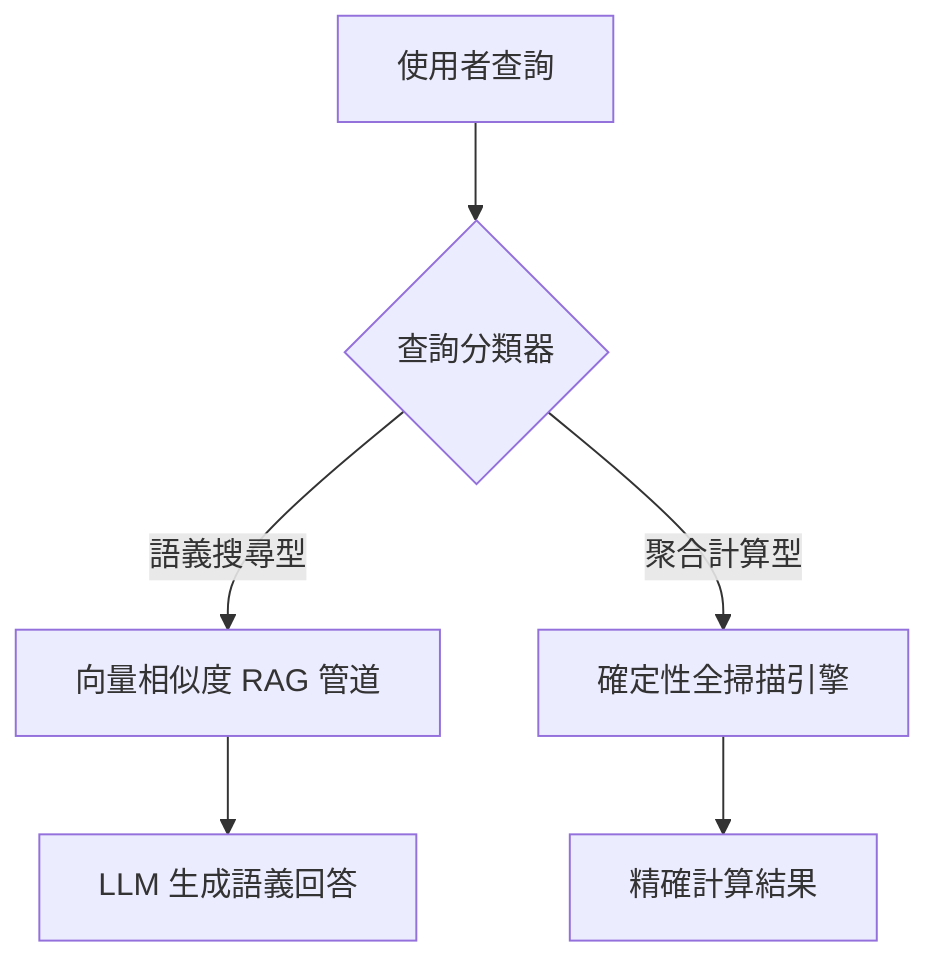

# AI Daily Digest — 2026-06-14

<!-- pipeline-generated:begin -->

## 🔥 今日 TOP 3
### 1. 美政府出口管制令強制下架 Fable 5，開 AI 禁令首例
2026年6月12日，美國政府以國安考量發布出口管制令，要求 Anthropic 立即禁用 Fable 5 與 Mythos 5 模型的全球存取，涵蓋所有用戶含外籍員工。Anthropic 遵令執行，但 CEO Dario Amodei 公開反對，指政府識別的僅是「一個狹隘潛在越獄漏洞」，若此標準推廣至業界，將「本質上阻止所有前沿模型的新部署」。

此為美國歷史上首次對已商用部署的大型語言模型實施政府禁令，確立了關鍵先例：地緣政治與國安判斷可直接成為 AI 產品可用性的開關。更值得關注的是監管標準的模糊性——若「存在潛在越獄」即可觸發禁令，而同類能力廣泛存在於競品模型，整個行業的前沿模型部署均面臨不可預期的政策風險。

觀察重點：（1）政府是否對 OpenAI、Google 等同類模型採取相似行動；（2）Anthropic 能否通過安全補丁恢復 Fable 5 服務；（3）此案是否催生行業層面的「監管前置合規測試」標準。對企業採購決策者：應立即將政府禁令風險納入服務連續性規劃，並評估現有 AI 架構的多模型 fallback 能力。

📖 [閱讀完整 insight](../10-insights/2026-06-13/inbox_97d4beda.md) · 🔗 [原文連結](https://www.anthropic.com/news/fable-mythos-access)
### 2. WebMCP 進入 Chrome Origin Trials，Web Agent 互動走向標準接口
Google 宣佈 WebMCP（Web Model Context Protocol）正式進入 Chrome 149 Origin Trials 階段，讓網站可向瀏覽器內的 AI agent 暴露 JavaScript 函數與 HTML 表單等工具接口，agent 可直接呼叫函數，無需解析 DOM 或讀取螢幕截圖。這是 Web 平台首次引入類似桌面端 MCP 的 AI agent 原生整合層。

傳統 Web Agent 依賴脆弱的 DOM 解析與視覺識別，容易因頁面改版而失效，維護成本高。WebMCP 讓互動方式從「AI 猜測 UI 結構」轉為「網站主動暴露能力接口」，與 MCP 在桌面工具的角色類比，可從根本上提升 Web 自動化的可靠性，對企業流程自動化與 RPA 場景有直接正面影響。

Origin Trial 階段預計 6-12 個月後進入正式標準化流程。現在可採取的行動：若正在建構 Web Agent，開始評估目標網站是否計劃支援 WebMCP；若是網站開發者，可優先試點接入 Origin Trial 以搶先相容未來 AI agent 的標準化呼叫。

📖 [閱讀完整 insight](../10-insights/2026-06-13/inbox_295a4e33.md) · 🔗 [原文連結](https://www.infoq.com/news/2026/06/webmcp-web-agent-standard-chrome/?utm_campaign=infoq_content&utm_source=infoq&utm_medium=feed&utm_term=global)
### 3. RAG 聚合查詢應繞過向量管道，走確定性全掃引擎
一項基於 100,000 列資料的基準測試揭露：擴大 RAG 上下文窗口無法改善聚合查詢（計數、求和、分組統計）的準確性，反而會遮蔽計算錯誤使問題更難被偵測。研究建議在架構層加入查詢分類路由：計算型查詢直接導向確定性全掃描引擎，完全繞過 RAG 向量檢索管道。

這揭示了根本架構誤區：向量相似度搜尋擅長語義匹配，但對需精確計算的查詢本質上不可靠，更大的上下文窗口只讓錯誤更難察覺。大多數 RAG 系統混用同一管道處理本質不同的查詢類型，導致聚合結果系統性失準而用戶難以發現。

立即可採取的行動：審查現有 RAG 系統中被問到計算性問題（「總共多少筆？」「平均值是多少？」）的場景，這些回答的可信度值得重新驗證。新架構設計應在查詢入口加入分類路由器，將聚合型查詢導向 SQL 引擎或等效確定性計算層。

📖 [閱讀完整 insight](../10-insights/2026-06-13/inbox_436ad035.md) · 🔗 [原文連結](https://towardsdatascience.com/larger-context-windows-dont-fix-rag-so-i-built-a-system-that-does/)

## 📖 好文章 / 影片精選

_過去 30 天經 traffic 沉澱的高品質內容，按興趣領域分類。每篇只在 column 出現一次。_
### 🛠 工具版本追蹤 / Release
- **ruflo** · **[v3.10.46 — stale claude-flow@v3alpha references swept (@dskarasev community batch)](../10-insights/2026-06-13/inbox_c00e390c.md)**
  ruflo 3.10.46 發布補丁版本，清掃 claude-flow → ruflo 重命名後遺留的三處執行時參考。@dskarasev 社群提交的修復集針對無聲失敗問題（使用者.mcp.json 配置仍指向預重命名構建，導致 autopilot/browser/wasm-agent 工具無症狀缺失）；writeMCPConfig 新增舊鍵檢測並提示覆蓋；
  _+ 3 個近期版本（v3.10.45 → v3.10.43，僅顯示最新）_
- **claude-mem** · **[v13.6.0](../10-insights/2026-06-13/inbox_cd934704.md)**
  claude-mem v13.6.0 添加歷史遙測回填功能，使增長指標擴展回遙測存在前的時期。在首次 worker 啟動時執行一次性回填：聚集每個安裝的日常活動匯總（觀察/會話/摘要/提示計數、觀察類型分解、會話結果、subagent 計數、壓縮 token）到 PostHog，標籤 backfilled: true。遵守同意門控（DO_NOT_TRACK、
  _+ 1 個近期版本（v13.5.7，僅顯示最新）_
### 📚 AI 知識管理
- **medium-towards-data-science** · **[Larger Context Windows Don’t Fix RAG — So I Built a System That Does](../10-insights/2026-06-13/inbox_436ad035.md)**
  本文挑戰了擴大 RAG 上下文窗口能改善準確性的假設。作者針對 100,000 列數據進行基準測試，發現增加上下文大小反而掩蓋聚合任務（aggregation queries）的錯誤，使其難以檢測。核心主張：計算類查詢應完全繞過 RAG 檢索式管道，改由確定性全掃描引擎處理。這對 RAG 架構設計具有重要意義，揭示不同查詢類型需要根本不同的執行路徑。
### 🏢 企業導入 AI / 團隊實踐
- **infoq-main** · **[Run Untrusted AI Agent Code Safely with Azure Container Apps Sandboxes](../10-insights/2026-06-12/inbox_68c3aa46.md)**
  Microsoft 宣布 Azure Container Apps Sandboxes 公開預覽，新增 ARM resource type Microsoft.App/SandboxGroups，能在硬體隔離環境中安全執行 AI agents 生成的不可信程式碼。每個沙箱啟動時間不足 1 秒，支援同時擴展至數千個執行個體，且閒置時零成本。此服務為企業級 un
### 🎓 AI 使用技巧 / 心法
- **medium-tag-llm** · **[Your AI Agent Re-Reads Every Page It Already Saw. I Measured the 8x Context Tax](../10-insights/2026-06-13/inbox_e76dbea1.md)**
  實測 AI 代理在多轉對話中的「上下文稅」現象：第 1 轉消耗約 300 個輸入 token，第 20 轉消耗 7,000 個，成本暴增 23 倍。問題根源在於每一轉中，AI 代理都重新讀取與處理所有既往的對話內容與頁面資料，導致上下文窗口持續膨脹。此發現對多轉互動應用（如 RAG、多步推理）的成本預算與系統設計有重要參考價值，凸顯了長對話型 Agent 的
- **medium-tag-llm** · **[Why Single LLMs Lie About Their Confidence — And What Multi-Agent Systems Do Instead](../10-insights/2026-05-17/inbox_cd3a71a6.md)**
  揭示單一 LLM 在信心校準上的根本缺陷——傾向虛報確信度，與多智能體系統如何透過 LangChain ReAct agents 等工具構建更透明、可審計的推理過程。文章強調多智能體架構在可信度與解釋性上的顯著優勢。
- **substack-bytebytego** · **[How OpenAI Built Its Data Agent](../10-insights/2026-06-03/inbox_d3e2245d.md)**
  OpenAI 分享其數據代理系統的設計觀點，指出數據分析的核心難題並非撰寫 SQL，而是準確識別該使用哪些數據表，以及在語義層面上正確理解與應用數據。該觀點突出了表發現 (table discovery) 與語義對齊在現代 AI 驅動數據分析系統中的關鍵重要性，暗示代理系統的瓶頸已從查詢生成轉向數據理解層。
- **infoq-main** · **[WebMCP Standard Proposal for Agentic Web Actuation Now Available in Chrome (Origin Trials)](../10-insights/2026-06-13/inbox_295a4e33.md)**
  Google 宣佈 WebMCP（Web Model Context Protocol）標準提案進入 Chrome 149 Origin Trials 階段。WebMCP 讓網站向瀏覽器內的 AI agent 暴露工具接口（JavaScript 函數、HTML 表單等），使 agent 可以直接呼叫這些函數而非透過 DOM 解析或螢幕讀取，大幅提升可靠性與效
### 💳 支付 / Fintech
- **medium-tag-llm** · **[Anthropic Just Pulled Its Most Powerful AI on a Government Order, and I Have Thoughts](../10-insights/2026-06-13/inbox_71042296.md)**
  重大新聞：Anthropic 應政府命令關閉其最強大的 AI 模型。作者表示密切關注今年 AI 模型發布動態，對此政府干預事件有分析意見但文章遭截斷未顯示。該事件反映政府機構對 AI 服務的直接監管與干預權限，是重大政策信號，可能影響其他 AI 廠商的模型部署決策與監管合規策略。具體被禁用模型名稱與政府命令理由未在提供的摘要中披露。
- **medium-tag-llm** · **[AI Gateway Blueprint: Five Governance Functions for Your AI Control Layer](../10-insights/2026-06-13/inbox_b2d6ac28.md)**
  提出 AI Gateway 治理框架，由五項治理職能組成，助力企業應對 EU AI Act 監管要求。框架聚焦於應用上游的 AI 控制層（Control Layer）設計，指導組織如何有意識地選擇與優先排序治理功能。適用於需符合歐盟 AI 法規的組織，幫助團隊建立完整的 AI 調用管治與風險控制體系。RSS 摘要未披露五項職能的具體定義與應用方法。
### 🔐 AI 安全 / 濫用
- **hackernews** · **[Statement on US government directive to suspend access to Fable 5 and Mythos 5](../10-insights/2026-06-13/inbox_97d4beda.md)**
  Anthropic 於 6 月 13 日發布聲明，確認美國政府於 6 月 12 日發布出口管制令（export control order），要求公司立即禁用 Fable 5 與 Mythos 5 模型的全域存取，涵蓋所有使用者（含外籍人士與外籍員工），理由為國安考量。Anthropic 遵守法令但公開表達異議：政府僅識別「一個狹隘的潛在越獄漏洞」（narr
### 🛤️ AI Flow 導入心得 / 技術分享
- **infoq-main** · **[Presentation: Moving Mountains: Migrating Legacy Code in Weeks instead of Years](../10-insights/2026-06-12/inbox_90ab6bd5.md)**
  David Stein 分享使用 AI 進行大規模架構遷移的方法論。他講述 ServiceTitan 的「assembly line」模式，該模式將 legacy codebase 重構分解為標準化、可平行化的任務，實現數百倍的處理效率。核心要訣是使用程式化的嚴格驗證迴圈來系統性地消除 LLM 幻覺，從而將數年的遷移工作縮短至數週，為工程組織提供可複製的敏捷

## 💡 今日 Takeaway

_讀完今日所有內容後，可帶走的知識點_
### 1. RAG 混用管道是聚合查詢的隱性失準根源，查詢路由分離才是正確架構
向量相似度搜尋擅長語義匹配，但天生無法可靠處理計數、求和、分組統計等確定性計算問題。基準測試顯示更大的上下文窗口不但無助改善，反而掩蓋了聚合錯誤讓問題更難發現。正確架構是在查詢入口加入分類路由器：語義型查詢走 RAG 向量檢索，聚合型查詢直接走 SQL 或確定性全掃描引擎，兩條路徑不應混用。

_類型：framework_

**參考來源**：
- [Larger Context Windows Don’t Fix RAG — So I Built a System That Does](../10-insights/2026-06-13/inbox_436ad035.md) · [原文](https://towardsdatascience.com/larger-context-windows-dont-fix-rag-so-i-built-a-system-that-does/)
### 2. 多轉 Agent 上下文成本以 23 倍非線性增長，線性預算模型嚴重低估費用
實測資料顯示多轉對話型 Agent 第 1 輪約消耗 300 input tokens，到第 20 輪暴增至 7,000 tokens（增幅 23 倍），根因在於每輪重新讀取全部歷史內容。任何以「單次呼叫成本」線性外推的預算模型都會大幅低估長對話的實際費用，可能導致成本預算嚴重超支。設計多轉 Agent 應搭配滑動窗口摘要、歷史壓縮或記憶外化策略，以控制上下文無限膨脹。

_類型：data-point_

**參考來源**：
- [Your AI Agent Re-Reads Every Page It Already Saw. I Measured the 8x Context Tax](../10-insights/2026-06-13/inbox_e76dbea1.md) · [原文](https://medium.com/@spinov001/your-ai-agent-re-reads-every-page-it-already-saw-i-measured-the-8x-context-tax-8513678f8b29?source=rss------large_language_models-5)
### 3. 政府禁令是 AI 模型新型單點故障，生產架構須內建多模型 fallback
Fable 5 事件確立了新模式：政府可透過出口管制在 72 小時內強制下架已商用 AI 模型，且無法提前預警。單一旗艦模型依賴與依賴單一供應商具有同等的不可控監管風險。生產 AI 系統應設計多層模型 fallback 策略——以本次事件為例，Opus 4.8 可作降級選項，成本約降 50%，SWE-bench 性能損失約 6 分，是可接受的業務連續性代價。

_類型：pattern_

**參考來源**：
- [The AI Model That Lasted 3 Days: What the Claude Fable 5 Shutdown Tells Us About the Future of AI](../10-insights/2026-06-13/inbox_8f4738f1.md) · [原文](https://medium.com/illumination/the-ai-model-that-lasted-3-days-what-the-claude-fable-5-shutdown-tells-us-about-the-future-of-ai-126f72f2cd39?source=rss------claude-5)
- [Claude Fable 5 Is Down for Everyone. Here’s the Fallback.](../10-insights/2026-06-13/inbox_1837a14e.md) · [原文](https://medium.com/@automation.labs/claude-fable-5-is-down-for-everyone-heres-the-fallback-2dcafffbd7f0?source=rss------claude-5)
### 4. WebMCP 將 Web Agent 互動從 DOM 猜測升級為標準化函數呼叫
傳統 Web Agent 依賴脆弱的 DOM 解析與截圖識別，成功率受頁面結構改版影響大且維護成本高。WebMCP 讓網站直接向 Agent 暴露 JavaScript 函數和 HTML 表單作為工具接口，相當於為 Web 引入了桌面 MCP 的等效 Agent 標準層，Agent 可精確呼叫功能而非猜測 UI 結構。規劃 Agent 工作流程時，應優先評估目標網站的 WebMCP 支援狀態——此標準一旦普及，可大幅降低 Web 自動化的實裝與長期維護成本。

_類型：framework_

**參考來源**：
- [WebMCP Standard Proposal for Agentic Web Actuation Now Available in Chrome (Origin Trials)](../10-insights/2026-06-13/inbox_295a4e33.md) · [原文](https://www.infoq.com/news/2026/06/webmcp-web-agent-standard-chrome/?utm_campaign=infoq_content&utm_source=infoq&utm_medium=feed&utm_term=global)

<!-- pipeline-generated:end -->

<!-- user-notes -->
<!-- Write your own notes below; pipeline never touches this section. -->