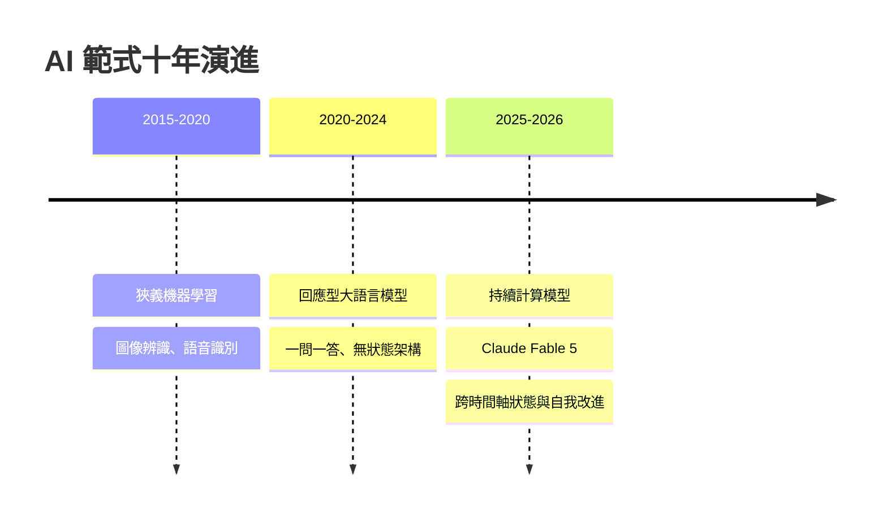
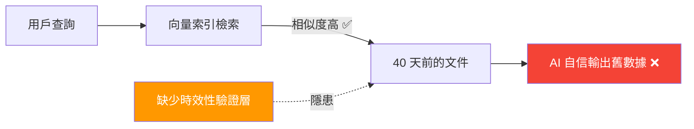

# AI Daily Digest — 2026-06-15

<!-- pipeline-generated:begin -->

## 🔥 今日 TOP 3
### 1. Claude Fable 5：AI 從回應型模型跨入持續計算新紀元
Anthropic 發佈 Claude Fable 5，這不只是一次版本更新，而是過去十年 AI 發展軌跡的根本轉折點。技術從早期狹義機器學習（影像辨識、語音識別）演進至大語言模型，再由「回應型架構」（response-based）正式邁向「持續計算」（persistent computation）新範式。

過去的 AI 模型每次對話都從零啟動，而持續計算架構使 AI 能跨對話維持狀態並持續自我改進，大幅提升長程任務與複雜工作流程的能力上限。這對現有系統設計的「無狀態假設」構成根本性挑戰，也意味著基礎設施的資源消耗模型需要重新評估。

企業應開始盤點現有 AI 架構是否支援持續計算所需的狀態管理；開發者可優先關注持續型 Agent 的記憶持久化方案，以及此架構在安全隔離與成本控制方面的新要求。

📖 [閱讀完整 insight](../10-insights/2026-06-14/inbox_807d7bf3.md) · 🔗 [原文連結](https://medium.com/@AkselAghajanyan/claude-fable-5-and-the-shift-from-response-based-models-toward-persistent-computational-bcafc2c0266e?source=rss------large_language_models-5)
### 2. Anthropic 秘密遞交 S-1：AI 安全公司首次叩關公開資本市場
Anthropic 於 2026 年 6 月 1 日向美國 SEC 秘密提交 S-1 表格，正式啟動 IPO 程序，成為首個進入公開資本市場的頂級 AI 安全公司。這是整個 AI 產業的重大里程碑，標誌著 frontier AI 公司從私人資本走向公開股票市場的關鍵轉折。

此舉的核心矛盾在於：Anthropic 以「以安全為優先的 AI 發展」著稱，而公開上市帶來的股東回報壓力、季度成長期待，可能與其長期安全研究使命產生根本性衝突。這也是整個 AI 產業的試金石——商業資本市場能否容納以 AI 安全為核心定位的公司，抑或 IPO 後的商業化壓力終將改變其研發優先序。

公開版 S-1 披露後，重點關注 R&D 佔比結構與「AI 安全」的商業論述框架；企業客戶應評估 IPO 後 Anthropic 的產品定價策略與 API 服務條款是否出現調整，並持續觀察其是否維持對高風險能力的自我限制立場。

📖 [閱讀完整 insight](../10-insights/2026-06-14/inbox_e93b53c9.md) · 🔗 [原文連結](https://medium.com/@andrianalazana/anthropics-ipo-and-the-problem-with-saving-the-world-on-wall-street-s-terms-df6bb2a7fbe8?source=rss------claude-5)
### 3. RAG 的隱形盲點：高準確率檢索也可能引用 40 天前的舊數據
一項對真實 RAG 系統的生產環境審計揭露了危險盲點：AI Agent 從向量索引完美檢索到高度相關文件，並自信引用其中的定價資訊——但該文件已是 40 天前的舊數據。傳統評估指標只衡量召回率與精確度，系統性忽略了「時效性」這個關鍵維度。

高準確率的檢索製造虛假信心，使用者與下游系統均難以察覺回答基於過時事實。在金融定價、庫存查詢、法規確認等時效敏感場景中，此問題可直接導致業務決策失誤，且錯誤難以溯源。

實務應對方案：在 retrieval pipeline 加入 `created_at` 或 `last_updated` 時間篩選條件，設定最大可接受文件年齡（如 7 天）；並在 AI 回答中明確標注數據來源時間戳記，讓使用者自行評估時效風險。

📖 [閱讀完整 insight](../10-insights/2026-06-14/inbox_e0e77ae7.md) · 🔗 [原文連結](https://medium.com/@spinov001/your-ai-agents-memory-has-no-expiry-date-i-scored-freshness-on-a-real-corpus-ecf3ff08a9bf?source=rss------large_language_models-5)

## 📈 本週 GitHub 飆升 Top 10

_GitHub 本週新增 star 最多的專案_

### 1. [mvanhorn/last30days-skill](https://github.com/mvanhorn/last30days-skill)
⭐ +12,602 this week · 🧬 Python

這是一個可插入 AI 代理人的研究技能（skill），能自動跨平台搜尋 Reddit、X、YouTube、Hacker News、Polymarket 及一般網頁，再將結果整合成有依據的摘要報告。看來正值 AI agent skill 生態系快速爆發的節點，可插拔式研究技能受到社群高度關注。適合研究員、分析師，或任何需要快速掌握某議題近期輿論動態的人。
### 2. [chopratejas/headroom](https://github.com/chopratejas/headroom)
⭐ +10,406 this week · 🧬 Python

這個工具會在資料送進 LLM 之前，先對工具輸出、日誌、文件及 RAG 片段進行壓縮，宣稱可減少 60–95% 的 token 用量，同時維持答案品質。在 LLM API 費用與 context window 長度仍是痛點的當下，這樣的壓縮層看來精準切中需求。可作為函式庫、反向代理或 MCP server 接入，適合任何需要控制 token 成本的 AI 應用開發者。
### 3. [addyosmani/agent-skills](https://github.com/addyosmani/agent-skills)
⭐ +9,348 this week · 🧬 Shell

這是一套以 Shell 腳本形式提供的生產等級 AI 編程代理人技能集，涵蓋工程最佳實踐，可直接插入 AI coding agent 的工作流程。作者 Addy Osmani 在前端工程社群具有高知名度，加上 AI coding agent 技能需求激增，看來帶動了本週的大量關注。適合想快速提升 AI 編程助理能力、讓代理人遵循工程規範的開發團隊。
### 4. [apple/container](https://github.com/apple/container)
⭐ +9,173 this week · 🧬 Swift

這是 Apple 官方推出的輕量化 Linux 容器工具，底層以輕量虛擬機器實現，完全以 Swift 撰寫並針對 Apple Silicon 優化。Apple 親自下場做容器化工具代表對開發者生態的正式表態，可能吸引了大量 Mac 開發者的目光。適合在 M 系列晶片 Mac 上跑 Linux 容器、又不想倚賴 Docker Desktop 的開發者。
### 5. [Leonxlnx/taste-skill](https://github.com/Leonxlnx/taste-skill)
⭐ +8,097 this week · 🧬 Shell

這個以 Shell 腳本形式封裝的 AI 技能，目標是讓 AI 代理人的產出不再千篇一律，避免生成乏味、套路化的「slop」內容。在大量 AI 生成內容品質參差不齊的當下，這個工具精準戳中了重視輸出質感的用戶痛點。適合任何對 AI 生成內容有品質要求、希望輸出更具個性與獨特風格的創作者或開發者。
### 6. [phuryn/pm-skills](https://github.com/phuryn/pm-skills)
⭐ +5,408 this week

這是一個專為 AI 代理人設計的產品經理技能市場，收錄超過 100 個涵蓋產品探索、策略規劃、執行、上線與成長等階段的 agentic 技能與指令插件。搭上 AI agent skill 爆紅的浪潮，PM 工具鏈的整合需求顯然受到廣泛關注。適合正在用 AI 代理人輔助日常工作的產品經理或 PMM，想快速擴充代理人能力庫。
### 7. [Panniantong/Agent-Reach](https://github.com/Panniantong/Agent-Reach)
⭐ +5,183 this week · 🧬 Python

這個工具讓 AI 代理人能「看見」整個網路，透過單一 CLI 介面讀取並搜尋 Twitter、Reddit、YouTube、GitHub、Bilibili、小紅書等平台，且不需要支付任何 API 費用。能繞過 API 費用限制、同時支援多個中文平台，這個組合看來是爆紅的主因。適合需要讓 AI 代理人即時擷取多平台資訊的開發者，尤其是有中文內容需求的場景。
### 8. [refactoringhq/tolaria](https://github.com/refactoringhq/tolaria)
⭐ +3,708 this week · 🧬 TypeScript

這是一款以 TypeScript 打造的桌面應用程式，專門用來管理以 Markdown 撰寫的知識庫，提供本地原生的整理體驗。在個人知識管理（PKM）工具競爭激烈的市場中，走輕量桌面路線的定位可能吸引了厭倦複雜雲端工具的用戶。適合喜歡用 Markdown 記錄知識、又希望有個乾淨桌面介面來整理筆記的工程師或知識工作者。
### 9. [NVIDIA/SkillSpector](https://github.com/NVIDIA/SkillSpector)
⭐ +2,799 this week · 🧬 Python

這是 NVIDIA 推出的 AI 代理人技能安全掃描器，用於靜態偵測技能程式碼中的漏洞、惡意模式與安全風險。隨著第三方 AI agent skill 生態快速膨脹，安全審查工具的缺口愈來愈明顯，來自 NVIDIA 的官方背書讓這個工具格外受到重視。適合企業安全團隊，或任何需要在正式環境部署第三方 AI 技能前進行把關的工程師。
### 10. [openai/plugins](https://github.com/openai/plugins)
⭐ +1,298 this week · 🧬 JavaScript

這是 OpenAI 官方的 Plugins 程式碼庫，以 JavaScript 實現，提供與 OpenAI 外掛系統整合的參考實作。本週可能因 AI agent 外掛生態話題的集體升溫，讓這個官方 repo 重新被社群翻出來關注。若你正在開發需要與 OpenAI 外掛或工具呼叫機制整合的應用，這是最直接的官方參考來源。

## 📖 好文章 / 影片精選

_過去 30 天經 traffic 沉澱的高品質內容，按興趣領域分類。每篇只在 column 出現一次。_
### 📚 AI 知識管理
- **medium-tag-llm** · **[Your AI Agent’s Memory Has No Expiry Date: I Scored Freshness on a Real Corpus](../10-insights/2026-06-14/inbox_e0e77ae7.md)**
  AI Agent 在使用檢索增強生成（RAG）系統時常面臨隱藏的問題：檢索結果的準確性與數據時效性是兩回事。作者在真實語料上審計發現，Agent 完美檢索到 40 天前的數據，並自信地引用過時的價格信息。檢索系統運作正常，但基礎事實已經過時，造成了 Agent 回答的錯誤。這個問題在生產環境特別危險，因為使用者難以區分完美檢索但陳舊的信息。該發現突出了 RA
- **medium-towards-data-science** · **[Beyond extract_text: The Two Layers of a PDF That Drive RAG Quality](../10-insights/2026-06-10/inbox_78291de8.md)**
  本系列文章（Enterprise Document Intelligence Vol.1 #5A）深入剖析 PDF 在 RAG 系統中的質量驅動因素。傳統做法聚焦文本提取，但作者指出 PDF 質量由兩個關鍵層級決定：(1) Document signals 層：元數據、原生目錄（TOC）、源軟體標識等文檔級信號；(2) Page-level content 
### 🏢 企業導入 AI / 團隊實踐
- **infoq-main** · **[Presentation: Platform Teams Enabling AI - MCP/Multi-Agentic Tools Across Linkedin](../10-insights/2026-06-05/inbox_e505e685.md)**
  LinkedIn 工程團隊在 InfoQ 分享大規模 AI 代理部署經驗，揭露透過 MCP（Model Context Protocol）實現多代理協調的平台架構。該團隊已在生產環境中部署編碼、系統觀測（observability）和 UI 測試代理，強調結構化上下文、安全工具和統一編排層的必要性，藉此超越零散的點狀實驗，達成企業級 AI 工具集成的可擴展性
- **medium-tag-claude** · **[The Technical Layer Most Paid Media Teams Skip — And Why It Breaks Everything](../10-insights/2026-06-04/inbox_7fd93c13.md)**
  付費媒體團隊三年來工作流未變：導出 CSV、貼入試算表、手動製報告、隔日交付，資料已過時。文章識別的關鍵缺陷是缺少 Model Context Protocol (MCP) 連接器作為中間層。Google 官方 MCP server（2025 年 10 月）用 OAuth 2.0 和開發者憑證連接；Meta 官方 server（2026 年 4 月測試版）提
### 🎓 AI 使用技巧 / 心法
- **reddit-localllama** · **[Benchmarking vLLM vs SGLang vs llama.cpp on a mixed Blackwell/Ada cluster](../10-insights/2026-05-17/inbox_34650013.md)**
  異質 GPU 叢集（Blackwell/Ada 混合）推理引擎對比：vLLM 管線並行性能遠優（4-6 倍），支援 FP4 跨代模擬與 VLLM_PP_LAYER_PARTITION 層分割；SGLang 純 Blackwell 表現好（14k t/s），Ada 卡無軟體後備即崩潰；llama.cpp 管線性能差（CPU 嵌入導致圖分割）。Qwen3.6-3
- **medium-tag-claude** · **[Claude Fable 5 vs Opus 4.8: I Repriced My 13 Automations](../10-insights/2026-06-10/inbox_31d224f3.md)**
  Anthropic新發布的旗艦模型Claude Fable 5定價為Opus 4.8的2倍（per token），但實務應用中未必划算。作者對13個自動化任務進行成本重估，發現只有3個任務的性能提升足以justify更高成本，其餘10個應繼續使用Opus 4.8。本分析強調選擇高成本模型時，需進行詳細的成本效益評估，而非盲目升級新版本。
- **reddit-localllama** · **[A First Comprehensive Study of TurboQuant: Accuracy and Performance](../10-insights/2026-05-14/inbox_025fcf80.md)**
  這份研究對 KV-cache 量化方案進行了全面系統的比較分析，包括 FP8、TurboQuant 的多個變體（k8v4、4bit-nc、k3v4-nc、3bit-nc）等。研究結論明確指出 FP8 是 KV-cache 量化的最優預設方案，能實現 2x 的容量增益、精度損失可忽略、性能與原始 BF16 相當，在記憶體受限的服務場景下甚至更優。TurboQu
- **medium-tag-llm** · **[Building a Smart Parallel Routing Agent That Answers Compound Questions All at Once](../10-insights/2026-06-07/inbox_aa10b9e1.md)**
  Medium 文章介紹了 Smart Parallel Routing Tool，一個用於處理複合型問題的代理工具。該工具的核心創新在於將單一的複雜問題分解為多個焦點明確的子問題，然後利用不同的工具並行處理。文章指出複雜問題往往需要多個工具而非單一工具來解決。Smart Parallel Routing Tool 代表了一種更聰慧的問題分解和路由策略，對於構
- **reddit-localllama** · **[MTP for Qwen3.6-35B-A3B on 6GB VRAM laptop: not worth it](../10-insights/2026-05-17/inbox_4ba35110.md)**
  開發者在 6GB VRAM 筆電（Asus ROG Zephyrus G14 2021、RTX 3060、Ryzen 7 5800HS）上實驗 llama.cpp 新合併的 MTP（Multi-Token Prediction）功能。結論：MTP 不划算──提示詞處理速度大幅下降，抵消了微小的文字生成速度提升。具體數據：無 MTP 基線達 23–26 tok
### 💳 支付 / Fintech
- **medium-tag-claude** · **[The Most Powerful AI Model Right Now Can’t Be Bought. You Have To Be Approved.](../10-insights/2026-06-14/inbox_461382a7.md)**
  評析目前最強大 AI 模型（指 Claude）的存取機制——採邀請制審核而非付費模式。指出業界最頂級能力的獲取需經批准流程，反映高端 AI 能力的稀缺性與合規管制需求，創造差異化市場定位。
### 🔐 AI 安全 / 濫用
- **infoq-main** · **[Article: Artificial Intelligence-Driven Phishing: How Phishing Technique Is Evolving and Implemented](../10-insights/2026-06-08/inbox_9c86c607.md)**
  文章分析 AI 如何根本改變釣魚攻擊的性質，從手動、針對性的活動轉變為自動化、規模化的威脅。內容涵蓋釣魚生命週期的各階段——偵察、目標文件、內容生成、傳遞與互動——展示 AI 在每個環節的應用。同時列舉多層防禦策略，結合技術控制、流程改進與用戶意識培訓，提供防禦者的實務指南。
### 🛤️ AI Flow 導入心得 / 技術分享
- **medium-tag-claude** · **[I Run a One-Person Newsroom That Ships 4 Pieces a Week. Here&#39;s the 5-Agent Claude Setup.](../10-insights/2026-06-05/inbox_ecb1a633.md)**
  一位編輯用 5 個 Claude agents 組成 editorial pipeline，每週獨立發佈 4 篇內容，涵蓋 Medium 文章、LinkedIn posts、YouTube 腳本和 Twitter threads。透過 multi-agent 協作自動化編輯工作流，提示如何用 Claude 實現內容生產線的自動化。

## 💡 今日 Takeaway

_讀完今日所有內容後，可帶走的知識點_
### 1. RAG 檢索準確不等於資料時效，生產系統需獨立的新鮮度驗證層
向量相似度高的檢索結果可能來自數週甚至數月前的舊文件，模型無法自動識別數據是否過期，只會以同樣的信心水準輸出結論。對時效性敏感的應用（定價、庫存、法規查詢）而言，這是高風險的系統性盲點，且從回答本身難以察覺。實作上應在 retrieval pipeline 加入時間窗口篩選條件，同時在回應介面顯示數據來源時間戳記，以提示用戶自行判斷時效風險。

_類型：pattern_

**參考來源**：
- [Your AI Agent’s Memory Has No Expiry Date: I Scored Freshness on a Real Corpus](../10-insights/2026-06-14/inbox_e0e77ae7.md) · [原文](https://medium.com/@spinov001/your-ai-agents-memory-has-no-expiry-date-i-scored-freshness-on-a-real-corpus-ecf3ff08a9bf?source=rss------large_language_models-5)
### 2. AI 生成代碼的痕跡藏在 commit graph 與 diff 模式中，無需水印即可後驗偵測
傳統假設認為偵測 AI 生成代碼需要水印或簽名機制，但真實的提交行為本身就包含特徵信號——單次提交大量文件、diff 結構高度均勻、缺乏歷史上下文的漸進式修改。基於 500 筆真實提交的審計驗證，差異解析器加上提交圖譜分析已能可靠識別 AI 批次提交模式。企業可用現有 git 歷史執行代碼來源審計，無需引入額外基礎設施或要求開發者事先標記，大幅降低部署成本。

_類型：technique_

**參考來源**：
- [I Audited 500 Commits. The AI Signal Was Hiding in the Diff](../10-insights/2026-06-14/inbox_0784e893.md) · [原文](https://medium.com/@sebuzdugan/i-audited-500-commits-the-ai-signal-was-hiding-in-the-diff-c5a208e9a09b?source=rss------large_language_models-5)
### 3. 78% 企業跑過 AI 試點但 82% 從未上線，PoC 通過率是錯誤的成功指標
PoC 環境排除了數據管線整合、組織變更、延遲與成本控制等真實障礙，使試點成功成為系統性假陽性。以「試點完成率」衡量 AI 投資回報，會讓組織在 demo 階段打轉，誤以為已在「使用 AI」。企業真正的成功指標應是生產環境下可量化的業務結果（成本節省幅度、處理速度提升、錯誤率降低），而非模型準確度或 demo 完成度。

_類型：data-point_

**參考來源**：
- [Why 82 Percent of Enterprise AI Projects Never Ship](../10-insights/2026-06-14/inbox_0ef9a0f9.md) · [原文](https://medium.com/codex/why-82-percent-of-enterprise-ai-projects-never-ship-b8fe80935b2d?source=rss------claude-5)
### 4. 廠商官方基準傾向選擇過時對手作基線，可靠模型評估只能來自獨立第三方
廠商在設計基準測試時有強烈動機選用對自己最有利的過時比較對象，MiniMax M3 以已淘汰的舊版 Claude 作為基線是典型案例，但此現象在業界普遍存在。官方基準幾乎無法反映真實市場地位，直接採信廠商數據會導致採購或遷移決策失準。可靠做法是以 LMSYS Chatbot Arena、MMLU-Pro 等獨立榜單為主要參考，或針對自身使用場景設計內部評測，並明確記錄基線版本與測試日期。

_類型：pattern_

**參考來源**：
- [MiniMax M3: What Actually Changed (And Why the Headline Benchmark Is Already Out of Date)](../10-insights/2026-06-14/inbox_0ceb8e5a.md) · [原文](https://medium.com/@candemir13/minimax-m3-what-actually-changed-and-why-the-headline-benchmark-is-already-out-of-date-b5151c34c388?source=rss------large_language_models-5)

<!-- pipeline-generated:end -->

<!-- user-notes -->
<!-- Write your own notes below; pipeline never touches this section. -->