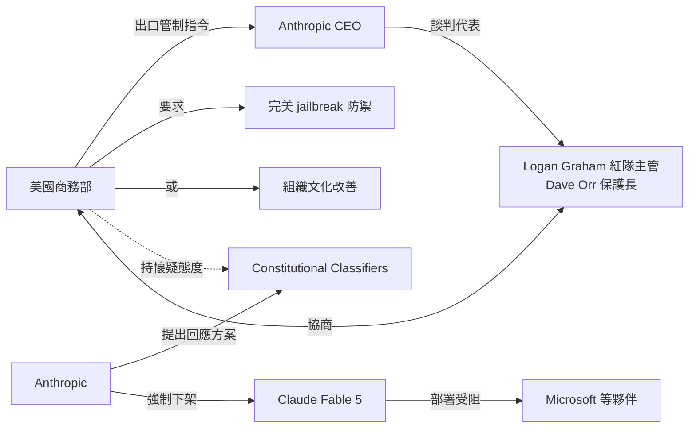
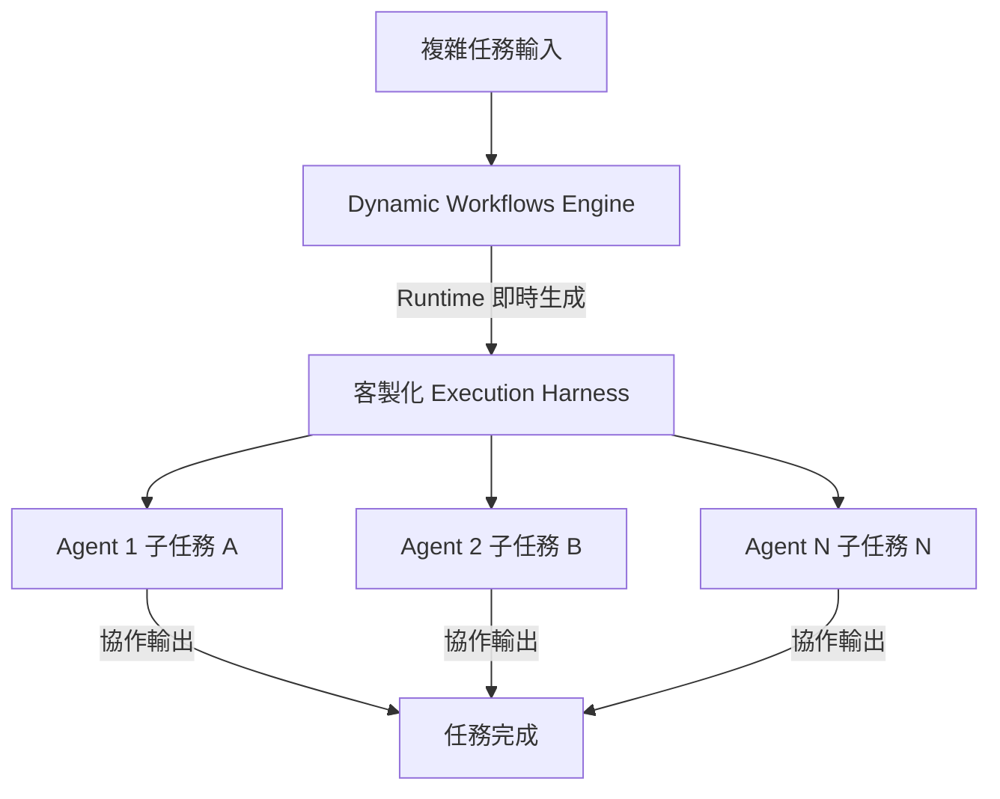

# AI Daily Digest — 2026-06-16

<!-- pipeline-generated:begin -->

## 🔥 今日 TOP 3
### 1. Fable 5 下架：政府要求完美防禦的監管實錄
Axios 深度報導揭示 Claude Fable 5 被迫下架的幕後細節：美國商務部向 Anthropic 發出出口管制指令，Anthropic 紅隊主管 Logan Graham 與保護長 Dave Orr 代表公司談判，政府提出「實現完美 jailbreak 防禦」或「改善組織文化」兩項要求。Anthropic 以 2026 年 1 月推出的 Constitutional Classifiers 回應，但政府對通用防禦的可行性仍持悲觀立場。

這是首次有據可查的「AI 安全防禦能力不足→政府強制模型下架」案例，標誌著美國出口管制已具備在數日內直接叫停前沿商業模型的行政力量。政府與 Anthropic 在「通用 jailbreak 防禦是否可行」上的根本分歧，揭示出監管期望與工程現實之間存在結構性落差；Microsoft 等合作夥伴的部署計畫也因強制資料保留要求受到直接衝擊，影響範圍遠超 Anthropic 本身。

企業應立即將「出口管制合規」列為 AI 供應商評估的前置條件，並在合約中加入服務中斷補救條款。Constitutional Classifiers 能否通過政府審查、其他前沿 AI 廠商（Google DeepMind、OpenAI）是否面臨類似壓力，將決定後續監管走向，值得密切追蹤。

📖 [閱讀完整 insight](../10-insights/2026-06-15/inbox_d41a2979.md) · 🔗 [原文連結](https://simonwillison.net/2026/Jun/15/axios-clashes-anthropics/#atom-everything)
### 2. Claude Code 動態工作流即時生成代理協調層
Anthropic 公開 Claude Code「動態工作流程」（Dynamic Workflows）的運作機制：系統在執行時（runtime）動態生成客製化「執行 harness」，專門協調多個 AI 代理團隊完成複雜任務，而非依賴預先撰寫的靜態編排腳本。代理的分工、溝通模式與工作流程都在運行時根據任務需求自動決定。

這代表多代理系統設計的關鍵範式轉移：從「靜態工作流定義」走向「runtime 動態生成協調層」。相比 LangGraph 等需要預先定義節點與邊的框架，動態 harness 方法讓代理分工能依任務特性自適應調整，大幅降低開發者維護複雜編排邏輯的負擔，尤其適合任務類型多元、事先難以窮舉的場景。

開發者可參考此模式設計自己的協調系統，核心思路是「執行前生成協調邏輯」而非「硬編碼代理角色」。應持續關注 Anthropic 是否進一步開放此機制的 API 或 SDK，以及社群如何在 Claude Code 生態外複製此動態 harness 設計模式。

📖 [閱讀完整 insight](../10-insights/2026-06-15/inbox_4efabea0.md) · 🔗 [原文連結](https://www.infoq.com/news/2026/06/claude-code-harnesses/?utm_campaign=infoq_content&utm_source=infoq&utm_medium=feed&utm_term=AI%2C+ML+%26+Data+Engineering)
### 3. AI 無法取代軟體工程師的三大真正瓶頸
Arvind Narayanan 與 Sayash Kappor 的論文以紐約州 WARN Act 數據直接反駁 AI 大規模裁員論：2025 年 3 月起增設 AI 披露欄後，160+ 家公司申報裁員，無一勾選 AI 為原因。論文同時提出軟體工程真正瓶頸的三層結構：決定與規格化「要建什麼」、驗證並承擔決策責任、對代碼庫與業務邏輯的深層人類情境理解。

AI 雖已能加速「寫碼」，但寫碼早已不是瓶頸；上述三個高層環節至今高度依賴人類判斷與情境理解能力。這意謂工程師的市場價值將越來越集中在需求釐清、技術決策與業務情境，而非程式碼產出速度；對工具採購方的啟示是，應評估 AI 工具是否真正提升了三個瓶頸層，而非只加速非瓶頸的寫碼環節。

工程主管可用此「三瓶頸框架」重新定義技術職涯投資方向，鼓勵工程師強化 AI 難替代的高層決策能力。企業在採購 AI Coding 工具時也應以「是否觸及決策、驗證或業務理解瓶頸」作為投資回報的核心評估標準。

📖 [閱讀完整 insight](../10-insights/2026-06-14/inbox_6d6f7601.md) · 🔗 [原文連結](https://simonwillison.net/2026/Jun/14/why-ai-hasnt-replaced-software-engineers/#atom-everything)

## 📖 好文章 / 影片精選

_過去 30 天經 traffic 沉澱的高品質內容，按興趣領域分類。每篇只在 column 出現一次。_
### 🛠 工具版本追蹤 / Release
- **claude-code** · **[v2.1.178](../10-insights/2026-06-15/inbox_b43c7d1c.md)**
  Claude Code v2.1.178 發布，引入細粒度權限規則、巢狀設定目錄優先解析、改進 subagent 啟動器安全檢查，以及大量 bug 修復。新增 Tool(param:value) 語法支援權限規則中的參數匹配（如 Agent(model:opus) 可阻擋 Opus subagent）。.claude/ 巢狀目錄內的 agent/workfl
- **claude-mem** · **[v13.6.1](../10-insights/2026-06-15/inbox_03047b65.md)**
  claude-mem v13.6.1 補丁版本發布，主要新增功能為回填歷史 token 節省經濟性到匿名日報遠測統計（#2934），將推斷的生成成本數據回溯注入並含括完整的數據清理覆蓋與測試。此版本改進了成本追蹤的完整性，幫助使用者更精確地分析 token 使用的經濟影響。
### 📚 AI 知識管理
- **infoq-architecture** · **[Microsoft Launches Logic Apps Automation at Build 2026](../10-insights/2026-06-08/inbox_8af3b9a6.md)**
  Microsoft 在 Build 2026 發布 Logic Apps Automation，推出新的 SKU 在 auto.azure.com，將工作流、AI agents、知識服務和模型存取整合為托管 SaaS 體驗。Agents 整合透過 agent-loop orchestration、Foundry agents 和託管沙箱；Knowledge 
- **medium-towards-data-science** · **[10 Common RAG Mistakes We Keep Seeing in Production](../10-insights/2026-06-09/inbox_1a275338.md)**
  本文是 Towards Data Science 的 Enterprise Document Intelligence 系列（Vol.1 #4bis）文章，系统梳理了 RAG（检索增强生成）在生产环境中的 10 项常见错误。文章采用「四砖」(four-brick split) 架构来分类这些陷阱，首先详细呈现 brick-by-brick 的问题分析，随后在
- **medium-tag-llm** · **[How Embeddings Power Retrieval-Augmented Generation (RAG) Systems](../10-insights/2026-06-10/inbox_4b990dc2.md)**
  本文為入門指南，介紹 embeddings 在檢索增強生成（RAG）系統中的核心作用。通過 embeddings 和向量數據庫，AI 應用能夠在私人公司數據中進行高效搜索，使大語言模型能夠訪問組織特定知識。RAG 架構將向量化技術與 LLM 結合，實現私密數據的智能檢索與生成，為企業應用提供知識擴展機制。
- **medium-tag-llm** · **[The Library Behind the Answer: How RAG Gives an LLM Knowledge It Was Never Trained On](../10-insights/2026-06-10/inbox_71f8b9f1.md)**
  本文闡述 RAG（檢索增強生成）如何克服大語言模型知識截斷問題。LLM 的知識在訓練結束時被固定，無法自動獲取新信息。RAG 通過檢索機制讓 LLM 訪問私人文檔、實時信息等訓練數據之外的知識，實現模型知識的動態擴展。此方法使 LLM 能夠處理組織特定信息和最新數據，大幅提升其在實務場景中的適用性和準確性。
- **medium-towards-data-science** · **[Stop Returning Flat Text from a PDF: The Relational Shape RAG Needs](../10-insights/2026-06-11/inbox_8813e0a1.md)**
  企業文檔處理的新方向是將 PDF 輸入轉換為結構化的關聯式 DataFrame 輸出，而不是傳統的扁平文本提取。此方法將 PDF 的複雜結構分解為多個維度：包括行級粒度、頁面級組織、目錄結構、嵌入圖像、交叉引用、圖表標題和文本跨度等。這種結構化輸出特別適合 RAG（檢索增強生成）系統，能更有效地支援下游 AI 模型的語義理解和推理。該方法解決的核心問題是傳統
### 🏢 企業導入 AI / 團隊實踐
- **infoq-architecture** · **[Article: Governing AI in the Cloud: A Practical Guide for Architects](../10-insights/2026-06-15/inbox_4f6e274c.md)**
  文章提出了雲端環境中 AI 治理的實踐指南，強調透過嵌入式自動化流程來平衡安全、合規與開發生產力。核心策略包括 Shadow AI 發現與分類、數據創建時期的數據分類、基於 IAM 的強制執行、Policy-as-Code 框架和運營控制。該方法避免依賴手動流程，使治理成為交付流程的一部分，幫助組織實現 AI 安全與合規目標而不犧牲開發效率。
### 🎓 AI 使用技巧 / 心法
- **simon-willison** · **[Initial impressions of Claude Fable 5](../10-insights/2026-06-09/inbox_7355e7d6.md)**
  Simon Willison 在 Fable 5 發布後進行了 5.5 小時深度評測。該文評測了 Fable 5 和同時發布的 Mythos 5 的核心指標：1M token context、128k max output tokens、2026 年 1 月知識截止、$10/M input + $50/M output 定價（Opus 的 2 倍）。在知識深
- **substack-pragmatic-engineer** · **[The Pulse: Did Anthropic’s new model just boost rival Codex’s market share?](../10-insights/2026-06-11/inbox_6f5ae44e.md)**
  Anthropic 推出的 Fable 模型因過度限制的策略引發爭議。該模型對 30 天數據保留、性能限制（當 Anthropic 認為用途可能構成商業威脅時效能下降）等做法遭到批評，導致使用者轉向競爭對手如 Codex 等更寬鬆的替代方案。同時業界出現智能模型路由（smart model routing）的新趨勢，自動為特定任務選擇合適的模型。該文章強調 
- **infoq-ai-ml** · **[Anthropic Explains How Claude Builds Its Own Execution Harnesses](../10-insights/2026-06-15/inbox_4efabea0.md)**
  Anthropic 公開揭露 Claude Code 最近推出的「動態工作流」（Dynamic Workflows）特性背後的協調系統運作原理。該系統的核心機制是在執行時動態生成自訂的「執行 harness」（execution harness），專門用於協調多個 AI 代理團隊執行複雜任務。Anthropic 詳述了系統如何運行時決定代理分工、溝通模式與工
- **infoq-ai-ml** · **[WebMCP Standard Proposal for Agentic Web Actuation Now Available in Chrome (Origin Trials)](../10-insights/2026-06-13/inbox_9175dba5.md)**
  Google 宣佈 WebMCP（Web Model Context Protocol）標準提案進入 Chrome 149 Origin Trials 階段。WebMCP 讓網站向瀏覽器內的 AI agent 暴露工具接口（JavaScript 函數、HTML 表單等），使 agent 可以直接呼叫這些函數而非透過 DOM 解析或螢幕讀取，大幅提升可靠性與效
### 💳 支付 / Fintech
- **infoq-main** · **[Article: Governing AI in the Cloud: A Practical Guide for Architects](../10-insights/2026-06-15/inbox_6ea4e7ca.md)**
  Dave Ward 著文介紹企業級 AI 治理框架，涵蓋影子 AI 發現、資料分類、IAM 強制執行、Policy-as-Code 與運營監控。該方法強調將治理嵌入交付管線而非依賴手工流程，在安全、合規與開發生產力間尋求均衡。框架為組織提供成本與風險可控的 AI 採納路徑。
### ⛓️ 區塊鏈 / Web3
- **infoq-main** · **[Podcast: Increasing Users&#39; Data Agency: From BlueSky&#39;s AT Protocol to the Local-First Software Movement](../10-insights/2026-06-15/inbox_3901b3c4.md)**
  Martin Kleppmann（《Designing Data-Intensive Applications》作者兼劍橋副教授）在播客中討論資料系統十年演變，強調從單體資料庫向模組化構建塊轉變。核心論點是需要從雲端集中式儲存轉向去中心化架構，以 Bluesky 的 AT Protocol 為典範。此轉變涉及重新思考使用者對個人資料的主權與控制權。Klepp
### 🔐 AI 安全 / 濫用
- **simon-willison** · **[\&#34;They screwed us\&#34;: Personality clashes sent Anthropic&#39;s models offline](../10-insights/2026-06-15/inbox_d41a2979.md)**
  Axios 深入報導 Anthropic Claude Fable/Mythos 模型因美國政府出口管制而下線的幕後故事，揭示人事衝突與立場不合是觸發點。Anthropic 首席紅隊領導 Logan Graham、保護長 Dave Orr（前 DeepMind 工程總監）及研究員 Nicholas Carlini 與商務部進行協商。政府態度要求實現完美 ja
- **infoq-ai-ml** · **[Article: Artificial Intelligence-Driven Phishing: How Phishing Technique Is Evolving and Implemented](../10-insights/2026-06-08/inbox_b21a7fa7.md)**
  本文檢視 AI 如何將釣魚攻擊從手工、目標明確的活動演變為自動化與可擴展的威脅模型。作者分解釣魚生命週期各階段，詳細說明 AI 在偵察、目標分析、內容生成、投遞與互動階段的角色與增強能力。文中同時提出多層防禦策略，結合技術控制、流程管理與使用者認知提升，以對抗不斷演進的 AI 驅動攻擊。
### 🛤️ AI Flow 導入心得 / 技術分享
- **simon-willison** · **[datasette-agent-edit 0.1a0](../10-insights/2026-06-07/inbox_47ccd51e.md)**
  Simon Willison 發佈 datasette-agent-edit 0.1a0 版本，這是一個為 Datasette 平台設計的插件框架。該框架專為需要進行文本編輯的 agentic 應用而建，支持協作 Markdown 編輯、大型 SQL 查詢更新和 SVG 文件編輯等場景。核心設計實現了三個工具：view 用於檢視指定範圍的文本（帶行號），st
- **substack-lennys-newsletter** · **[The AI paradox: More automation, more humans, more work | Dan Shipper](../10-insights/2026-05-24/inbox_6e5744bc.md)**
  Dan Shipper 提出 AI 工作新悖論：自動化程度提高反而增加人類工作量。他認為未來大多數工作將在 Codex 或 Claude Code 內進行，CLI 時代已經結束，每個 AI agent 都需要人類監督。這反映出 AI 助手從純工具演進為工作流中心，但決策與質控仍需人類參與。他對 PM 和設計師的未來角色持高度樂觀態度，認為他們能在 AI 時代

## 💡 今日 Takeaway

_讀完今日所有內容後，可帶走的知識點_
### 1. 軟體工程瓶頸在決策與驗證，AI 加速的只是非瓶頸
軟體工程的三大真正瓶頸是：決定與規格化要建什麼、驗證並承擔責任、對代碼庫與業務邏輯的深層情境理解——AI 目前能大幅加速的「寫碼」環節並不在瓶頸上。因此評估 AI Coding 工具的投資效益，應以「是否改善了這三個瓶頸」為標準，而非只看程式碼生成速度提升多少。工程師職涯投資也應優先強化需求釐清、技術決策與業務情境理解，這三個層次正是人類工程師的不可替代性所在。

_類型：framework_

**參考來源**：
- [Why AI hasn’t replaced software engineers, and won’t](../10-insights/2026-06-14/inbox_6d6f7601.md) · [原文](https://simonwillison.net/2026/Jun/14/why-ai-hasnt-replaced-software-engineers/#atom-everything)
### 2. Evals 取代 PRD：用可執行測試定義產品品質標準
傳統 PRD 以文字描述功能規格，難以客觀驗證「品質感」；eval 框架將主觀品質標準轉化為可執行的自動化測試套件，結合 CI 管線讓每次部署都能自動驗收是否達到預期行為。這將品質標準從文件層提升至代碼層，消除主觀評審瓶頸並讓驗收標準可規模化。實際套用：在 AI 功能開發時先撰寫 eval 測試案例定義「合格行為」，以此驅動開發（eval-driven development），而非先寫規格再事後驗收。

_類型：framework_

**參考來源**：
- [How Braintrust uses AI agents, evals, and CI to ship better software | Ankur Goyal](../10-insights/2026-06-15/inbox_6a59c487.md) · [原文](https://www.lennysnewsletter.com/p/how-braintrust-uses-ai-agents-evals)
### 3. 長對話 Compaction 可大幅壓縮 API 推理成本
當 Claude 對話累積超過 180,000 tokens 時，每次 API 推理須在超長歷史上計算，費用呈指數上升；Anthropic Compaction 特性透過壓縮冗長歷史文本，減少每次推理實際計算的有效 token 數，在不損失語義連續性的前提下顯著降低成本。適用場景包括：多輪客服對話、長程代理任務、RAG 增強問答等長上下文應用。實務建議：監控對話 token 使用曲線，超過 100k 時主動啟用 Compaction，並以「token 是否呈指數成長」作為觸發壓縮的信號。

_類型：technique_

**參考來源**：
- [How to Reduce Claude API Costs Using Anthropic’s Compaction Feature](../10-insights/2026-06-15/inbox_18d25ac7.md) · [原文](https://medium.com/ai-tools-digest/how-to-reduce-claude-api-costs-using-anthropics-compaction-feature-d9e813b1d24e?source=rss------claude-5)
### 4. AI 治理嵌入 CI/CD 才能兼顧安全合規與開發效率
依賴手工審查的 AI 治理在快速部署環境中必然成為瓶頸；Policy-as-Code 將 Shadow AI 發現、資料分類、IAM 強制執行等規則直接編碼進 CI/CD 管線，使每次部署自動執行合規檢查，將治理從「阻礙流程」轉化為「自動化品質閘道」。建議實施路徑：先盤點組織內未授權 AI 部署（Shadow AI），再以 OPA/Rego 等工具實現政策自動化，最後整合至現有 CI/CD 流程而非另建手工審批管道。此模式讓安全合規與開發效率不再互斥。

_類型：framework_

**參考來源**：
- [Article: Governing AI in the Cloud: A Practical Guide for Architects](../10-insights/2026-06-15/inbox_4f6e274c.md) · [原文](https://www.infoq.com/articles/governing-ai-cloud-guide/?utm_campaign=infoq_content&utm_source=infoq&utm_medium=feed&utm_term=Architecture+%26+Design)

<!-- pipeline-generated:end -->

<!-- user-notes -->
<!-- Write your own notes below; pipeline never touches this section. -->