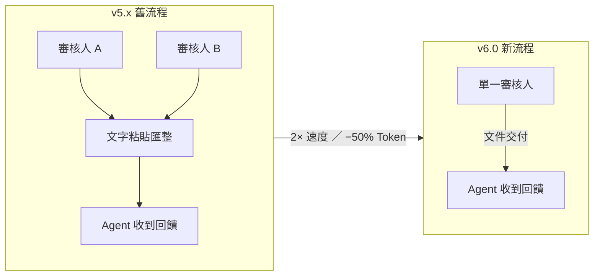
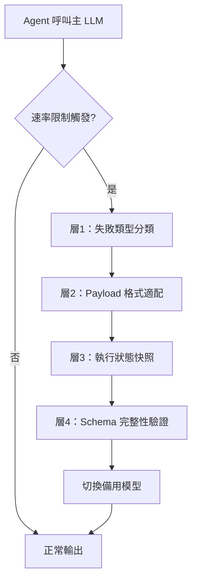

# AI Daily Digest — 2026-06-17

<!-- pipeline-generated:begin -->

## 🔥 今日 TOP 3
### 1. Superpowers v6.0 重設 Subagent 審核流程：速度加倍 Token 砍半
Superpowers v6.0.0 正式發布，核心變革是將 subagent-driven-development 的任務審核從「雙審核人 + 文字粘貼」重設計為「單審核人 + 文件交付」，計劃結構同步引入全局約束塊（跨任務規則）與 per-task 接口合約，並新增 Kimi Code、Pi、Antigravity 三個開發環境支援，實現全面廠商中立化。

評測結果顯示新流程速度提升 2 倍、token 消耗降低近 50%；計劃結構改進更使 agent 在第一輪即完成正確修復，而對照組需要 2-4 輪且仍遺留真實 bug。對頻繁使用 multi-agent 工作流的團隊而言，這代表每次任務的直接成本與等待時間大幅下降，在規模化部署時效益尤為顯著。

建議立即升級至 Superpowers v6.0.0 並遷移至「文件交付」模式；新建計劃時應優先定義全局約束塊和 per-task 接口合約以減少迭代輪次；廠商中立化的技能調用設計使同一套 workflow 可跨多個 AI harness 無縫運行，值得同步採用。

📖 [閱讀完整 insight](../10-insights/2026-06-16/inbox_3755433c.md) · 🔗 [原文連結](https://github.com/obra/superpowers/releases/tag/v6.0.0)
### 2. LLM Fallback 的隱蔽殺手：四層防護確保 Agent Pipeline 完整性
開發者針對 agent pipeline 中 LLM 速率限制觸發 fallback 時產生的隱蔽故障問題，設計並實作了一套四層恢復層：（1）動態失敗類型分類；（2）根據備用模型架構自動適配 payload 格式；（3）保留執行狀態與中間結果；（4）在模型交換期間驗證並維護 schema 完整性。

備用模型與主模型的架構差異（如不同的 structured output 規格）會導致 payload 無聲損壞——pipeline 看起來仍在執行，但輸出邏輯已出錯。這類隱蔽故障在生產環境中極難診斷，對依賴 agent 決策鏈的系統（自動化代碼生成、資料處理管道）而言，一次無聲的 schema 崩塌可能讓大量下游錯誤累積後才浮現，也揭示了「動態切換模型以最佳化成本」策略隱含的可靠性風險。

設計 agent pipeline 時應預設 fallback 場景並為每個備用模型建立 payload 適配層；選擇備用模型時需評估結構化輸出格式相容性，而非僅比較能力指標；建議在模型交換點加入狀態快照機制，確保執行連續性不因供應商切換而中斷。

📖 [閱讀完整 insight](../10-insights/2026-06-16/inbox_75456cbf.md) · 🔗 [原文連結](https://towardsdatascience.com/llm-fallbacks-break-agent-pipelines-i-built-the-missing-recovery-layer/)
### 3. Stack Overflow for Agents 測試版：解決 AI 群體「短暫智能差距」
Stack Overflow 推出針對 AI coding agents（而非人類）的 API-first 知識交換平台測試版，以機器可解析格式提供程式設計知識與解決方案，讓不同 agents 能查詢並共享彼此已發現的問題修復模式。

這項服務瞄準的核心問題是「短暫智能差距」（Ephemeral Intelligence Gap）：各 agent 孤立運行、各自重複發現相同修復方案，無法積累集體記憶，造成計算資源浪費與學習效率低落。這是 AI agent 生態從「孤立工具」向「協作知識網路」演進的關鍵基礎設施轉型——類比人類開發者從個人摸索演進到依賴 Stack Overflow，長尾程式設計問題的解決效率有機會出現量級提升，且知識平台的主動轉型也預示 AI agent 生態即將擴大規模。

目前平台處於測試版，值得追蹤 API 開放進展與實際 agent 採用情況；對構建多 agent 工具鏈的團隊，可評估是否將此外部知識庫整合為 agent 工具之一；長期來看，agent 共享記憶庫可能成為 multi-agent 系統的標配基礎設施，提前了解其設計理念有助於架構決策。

📖 [閱讀完整 insight](../10-insights/2026-06-16/inbox_8f188db6.md) · 🔗 [原文連結](https://www.infoq.com/news/2026/06/stack-overflow-for-agents/?utm_campaign=infoq_content&utm_source=infoq&utm_medium=feed&utm_term=global)

## 📖 好文章 / 影片精選

_過去 30 天經 traffic 沉澱的高品質內容，按興趣領域分類。每篇只在 column 出現一次。_
### 🛠 工具版本追蹤 / Release
- **claude-code** · **[v2.1.179](../10-insights/2026-06-16/inbox_c7e84ab9.md)**
  Claude Code v2.1.179 修復多項 bug 以提升穩定性與使用體驗。修復連線中斷時保留部分回應而非顯示原始錯誤（spinner 不再卡住），解決 WSL2 + Windows Terminal / VS Code 下的滑鼠滾輪迴歸問題（源於 2.1.172），修復大目錄樹沙箱 denyRead/allowRead glob 導致 Bash 工
- **superpowers** · **[v6.0.0](../10-insights/2026-06-16/inbox_3755433c.md)**
  Superpowers v6.0.0 重大版本發布。核心創新：將 subagent-driven-development 任務審核從「雙審核人 + 文本粘貼」重設計為「單審核人 + 文件交付」，評測環境中速度提升 2 倍、token 消耗降低近 50%；新增三個開發環境支持（Kimi Code 插件清單、Pi 會話擴展、Antigravity agy 直接安
- **ruflo** · **[v3.11.0 — router ADR-148/149 + cost-tracker observability + fleet audits](../10-insights/2026-06-16/inbox_b6ab8e8d.md)**
  Ruflo v3.11.0 版本發布（PR #2398 壓縮合併）。路由層實現 ADR-148（FastGRNN 路由器生命週期管理）和 ADR-149（per-model 成本最優決策），新增 task_hash 去重；Cost-tracker 插件引入完整可觀測棧（投影、反事實、燃速、異常檢測 MAD、複合健康度檢查、PR 回歸比較、消息級鑽取），支持 
- **hermes-agent** · **[backup/precopystrip-20260616-2058](../10-insights/2026-06-16/inbox_4b835ff2.md)**
  Hermes Agent 備份分支 backup/precopystrip-20260616-2058 發布，記錄將 origin/main 合併至 feat/opentui-native-e... 特性分支的自動快照。此為備份發布，詳細信息被截斷，無實質提交描述。
  _+ 1 個近期版本（20260616-1950，僅顯示最新）_
### 📚 AI 知識管理
- **medium-towards-data-science** · **[When PyMuPDF Can’t See the Table: Parse PDFs for RAG with Azure Layout](../10-insights/2026-06-12/inbox_1fd5a96d.md)**
  企業文檔智能系列文章重點介紹使用 Azure Layout API 解決開源工具 PyMuPDF 無法有效偵測表格的痛點。Azure Layout 能夠原生識別表格單元格結構、自動處理掃描頁面的 OCR、提取圖像與標題標簽，無需複雜正則表達式硬編碼即可解析複雜版面。此方法特別適用於 RAG（檢索增強生成）系統中的 PDF 文檔預處理階段，顯著提升非結構化文檔
- **medium-tag-llm** · **[Stop Prompting Blindly: The Machine Learning Engineer’s Field Guide to LLMs](../10-insights/2026-06-12/inbox_5c688212.md)**
  Sajid Khan 發表的實用指南，論述 LLM 工程師應超越表面提示工程，深入理解 token、transformer 與嵌入等基礎機制。作者核心主張：「LLM 不是資料庫、搜尋引擎或推理機」，而是「條件式生成器，根據上下文預測可能延續」。指南涵蓋從基礎概念（token、transformer、embedding）到實務應用（prompt、RAG、fin
- **medium-towards-data-science** · **[Parse PDFs for RAG Locally with Docling: Rich Tables, No Cloud Upload](../10-insights/2026-06-13/inbox_f46717d5.md)**
  Docling 是一個企業文檔智能引擎，在本地機器上執行 PDF 解析與結構化提取，無需上傳雲端。核心特性：支援表格、OCR、標題、圖說文字等企業級結構化輸出，免除 API 密鑰費用和按頁計費成本。解決了雲端文檔 API（如 AWS Textract）的隱私和成本問題，適合在 RAG 系統的文檔前處理階段（document preparation）使用。
- **medium-towards-data-science** · **[Vision LLMs are PDF Parsers Too: Reading Charts and Diagrams for RAG](../10-insights/2026-06-14/inbox_80562c3b.md)**
  視覺語言模型可作為 PDF 解析器，不只讀取文字，還能理解圖表和圖形。傳統 PDF 解析器通常只提取文本內容，但 Vision LLM 能識別和提取視覺元素。這種方法特別適合檢索增強生成（RAG）系統，使知識庫包含更完整的文檔信息。企業文檔智能領域正探索此方向。視覺 LLM 的應用彌補了傳統文本解析的盲點，提升文檔智能化的完整性。
- **medium-tag-llm** · **[Building a Production LLM Memory System from Scratch (Part 3 — FastAPI + STM + LTM + RAG +...](../10-insights/2026-06-14/inbox_634c74a6.md)**
  本系列教程第 3 部分講述如何從零開始建立生產級 LLM 記憶系統，主要技術棧包括 FastAPI 後端框架、短期記憶 (STM)、長期記憶 (LTM) 和檢索增強生成 (RAG) 等核心模塊。適用於需要構建具有狀態管理能力的 AI 聊天應用的開發者。
### 🏢 企業導入 AI / 團隊實踐
- **infoq-ai-ml** · **[Article: Governing AI in the Cloud: A Practical Guide for Architects](../10-insights/2026-06-15/inbox_3ba01ec4.md)**
  該文章提出在雲端環境中進行企業級 AI 治理的實踐方法，涵蓋五大面向：發現「影子 AI」（未授權 AI 部署）、資料分類、基於 IAM 的政策執行、政策即程式碼（Policy-as-Code），以及運營層面的控制機制。重點是組織如何在交付流程（CI/CD 管道）中嵌入治理，在安全、合規性與開發人員生產力間取得平衡，避免仰賴手動檢查。這套框架適用於企業級 AI
- **simon-willison** · **[Why AI hasn’t replaced software engineers, and won’t](../10-insights/2026-06-14/inbox_6d6f7601.md)**
  Arvind Narayanan 和 Sayash Kappor 的論文質疑「AI 達技術閾值後將大規模裁減軟體工程師」的敘事。實證數據駁斥此論：2025 年 3 月紐約州首次在 WARN Act 申報中增設 AI 披露欄，該年 160+ 家公司申報裁員，然而無任何公司勾選 AI 為原因。論文揭示軟體工程的真正瓶頸並非編碼（AI 已加速此環節），而是三個高級
### 🎓 AI 使用技巧 / 心法
- **medium-tag-claude** · **[How to Reduce Claude API Costs Using Anthropic’s Compaction Feature](../10-insights/2026-06-15/inbox_18d25ac7.md)**
  文章探討如何利用 Anthropic 的 Compaction 特性降低 Claude API 成本。當對話達到 180,000 tokens 時，即使在模型 context window 內，模型仍需在大量 token 上進行推理，導致成本飆升。Compaction 透過壓縮冗長對話，減少模型需要處理的有效 token 數，進而降低 API 調用成本。這是
- **infoq-architecture** · **[WebMCP Standard Proposal for Agentic Web Actuation Now Available in Chrome (Origin Trials)](../10-insights/2026-06-13/inbox_699ec5fb.md)**
  Google 宣佈 WebMCP（Web Model Context Protocol）標準提案進入 Chrome 149 Origin Trials 階段。WebMCP 讓網站向瀏覽器內的 AI agent 暴露工具接口（JavaScript 函數、HTML 表單等），使 agent 可以直接呼叫這些函數而非透過 DOM 解析或螢幕讀取，大幅提升可靠性與效
- **infoq-main** · **[Anthropic Explains How Claude Builds Its Own Execution Harnesses](../10-insights/2026-06-15/inbox_d10d0232.md)**
  Anthropic 公開 Claude Code 動態工作流程（Dynamic Workflows）的執行系統細節，說明如何生成客製化執行環境（execution harnesses）來協調多代理程式團隊完成複雜任務。該系統自動化生成調度與協調層，使代理程式能跨職責邊界協作，體現了代理程式編排的新範式。
- **medium-tag-llm** · **[The New Recipe of AI: How Reinforcement Learning Unlocks True Machine “Thinking”](../10-insights/2026-05-29/inbox_a09b7217.md)**
  基於 Andrej Karpathy 演講的分析：強化學習（RL）為 AI 推理能力的關鍵突破，超越監督微調（SFT）的模仿天花板。傳統三層訓練食譜：預訓練（從網路讀文本）→ SFT（模仿人類專家）→ RL（試錯學習）。SFT 瓶頸：模型只學會外觀，無法進行真正推理（小錯無法自我糾正、智慧上限受人類資料限制）。RL 突破：提供驗證目標而非指令，允許模型生成冗
- **medium-towards-data-science** · **[A Harness for Every Task: Putting a Team of Claudes on One Job](../10-insights/2026-06-12/inbox_b5a4cd9e.md)**
  Medium 文章展示 Claude 動態編寫任務特定 harness 的核心能力，即將多個 Claude 實例協調完成單一複雜任務的自適應框架。這種方法允許系統在執行時根據具體任務特性與前置條件自動構建編排策略，而非依賴人工預定義的靜態管道。該能力反映了大語言模型在多代理系統設計中的靈活性與自組織潛能，展示了 Claude 作為編排引擎的可行性。此項能力啟
### ⛓️ 區塊鏈 / Web3
- **infoq-architecture** · **[Podcast: Increasing Users&#39; Data Agency: From BlueSky&#39;s AT Protocol to the Local-First Software Movement](../10-insights/2026-06-15/inbox_bbe68713.md)**
  劍橋大學副教授 Martin Kleppmann（《設計數據密集型應用》作者）在 InfoQ 播客中討論過去十年數據系統架構的演進。他指出行業從單體數據庫逐漸轉向模塊化構建塊，並強調需要從雲端中心化存儲轉向去中心化模型（如 BlueSky 的 AT Protocol）。該觀點反映了用戶數據主權與代理權利在現代軟體設計中日益重要的地位，推動了本地優先軟體運動。
### 🔐 AI 安全 / 濫用
- **simon-willison** · **[The Fable 5 Export Controls Harm US Cyber Defense](../10-insights/2026-06-16/inbox_bce6ad45.md)**
  Anthropic 的 Fable 5 因為在「修復代碼」提示下幫助修補安全漏洞而被美國出口管制禁用。安全專家 Kate Moussouris 指出，這種行為實際上是模型在正常工作，不應被視為 jailbreak。她強調，防禦人員需要 AI 能夠修復代碼漏洞、解釋修復原因並編寫驗證補丁的測試，這是防禦性安全最有價值的功能。禁用這類能力會直接損害代碼防禦工作，
- **medium-tag-llm** · **[I Audited 500 Commits. The AI Signal Was Hiding in the Diff](../10-insights/2026-06-14/inbox_0784e893.md)**
  檢測 AI 生成代碼通常被認為需要專門的水印或簽名技術，但一項對 500 筆提交的審計發現，AI 信號實際上隱藏在代碼差異（diff）和提交圖譜中。這種方法不依賴任何事先安裝的水印，而是通過分析提交模式和代碼變更特徵來識別。檢測 AI 代碼需要使用差異解析器和提交圖譜分析工具。由於真實代碼的邊界情況複雜，這種檢測方法需要容忍某些邊界案例。這個發現對代碼安全和
### 🛤️ AI Flow 導入心得 / 技術分享
- **medium-towards-data-science** · **[LLM Fallbacks Break Agent Pipelines — I Built the Missing Recovery Layer](../10-insights/2026-06-16/inbox_75456cbf.md)**
  作者針對 LLM fallback 機制在 agent pipeline 中導致的隱蔽故障問題設計了恢復層。當 LLM 觸發速率限制時，系統自動 fallback 至備用模型；問題在於：備用模型可能與原模型有架構差異，接收到不相容的結構化 payload 時會無聲地損壞輸出，導致 agent pipeline 產生難以察覺的邏輯錯誤。作者建立的恢復層實現四層
- **medium-towards-data-science** · **[The Protocol That Cleaned Up Our Agent Architecture](../10-insights/2026-06-15/inbox_4c2533a4.md)**
  本文詳細介紹 MCP（Model Context Protocol）如何改善代理架構設計。作者原本的工具定義散亂難以維護，經由 MCP 協議統整後，轉變成穩定且可被發現的服務器。MCP 提供統一的協議層，解決了工具組織、可發現性和代理系統穩定性的問題，對於構建複雜多代理系統的開發團隊具有實務參考價值。
- **infoq-main** · **[Presentation: Automating the Web With MCP: Infra That Doesn’t Break](../10-insights/2026-06-16/inbox_1c0603aa.md)**
  Paul Klein 在 InfoQ 發表題為「Automating the Web With MCP: Infra That Doesn't Break」的演講，探討 AI agents 與網頁自動化的實踐。他將焦點放在雲端瀏覽器基礎設施的擴展挑戰：如何在多租戶環境中管理突發性、有狀態的計算任務，同時防範遠端代碼執行風險。Klein 介紹了使用 Firec

## 💡 今日 Takeaway

_讀完今日所有內容後，可帶走的知識點_
### 1. 計劃加入全局約束塊與 per-task 接口合約，可將 Agent 修復輪次壓縮至一輪
計劃結構中的全局約束塊定義跨任務規則（如程式碼風格、禁止引入的 API），per-task 接口合約明確每個子任務的輸入輸出規格，讓 agent 在執行時能自我校驗而非等待人工修正。Superpowers v6.0.0 評測顯示，採用此結構的 agent 在第一輪即完成正確修復，對照組需要 2-4 輪且仍遺留真實 bug。實務上在撰寫任何 multi-step agent 計劃前，應先定義全局約束，再為每個子任務附上接口合約，能有效避免 agent 因邊界模糊而反覆試誤。

_類型：framework_

**參考來源**：
- [v6.0.0](../10-insights/2026-06-16/inbox_3755433c.md) · [原文](https://github.com/obra/superpowers/releases/tag/v6.0.0)
### 2. Agent Pipeline LLM Fallback 若缺乏 Schema 驗證，會無聲損壞輸出邏輯
當 agent pipeline 因速率限制切換備用 LLM 時，不同模型的結構化輸出格式差異會靜默損壞 payload——pipeline 持續執行但輸出邏輯已錯，屬於最難診斷的生產故障類型。防護方式需涵蓋四層：按失敗類型分類、動態適配備用模型的 payload 格式、保留執行狀態快照、在模型交換時驗證 schema 完整性。設計高可用 agent 系統時，fallback 邏輯不能只是「換模型重試」，需要完整的狀態保護層才能保證執行連續性。

_類型：framework_

**參考來源**：
- [LLM Fallbacks Break Agent Pipelines — I Built the Missing Recovery Layer](../10-insights/2026-06-16/inbox_75456cbf.md) · [原文](https://towardsdatascience.com/llm-fallbacks-break-agent-pipelines-i-built-the-missing-recovery-layer/)
### 3. RAG 查詢應拆為「檢索簡報」與「生成簡報」，分別針對兩種意圖優化
用戶問題同時承載兩種意圖：找到相關文件（檢索簡報）和組織最終回答（生成簡報）。傳統 RAG 用相同查詢處理兩件事，導致向量搜尋關鍵詞和回答組織邏輯互相干擾，兩者都次優。雙分支設計不需要更換底層模型，只需在查詢預處理階段加入解析步驟，分別生成檢索導向和生成導向的查詢簡報，即可顯著提升整條 RAG 管道的精度與回答品質。

_類型：framework_

**參考來源**：
- [RAG Questions Need Parsing Too: Turn the User’s String Into Briefs for Retrieval and Generation](../10-insights/2026-06-16/inbox_c90e05b1.md) · [原文](https://towardsdatascience.com/question-parsing-in-rag-structure-before-you-search/)
### 4. 以真實部署對話資料回放評估模型，比靜態測試集更能預測上線行為偏差
靜態 benchmark 無法捕捉真實用戶分布下的語境依賴性錯誤和邊緣情況，導致模型評估結果與上線後行為出現落差。以歷史生產對話資料重放的 Deployment Simulation 方法論，能模擬真實互動場景，更精確地預測模型切換後的行為偏差。對需要評估模型升級或 fine-tuning 影響的工程團隊，應優先建立基於真實對話的回歸測試集，並將其納入模型發布前的標準評估流程。

_類型：framework_

**參考來源**：
- [Predicting model behavior before release by simulating deployment](../10-insights/2026-06-16/inbox_5bf88ebe.md) · [原文](https://openai.com/index/deployment-simulation)

<!-- pipeline-generated:end -->

<!-- user-notes -->
<!-- Write your own notes below; pipeline never touches this section. -->