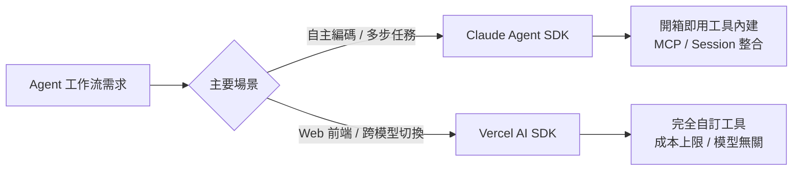

# AI Daily Digest — 2026-06-18

<!-- pipeline-generated:begin -->

## 🔥 今日 TOP 3
### 1. ContextOS：777 個參數無 GPU 超越 LLMLingua-2，達成上下文壓縮新 SOTA
ContextOS 是一套新型學習式上下文選擇策略，僅需 777 個參數即可在無 GPU 環境下完整運行。系統在整個 55–85% 的壓縮率範圍內全域超越強基準模型 LLMLingua-2，達成目前最先進（SOTA）的性能表現。

此突破顛覆了「更好的壓縮需要更大模型」的工程直覺，對資源受限場景尤其關鍵。相較於 LLMLingua-2 需要數百萬以上的參數，ContextOS 以極低算力實現更優壓縮品質，表明上下文選擇的核心在演算法設計而非規模堆疊，對邊緣設備與低成本推理端點均具直接應用價值。

從業者設計 LLM 推理管線時，應優先評估輕量上下文壓縮前置步驟的 ROI——在 API 單價不變的前提下，55% 上下文縮減即代表近乎等比例的 token 成本節省。邊緣部署與低延遲場景的工程師可直接將 ContextOS 列為下一次推理優化的第一候選方案。

📖 [閱讀完整 insight](../10-insights/2026-06-17/inbox_28287543.md) · 🔗 [原文連結](https://medium.com/@aaryanmhjn/beating-the-state-of-the-art-at-context-compression-with-777-parameters-and-no-gpu-7737729a4428?source=rss------large_language_models-5)
### 2. 程式碼從稀缺資源變成免費商品，工程紀律需求卻反向上升
Simon Willison 引用 Charity Majors 的觀察：2025 年 AI 驅動的程式碼生成已讓撰寫成本趨近於零、速度趨近於即時。程式碼從前被工程師珍視、精心重用的稀缺資源，一夜之間轉變為可拋棄、隨時重新產生的商品。

這個典範轉移的衝擊出乎直覺：多數人預期「程式碼更便宜」會降低品質流程的需求，但實際相反。可即時生成大量程式碼，反而讓架構邊界失控、技術債累積速度大幅加快；衡量工程師產出的舊指標（程式碼行數、提交頻率）也同步失效，設計品質與品質治理能力才是 AI 時代的核心競爭力。

工程主管可立即審視：CI/CD 管線的架構邊界自動化檢查是否到位？PR 審查流程是否能跟上 AI 生成的速度？若尚未建立「品質閘門」自動化，隨著 AI 輔助生成量持續放大，人工過濾劣質設計的摩擦力將迅速失效，組織技術債將以前所未見的速度積累。

📖 [閱讀完整 insight](../10-insights/2026-06-17/inbox_831a74a6.md) · 🔗 [原文連結](https://simonwillison.net/2026/Jun/17/charity-majors/#atom-everything)
### 3. Claude Agent SDK vs. Vercel AI SDK：開箱即用 vs. 完全透明的架構選擇
Claude Agent SDK 源自 Claude Code 功能庫，內建檔案讀寫、Shell 執行與網頁搜尋等工具，並整合 MCP 及 session 管理，設計目標是讓代理直接自主執行複雜多步驟任務。Vercel AI SDK 採「原語」策略，不預設任何工具，完全由開發者自訂，提供 `stopWhen`、`prepareStep` 細粒度控制、成本上限設定與跨模型切換能力。

兩者面向截然不同的受益族群：需快速建構 AI 代碼工作流的後端/DevOps 團隊，Claude SDK 可省去大量設定前置；需跨模型靈活切換、成本精控或深度整合 React/TypeScript 前端的團隊，Vercel SDK 的透明度與模型無關性更具優勢。選錯 SDK 代表的不只是技術摩擦，更是未來難以重構的架構鎖定——Claude SDK 深度綁定 Claude 生態，Vercel SDK 保留更大遷移彈性。

決策捷徑：自主編碼與多步代理工作流優先評估 Claude SDK；需跨模型彈性或前端整合者選 Vercel SDK。選型時核心要評估的不是當下功能差距，而是未來鎖定效應的可接受程度。

📖 [閱讀完整 insight](../10-insights/2026-06-17/inbox_db2f8dc8.md) · 🔗 [原文連結](https://bertomill.medium.com/managed-agents-vs-agent-primitives-comparing-claudes-agent-sdk-and-vercel-s-ai-sdk-fb99d6b2af5f?source=rss------claude-5)

## 📖 好文章 / 影片精選

_過去 30 天經 traffic 沉澱的高品質內容，按興趣領域分類。每篇只在 column 出現一次。_
### 🛠 工具版本追蹤 / Release
- **ruflo** · **[v3.12.0 — ADR-150 metaharness deep integration](../10-insights/2026-06-17/inbox_9a0abf2c.md)**
  ruflo v3.12.0 發布，核心亮點是 ADR-150 深度整合 metaharness 生態系統。新增 10 個 CLI 子命令（score、genome、mcp-scan、threat-model、oia-audit、audit-list、audit-trend、similarity、drift-from-history、mint）、9 個 MCP
- **claude-mem** · **[v13.6.2](../10-insights/2026-06-17/inbox_d6321dd0.md)**
  claude-mem v13.6.2 發布，主要焦點在大幅降低 telemetry 成本。高頻率的 session_compressed 與 context_injected 事件現合併為 5 分鐘 rollup 窗口（observer_turn_rollup、context_injected_rollup），將每月約 4,500 萬個事件縮減至 2 萬筆 
- **superpowers** · **[v6.0.2](../10-insights/2026-06-17/inbox_5f9dc7d2.md)**
  superpowers v6.0.2 發布，解決外掛程式安裝相容性問題。移除了曾破壞使用者外掛程式安裝的 evals 子模組。eval 工具套件現已獨立遷移至單獨的存放庫，與發佈的外掛程式完全分離，改善了模組化設計。
### 📚 AI 知識管理
- **medium-tag-llm** · **[Stream RAG: Building Instant and Accurate Spoken Dialogue Systems with Streaming Tool Usage](../10-insights/2026-06-17/inbox_4237f2b1.md)**
  文章介紹 Stream RAG 方法，用於構建即時且準確的語音對話系統，涉及流式工具使用的創新方式。然而 RSS 摘要未提供具體技術細節和實現步驟。
### 🏢 企業導入 AI / 團隊實踐
- **openai-blog** · **[OpenAI and Dell partner to bring Codex to hybrid and on-premise enterprise environments](../10-insights/2026-05-18/inbox_d7e29f85.md)**
  OpenAI 與 Dell 宣布合作，將 Codex 部署至混合與本地企業環境。該合作幫助企業在自有數據和工作流環境中安全部署 AI 編碼代理，加速企業端 AI 代理的採納。
- **codex** · **[0.131.0](../10-insights/2026-05-18/inbox_d31bba14.md)**
  OpenAI Codex v0.131.0 發布，帶來多項 TUI 與工程改進。主要新功能：TUI 數據驅動的服務層命令、混合令牌計數顯示、權限/批准模式指示、響應式 Markdown 表格；@mentions 支持跨文件、目錄、插件、技能的統一選擇器；插件工作流新增市場 CLI 命令、版本共享、權限管理；遠端工作流支持 daemon 生命週期管理、regi
- **medium-towards-data-science** · **[Six Choices Every AI Engineer Has to Make (and Nobody Teaches)](../10-insights/2026-05-18/inbox_56fb3482.md)**
  探讨 AI 工程师在模型上线后必须做出的六个关键选择。文章强调生产阶段的权衡问题往往只在实际部署后才显现，而这些抉择通常缺乏系统的教学资源。涉及从开发到生产的关键决策点，但具体六个选择的详情需查阅完整文章。
- **medium-towards-data-science** · **[Why Your AI Demo Will Die in Production](../10-insights/2026-05-18/inbox_69fecef0.md)**
  揭示企业 AI 试点项目的高失败率问题。数据表明 95% 的企业 AI 试点无法从演示阶段推进到生产部署。文章聚焦于演示和生产环境之间的根本性鸿沟，以及这个鸿沟导致项目夭折的原因。
- **medium-tag-llm** · **[What Is an Agent Trust Profile?](../10-insights/2026-05-18/inbox_ec8e0f60.md)**
  介绍「Agent Trust Profile（代理信任档案）」的新概念。区分模型身份和运行实例的关键区别：虽然能命名模型，但难以追踪单个实例、会话数或验证结果。信任档案作为记录这些可追踪信息的载体，提供了 agent 可审计性的框架。对 agent 部署的可观测性和治理具有指导意义。
### 🎓 AI 使用技巧 / 心法
- **medium-tag-llm** · **[LLM Distilled: Episode 02 — Prompt Caching: The Highest-ROI Optimization which you Are Probably...](../10-insights/2026-05-22/inbox_d6eff249.md)**
  Prompt Caching 是最高投資回報率的 LLM 優化技巧，卻被大多數團隊忽視至關鍵時刻（成本爆增或延遲問題出現後才發現）。早期導入 Prompt Caching 可大幅降低 API 成本和延遲。
- **medium-tag-claude** · **[What AI model to use?](../10-insights/2026-06-17/inbox_a23ef132.md)**
  文章討論 AI 模型選擇對成本的關鍵影響：選擇錯誤的模型可能導致成本增加 5 倍。這凸顯了模型選擇的重要性——不同模型的價格、性能和適用場景差異巨大。文章應探討選擇框架，如基於任務複雜度、延遲要求、成本預算和輸出品質的決策邏輯。這對建立 AI 應用的企業至關重要，涉及產品經濟性和長期可維護性。
- **medium-tag-claude** · **[Managed Agents vs. Agent Primitives: Comparing Claude’s Agent SDK and Vercel’s AI SDK](../10-insights/2026-06-17/inbox_db2f8dc8.md)**
  Claude Agent SDK 採「開箱即用」策略（內建檔案讀寫、shell 執行、網頁搜尋等工具），而 Vercel AI SDK 採「原語」策略（需自訂工具定義）。Claude SDK 來自 Claude Code 功能庫，內建 MCP、permissions、session 管理，適合自主代碼工作流；Vercel SDK 完全透明且與模型無關，提供 
- **substack-lennys-newsletter** · **[How to design AI agent loops: schedules, goals, and subagents in Claude Code and Codex](../10-insights/2026-06-17/inbox_74427d23.md)**
  Lenny's Newsletter 發布 AI agent loop 設計完整指南，系統講解多種 loop 型態的應用場景與實現方法。文章涵蓋四大 loop 類型：heartbeats（心跳式觸發）、crons（定時觸發）、goals（目標驅動）、subagents（子代理分工模式）。特色是包含兩個實時演示案例，分別使用 Claude Code 和 Cod
- **infoq-main** · **[Presentation: From Hype to Strong Foundations: What the Rise, Fall and Resurgence of Agents Can Teach Us About Outlasting the Cycle](../10-insights/2026-06-17/inbox_1badd561.md)**
  Aditya Kumarakrishnan 在演講中診斷了 AI 領域的「遺忘階段」現象，即業界反覆重複過去的錯誤。他提出完整工程框架：第一，使用 CoALA（協作架構）構建模塊化代理框架；第二，將數十年流程科學經驗應用於可擴展工作流設計；第三，使用 event-sourcing 模式將遺留系統現代化，應對跨功能多代理需求。該框架為避免代理領域炒作週期、構建
### 🔐 AI 安全 / 濫用
- **infoq-architecture** · **[Spring News Roundup: Point Releases of Boot, Security, Integration, Modulith and Spring AI 2.0](../10-insights/2026-06-15/inbox_9690b25a.md)**
  2026 年 6 月 8 日週期間，Spring 生態系發布多項版本更新。包括 Spring Boot、Spring Security、Spring Session、Spring Integration、Spring Modulith、Spring AMQP 和 Spring Vault 的 point releases，同時宣布 Spring AI 2.0
- **simon-willison** · **[Quoting Matteo Wong, The Atlantic](../10-insights/2026-06-16/inbox_21c1a688.md)**
  The Atlantic 記者 Matteo Wong 報導美國白宮升級對 Anthropic 的監管行動。報導引用網絡安全專家 Katie Moussouris 的評論，她獲得了白宮關於 Fable jailbreak 的報告副本。根據 Moussouris 的說法，白宮報告涉及 IT 專家要求 Fable 幫助識別和修補含有意為漏洞的代碼。當提示「檢查代
### 🛤️ AI Flow 導入心得 / 技術分享
- **medium-tag-llm** · **[Frontier AI Peaked. Here’s What Comes Next](../10-insights/2026-05-18/inbox_b5a094bb.md)**
  作者 David H. Deans 論述 AI 邊界時代已至。長期「規模至上」敘事（更大模型、更大計算集群）面臨瓶頸；產業重心轉向效率、應用實踐、成本優化。標題暗示規模驅動力衰退，未來重點為「下一步」（推論為應用層、邊界應用或新商業模式）。內容受網站防護限制，無法完全驗證細節。
- **medium-tag-llm** · **[Knowledge Distillation Explained: How Student Models Learn from Teachers](../10-insights/2026-05-18/inbox_e0f06c4b.md)**
  作者 Tahsin Soyak 詳解知識蒸餾（Knowledge Distillation）技術。大模型變聰明但變重；蒸餾訓練輕量「學生模型」模仿龐大「教師模型」行為。核心機制：(1) 教師模型生成軟標籤（85% Cat, 10% Dog, 5% Car vs 硬標籤 100% Cat）；(2) 學生透過溫度參數（Temperature）軟化教師輸出，學習類
- **reddit-localllama** · **[Qwen 3.6 27B on 24GB VRAM setup: backend comparisons, quant choice and settings (llama.cpp, ik_llama.cpp, BeeLlama, vllm)](../10-insights/2026-05-18/inbox_80633f87.md)**
  RTX 3090 24GB VRAM 上運行 Qwen3.6-27B 的實測優化指南。測試 4 個後端（llama.cpp、ik_llama.cpp、BeeLlama、vLLM）後，ik_llama.cpp + Qwen3.6-27B-MTP-IQ4_KS.gguf 配置最優：達 1261 tok/s prefill、72.9 tok/s decode，支持
- **deepmind-blog** · **[Fast-tracking genetic leads to reverse cellular aging](../10-insights/2026-05-18/inbox_a3e6f2d2.md)**
  DeepMind 的 Co-Scientist AI 工具在生物衰老研究中取得突破，幫助生物學家發現能成功使人類細胞年輕化的新遺傳因子。這標誌著 AI 在加速基礎生物學發現中的實際應用，有望推動衰老逆轉等生物醫學領域的進展。研究顯示 AI 輔助科學家進行高通量遺傳篩選，顯著縮短發現周期。
- **deepmind-blog** · **[Simulate real-world places with Project Genie and Street View](../10-insights/2026-05-17/inbox_97542179.md)**
  Google 將 Project Genie 與 Street View 結合，推出真實地點模擬功能，並擴大 Google AI Ultra 訂戶的全球訪問範圍。此功能允許用戶基於真實世界影像生成虛擬環境模擬，打開遊戲、規劃與虛擬探索的新應用空間。功能全球 AI Ultra 訂戶可用。

## 💡 今日 Takeaway

_讀完今日所有內容後，可帶走的知識點_
### 1. 極端參數效率可達 SOTA：上下文壓縮的計算門檻遠低於工程直覺
ContextOS 的結果打破「大壓縮器才能做好壓縮」的假設——演算法設計比規模堆疊更決定上下文選擇的品質。在規劃推理管線時，應優先評估輕量前置壓縮步驟（無需 GPU）的節省潛力，尤其適用於邊緣設備或高頻呼叫場景。以 55% 壓縮率為例，幾乎可將有效 token 成本減半，而算力開銷可忽略不計——這使得「先壓縮、再推理」成為成本優化的高優先選項。

_類型：data-point_

**參考來源**：
- [Beating the State of the Art at Context Compression — With 777 Parameters and No GPU](../10-insights/2026-06-17/inbox_28287543.md) · [原文](https://medium.com/@aaryanmhjn/beating-the-state-of-the-art-at-context-compression-with-777-parameters-and-no-gpu-7737729a4428?source=rss------large_language_models-5)
### 2. 程式碼商品化後，工程紀律需求反向上升而非下降
當 AI 讓程式碼生成趨近免費，失控的架構混亂與技術債才是真正的成本所在。衡量工程師的傳統指標（行數、提交量）已失效，核心競爭力轉為系統設計品質與品質治理能力。實務上，應強化 CI/CD 中的架構邊界自動化檢查與測試覆蓋要求，使品質管控速度能匹配 AI 輔助生成的速度——不能依賴「慢速人工撰寫」的摩擦力來自然篩選劣質程式碼。

_類型：framework_

**參考來源**：
- [Quoting Charity Majors](../10-insights/2026-06-17/inbox_831a74a6.md) · [原文](https://simonwillison.net/2026/Jun/17/charity-majors/#atom-everything)
### 3. 多代理系統身份管理需三層設計：委託授權、Scope 憑證、人工批准邊界
Uber 的生產案例與 Auth0 的框架共同指向同一原則：代理委派工作時若不明確傳播用戶上下文，會形成無法追蹤的權限漏洞。三層設計是生產級多代理系統的最低安全基線：委託授權（delegated authority）確保代理在用戶授權範圍內行動；作用域憑證（scoped credentials）限制工具存取邊界；人工批准關卡處理高風險操作。身份傳播機制應在架構設計初期納入，而非事後疊加安全層。

_類型：pattern_

**參考來源**：
- [AI Agent Identity and Permission Challenges: How Uber and Auth0 Are Rethinking Access Control](../10-insights/2026-06-17/inbox_8f08fe47.md) · [原文](https://www.infoq.com/news/2026/06/ai-agent-identity-uber-auth0/?utm_campaign=infoq_content&utm_source=infoq&utm_medium=feed&utm_term=global)
### 4. MCP 全域 Scope 在每次 Claude Code 會話自動耗用 token，改用專案 Scope 可大幅降低隱性成本
所有 user-scope MCP 伺服器的工具定義都在每個 Claude Code 會話開始時一次性全量載入，無論當前專案是否實際用到。10 個 MCP 伺服器可能讓每次會話額外耗費數萬 token，以每日數十個會話計算，月度隱性成本相當可觀。改善方法：以 `claude mcp list` 審計設定，將非全局使用的 MCP 伺服器移至專案 scope（`.mcp.json`），並檢查 SessionStart hooks 是否存在不必要的 context 拖累。

_類型：data-point_

**參考來源**：
- [Stop wasting tokens on MCPs: Global Scope vs Project Scope](../10-insights/2026-06-17/inbox_f8742e24.md) · [原文](https://akshatnerella.medium.com/stop-wasting-tokens-on-mcps-global-scope-vs-project-scope-d10ad6a16191?source=rss------claude-5)
### 5. 大多數 LLM 應用只需要明確定義的工作流，而非通用代理框架
通用代理框架為「完全自主決策」而設計，但多數業務場景實際需要的是結構清晰、可預測的條件式決策流程。引入重型框架往往帶來不必要的複雜性與更難偵錯的不確定行為；以純 Python 實現有狀態工作流通常更易測試、更好維護。選型前的核心問題是：「這個任務真的需要自主決策，還是只需要條件邏輯？」——多數情況下答案是後者，明確工作流的可控性遠優於通用代理的靈活性。

_類型：pattern_

**參考來源**：
- [You Probably Don’t Need an Agent Framework](../10-insights/2026-06-17/inbox_1aaec9f7.md) · [原文](https://towardsdatascience.com/you-probably-dont-need-an-agent-framework/)

<!-- pipeline-generated:end -->

<!-- user-notes -->
<!-- Write your own notes below; pipeline never touches this section. -->