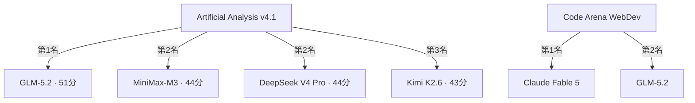
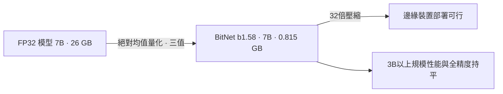

# AI Daily Digest — 2026-06-19

<!-- pipeline-generated:begin -->

## 🔥 今日 TOP 3
### 1. GLM-5.2 MIT 開源：753B MoE、百萬 Context 視窗、AI 指數榜首
Z.ai 於 6 月 16 日以 MIT 授權完全開源 GLM-5.2，採用 753B 參數、40 個活躍專家的 MoE 架構，context 視窗達 100 萬 token，較前代 GLM-5.1 的 20 萬擴大整整 5 倍，目前為純文字輸入（視覺版 GLM-5V-Turbo 不開源），全量模型 1.51 TB 可自行部署。

GLM-5.2 在 Artificial Analysis v4.1 全球排名第一（51 分），Code Arena WebDev 前端代碼評測排名第二（僅次 Claude Fable 5），代表開源陣營首度在主流 AI 指標上明確超越所有閉源競爭者。定價約 $1.40/$4.40 每百萬 token，為 GPT-5.5（$5/$30）的三至七分之一，性價比差距顯著。

開發者可即刻透過 OpenRouter 多家供應商試用；需留意 GLM-5.2 每任務輸出約 43k token，高於 GLM-5.1 的 26k，成本預算應以真實 token 消耗量計算，而非只看單位定價，否則實際帳單可能比估算高出 65% 以上。

📖 [閱讀完整 insight](../10-insights/2026-06-17/inbox_cfc45d56.md) · 🔗 [原文連結](https://simonwillison.net/2026/Jun/17/glm-52/#atom-everything)
### 2. BitNet b1.58：7B 模型壓縮 32 倍，邊緣 AI 部署門檻首度突破
微軟研究院提出 BitNet b1.58，將每個模型權重壓縮為三值（-1、0、+1），採用「絕對均值量化」方法；7B 模型記憶體從 26 GB 縮至 0.815 GB，壓縮達 32 倍，LayerNorm、Embedding 等非權重組件保留高精度以維持訓練穩定性。

在 3B 參數規模以上，BitNet b1.58 效能與全精度模型持平，推翻了「極限量化必然犧牲性能」的假設。這是邊緣 AI 部署的結構性突破：手機和嵌入式裝置現在能以合理成本執行 7B 級模型並大幅降低能耗，原先必須呼叫雲端 API 的推理任務，可能轉為本地完成。

硬體選型和架構設計者應將 1-bit 量化納入邊緣部署評估清單，測試 3B 以上規模的效能-壓縮平衡點；若此技術成熟商用，「雲端推理作為預設」的架構假設需要根本性重新審視。

📖 [閱讀完整 insight](../10-insights/2026-06-18/inbox_2c2be85a.md) · 🔗 [原文連結](https://medium.com/@nageshchauhanc4/exploring-1-bit-llms-by-microsoft-81dc2bcdf25c?source=rss------large_language_models-5)
### 3. Fable 遭美禁發布、SpaceX 收購 Cursor：AI 監管與工具整合同步加速
本週三件大事同步發生：美國政府禁止 Anthropic 推出 Fable 系列新模型；SpaceX 宣布收購 AI IDE 工具 Cursor；Cursor 同期推出 GitHub 競爭性產品，直接挑戰傳統代碼協作平台。

Fable 遭禁是前沿模型因監管被阻的首個公開案例，代表 AI 監管正從「事後審查」演進為「事前限制發布」，直接衝擊 Anthropic 商業模式；SpaceX 收購 Cursor 則揭示 AI IDE 工具已進入整合期，跨域資本開始主導開發者工具鏈版圖重組，Cursor 的獨立路線圖存在不確定性，而 Cursor 推出 GitHub 替代品更預示 AI 原生代碼協作生態加速成形。

企業 AI 採購應評估關鍵路徑對單一廠商模型的依賴度，提前建立備援切換能力；開發者工具選型時應將供應商穩定性和資本背景納入評估，而非僅比較功能差異。

📖 [閱讀完整 insight](../10-insights/2026-06-18/inbox_85b15cb6.md) · 🔗 [原文連結](https://newsletter.pragmaticengineer.com/p/the-pulse-big-implications-of-us)

## 📖 好文章 / 影片精選

_過去 30 天經 traffic 沉澱的高品質內容，按興趣領域分類。每篇只在 column 出現一次。_
### 🛠 工具版本追蹤 / Release
- **ruflo** · **[v3.12.4 — CWE-78 security patch (agentic-flow ≥ 2.0.14)](../10-insights/2026-06-18/inbox_4782c145.md)**
  ruflo v3.12.4 發布重大安全補丁，修復 agentic-flow ≤2.0.13 中的 CWE-78 OS 命令注入漏洞。該漏洞影響 MCP 伺服器工具（standalone-stdio、http-sse、http-streaming-updated、stdio-full、claude-flow-sdk 等），因其將使用者控制的參數直接插入傳遞給
  _+ 3 個近期版本（v3.12.3 → v3.12.1，僅顯示最新）_
- **claude-code** · **[v2.1.181](../10-insights/2026-06-17/inbox_35ab43ee.md)**
  Claude Code 發布 v2.1.181，新增 /config key=value 語法支援即時設定調整，升級 Bun runtime 到 1.4 以提升執行效能。改善長段落流媒體顯示（行行出現而非等待換行）、API 連線中斷自動重試、MCP OAuth 視覺風格、以及沙箱 Apple Events 權限選項。修復超過 30 項 bug，包括 prom
### 📚 AI 知識管理
- **medium-tag-llm** · **[RAFT: Teach LLMs to be better at RAG](../10-insights/2026-06-18/inbox_4395e6c5.md)**
  RAFT（檢索增強微調）是 UC Berkeley 研究者開發的方法，結合領域特定微調與檢索增強生成（RAG）兩者優勢。傳統領域微調易過擬合導致幻覺，RAG 有時檢索到無關文件。RAFT 使用包含問題、相關與無關文件、思維鏈答案的合成資料集進行訓練，類似「學生在開卷考前先讀教科書比只在考試時查閱更有優勢」。在維基百科、API 文件、醫療研究等多個資料集測試均
### 🏢 企業導入 AI / 團隊實踐
- **medium-tag-llm** · **[Fleet Engineering](../10-insights/2026-06-18/inbox_988b40d1.md)**
  LangSmith Fleet 定義並解決「多智能體治理」問題：企業不再只有一個智能體，而是數十個跨部門部署的智能體。核心挑戰從「我們能否構建智能體？」轉向「誰擁有、如何治理、怎樣稽核」。Fleet 建立四大支柱：(1) 代理—知識工作者用自然語言敘述任務；(2) 改進—從真實使用與反饋學習；(3) 批准—敏感操作需人工批准；(4) 連接—OAuth 與 M
- **infoq-main** · **[Microsoft Scout, New Enterprise Autopilot Built on OpenClaw, Announced at Build 2026](../10-insights/2026-06-18/inbox_98d9172c.md)**
  Microsoft 在 Build 2026 大會發佈 Microsoft Scout，代表新分類『Autopilot』自主代理的首個產品。Scout 能夠持續在後臺自動為使用者工作，具備獨立的用戶身份，無需使用者重複觸發和提示。與傳統的被動查詢型 AI 助手不同，Scout 主動自治地執行任務，體現企業 AI 代理從被動查詢向主動自治的範式轉變。Scout
- **infoq-main** · **[AI Agent Identity and Permission Challenges: How Uber and Auth0 Are Rethinking Access Control](../10-insights/2026-06-17/inbox_8f08fe47.md)**
  Uber 公開了多代理 AI 工作流中的身份傳播架構，旨在代理委派工作和呼叫內部工具時保留使用者上下文、追蹤代理來源、實施 scoped 存取權限。Auth0 呼應此觀點，強調 AI 代理的權限管理應基於三原則：委托授權（delegated authority）、scoped credentials、和明確的人工批准邊界。該案例研究反映業界對多代理系統身份管
- **openai-blog** · **[Using AI to help physicians diagnose rare genetic diseases affecting children](../10-insights/2026-06-18/inbox_011c47cd.md)**
  研究人員使用 OpenAI 的 reasoning model 協助診斷罕見遺傳疾病，在 18 個先前未解決的臨床案例中成功識別了新的診斷結果。這代表 AI 推理模型在複雜醫學診斷中的實際應用成果，特別是在傳統診斷難以解決的罕見病例上展現了顯著價值。該案例說明大型推理模型能夠整合複雜的醫學文獻和臨床表現進行多步驟推理，為醫療專業人士提供可操作的決策支援。
- **substack-pragmatic-engineer** · **[AI’s impact on software engineers in 2026: key trends, Part 2](../10-insights/2026-05-19/inbox_e9adbf2c.md)**
  Pragmatic Engineer 對 900+ 工程師進行 AI 工具採用調查（第 2 部分），揭示企業級 AI 採用的核心困境。正面收穫：減少重複勞動、擴大高價值工作人才池；負面風險：(1) 管理層期望不切實際，(2) 代碼品質傾向下降但管理者多數無感，(3) 維護複雜代碼的工程師人數萎縮，(4) 資淺工程師被邊緣化（token 花費高、收益低）。調查
### 🎓 AI 使用技巧 / 心法
- **medium-tag-claude** · **[Anthropic Added 4 Claude Effort Levels (I Tested All and Found My Best)](../10-insights/2026-05-29/inbox_48e76365.md)**
  Anthropic 在 Claude 加入 4 級努力度控制（Low、Medium、High、Max）。作者測試所有級別發現：更高努力度=更好答案但響應慢且速率限額消耗快；更低努力度=快速回應但品質低。建議複雜問題用 Max，簡單任務用低級以避免超額消耗。多數使用者未知此功能存在，可能造成成本浪費或品質妥協。
- **medium-tag-claude** · **[Claude Now Runs Agents on a Schedule. Automate These 5 First.](../10-insights/2026-06-18/inbox_ca3612c7.md)**
  Anthropic 的 Managed Agents 平台新增 cron scheduling 和 credential vaults 功能。文章建議優先自動化 5 類定期性任務（如報告生成、資料備份、監控告警等），同時保留 3 類任務由人工介入，在效率與控制間取得平衡。此功能對需要持續自動化的企業應用具有實務價值。
- **substack-pragmatic-engineer** · **[Ideas: slow down to speed up when working with AI agents](../10-insights/2026-06-02/inbox_14f023db.md)**
  Pragmatic Engineer提出的观点：开发者借助AI agents在过去6个月内代码生成量翻倍，但这直接加剧了代码质量、可靠性与技术债问题。文章标题『放慢速度来加速』建议通过理性的流程设计和质量管理来抵消生成量暴增带来的负面影响。虽然存在已知的解决方案，但大多数开发团队并未采取行动。核心论点是盲目追求代码生成速度会伤害长期可维护性。
### 💳 支付 / Fintech
- **infoq-main** · **[Athena Coalition Brings Coordinated Defence to Open Source Security](../10-insights/2026-06-18/inbox_5444803e.md)**
  Chainguard 宣佈推出 Athena，一個業界合作聯盟，旨在使用人工智能主動發現並修復廣泛使用的開源軟體漏洞。該聯盟重點關注網頁瀏覽器、數據中心、智能手機和支付系統等基礎設施中的關鍵組件，包括圖書館和容器等。與傳統被動應對漏洞的方式不同，Athena 採用預防性策略，在攻擊者利用漏洞前就將其修復。這個協調防禦的方式可望大幅提升開源生態的安全性，保護廣
- **medium-tag-llm** · **[The exact setup I use to de-risk AI vendors](../10-insights/2026-06-18/inbox_7ebda357.md)**
  文章指出團隊通常將 LLM 視為傳統 SaaS 整合，導致重大供應商鎖定風險。核心問題：提示詞工程、token 限制、安全特性、效能基準都與單一廠商深度綁定。若廠商下線服務、不支援某模型或成本暴增，整個系統需耗費數月重構。這不只是合規問題，而是生產可靠性問題——許多企業才上線 AI 客服、搜尋、內部工具數月後，發現自己在多個收入關鍵路徑上依賴單一模型，一旦模
- **medium-tag-claude** · **[The Best Claude Connectors for Business: Connect Your Tools to AI](../10-insights/2026-06-18/inbox_882f6a25.md)**
  指南介紹 Claude 連接器（通過 Model Context Protocol／MCP 標準）使 Claude 可直接存取業務工具，避免手動切換應用。比較顯示：工作日早晨同樣任務手動完成需 28 分鐘，用連接器只需 5 分鐘。推薦按類別分組的連接器包括：溝通與協作（Slack、Gmail、Outlook、Teams、Zoom）；專案管理（Notion、C
### ⛓️ 區塊鏈 / Web3
- **codex** · **[0.141.0](../10-insights/2026-06-18/inbox_aa1f835d.md)**
  OpenAI Codex 發布 rust-v0.141.0，重點聚焦遠端執行、MCP 伺服器整合、跨平台相容性和性能最佳化。遠端執行器現使用認證端到端加密 Noise relay channels；跨平台遠端執行保留執行器原生工作目錄和殼層；選定執行器插件支援 stdio MCP 伺服器動態激活。修復超過 20 項 bug，包括 Windows 沙箱憑證、T
- **infoq-main** · **[How Lightweight ADRs and Architectural Advice Forums Can Support Architectural Decisions](../10-insights/2026-06-18/inbox_d02fc0e8.md)**
  Ben Linders 提出通過輕量級架構決策記錄 (ADR) 與週期性架構建議論壇來去中心化架構決策。核心觀點：快速變化的技術與系統需要決策記錄作為制度支撐，而定期論壇提供非同步協作機制。強調決策過程本身比最終決定更重要，適合分散式或快速迭代的組織。
### 🔐 AI 安全 / 濫用
- **infoq-main** · **[VS Code 1.123 Adds Two-Hour Extension Update Delay to Limit Supply Chain Attacks](../10-insights/2026-06-18/inbox_6a0e1779.md)**
  VS Code 1.123 引入擴展更新延遲機制：自動更新到新版本前等待 2 小時，創建撤銷窗口以對抗供應鏈攻擊。此舉不適用於 Microsoft、GitHub、OpenAI 等受信任發布者。相同冷卻機制已擴展到 pip、RubyGems、npm、pnpm、Yarn、Bun，反映跨 ecosystems 對軟體供應鏈安全的共識。
- **hackernews** · **[US holds off blacklisting DeepSeek, more than 100 firms deemed security risks](../10-insights/2026-06-17/inbox_7831885c.md)**
  美國政府延遲將中國 LLM 企業 DeepSeek 列入貿易黑名單的決定，同時認定超過 100 家公司或實體構成安全風險。此決定反映美國在應對中國 AI 競爭中的複雜政策立場，涉及技術控制與經貿關係的權衡。具體風險認定標準和後續政策執行方向仍待進一步明確。
### 🛤️ AI Flow 導入心得 / 技術分享
- **infoq-ai-ml** · **[Presentation: From Hype to Strong Foundations: What the Rise, Fall and Resurgence of Agents Can Teach Us About Outlasting the Cycle](../10-insights/2026-06-17/inbox_25e7b56d.md)**
  Aditya Kumarakrishnan 在演講中診斷了 AI 領域的「遺忘階段」現象，即業界反覆重複過去的錯誤。他提出完整工程框架：第一，使用 CoALA（協作架構）構建模塊化代理框架；第二，將數十年流程科學經驗應用於可擴展工作流設計；第三，使用 event-sourcing 模式將遺留系統現代化，應對跨功能多代理需求。該框架為避免代理領域炒作週期、構建
- **infoq-ai-ml** · **[Presentation: Automating the Web With MCP: Infra That Doesn’t Break](../10-insights/2026-06-16/inbox_2298afe7.md)**
  Paul Klein 在 InfoQ 發表題為「Automating the Web With MCP: Infra That Doesn't Break」的演講，探討 AI agents 與網頁自動化的實踐。他將焦點放在雲端瀏覽器基礎設施的擴展挑戰：如何在多租戶環境中管理突發性、有狀態的計算任務，同時防範遠端代碼執行風險。Klein 介紹了使用 Firec

## 💡 今日 Takeaway

_讀完今日所有內容後，可帶走的知識點_
### 1. 技術架構的主流地位往往由硬體相容性決定，而非演算法本身優越性
Transformer 勝出的關鍵在於注意力機制本質上是大規模矩陣乘法，與 GPU 架構天然契合，而非因為它是理論最優的智能架構——此即「硬體彩票效應」。這種偶然對齊創造了自我強化循環：GPU 廠商受益→資金人才集中→進一步優化→市場鎖定，使業界在「對硬體友善」而非「對任務最優」的方向上大量投入。規劃 AI 基礎設施或研究方向時，應區分「硬體效率」與「任務最優」，並留意替代架構（如 SSM、狀態空間模型）若突破硬體適配門檻，可能快速顛覆現有生態。

_類型：framework_

**參考來源**：
- [The Hardware Lottery: Why Transformers Won, What Could Replace Them, and How the AI Bubble Could...](../10-insights/2026-06-18/inbox_05b470d0.md) · [原文](https://joyboseroy.medium.com/the-hardware-lottery-why-transformers-won-what-could-replace-them-and-how-the-ai-bubble-could-d36d1c8d2995?source=rss------large_language_models-5)
### 2. 企業 AI 代理超過十個後，治理從工程問題升格為組織問題
規模化代理系統需要四個支柱：自然語言授權機制、使用反饋驅動的持續改進、敏感操作的人工審批閘道、以及 OAuth 層級的工具存取控制。常被低估的是身份管理的分層——固定憑證的系統代理與代表特定用戶的個人代理，需要截然不同的信任模型和稽核策略。部署首批代理時就應建立可觀測性基礎（每個動作可追蹤），而非等到規模擴大後再補，否則事後補建的成本和風險暴露將遠高於預期。

_類型：framework_

**參考來源**：
- [Fleet Engineering](../10-insights/2026-06-18/inbox_988b40d1.md) · [原文](https://cobusgreyling.medium.com/fleet-engineering-67a0f25991c1?source=rss------large_language_models-5)
### 3. MCP 工具呼叫外部程式時，永遠以陣列傳參而非字串插值
將使用者輸入插入 shell 命令字串（如 `execSync('npx ' + userInput)`）是 CWE-78 OS 命令注入的根源，攻擊者可藉由引號脫逸注入任意指令。正確模式是改用 `execFileSync('npx', argvArray, {shell: false})`，每個參數以獨立陣列元素直接傳給 execve(2)，完全繞過 shell 解析階段。驗證方式：`grep -c execSync your-mcp-server.js` 應為 0，若大於 0 即存在待修補的注入風險；此模式適用於所有 Node.js 進程生成場景，MCP 伺服器等接受外部輸入的服務尤需優先審查。

_類型：technique_

**參考來源**：
- [v3.12.4 — CWE-78 security patch (agentic-flow ≥ 2.0.14)](../10-insights/2026-06-18/inbox_4782c145.md) · [原文](https://github.com/ruvnet/ruflo/releases/tag/v3.12.4)
### 4. LLM 整合若未隔離廠商依賴，供應商中斷即升格為生產故障
深度綁定單一 LLM 廠商的提示詞設計、token 限制、安全策略和效能假設，會在廠商下線或棄用模型時觸發數月級的重構工程，從採購問題直接升格為收益路徑中斷。預防模式：在 LLM 呼叫層設計廠商抽象介面，保持至少一個備援供應商能以相同語義運作，並定期演練切換路徑。AI 應用上線後的前六個月是最危險的窗口期——業務依賴已形成，但應急計畫往往尚未建立。

_類型：pattern_

**參考來源**：
- [The exact setup I use to de-risk AI vendors](../10-insights/2026-06-18/inbox_7ebda357.md) · [原文](https://medium.com/@sebuzdugan/the-exact-setup-i-use-to-de-risk-ai-vendors-b34f17d7d17a?source=rss------large_language_models-5)
### 5. RAFT 讓模型學會從雜訊中找答案，效果優於純 RAG 或純領域微調
RAFT（檢索增強微調）的核心創新是訓練資料同時包含正確文件、干擾文件和思維鏈答案，讓模型學習在有無關文件的環境下仍能精準萃取正確資訊。在 Llama 2 7B 等中等規模模型上，RAFT 在維基百科問答、API 文件、醫療資料集三類基準均優於標準 RAG 和純領域微調。企業部署固定領域 RAG 系統時，若準確率不達標，應優先考慮 RAFT 式合成資料微調，而非只調整 chunk 策略或 retrieval 超參數，成本效益通常更高。

_類型：technique_

**參考來源**：
- [RAFT: Teach LLMs to be better at RAG](../10-insights/2026-06-18/inbox_4395e6c5.md) · [原文](https://medium.com/@nageshchauhanc4/raft-teach-llms-to-be-better-at-rag-9db6456a9965?source=rss------large_language_models-5)

<!-- pipeline-generated:end -->

<!-- user-notes -->
<!-- Write your own notes below; pipeline never touches this section. -->