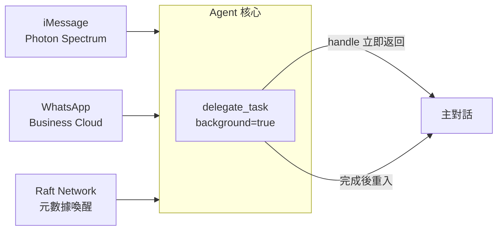
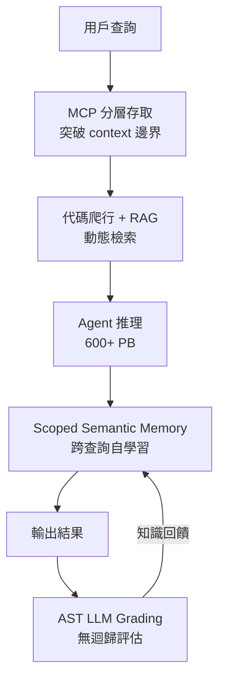

# AI Daily Digest — 2026-06-20

<!-- pipeline-generated:begin -->

## 🔥 今日 TOP 3
### 1. Hermes v0.17：三通訊渠道 + 背景子代理同步上線
Hermes Agent v0.17.0（「Reach Release」）由 Hermes 團隊以 1,475+ commits、800+ merged PRs 的規模發布，一次性新增三條通訊管道：iMessage 無中繼（Photon Spectrum）、Raft agent 隱私網路（元數據喚醒）與官方 WhatsApp Business Cloud API，並推出 `delegate_task(background=true)` 背景子代理——委派後立即返回 handle，子代理完成時結果自動重入主對話。

對 agent 平台開發者而言，此版本的突破在兩個維度：三條通訊管道同步上線使 Hermes 橫跨消費端（iMessage）、企業端（WhatsApp Business）與隱私端（Raft）三個生態，直接挑戰既有企業協作工具的整合地位；背景非同步子代理從根本改變多工協調架構，相比舊版同步阻塞模式，agent 現可同時委派多個長跑任務而不阻塞主對話流，是質的躍升。

實務上可立即測試跨渠道 agent 工作流；長期觀察重點是 Raft 元數據喚醒機制能否演化為隱私優先的 agent 間協作標準。

📖 [閱讀完整 insight](../10-insights/2026-06-19/inbox_73626d0b.md) · 🔗 [原文連結](https://github.com/NousResearch/hermes-agent/releases/tag/v2026.6.19)
### 2. OpenAI Kepler 公開 600 PB 資料 Agent 架構：MCP＋語意記憶＋AST Grading 三件套
OpenAI 研究員 Bonnie Xu 公開分享 Kepler 的設計細節——一個能查詢超過 600 petabytes 資料的內部 AI 分析代理。系統採用 MCP 分層資料存取突破 context window 限制，結合自動化代碼爬行與 RAG 動態檢索，並透過 scoped semantic memory 讓代理跨查詢自我學習；評估管線採用 AST-based LLM grading 實現程式化無迴歸驗證。

這是目前已知公開規模最大的生產級 data agent 架構案例。典型 RAG 應用處理數 GB 至數 TB 資料已屬大型，Kepler 在 600 PB 量級仍可有效運作，關鍵差異在「分層 context 策略」：MCP 解決查詢邊界問題，scoped semantic memory 解決跨查詢知識積累問題，AST grading 解決評估可靠性問題，三者形成閉環。Scoped semantic memory 讓系統越用越聰明，是自適應能力的重要突破。

工程師可立即借鑑此三層組合設計大規模 data agent；下一步觀察重點是 scoped semantic memory 實作細節是否開源，以及 AST grading 的評估準確率數據。

📖 [閱讀完整 insight](../10-insights/2026-06-19/inbox_5a421017.md) · 🔗 [原文連結](https://www.infoq.com/presentations/data-aware-ai-agents/?utm_campaign=infoq_content&utm_source=infoq&utm_medium=feed&utm_term=AI%2C+ML+%26+Data+Engineering)
### 3. Azure Functions 代理執行時公開預覽：.agent.md 定義、零冷啟動、1,400+ 連接器
Microsoft 在 Build 2026 宣布 Azure Functions 推出無伺服器代理執行時（公開預覽）。代理以 .agent.md markdown 檔案搭配 YAML 觸發器定義，原生整合 MCP server 存取、1,400+ 內建連接器與沙箱執行環境；Azure Functions 團隊確認執行時不增加冷啟動開銷，計費維持標準 Flex Consumption 模式，無額外溢價。

對企業架構師而言，此舉的關鍵意義是：無伺服器平台開始對 AI agent 提供原生一等公民支援，而非透過 workaround 實現。1,400+ 連接器覆蓋率遠超主流 agent 框架的生態，零冷啟動與無溢價計費直接壓低生產部署的 TCO（總擁有成本）。相較於自行維護 agent 基礎設施，Azure Functions 方案在企業運維成本上具備顯著競爭優勢，且無需承擔底層排程與容器管理的複雜度。

現有 Azure Functions 用戶可評估漸進升級路徑：無需遷移基礎設施，僅採用 .agent.md 定義格式即可引入 agent 能力。長期值得觀察的問題是：.agent.md 規格能否演化為跨雲 agent 定義的通用標準，以及沙箱執行環境的安全邊界設計細節。

📖 [閱讀完整 insight](../10-insights/2026-06-19/inbox_81191b4c.md) · 🔗 [原文連結](https://www.infoq.com/news/2026/06/azure-functions-serverless-agent/?utm_campaign=infoq_content&utm_source=infoq&utm_medium=feed&utm_term=AI%2C+ML+%26+Data+Engineering)

## 📖 好文章 / 影片精選

_過去 30 天經 traffic 沉澱的高品質內容，按興趣領域分類。每篇只在 column 出現一次。_
### 🛠 工具版本追蹤 / Release
- **hermes-agent** · **[Hermes Agent v0.17.0 (v2026.6.19)](../10-insights/2026-06-19/inbox_73626d0b.md)**
  Hermes Agent v0.17.0（\"Reach Release\"）是一個涵蓋 1,475+ commits、800+ merged PRs 和 300+ issues 的旗艦版本發布，重點擴展通訊渠道和 agent 能力。通訊層面新增三個重要管道：iMessage 無中繼支援（基於 Photon Spectrum）、Raft agent 網路集成
- **claude-code** · **[v2.1.183](../10-insights/2026-06-19/inbox_70d680f1.md)**
  Claude Code v2.1.183 聚焦安全性和穩定性改進。在 auto mode 安全性方面，系統現在自動阻止 git reset --hard、git checkout --、git clean -fd、git stash drop 等破壞性命令，除非使用者明確要求丟棄本地變更。同時，git commit --amend 在非當次 session 
- **superpowers** · **[v6.0.3](../10-insights/2026-06-18/inbox_9b3424e8.md)**
  superpowers v6.0.3 修正了 Subagent-Driven Development（SDD）檔案組織的關鍵問題。原本 SDD 相關檔案（task briefs、implementer reports、review diffs、progress ledger）儲存在 .git/sdd/ 目錄，但 Claude Code 將 .git/ 列為保
### 📚 AI 知識管理
- **infoq-ai-ml** · **[Presentation: AI Agents to Make Sense of Data at OpenAI](../10-insights/2026-06-19/inbox_5a421017.md)**
  OpenAI 研究員 Bonnie Xu 分享 Kepler——內部 AI 資料分析代理的設計，該系統可查詢超過 600 petabytes 資料。突破 context window 限制的核心技術包括：MCP 進行資料存取分層、自動化代碼爬行、RAG 動態檢索；採用 scoped semantic memory 實現代理自我學習，利用 AST-based 
- **medium-tag-llm** · **[Deep Dive: Demystifying the Embeddings Pipeline](../10-insights/2026-06-19/inbox_532d48d3.md)**
  DharaniNeelapuram 撰文深入解析 embeddings（嵌入向量）在現代 AI 中的基礎作用。文章描述了 embeddings pipeline 的完整 5 步流程：(1) 多模態輸入（文字、圖像、音頻等），(2) 預處理與 tokenization（包括 [CLS] 和 [SEP] 特殊標記），(3) 模型推理（透過 Transformer
- **medium-towards-data-science** · **[Parse Scanned PDFs for RAG with EasyOCR: Free OCR Gives You Words, Not a Document](../10-insights/2026-06-19/inbox_b74e4965.md)**
  在 RAG 應用中處理掃描 PDF 時，EasyOCR 和 Docling 兩款 OCR 引擎的輸出結構差異明顯。同一份 1974 年掃描 PDF，EasyOCR 只提取純文字（flat string），而 Docling 同時復原文字、區塊標記與圖表位置。這個結構差異直接決定了下游處理的可用性——Docling 的結構化輸出可供進一步處理，EasyOCR 
### 🏢 企業導入 AI / 團隊實踐
- **infoq-architecture** · **[AI Agent Identity and Permission Challenges: How Uber and Auth0 Are Rethinking Access Control](../10-insights/2026-06-17/inbox_a190b99f.md)**
  Uber 發表了內部架構設計，展示如何在多代理 AI 工作流中可靠地傳播用戶身份。該設計的三個核心目標是保留用戶上下文、維護代理來源的可追蹤性，以及實施作用域訪問控制，確保代理在委託工作和調用內部工具時受到適當的權限約束。Auth0 認為 AI 代理需要基於委託權限 (delegated authority)、作用域憑證 (scoped credential
- **infoq-ai-ml** · **[Azure Functions Ships Serverless Agents Runtime at Build 2026](../10-insights/2026-06-19/inbox_81191b4c.md)**
  Microsoft Azure Functions 在 Build 2026 推出無伺服器代理執行時（公開預覽）。代理定義使用 .agent.md markdown 檔案搭配 YAML 觸發器，提供 MCP server 存取、1,400+ 內建連接器、沙箱執行環境。Azure Functions 團隊確認該執行時無冷啟動開銷，計費模式與標準 Flex Co
### 🎓 AI 使用技巧 / 心法
- **medium-tag-llm** · **[Optimizing Local LLM Inference on Constrained Hardware](../10-insights/2026-06-10/inbox_fcfa0eb4.md)**
  本文深入探討在資源受限硬體上優化本地 LLM 推理的工程技術。文章涵蓋三個核心優化維度：(1) KV cache quantization——降低 Key-Value 快取記憶體佔用，(2) asymmetric thread tuning——根據硬體特性調整執行緒配置以減少同步開銷，(3) PCIe bottleneck 解決——優化 GPU 與 CPU 
- **medium-tag-llm** · **[What exactly is LoRA (Low-Rank Adaptation)?](../10-insights/2026-06-03/inbox_97bbae43.md)**
  本文介紹 LoRA (Low-Rank Adaptation) 技術，一種高效的大語言模型微調方法。通過訓練兩個小矩陣而非整個模型，可將可訓練參數減少約 100 倍。LoRA 的核心優勢是零額外推理成本，使得微調大型模型變得可行且高效。該技術已廣泛應用於需要快速適應特定任務的場景，對資源受限的開發者和企業提供了成本效益高的微調方案。
### 💳 支付 / Fintech
- **medium-tag-llm** · **[Generative AI for Business Operations: Turning Hype Into Workflow](../10-insights/2026-06-19/inbox_f2a18f8a.md)**
  Patrick Samson 分析生成式 AI 在企業營運中的實務應用，強調 AI 已從演示階段進入整合階段。文章涵蓋財務（交易摘要、異常旗標、帳款對帳加速）、客服（回應草稿、工單分類、知識庫檢索）、銷售行銷（個性化外展、潛在客戶篩選）、法務合規（合約初步分析）等領域的應用案例。策略框架為「從單一、獨立的工作流開始，測量成果，再逐步擴展」，成功關鍵是資料品質
### ⛓️ 區塊鏈 / Web3
- **infoq-architecture** · **[How Lightweight ADRs and Architectural Advice Forums Can Support Architectural Decisions](../10-insights/2026-06-18/inbox_cae624ae.md)**
  本文介紹如何通過輕量級架構決策記錄（ADR）與週間建築咨詢論壇來支持去中心化的架構決策流程。傳統集中式決策無法跟上技術與系統快速演進的步伐，因此需要透過 ADR 快速記錄決策過程、影響和理由，搭配週會論壇進行定期的集體審視與經驗分享，讓團隊能更靈活且高效地做出架構決策，同時保留完整的決策追溯性。作者 Ben Linders 強調，這種方式既加快決策速度，又能
- **medium-tag-llm** · **[Fable 5 Çıktı, 3 Gün Sonra Kapandı: Anthropic’in Başına Ne Geldi?](../10-insights/2026-06-19/inbox_b4f52da3.md)**
  Emre Yıldırım 報導了 Anthropic 在 2026 年 6 月 9 日推出的 Fable 5 及 Mythos 5 模型，但僅 3 天後遭關閉的異常事件。Fable 5 展現優異的編碼能力：SWE-bench Verified 達 95%、SWE-bench Pro 達 80%，效能領先競品約 11 點，GDPval-AA Elo 評分達 
### 🔐 AI 安全 / 濫用
- **infoq-architecture** · **[VS Code 1.123 Adds Two-Hour Extension Update Delay to Limit Supply Chain Attacks](../10-insights/2026-06-18/inbox_404911cc.md)**
  VS Code 1.123 版本引入安全防護機制，對擴展程式的自動更新增加 2 小時的延迟窗口，作為防禦供應鏈攻擊的冷卻期。在此延迟期間內若發現惡意擴展，用戶有機會撤銷更新。此防護對微軟、GitHub、OpenAI 等受信任發布者無效。類似的冷卻延迟機制已推廣至整個開源生態，包括 pip、RubyGems、npm、pnpm、Yarn 和 Bun 等主要套件管
- **simon-willison** · **[Datasette Apps: Host custom HTML applications inside Datasette](../10-insights/2026-06-18/inbox_7272a14b.md)**
  Simon Willison 推出 datasette-apps 插件，讓用戶在 Datasette 內建立沙箱化的 HTML+JavaScript 應用。應用在受限 <iframe sandbox> 內運行，配合 CSP（Content Security Policy）防止 cookie 盜取和外部資料外洩，且 CSP 策略設置後不可被內部 JavaScr
- **infoq-main** · **[Windows Platform Security and the Race to Secure AI Agents](../10-insights/2026-06-19/inbox_b7adb5ed.md)**
  Microsoft 在新文章中宣佈將 Windows 定位為可信任的自主 AI 代理作業系統，並推出 Microsoft Execution Containers (MXC) SDK 作為核心安全策略。該方案強調 containment（隔離）、identity（身份）、manageability（可管理性）三層安全能力必須內建於作業系統層級，以支撐企業部署
- **infoq-main** · **[GitLab 19.0 Embeds Agentic AI in Secrets, Merge Requests, and Supply Chain Security](../10-insights/2026-06-19/inbox_059bf2b5.md)**
  GitLab 19.0 將 agentic AI 應用範圍從代碼生成擴展至憑證管理、merge request 審查、供應鏈安全。新版本推出 Secrets Manager 公開測試版、完整 MR Developer Flow、GitLab Duo 按用量計費、SBOM 依賴掃描正式版，使代理能在 DevOps 工作流中自主進行安全決策與變更管理。
### 🛤️ AI Flow 導入心得 / 技術分享
- **openai-blog** · **[How Wasmer used Codex to build a Node.js runtime for the edge](../10-insights/2026-06-03/inbox_a6c1843a.md)**
  Wasmer 使用 Codex + GPT-5.5 構建邊界端 Node.js runtime，開發效率提升 10–20 倍，自原預期的數月縮短至數週完成。展示 OpenAI 代碼生成模型對基礎設施開發的實際加速效果。
- **latent-space** · **[Why Video Agent models are next — Ethan He, xAI Grok Imagine](../10-insights/2026-06-01/inbox_14e655e9.md)**
  Latent Space 與 xAI Grok Imagine 負責人 Ethan He 深度對談，首次揭露三個月快速交付的內部過程。核心技術決策對比：視頻生成模型相比世界模型框架的優勢與取捨、為何 Grok Imagine 在市場評估上被嚴重低估。此對話提供了視頻代理 (video agent) 模型作為下一代多模態 AI 方向的業界視角。

## 💡 今日 Takeaway

_讀完今日所有內容後，可帶走的知識點_
### 1. 大規模資料 Agent 三件套：MCP 解邊界、Scoped Memory 解記憶、AST Grading 解評估
當 agent 需查詢 PB 級資料時，單靠 RAG 無法同時解決 context window 溢出、跨查詢知識遺失、評估不可驗證三大問題。MCP 分層存取讓 agent 按需拉取資料；scoped semantic memory 讓每次查詢結果轉化為持久知識；AST-based LLM grading 提供程式化驗證而非依賴主觀判斷。設計大規模 data agent 時，三層應在架構初期並行規劃——後期補加的修補成本遠高於前期設計。

_類型：framework_

**參考來源**：
- [Presentation: AI Agents to Make Sense of Data at OpenAI](../10-insights/2026-06-19/inbox_5a421017.md) · [原文](https://www.infoq.com/presentations/data-aware-ai-agents/?utm_campaign=infoq_content&utm_source=infoq&utm_medium=feed&utm_term=AI%2C+ML+%26+Data+Engineering)
### 2. AI 系統三層次的真正分野是決策所有權，而非語言能力高低
Chatbot 生成回應但不決定目標；workflow 執行人類預定義的分支序列；agent 在「推理→行動→檢查→重複」循環中自主評估並選擇路徑。語言能力的提升不等於自主性的提升——即使最流暢的 LLM，對日曆衝突、庫存變動、內部政策等環境因素仍是盲目的。評估或採購 AI 解決方案時，首要問題應是「誰擁有這個系統的決策所有權」，才能準確判斷系統層次與適合的使用場景。

_類型：framework_

**參考來源**：
- [The Moment AI Stops Waiting for Instructions](../10-insights/2026-06-19/inbox_51dc2eb2.md) · [原文](https://medium.com/@sourcebowresource/the-moment-ai-stops-waiting-for-instructions-022bf6de9ffd?source=rss------large_language_models-5)
### 3. OCR 工具選型是 RAG 系統的隱形天花板：結構保留能力決定下游可用性
對同一份掃描 PDF，EasyOCR 只輸出純文字（flat string），Docling 同時還原文字、區塊標記與圖表位置。結構保留度的落差意味著：使用低結構 OCR 的 RAG pipeline 在索引階段就已失去文件邏輯，後續 chunking、embedding 與檢索全程在殘缺結構上運作。為企業文件智能系統選型 OCR 時，應以「結構保留完整度」而非「文字辨識準確率」為主要指標，兩者在下游可用性上的差異可達數量級。

_類型：data-point_

**參考來源**：
- [Parse Scanned PDFs for RAG with EasyOCR: Free OCR Gives You Words, Not a Document](../10-insights/2026-06-19/inbox_b74e4965.md) · [原文](https://towardsdatascience.com/parse-scanned-pdfs-for-rag-with-easyocr-free-ocr-gives-you-words-not-a-document/)
### 4. iframe sandbox + CSP + MessageChannel：LLM 生成應用的瀏覽器端三層零信任沙箱
讓 LLM 生成的 HTML/JS 應用安全運行需要三層組合：`<iframe sandbox="allow-scripts">` 隔離執行環境、設置在子頁面 HTML 內（不可被 JS 改寫）的 CSP 標頭阻止 cookie 存取與外部連接、以及 MessageChannel()（而非 postMessage()）實現頁面導航時自動關閉的父子通訊通道。CSP 必須設在子頁面 HTML 中才能防止子頁面自行修改安全規則——這是三層中最容易被忽略的細節。設計任何「LLM 生成代碼在用戶瀏覽器執行」功能時，應以此三層組合為安全基線。

_類型：technique_

**參考來源**：
- [Datasette Apps: Host custom HTML applications inside Datasette](../10-insights/2026-06-18/inbox_7272a14b.md) · [原文](https://simonwillison.net/2026/Jun/18/datasette-apps/#atom-everything)
### 5. Background Async Subagent 模式：用 handle 取代阻塞，讓 agent 真正並行多工
傳統 agent 委派子任務需同步等待結果，長跑任務會阻塞整個對話流。`delegate_task(background=true)` 模式讓子代理在後台執行並立即返回 handle，主代理繼續處理後續請求，子代理完成時結果自動重入對話。此模式適合任何「委派後無需立即結果」的工作——非同步 API 呼叫、長時間資料處理、並行子任務分解。設計多工 agent 工作流時，應系統性識別哪些步驟可 background 化，以最大化主對話的即時響應能力。

_類型：pattern_

**參考來源**：
- [Hermes Agent v0.17.0 (v2026.6.19)](../10-insights/2026-06-19/inbox_73626d0b.md) · [原文](https://github.com/NousResearch/hermes-agent/releases/tag/v2026.6.19)

<!-- pipeline-generated:end -->

<!-- user-notes -->
<!-- Write your own notes below; pipeline never touches this section. -->