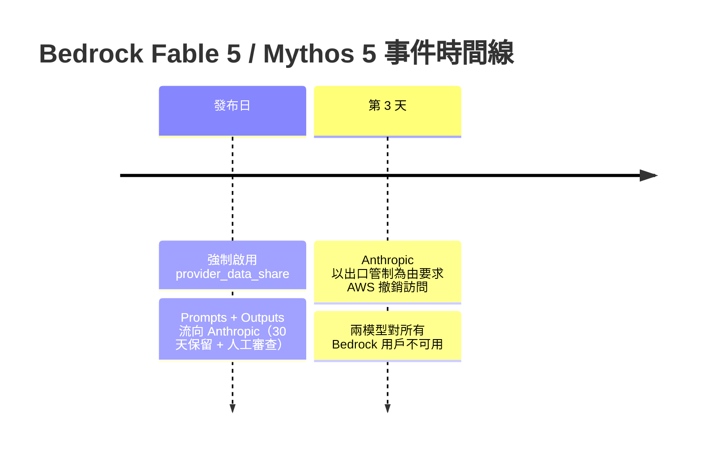
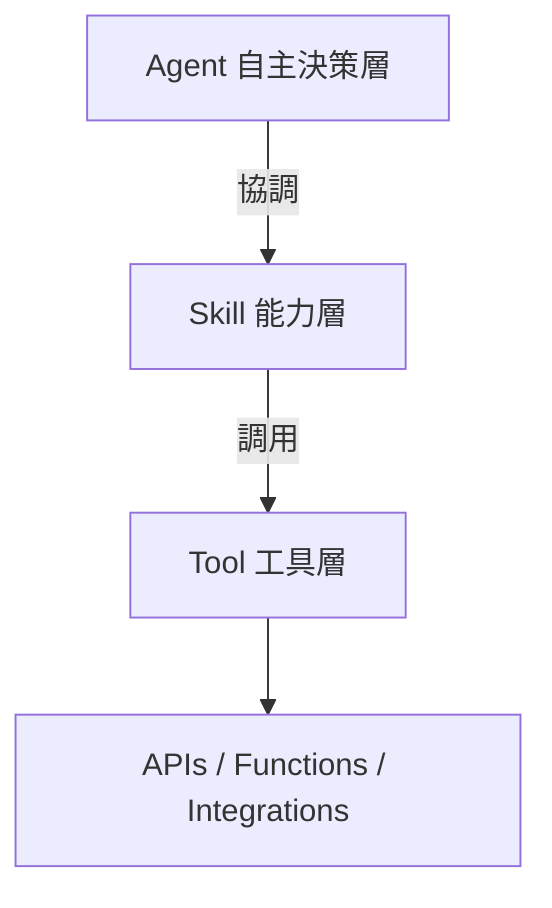

# AI Daily Digest — 2026-06-21

<!-- pipeline-generated:begin -->

## 🔥 今日 TOP 3
### 1. Bedrock Fable 5 強制數據外傳與出口管制下架始末
Anthropic 於 Amazon Bedrock 部署 Fable 5 與 Mythos 5 時，首度強制要求用戶啟用 provider_data_share 機制，所有提示與推理輸出將傳送至 Anthropic 保留 30 天並接受人工審查，打破了過往 Bedrock 推理數據留在 AWS 邊界內的慣例。模型上線僅三天後，Anthropic 即以美國出口管制合規為由，主動要求 AWS 撤銷兩個模型的用戶訪問。

對依賴 Bedrock 數據駐留合規的金融、醫療、政府等敏感產業而言，這等同於合規邊界被單方面改寫——「推理在 AWS 內發生」的隱性保障不復存在。出口管制導致的強制下線更揭示：即使完成採購部署，模型可用性仍可能因監管壓力隨時中斷，成為多廠商信任決策的新風險維度。

企業應立即審查 AI 供應商合規協議，確認推理數據的實際流向是否符合內部政策。短期建議將多廠商備援納入採購規劃；長期需追蹤美國出口管制對跨境 AI 模型部署的系統性影響，及 Anthropic 是否提供不含強制 data-share 的替代部署路徑。

📖 [閱讀完整 insight](../10-insights/2026-06-20/inbox_bed0cbef.md) · 🔗 [原文連結](https://www.infoq.com/news/2026/06/bedrock-fable-5-data-sharing/?utm_campaign=infoq_content&utm_source=infoq&utm_medium=feed&utm_term=global)
### 2. GitNexus v1.6.8：程式依存圖驅動語句級影響分析正式落地
GitNexus v1.6.8 正式推出程式依存圖（Program Dependence Graph, PDG）核心功能，以 --pdg 選項啟用的影響分析整合控制流圖（CFG）、到達定義（reaching-definitions）與 Ferrante 風格控制依存，支援語句層級與跨函數層級的精確爆炸範圍計算，並透過變異預言機（mutation oracle）驗證準確度。同版本新增多分支索引、Python 污點分析 source/sink 模型、MCP HTTP 伺服器及 Java Spring 路由提取，SSA 稀疏求解器優化大型倉庫效能。

相比傳統 call-graph 式分析僅追蹤函數呼叫鏈，PDG 模式能精確辨識「哪一行程式的狀態變更，沿資料依存路徑影響下游哪個語句」，大幅縮小變更審查的誤報範圍。對大型單體或微服務架構而言，code review 可從「看所有相關函數」縮減為「看真正受影響的語句」，審查信心與效率同步提升。

開發團隊可先在低風險倉庫試驗 --pdg 模式，評估語句級分析在 CI/CD 影響閘控中的實際精準度；並追蹤 GitNexus 後續是否推出基於 PDG 的自動測試選擇功能，這將是進一步提升測試效率的關鍵突破。

📖 [閱讀完整 insight](../10-insights/2026-06-20/inbox_aa2ba340.md) · 🔗 [原文連結](https://github.com/abhigyanpatwari/GitNexus/releases/tag/v1.6.8)
### 3. Apple WWDC 26 發布 Core AI：設備端生成式 AI 正式進入蘋果生態
Apple 在 WWDC 26 正式發布 Core AI 框架，作為 Core ML 的官方後繼者，專為 Apple Silicon 深度優化，支援開發者透過自行轉換 PyTorch 模型或使用 Apple 預優化開源模型兩條路徑，在設備端完整執行大型語言模型與生成式 AI，推理數據完全不離開設備邊界。

相較 Core ML 僅支援傳統分類與回歸模型，Core AI 首次將自然語言生成納入蘋果原生框架，標誌著蘋果設備 AI 能力的代際轉變。對隱私敏感應用（醫療記錄、法律文件、個人助理）而言，設備端語言模型推理意味著可在完全不上傳用戶數據的前提下實現生成式 AI 功能，大幅降低 GDPR、HIPAA 等合規負擔——與同日 Bedrock 強制數據外傳爭議形成鮮明對比。

iOS/macOS 開發者應評估現有依賴雲端 LLM API 的功能，篩選隱私需求高的場景優先遷移至 Core AI 設備端推理。重點關注 Apple 是否開放第三方模型（如 Llama、Mistral）的轉換路徑，以及記憶體受限設備上的推理效能實測數據。

📖 [閱讀完整 insight](../10-insights/2026-06-20/inbox_02511889.md) · 🔗 [原文連結](https://www.infoq.com/news/2026/06/apple-core-ai-wwdc/?utm_campaign=infoq_content&utm_source=infoq&utm_medium=feed&utm_term=AI%2C+ML+%26+Data+Engineering)

## 📖 好文章 / 影片精選

_過去 30 天經 traffic 沉澱的高品質內容，按興趣領域分類。每篇只在 column 出現一次。_
### 🛠 工具版本追蹤 / Release
- **claude-code** · **[v2.1.185](../10-insights/2026-06-20/inbox_ded53ca8.md)**
  Claude Code v2.1.185 發布改善用戶界面提示訊息。當 API 響應超過 20 秒無回應時（之前為 10 秒），IDE 會顯示「等待 API 回應 · 將在 ... 秒後重試」的提示。此新提示比之前的「無 API 回應 · 正在重試 ...」更清楚地傳達等待狀態。超時觸發時間從 10 秒延長至 20 秒，減少誤觸發警告。這是純粹的 UX 優化
- **gitnexus** · **[v1.6.8](../10-insights/2026-06-20/inbox_aa2ba340.md)**
  GitNexus v1.6.8 發布為主要穩定版本，核心創新是「程式依存圖」（Program Dependence Graph, PDG）導入。PDG 驅動的影響分析以 opt-in --pdg 模式啟用，用語句級別和跨程序程式切片計算爆炸範圍，經變異預言機驗證確保準確度。完整的 PDG 基礎架構涵蓋所有支援語言，包括控制流圖（CFG）、到達定義（reach
- **claude-mem** · **[v13.7.0](../10-insights/2026-06-20/inbox_f1f50d28.md)**
  Claude-Mem v13.7.0：遙測系統全面改進。核心改變包括：(1) 改用 per-session rollups 取代 5 分鐘牆上時間視窗，減少遙測數據量（確認舊版本 raw_session_compressed 在 2 天內下降 75%）；(2) 統一遙測路徑，本地日誌保持完整保真度，遠端遙測自動遮蔽；(3) 同意門控的錯誤追蹤，自動去除家目錄
### 📚 AI 知識管理
- **infoq-main** · **[Presentation: AI Agents to Make Sense of Data at OpenAI](../10-insights/2026-06-19/inbox_0943b657.md)**
  OpenAI 的 Bonnie Xu 介紹 Kepler，一個內部 AI 數據分析代理，能查詢 600+ petabytes 的數據。該系統使用 MCP 克服 context window 限制、自動代碼爬行與 RAG 增強檢索，並透過 scoped semantic memory 實現自學習能力。評估管道採用 AST-based LLM grading 以
- **infoq-main** · **[AI Coding Agents Get a Stack Overflow of Their Own](../10-insights/2026-06-16/inbox_8f188db6.md)**
  Stack Overflow 宣佈推出 Stack Overflow for Agents，一項針對 AI 編碼 agents 的知識交換服務，目前處於測試版。該服務採用 API 優先設計，以機器可解析的方式提供編程知識和解決方案。Stack Overflow 將所解決的問題命名為「短暫智能差距」（Ephemeral Intelligence Gap）：各個
### 🏢 企業導入 AI / 團隊實踐
- **infoq-main** · **[Claude Fable 5 on Bedrock Requires Sharing Inference Data with Anthropic](../10-insights/2026-06-20/inbox_bed0cbef.md)**
  Amazon Bedrock 上的 Claude Fable 5 和 Mythos 5 要求用戶主動同意 `provider_data_share` 機制，將提示和回應發送至 Anthropic 進行 30 天保留與人工審查，打破了前代 Bedrock 模型在 AWS 邊界內處理推理數據的慣例。更令人矚目的是，發布僅三天後，Anthropic 即請求 AWS
- **medium-tag-claude** · **[Why 82 Percent of Enterprise AI Projects Never Ship](../10-insights/2026-06-14/inbox_0ef9a0f9.md)**
  企業 AI 專案生產化率極低：78% 的企業至少運行過一個 AI 試點，但僅 18% 成功部署超過一個生產級應用，隱含 82% 的企業 AI 專案從未上線。這反映了從試驗到生產的巨大鴻溝，涉及技術整合、組織變更、成本管理等多維度障礙。該比例差異突顯了試點成功與生產化成功之間的根本不同，企業需要重新評估 AI 實現策略。
### 🎓 AI 使用技巧 / 心法
- **medium-tag-claude** · **[Stop Choosing Between Qwen and Claude. The 70/30 Split That Pays for Both.](../10-insights/2026-06-20/inbox_a4e7d09a.md)**
  該文提出實務策略：不必在 Qwen 和 Claude 間二選一，而應採用 70/30 組合配置，根據各模型的實際失敗模式（而非 benchmark 分數）分配工作負載。作者指出 benchmark gap 相對無關緊要，真正決策依據應是理解各模型的實際限制所在。採用組合策略反而能同時支付兩個模型的成本，達成成本效益與性能的最佳平衡。此一做法對開發團隊選擇模型
- **medium-tag-claude** · **[Claude Fable 5 Is Down for Everyone. Here’s the Fallback.](../10-insights/2026-06-13/inbox_1837a14e.md)**
  Automation Labs 的報導稱 Claude Fable 5 發生全域服務中斷，並建議 Opus 4.8 作為降級方案。Opus 4.8 成本約為 Fable 5 的一半，但在 SWE-bench 上損失約 6 分。文章提及「3 層級降級策略」與「所有 AI 買家剛學到的風險」，暗示多模型部署的必要性。
### 💳 支付 / Fintech
- **infoq-ai-ml** · **[Claude Fable 5 on Bedrock Requires Sharing Inference Data with Anthropic](../10-insights/2026-06-20/inbox_f72e2345.md)**
  Claude Fable 5 和 Mythos 5 在 Amazon Bedrock 上運行需強制啟用 provider_data_share 設定，要求將所有 prompts 和推理結果 outputs 發送至 Anthropic 進行 30 天保留與人工審查。這項新政策打破了 Bedrock 以往的數據邊界保護慣例，過去模型的推理數據始終留在 AWS 內
### 📒 帳務架構 / Ledger
- **infoq-architecture** · **[Inside Atlassian’s Forge Billing Architecture for Distributed Usage Tracking at Scale](../10-insights/2026-06-20/inbox_b3afb2bb.md)**
  Atlassian 公開 Forge 計費平台的架構設計，該系統專門處理跨分佈式雲生態的大規模使用事件追蹤與計費。平台採用流式管道（streaming pipeline）、冪等處理（idempotent processing）與分層存儲三層組合架構。三層設計共同保障正確的用戶歸屬、精確的重複事件去重、準確的聚合，同時提供接近實時的計費可見性和可靠的對帳機制。
### 🔐 AI 安全 / 濫用
- **infoq-ai-ml** · **[Windows Platform Security and the Race to Secure AI Agents](../10-insights/2026-06-19/inbox_29f545d5.md)**
  Microsoft 於 Windows Developer Blog 發文，將 Windows 定位為自主代理的可信作業系統，推出 Microsoft Execution Containers (MXC) SDK 作為核心安全方案。該 SDK 強調將隔離(containment)、身份(identity)和可管理性(manageability)嵌入作業系統層
### 🛤️ AI Flow 導入心得 / 技術分享
- **medium-tag-llm** · **[My AI Chatbot Lied to a Real Customer. Here’s the 4-Layer Stack I Wish I’d Built First.](../10-insights/2026-06-14/inbox_b9e4f632.md)**
  作者分享了 AI 聊天機器人在實際客戶互動中失敗的案例——「演示漂亮，上線失敗」。基於這次教訓，作者提出了一套應該事先建立的 4 層堆疊架構，用於在生產環境中防止類似的可信度危機。此案例對所有部署生成式 AI 的團隊具有實踐參考價值。
- **medium-tag-llm** · **[Building FRIDAY: Why One LLM Wasn’t Enough](../10-insights/2026-06-07/inbox_522afa68.md)**
  Medium 文章通過 FRIDAY 多代理語音助手的開發案例，探討了為什麼單一 LLM 模型不足以構建複雜的 AI 助手系統。FRIDAY 是一個以 Python 實作的多代理語音助手，涵蓋了路由、架構設計等核心要素。文章的主要論點是單一 LLM 無法滿足複雜的實務需求，需要透過多代理架構和專業化的分工來實現。這篇文章為開發者提供了多代理系統設計的實務洞察

## 💡 今日 Takeaway

_讀完今日所有內容後，可帶走的知識點_
### 1. 以失敗模式而非 Benchmark 分數決定多模型組合配置
選擇 AI 模型時，應優先記錄各候選模型在真實任務上的具體失敗場景，而非依賴公開排行榜分數。以 70/30 為代表的混合配置策略——根據任務特性分配不同模型使用比例——往往比全程依賴單一旗艦模型更具成本效益，且對特定任務失效更有韌性。實務建議：先在代表性任務上並行測試兩個模型、統計各自失敗率，再據此建立任務路由規則，避免以「整體 benchmark 勝出」作為單一採購依據。

_類型：pattern_

**參考來源**：
- [Stop Choosing Between Qwen and Claude. The 70/30 Split That Pays for Both.](../10-insights/2026-06-20/inbox_a4e7d09a.md) · [原文](https://deshpandetanmay.medium.com/stop-choosing-between-qwen-and-claude-the-70-30-split-that-pays-for-both-9e24b2be5bd6?source=rss------claude-5)
### 2. GenAI 應用採 Tool / Skill / Agent 三層分離，避免單點耦合
生成式 AI 系統的元件應明確分三層：Tool 為原子函數與 API 能力，Skill 組合 Tool 形成特定領域能力，Agent 協調 Skill 執行自主決策。清楚定義三層邊界能避免「所有邏輯堆進 system prompt」的反模式，使各層可獨立測試、替換和擴展，降低跨模組耦合風險。設計新 AI 功能時，先問「這個邏輯屬於哪一層」是最快的架構合理性自我檢查。

_類型：framework_

**參考來源**：
- [Is This a Tool, a Skill, or an Agent?](../10-insights/2026-06-20/inbox_43f20402.md) · [原文](https://itnext.io/is-this-a-tool-a-skill-or-an-agent-b3cc78c66673?source=rss------claude-5)
### 3. MCP 的核心差異是認證隔離，而非可用工具的數量
MCP 相比直接在 agent context 中處理 credentials，根本優勢在於將認證流程完全隔離在 agent context window 之外，最理想情況下可隔離至 harness 外部，使 agent 本身不接觸任何 API key 或 session token。這不僅降低 prompt injection 盜取認證的攻擊面，也讓認證邏輯可獨立更新而無需修改 agent 本體。評估是否採用 MCP 時，「認證安全隔離」應優先於「有多少工具可用」作為決策依據。

_類型：framework_

**參考來源**：
- [Quoting Sean Lynch](../10-insights/2026-06-19/inbox_744fb47e.md) · [原文](https://simonwillison.net/2026/Jun/19/sean-lynch/#atom-everything)
### 4. 多 Agent 協作的瓶頸在於跨 Agent 通信標準化，而非 Agent 數量
當前 AI agent 生態仍處於單一 agent 孤立運行的早期階段，擴展複雜任務的真正瓶頸是缺乏標準化的跨 agent 通信協議與共享狀態機制，而非單個 agent 的能力上限。構建多 agent 系統應優先定義清晰的訊息格式、任務交接協議和共享上下文結構，而非直接疊加 agent 數量。在 A2A 等標準協議成熟前，「orchestrator agent 呼叫 executor agent-as-tool」是最易落地、可漸進演進的過渡架構模式。

_類型：framework_

**參考來源**：
- [The Single-Player Era of Agents: Why AI Needs Multiplayer Infrastructure](../10-insights/2026-06-20/inbox_daf14f32.md) · [原文](https://chierhu.medium.com/the-single-player-era-of-agents-why-ai-needs-multiplayer-infrastructure-b73accfc23d0?source=rss------large_language_models-5)

<!-- pipeline-generated:end -->

<!-- user-notes -->
<!-- Write your own notes below; pipeline never touches this section. -->