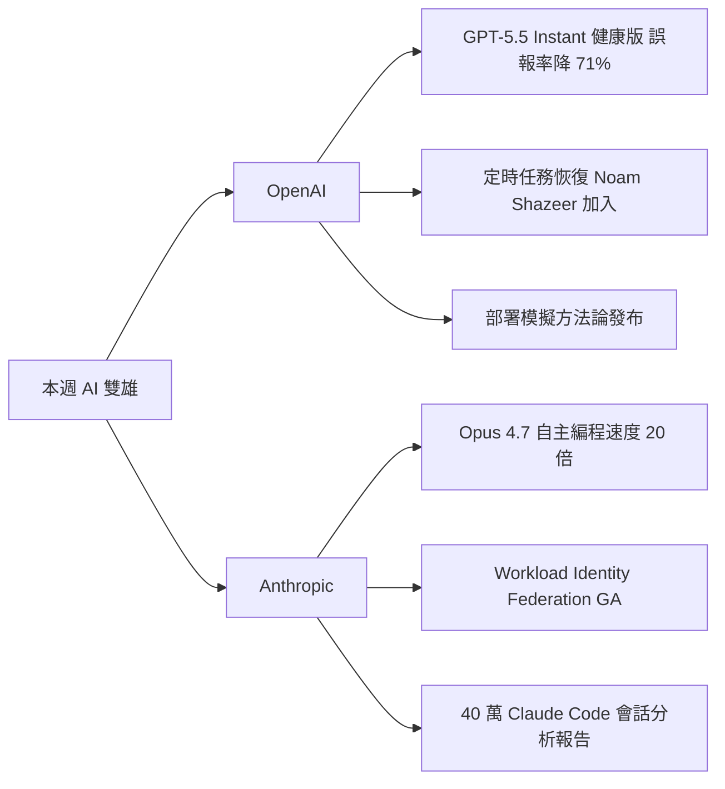

# AI Daily Digest — 2026-06-22

<!-- pipeline-generated:begin -->

## 🔥 今日 TOP 3
### 1. GPT-5.5 Instant 健康誤報降 71%，Opus 4.7 自主編程速度 20 倍提升
本週 OpenAI 與 Anthropic 雙雙推出重大更新。OpenAI 正式部署 GPT-5.5 Instant 作為健康智能標準，向免費用戶開放後健康相關事實性錯誤下降 71%，並恢復改良版定時任務功能，同時宣布 Transformer 共同作者 Noam Shazeer 加入、開設斯德哥爾摩辦公室。Anthropic 方面，Project Fetch 第二階段展示 Claude Opus 4.7 自主編程機器人速度提升 20 倍，Workload Identity Federation 正式 GA，以臨時域內憑證替代靜態 API 金鑰，並發布分析 40 萬 Claude Code 會話的經濟指數報告。

GPT-5.5 Instant 健康場景的誤報率 -71% 是醫療 AI 商業化的重要里程碑，代表 OpenAI 正式進軍高風險垂直領域；Noam Shazeer 加入更強化了其基礎研究厚度。Opus 4.7 20 倍速提升意味著 autonomous coding agent 的實際可用性門檻大幅降低；Workload Identity Federation GA 讓大型企業可安全棄用靜態 API 金鑰，符合 zero-trust 安全架構要求，對企業採購決策影響顯著。

建議立即評估 Workload Identity Federation 遷移計劃，以臨時憑證替換 secrets vault 中的靜態金鑰可顯著縮小攻擊面。GPT-5.5 健康版的誤報改善值得持續追蹤 recall rate，確認在降低誤報的同時未漏報關鍵健康風險。

📖 [閱讀完整 insight](../10-insights/2026-06-21/inbox_55cc880c.md) · 🔗 [原文連結](https://medium.com/@btibor91/the-openai-and-anthropic-weekly-brief-week-25-2026-f0ab29038c7d?source=rss------claude-5)
### 2. Claude 處理 Anthropic 95% 內部查詢，成功關鍵是數據治理而非模型升級
Anthropic 內部報告揭示，Claude 現已自主處理約 95% 的公司內部分析查詢，員工可直接查詢業務數據而無需依賴資料工程師中介。關鍵事實是：這個成果並非源於最新模型能力提升，而是多年來持續完善的數據治理、語意定義（統一指標與業務術語）和運營紀律所積累的成果。

對企業決策者的核心啟示是：LLM 在自助式 BI 場景的成功瓶頸幾乎不在模型本身。缺乏語意層的組織即便換用最強的前沿模型，依然無法讓 AI 可靠地回答業務問題——因為模型無法猜測「revenue」在你的公司是含退款還是稅前/稅後。這個案例以 95% 自動化率佐證了「基礎設施完整度 > 模型版本」的論點，且具備高度的跨組織可複製性。

對計劃落地 AI 分析助手的團隊，行動優先序應為：先建立 metric store 或 data catalog（語意定義層），確保指標含義統一且有文件記錄，再規劃模型選型與接口設計。若資料湖的欄位含義尚未完整記錄，換模型不會帶來質的改變。

📖 [閱讀完整 insight](../10-insights/2026-06-21/inbox_210278e7.md) · 🔗 [原文連結](https://www.infoq.com/news/2026/06/anthropic-claude-analytics/?utm_campaign=infoq_content&utm_source=infoq&utm_medium=feed&utm_term=global)
### 3. 分層模型架構：高階規劃 + 低階執行可降低 80% Token 成本
Anuj Agarwal 展示的多層模型架構將 AI 工程組織類比為真實工程團隊：高階模型（Claude Opus）負責系統設計、任務分解與程式碼審核，低階模型（Claude Haiku）按清晰指示執行具體編碼工作，最終由高階模型驗收合併。實測 token 成本降低 80%，輸出品質未下降。

核心洞察是：昂貴的推理資源（Opus 級別的深度推理）只應在高槓桿決策點消耗，重複性的「按指示執行」工作用 Haiku 級別即可完成。這不只是省錢，而是建立了可規模化的 AI 工程範式，尤其適用於程式碼生成、文件撰寫等批量任務。與「全程用最強模型」的方式相比，這是架構層面的思維升級，也與真實軟體工程中「初級開發者執行 + 資深工程師設計與審核」的分工高度一致。

明天可對現有 AI pipeline 做一次模型層級審計：列出每個步驟，標記哪些需要複雜推理（應用 Opus）、哪些是按規格執行（可降至 Haiku）。大多數組織會發現超過 60% 的步驟屬於後者，存在顯著的成本優化空間。

📖 [閱讀完整 insight](../10-insights/2026-06-21/inbox_a8abd33e.md) · 🔗 [原文連結](https://anujxagarwal.medium.com/how-i-cut-my-ai-coding-costs-by-80-by-building-an-org-chart-out-of-models-4948e0f986d5?source=rss------large_language_models-5)

## 📈 本週 GitHub 飆升 Top 10

_GitHub 本週新增 star 最多的專案_

### 1. [chopratejas/headroom](https://github.com/chopratejas/headroom)
⭐ +16,102 this week · 🧬 Python

這個工具在內容送進 LLM 之前先進行壓縮，對象涵蓋工具輸出、日誌、文件與 RAG 區塊，號稱可削減 60–95% 的 token 用量而不影響回答品質。隨著 AI agent 應用越來越普遍，Context 長度與 API 費用的痛點日益明顯，這類在輸入端直接降本的方案看來引發了廣泛共鳴。它同時提供函式庫、代理伺服器與 MCP Server 三種接入方式，適合正在建構 RAG 或多步驟 agent 系統、想要控制推論成本的開發者。
### 2. [Panniantong/Agent-Reach](https://github.com/Panniantong/Agent-Reach)
⭐ +8,233 this week · 🧬 Python

這個 CLI 工具讓 AI agent 能直接讀取和搜尋 Twitter、Reddit、YouTube、GitHub、Bilibili、小紅書等平台的公開內容，而且不需要任何平台 API 金鑰。同時支援中英文主流平台的整合方案並不多見，可能是吸引大量關注的主因之一。適合需要讓 agent 即時獲取網路資訊、又不想逐一申請各平台 API 的開發者。
### 3. [iptv-org/iptv](https://github.com/iptv-org/iptv)
⭐ +7,266 this week · 🧬 TypeScript

這是一個持續維護的全球公開 IPTV 頻道清單，收錄了來自世界各地可合法或公開存取的直播串流頻道，以 TypeScript 管理資料格式與工具鏈。這類資源每隔一段時間就會因為使用者分享而週期性地回到熱搜榜，無需技術背景即可使用。適合想要免費收看海外直播內容、或是在自架媒體播放器中整合頻道來源的使用者。
### 4. [DeusData/codebase-memory-mcp](https://github.com/DeusData/codebase-memory-mcp)
⭐ +6,372 this week · 🧬 C

這是一個以 C 撰寫的高效能 MCP Server，會將整個程式碼庫索引成持久化的知識圖譜，宣稱支援 158 種語言、查詢延遲在毫秒以下，並能大幅減少傳給 LLM 的 token 量。隨著 MCP 逐漸成為 AI 工具整合的主流協定，能快速讓 AI 助理「讀懂」大型專案的解決方案需求明顯提升，這個零相依的單一靜態執行檔也因此切中了痛點。適合在大型 monorepo 或多模組專案中使用 AI 輔助開發、需要精準程式碼問答的工程師。
### 5. [addyosmani/agent-skills](https://github.com/addyosmani/agent-skills)
⭐ +5,610 this week · 🧬 Shell

這個倉庫收錄了一批可直接用於 AI 程式設計 agent 的「生產級」工程技能定義，以 Shell 腳本為主要形式提供。作者在前端工程社群有一定知名度，發布此類可複用的 agent skill 資源在當前 AI coding agent 熱潮下吸引了不少開發者關注。適合正在打造或自訂 AI coding agent 工作流程、想要參考或直接套用成熟 skill 範本的工程師。
### 6. [google-research/timesfm](https://github.com/google-research/timesfm)
⭐ +4,114 this week · 🧬 Python

TimesFM 是 Google Research 開發的時間序列基礎模型，可在不針對特定資料集重新訓練的情況下直接進行時間序列預測。基礎模型的應用範疇持續從 NLP 擴展到結構化資料領域，這類由大型研究機構釋出的預訓練模型往往能快速獲得社群關注。適合資料科學家或 ML 工程師在銷售預測、異常偵測、能源耗用等場景中尋找開箱即用的預測基線模型。
### 7. [NVIDIA/SkillSpector](https://github.com/NVIDIA/SkillSpector)
⭐ +4,055 this week · 🧬 Python

這是 NVIDIA 推出的安全掃描工具，專門針對 AI agent 的 skill 定義進行漏洞偵測，能識別惡意指令注入、提示注入等安全風險。隨著 AI agent 在企業環境中的部署量上升，skill 層的安全審查逐漸成為不可忽視的議題，NVIDIA 作為知名 AI 基礎設施廠商涉足此領域也引起了廣泛討論。適合負責 AI agent 系統安全評估的資安工程師，以及在生產環境中部署 agent skill 的開發與維運團隊。
### 8. [freeCodeCamp/freeCodeCamp](https://github.com/freeCodeCamp/freeCodeCamp)
⭐ +3,294 this week · 🧬 TypeScript

freeCodeCamp 是長期運營的開源學習平台，提供從數學到程式設計、資訊科學的免費課程，原始碼與課程內容完全公開。這個專案已累積龐大社群，每逢學期開始或職涯轉換潮來臨時往往會出現週期性的 star 增長。適合想要零成本自學程式設計、或尋找系統化學習路徑的初學者與轉職者。
### 9. [calesthio/OpenMontage](https://github.com/calesthio/OpenMontage)
⭐ +2,867 this week · 🧬 Python

OpenMontage 自稱是全球第一個開源的 agentic 影片製作系統，整合了 12 條製作流程與 52 種工具，讓 AI coding assistant 能執行從腳本到剪輯的完整影片生產任務。將 AI agent 框架應用到影音創作工作流程是相對新穎的方向，此類「把 AI 變成影片製作助理」的構想可能引起了創作者社群的強烈好奇。適合想要以低成本嘗試 AI 輔助影片製作的內容創作者，以及對 agentic 工作流程有興趣的開發者。
### 10. [chatwoot/chatwoot](https://github.com/chatwoot/chatwoot)
⭐ +2,036 this week · 🧬 Ruby

Chatwoot 是一套開源的全通路客服平台，整合了即時聊天、電子郵件支援與多種訊息渠道，定位為 Intercom、Zendesk 等商業方案的自架替代品。企業對 SaaS 客服工具的授權費用敏感度持續上升，擁有完整功能且可自行控制資料的開源方案因此長期維持穩定的社群吸引力。適合希望自架客服系統、掌握用戶資料主權的中小型企業與新創團隊。

## 📖 好文章 / 影片精選

_過去 30 天經 traffic 沉澱的高品質內容，按興趣領域分類。每篇只在 column 出現一次。_
### 🛠 工具版本追蹤 / Release
- **claude-mem** · **[v13.8.0](../10-insights/2026-06-21/inbox_3f9049c3.md)**
  claude-mem v13.8.0 發佈，強化遙測系統以追蹤觀察量及成本指標。observer_turn_rollup 現在聚合每個壓縮週期的 observations_created 及各類型觀察計數（bugfix、discovery、decision、refactor、other），context_injected_rollup 記錄注入的觀察總數與節
  _+ 1 個近期版本（v13.7.1，僅顯示最新）_
### 📚 AI 知識管理
- **medium-towards-data-science** · **[Making a PDF’s Images Searchable for RAG, Without Paying to Read Them All](../10-insights/2026-06-20/inbox_e5982ddd.md)**
  文章針對企業級 RAG 應用提出成本優化方案。使用 image_df 工具精確定位 PDF 中每張圖片的位置，避免對整份文件進行無差別掃描。該方案根據搜尋相關性與識別成本優先級選擇性處理圖片，只對關鍵圖片進行識別與索引。關鍵創新在於將圖片定位（低成本）與圖片理解（高成本）兩個步驟分離，前者先行過濾，後者按需選擇性執行。按成本優先級排序處理，確保最有價值的圖片
- **medium-tag-llm** · **[Benchmarking RAG Architectures Locally on a Real Financial PDF](../10-insights/2026-06-20/inbox_acb543ab.md)**
  三部曲系列的第 1 部，比較和基準測試不同的 RAG（檢索增強生成）架構實作方案。使用真實金融 PDF 文件作為評估數據，在本地環境實驗以測試各架構的準確度、延遲和成本的實際權衡。
- **medium-towards-data-science** · **[Reconstructing the Table of Contents a PDF Forgot to Ship, So RAG Can Scope by Section](../10-insights/2026-06-21/inbox_afa6c5e2.md)**
  企業文件智能系列文章：當 PDF 印刷了目錄頁面但無內嵌大綱時，提出兩種重建表格目錄（TOC）的方法，使 RAG 系統能按章節範圍進行文件檢索。特別指出 page-alignment 是常被忽略但關鍵的實踐步驟。
- **medium-tag-llm** · **[Why You Can’t Blindly Apply PageIndex to Financial PDFs (And What Actually Breaks)](../10-insights/2026-06-21/inbox_cf7c2d2e.md)**
  分析 PageIndex 無法盲目應用於 financial PDFs 的原因。針對 10-Ks、年報、信用備忘錄等金融文件的 RAG 實踐，介紹 vectorless RAG 作為替代方案。重點指出文件品質問題（結構變異、編碼問題、版面複雜性）是導致 RAG 失效的關鍵因素，卻鮮少被業界深入討論。
### 🏢 企業導入 AI / 團隊實踐
- **infoq-main** · **[Anthropic Reports Claude Now Handles 95% of Internal Analytics Queries](../10-insights/2026-06-21/inbox_210278e7.md)**
  Anthropic 報告指 Claude 現已處理公司內部約 95% 的分析查詢，員工可獨立查詢業務數據，無須依賴數據團隊。該成果的驅動因素並非模型進展，而是數據治理、語意定義和運營紀律的完善。此案例展示了 LLM 在企業內部應用中，基礎設施和流程設計遠比模型能力本身更決定了成功。對其他企業採用 Claude 進行自助式 BI 具有強參考價值。
- **infoq-architecture** · **[Claude Fable 5 on Bedrock Requires Sharing Inference Data with Anthropic](../10-insights/2026-06-20/inbox_c9dcd287.md)**
  Claude Fable 5 和 Mythos 5 在 Amazon Bedrock 上運行需強制啟用 provider_data_share 設定，要求將所有 prompts 和推理結果 outputs 發送至 Anthropic 進行 30 天保留與人工審查。這項新政策打破了 Bedrock 以往的數據邊界保護慣例，過去模型的推理數據始終留在 AWS 內
- **medium-tag-llm** · **[Stop Chasing the Frontier: Enterprise AI Needs Local Models That Are Enough](../10-insights/2026-06-21/inbox_bd00dde5.md)**
  論述企業 AI 團隊的常見決策誤區：盲目追求「最新最強」的模型。實際上應根據業務需求選擇「足夠好且經濟」的本地模型部署。相比無限追求模型排名，選定合適的本地模型在成本、延遲、可控性和維護複雜度上都更優。轉變思維：從「哪個模型最好」改為「我們需要什麼能力」。
### 🎓 AI 使用技巧 / 心法
- **medium-tag-claude** · **[Cheap Tokens, Expensive Habits: Reading the GLM-5.2 vs GPT-5.5 vs Opus 4.8 Numbers Honestly](../10-insights/2026-06-21/inbox_7f0b1e79.md)**
  文章深度對比分析了三大主流 AI 基礎模型（GLM-5.2、GPT-5.5 和 Claude Opus 4.8）的實際定價與成本結構。GLM-5.2 以每百萬 token 輸入 $1.40、輸出 $4.40 的超低價格吸引決策者，看似成本最優方案。但文章揭示了這正是使用者常陷入的『陷阱』——低表面定價不等於低總擁有成本。作者強調，決策者需要誠實地比較模型在推
- **medium-tag-llm** · **[The AI Model Pricing Wars of 2026: Who is Winning, Who is Cheating, and How to Save a Fortune](../10-insights/2026-06-21/inbox_b8d5cfea.md)**
  2026 年 AI 市場正經歷劇烈的定價競爭，過去三年間 AI 模型的單位成本下降了 90%，現在 AI 項目的成本甚至可能比一杯咖啡還便宜。這篇文章分析了各家模型提供商之間的競爭格局，辨析哪些廠商透過降價擴大市場佔有率、哪些廠商採用不透明的定價策略來迷惑消費者。對企業而言，了解這些定價陷阱和真實成本結構對於評估 AI 專案的 ROI 至關重要，因為看似低廉
### 💳 支付 / Fintech
- **substack-web3matters** · **[第 187 期](../10-insights/2026-06-22/inbox_cae99c32.md)**
  此項內容不屬於 AI 相關主題，主要涉及 SpaceX IPO 對加密貨幣資金流的影響、歐洲支付系統政策、食品相關話題與展覽資訊。無法提供 AI 產業新知相關的摘要與分析。
### 🛤️ AI Flow 導入心得 / 技術分享
- **medium-tag-claude** · **[A Month With Claude Code: It’s Really Not the Same Thing as ChatGPT](../10-insights/2026-06-21/inbox_acc8159c.md)**
  mcAlex 分享一個月使用 Claude Code 的實務經驗。Claude Code 與 ChatGPT 的根本差異在於運作模式：而非對話式的來回互動，Claude Code 功能更像命令行工具，能讀取檔案、編輯檔案、執行測試、檢查 git diff，甚至協助 commit。一名獨立開發者用 Claude Code 在兩天內完成 Node.js/Post
- **medium-tag-claude** · **[I Built an MCP Server in 200 Lines of Go (and Claude Became 10x More Useful)](../10-insights/2026-06-21/inbox_75b3ccb9.md)**
  Cheikh Seck 展示用 200 行 Go 程式碼快速構建 MCP（Model Context Protocol）伺服器，為 Claude 帶來 10 倍的實用性提升。文章強調 Go 是構建 MCP 的最佳語言，因為其簡潔性和原生的分散式系統特性。MCP 被描述為「AI 時代的 API 契約」，提供了標準化的協議讓 AI 模型與外部工具、資料來源無縫整
- **medium-tag-llm** · **[How I Cut My AI Coding Costs by 80% by Building an Org Chart Out of Models](../10-insights/2026-06-21/inbox_a8abd33e.md)**
  Anuj Agarwal 展示透過將 AI 模型組織成「工程組織結構」來降低編碼成本。核心做法是建立分層系統：高階模型（如 Claude Opus）負責架構決策與系統設計，低階模型（如 Claude Haiku）根據清晰指示執行具體編碼工作，高階模型在合併前審核輸出。這種方法實現了 80% 的 token 成本降幅，同時維持輸出品質。該策略模仿真實工程團隊的

## 💡 今日 Takeaway

_讀完今日所有內容後，可帶走的知識點_
### 1. 數據語意定義完善比換模型更能決定企業 AI BI 的成敗
在企業 BI 場景，AI 能否自主回答業務問題取決於它能否理解指標的業務語意。若缺乏 metric store 或 data catalog，即便換用最先進的模型也無法可靠運作——模型不知道「GMV」在你的公司定義是否含退款。正確投資順序是先建立語意層與數據治理，再選型接入模型，Anthropic 內部 95% 自助查詢率是此路徑的直接實證。

_類型：pattern_

**參考來源**：
- [Anthropic Reports Claude Now Handles 95% of Internal Analytics Queries](../10-insights/2026-06-21/inbox_210278e7.md) · [原文](https://www.infoq.com/news/2026/06/anthropic-claude-analytics/?utm_campaign=infoq_content&utm_source=infoq&utm_medium=feed&utm_term=global)
### 2. 高階規劃 + 低階執行的分層模型架構可削減 80% token 成本
設計 AI pipeline 時應依任務決策複雜度分層：高階模型（Opus 級別）負責架構設計、任務分解與品質審核；低階模型（Haiku 級別）負責按指示執行的重複性工作。昂貴推理資源只在高槓桿節點使用，可降低 80% 的 token 成本並維持輸出品質。這是設計 agent workflow 時最具即時回報的成本控制框架，適用於任何批量生成場景。

_類型：pattern_

**參考來源**：
- [How I Cut My AI Coding Costs by 80% by Building an Org Chart Out of Models](../10-insights/2026-06-21/inbox_a8abd33e.md) · [原文](https://anujxagarwal.medium.com/how-i-cut-my-ai-coding-costs-by-80-by-building-an-org-chart-out-of-models-4948e0f986d5?source=rss------large_language_models-5)
### 3. 廣告 token 單價低不等於總成本低，輸入/輸出比才是真實計費決定因子
AI 模型常見的定價陷阱：輸入 token 便宜但輸出 token 遠貴（如 GLM-5.2 輸入 $1.40/M vs 輸出 $4.40/M）。實際成本取決於場景中輸入/輸出的比例——長提示短輸出 vs 短提示長生成的費用差距可達數倍。預算規劃應先用典型請求估算加權平均成本，而非直接比較廣告單價；相同任務在不同模型上的真實成本可能相差數倍。

_類型：data-point_

**參考來源**：
- [Cheap Tokens, Expensive Habits: Reading the GLM-5.2 vs GPT-5.5 vs Opus 4.8 Numbers Honestly](../10-insights/2026-06-21/inbox_7f0b1e79.md) · [原文](https://moelkholy1995.medium.com/cheap-tokens-expensive-habits-reading-the-glm-5-2-vs-gpt-5-5-vs-opus-4-8-numbers-honestly-969994a6991b?source=rss------claude-5)
### 4. 企業 AI 選型應從「哪個模型最強」改為「我們需要什麼具體能力」
追逐排行榜最高分的前沿模型是企業 AI 採購的常見誤區。需求驅動的選型框架要求先定義任務類型、吞吐量、延遲、隱私合規等約束，再對應「足夠好且經濟」的模型——通常是本地部署的中階模型。本地部署在成本、延遲與隱私可控性上往往優於外部 API，且「排名最強」與「最適合你的場景」幾乎從不等同。

_類型：framework_

**參考來源**：
- [Stop Chasing the Frontier: Enterprise AI Needs Local Models That Are Enough](../10-insights/2026-06-21/inbox_bd00dde5.md) · [原文](https://medium.com/@jonathanwiggins2012/stop-chasing-the-frontier-enterprise-ai-needs-local-models-that-are-enough-298a81aa4b40?source=rss------large_language_models-5)
### 5. LLM 安全過濾誤報率消耗開發者約 20% 提示效率，持續上下文記憶是根本解法
研究量化了 LLM 安全機制對合法開發工作的代價：約 20% 的開發提示受到拒絕或警告（直接拒絕 1-2%、安全警告 8-12%、主題偏離 5%），每次中斷造成 2-5 分鐘的心流損失，累積效應顯著。根本解決方案是建立持續的用戶上下文記憶，讓模型了解使用者的身份與工作情境，從而降低將合法開發意圖誤判為惡意請求的機率。

_類型：data-point_

**參考來源**：
- [When ‘Fix This Code’ Looks Like an Attack](../10-insights/2026-06-21/inbox_4767e793.md) · [原文](https://alexandrakay616.medium.com/when-fix-this-code-looks-like-an-attack-44304122bab9?source=rss------claude-5)

<!-- pipeline-generated:end -->

<!-- user-notes -->
<!-- Write your own notes below; pipeline never touches this section. -->