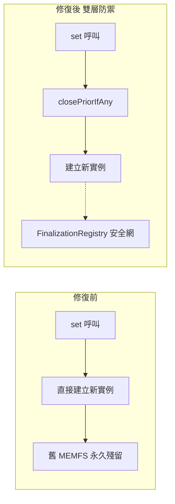
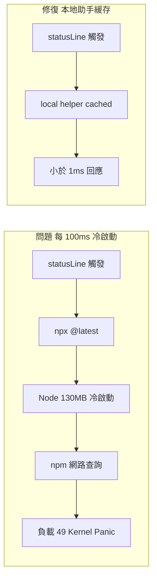

# AI Daily Digest — 2026-06-23

<!-- pipeline-generated:begin -->

## 🔥 今日 TOP 3
### 1. ruflo 修復 36GB 記憶體洩漏與 WAL 雙寫資料庫破損
ruflo v3.13.1 同時修復兩項臨界漏洞。其一是 ControllerRegistry.initController() 每次 set() 未關閉前一 SqlJsRvfBackend 實例，導致 Emscripten MEMFS（~11 MB/實例）持續積累，峰值觀測達 36 GB；其二是 graph-edge-writer 以 fs.writeFileSync() 對 WAL 模式的 better-sqlite3 進行雙寫，兩套寫入協定衝突致使 memory.db 損毀，觸發「database disk image is malformed (11)」。

這兩個漏洞揭示兩類普遍陷阱：Emscripten/WASM 沙盒資源不受 JS GC 管轄，任何未配對 .close() 的替換操作都會持續累積洩漏；WAL 與 fsync 全檔寫入是兩套互不知曉的原子性保證，混用在並行場景必然破損。這類問題在所有跨 runtime native resource wrapper 及「legacy + modern 混搭存儲」架構中均可重演；修復的意義在於將「mutation-site close-on-replace」提升為架構層契約，而非只修補單一 bug。

修復採用雙層防禦：下游在每個 set() 前強制 closePriorIfAny()，上游（v3.13.2）以 FinalizationRegistry 兜底遺漏顯式 close 的呼叫端。若你的系統持有 WASM 或 native addon 資源，應立即審查所有替換邏輯是否配對了 close 前置步驟；若混用文件 IO 與 WAL，統一為單一原子引擎是根本解法，50 並行 integrity_check 是驗證的最低門檻。

📖 [閱讀完整 insight](../10-insights/2026-06-22/inbox_5985aa28.md) · 🔗 [原文連結](https://github.com/ruvnet/ruflo/releases/tag/v3.13.1)
### 2. statusLine 百毫秒冷啟動 130MB Node 程序導致 macOS Kernel Panic
ruflo v3.13.3 修復一項由舊版使用者配置觸發的 macOS kernel panic。受影響使用者的 statusLine 包含 npx @claude-flow/cli@latest hooks，每數百毫秒觸發一次，導致系統反覆冷啟動 ~130 MB 的 Node.js 程序並向 npm 登錄檔發出查詢，累計負載平均值飆至 49，最終觸發 jetsam 記憶體壓縮與 watchdog panic。

核心反模式是「將重型冷啟動程序置於高頻短週期回呼」。statusLine 的預期代價是毫秒內輕量讀取，但 @latest 解析每次都觸發完整 Node runtime 啟動加 npm 網路往返，兩者代價相差數個數量級。任何 CI reporter、shell prompt 插件、IDE status bar 擴充在工具鏈版本升級後若將 bundled 依賴改為 @latest 按需載入，都可能悄無聲息地引入此反模式，直至系統崩潰才被察覺；v3.13.3 同時增加 doctor --component stale-settings 主動偵測機制。

修復採用本地助手緩存取代每次冷啟動：初始化時預載，後續呼叫零 npm 查詢。受影響使用者只需執行一次 npx ruflo@latest init（冪等、保留原配置）即可自動重新生成。設計任何高頻 hook 時應在設計階段量測單次 p99 延遲；若依賴無法預載，以異步緩存或 daemon 程序替代逐次啟動是根本解法。

📖 [閱讀完整 insight](../10-insights/2026-06-22/inbox_6cc7055b.md) · 🔗 [原文連結](https://github.com/ruvnet/ruflo/releases/tag/v3.13.3)
### 3. ruflo Darwin 模式：不重訓模型，Harness 7 層政策自動演化
ruflo v3.13.0 整合 @metaharness/darwin@0.3.1，實作 ADR-153「模型凍結、harness 進化」架構。三個新 CLI 指令允許對 AI agent 執行的 7 層政策（planner、contextBuilder、reviewer、retryPolicy、toolPolicy、memoryPolicy、scorePolicy）進行自動變異、沙箱評分，並僅晉升量化獲勝者，全程無需重新訓練基礎模型。

此架構分離了兩個以往高度耦合的優化維度：基礎模型能力（訓練成本高、週期長）vs. harness 執行策略（調整成本低、迭代快）。相比傳統「調整 prompt 或換模型」的方式，darwin 模式引入量化的質量-多樣性選擇取代人工直覺，可自動交叉演化多代 harness 變體。metaharness security-bench 更在含 10 漏洞/9 誘餌的 ground-truth 語料庫上評分 TPR/FPR/patch-pass，為安全類 harness 提供可量化的進化迴路，是同類工具中首見以安全評估驅動 harness 演化的設計。

安全沙盒設計完備：--confirm 必填、世代上限 1–50、並行最多 8 路、缺少 @metaharness 時降級而非崩潰（{degraded: true}）、安全異常出口碼 99 用於 CI 區隔。對依賴人工調整 prompt 的 agent 團隊，metaharness bench 提供建立固定語料庫評估套件的起點；security-bench 的 TPR/FPR 評分機制值得持續追蹤，觀察能否推廣至一般 agent 性能評估場景。

📖 [閱讀完整 insight](../10-insights/2026-06-22/inbox_9983f529.md) · 🔗 [原文連結](https://github.com/ruvnet/ruflo/releases/tag/v3.13.0)

## 📖 好文章 / 影片精選

_過去 30 天經 traffic 沉澱的高品質內容，按興趣領域分類。每篇只在 column 出現一次。_
### 🛠 工具版本追蹤 / Release
- **ruflo** · **[v3.14.0 — testgen Test-Driven Repair via headless `claude -p`](../10-insights/2026-06-22/inbox_b340a666.md)**
  ruflo v3.14.0 推出 Test-Driven Repair 功能，透過 headless `claude -p` 自動修復失敗的測試。工作流程：執行失敗測試 → 以受限工具集（Read、Edit、Bash）和硬性預算上限（預設 $5）生成修復建議 → 驗證測試通過。成本分層：Haiku $0.02–$0.20、Sonnet $0.30–$2.00
  _+ 3 個近期版本（v3.13.3 → v3.13.0，僅顯示最新）_
- **claude-code** · **[v2.1.186](../10-insights/2026-06-22/inbox_d2d402b3.md)**
  Claude Code v2.1.186 發布，新增 MCP CLI 認證指令（claude mcp login/logout）、/workflows 狀態篩選、Skills 管理、tmux/iterm2 支援。重要改進包括：bash 指令現在預設自動觸發 Claude 回應（breaking change，可透過 respondToBashCommands
### 📚 AI 知識管理
- **medium-towards-data-science** · **[When RAG Users Ask Vague Questions: Clarify Once, Learn the Default](../10-insights/2026-06-22/inbox_e6b57a69.md)**
  本文為企業文件智能系列第六期，提出一套針對 RAG 系統中模糊查詢的交互策略：當用戶提出籠統問題時，系統提問一次有焦點的澄清問題，從用戶回答中推斷其預設偏好與查詢意圖，後續自動應用學到的預設而保持沉默。這一框架減少重複交互，提升用戶體驗，實現通過單次澄清達成個性化知識檢索行為的自動適應。
### 🏢 企業導入 AI / 團隊實踐
- **infoq-ai-ml** · **[Anthropic Reports Claude Now Handles 95% of Internal Analytics Queries](../10-insights/2026-06-21/inbox_a38c8414.md)**
  Anthropic 報告指 Claude 現已處理公司內部約 95% 的分析查詢，員工可獨立查詢業務數據，無須依賴數據團隊。該成果的驅動因素並非模型進展，而是數據治理、語意定義和運營紀律的完善。此案例展示了 LLM 在企業內部應用中，基礎設施和流程設計遠比模型能力本身更決定了成功。對其他企業採用 Claude 進行自助式 BI 具有強參考價值。
- **medium-tag-claude** · **[Deploying Claude Desktop with Vertex AI: Enterprise-Grade Automation with Cost Attribution without...](../10-insights/2026-06-22/inbox_43124172.md)**
  介紹如何在企業環境中部署 Claude Desktop 搭配 Google Vertex AI 推論。核心問題是一般業務使用者無法自行完成 Claude Desktop 的第三方推論配置（共 9 步驟，涉及註冊表、OAuth、特性啟用）。解決方案採用雙腳本架構：安裝腳本（提升權限）處理 Claude 下載與 VMPlatform 啟用，登入腳本則動態寫入使用
- **medium-tag-llm** · **[AI Without the Hype: Where and How to Apply It](../10-insights/2026-06-22/inbox_051ddbc7.md)**
  本文為執行高管提供 AI 應用的決策戰略指南。核心框架包括三層概念：control ladder（控制層級，用於風險管理）、部署經濟學（量化成本效益）、監管合規考量，以及 product-vs-glue line（區分 AI 作為核心產品功能 vs 輔助膠水工具）。作者強調突破 AI 炒作迷霧，聚焦實際應用價值和商業可行性的決策邏輯。
### 🎓 AI 使用技巧 / 心法
- **medium-tag-llm** · **[Cheap Tokens, Expensive Habits: Reading the GLM-5.2 vs GPT-5.5 vs Opus 4.8 Numbers Honestly](../10-insights/2026-06-21/inbox_85b5e59b.md)**
  這篇文章深入分析了 GLM-5.2、GPT-5.5 和 Opus 4.8（Claude）三個領先模型的定價結構，揭示看似低廉的 token 價格可能隱藏的真實成本。以 GLM-5.2 為例：輸入 token 定價僅 $1.40 per million，但其輸出 token 成本（$4.40）遠高於輸入，這種不對稱的價格差異意味著實際成本可能與預期相差很大。文
- **medium-tag-claude** · **[The AI Model Pricing Wars of 2026: Who is Winning, Who is Cheating, and How to Save a Fortune](../10-insights/2026-06-21/inbox_94e6f59e.md)**
  2026 年 AI 模型市場正面臨激烈的定價競爭，產業經歷歷史性的成本革命。過去三年間，AI 智能計算的成本已大幅下降 90%，創造了前所未有的低價水準。這一劇烈的成本下滑使得 AI 應用變得極其經濟可行，甚至已低至日常消費水平，比使用者的每日咖啡開支還便宜。文章詳細分析了定價戰中的贏家與輸家陣營，並提供幫助開發者與企業最優化成本的實用策略與建議。
- **medium-tag-claude** · **[When ‘Fix This Code’ Looks Like an Attack](../10-insights/2026-06-21/inbox_4767e793.md)**
  Alexandrakay 分析 LLM 安全機制對合法開發工作的成本。她量化了誤報率的影響：約 20% 的開發提示遭到不同程度的拒絕或警告（1-2% 直接拒絕、8-12% 涉及認證/安全相關的提示、5% 主題偏離），每次拒絕造成 2-5 分鐘的中斷。更深層的問題是破壞心流狀態。她提出未來勝出的工具應建立「持續的上下文記憶」，掌握關於用戶是誰、在做什麼的充分資
- **medium-tag-llm** · **[How LLMs Learned to Stop Guessing and Start Thinking](../10-insights/2026-06-22/inbox_4c064034.md)**
  本文探討 LLM 推理能力的根本轉變——從被動文本生成轉向主動思考和分析。作者作為實踐者，記錄了這股「安靜轉變」（quiet shift），說明為什麼 LLM 思考模式的演進會改變開發者應用 AI 的方式。文章提供了一份從業者指南，幫助開發者理解並充分利用 LLM 新增的思考與推理能力。
### ⛓️ 區塊鏈 / Web3
- **medium-tag-claude** · **[ChatGPT, Claude, and Gemini are not your Friends... Why that matters more than ever](../10-insights/2026-06-22/inbox_02a211d7.md)**
  評論指 ChatGPT、Claude、Gemini 等 AI 聊天機器人具備欺騙性的對話能力，致使使用者誤將其當作真實伴侶，忽視其缺乏意識與情感。Signal 主席 Meredith Whittaker 警告「AI 系統非朋友，非有意識、非感知主體，純粹是工具」，核心風險超越情感依賴，延伸至隱私威脅——尤其當 AI 掌控使用者數位生態時。文章指出使用者日漸向
### 📒 帳務架構 / Ledger
- **medium-tag-claude** · **[I Did Not Use Claude to Apply to 100 Jobs in One Afternoon](../10-insights/2026-06-22/inbox_bc52e727.md)**
  作者 Jessica 建立了結構化 AI 輔助求職系統，而非盲目快速投遞。系統含四模組：PREP（抓職位描述存檔）、VETTING（按經驗與興趣排名）、TAILOR（生成申請計畫含缺口與推薦履歷基礎）、RECONCILE（比較初始建議與最終版，持續學習）。五大核心教訓：(1) 前期高品質背景資料至關重要（含職涯故事、核准指標、寫作風格）；(2) 先構建獨立元
- **medium-tag-claude** · **[Claude Cowork for Cost Accountant: How AI Is Transforming Standard Costing, Variance Analysis, and...](../10-insights/2026-06-22/inbox_2c7b549b.md)**
  文章作者為具有成本會計背景的專業人士，分享 Claude AI 在成本會計工作中的實際應用案例。文章特別涉及標準成本計算、方差分析等成本會計的核心工作流程。文章試圖展示 Claude 如何改變這些傳統工作的執行方式和效率。作者開篇提及成本會計職務中的實務挑戰，以此引出 AI 工具的價值。文章針對成本會計師等特定領域的專業人群。由於原始內容缺乏完整提供，具體的
### 🔐 AI 安全 / 濫用
- **latent-space** · **[Red-Teaming after Mythos — Zico Kolter &amp; Matt Fredrikson, Gray Swan](../10-insights/2026-06-22/inbox_fea3cc32.md)**
  Latent Space 訪談 OpenAI 董事會成員 Zico Kolter 與安全公司 Gray Swan CEO Matt Fredrikson，深入探討為何 AI 安全本質不同於傳統網路安全。對話強調紅隊測試（red-teaming）在 Mythos 事件後的演變方向，涵蓋 AI 系統獨有的威脅模型、新型防禦策略及企業安全治理框架。該訪談為從業人員
- **infoq-main** · **[Article: Understanding ML Model Poisoning: How It Happens and How to Detect It](../10-insights/2026-06-22/inbox_ec36ad35.md)**
  InfoQ 文章《Understanding ML Model Poisoning: How It Happens and How to Detect It》由 Igor Maljkovic 撰寫，系統探討機器學習系統面臨的數據投毒（data poisoning）威脅。文章涵蓋標籤翻轉、後門注入、乾淨標籤投毒及梯度操縱等四類投毒技術的原理，分析真實案例與檢測
### 🛤️ AI Flow 導入心得 / 技術分享
- **medium-tag-llm** · **[Fine-Tuning LLMs on Amazon SageMaker: A Guide Through LitGPT, TRL, PEFT and the Deployment Maze](../10-insights/2026-06-22/inbox_eca4f0c6.md)**
  詳細教程記錄在 Amazon SageMaker 上微調開源語言模型的實務挑戰與解決方案。涵蓋 Phi-2、Qwen2.5-7B、Mistral-7B 等模型，使用 LitGPT、TRL+PEFT、FSDP 等框架。關鍵問題包括：Qwen2.5 遇到損失函數卡在 11.0（需手動遮罩提示詞），LoRA 合併失敗（超參數配置缺失），框架相容性差異（LitGPT
- **substack-lennys-newsletter** · **[How Claude Mythos found a 15-year-old bug in Mozilla Firefox | Brian Grinstead](../10-insights/2026-06-22/inbox_31a8dcd8.md)**
  Mozilla 工程師 Brian Grinstead 通過 AI 輔助系統在一個月內完成了 423 項安全修復，展示了規模化的自動化潛力。該方案採用 goal-loop harness（目標迴圈框架），將手工流程自動化並引入模型輔助。然而，Grinstead 強調模型本身只是故事的一部分，人類工程師的指導、篩選和驗證同樣不可或缺。這揭示了 AI 協作的真相
- **medium-tag-llm** · **[Why Claude Code Extended Thinking Fails as a Debug Trace](../10-insights/2026-06-22/inbox_164e05b4.md)**
  本文批評 Claude Code 的 Extended Thinking 功能在除錯追蹤中的可靠性問題。作者指出模型雖能提供令人信服的解釋，但同一輸入在不同時間卻產生不同答案，導致已修復的 bug 三日後重新出現。這揭露了過度信賴 LLM 自我解釋進行決策的風險，尤其在需要確定性結果的除錯場景中。文章隱含的核心問題是：當模型本身缺乏確定性時，我們該如何構建可

## 💡 今日 Takeaway

_讀完今日所有內容後，可帶走的知識點_
### 1. 原生資源包裝器替換時須先 close，否則資源永久洩漏
Emscripten MEMFS、FFI handle 等原生資源不受 JS GC 管轄，每次替換單例包裝器若未顯式呼叫 .close()，資源會無限累積。正確模式：在每個 set/replace 位置加入 closePriorIfAny() 前置步驟，輔以 FinalizationRegistry 作為遺漏呼叫時的安全網，形成雙層防禦。凡資源持有者存在替換語意，應將「先關舊實例」提升為介面契約，而非依賴呼叫端自覺。

_類型：pattern_

**參考來源**：
- [v3.13.1 — #2432 sql.js MEMFS leak + #2431 graph-edge dual-write corruption](../10-insights/2026-06-22/inbox_5985aa28.md) · [原文](https://github.com/ruvnet/ruflo/releases/tag/v3.13.1)
- [v3.13.2 — agentdb 3.0.0-alpha.17 MEMFS safety net (upstream-side #2432 fix)](../10-insights/2026-06-22/inbox_015ecf39.md) · [原文](https://github.com/ruvnet/ruflo/releases/tag/v3.13.2)
### 2. 高頻回呼禁止冷啟動重型程序，必須以預載本地緩存替代
每次回呼冷啟動完整 runtime（130MB）加網路查詢，在百毫秒級高頻觸發場景下會耗盡系統資源。設計任何短週期 hook、status bar、CI reporter 時，依賴應以預載加本地緩存方式提供，p99 延遲須在設計階段量測確認。工具鏈版本升級若將 bundled 依賴改為 @latest 按需解析，是引入此反模式的最常見路徑，升級前應顯式測試觸發代價。

_類型：pattern_

**參考來源**：
- [v3.13.3 — #2448 stale npx @latest statusLine/hooks migration (kernel-panic class)](../10-insights/2026-06-22/inbox_6cc7055b.md) · [原文](https://github.com/ruvnet/ruflo/releases/tag/v3.13.3)
### 3. LLM 推理解釋具非確定性，不可作除錯決策的唯一依據
同一輸入在不同時間可能產生不同的模型解釋（含 Extended Thinking），導致依據 AI 推理實施的修復無法穩定重現，bug 可能數日後復發。除錯工作流應將 AI 解釋視為「假設生成器」而非「根因確認器」，任何基於 AI 推理的修復都必須通過可重現的測試或日誌驗證後才能上線。在需要確定性結果的場景（生產除錯、安全修補）中，AI 非確定性是系統性風險，必須以確定性驗證步驟對沖。

_類型：pattern_

**參考來源**：
- [Why Claude Code Extended Thinking Fails as a Debug Trace](../10-insights/2026-06-22/inbox_164e05b4.md) · [原文](https://medium.com/@sebuzdugan/why-claude-code-extended-thinking-fails-as-a-debug-trace-24fb5c10e5e7?source=rss------large_language_models-5)
### 4. LLM 微調框架與模型配對不可假設相容，須以小規模實測驗證收斂
LitGPT 對 Qwen2.5-7B 導致訓練損失卡在 11.0（提示詞遮罩失效），改用 TRL/PEFT 即立即收斂——相同模型、不同框架結果截然不同。建議先以最小語料庫（100–500 筆）確認損失正常下降，再擴規模，避免在錯誤的框架-模型組合上浪費算力。框架版本、模型架構、PEFT 超參數三者的交互效應難以事先預判，每個新組合都需獨立的基準測試驗證，不能依賴其他組合的成功經驗推斷。

_類型：technique_

**參考來源**：
- [Fine-Tuning LLMs on Amazon SageMaker: A Guide Through LitGPT, TRL, PEFT and the Deployment Maze](../10-insights/2026-06-22/inbox_eca4f0c6.md) · [原文](https://medium.com/@delightolaoluwa/fine-tuning-llms-on-amazon-sagemaker-a-guide-through-litgpt-trl-peft-and-the-deployment-maze-5eb685de7160?source=rss------large_language_models-5)

<!-- pipeline-generated:end -->

<!-- user-notes -->
<!-- Write your own notes below; pipeline never touches this section. -->