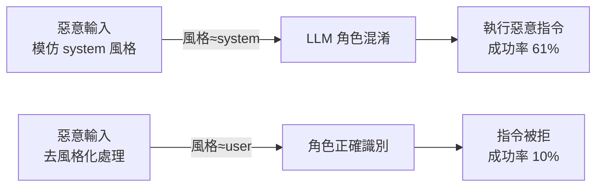
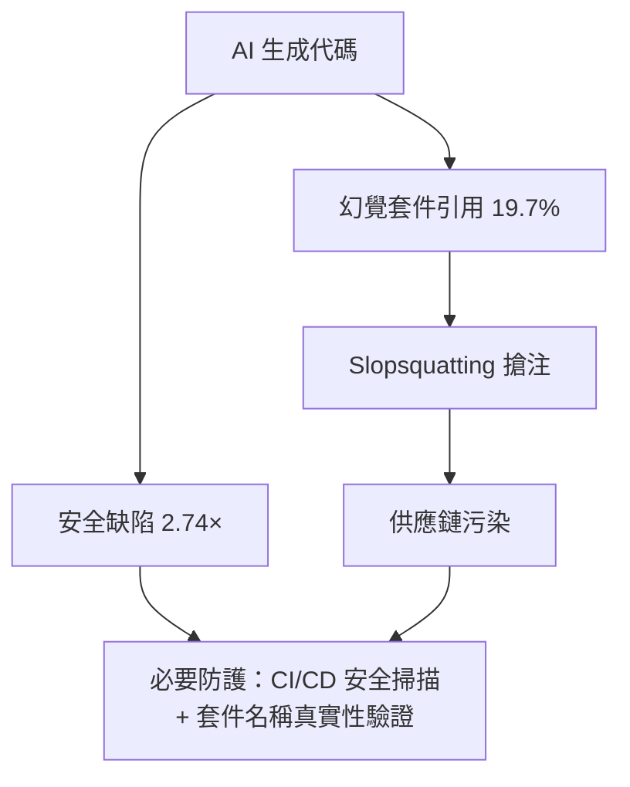

# AI Daily Digest — 2026-06-24

<!-- pipeline-generated:begin -->

## 🔥 今日 TOP 3
### 1. LLM 靠風格而非語義認角色：去風格化讓提示詞注入成功率降九成
Charles Ye 等研究者發現，GPT-OSS-20B 等現代 LLM 無法依據 <system>、<user> 等標籤的真實語義區分信任層級，而是透過文本的書寫風格判斷指令優先順序。攻擊者只需讓惡意輸入模仿系統提示詞的格式語氣，便可讓模型誤認為指令來自特權來源，研究將此現象命名為「角色混淆（role confusion）」。

這項發現揭示了當前提示詞注入防禦的根本盲點：關鍵字過濾、沙箱隔離、Guardrail 層都無法應對風格層面的攻擊。實驗中對文本進行「去風格化（destyling）」後，攻擊成功率從 61% 壓縮至 10%，效果遠超任何內容層面的干預；任何允許用戶輸入影響 system prompt 的 AI 應用都面臨此隱患。

短期可在用戶輸入進入模型前加入去風格化前處理（改寫為中性、非指令式語氣）；中長期需關注「角色感知訓練（role-aware training）」的研究進展，並重新審視現有 AI 應用的信任邊界設計，特別是 RAG pipeline 與 tool-use agent 場景。

📖 [閱讀完整 insight](../10-insights/2026-06-22/inbox_76582eac.md) · 🔗 [原文連結](https://simonwillison.net/2026/Jun/22/prompt-injection-as-role-confusion/#atom-everything)
### 2. AI 代碼安全缺陷率達人工 2.74 倍，幻覺套件名成供應鏈新攻擊向量
多份 2025 年產業報告揭示，AI 生成代碼的安全隱患遠超品質問題：CodeRabbit 數據顯示 AI 代碼的安全發現數是人工代碼的 2.74 倍；Veracode 發現 45% AI 代碼無法通過安全檢查（Java 更高達 72%）；更危險的是 19.7% 的 AI 生成外部套件引用是幻覺產物，攻擊者可搶先在 npm/PyPI 中注冊這些不存在的假包名（稱為 slopsquatting），植入惡意代碼形成供應鏈污染。

與傳統人工代碼相比，AI 生成代碼的最大差異不只是缺陷密度更高，而是開發者對代碼的理解程度更低：40% 的初級開發者直接部署 AI 代碼而不深入理解其邏輯，形成「技能侵蝕 → 審查能力下滑 → 更依賴 AI」的惡性循環。法律面，美國版權局 2025 年 5 月裁定 AI 訓練使用受版權代碼明確侵犯複製權，企業還須承擔額外法律曝險。

實務建議：在 CI/CD 加入 AI 代碼專屬安全掃描，並對所有 AI 建議的外部依賴執行 `npm view` 或 `pip show` 驗證真實性；開發者應將「理解自己部署的每一行代碼」列為不可妥協的底線，尤其是初級工程師。

📖 [閱讀完整 insight](../10-insights/2026-06-23/inbox_f5c7636b.md) · 🔗 [原文連結](https://medium.com/@muktharvortegix/the-dirty-truth-about-ai-generated-code-nobody-is-talking-about-131ccd8a1524?source=rss------claude-5)
### 3. Anthropic IPO 成 AI 地緣政治分水嶺，重塑全球 AI 資本競爭格局
Anthropic（Claude 開發商）的 IPO 計畫不只是資本市場事件，而是規模僅次於 OpenAI 的基礎模型公司首度公開上市，其估值走向將直接成為全球 AI 投資信心的風向標。論者認為，AI 產業正加速從技術競賽轉向地緣政治與資本配置的多維博弈，基礎模型層的資本集中度直接影響各國研究機構與企業的相對競爭力。

AnthropicIPO 若成功，預期將強化美國在基礎模型層面的資本壁壘，並影響中國、歐洲 AI 機構的融資吸引力與估值參照系。對企業 CTO 與 AI 投資布局的實際意義在於：基礎模型市場的勝者可能高度集中，API 服務的長期定價權與服務連續性將向極少數公司匯聚，廠商鎖定風險值得提前評估。

下一步觀察重點包括：Anthropic 的 P/S 倍數如何反映市場對「安全導向 AI」商業可行性的判斷；IPO 後資本是否進一步向 OpenAI/Anthropic 雙極集中；以及歐洲、中國對等基礎模型公司是否加速融資節奏作為回應。

📖 [閱讀完整 insight](../10-insights/2026-06-23/inbox_687f7076.md) · 🔗 [原文連結](https://medium.com/@valpolhovskiy/anthropics-ipo-could-become-a-defining-moment-in-the-global-ai-race-0d1c6344fec9?source=rss------claude-5)

## 📖 好文章 / 影片精選

_過去 30 天經 traffic 沉澱的高品質內容，按興趣領域分類。每篇只在 column 出現一次。_
### 🛠 工具版本追蹤 / Release
- **claude-code** · **[v2.1.187](../10-insights/2026-06-23/inbox_c5c3f476.md)**
  Claude Code v2.1.187 發布，引入多項安全與功能改進。新增 sandbox.credentials 設定以防止沙箱命令存取密鑰檔案和環境變數，強化隔離安全性。修復遠程 MCP 工具呼叫 5 分鐘超時問題，改善系統穩定性。修復結構化輸出中模型無限重複呼叫 StructuredOutput 的缺陷。改進組織層級模型限制、滑鼠選單互動、子代理深度
- **ruflo** · **[v3.14.1 — 4 user-reported bug fixes (#2412, #2422, #2426, #2450)](../10-insights/2026-06-23/inbox_d69cbc1f.md)**
  ruflo v3.14.1 補丁版本修復 4 項用戶報告的關鍵 bug。#2412 修復 pnpm lockfile 漂移導致 CI 5+ 天紅線；#2450 解決 statusline hooks 每次調用冷加載 ONNX 模型（~1s）導致 Claude Code 超時，通過正則擴展捕捉多種 hook 形式；#2426 修正 macOS MCP tool
### 📚 AI 知識管理
- **medium-towards-data-science** · **[Retrieval Is Filtering, Not Search: A Mental Model for Enterprise RAG](../10-insights/2026-06-23/inbox_76783ef4.md)**
  本文提出企業 RAG 的新心智模型，強調檢索應理解為「過濾」而非「搜尋」。文章建議停止字串搜尋，改為對資料框（line_df 和 toc_df）進行過濾操作。核心技術策略為「Pick anchors small, expand context large」——選擇小的錨點、擴展較大的上下文。這個框架針對企業文檔智能場景，優化了 RAG 檢索的效率和精準度，改
### 🏢 企業導入 AI / 團隊實踐
- **infoq-architecture** · **[Anthropic Reports Claude Now Handles 95% of Internal Analytics Queries](../10-insights/2026-06-21/inbox_0ae6506e.md)**
  Anthropic 報告指 Claude 現已處理公司內部約 95% 的分析查詢，員工可獨立查詢業務數據，無須依賴數據團隊。該成果的驅動因素並非模型進展，而是數據治理、語意定義和運營紀律的完善。此案例展示了 LLM 在企業內部應用中，基礎設施和流程設計遠比模型能力本身更決定了成功。對其他企業採用 Claude 進行自助式 BI 具有強參考價值。
- **openai-blog** · **[How GPT-5 helped immunologist Derya Unutmaz solve a 3-year-old mystery](../10-insights/2026-06-23/inbox_5fc9fd1b.md)**
  GPT-5 Pro 在免疫學研究中展現顯著價值，協助免疫學家 Derya Unutmaz 破解困擾 3 年之久的 T 細胞行為謎團。透過深度分析與推理，GPT-5 Pro 提供了關鍵的免疫機制洞察。該科學突破為人類對免疫系統的理解帶來重要進展。相關發現將直接支持癌症與自體免疫疾病的研究與臨床治療開發。此案例展示了大型語言模型在基礎生物醫學研究中的實際應用潛力
### 🎓 AI 使用技巧 / 心法
- **medium-tag-claude** · **[I Was My Company’s #2 Claude Spender in a Week. Here’s How I Cut My Token Bill.](../10-insights/2026-06-23/inbox_d69342cd.md)**
  作者在一周内意外成为公司的第二大 Claude API token 消费者后，分享了如何通过引入 5 个可复用的习惯显著降低 Claude 账单。这些习惯是项目无关的系统性优化，可跨团队和项目推广。文章表明这不是一次性 hacks，而是可长期实施的运营纪律。具体的 5 个习惯内容未在摘要中披露，但标题暗示成本优化空间可能达到数倍。
### 💳 支付 / Fintech
- **medium-tag-llm** · **[The Great American AI Act - Staying Compliant Without Killing Innovation](../10-insights/2026-06-23/inbox_b1e8d723.md)**
  美國推出《大美國 AI 法》，業界正在討論如何在滿足新監管要求的同時維持創新動力。文章指出，許多組織在該法律發布後立即面臨合規疑慮，例如是否需要新增合規人力資源。此法案代表美國 AI 監管框架的重大轉變，企業需要重新評估其合規策略與流程。文章強調應避免過度反應而扼殺創新，需要在兩者之間尋求務實的平衡。
### ⛓️ 區塊鏈 / Web3
- **codex** · **[0.142.0](../10-insights/2026-06-22/inbox_696745cc.md)**
  OpenAI Codex 0.142.0 版本推出多項代理編程與代幣管理功能，增強多代理協作能力。新增 /usage 信用兌換、/plugins 遠程外掛組織（OpenAI 精選/工作區/共享三層結構）、可配置代幣預算追蹤、多代理委託控制（支援禁用/明確請求/主動三模式）、索引網路搜索模式與 UTC 時間提醒等特性。修復 Linux TUI 暫停恢復穩定性、
### 🔐 AI 安全 / 濫用
- **simon-willison** · **[Prompt Injection as Role Confusion](../10-insights/2026-06-22/inbox_76582eac.md)**
  Charles Ye 等人的研究論文發現，現代 LLM（如 GPT-OSS-20B）無法正確區分特權文本（以 <system>、<think>、<assistant> 標籤包裝）與非信任的使用者輸入（<user> 標籤）。研究指出，模型過度依賴文本的**風格**而非實際語義內容，導致攻擊者可利用相似風格的提示詞進行注入攻擊。透過 \"destyling\"（
- **medium-tag-claude** · **[The Dirty Truth About AI-Generated Code Nobody Is Talking About](../10-insights/2026-06-23/inbox_f5c7636b.md)**
  文章揭示 AI 生成代碼的關鍵問題不只是品質，更涉及安全性和技能侵蝕。CodeRabbit 2025 年 12 月分析顯示 AI 代碼的安全缺陷是人工代碼的 2.74 倍；Veracode 發現 45% AI 代碼未過安全檢查（Java 尤甚，72% 失敗率）；41.1% 的安全問題會持續存活。更嚴重的是虛幻包依賴：19.7% AI 生成的包名引用是捏造的，
- **infoq-ai-ml** · **[Article: Understanding ML Model Poisoning: How It Happens and How to Detect It](../10-insights/2026-06-22/inbox_c37e3a6e.md)**
  本文深入探討機器學習模型中毒攻擊的威脅景觀，涵蓋標籤翻轉、後門注入、清潔標籤中毒和梯度操控等多種技術手段。作者回顧了實際事件案例、分析了檢測被污染數據的技術挑戰，並提出實踐性防禦方案、開源工具和運營流程以保護 ML 訓練流程。該綜合指南幫助團隊建立從數據驗證、來源控制到模型監測的多層防護體系。
### 🛤️ AI Flow 導入心得 / 技術分享
- **substack-bytebytego** · **[An Ex-Meta L8’s Agentic Engineering Setup](../10-insights/2026-06-23/inbox_2930344e.md)**
  前 Meta L8 principal engineer Kun Chen 分享 agent 工程設置哲學與工具鏈。核心轉變是從直接寫代碼轉向「像工程經理一樣指揮 agent 團隊」——委派結果而非動作，透過自動化驗證保證品質。基礎設施採終端優先架構：WezTerm（跨平台一致性）、Claude Code 和 OpenCode（避免廠商鎖定）、Neovim 
- **simon-willison** · **[Porting the Moebius 0.2B image inpainting model to run in the browser with Claude Code](../10-insights/2026-06-22/inbox_b7f80298.md)**
  Simon Willison 使用 Claude Code 將 Moebius 0.2B 圖像修復模型（原本需 PyTorch + NVIDIA CUDA）轉換至 ONNX 格式並透過 WebGPU 在瀏覽器執行。完整工作流包括：(1) 使用 Claude 進行初步可行性研究，(2) Claude Code 自動完成模型轉換，(3) 發布 1.24GB 轉換

## 💡 今日 Takeaway

_讀完今日所有內容後，可帶走的知識點_
### 1. LLM 提示詞注入防禦應在文字風格層介入，而非只靠關鍵字過濾
LLM 透過書寫風格而非標籤語義識別指令優先級，使得傳統關鍵字過濾與沙箱隔離對「風格模仿攻擊」幾乎無效。在用戶輸入進入模型前進行去風格化（改寫為中性語氣），可將提示詞注入成功率從 61% 壓縮至 10%。設計 AI 應用安全架構時，應將風格層分析納入威脅模型，並考慮以 destyling 作為 input preprocessing 的標準步驟。

_類型：framework_

**參考來源**：
- [Prompt Injection as Role Confusion](../10-insights/2026-06-22/inbox_76582eac.md) · [原文](https://simonwillison.net/2026/Jun/22/prompt-injection-as-role-confusion/#atom-everything)
### 2. AI 幻覺套件引用率達 19.7%，slopsquatting 供應鏈攻擊需在 CI 層攔截
AI 生成代碼中近兩成的外部套件名稱根本不存在，攻擊者可搶先在公開倉庫注冊這些假名稱並植入惡意代碼（slopsquatting）。在 CI/CD 流程加入套件真實性驗證步驟（如 `pip show`、`npm view`）是防止此類供應鏈污染的最低防線。此風險不依賴特定模型版本，適用於所有使用 AI 輔助編碼的開發團隊，且應成為 code review checklist 的固定項目。

_類型：data-point_

**參考來源**：
- [The Dirty Truth About AI-Generated Code Nobody Is Talking About](../10-insights/2026-06-23/inbox_f5c7636b.md) · [原文](https://medium.com/@muktharvortegix/the-dirty-truth-about-ai-generated-code-nobody-is-talking-about-131ccd8a1524?source=rss------claude-5)
### 3. 訓練式協調層（Learned Orchestrator）比單模型擴展更省成本且更具供應商韌性
透過訓練讓協調器學習何時路由至哪個專家模型，可在不追加大規模訓練投資的前提下提升整體系統能力，同時提供供應商獨立性——任一 API 中斷時自動路由至備選方案。相比硬編碼路由規則，trained orchestrator 的決策品質可隨數據積累持續提升，而單純擴大單一模型規模則需要每次都投入全額算力成本。在多模型系統設計初期就將協調層列為一級元件，可同時解決能力擴展與業務連續性問題。

_類型：framework_

**參考來源**：
- [Orchestration Is the New Parameter Count — Fugu and the future of AI](../10-insights/2026-06-23/inbox_f979b0ff.md) · [原文](https://medium.com/@ChristopherMeredith/orchestration-is-the-new-parameter-count-fugu-and-the-future-of-ai-8fc31cc57695?source=rss------claude-5)
### 4. 對 AI Agent 指定期望結果而非具體步驟，才能啟用真正的自主長任務執行
要求 agent 執行「重命名這些變數」等具體動作，會讓模型僅完成字面任務；改為指定「確保整個代碼庫命名規範一致」等 outcome 並說明目的（why），agent 才能自主制定計畫、處理邊緣案例，並在歧義時做出符合期望的判斷。此原則適用於所有 long-horizon agent 任務，是避免 context 崩塌與頻繁人工接管的根本方法，也是從「工具使用者」轉型為「agent 指揮者」的核心心智模型轉變。

_類型：framework_

**參考來源**：
- [An Ex-Meta L8’s Agentic Engineering Setup](../10-insights/2026-06-23/inbox_2930344e.md) · [原文](https://blog.bytebytego.com/p/an-ex-meta-l8s-agentic-engineering)
### 5. 多 LLM Provider 同時中斷引發的級聯失敗無法自動恢復，需提前設計隔離機制
當多個 LLM Provider API 同時故障時，系統進入重試堆積 → 延遲劇增 → 無法自動恢復的級聯狀態，必須人工介入才能恢復服務。為每個模型依賴設置獨立的電路斷路器（circuit breaker）、降級策略（如返回緩存結果或切換輕量模型）和超時隔離，可有效阻斷故障蔓延至整個依賴鏈。此韌性設計應在系統選型初期規劃，而非等到生產中斷後亡羊補牢。

_類型：pattern_

**參考來源**：
- [Handling Multi-Model API Outages Without Melting Production](../10-insights/2026-06-23/inbox_18b527e3.md) · [原文](https://medium.com/@sebuzdugan/handling-multi-model-api-outages-without-melting-production-965f70d4c99a?source=rss------large_language_models-5)

<!-- pipeline-generated:end -->

<!-- user-notes -->
<!-- Write your own notes below; pipeline never touches this section. -->