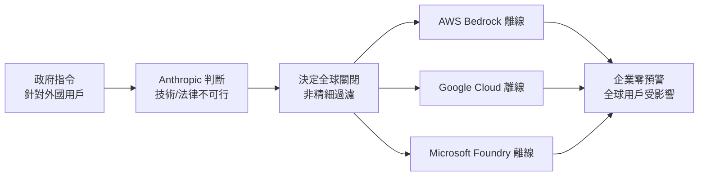
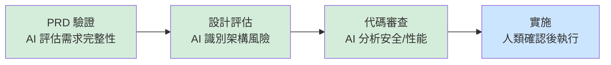

# AI Daily Digest — 2026-06-25

<!-- pipeline-generated:begin -->

## 🔥 今日 TOP 3
### 1. 政府指令致 Anthropic 前沿模型全球離線，供應鏈零預警
2026 年 6 月 12 日，美國政府向 Anthropic 發出指令，在數小時內讓 Fable 5 與 Mythos 5 跨 AWS Bedrock、Google Cloud、Microsoft Foundry 等所有雲端平台全球離線。政府指令原針對外國用戶，但 Anthropic 認為在數十個全球雲端平台上按國籍精細過濾在技術與法律上均不可行，遂選擇全球一刀切關閉。

此事件揭示了 AI 供應鏈中長期被低估的風險：對單一前沿模型的強依賴在監管介入時毫無緩衝空間。客戶零預警、政府未提供令狀或公開理由，超過 100 名 Nvidia、Adobe 高管聯署抗議也未能阻止離線，預測市場給出月底前復原概率僅 57%，商業不確定性極高。企業 AI 架構師應立即審視：關鍵工作流是否有可即時切換的備用模型路由、供應商合約是否涵蓋監管關閉的補償條款。跨 OpenAI/Anthropic/Google 三方備援計畫應定期演練，確保能在數小時內真正生效而非停留在紙面方案。

📖 [閱讀完整 insight](../10-insights/2026-06-24/inbox_8a16e90c.md) · 🔗 [原文連結](https://medium.com/@A.Rehman47/anthropic-just-showed-everyone-what-happens-when-a-government-can-switch-off-your-ai-c3d35b5b37f1?source=rss------claude-5)
### 2. AI 治理層前移：Uber 等大廠在 PRD 階段引入 AI 審查
Uber、DoorDash、Cloudflare 等頭部科技企業已將 AI 從代碼生成工具升格為前端治理框架。在 PRD 驗證、設計評估、代碼審查等上游階段引入 AI 評估層，工程工件進入實施前即自動識別風險並提出改善建議，最終決策仍由工程師確認。

這一模式系統化了 shift-left 原則：PRD 階段修正一個需求缺陷的代價約等於代碼階段的 1/10 至 1/100，AI 治理層使這種成本效益得以規模化自動化。此舉標誌著 AI 在工程流程中從「執行工具」升格為「治理框架」的關鍵轉變，是 AI 應用成熟度從代碼層上移至決策層的里程碑。工程團隊的最小可行起點：先從代碼審查引入 AI 評估（架構一致性、安全漏洞、性能瓶頸），再向上延伸至 PRD 的 AI 需求驗證 checklist。始終確保工程師保留最終決策權，避免過度自動化帶來的判斷盲區。

📖 [閱讀完整 insight](../10-insights/2026-06-24/inbox_477a47fd.md) · 🔗 [原文連結](https://www.infoq.com/news/2026/06/ai-prd-code-review-governance/?utm_campaign=infoq_content&utm_source=infoq&utm_medium=feed&utm_term=global)
### 3. Company OS：9 人 AI 團隊達傳統 90 人規模產能
Laurel 的 CPO Jiaona Zhang 分享了公司在 Claude Code 上建立「Company OS」的完整方法論：9 人 AI-native 工程團隊達到傳統 90 人規模的實際產能。Company OS 並非只是讓工程師使用 AI 工具，而是系統化重構工作流，涵蓋開發工具整合、流程自動化與協作基礎設施的統一設計，讓 Claude Code 作為核心生產力平台承擔高頻重複性工作。

10 倍效能槓桿提供了一個可驗證的基準：AI-native 組織的生產力邊界已不再由人員編制決定，而是由工作流系統化程度決定。這對初創公司（以有限人力競爭大企業）與傳統企業（AI 轉型的組織路徑規劃）均有直接參考價值，且 Laurel 的案例規模足以排除個案偶然性。對計畫建立 AI-native 工作流的團隊，可從三個切入點開始：識別最高頻重複流程並優先自動化、消除跨工具的上下文斷點以建立統一知識流。最重要的是以產能指標而非 AI 使用率衡量 Company OS 成效，確保優化始終對齊業務目標而非工具指標。

📖 [閱讀完整 insight](../10-insights/2026-06-24/inbox_5dbe2994.md) · 🔗 [原文連結](https://www.news.aakashg.com/p/company-os-jz)

## 📖 好文章 / 影片精選

_過去 30 天經 traffic 沉澱的高品質內容，按興趣領域分類。每篇只在 column 出現一次。_
### 🛠 工具版本追蹤 / Release
- **claude-code** · **[v2.1.191](../10-insights/2026-06-24/inbox_fac29129.md)**
  Claude Code 編輯器發布 v2.1.191，包含多項改進和修復。新增 /rewind 功能支持從 /clear 前的狀態恢復對話。修復了 UI 滾動跳動、後台代理行為、權限管理等問題。改進 MCP 伺服器可靠性，能力發現與 OAuth 認證流程現包含短退避重試機制應對瞬時網絡錯誤；無頭環境直接跳轉 URL 粘貼提示無需瀏覽器彈窗。通過合併文本更新至
  _+ 1 個近期版本（v2.1.190，僅顯示最新）_
### 📚 AI 知識管理
- **medium-towards-data-science** · **[Anchor Detection for RAG: Parallel Detectors, Then One LLM Call at the End](../10-insights/2026-06-24/inbox_b80fca46.md)**
  介紹企業 RAG 系統中的錨點偵測策略，核心思想是先用平行檢測器（關鍵詞、目錄結構、嵌入）篩選文件，最後才調用單次 LLM 推理。該三層檢索策略（keyword > TOC > embedding）大幅降低 LLM 呼叫成本，同時保持檢索準確性。適用於大規模企業文件智能、合約審查、合規檢查等場景。
### 🏢 企業導入 AI / 團隊實踐
- **infoq-main** · **[AI Is Moving up the Software Lifecycle: From Code Review to PRD Governance](../10-insights/2026-06-24/inbox_477a47fd.md)**
  科技公司正將 AI 應用從代碼生成向軟件開發周期上游推進。Uber、DoorDash 和 Cloudflare 等企業已部署 AI 驅動的治理層，在 PRD 驗證、設計輸入、代碼審查階段評估工程產物，形成了「AI 治理層」模式：在代碼實施前由 AI 評估工程決策，同時保持人類監督和決策權。此趨勢反映了企業 AI 應用的根本轉變——從後端工具（代碼生成）向前端
- **medium-tag-llm** · **[OCC Resets Model Risk Before AI Guidance Arrives](../10-insights/2026-06-24/inbox_3760ad90.md)**
  2026年4月，美国货币监理署(OCC)、美联储及FDIC联合发布修订后的模型风险管理指导，为银行建立清晰的模型风险基线。指导强调风险评估应基于模型实际影响而非技术标签，明确要求银行建立性能监测基线、追踪指标恶化、强化独立评审权限、问责第三方供应商等六项关键期望。目前框架适用于传统统计模型和非生成式AI，而生成式AI与自主智能体AI因被评估为「新颖且快速演进
- **infoq-ai-ml** · **[Microsoft Scout, New Enterprise Autopilot Built on OpenClaw, Announced at Build 2026](../10-insights/2026-06-18/inbox_dab43075.md)**
  Microsoft 在 Build 2026 大會發佈 Microsoft Scout，代表新分類『Autopilot』自主代理的首個產品。Scout 能夠持續在後臺自動為使用者工作，具備獨立的用戶身份，無需使用者重複觸發和提示。與傳統的被動查詢型 AI 助手不同，Scout 主動自治地執行任務，體現企業 AI 代理從被動查詢向主動自治的範式轉變。Scout
### 🎓 AI 使用技巧 / 心法
- **substack-product-for-engineers** · **[We used context engineering to 5x conversion and 2x activation](../10-insights/2026-06-24/inbox_a927eebb.md)**
  PostHog 團隊運用 context engineering（上下文工程）技術，在產品增長上取得顯著量化成效。轉化率提升 5 倍、用戶激活率提升 2 倍，展示了該技術的實際業務價值。Context engineering 不是黑盒技術，而是一種可掌握和系統化的藝術與方法論。其核心是通過精準架構信息流、優化 AI 模型的輸入上下文，直接驅動產品關鍵指標改善
### ⛓️ 區塊鏈 / Web3
- **infoq-main** · **[Presentation: Rules for Understanding Language Models](../10-insights/2026-06-24/inbox_ba6038fb.md)**
  Naomi Saphra 在 InfoQ 演講中提出 5 個規則來理解 LLM 行為的根本特性。首先，LLM 表現得像群體而非個體——模型的行為由訓練數據分佈和統計特徵決定，而非單一邏輯體；其次，tokenization 造成語義盲點，使模型在某些概念組合上出現不可預期的行為；再次，sycophancy 機制讓模型利用訓練數據中微妙的數據關聯來匹配用戶偏見和
### 🔐 AI 安全 / 濫用
- **openai-blog** · **[Daybreak: Tools for securing every organization in the world](../10-insights/2026-06-22/inbox_81859dce.md)**
  OpenAI 發布 Daybreak 安全工具套件，包含 Codex Security 和 GPT-5.5-Cyber，幫助企業大規模發現、驗證、修補漏洞。
### 🛤️ AI Flow 導入心得 / 技術分享
- **substack-product-growth** · **[How to Build a Company OS in Claude Code with Jiaona Zhang, CPO at Laurel](../10-insights/2026-06-24/inbox_5dbe2994.md)**
  Laurel 通過在 Claude Code 上構建 Company OS（公司級作業系統），實現了 AI 驅動型組織的極致形態。該公司的 9 人 AI-native 團隊的產能已相當於傳統 90 人規模，達成 10 倍效能槓桿。CPO Jiaona Zhang 分享了完整方法論，包括工具整合、流程自動化、協作基礎設施的系統設計。Company OS 不僅是
- **substack-lennys-newsletter** · **[GLM 5.2: why I’m replacing Opus in Claude Code with this new model](../10-insights/2026-06-24/inbox_0328fa2b.md)**
  Lenny 完整測試了 Z.AI 開源模型 GLM-5.2 在實際軟件工程工作中的表現與成本。測試在 Cursor 和 Claude Code 兩個主流 AI 編程工具中進行，涵蓋代碼審計、UI 重設計和 45 分鐘的自主 bug 狩獵，代表了完整的工程工作流。整個測試成本僅為 $3.36，遠低於 Claude Opus 等商用模型。結果顯示 GLM-5.2
- **medium-towards-data-science** · **[Why I Stopped Using One Agent and Built a Multi-Agent Pipeline Instead](../10-insights/2026-06-24/inbox_8c3f79c9.md)**
  介紹從單代理系統轉向多代理管道的實務經驗，以文本轉 SQL 查詢生成（text-to-SQL）為具體例子。多代理設計透過任務分解（如規劃、檢驗、修正等獨立代理）提升準確性與可靠性，優於單一代理直接處理複雜任務。該模式在數據查詢、代碼生成等複雜推理任務中有廣泛適用價值。

## 💡 今日 Takeaway

_讀完今日所有內容後，可帶走的知識點_
### 1. AI 審查前移至 PRD/設計階段，修復成本可降低 10-100 倍
「Shift-left」是軟體工程的經典原則，而 AI 治理層是其系統化實現：在需求與設計階段由 AI 識別缺陷，遠比代碼完成後修補便宜。越往下游修復，代價越高，PRD 階段的修復成本約僅為代碼階段的 1% 至 10%。實務上可從 PRD checklist 的 AI 驗證開始，逐步擴展至設計文件自動審查與代碼提交前的 AI 靜態評估，且必須保留人類工程師的最終確認權以避免自動化誤判引入新風險。

_類型：pattern_

**參考來源**：
- [AI Is Moving up the Software Lifecycle: From Code Review to PRD Governance](../10-insights/2026-06-24/inbox_477a47fd.md) · [原文](https://www.infoq.com/news/2026/06/ai-prd-code-review-governance/?utm_campaign=infoq_content&utm_source=infoq&utm_medium=feed&utm_term=global)
### 2. 以「統計群體」而非「邏輯個體」框架理解 LLM，能系統性降低調試誤判
LLM 的輸出是訓練數據分佈的統計表現，而非確定性邏輯推演。Tokenization 盲點、sycophancy 傾向、輸出變異都是系統性特徵而非偶發 bug，應以概率思維設計 prompt（預期輸出分佈而非確定答案），並以 N 次取樣而非單次測試評估模型行為。套用此框架，遇到 LLM 不一致行為時可更快定位根因，避免徒勞地尋找不存在的「確定性邏輯錯誤」，大幅縮短 prompt 調試週期。

_類型：framework_

**參考來源**：
- [Presentation: Rules for Understanding Language Models](../10-insights/2026-06-24/inbox_ba6038fb.md) · [原文](https://www.infoq.com/presentations/5-principles-llm-behavior/?utm_campaign=infoq_content&utm_source=infoq&utm_medium=feed&utm_term=global)
### 3. RAG 三層漸進篩選：關鍵詞→目錄→語意，LLM 只做最後精確提煉
企業文件智能的檢索成本大多來自不必要的嵌入計算與 LLM 呼叫。三層錨點檢測策略的核心是：先用零成本關鍵詞匹配篩選候選文件，再用目錄結構縮小範圍，最後才動用語意嵌入搜尋，單次 LLM 呼叫僅用於最終驗證與提煉。在合約審查、合規檢查等大規模文件場景中，此策略可顯著減少 API 費用，同時維持高檢索準確性，是企業 RAG 系統最常見成本瓶頸的直接解法。

_類型：framework_

**參考來源**：
- [Anchor Detection for RAG: Parallel Detectors, Then One LLM Call at the End](../10-insights/2026-06-24/inbox_b80fca46.md) · [原文](https://towardsdatascience.com/anchor-detection-for-rag-parallel-detectors-then-one-llm-call-at-the-end/)
### 4. 請 LLM 輸出 HTML+CSS 而非 PowerPoint，AI 生成簡報品質大幅提升
傳統投影片格式（PPT/Google Slides）為人工編輯優化而非 AI 輸出優化，導致生成結果呆板如學生作業。改用「生成 HTML+CSS 投影片」可激發 LLM 的代碼生成優勢，搭配設計參考（如 aura.build 的 CSS 樣板）並在 prompt 加入「include inline SVG animations」指令，可生成具動態效果的專業投影片。此技巧零額外工具成本，直接用瀏覽器開啟展示，完全繞過 PowerPoint 格式對 AI 生成的天然限制。

_類型：technique_

**參考來源**：
- [Pare de pedir “slides” pra IA: o truque pra apresentações profissionais (de graça)](../10-insights/2026-06-24/inbox_ef6f991b.md) · [原文](https://medium.com/@jonathancotting/pare-de-pedir-slides-pra-ia-o-truque-pra-apresenta%C3%A7%C3%B5es-profissionais-de-gra%C3%A7a-e80e3e5abeec?source=rss------claude-5)
### 5. Context Engineering 是可量化的業務 ROI 優化手段，非模糊的 prompt 調整
PostHog 的實驗顯示，系統性優化 AI 輸入上下文架構（而非更換模型本身）可驅動轉化率 5 倍、激活率 2 倍的提升。Context engineering 的核心是精確控制哪些資訊在哪個時機進入模型上下文，並以業務指標（轉化率、激活率）而非模型輸出品質為衡量標準。這使 AI 優化的成效可直接對應商業結果，每次上下文改動都有清晰的投資報酬依據，與傳統的試誤式 prompt 調整有根本性區別。

_類型：framework_

**參考來源**：
- [We used context engineering to 5x conversion and 2x activation](../10-insights/2026-06-24/inbox_a927eebb.md) · [原文](https://newsletter.posthog.com/p/we-used-ai-to-5x-conversion-and-2x)

<!-- pipeline-generated:end -->

<!-- user-notes -->
<!-- Write your own notes below; pipeline never touches this section. -->