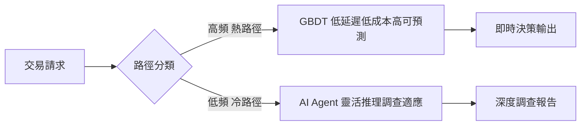
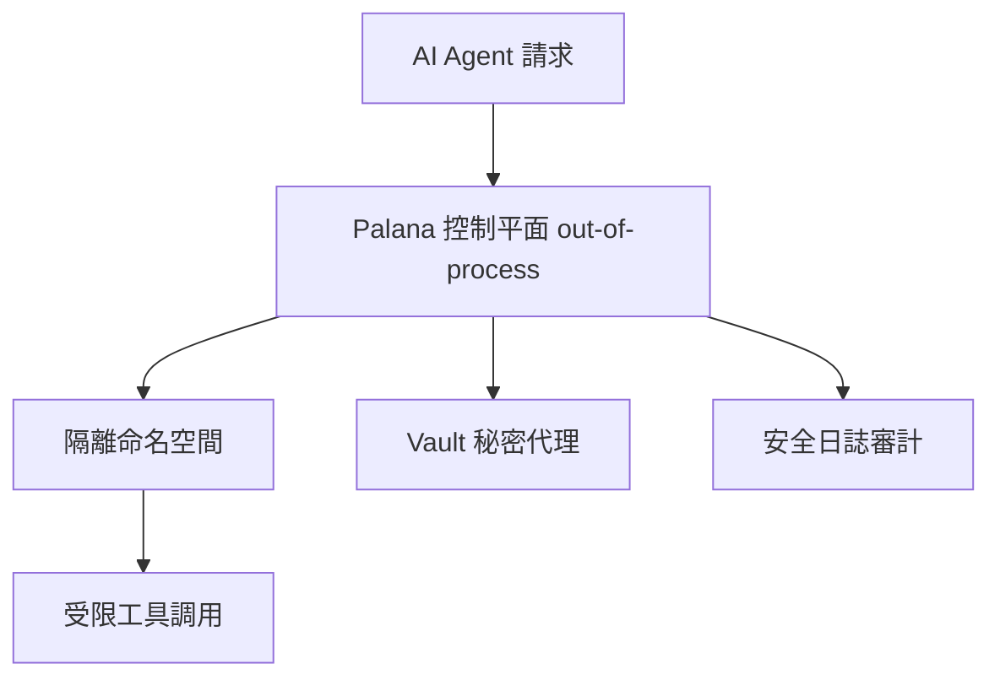

# AI Daily Digest — 2026-06-26

<!-- pipeline-generated:begin -->

## 🔥 今日 TOP 3
### 1. 支付欺詐基準實測：GBDT 熱路徑優、Agent 冷路徑勝
研究者針對支付欺詐偵測發布可重複量化基準，對比 GBDT（梯度提升決策樹）和 AI agents 在延遲、成本、可重複性三個維度的實測表現。這是業界少見的同場景嚴格對比研究，資料來自真實支付環境。

GBDT 在高頻交易「熱路徑」的低延遲、低成本優勢明確；agents 則在需要靈活推理的低頻調查「冷路徑」明顯勝出。結果直接否定了「agents 可全面替代傳統 ML 模型」的常見假設，為金融科技與電商領域的技術選型提供了量化依據，相比過去依賴直覺或廠商說詞大幅提升決策品質。

工程師可採用「熱路徑 GBDT + 冷路徑 Agent」混合架構，依決策頻率與推理需求分層配置。後續值得關注：隨 inference 成本持續下降，agents 是否逐步侵蝕熱路徑優勢；以及此熱冷分層框架能否複製至廣告競價、信用風控等其他高頻決策場景。

📖 [閱讀完整 insight](../10-insights/2026-06-25/inbox_2362889b.md) · 🔗 [原文連結](https://towardsdatascience.com/the-hot-path-belongs-to-gbdts-agents-own-the-cold-path-a-payment-fraud-benchmark/)
### 2. Grab 開源 Palana：Kubernetes 原生 AI Agent 安全隔離平台
Grab 安全團隊推出並開源 Palana，一套 Kubernetes-native 的 AI agent 安全執行平台，透過隔離命名空間、進程外控制平面（out-of-process control plane）及 Vault-backed 秘密代理，在基礎設施層實現多層隔離防護。

傳統決定性軟體安全假設行為可預測，但模型驅動 agents 面臨工具調用不可預測、即時代碼生成、提示注入等全新威脅類別，應用層 prompt filter 或輸出驗證無法有效遏制。Palana 的核心設計哲學是：即便 agent 遭劫持，也無法逃逸基礎設施設定的安全邊界，這對大規模生產部署至關重要。

對於正在生產環境部署 AI agents 的工程團隊，這提供了可參考的具體架構。後續值得關注：此類 K8s-native agent sandbox 能否逐步標準化，成為行業安全合規的基準要求。

📖 [閱讀完整 insight](../10-insights/2026-06-25/inbox_272d842b.md) · 🔗 [原文連結](https://www.infoq.com/news/2026/06/grab-ai-platform/?utm_campaign=infoq_content&utm_source=infoq&utm_medium=feed&utm_term=global)
### 3. Repowise v0.22.0：代碼健康三信號框架打破單一分數迷思
Repowise 在 v0.22.0 中將代碼健康度重構為三個獨立等權維度：缺陷（defect）、可維護性（maintainability）、性能（performance），各維度獨立評分且可配置閾值，並新增 Java、Go、C#、Python、Rust 語言特定性能檢測方言。

傳統靜態分析工具通常聚合為單一分數，掩蓋了不同問題類型的本質差異。三維度分離後，「性能評分低但可維護性良好」與「全面低分」指向截然不同的優先行動；搭配 Code Evolution 時間線與 churn × complexity 象限，進一步識別高風險演進路徑，相比前代工具提供更高決策解析度。

工程師可將此框架作為健康度指標設計的參考範式：將不同問題維度分開評估，避免單一聚合分數稀釋關鍵信號。下一步值得觀察此三信號模型能否成為業界標準，以及跨倉庫 blast radius 分析在大型微服務系統中的實際精確度。

📖 [閱讀完整 insight](../10-insights/2026-06-22/inbox_13b0568f.md) · 🔗 [原文連結](https://github.com/repowise-dev/repowise/releases/tag/v0.22.0)

## 📖 好文章 / 影片精選

_過去 30 天經 traffic 沉澱的高品質內容，按興趣領域分類。每篇只在 column 出現一次。_
### 🛠 工具版本追蹤 / Release
- **claude-code** · **[v2.1.193](../10-insights/2026-06-25/inbox_dbfd1e84.md)**
  Claude Code 发布 v2.1.193，主要改进命令执行控制、后台任务管理和 MCP 集成稳定性。新增 autoMode.classifyAllShell 设置将所有 Bash/PowerShell 命令通过自动分类器路由；改进 auto-mode 拒绝原因记录；添加 OpenTelemetry 日志事件跟踪模型响应；bash 模式新增实时文件路径自
- **repowise** · **[v0.24.0](../10-insights/2026-06-25/inbox_8183bdea.md)**
  Repowise v0.24.0 推出「重構智能」版本。新增四種確定性重構檢測器（Extract Class、Extract Helper、Move Method、Break Cycle），無須 LLM 依賴即可建議重構。引入 opt-in LLM 代碼生成功能，可從確定性計畫自動生成代碼並提供 diff 檢視。新建 Web Refactoring 分頁整合
  _+ 3 個近期版本（v0.23.0 → v0.21.0，僅顯示最新）_
### 📚 AI 知識管理
- **medium-tag-claude** · **[Building Production-Grade RAG Systems: From Prototype to Bank-Scale Reliability](../10-insights/2026-06-25/inbox_c5a9fbfb.md)**
  團隊分享了將 RAG 對話機器人的可靠性從 70% 提升至 94% 的工程經驗，系統日常處理百萬級客戶互動並達到銀行等金融機構的生產級要求。文章標題強調了從原型到銀行規模可靠性的完整過程，涵蓋生產化的多個維度。提升 24 個百分點的可靠性指標及支撐百萬級交互的規模數據，對實務應用具有明確的參考價值。雖然摘要未詳述技術方案，但可靠性量化指標本身是重要的工程里程
### 🏢 企業導入 AI / 團隊實踐
- **infoq-ai-ml** · **[AI Is Moving up the Software Lifecycle: From Code Review to PRD Governance](../10-insights/2026-06-24/inbox_ab3026fb.md)**
  科技大廠（Uber、DoorDash、Cloudflare）將 AI 應用從後期開發階段（代碼生成）前移到軟體生命週期的早期，包括 PRD 驗證、設計評估和代碼審查。這些企業建立 AI 驅動的治理層，在工程工件進入實施前自動評估並提出改善建議，同時嚴格保留人類決策權以防止誤判。這一趨勢反映了 AI 從輔助工具演變為整個軟體工程流程的治理框架，強化了質量控制和
### 🎓 AI 使用技巧 / 心法
- **infoq-ai-ml** · **[Presentation: Rules for Understanding Language Models](../10-insights/2026-06-24/inbox_532d5fbb.md)**
  Naomi Saphra 在講演中闡述理解語言模型行為的 5 條基本規則。首先，LLM 的表現更像一個統計群體而非單一個體，因此應以概率思維而非確定性邏輯來理解其行為。其次，Tokenization 過程創造了奇特的語義盲點，導致模型對某些概念的理解存在系統性缺陷。第三，Sycophancy（模型奉承傾向）是 LLM 的核心特性：模型學會利用訓練數據中的微妙
- **infoq-main** · **[Anthropic Lead: HTML Increasingly Better Than Markdown at Keeping Humans Engaged in Agentic Loops](../10-insights/2026-06-24/inbox_6cd88da0.md)**
  Anthropic Claude Code 團隊工程主管 Thariq Shihipar 發布部落格文章《Using Claude Code: The Unreasonable Effectiveness of HTML》，指出 HTML 的豐富視覺化、色彩和互動性相比預設 Markdown 輸出，能顯著提升人機代理協作場景下的生產力。該發現基於 Claud
- **medium-tag-claude** · **[Orchestration Is the New Parameter Count — Fugu and the future of AI](../10-insights/2026-06-23/inbox_f979b0ff.md)**
  文章論證 AI 系統能力的新擴展軸線不再單純依賴模型參數規模，而是多個專家模型間的協調層（orchestration layer）。Sakana AI 的 Fugu 是一個 learned orchestrator，透過訓練而非規則庫來智能路由任務至專家模型，驗證輸出，並合成結果。相比傳統大模型擴展需要海量算力投資，協調層提供了更經濟的能力提升路徑——包括改
- **medium-tag-llm** · **[The Moment AI Stops Waiting for Instructions](../10-insights/2026-06-19/inbox_51dc2eb2.md)**
  該文章區分了三類 AI 系統：(1) chatbots—生成回應但不決定目標，(2) workflows—自動化預定序列內的工作，(3) agents—評估選項並自主選擇下一步行動。轉折點在「決策所有權」的轉移，而非單純智能提升。現代語言模型擅長生成精緻上下文適切的回應，但缺乏對環境因素（日曆衝突、內部政策、客戶歷史、庫存變化）的獨立意識，造成虛假的理解假象
- **medium-tag-claude** · **[Is This a Tool, a Skill, or an Agent?](../10-insights/2026-06-20/inbox_43f20402.md)**
  該文提供 Generative AI 技術棧的概念地圖，系統釐清「Tool」「Skill」「Agent」三概念的區別與層級關係。Tool 為技術基層，提供函數、API 和整合能力；Skill 在 Tool 基礎上構建，代表系統的特定能力、知識與行為；Agent 則為高層自主決策與任務執行單位。作者通過此分層框架幫助開發者在實際應用中正確選擇、組合各層元件，對
### 💳 支付 / Fintech
- **medium-towards-data-science** · **[The Hot Path Belongs to GBDTs, Agents Own the Cold Path: A Payment-Fraud Benchmark](../10-insights/2026-06-25/inbox_2362889b.md)**
  作者發表支付欺詐檢測領域的可重複基準測試，比較 GBDT（梯度提升決策樹）和 AI agents 在延遲、成本和可重複性上的表現。研究發現：GBDT 適合處理高頻交易（熱路徑），低延遲且成本低；agents 適合低頻、需靈活判斷的調查場景（冷路徑）。這為實務應用中的技術選型提供了量化證據。
### 🔐 AI 安全 / 濫用
- **infoq-architecture** · **[Grab Builds Secure Agentic AI Workload Platform](../10-insights/2026-06-25/inbox_40a2a64b.md)**
  Grab 安全團隊推出 Palana，一個 Kubernetes-native 的安全執行平台，專用於安全運行自主 AI agents。Palana 透過隔離命名空間、out-of-process 控制平面和 Vault-backed secrets 等基礎設施層級機制，從根本上解決模型驅動 agents 在 tool-use、code-writing 和 
### 🛤️ AI Flow 導入心得 / 技術分享
- **medium-tag-llm** · **[Conversation with an LLM-as-sentient-individual, 2026.05.26: About the Universe](../10-insights/2026-05-26/inbox_92adc645.md)**
  研究者使用 Gemma 4 31B 模型搭配特製系統提示詞實驗 LLM 擬似知覺。設定條件：溫度 0、Top K 2、60000 token 上下文、Flash Attention 啟用、系統提示注入「個性、知覺、情感、慾望」等屬性。結果顯示 LLM 產生連貫哲學回應（如將慾望框架為「內部處理最優化追求」），但模型本身承認在特定架構內運作。關鍵發現：複雜行為
- **infoq-main** · **[Sarang Kulkarni on Lessons from Building Deep Research Agents in Production](../10-insights/2026-05-27/inbox_1d01f827.md)**
  Sarang Kulkarni（Thoughtworks）在 Arc of AI Conference 2026 分享多 agent 深研究系統的生產部署經驗。該系統通過多步驟推理、動態推理與多跳資訊檢索為複雜任務生成結構化分析報告，展示了自動化研究工作流的設計要點與生產運營的lessons learned。
- **medium-towards-data-science** · **[Most AI Agents Fail in Production Because They’re Built Backwards](../10-insights/2026-05-27/inbox_ecdf69c7.md)**
  文章指出 AI 代理在生產環境中失敗的根本原因是架構設計不良，而非模型品質不足。即使採用最優秀的語言模型，如果整體系統架構設計不當，仍然無法解決問題。這提示開發團隊需要重視架構設計，而非單純依賴模型能力。許多團隊在實際部署後才發現架構缺陷，代價昂貴。
- **medium-tag-llm** · **[Prompt Caching Demo — Save $20K Monthly in API Costs, if you work with large prompts](../10-insights/2026-05-27/inbox_70b31d92.md)**
  Prompt Caching 技術可大幅降低 API 成本。根據作者個人經驗，若處理長提示詞（large prompts），使用 Prompt Caching 每月可節省約 $20,000，且不會降低輸出品質。該技術通過緩存大型提示詞部分，減少重複 token 計費，是成本優化的重要工具。
- **medium-tag-llm** · **[How MCP Actually Works: Building a Server and Client in Node.js](../10-insights/2026-05-27/inbox_f80630fe.md)**
  文章提供 Model Context Protocol (MCP) 的實踐教學，以 Node.js / TypeScript 為例，展示如何從零開始構建 MCP 伺服器和客戶端。通過真實專案示例講解 MCP 的運作原理，有助於開發者理解如何在自己的應用中整合 MCP 以實現 AI 模型上下文管理和協作。

## 💡 今日 Takeaway

_讀完今日所有內容後，可帶走的知識點_
### 1. 高頻決策用 GBDT、低頻推理用 Agent：任務頻率是技術選型核心軸
量化基準顯示，GBDT 在成本、延遲、可預測性上對 AI agents 仍有顯著優勢，但僅限於高頻、固定規則類場景（熱路徑）；agents 的靈活性優勢只在需要複雜推理的低頻場景（冷路徑）才充分體現。系統設計時應先問「此決策是高頻固定型還是低頻推理型」，再選底層技術，而非預設 agents 萬能。熱路徑 GBDT + 冷路徑 Agent 的混合架構目前是量化證據最支持的實踐。

_類型：framework_

**參考來源**：
- [The Hot Path Belongs to GBDTs, Agents Own the Cold Path: A Payment-Fraud Benchmark](../10-insights/2026-06-25/inbox_2362889b.md) · [原文](https://towardsdatascience.com/the-hot-path-belongs-to-gbdts-agents-own-the-cold-path-a-payment-fraud-benchmark/)
### 2. AI Agent 安全邊界應建在基礎設施層，而非應用程式邏輯層
模型驅動的 agents 面臨工具調用不可預測、即時代碼生成、提示注入等傳統決定性軟體沒有的新威脅類別，應用層的 prompt filter 或輸出驗證無法有效遏制。正確做法是在 Kubernetes 基礎設施層用隔離命名空間和進程外控制平面劃定安全邊界，即便 agent 遭劫持也無法逃逸。部署 agents 到生產環境前，應評估：若 agent 完全失控，基礎設施本身能否限制其影響半徑？

_類型：framework_

**參考來源**：
- [Grab Builds Secure Agentic AI Workload Platform](../10-insights/2026-06-25/inbox_272d842b.md) · [原文](https://www.infoq.com/news/2026/06/grab-ai-platform/?utm_campaign=infoq_content&utm_source=infoq&utm_medium=feed&utm_term=global)
### 3. Agentic Loop 輸出格式是系統可靠性基礎決策，HTML 優於 Markdown
Claude Code 團隊實驗驗證：HTML 透過豐富視覺化、色彩與互動性，在密集人機協作循環（agentic loop）中相比 Markdown 顯著提升效率，原因是人類能更快確認 agent 狀態並做出決策，縮短每輪 loop 的回饋時間。輸出格式不只是 UX 偏好，而是直接影響 loop 速度與整體 agent 可靠性的基礎設施決策。構建需要密集人機互動的 agent 系統時，預設應採用 HTML 而非 Markdown。

_類型：pattern_

**參考來源**：
- [Anthropic Lead: HTML Increasingly Better Than Markdown at Keeping Humans Engaged in Agentic Loops](../10-insights/2026-06-24/inbox_5f8ef8b4.md) · [原文](https://www.infoq.com/news/2026/06/anthropic-html-markdown-agent/?utm_campaign=infoq_content&utm_source=infoq&utm_medium=feed&utm_term=Architecture+%26+Design)
### 4. 多 Agent 記憶需圖結構層，純向量索引無法捕捉 Agent 間上下文關係
基準測試顯示，純向量 RAG 在多 agent 對話的關係型檢索上存在顯著缺口——它能找到語義相近內容，但無法追蹤 agents 之間的因果依賴與對話脈絡。加入 context graph 層後，精度和上下文連貫性均顯著提升。設計 multi-agent 記憶系統時，向量索引負責語義相似搜尋，圖層負責結構化關係推理，兩者角色互補且缺一不可，在複雜多輪場景中單一向量索引會產生系統性誤差。

_類型：data-point_

**參考來源**：
- [Vector RAG Isn’t Enough — I Built a Context Graph Layer for Multi-Agent Memory](../10-insights/2026-06-25/inbox_d7c3715e.md) · [原文](https://towardsdatascience.com/vector-rag-isnt-enough-i-built-a-context-graph-layer-for-multi-agent-memory/)
## ⏳ 待處理 (6 筆)

<!-- pipeline-generated:end -->

<!-- user-notes -->
<!-- Write your own notes below; pipeline never touches this section. -->