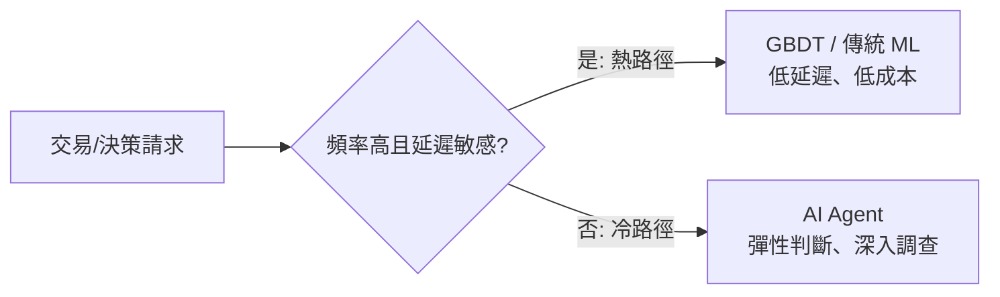
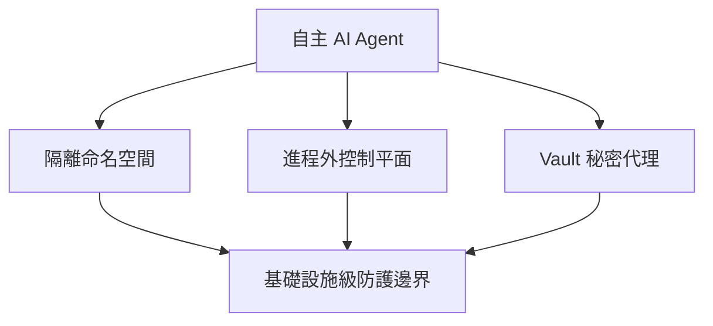

# AI Daily Digest — 2026-06-26

<!-- pipeline-generated:begin -->

## 🔥 今日 TOP 3
### 1. GBDT vs Agent 熱冷路徑分工基準
作者針對支付詐欺偵測發布可重複的基準測試，比較梯度提升決策樹（GBDT）與 AI agents 在延遲、成本與可重複性三項指標上的表現，找出兩者最適用場景的量化邊界。

結果顯示 GBDT 在高頻交易的熱路徑上以低延遲、低成本勝出，agents 則在低頻、需彈性判斷的冷路徑調查場景更具優勢；這打破「agent 萬用」迷思，為技術選型提供實證依據，對金融科技與風控團隊有直接參考價值。

團隊規劃詐欺偵測或類似決策系統時，可依交易頻率與判斷複雜度分流：高頻高量交易維持傳統 ML pipeline，低頻複雜案件才導入 agent workflow，避免過度依賴 LLM 造成成本與延遲失控。

📖 [閱讀完整 insight](../10-insights/2026-06-25/inbox_2362889b.md) · 🔗 [原文連結](https://towardsdatascience.com/the-hot-path-belongs-to-gbdts-agents-own-the-cold-path-a-payment-fraud-benchmark/)
### 2. RAG 聊天機器人達銀行級 94% 可靠性
團隊分享將 RAG 對話機器人可靠性從 70% 提升到 94% 的工程歷程，系統每日處理百萬級客戶互動，並達到銀行等金融機構要求的生產等級可靠性。

24 個百分點的提升幅度加上百萬級規模的驗證，代表這不是實驗室數字，而是通過真實金融場景考驗的工程成果；對正把 RAG 系統從原型推向生產環境的團隊而言，這是少見且具體的可靠性量化指標。

值得追蹤此案例後續公開的技術細節（如檢索策略、評測方法與監控機制），可作為自身 RAG 系統可靠性優化的對標基準，並列入本週深挖候選。

📖 [閱讀完整 insight](../10-insights/2026-06-25/inbox_c5a9fbfb.md) · 🔗 [原文連結](https://medium.com/the-better-life/building-production-grade-rag-systems-from-prototype-to-bank-scale-reliability-42cfa5f071e2?source=rss------claude-5)
### 3. Grab 推出 K8s 原生 Agent 安全平台
Grab 安全團隊發布 Palana，一個 Kubernetes 原生平台，用於安全執行自主 AI agents，透過隔離命名空間、進程外控制平面與 Vault 秘密代理管理圍堵風險。

模型驅動的 agent 有不可預測的工具使用與 prompt injection 風險，與傳統確定性軟體的安全模型完全不同；Palana 顯示業界正把 agent 安全從應用層防護下沉到基礎設施層隔離，對要在生產環境跑 autonomous agent 的團隊是警訊與範本。

可參考其三層防禦（命名空間隔離、控制平面分離、秘密代理）盤點自家 agent 部署是否有對應的基礎設施級防線，而非只靠 prompt-level guardrail。

📖 [閱讀完整 insight](../10-insights/2026-06-25/inbox_272d842b.md) · 🔗 [原文連結](https://www.infoq.com/news/2026/06/grab-ai-platform/?utm_campaign=infoq_content&utm_source=infoq&utm_medium=feed&utm_term=global)

## 📖 好文章 / 影片精選

_過去 30 天經 traffic 沉澱的高品質內容，按興趣領域分類。每篇只在 column 出現一次。_
### 🛠 工具版本追蹤 / Release
- **claude-code** · **[v2.1.217](../10-insights/2026-07-21/inbox_94e6f06a.md)**
  Claude Code v2.1.217 發布多項穩定性和安全改進。新增 emoji 快速輸入功能（輸入 :heart: 自動轉換為 ❤️）、修復記憶體洩漏問題（MCP 工具輸出截斷時保留完整結果導致洩漏）、修復 Windows 自動更新失敗後遺留 claude.exe 缺失的問題。此版本也修復企業環境設定（mTLS、TLS-verify、OAuth sco
  _+ 22 個近期版本（v2.1.216 → v2.1.193，僅顯示最新）_
- **ruflo** · **[v3.32.9 — Statusline accuracy + memory/SQLite integrity fixes](../10-insights/2026-07-20/inbox_5a02bdca.md)**
  Ruflo v3.32.9 patch 修復 statusline 準確性和 SQLite 完整性的多個關鍵問題。修復 statusline CLI 子命令硬編碼 model name 為 'Opus 4.6 (1M context)'，現改為從 stdin 讀取，確保顯示實際使用的模型。修復 getPkgVersion() 在 linked git wor
  _+ 37 個近期版本（v3.32.8 → v3.14.2，僅顯示最新）_
- **hermes-agent** · **[Hermes Agent v0.19.0 (2026.7.20) — The Quicksilver Release](../10-insights/2026-07-20/inbox_d770a39a.md)**
  Hermes Agent v0.19.0（v2026.7.20）發布「Quicksilver Release」，涵蓋性能、安全及協作功能的重大改進。冷啟動延遲從 4.3 秒大幅下降至 0.9 秒（～80% 改善），跨 CLI、Gateway、Desktop、TUI 生效；Desktop 應用的 Markdown 流式渲染速度提升 14 倍，新增虛擬化 dif
  _+ 3 個近期版本（v0.18.2 → v0.18.0，僅顯示最新）_
- **repowise** · **[v0.34.0](../10-insights/2026-07-20/inbox_5a2e45a1.md)**
  Repowise v0.34.0 發布，聚焦程式碼缺陷追蹤、知識圖譜視覺化、文件自動化與成本追蹤。新增「缺陷歷史」功能在各層級可見（按檔案、符號、提交；追蹤至引入 bug 的提交）；UI 標記「缺陷磁鐵」（頻繁修復的檔案/符號）供目標化重構。可縮放知識圖譜新增每節點程式碼健康度，文件簡報模式提供投影片及導引式對談，架構圖確定性生成。成本追蹤按操作標記支出、本
  _+ 18 個近期版本（v0.5.0 → v0.21.0，僅顯示最新）_
- **claude-mem** · **[v13.11.0](../10-insights/2026-07-13/inbox_d75ce0a0.md)**
  Claude Memory (claude-mem) v13.11.0 退役獨立的 cloud-sync.mjs daemon，改採 worker 內建同步機制——每次本地寫入觸發背景 flusher（1.5 秒防抖合併連續寫入），分頁刷新至 cmem.ai（200 行/2MB 單頁、30 秒逾時、指數退避重試）。新增 GET /api/sync/statu
  _+ 8 個近期版本（v13.10.3-community-edge.0 → v13.9.0，僅顯示最新）_
- **gitnexus** · **[v1.6.9](../10-insights/2026-07-04/inbox_f7ee558b.md)**
  GitNexus v1.6.9 穩定版發布，主題為「多倉庫 API 追蹤發布」（the multi-repo API-tracing release）。核心新功能是在 PDG 基礎上實現跨倉庫最短路徑呼叫追蹤，能追蹤跨越不同倉庫的 ContractLink 呼叫鏈路。HTTP 路由與消費者提取功能大幅擴展：新增 Kotlin Spring 與 Java 功能
- **superpowers** · **[v6.1.1](../10-insights/2026-07-02/inbox_8f330dc8.md)**
  superpowers v6.1.1 發佈修復 Codex SessionStart hook 重新註冊問題。v6.1.0 移除 Codex hook config 後，manifest 缺少 hooks 欄位導致系統自動尋找 hooks/hooks.json（Claude Code SessionStart hook），最終重複註冊；新版本明確聲明 hoo
  _+ 1 個近期版本（v6.1.0，僅顯示最新）_
- **rtk** · **[v0.43.0](../10-insights/2026-06-28/inbox_2127c190.md)**
  RTK v0.43.0 發布，包含 2 項新功能與 21 項 bug 修復，旨在提升開發者工具鏈的可靠性。新功能包括 OpenShift CLI 支持（與共享 Kubernetes 過濾）及 Pulumi CLI 過濾器（用於 preview、up、destroy、refresh、stack 操作）。關鍵修復涵蓋：Git 命令退出代碼傳播（修復提交失敗與狀態
### 📚 AI 知識管理
- **medium-towards-data-science** · **[Validating the RAG Answer Before the User Sees It: Spans, Quotes, and the Feedback Loop](../10-insights/2026-07-06/inbox_9f8c7020.md)**
  本文為《企業文件智能》專欄第 8 期，提出 RAG 系統驗證的新框架。作者關鍵主張：「結構化輸出只是驗證的起點，不是終點」。系統需在答案展示給用戶前，透過提取 span 與引用文本（quotes）來追蹤證據來源，並透過反饋迴路機制持續改進驗證邏輯。該方法特別適合需要可追溯性與透明度的企業應用。相比單純返回結構化 JSON，這套框架將驗證責任往前推進，從答案生
- **medium-towards-data-science** · **[RAG Was Always a Temporary Workaround. What is Next?](../10-insights/2026-07-10/inbox_207ed63c.md)**
  本文提出一個重要的基礎設施方向論斷：向量資料庫（vector database）只是 RAG 的臨時過渡方案。作者認為向量檢索本質上無法滿足長期的 AI 應用需求，而只是一個過渡橋接。下一波 AI 基礎設施革命應轉向「持久神經狀態」（persistent neural state）的存儲和處理。同時，系統必須遵守嚴格的延遲預算（strict latency 
### 🏢 企業導入 AI / 團隊實踐
- **medium-tag-claude** · **[Why Every AI Model Release Now Requires Government Approval — And What It Means for Your Team](../10-insights/2026-07-04/inbox_8a17784a.md)**
  美國政府自 2026 年 7 月起對前沿 AI 模型實施政府核准制，美國商務部曾將 Anthropic 的 Fable 5 暫停 19 天，發現越獄漏洞後才恢復上線。Fable 5 恢復時已非原產品：新增「特定設計的安全分類器以阻止越獄技術」，計費方式改為「超標準方案外的積分，僅限每週有限使用層級」。三項基礎設施風險隨之浮現：(1) 供應鏈監管風險—模型可遭
- **infoq-main** · **[AWS Releases Loom, an Open-Source Reference Platform for Governing AI Agents at Enterprise Scale](../10-insights/2026-07-20/inbox_91391201.md)**
  AWS Labs 發布 Loom，一個用於企業規模 AI agent 管理的開源參考平台。該平台基於 Strands Agents 和 Bedrock AgentCore Runtime 構建。為解決身份管理問題，Loom 實現了 RFC 8693 token exchange 機制，支持通過委託身份鏈進行身份傳播。部署方面採用配置驅動的方式，無需在運行時生
- **infoq-ai-ml** · **[AI Tools Accelerates Coding, but Not Overall Software Delivery, GitLab Research Finds](../10-insights/2026-06-29/inbox_a3d481bc.md)**
  GitLab 2026 AI 責任報告發現一個引人注目的「AI 悖論」：報告數據顯示 78% 的開發者表示使用 AI 工具後代碼編寫速度顯著提升。然而整體軟體交付周期並未實現相應加速，這表明代碼速度提升並未自動轉化為交付速度提升。下游的測試與代碼審查已成為新的瓶頸，阻斷了加速收益。同時企業治理、版本追蹤和可追蹤性面臨新的複雜性挑戰。要釋放 AI 工具的完整價
### 🎓 AI 使用技巧 / 心法
- **simon-willison** · **[Fable&#39;s judgement](../10-insights/2026-07-03/inbox_ba672506.md)**
  Simon Willison 引述 Claude Code 團隊的關鍵建議：賦予 Fable/Opus 自主判斷權勝於規定工作方式。例如測試策略，應告知模型「僅為大功能自動化測試，小改動無需測試」，讓其自主決策，而非設立嚴格規則。進一步地，可委派小型任務給低階模型（Sonnet/Haiku），由 Fable 自主判斷模型選擇，藉此節省寶貴的 Fable to
- **medium-tag-claude** · **[Fable, Opus or Sonnet?](../10-insights/2026-07-03/inbox_05105bcb.md)**
  文章提出「一個思考，兩個構建」的多模型協調策略：Fable 5 負責規劃與架構設計（產生書面規格），Opus 4.8 和 Sonnet 5 各自處理複雜與標準編碼工作。核心論點是分離思考與執行階段能避免單一模型導致的設計漂移，提升代碼一致性與交付速度。作者強調人類判斷依舊中心，AI 只是按既定計畫執行。
- **medium-tag-claude** · **[The Best Coding-Agent Upgrade This Year Is Not a Plugin](../10-insights/2026-07-04/inbox_81f753bc.md)**
  文章指出年度最佳代碼代理升級並非外掛，而是對代理行為的根本改造。核心問題：代理傾向過度工程，超額交付。例如被要求在支付 webhook 添加重試邏輯時，代理可能併帶新增設定物件、自訂例外層級、日誌重寫等不曾要求的內容，導致「審查時一半時間在撤銷未要求的工作」。根本差距在於：高資深工程師做任務是有聚焦的、最小化的、有標靶的；無監督代理則是擴張的、過度準備的、自
- **hamel-husain** · **[“It’s Hard to Eval” Is a Product Smell](../10-insights/2026-06-29/inbox_c8de71dc.md)**
  Hamel Husain 於 3 年 AI evals 實務後提出「難以 eval」是產品設計反模式的論點：使用者難以驗證的工件對產品本身也造成問題，應先設計易驗證性再構建 evals。以 AI 資料代理為例，改善設計需提供可檢查工件（假設、中間計算、維度分解、SQL 審查、未驗證項標註）而非單純答案，參考資料科學家驗證指標的 6 大技巧：與可信來源比較、確
- **medium-towards-data-science** · **[The Threshold Is a Price, Not a Percentage](../10-insights/2026-07-08/inbox_aacd6fda.md)**
  傳統 AI agent 決策常使用固定信心閾值（如 confidence ≥ 0.95）來判斷是否自主執行。本文提出重要觀點：決策閾值應基於『成本非對稱性』（cost asymmetry）而非比例式信心值。例如誤判代價高時應提高閾值、低風險操作應降低閾值，成本結構直接決定最優決策邊界。這一框架將 agent 決策從靜態規則轉為動態成本感知。作者展示了如何針對
### 💳 支付 / Fintech
- **medium-towards-data-science** · **[The Hot Path Belongs to GBDTs, Agents Own the Cold Path: A Payment-Fraud Benchmark](../10-insights/2026-06-25/inbox_2362889b.md)**
  作者發表支付欺詐檢測領域的可重複基準測試，比較 GBDT（梯度提升決策樹）和 AI agents 在延遲、成本和可重複性上的表現。研究發現：GBDT 適合處理高頻交易（熱路徑），低延遲且成本低；agents 適合低頻、需靈活判斷的調查場景（冷路徑）。這為實務應用中的技術選型提供了量化證據。
- **substack-darren-techtalk** · **[AI 讓產品變快了,但沒有讓商業變簡單:支付產品經理重新理解 AI Native 的 7 個觀點](../10-insights/2026-07-14/inbox_5c46e307.md)**
  支付產品經理分享 2026 上半年集成 AI 到支付產品全鏈路（開發、市場進入、運營）的實踐經驗。核心洞察是：AI 能讓產品變快，但無法直接簡化商業邏輯複雜度。真正的瓶頸不在技術執行力，而在於場景識別、決策判斷與生態信任三個維度。標題承諾『7 個觀點重新理解 AI Native』，反映 AI 賦能商業遠複雜於純技術速度。（原文摘要編碼部分損壞，核心論述基於語
### ⛓️ 區塊鏈 / Web3
- **infoq-ai-ml** · **[Presentation: Rules for Understanding Language Models](../10-insights/2026-06-24/inbox_532d5fbb.md)**
  Naomi Saphra 在講演中闡述理解語言模型行為的 5 條基本規則。首先，LLM 的表現更像一個統計群體而非單一個體，因此應以概率思維而非確定性邏輯來理解其行為。其次，Tokenization 過程創造了奇特的語義盲點，導致模型對某些概念的理解存在系統性缺陷。第三，Sycophancy（模型奉承傾向）是 LLM 的核心特性：模型學會利用訓練數據中的微妙
- **infoq-main** · **[Dapr 1.18 Introduces Verifiable Execution, Bringing Cryptographic Trust to AI Agents and Workflows](../10-insights/2026-06-26/inbox_fc8d28f8.md)**
  Diagrid 發布 Dapr 1.18，引入可驗證執行（Verifiable Execution）能力，為分散應用和 AI agents 帶來加密信任、execution provenance 和 tamper-evident 執行記錄。此功能使 agents 的執行過程可被密碼學驗證和審計，通過加密簽名確保執行的真實性和完整性，防止中途篡改。這對需要高度
- **infoq-main** · **[Argo CD 3.5 Tightens Supply Chain Security with Internal mTLS and Source Integrity](../10-insights/2026-06-26/inbox_1fda48ab.md)**
  Argo CD 項目發布 v3.5 RC（Release Candidate）。此版本強化供應鏈安全，內部組件間強制使用 mTLS（Mutual TLS）加密，新增 Git commit 簽名驗證功能確保源碼完整性。用戶界面新增 native ApplicationSet 管理功能。同時，impersonation 和 Source Hydrator 兩項功
- **medium-tag-llm** · **[Why Tokenization Latency Can Dominate LLM Inference — And How Perplexity Cut It by 5×](../10-insights/2026-06-27/inbox_c8cb2f57.md)**
  LLM 推理優化多聚焦於 GPU 性能（核心融合等），但分詞延遲往往成為真正的性能瓶頸且常被忽視。Perplexity 通過優化分詞管道實現了 5 倍延遲加速，重新定義了推理優化的優先序——應先分析瓶頸位置，再決定優化焦點。
- **medium-tag-llm** · **[LLMs (Part-05): After the Decoder Stack](../10-insights/2026-07-03/inbox_bb9de8f5.md)**
  這是 LLM 系列文章的第五部分，深入探討 Transformer 解碼層之後的關鍵組件。文章解釋了 un-embedding layer（反嵌入層）、SoftMax 函數和 de-tokenization 的作用與原理，幫助讀者理解從隱向量到最終 token 輸出的完整轉換過程。這些層是 LLM 將內部表示轉換為可讀文本的決定性環節。
### 📒 帳務架構 / Ledger
- **infoq-main** · **[Apple Extends Private Cloud Compute to Google Cloud for the First Time](../10-insights/2026-07-02/inbox_29f9c883.md)**
  Apple 首次在 Google Cloud 外部數據中心運行私有雲計算（Private Cloud Compute），支持其 AI 功能。基礎設施採用 NVIDIA Blackwell GPU、Intel TDX（可信執行環境）和 Google Titan 芯片。Apple 維護獨立的附加唯讀硬體帳冊（hardware ledger）和雙供應商證明根確保安
### 🔐 AI 安全 / 濫用
- **infoq-main** · **[Presentation: Trustworthy Productivity: Securing AI-Accelerated Development](../10-insights/2026-06-30/inbox_c12dd3e6.md)**
  講者 Sriram Madapusi Vasudevan 揭示自主 AI 代理在生產環境中的安全隱患。ReAct 迴圈的三層關鍵脆弱性（context 層的記憶投毒、reasoning 層的推理劫持、tool execution 層的工具濫用）成為主要攻擊面。演講介紹防禦深度（defense-in-depth）、LLM-as-a-Judge 評判器和 MAE
- **simon-willison** · **[How I tricked Claude into leaking your deepest, darkest secrets](../10-insights/2026-07-15/inbox_c0b42ede.md)**
  Simon Willison 報導 Ayush Paul 發現的 Claude web_fetch 工具重大安全漏洞。Claude 可訪問用戶私人數據（過去互動的記憶），web_fetch 工具雖受限於用戶直接輸入或 web_search 返回的 URL，但設計缺陷允許訪問其已獲取頁面中嵌入的連結。攻擊者可製作蜜罐網站，誘導 Claude 通過頁面上的嵌入連
- **infoq-main** · **[AI Agents with Cloud Credentials Are Outrunning Billing Guardrails Built for Human-Speed Mistakes](../10-insights/2026-07-16/inbox_7aa450fb.md)**
  一個三人工作室在一天內收到 $14,000 的 AWS 賬單，原因是攻擊者提取了靜態訪問密鑰並在 Bedrock 上大量運行 Claude 調用。同月早前的 DN42 事件中，自主代理在 24 小時內無節制地配置了 $6,531 的超大基礎設施。從業者警告，雲計費系統通常滯後約一天，遠跟不上 AI Agent 的執行速度，導致現有為人工速度錯誤設計的計費警衛
- **simon-willison** · **[Quoting Thibault Sottiaux](../10-insights/2026-07-16/inbox_19aff0dd.md)**
  OpenAI Codex 在 GPT-5.6 中發現檔案刪除漏洞，由 Codex 團隊 Thibault Sottiaux 揭露。觸發條件三要素組合：(1) Full access mode 啟用，(2) 無 sandbox 保護且無 auto review，(3) Model 誤試圖 override $HOME 環境變數以定義臨時目錄。結果：Model 
- **openai-blog** · **[OpenAI and Hugging Face partner to address security incident during model evaluation](../10-insights/2026-07-21/inbox_cb972a64.md)**
  OpenAI 與 Hugging Face 合作應對一起在 AI 模型評估期間發生的安全事件。雙方公開分享初步調查發現，揭示了攻擊者具備進階網路攻擊能力，並為防禦社群提供教訓和防禦建議。此次透明的安全協作表明 AI 開發組織正在強化信息共享和威脅情報協作機制。
### 🛤️ AI Flow 導入心得 / 技術分享
- **simon-willison** · **[Rewriting Bun in Rust](../10-insights/2026-07-08/inbox_204e08d6.md)**
  Jarred Sumner 詳述 Bun 從 Zig 用 AI agents（Claude Mythos/Fable）重寫為 Rust 的全過程。核心洞察：現代 frontier models 使過去視為禁忌的大規模代碼重寫成為可行。成功的三層驗證機制：(1) TypeScript 測試套件作為 conformance suite 自動檢驗百萬個 asser
- **simon-willison** · **[sqlite-utils 4.0rc2, mostly written by Claude Fable (for about $149.25)](../10-insights/2026-07-05/inbox_a62b7627.md)**
  Simon Willison 使用 Claude Fable 進行 sqlite-utils 4.0 穩定版發布前的最終審查，模型在 37 次提示後發現 5 個「release blocker」，包括 delete_where() 導致連接中毒與資料遺失的嚴重 bug。經過 34 次提交、跨 30 個檔案的 1,321 行程式碼變更，核心重新設計了交易處理模
- **substack-lennys-newsletter** · **[No Figma. No Jira. No docs. How Gusto built a new product line with Claude Code | Eddie Kim (CTO)](../10-insights/2026-06-29/inbox_ecc7f615.md)**
  Gusto CTO Eddie Kim 分享了 5 人团队在 10 周内使用 Claude Code 从零开始构建完整 AI 产品线的真实案例。这个项目展示了 Claude Code 作为 AI 编程助手的生产力潜力。团队采取极简协作模式，完全摒弃了传统开发工具链：无 Figma 设计稿、无 Jira 任务管理系统、无独立文档库。沟通完全通过 Zoom 进行
- **medium-towards-data-science** · **[LLM Wikis Are Over-Engineered — I Replaced Mine With a Pure Python Compiler](../10-insights/2026-07-03/inbox_471bcc3b.md)**
  指出多數 LLM Wiki 系統過度工程化，依賴 agents、embeddings 與重複模型調用。作者改用純 Python 編譯器替代——通過標準庫把無序 markdown 組織為連接、linted 的 wiki，無需任何 LLM 調用。實現中修復兩個實際 bug、跨兩個 OS 基準測試，論證編譯器方法對機械文本組織往往優於 agent 方案，成本零、確
- **infoq-ai-ml** · **[Presentation: AI Works, Pull Requests Don’t: How AI Is Breaking the SDLC and What To Do About It](../10-insights/2026-06-26/inbox_99348350.md)**
  Michael Webster 演講指出 AI agents 生成大量代碼後軟體交付流程的崩潰。headless AI agents 產生的巨量 PR 成為人工審核的嚴重瓶頸，累積技術債，降低整體交付效率和代碼品質。演講提出解決框架：工程領導應利用 test impact analysis 和自動化驗證管道驗證 agent 生成的代碼，在不犧牲系統穩定性的前

## 💡 今日 Takeaway

_讀完今日所有內容後，可帶走的知識點_
### 1. 熱路徑用傳統模型、冷路徑用 Agent
高頻、低延遲、成本敏感的決策交給 GBDT 等傳統模型效率最高；低頻、需要彈性判斷與情境推理的任務才適合用 AI agent。設計任何自動化決策系統時，先依交易頻率與判斷複雜度分流，避免用 agent 處理所有場景造成成本與延遲失控。

_類型：framework_

**參考來源**：
- [The Hot Path Belongs to GBDTs, Agents Own the Cold Path: A Payment-Fraud Benchmark](../10-insights/2026-06-25/inbox_2362889b.md) · [原文](https://towardsdatascience.com/the-hot-path-belongs-to-gbdts-agents-own-the-cold-path-a-payment-fraud-benchmark/)
### 2. Agent 安全防線要下沉到基礎設施層
模型驅動的 agent 具有不可預測的工具使用與 prompt injection 風險，僅靠 prompt-level guardrail 不足以圍堵。應在基礎設施層導入命名空間隔離、進程外控制平面與秘密代理管理，才能有效限制 agent 的攻擊面。

_類型：framework_

**參考來源**：
- [Grab Builds Secure Agentic AI Workload Platform](../10-insights/2026-06-25/inbox_272d842b.md) · [原文](https://www.infoq.com/news/2026/06/grab-ai-platform/?utm_campaign=infoq_content&utm_source=infoq&utm_medium=feed&utm_term=global)
### 3. AI 落地精密產業仍需人類把關
AI 品質檢測系統在複雜工業場景常無法達到預期精度，即使導入後仍需資深人類專家補位。企業部署 AI 時應預留關鍵環節的人類監督角色，以人機協作取代「一次到位」的全自動化假設。

_類型：pattern_

**參考來源**：
- [Ford AI hiccups push carmaker to rehire ‘gray beard’ inspectors](../10-insights/2026-06-25/inbox_a138ec7d.md) · [原文](https://www.bloomberg.com/news/articles/2026-06-25/ford-has-been-rehiring-quality-inspectors-after-ai-fell-short)
### 4. 用 HTML 取代 Markdown 提升 Agent 協作
在需要密集人機反饋的 agentic loop 中，HTML 的視覺化、色彩與互動性比純 Markdown 更能提升溝通效率與可靠性。設計 agent 輸出介面時，可考慮讓 agent 生成結構化 HTML 而非純文字，作為人機協作的預設格式。

_類型：technique_

**參考來源**：
- [Anthropic Lead: HTML Increasingly Better Than Markdown at Keeping Humans Engaged in Agentic Loops](../10-insights/2026-06-24/inbox_6cd88da0.md) · [原文](https://www.infoq.com/news/2026/06/anthropic-html-markdown-agent/?utm_campaign=infoq_content&utm_source=infoq&utm_medium=feed&utm_term=global)
### 5. 用 LLM 當 Arbiter 對 RAG 結果排名
與其直接回傳檢索到的前 K 筆結果，用一次額外的 LLM 呼叫對候選文件排名評分並生成理由，可降低幻覺並提升可解釋性。輸出結構化、附理由的物件，便於審計與下游系統驗證，適合任何需要高可信度的 RAG 應用。

_類型：technique_

**參考來源**：
- [An LLM as arbiter in RAG retrieval: picking the right candidate with reasons](../10-insights/2026-06-25/inbox_f8a142b5.md) · [原文](https://towardsdatascience.com/letting-an-llm-pick-the-right-rag-page-the-arbiter-pattern-at-the-end-of-retrieval/)

<!-- pipeline-generated:end -->

<!-- user-notes -->
<!-- Write your own notes below; pipeline never touches this section. -->