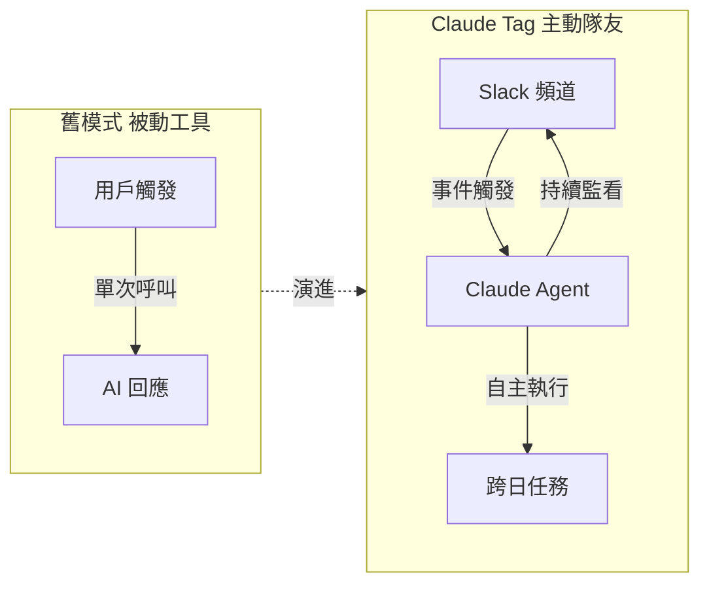
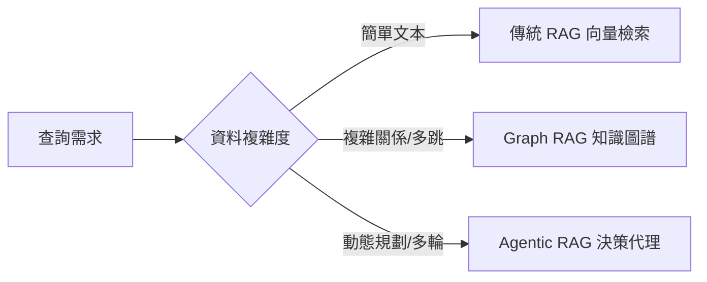

# AI Daily Digest — 2026-06-28

<!-- pipeline-generated:begin -->

## 🔥 今日 TOP 3
### 1. GPT-5.6 三版本發布，架構從單體轉向分層設計
OpenAI 於 2026 年 6 月 26 日發布 GPT-5.6 模型系列，分為 Sol、Terra、Luna 三個版本，目前限定予信任合作夥伴搶先使用，同日 Anthropic 亦有對應版本跟進。此次更新標誌著 OpenAI 模型設計從先前的單一架構（monolithic）轉向結構性分離設計，是模型演進的重要架構里程碑。

GPT-5.6 採分層策略（Sol/Terra/Luna）暗示 OpenAI 正針對不同需求與價格點切割市場，相比前代一體式架構更具商業彈性，允許在成本控制與能力邊界間進行更精確的調優。對 API 使用者與企業決策者而言，分層模型意味著「選哪一版」將成為新的技術選型維度，並對現有的路由策略產生直接衝擊。

目前公開資訊仍有限，建議密切關注信任合作夥伴的早期評測與能力對比報告。一旦更廣泛開放，Sol/Terra/Luna 的能力差異與定價結構將直接影響企業 AI 選型決策，開發者應提前規劃多版本路由策略，並預留從單模型切換至分層架構的遷移彈性。

📖 [閱讀完整 insight](../10-insights/2026-06-27/inbox_d8319282.md) · 🔗 [原文連結](https://medium.com/mlworks/whats-new-with-openai-s-gpt5-6-551b3d8cc6b6?source=rss------large_language_models-5)
### 2. Claude Tag 讓 AI 成 Slack 自主隊友，Anthropic 內部 65% 代碼已自動生成
Anthropic 推出 Claude Tag 功能，讓 Claude 在 Slack 中以自主隊友身份長期運作——可跨多日無需人工觸發地執行任務、持續監看頻道、獨立消耗 tokens 進行分析。Anthropic 同步透露，內部某工程團隊已有 65% 的代碼由 Claude 自動生成，為 AI 工程化深度提供第一手實證。

這標誌著 AI 從「需要呼叫才回應的工具」演進為「主動監看、自主執行的隊友」，人機協作模式出現根本性轉變。65% 代碼生成比例並非行銷數字，而是 AI 在工程流程中取得主導份額的實質指標，相比過去 AI 僅作輔助工具的角色有質的飛躍——不再是人控 AI，而是 AI 持續運作、人作例外審核。

觀察重點：Claude Tag 的 token 消耗模式將形成新的 AI 預算計算方式；企業應評估哪些工程任務可交給 Claude 長期自主處理，設計「AI 先行、人工審核例外」的工作流程以最大化效益。

📖 [閱讀完整 insight](../10-insights/2026-06-27/inbox_d2738a8f.md) · 🔗 [原文連結](https://medium.com/@automation.labs/claude-tag-makes-claude-a-slack-teammate-not-a-chatbot-18640affb045?source=rss------claude-5)
### 3. 路由省成本 50% 卻損及品質，帕累托陷阱三個月後才現形
一個工程團隊建立 AI 路由層後將推理成本削減超過 50%，但三個月後發現客戶滿意度持續下降。調查揭示，路由層在降低支出的同時悄悄選擇了能力較弱的模型，品質損失是成本節省的隱形代價，而延遲長達三個月才被察覺。

這是典型的「帕累托陷阱」——優化成本指標卻在不知情下犧牲品質指標，且兩者的因果延遲極高。相比傳統軟體優化，AI 品質退化的信號更模糊、更難與路由決策直接關聯，尤其在缺乏即時品質監控儀表板的團隊中幾乎不可見。若能以天級別（而非月級別）識別此類成本-品質權衡，可大幅壓縮決策風險窗口。

實務建議：任何 AI 路由或模型切換決策應同步設置品質基準測試，並建立「成本-品質雙儀表板」機制。在路由層上線後前兩週進行密集品質抽樣（以天為單位），而非等待客戶滿意度指標自然下滑才驚覺問題所在。

📖 [閱讀完整 insight](../10-insights/2026-06-27/inbox_5dd6641e.md) · 🔗 [原文連結](https://towardsdatascience.com/we-built-a-routing-layer-to-cut-our-ai-costs-it-broke-the-product/)

## 📖 好文章 / 影片精選

_過去 30 天經 traffic 沉澱的高品質內容，按興趣領域分類。每篇只在 column 出現一次。_
### 🛠 工具版本追蹤 / Release
- **ruflo** · **[v3.14.4 — Darwin core-systems sweep + tarball-bloat fix](../10-insights/2026-06-27/inbox_3b1a2246.md)**
  Ruflo v3.14.4 發布，核心為 Darwin core-systems 最佳化與關鍵的打包體積修正。性能改進包括：skill-distillation 效能提升 133%（0.4286→1.0，達到基準天花板），causal-graph 熱路徑延遲從 115ms 大幅下降至 3ms（-97%），reasoning-bank 在 BEIR bench
  _+ 1 個近期版本（v3.14.3，僅顯示最新）_
- **repowise** · **[v0.25.0](../10-insights/2026-06-27/inbox_fd95122a.md)**
  Repowise v0.25.0 發布，新增 Split File 模組分解檢測與 Extract Method 重構兩大功能。Split File detector 透過 cohesion 信號與內部過程 CFG 層分析識別應拆分的模組，並在 web UI 與 code-gen 中輸出重構規劃；Extract Method 支援 def/use 與 rea
### 📚 AI 知識管理
- **medium-towards-data-science** · **[Vector RAG Isn’t Enough — I Built a Context Graph Layer for Multi-Agent Memory](../10-insights/2026-06-25/inbox_d7c3715e.md)**
  作者透過對同一組多 agent 對話集進行基準測試，對比原始聊天記錄、純向量 RAG 和 context graph 三種方案，發現純向量 RAG 在關係型檢索上存在顯著弱點。結果表明傳統向量檢索無法充分捕捉 agents 間的上下文依賴關係，需要圖結構層才能改善多 agent 記憶系統的精度和覆蓋率。
- **medium-towards-data-science** · **[An LLM as arbiter in RAG retrieval: picking the right candidate with reasons](../10-insights/2026-06-25/inbox_f8a142b5.md)**
  一篇探討 RAG 檢索最佳實踐的文章。核心想法是採用「仲裁者模式」(Arbiter Pattern)：通過一次 LLM 調用對多個候選文檔進行排名和評分，同時生成推理理由，輸出一個類型化的結果對象，便於審計人員驗證和解釋決策過程，提高 RAG 系統的可信度與可解釋性。
- **substack-bytebytego** · **[EP220: RAG vs Graph RAG vs Agentic RAG](../10-insights/2026-06-27/inbox_e292b1a5.md)**
  ByteByteGo 第 220 期解析 RAG 的三種核心架構：傳統 RAG、Graph RAG 與 Agentic RAG。傳統 RAG 將文本向量化並用向量相似度檢索，適合結構簡單的資料；Graph RAG 將資料建模為知識圖譜，擅長處理複雜實體關係和多跳推理；Agentic RAG 引入決策代理，支持動態規劃和交互式檢索。選擇正確的架構對 LLM 應
- **hackernews** · **[Show HN: OpenKnowledge – open source AI-first alternative to Obsidian/Notion](../10-insights/2026-06-25/inbox_7750b85b.md)**
  Inkeep 開源發布 OpenKnowledge，一套整合 Claude、Codex 的 WYSIWYG markdown editor，定位為 Obsidian 與 Notion 的開源替代品。產品提供 MacOS app、Web UI 與 CLI 三種形式，採用 Tiptap/ProseMirror、CodeMirror、YJS (CRDT) 技術棧。
- **medium-towards-data-science** · **[How to Build a Powerful LLM Knowledge Base](../10-insights/2026-06-27/inbox_f0ad5b62.md)**
  文章提出用編碼型 agents 強化 LLM 知識庫的構建能力，但具體內容細節在摘錄中缺失。標題暗示 agents 可作為知識檢索與增強的執行單位。
### 🏢 企業導入 AI / 團隊實踐
- **infoq-architecture** · **[AI Is Moving up the Software Lifecycle: From Code Review to PRD Governance](../10-insights/2026-06-24/inbox_4a1e9c6a.md)**
  科技大廠（Uber、DoorDash、Cloudflare）將 AI 應用從後期開發階段（代碼生成）前移到軟體生命週期的早期，包括 PRD 驗證、設計評估和代碼審查。這些企業建立 AI 驅動的治理層，在工程工件進入實施前自動評估並提出改善建議，同時嚴格保留人類決策權以防止誤判。這一趨勢反映了 AI 從輔助工具演變為整個軟體工程流程的治理框架，強化了質量控制和
- **medium-tag-claude** · **[Claude Tag Makes @Claude a Slack Teammate, Not a Chatbot](../10-insights/2026-06-27/inbox_d2738a8f.md)**
  Anthropic 推出 Claude Tag 功能，使 Claude 在 Slack 中以真正的隊友身份工作——可跨多日自動運行任務、持續監看頻道、獨立消耗 tokens 執行分析。文中透露某個 Anthropic 內部團隊已有 65% 的代碼由 Claude 自動生成，直接印證了 LLM 在工程流程中的實際影響力。此發展標誌著 AI 從互動式工具轉變為主
### 🎓 AI 使用技巧 / 心法
- **medium-towards-data-science** · **[Why AI Still Can’t Solve Your Real Mathematical Optimization Problem](../10-insights/2026-05-28/inbox_a19e7801.md)**
  文章探讨了通用 AI 模型在解决现实数学优化问题中的固有局限，并对比介绍 ORPilot 的不同方法。大规模、约束复杂的现实优化问题中，传统 AI 方法往往失效，因为缺乏可解释性、精确性和可控性保证。ORPilot 作为替代方案采用了针对优化问题的专用架构，为需要高精度、高可靠性优化的业务提供了新的选择。
- **medium-towards-data-science** · **[DiffuJudge-AV: A Diffusion-Inspired Framework for Calibrated AV Video Evaluation](../10-insights/2026-05-28/inbox_99398931.md)**
  針對自駕視頻評估的新框架「DiffuJudge-AV」，採用擴散模型啟發的方法論。該框架的核心目標是對 LLM-as-a-Judge 評估流程進行壓力測試與校準，確保評判系統的可靠性和一致性。通過「去噪」迭代流程，系統可以識別和修正評估中的偏差與錯誤。這項工作針對安全關鍵應用領域，特別是自駕車視頻理解的評估，提供了一套系統化的驗證方法。框架展示了如何用結構化
- **substack-bytebytego** · **[Must-Know Failure Modes in Distributed Systems](../10-insights/2026-05-28/inbox_dc3e2069.md)**
  ByteByteGo 文章系統介紹分散系統中的主要失敗模式（failure modes）及其標準應對方法。涵蓋常見故障類型、檢測機制和經驗證的緩解策略，為系統架構師的設計參考。內容屬於基礎架構和系統設計領域。
- **medium-tag-llm** · **[Optimizing Deep Learning Models with SAM](../10-insights/2026-05-30/inbox_d149f67f.md)**
  深度學習優化器 SAM（Sharpness-Aware Minimization）詳解。SAM 通過最小化 loss 函數的尖銳度（sharpness）來改進模型泛化性能，是改進現代深度學習模型的重要技術。傳統梯度下降法只追求最小化 loss 值，而 SAM 額外約束 loss landscape 的平坦度，使得模型在新數據上的表現更穩健。該方法在多個領域的
- **medium-tag-claude** · **[Learn How to Claude](../10-insights/2026-05-31/inbox_68850162.md)**
  Anthropic 於 2026 年 3 月推出免費 AI 學習平台「Anthropic Academy」，提供 13 門自學課程、分三層課程軌道（非技術管理者、專業人士、API 開發者）、包含認證。課程涵蓋從 AI 基礎知識到生產級 API 部署，同時搭配 YouTube、DeepLearning.AI 與 freeCodeCamp 等免費資源。作者強調此
### 💳 支付 / Fintech
- **medium-towards-data-science** · **[Beyond the Straight Line: Choosing Between OLS, Interaction Terms, and Tweedie Regression](../10-insights/2026-06-25/inbox_88794bf1.md)**
  統計迴歸方法選擇指南：傳統 OLS（普通最小平方法）、交互項和 Tweedie 分布的適用範圍取決於資料特性。作者論述當資料包含大量零值和極端異常值時（如支付額、保險理賠），如何選擇合適模型以避免估計偏差。
- **substack-hummingbot** · **[Gateway Security Improvements](../10-insights/2026-06-27/inbox_a95ac11d.md)**
  Hummingbot 社群公告涉及 Gateway 安全改進事項。
### ⛓️ 區塊鏈 / Web3
- **medium-tag-llm** · **[Why Tokenization Latency Can Dominate LLM Inference — And How Perplexity Cut It by 5×](../10-insights/2026-06-27/inbox_c8cb2f57.md)**
  LLM 推理優化多聚焦於 GPU 性能（核心融合等），但分詞延遲往往成為真正的性能瓶頸且常被忽視。Perplexity 通過優化分詞管道實現了 5 倍延遲加速，重新定義了推理優化的優先序——應先分析瓶頸位置，再決定優化焦點。
### 🔐 AI 安全 / 濫用
- **infoq-ai-ml** · **[Grab Builds Secure Agentic AI Workload Platform](../10-insights/2026-06-25/inbox_c12745b0.md)**
  Grab 的安全團隊開發了 Palana，一個專為安全運行自主 AI 代理而設計的 Kubernetes 原生平台。與確定性軟體不同，模型驅動的代理具有不可預測的工具使用、代碼生成和提示注入風險。Palana 通過基礎設施級的隔離機制（包括隔離命名空間、進程外控制平面、以及 Vault 支持的代理式秘密管理）來遏制這些威脅。這種方法表明，AI 代理的安全管控
### 🛤️ AI Flow 導入心得 / 技術分享
- **medium-towards-data-science** · **[We Built a Routing Layer to Cut Our AI Costs. It Broke the Product.](../10-insights/2026-06-27/inbox_5dd6641e.md)**
  一個團隊通過建立路由層將 AI 推理成本削減超過 50%，但三個月後發現客戶滿意度下降，成本節省實際上伴隨了品質損失。文章指出這是「帕累托陷阱」—— 優化成本時無意中犧牲了產品品質。提供的檢測方法論能在數日而非數月內識別此類權衡，幫助團隊在早期預防優化反作用。

## 💡 今日 Takeaway

_讀完今日所有內容後，可帶走的知識點_
### 1. AI 成本優化需同步監控品質，帕累托陷阱延遲三個月才現形
路由層選低成本模型可在短期削減推理成本 50%+，但若缺乏即時品質監控，品質下滑會延遲反映在客戶滿意度上，導致決策者誤以為優化成功。正確做法是在成本優化決策上線的同時部署品質 benchmark，以天為單位抽樣，並建立「成本-品質雙儀表板」同步追蹤兩個指標。「成本節省但品質未驗證」不是優化，是風險轉移。

_類型：framework_

**參考來源**：
- [We Built a Routing Layer to Cut Our AI Costs. It Broke the Product.](../10-insights/2026-06-27/inbox_5dd6641e.md) · [原文](https://towardsdatascience.com/we-built-a-routing-layer-to-cut-our-ai-costs-it-broke-the-product/)
### 2. LLM 推理優化先 profile 再動手，分詞延遲常比 GPU 更是瓶頸
工程師直覺優化 GPU 核心（kernel fusion、批次調整），但分詞管道往往才是真正的延遲主因。Perplexity 透過優化分詞管道達成 5× 延遲加速，投入遠低於 GPU 級優化。正確流程：先用 profiler 分析各環節延遲分佈，確認分詞是否主導整體耗時，再決定優化焦點——「先量測、再最佳化」是不被直覺誤導的唯一方法。

_類型：data-point_

**參考來源**：
- [Why Tokenization Latency Can Dominate LLM Inference — And How Perplexity Cut It by 5×](../10-insights/2026-06-27/inbox_c8cb2f57.md) · [原文](https://medium.com/@jhanvijain052003/why-tokenization-latency-can-dominate-llm-inference-and-how-perplexity-cut-it-by-5-f0bec67ebf69?source=rss------large_language_models-5)
### 3. Prompt 與 CLAUDE.md 配置都是需要 Git 版控的可版本化資產
AI 開發中的 prompt、評估標準與配置文件每週都在演進，若無版本控制就無法追蹤哪個版本效果最優，也無法在效果退化時精確回滾。用 Git 管理這些資產，可記錄每次變更原因、對比版本效果差異，讓 AI 開發流程達到與傳統軟體工程同等的嚴謹度。「能回滾的決策才是可靠的決策」——AI 配置不該是只能往前走的黑箱。

_類型：framework_

**參考來源**：
- [GitHub for PMs: Version Control for Everything You Build With AI](../10-insights/2026-06-27/inbox_4758ff8e.md) · [原文](https://www.news.aakashg.com/p/github-for-pms)
### 4. RAG 架構選型應依資料關係複雜度決定，三種方案各有最適場景
傳統 RAG 用向量相似度適合純文本匹配；Graph RAG 以知識圖譜擅長多跳推理和複雜實體關係；Agentic RAG 引入決策代理支持動態查詢規劃與多輪推理。三者選型直接影響系統準確率、延遲與成本，應根據資料特性與查詢模式決定，而非一律選最複雜的架構。

_類型：framework_

**參考來源**：
- [EP220: RAG vs Graph RAG vs Agentic RAG](../10-insights/2026-06-27/inbox_e292b1a5.md) · [原文](https://blog.bytebytego.com/p/ep220-rag-vs-graph-rag-vs-agentic)

<!-- pipeline-generated:end -->

<!-- user-notes -->
<!-- Write your own notes below; pipeline never touches this section. -->