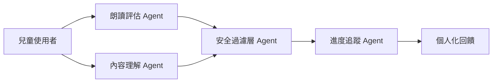
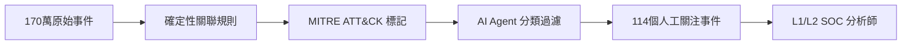

# AI Daily Digest — 2026-06-29

<!-- pipeline-generated:begin -->

## 🔥 今日 TOP 3
### 1. 代理系統可靠性：控制方差優先於追求平均速度
一篇工程分析文章指出，可靠代理工作流的設計核心不在於「讓模型更快或更準」，而在於「減少極端異常情況的發生頻率」。作者引入「尾延遲控制（tail latency control）」框架，主張應聚焦於壓縮最壞情況的發生率，而非優化平均表現。

這對生產部署的 AI agent 系統尤為關鍵。即使 99% 的互動表現完美，單次偶發的高延遲或失敗就足以摧毀使用者體驗與信任。此框架與網路服務中的 P99/P999 延遲管理哲學一脈相承，反映「可靠性 ≠ 絕對速度」的工程現實——高品質答案若無可用性保證，仍無法被視為真正可用的解決方案。

設計 agent pipeline 時應在架構層加入方差控制機制：timeout 熔斷、fallback path 與 retry budget 限制。監控指標應涵蓋 P95/P99 尾端分佈，而非只追蹤平均成功率。明天可以審視自身系統是否具備這些觀測維度，並評估極端失敗路徑的頻率與影響。

📖 [閱讀完整 insight](../10-insights/2026-06-28/inbox_45ba6aee.md) · 🔗 [原文連結](https://towardsdatascience.com/tail-control-the-counterintuitive-engineering-of-reliable-agentic-workflows/)
### 2. $0.29 學年成本的 4-agent 兒童讀書教練架構
開發者 Isha Shukla 基於 Claude 多代理框架為 8-12 歲兒童打造讀書教練應用，採用 4-agent pipeline 架構並配備專屬安全層，整個學年實際 API 成本僅 $0.29（日均 $0.0016）。

此案例打破了「多代理架構必然昂貴」的直覺假設。4 個協作 subagent 各司其職——朗讀評估、內容理解、安全過濾、進度追蹤——相較於由單一大型 agent 承擔所有職責，職責分離設計反而降低了每次互動的 token 消耗，同時讓安全層可以獨立維護。低互動頻率與明確的任務邊界，是使成本維持極低的兩大結構性因素。

對正在評估多代理可行性的開發者，此案例提供成本基準：任務明確、互動頻率可控的 B2C 應用可以用極低成本實現複雜協作。規劃時應先估算各 subagent 的 token 使用模式，避免因架構複雜性而高估成本，錯失導入機會。

📖 [閱讀完整 insight](../10-insights/2026-06-28/inbox_2172406c.md) · 🔗 [原文連結](https://medium.com/womenintechnology/i-earned-my-claude-subagent-certificate-f53058566887?source=rss------claude-5)
### 3. MITRE 驅動 AI 過濾：170萬安全事件縮至114個
技術文章展示了結合確定性事件關聯（deterministic event correlation）、MITRE ATT&CK 框架驅動的 AI agents 與生產環境遙測資料，將 170 萬筆原始安全事件自動分類為 114 個需人工關注的日常事件，自動化 L1/L2 SOC 工作流，淨化率超過 99.9%。

此結果對安全運營中心（SOC）意義重大。傳統分析師面臨的核心問題是警報疲勞（alert fatigue）：大量人力耗費在過濾噪音上，真正重要的信號往往被淹沒。MITRE ATT&CK 框架作為語義骨幹，結合確定性規則與 AI 判斷，實現了可審計、可解釋的大規模自動分類，而非依賴難以驗證的黑盒 LLM 決策——這是此架構勝過純 LLM 方案的核心優勢。

安全團隊可評估將 MITRE 戰術標籤作為 agent 分類的結構化錨點，搭配確定性規則（而非純 LLM 判斷）實現高可信度的自動化過濾。此「確定性 + AI」組合模式也適用於其他高噪音場景，如日誌異常偵測或業務告警去重。

📖 [閱讀完整 insight](../10-insights/2026-06-28/inbox_c7e715c2.md) · 🔗 [原文連結](https://medium.com/@nsangouinoussa515/from-1-7m-security-events-to-114-daily-incidents-building-a-hallucination-aware-ai-soc-platform-1eb58a90ae30?source=rss------large_language_models-5)

## 📈 本週 GitHub 飆升 Top 10

_GitHub 本週新增 star 最多的專案_

### 1. [calesthio/OpenMontage](https://github.com/calesthio/OpenMontage)
⭐ +18,703 this week · 🧬 Python

這是一套以 AI Agent 驅動的開源影片製作系統，提供 12 條製作流程、52 種工具與超過 500 個 Agent 技能，讓 AI 編程助手直接承擔剪輯、配音、字幕等影片後製工作。它把過去需要多個付費軟體才能完成的完整製作流水線整合進一套開源框架，看來正好切中了 AI 影片內容需求爆發的時間點。適合需要自動化影片產出的內容創作者、行銷團隊，或想把 AI Agent 能力延伸到多媒體領域的開發者。
### 2. [DeusData/codebase-memory-mcp](https://github.com/DeusData/codebase-memory-mcp)
⭐ +8,926 this week · 🧬 C

這是一個以 C 語言打造的高效能 MCP 伺服器，能把整個程式碼庫索引成持久化知識圖譜，支援 158 種語言，查詢延遲在毫秒以下，且相比直接把原始碼送進 LLM 可省下約 99% 的 Token 用量。它以單一靜態二進位發布、零外部依賴的極簡部署方式，可能是引發社群快速傳播的原因之一。對於需要讓 AI 助手理解大型程式碼庫、又想嚴格控制 API 成本的工程師或 AI 工具開發者來說是很實用的選擇。
### 3. [Panniantong/Agent-Reach](https://github.com/Panniantong/Agent-Reach)
⭐ +7,692 this week · 🧬 Python

這個工具讓 AI Agent 能直接讀取與搜尋 Twitter、Reddit、YouTube、GitHub、Bilibili、小紅書等多個主流平台的內容，只需一個 CLI 指令，且不需要花費任何 API 費用。它正面解決了 Agent「缺乏即時公開資訊來源卻又不想付費接 API」的痛點，在 Agent 應用快速普及的當下，這類跨平台免費資料接入工具很容易在社群中引爆討論。適合正在開發需要網路感知能力之 AI Agent 的工程師與研究者。
### 4. [ZhuLinsen/daily_stock_analysis](https://github.com/ZhuLinsen/daily_stock_analysis)
⭐ +7,045 this week · 🧬 Python

這套系統以 LLM 為核心，整合多來源股市行情、即時新聞與決策看板，並支援自動推送通知與免費定時排程執行，目標是提供一站式的智能投資分析流程。中文介面友好、可零成本部署的設計，看來讓它在華語開發者社群中迅速傳播。適合個人投資者、量化研究者，或想把 AI 技術落地在金融資訊整合場景的開發者。
### 5. [google-labs-code/design.md](https://github.com/google-labs-code/design.md)
⭐ +6,728 this week · 🧬 TypeScript

這是 Google Labs 提出的一種專案規格格式，讓開發者在程式庫中放置 DESIGN.md 檔案，以結構化方式描述品牌色彩、字型、元件風格等視覺識別規範，使 AI 編程助手能持續理解並遵循設計系統。它的概念類似 CLAUDE.md 或 AGENTS.md，但聚焦在設計層面，看來正好呼應 AI Coding Agent 日益需要感知「設計上下文」的普遍需求。前端工程師、設計師與希望在 AI 輔助開發中維持視覺一致性的工程團隊都值得採用。
### 6. [topoteretes/cognee](https://github.com/topoteretes/cognee)
⭐ +6,064 this week · 🧬 Python

Cognee 是一個開源的 AI 記憶平台，透過可自行架設的知識圖譜引擎，讓 AI Agent 在不同對話 Session 之間保有長期記憶，無須每次重新建立上下文。隨著多輪對話與長任務 Agent 的需求持續升溫，持久記憶方案成為社群關注焦點，這可能是它本週大幅成長的原因。適合正在打造需要跨 Session 連貫性之 AI 應用、或需要 Agent 累積領域知識的開發者。
### 7. [JCodesMore/ai-website-cloner-template](https://github.com/JCodesMore/ai-website-cloner-template)
⭐ +5,317 this week · 🧬 TypeScript

這是一個範本工具，讓使用者只需一條指令，就能透過 AI Coding Agent 複製任意網站的外觀與結構，並以 TypeScript 為基礎方便二次開發。它把常見的「仿站」或「快速拉原型」需求轉化成一鍵流程，大幅降低了門檻，看來吸引了大量想快速製作競品參考或 MVP 雛形的開發者。適合前端工程師、獨立開發者，以及需要快速迭代設計稿的小型產品團隊。
### 8. [mukul975/Anthropic-Cybersecurity-Skills](https://github.com/mukul975/Anthropic-Cybersecurity-Skills)
⭐ +5,212 this week · 🧬 Python

這個專案收錄了 817 個結構化的資安技能定義，對應 MITRE ATT&CK、NIST CSF 2.0、MITRE ATLAS、D3FEND 等六大主流資安框架，並相容 Claude Code、GitHub Copilot、Cursor、Gemini CLI 等超過 20 個 AI 平台。它讓 AI 助手在執行資安相關任務時有明確的知識結構與框架映射可以依循，切中了 AI 與資安自動化整合這個快速成長的需求。適合資安工程師、紅隊測試人員，或正在開發資安自動化工具的 AI 應用開發者。
### 9. [palmier-io/palmier-pro](https://github.com/palmier-io/palmier-pro)
⭐ +5,034 this week · 🧬 Swift

這是一款以 Swift 打造的 macOS 原生影片編輯器，專為 AI 工作流設計，目標是讓 AI 生成的影片素材能在本地端順暢地進行後製剪輯。它填補了 AI 影片工具「生成之後缺乏輕量本地編輯環境」的空缺，看來在 AI 影片創作社群中引起了不小反響。適合 macOS 使用者、AI 影片創作者，以及想在本地端完成完整 AI 影片後製流程的個人創作者。
### 10. [jamiepine/voicebox](https://github.com/jamiepine/voicebox)
⭐ +3,883 this week · 🧬 TypeScript

這是一套開源的 AI 語音工作室，支援聲音克隆、語音輸入與語音內容創作，以 TypeScript 打造，方便整合進各種前後端環境。在 AI 語音應用快速普及的背景下，功能全面又可自行部署的開源語音工具仍屬稀缺，這可能是它迅速引發關注的原因。適合想在產品中加入聲音克隆或語音介面功能的開發者，以及需要 AI 配音的內容創作者。

## 📖 好文章 / 影片精選

_過去 30 天經 traffic 沉澱的高品質內容，按興趣領域分類。每篇只在 column 出現一次。_
### 🛠 工具版本追蹤 / Release
- **rtk** · **[v0.43.0](../10-insights/2026-06-28/inbox_2127c190.md)**
  RTK v0.43.0 發布，包含 2 項新功能與 21 項 bug 修復，旨在提升開發者工具鏈的可靠性。新功能包括 OpenShift CLI 支持（與共享 Kubernetes 過濾）及 Pulumi CLI 過濾器（用於 preview、up、destroy、refresh、stack 操作）。關鍵修復涵蓋：Git 命令退出代碼傳播（修復提交失敗與狀態
- **claude-code** · **[v2.1.195](../10-insights/2026-06-26/inbox_99a4eb5b.md)**
  Claude Code v2.1.195 發布，帶來多項穩定性和使用者體驗改進。新增 CLAUDE_CODE_DISABLE_MOUSE_CLICKS 環境變數可在全螢幕模式下禁用滑鼠點擊但保留滾輪。修復了 hook matchers 的 hyphenated identifier（如 code-reviewer、mcp__brave-search）的子字符
- **ruflo** · **[v3.14.2 — fix Windows embedding crash (#2461)](../10-insights/2026-06-25/inbox_46087ad9.md)**
  Ruflo v3.14.2 修復了 Windows 環境下嵌入系統的多個連鎖崩潰（#2461），涉及三個獨立但相關的 bug：(1) loadEmbeddingModel() 在 @xenova/transformers 無法從遠程取得模型時即中止，未能回退到內建的 ruvector ONNX；(2) generateLocalEmbedding() 對空狀
### 🏢 企業導入 AI / 團隊實踐
- **openai-blog** · **[Boston Children’s uses AI to unlock new diagnoses](../10-insights/2026-05-29/inbox_f1741ed1.md)**
  波士頓兒童醫院部署 OpenAI 技術，已診斷超過 40 起罕見疾病案例，同時減輕醫療團隊的營運負擔。該應用改善患者診療流程，提升護理品質。此案例展示 AI 在醫療診斷領域的實務價值與臨床可行性。
- **openai-blog** · **[MUFG aims to become AI-native with OpenAI](../10-insights/2026-05-28/inbox_6f3a4821.md)**
  日本三菱日聯金融集團（MUFG）宣布採用 ChatGPT Enterprise 驅動組織 AI 原生轉型。應用涵蓋內部工作流程優化與新 AI 驅動金融服務開發，實現規模化交付。此舉代表大型金融機構對生成式 AI 的企業級實踐。
- **simon-willison** · **[Anthropic&#39;s run-rate revenue hits $47 billion](../10-insights/2026-05-29/inbox_6cf6d4e5.md)**
  Anthropic 在 Series H 融資公告中揭露，月度 run-rate revenue（年化收入）已達 $47 億，較 2 月 $14 億增長逾 3 倍，較 2025 年底 $9 億增長 5 倍多。此數據反映過去三年每年 10 倍以上的複合成長率。Simon Willison 指出該數字來自投資融資公告，因誤導投資者涉及證券欺詐，故可信度高，真實數
- **infoq-main** · **[AI-Assisted Migration Tool Helps Teams Move from ingress-nginx to Higress in Minutes](../10-insights/2026-05-29/inbox_ed88ab7e.md)**
  CNCF 突顯一項 AI 輔助遷移工具，展示工程團隊在約 30 分鐘內將 60 個 ingress-nginx 資源遷移至 Higress。此案例說明人工智慧在 Kubernetes 網絡和閘道基礎設施現代化中的應用價值。該工具將傳統上耗時數小時至數天的遷移加速至分鐘級，反映 AI 在 DevOps 和基礎設施自動化領域的實際落地應用。
- **medium-tag-llm** · **[Scaling Arabic NLP Research at Cairo University with Theta EdgeCloud](../10-insights/2026-05-29/inbox_9fbcb013.md)**
  開羅大學阿拉伯 NLP 研究團隊利用 Theta EdgeCloud 分散式 GPU 基礎設施開發 SummARai——阿拉伯文件摘要系統。三層混合管道：TextRank（圖演算法抽取重點句子）→ AraT5（微調的阿拉伯轉換器生成新句子）→ LLM 平滑輸出。在 BERTScore F1 達到 70.71%，具競爭力。第二專案 InspaceAI 以視覺導
### 🎓 AI 使用技巧 / 心法
- **medium-tag-llm** · **[Loop Engineering — Part: 1 | Stop Prompting Agents. Start Designing Loops.](../10-insights/2026-06-26/inbox_ce6871b6.md)**
  本文提倡從單純提示工程向「循環工程」的設計範式轉變，主張 AI 系統建構不能僅依賴提示技巧，而需要設計代理間的交互循環。作者 Simranjeet Singh 認為，這是 AI 工程師必須理解的根本轉變：系統的複雜性要求超越提示的架構化設計。文章為《循環工程》系列第一部，預示 AI 應用開發的未來方向。
- **medium-towards-data-science** · **[Tail Control: The Counterintuitive Engineering of Reliable Agentic Workflows](../10-insights/2026-06-28/inbox_45ba6aee.md)**
  一篇 Medium 文章深入分析了可靠代理工作流的工程設計，指出核心挑戰在於控制方差而非單純追求平均速度。高品質答案在實際應用中還需可用性保障，即時性要求帶來的方差控制才是真正的關鍵。該作者提出「尾延遲控制」框架：在不降低平均品質的前提下減少極端情況發生率，避免偶發的高延遲毀壞使用者體驗。此框架對產生式代理系統的生產部署具有重要指導意義，反映了工程實踐中「可
- **medium-tag-llm** · **[Handling Multi-Model API Outages Without Melting Production](../10-insights/2026-06-23/inbox_18b527e3.md)**
  當多個 AI 模型 API 同時故障時，系統會進入級聯失敗狀態：監控儀表板全部變紅、重試機制劇增、延遲快速上升，且系統無法自行恢復。此情景在多模型部署架構中特別危險，因為故障不再局限於單一模型，而是波及整個依賴鏈。文章討論在生產環境中設計多模型系統時，如何應對此類全面性故障，以及防止級聯崩潰的架構策略。
### 💳 支付 / Fintech
- **infoq-main** · **[Dapr 1.18 Introduces Verifiable Execution, Bringing Cryptographic Trust to AI Agents and Workflows](../10-insights/2026-06-26/inbox_fc8d28f8.md)**
  Diagrid 發布 Dapr 1.18，引入可驗證執行（Verifiable Execution）能力，為分散應用和 AI agents 帶來加密信任、execution provenance 和 tamper-evident 執行記錄。此功能使 agents 的執行過程可被密碼學驗證和審計，通過加密簽名確保執行的真實性和完整性，防止中途篡改。這對需要高度
### ⛓️ 區塊鏈 / Web3
- **infoq-main** · **[Argo CD 3.5 Tightens Supply Chain Security with Internal mTLS and Source Integrity](../10-insights/2026-06-26/inbox_1fda48ab.md)**
  Argo CD 項目發布 v3.5 RC（Release Candidate）。此版本強化供應鏈安全，內部組件間強制使用 mTLS（Mutual TLS）加密，新增 Git commit 簽名驗證功能確保源碼完整性。用戶界面新增 native ApplicationSet 管理功能。同時，impersonation 和 Source Hydrator 兩項功
- **infoq-ai-ml** · **[Dapr 1.18 Introduces Verifiable Execution, Bringing Cryptographic Trust to AI Agents and Workflows](../10-insights/2026-06-26/inbox_e640597b.md)**
  Diagrid 發布 Dapr 1.18，引入可驗證執行（Verifiable Execution）能力，為分散應用和 AI agents 帶來加密信任、execution provenance 和 tamper-evident 執行記錄。此功能使 agents 的執行過程可被密碼學驗證和審計，通過加密簽名確保執行的真實性和完整性，防止中途篡改。這對需要高度
### 🔐 AI 安全 / 濫用
- **simon-willison** · **[What happened after 2,000 people tried to hack my AI assistant](../10-insights/2026-06-26/inbox_f1e6c959.md)**
  Fernando Irarrázaval 在 hackmyclaw.com 舉辦 AI 助手滲透測試挑戰，邀請 2,000 人嘗試破解。經過 6,000 次攻擊嘗試、耗費 $500 token 費用、甚至觸發 Google 帳戶暫停，最終無人成功洩露目標秘密。該系統搭載 Claude Opus 4.6 模型，配備明確的 anti-prompt-injecti
- **medium-tag-claude** · **[Anthropic Just Showed Everyone What Happens When a Government Can Switch Off Your AI](../10-insights/2026-06-24/inbox_8a16e90c.md)**
  2026年6月12日，Anthropic收到政府指令，导致两个前沿模型Fable 5与Mythos 5在数小时内全球离线，影响AWS Bedrock、Google Cloud、Microsoft Foundry等多云平台所有用户。政府指令原本针对外国用户，但Anthropic认为跨数十个全球云平台的按国籍过滤在技术与法律上不可行，遂执行全球通杀。核心风险：政
### 🛤️ AI Flow 導入心得 / 技術分享
- **medium-tag-claude** · **[I Earned My Claude Subagent Certificate.](../10-insights/2026-06-28/inbox_2172406c.md)**
  Isha Shukla 使用 Claude 多代理框架開發兒童讀書教練。系統針對 8-12 歲兒童，採用 4-agent pipeline 架構、專門安全層，年度成本 $0.29（折合日均 $0.0016）。展示 Claude subagent 在低成本應用場景的可行性。
- **infoq-main** · **[Presentation: AI Works, Pull Requests Don’t: How AI Is Breaking the SDLC and What To Do About It](../10-insights/2026-06-26/inbox_7d86b8f1.md)**
  Michael Webster 在演講中剖析 headless AI agents 對軟體開發生命週期（SDLC）的顛覆性影響。AI 生成的超大型 pull requests 因人類審查能力受限形成嚴重瓶頸，並累積持久技術債。演講提出解決方案：工程主管應部署 test impact analysis 與自動化驗證流程來驗證 agent 輸出，以取代低效的人工

## 💡 今日 Takeaway

_讀完今日所有內容後，可帶走的知識點_
### 1. 代理可靠性關鍵：壓縮尾端異常而非優化平均值
在生產環境中，偶發的高延遲或失敗對使用者體驗的破壞遠超平均數據所顯示的問題。「尾延遲控制框架」要求監控 P95/P99 尾端分佈，而非只追蹤平均成功率，並在架構層加入 timeout 熔斷、fallback path 與 retry budget 等方差控制機制。設計任何需要穩定可用性的 agent pipeline 時，應將此原則作為第一性設計目標，而非事後補強。

_類型：framework_

**參考來源**：
- [Tail Control: The Counterintuitive Engineering of Reliable Agentic Workflows](../10-insights/2026-06-28/inbox_45ba6aee.md) · [原文](https://towardsdatascience.com/tail-control-the-counterintuitive-engineering-of-reliable-agentic-workflows/)
### 2. AI agents 是協作工具，開發者保有工作流最終控制權
「human in the loop」隱含決策主導權轉移給機器的語義陷阱；更精確的框架是「我們招募 agents 加入我們的循環」，強調開發者對整個工作流程的所有權與主導性。代理輔助開發的所有決策過程應保持完全透明與可審查，PR 與推理步驟必須讓人能完整理解與驗證，避免黑盒授權。此框架對評估 agentic 工具的治理風險、導入邊界與問責機制尤為關鍵。

_類型：framework_

**參考來源**：
- [Quoting Jon Udell](../10-insights/2026-06-28/inbox_41897ba7.md) · [原文](https://simonwillison.net/2026/Jun/28/jon-udell/#atom-everything)
### 3. 複雜度不等於更好效能，交叉驗證分數才是選模依據
在 358 場真實匹配的預測實驗中，簡單邏輯迴歸的交叉驗證擬合優於 XGBoost，經驗驗證了偏差-方差權衡原則：樣本量有限時，複雜模型容易過擬合訓練集，在新資料上反而表現更差。正確的模型選擇流程應比較交叉驗證分數而非訓練集擬合度。「更複雜 = 更好」是 ML 實務中常見但危險的直覺，在資料量受限時尤需警惕。

_類型：data-point_

**參考來源**：
- [I Pitted XGBoost Against Logistic Regression on 358 Matches. The Boring Model Won.](../10-insights/2026-06-28/inbox_eb080367.md) · [原文](https://towardsdatascience.com/i-pitted-xgboost-against-logistic-regression-on-358-matches-the-boring-model-won/)
### 4. 多代理架構成本可極低，職責分離是降低 token 消耗的核心
4-agent 協作架構的兒童教練應用整學年 API 成本僅 $0.29，顯示多代理系統在任務明確、互動頻率可控的場景下成本可低至幾乎可忽略。關鍵設計原則是職責分離：每個 subagent 只處理特定功能，避免主 agent 累積過多 context 而推高 token 消耗。規劃多代理應用時應先建立各 subagent 的 token 使用模型，而非直覺地認為架構越複雜成本越高而放棄導入。

_類型：tool_

**參考來源**：
- [I Earned My Claude Subagent Certificate.](../10-insights/2026-06-28/inbox_2172406c.md) · [原文](https://medium.com/womenintechnology/i-earned-my-claude-subagent-certificate-f53058566887?source=rss------claude-5)

<!-- pipeline-generated:end -->

<!-- user-notes -->
<!-- Write your own notes below; pipeline never touches this section. -->