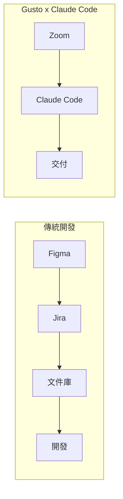
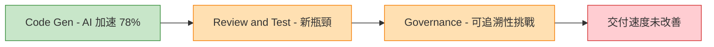

# AI Daily Digest — 2026-06-30

<!-- pipeline-generated:begin -->

## 🔥 今日 TOP 3
### 1. Anthropic Fable 5 遭美國出口管制阻斷，地緣政治成 Frontier AI 新風險
Anthropic 發布最新 frontier 模型 Fable 5，但隨即受美國出口管制政策限制，被迫調整原定發布與商業化計畫，部分市場或應用場景遭到阻斷。

這是首次有明確跡象顯示地緣政治因素能直接中斷頂尖 AI 模型的發布節奏。不同於過去僅因技術或商業原因調整計畫，出口管制的介入標誌著一個新轉折點——政府監管已成為決定 frontier AI 能否觸達市場的關鍵變數。對 Anthropic、OpenAI、Google 等依賴全球市場的 AI 公司而言，地緣風險需與技術風險同等納入產品路線圖規劃。

觀察重點包括：其他主要 AI 公司是否面臨類似限制、出口管制適用範圍是否進一步擴大、Anthropic 是否調整部署架構以因應。對 B2B 企業採購者，AI 供應鏈的監管穩定性應正式納入供應商評估標準，提前布局備援方案。

📖 [閱讀完整 insight](../10-insights/2026-06-29/inbox_6b2b87bb.md) · 🔗 [原文連結](https://medium.com/@adrianbuilds.dev/anthropic-shipped-fable-5-the-us-government-un-shipped-it-76349b325f93?source=rss------claude-5)
### 2. Gusto 5 人 × 10 週用 Claude Code 交付完整 AI 產品線
Gusto CTO Eddie Kim 公開分享真實案例：5 人工程團隊在 10 週內使用 Claude Code 從零到一完成完整 AI 產品線交付，全程不使用 Figma、Jira 或獨立文件庫，僅以 Zoom 維持溝通協調。

此案例提供了 AI 輔助開發生產力倍增的具體佐證。更關鍵的是，這來自一家在合規與可靠性上有高要求的 HR 科技公司，說明 AI 輔助開發已適用於嚴肅的企業場景。案例同時揭示副產品效應：極簡工具鏈（零 Figma/Jira）在 AI 加持下反而成為速度優勢，工具複雜性與生產力之間的傳統正相關被打破。

工程領導者可立即評估現有工具鏈哪些環節可被 AI 替代或消除，同時觀察更多企業是否複製此模式，以判斷這是可推廣的最佳實踐而非個案特例。

📖 [閱讀完整 insight](../10-insights/2026-06-29/inbox_ecc7f615.md) · 🔗 [原文連結](https://www.lennysnewsletter.com/p/no-figma-no-jira-no-docs-how-gusto)
### 3. GitLab：78% 開發者編碼提速，端到端交付卻未加快（AI 悖論）
GitLab 2026 年 AI 責任報告揭示「AI 悖論」：78% 的開發者自報使用 AI 編碼工具後程式碼生成速度顯著提升，但整體軟體交付周期並未因此縮短。根本原因在於下游的測試與審查環節成為新瓶頸，同時 AI 生成程式碼的版本追蹤與合規可追溯性帶來新的治理挑戰。

這份數據揭示一個可複製的系統性規律：AI 工具對「生成」環節的加速是真實的，但價值在下游流程中消散。對正在評估 AI 工具 ROI 的工程主管而言，只投資 AI coding 工具而不同步優化流程，最終業務交付速度不會改變，投資報酬被稀釋在測試、審查、治理等未解環節。

實務建議：部署 AI coding 工具前，先盤點 code review、QA、部署核准的現有瓶頸，將 AI 投資集中在真正制約端到端交付的環節，而非最容易量化的程式碼生成速度。

📖 [閱讀完整 insight](../10-insights/2026-06-29/inbox_a3d481bc.md) · 🔗 [原文連結](https://www.infoq.com/news/2026/06/ai-coding-outpaces-governance/?utm_campaign=infoq_content&utm_source=infoq&utm_medium=feed&utm_term=AI%2C+ML+%26+Data+Engineering)

## 📖 好文章 / 影片精選

_過去 30 天經 traffic 沉澱的高品質內容，按興趣領域分類。每篇只在 column 出現一次。_
### 🛠 工具版本追蹤 / Release
- **ruflo** · **[v3.15.0 — agenticow COW memory branching (4 MCP tools, +162-byte branches)](../10-insights/2026-06-29/inbox_8a4555e2.md)**
  Ruflo 發布 v3.15.0，整合 agenticow@~0.2.3 Copy-On-Write 記憶體分支技術，新增 4 個 MCP 工具（agenticow_branch、agenticow_checkpoint、agenticow_rollback、agenticow_promote）。解決了 v3.14.4 中 3.3GB tarball 膨脹回
### 🏢 企業導入 AI / 團隊實踐
- **infoq-ai-ml** · **[AI Tools Accelerates Coding, but Not Overall Software Delivery, GitLab Research Finds](../10-insights/2026-06-29/inbox_a3d481bc.md)**
  GitLab 2026 AI 責任報告發現一個引人注目的「AI 悖論」：報告數據顯示 78% 的開發者表示使用 AI 工具後代碼編寫速度顯著提升。然而整體軟體交付周期並未實現相應加速，這表明代碼速度提升並未自動轉化為交付速度提升。下游的測試與代碼審查已成為新的瓶頸，阻斷了加速收益。同時企業治理、版本追蹤和可追蹤性面臨新的複雜性挑戰。要釋放 AI 工具的完整價
### 🎓 AI 使用技巧 / 心法
- **hamel-husain** · **[“It’s Hard to Eval” Is a Product Smell](../10-insights/2026-06-29/inbox_c8de71dc.md)**
  Hamel Husain 於 3 年 AI evals 實務後提出「難以 eval」是產品設計反模式的論點：使用者難以驗證的工件對產品本身也造成問題，應先設計易驗證性再構建 evals。以 AI 資料代理為例，改善設計需提供可檢查工件（假設、中間計算、維度分解、SQL 審查、未驗證項標註）而非單純答案，參考資料科學家驗證指標的 6 大技巧：與可信來源比較、確
- **medium-towards-data-science** · **[Prompt Engineering Fails Quietly — Prompt Regression Is Why](../10-insights/2026-06-29/inbox_4272199e.md)**
  提示詞工程的無聲故障問題——提示詞的細微改動在生產環境中會悄無聲息地破壞關鍵行為，用戶難以立即察覺。文章介紹檢測提示詞迴歸(prompt regression)的實用框架與監測策略，強調在問題擴散前識別隱藏故障的必要性。
- **medium-tag-llm** · **[Previewing GPT‐5.6 Sol: a next-generation model](../10-insights/2026-06-29/inbox_96e15e3e.md)**
  OpenAI 發佈 GPT-5.6 Sol preview 版本，但生產環境團隊面臨兩難困境。開發團隊想要新功能的吸引力，但 on-call 值班人員必須保證系統穩定性。文章指出將 preview 模型當作 GA（正式版）使用，會造成衝突和問題。核心教訓是 preview 模型不該用於需要高穩定性的生產環境。開發團隊應建立明確的 preview vs GA 
### 💳 支付 / Fintech
- **infoq-main** · **[Presentation: Million PDFs: Building a Modern Document Infrastructure with Rust and Typst](../10-insights/2026-06-29/inbox_a13da625.md)**
  Erik Steiger 分享了用 Rust + Typst 無伺服器架構替代 Puppeteer / LaTeX 進行大規模 PDF 生成的方案。新架構將 render 延遲降到 2ms 以下，解決了銀行、製造等規範嚴格行業的傳統 PDF 引擎資源消耗與性能瓶頸問題。該方案借鑒 Git 和 Docker 概念管理範本庫，確保合規性並加速除錯流程，直接應對遺
### ⛓️ 區塊鏈 / Web3
- **substack-maxcryptospace** · **[推演 ETH 的三種劇本,我只押其中一種](../10-insights/2026-06-29/inbox_aa1eb4dd.md)**
  加密货币市场分析：关于 ETH（以太坊）价格演变的三种剧本推演，分析平台盈利与代币盈利之间的关系，探讨 ETH 翻身的多条路径。
### 🔐 AI 安全 / 濫用
- **infoq-ai-ml** · **[Article: Virtual panel: Security in the Machine Age: Expert Insights on AI Threat Evolution](../10-insights/2026-06-29/inbox_d23f600a.md)**
  這場虛擬座談會由 Claudio Masolo、Elham Arshad、Sabri Allani、Vijay Dilwale 和 Igor Maljkovic 等多位 AI 安全專家聯合主持。座談探討 AI 驅動威脅的演變軌跡，涵蓋 prompt injection（提示注入）、data poisoning（資料中毒）、agent abuse（代理濫用）和
### 🛤️ AI Flow 導入心得 / 技術分享
- **substack-lennys-newsletter** · **[No Figma. No Jira. No docs. How Gusto built a new product line with Claude Code | Eddie Kim (CTO)](../10-insights/2026-06-29/inbox_ecc7f615.md)**
  Gusto CTO Eddie Kim 分享了 5 人团队在 10 周内使用 Claude Code 从零开始构建完整 AI 产品线的真实案例。这个项目展示了 Claude Code 作为 AI 编程助手的生产力潜力。团队采取极简协作模式，完全摒弃了传统开发工具链：无 Figma 设计稿、无 Jira 任务管理系统、无独立文档库。沟通完全通过 Zoom 进行

## 💡 今日 Takeaway

_讀完今日所有內容後，可帶走的知識點_
### 1. 「難以 eval」是產品設計反模式——先設計可驗證輸出，再建 eval 機制
Hamel Husain 的核心洞察：當某個 AI 工件「很難建 evals」時，這本身就是產品設計的紅旗——使用者同樣難以驗證輸出是否正確。正確的設計順序是先讓輸出可驗證（提供假設清單、中間計算過程、SQL 查詢、未驗證項標注等可檢查工件），再建 evals 去測量它。這個框架適用於資料分析 agent、預測類產品、內容生成等任何「輸出難以快速驗真偽」的場景，可顯著降低使用者對 AI 工件的信任摩擦。

_類型：framework_

**參考來源**：
- [“It’s Hard to Eval” Is a Product Smell](../10-insights/2026-06-29/inbox_c8de71dc.md) · [原文](https://hamel.dev/blog/posts/eval-smell/)
### 2. AI 加速程式碼生成不等於加速交付——測試與審查瓶頸會吃掉所有收益
GitLab 大規模調查顯示，78% 開發者編碼提速，但端到端交付速度未見改善，原因是下游的測試自動化不足、審查流程與合規可追溯性成為新瓶頸。這揭示可複製的系統性規律：AI 的加速效果在工具層真實存在，但被未同步優化的流程層稀釋殆盡。評估 AI 工具 ROI 時，應以端到端交付時間為基準指標，而非單一環節速度；投資 AI coding 工具的同時，必須同步投資測試自動化與審查流程優化。

_類型：data-point_

**參考來源**：
- [AI Tools Accelerates Coding, but Not Overall Software Delivery, GitLab Research Finds](../10-insights/2026-06-29/inbox_a3d481bc.md) · [原文](https://www.infoq.com/news/2026/06/ai-coding-outpaces-governance/?utm_campaign=infoq_content&utm_source=infoq&utm_medium=feed&utm_term=AI%2C+ML+%26+Data+Engineering)
### 3. Prompt 細微改動會無聲破壞生產行為——版本化回歸測試是必要防護
生產環境中，看似微小的 prompt 措辭調整可能靜默地破壞關鍵行為，使用者在累積足夠投訴前完全無法察覺——這是「無聲故障」的典型樣態。應對方式是建立 prompt 回歸測試框架：對每次 prompt 改動進行行為快照比對，類似程式碼的 unit test。核心實踐包括：版本控制所有 prompt 變更、建立關鍵行為的黃金測試集、在 staging 驗收後才推送生產，確保 prompt 變更有與程式碼同等的品質閘。

_類型：framework_

**參考來源**：
- [Prompt Engineering Fails Quietly — Prompt Regression Is Why](../10-insights/2026-06-29/inbox_4272199e.md) · [原文](https://towardsdatascience.com/prompt-engineering-fails-quietly-prompt-regression-is-why/)
### 4. Preview 模型不保穩定——生產環境必須設立明確的 Preview vs GA 分界政策
AI 模型的 preview 與 GA（正式版）存在本質差異：前者提供最新能力但缺乏穩定性承諾，後者以可靠性為優先。混用兩者會在開發者（追求新功能）與 on-call 值班人員（保障穩定）之間製造優先級衝突，最終損害系統可靠性。企業應明確規定：preview 模型僅限實驗與功能評估環境，GA 模型才能進入生產，且每次升版前必須完成充分的回歸測試，如同對待任何基礎設施變更。

_類型：framework_

**參考來源**：
- [Previewing GPT‐5.6 Sol: a next-generation model](../10-insights/2026-06-29/inbox_96e15e3e.md) · [原文](https://medium.com/@sebuzdugan/previewing-gpt-5-6-sol-a-next-generation-model-adc4d74f7a8a?source=rss------large_language_models-5)

<!-- pipeline-generated:end -->

<!-- user-notes -->
<!-- Write your own notes below; pipeline never touches this section. -->