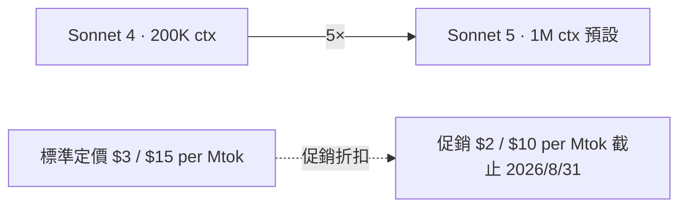
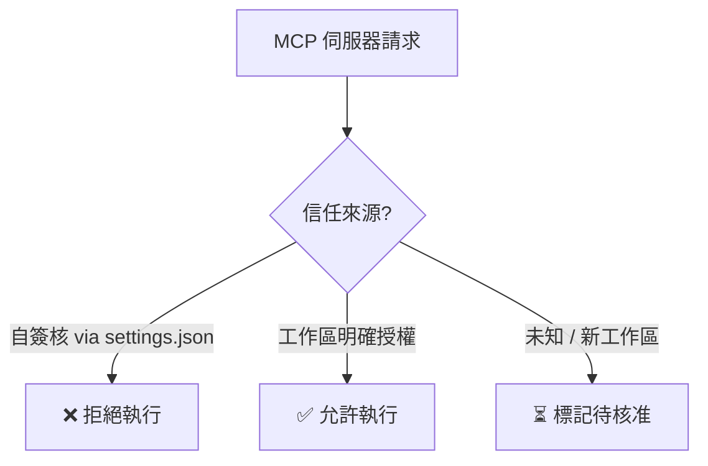

# AI Daily Digest — 2026-07-01

<!-- pipeline-generated:begin -->

## 🔥 今日 TOP 3
### 1. Claude Sonnet 5 升任預設：原生 1M token 窗口＋限期優惠定價
Anthropic 於 Claude Code v2.1.197 將 Claude Sonnet 5 設為預設模型，具備原生 100 萬 token 上下文窗口，並同步推出限時優惠定價：輸入 $2/百萬 token、輸出 $10/百萬 token，優惠期至 2026 年 8 月 31 日。

對開發者而言，1M token 上下文意味著可在單一會話中載入整個大型代碼庫（含測試、文件與歷史），相較於前代 200K 提升約 5 倍，直接消除大型專案「脈絡截斷」的痛點；搭配六至七折優惠定價，高頻開發工作流程的 API 成本顯著下降。

觀察重點在於 8 月 31 日優惠期結束後正式定價是否回調，以及 1M 上下文在推理速度與實際成本的表現。實務上可立即嘗試將完整 monorepo 載入上下文執行跨文件重構，評估長脈絡下準確度是否符合生產需求。

📖 [閱讀完整 insight](../10-insights/2026-06-30/inbox_ef12c898.md) · 🔗 [原文連結](https://github.com/anthropics/claude-code/releases/tag/v2.1.197)
### 2. Claude Code v2.1.196：MCP 安全強化、25% token 節省、任務自動恢復
Claude Code v2.1.196 帶來三大方向更新：組織層級預設模型設定（管理員可統一配置）、MCP 安全性強化（禁止執行 .claude/settings.json 自簽核的 .mcp.json 伺服器，未信任工作區標記待核准）、/code-review 工作流程整合優化（token 用量減少約 25%）；後台任務穩定性同步改善，支援進程重啟後自動恢復（Windows 已驗證）。

對企業用戶影響最深的是兩點：組織層級模型設定解決了團隊配置不一致的問題；MCP 安全強化回應了業界對 agent 工具鏈供應鏈攻擊的擔憂，自簽核伺服器不再能繞過工作區授權直接執行，顯著縮小攻擊面。

使用 MCP 工具鏈的團隊應立即檢視現有 .claude/settings.json 配置，確認伺服器符合新的信任授權要求，避免升級後工作流程中斷。/code-review token 節省 25% 直接轉化為 API 成本降低，高頻使用者可預期月度費用明顯改善。

📖 [閱讀完整 insight](../10-insights/2026-06-29/inbox_c3e4cc79.md) · 🔗 [原文連結](https://github.com/anthropics/claude-code/releases/tag/v2.1.196)
### 3. OpenAI GeneBench-Pro 上線：填補生命科學 AI 基準評測空白
OpenAI 推出 GeneBench-Pro，一套針對基因組學、生物學及科學研究領域設計的 AI 性能基準工具，採用複雜的真實世界資料集進行評估，旨在填補現有通用基準在生命科學領域的覆蓋空白。

主流 AI 基準（如 MMLU、HumanEval）對生命科學任務的評估能力有限，GeneBench-Pro 若能獲得學術界與產業廣泛採用，將成為比較各 AI 模型在基因研究場景下真實能力的共同語言，對製藥研發、精準醫療及生物資訊學領域的 AI 選型決策具有實質參考意義。

關鍵觀察點在於 GeneBench-Pro 的採用廣度——是否有多家主要 AI Lab 參與並公開排名，及評估方法是否通過同行評審。實務上，從事生命科學 AI 應用的團隊可將其作為模型初篩工具，但應留意基準設計者（OpenAI）可能存在的利益衝突，建議搭配第三方獨立驗證結果使用。

📖 [閱讀完整 insight](../10-insights/2026-06-30/inbox_4950420b.md) · 🔗 [原文連結](https://openai.com/index/introducing-genebench-pro)

## 📖 好文章 / 影片精選

_過去 30 天經 traffic 沉澱的高品質內容，按興趣領域分類。每篇只在 column 出現一次。_
### 🛠 工具版本追蹤 / Release
- **claude-code** · **[v2.1.197](../10-insights/2026-06-30/inbox_ef12c898.md)**
  Claude Code v2.1.197 推出 Claude Sonnet 5 作為預設模型，具備原生 100 萬 token 上下文窗口。同步提供限時優惠定價：輸入 $2/百萬 token，輸出 $10/百萬 token，優惠期至 2026 年 8 月 31 日。此版本升級使開發者能在代碼編輯中處理更大規模的專案上下文。
  _+ 1 個近期版本（v2.1.196，僅顯示最新）_
### 🏢 企業導入 AI / 團隊實踐
- **infoq-main** · **[AI Tools Accelerates Coding, but Not Overall Software Delivery, GitLab Research Finds](../10-insights/2026-06-29/inbox_0ffce227.md)**
  GitLab 2026 年 AI 責任報告揭示 AI 悖論現象：78% 的開發者報告編碼速度提升，但整體軟體交付時間並未加速。根本原因在於測試與審查環節的瓶頸未解決，以及企業治理、可追溯性等新挑戰的出現。這說明 AI 工具在程式生成層的提速未能轉化為端到端的交付效率改善，投資回報需要系統性的流程優化才能實現。
- **infoq-architecture** · **[Inside Target’s LLM-Based System for Semantic Matching in Marketing Forecast Pipelines](../10-insights/2026-06-29/inbox_89cfd176.md)**
  Target 設計並實施了一套基於生成式 AI 的系統用於行銷活動預測。該系統的核心思路是通過 embeddings 和向量搜尋技術檢索相似的歷史行銷活動，再用 LLM 對候選項進行排名，最後產生預測建議。相比傳統的基於規則的工作流，新系統顯著簡化流程並降低人工干預需求。系統的評估指標顯示 75% 的 top-1 精確匹配和 100% 的 top-3 覆蓋率
### 🎓 AI 使用技巧 / 心法
- **medium-tag-claude** · **[The 3-Step Framework for “God-Level” AI Prompts (Stop Settling for Average Outputs)](../10-insights/2026-05-31/inbox_55a6bf1e.md)**
  作者提出三步驟進階提示詞框架，反駁一句話提示詞產出「機器人般」通用內容的問題。框架包含：(1) 超具體角色定義（包含寫作風格、影響來源、方法論）而非籠統「專家」(2) 嚴格條件限制（句長上限、禁用詞彙、格式要求）(3) 輸入輸出綱要（CONTEXT、ROLE、CONSTRAINTS、INPUT、OUTPUT SCHEMA 標籤化結構）。宣稱此法提升輸出品質 
- **medium-tag-claude** · **[A practical guide to structuring an AI agent repository — and why every folder matters](../10-insights/2026-05-31/inbox_8996d370.md)**
  AI Agent 倉庫結構指南建議以 `.github/`（含 copilot-instructions.md、instructions/、agents/、skills/、mcp/、workflows/）、prompts/、hooks/、plugins/、.claude/ 等核心目錄組織。copilot-instructions.md 作基礎規則檔、inst
- **medium-towards-data-science** · **[How to Combine Claude Code and Codex for Maximum Coding Power](../10-insights/2026-06-01/inbox_f37075ef.md)**
  文章介紹結合 Claude Code 與 Codex 兩個編碼模型打造強大編碼環境的方法。原文內容極簡，無提供具體技巧、架構或使用場景細節。
- **medium-tag-llm** · **[Beyond Copilots: The Rise of the Agentic Enterprise](../10-insights/2026-06-01/inbox_d485075a.md)**
  主張企業 AI 下一階段轉變：從 Copilot 的被動問答模式升級至主動「協調結果」（outcome orchestration）。核心框架是企業代理應驅動業務結果而非僅提供資訊。原文未展開案例。
- **medium-tag-llm** · **[Hallucination Resistance, Part 2](../10-insights/2026-06-01/inbox_194be923.md)**
  文章第二部分聚焦**監督微調（SFT）**作為後訓練方法減少 LLM 幻覺。三大後訓練策略：持續預訓練（CPT）注入新知識、SFT 修改行為、偏好調整對齐人類意圖。SFT 使用標記 QA 對示範忠實答案或適當拒絕。低秩適應（LoRA）訓練「少於 1% 的參數」透過可訓練低秩矩陣，模組化適配器可插拔。訓練最佳化：梯度累積、檢點化、學習率 1e-4～2e-4（7
### 🔐 AI 安全 / 濫用
- **infoq-architecture** · **[Article: Virtual panel: Security in the Machine Age: Expert Insights on AI Threat Evolution](../10-insights/2026-06-29/inbox_65126273.md)**
  這場虛擬座談會由 Claudio Masolo、Elham Arshad、Sabri Allani、Vijay Dilwale 和 Igor Maljkovic 等多位 AI 安全專家聯合主持。座談探討 AI 驅動威脅的演變軌跡，涵蓋 prompt injection（提示注入）、data poisoning（資料中毒）、agent abuse（代理濫用）和
- **medium-tag-llm** · **[PromptFlux and LLM-Aware Malware: The Next Evolution of Cyber Threats](../10-insights/2026-06-25/inbox_877f248c.md)**
  介紹一類新型網路威脅：LLM 感知的惡意軟體。組織在採用 AI 防禦網路威脅的同時，攻擊者也在利用 LLM 能力開發更精巧的攻擊向量。「PromptFlux」可能是此類威脅的具體示例或工具名稱，標誌著攻防雙方都在 AI 武器化。
### 🛤️ AI Flow 導入心得 / 技術分享
- **medium-towards-data-science** · **[Solving a Murder Mystery Using Bayesian Inference](../10-insights/2026-05-31/inbox_b943c870.md)**
  Towards Data Science 發表文章，透過電影《Knives Out》的謀殺案例展示貝葉斯推理的實際應用。文章用戲劇情節解釋條件概率、證據更新等統計概念，讓抽象的貝葉斯思維變得直觀易懂。此教學方式展示貝葉斯推理如何在複雜推理場景中指導判斷，對數據科學和 AI 從業者理解概率推理有啟蒙價值。
- **medium-tag-llm** · **[.md Files: The Quiet Kid Who Runs the Entire AI Classroom](../10-insights/2026-05-31/inbox_1f13adb0.md)**
  Markdown 文檔（PRD、schema 等）正成為 AI 驅動軟體開發的核心基礎設施。簡單的文檔系統實際上推動整個 AI 開發流程。該觀點挑戰傳統複雜工具依賴，倡導用結構化 Markdown 作為開發「作業系統」。對 AI 專案開發流程設計提供實踐啟示。
- **medium-tag-claude** · **[I use Claude Code every day. So I built the cheatsheet I always wished existed.](../10-insights/2026-05-31/inbox_56118b3f.md)**
  開發者 Arushi 在使用 Claude Code 超過 6 個月後整理出速查表。工具應用涵蓋代碼編寫、功能規劃、PR 審查、代碼搜索等完整工作流。該發布反映 Claude Code 已成為日常開發環境的核心工具，推動社群編製最佳實踐文檔。
- **substack-lennys-newsletter** · **[A rational conversation on where AI is actually going | Benedict Evans](../10-insights/2026-05-31/inbox_ccd0fa47.md)**
  Benedict Evans 在 Lenny's Newsletter 提出 AI 發展的宏觀時序框架：AI 當前處於 1997 年網際網路時刻的類比階段——基礎設施革新初期、充滿不確定性與巨大機遇。他質疑主流「AI 奪工作」論述，指出該敘事忽略產業結構重組的真實動力。真正價值累積不在直接自動化替代，而在於重新配置經濟結構。這個框架將 AI 評估從短期職位損
- **medium-tag-llm** · **[Open-Source AI Avatars Are Finally Becoming Useful](../10-insights/2026-05-31/inbox_b5896879.md)**
  作者在體驗 LongCat-Video-Avatar 1.5 後，認為開源 AI 虛擬人物技術已達到實務應用成熟度。觀點轉向從單純展示技術演示轉為評估真實商業應用可行性，反映開源虛擬人物生態從概念驗證邁向實際部署的轉變。

## 💡 今日 Takeaway

_讀完今日所有內容後，可帶走的知識點_
### 1. MCP 工具鏈需區分自簽核與外部授權兩層信任邊界
Claude Code 強化 MCP 安全機制，明確禁止透過 .claude/settings.json 自我核准的 MCP 伺服器直接執行，改要求工作區外部授權才可信任。這個設計原則適用於所有插件或 agent 工具系統：自我授權不等於信任，需有獨立的驗證層把關，否則惡意插件可繞過主系統安全控制直接執行。實務上設計 agent 工具鏈時，應為第三方工具引入「外部核准清單」機制，並在 CI/CD 流程中驗證工具來源的合法性。

_類型：pattern_

**參考來源**：
- [v2.1.196](../10-insights/2026-06-29/inbox_c3e4cc79.md) · [原文](https://github.com/anthropics/claude-code/releases/tag/v2.1.196)
### 2. 多步 LLM 呼叫整合為單次結構化查詢可節省 ~25% token
Claude Code /code-review 工作流程透過將多個分散的 LLM 呼叫合併為單一整合式 checker，減少了約 25% token 消耗。核心設計模式是：將中間狀態折疊進結構化 prompt 而非多次往返，既減少 round trips，也消除重複 context 的冗餘 token 浪費。設計多步驟 AI pipeline 時，可先評估哪些評估步驟能在同一 context 內並行處理，將「多次分批查詢」壓縮為「一次結構化查詢」，直接轉化為 API 成本節省。

_類型：technique_

**參考來源**：
- [v2.1.196](../10-insights/2026-06-29/inbox_c3e4cc79.md) · [原文](https://github.com/anthropics/claude-code/releases/tag/v2.1.196)
### 3. 長時間 agent 任務應內建 checkpoint 機制以支援進程崩潰後自動恢復
Claude Code 後台任務穩定性改善後，長時間命令和工作流程能在進程重啟後自動恢復。這體現出一個關鍵的 agent 設計原則：對超過數分鐘的任務，狀態持久化（checkpoint）是必要設計而非可選優化——若任務在第 80% 時崩潰，應能從最近 checkpoint 恢復而非從頭執行。實務上建議在每個關鍵步驟後儲存狀態快照，並明確驗證不同作業系統（包括 Windows）下的恢復機制可靠性。

_類型：pattern_

**參考來源**：
- [v2.1.196](../10-insights/2026-06-29/inbox_c3e4cc79.md) · [原文](https://github.com/anthropics/claude-code/releases/tag/v2.1.196)

<!-- pipeline-generated:end -->

<!-- user-notes -->
<!-- Write your own notes below; pipeline never touches this section. -->